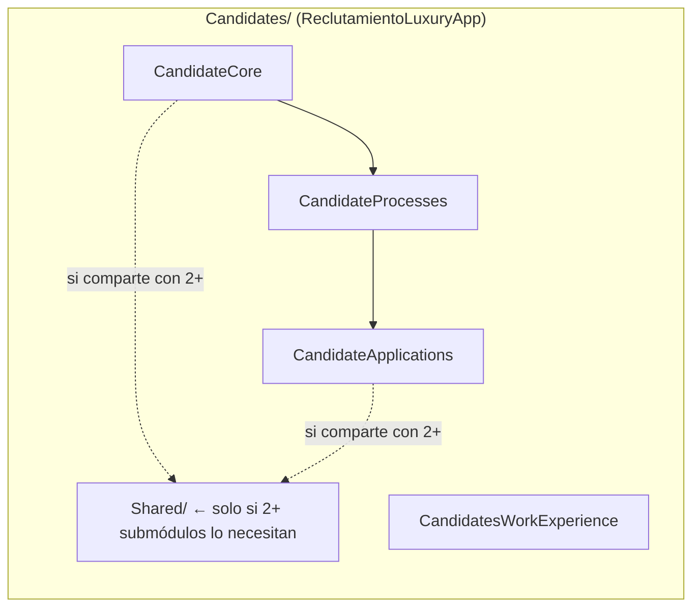
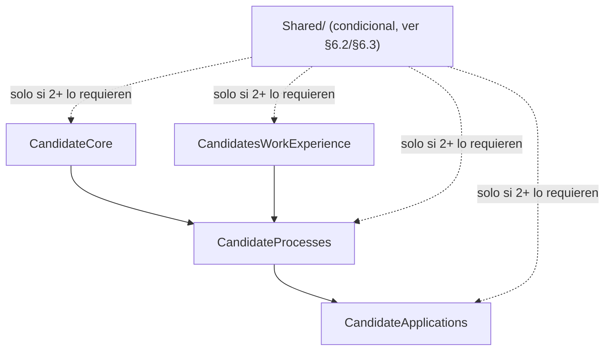

# 📁 CONVENTIONS_FOLDER_API.MD — Reglas de Directorios, Namespaces y Ubicación de Archivos (Backend)

> ✨ Actualizado por **Tech Lead** — **2026-09-09**  
> Fundamento: `CONVENTIONS.md` (sistema rector vigente 2026-08-12).  
> Solo reglas referentes a **dónde vive el código y los documentos** del **backend** (`api/LuxuryApp.Application/`).  
> ℹ️ Este documento se separó de `CONVENTIONSFOLDER.MD` (renombrado) el 2026-09-09 para independizar backend y frontend. La contraparte frontend vive en [`CONVENTIONS_FOLDER-FRONT.MD`](CONVENTIONS_FOLDER-FRONT.MD).

---

## 1️⃣ Reglas Fundamentales de Ubicación

### 📜 §3.4 — Respetar naming, estructura y ubicación

Nombres, carpetas, archivos y **namespaces** siguen catálogos oficiales.  
No se asume ubicación; se verifica contra el path físico.

### 🚫 §3.8 — No reubicar por iniciativa propia

Si la ubicación correcta no está clara:

- **Creación nueva:** proponer y esperar aprobación.
- **Código existente:** reportar o incluir en plan de migración.

### 📄 §3.9 — Documentos obedecen convenciones

Ubicación exacta, nombre exacto, estructura mínima obligatoria.  
Actualizar documento existente antes de crear duplicados.

---

## 2️⃣ 🟦 Namespaces Backend — Derivados del Path (POLÍTICA ÚNICA)

> **🔴 REGLA ÚNICA:** El `namespace` de **todo** archivo `.cs` en  
> `LuxuryApp.Application/` se construye **siguiendo la ruta física de carpetas,
> sin prefijo de proyecto (`LuxuryApp.Application.`) y sin el contenedor
> organizativo `Modules/`**. No existen namespaces fijos por tipo de pieza;
> el namespace se deriva del path, con una única excepción deliberada:
> `Modules/` es un contenedor físico de agrupación (mantiene ordenado el
> Explorador de Soluciones) que **no** cuenta como segmento de namespace.
>
> 📌 **Aplica por igual a todos los módulos, `Shared/` e `Infrastructure/`.** Todos empiezan el namespace directamente en su propio nombre (`AdminLuxuryApp.X`, `Shared.X`, `Infrastructure.X`), sin prefijo de proyecto — `Shared/` e `Infrastructure/` viven además fuera de `Modules/`, directo bajo `LuxuryApp.Application/`. El 2026-09-11 se eliminó el prefijo `LuxuryApp.Application.` de todos los namespaces (3,000+ archivos); `Modules/` como carpeta física se mantiene (decisión explícita del Tech Lead) pero, igual que antes, nunca aparece en el namespace.
>
> ⚠️ **Riesgo de colisión a vigilar:** al no haber un prefijo raíz único, un segmento corto que existe en más de un nivel (`Shared/` reutilizado por diseño en submódulo, módulo y raíz — ver §6.1) puede quedar sombreado por resolución de namespace relativa. Regla completa y ejemplo real en **§6.1bis**.
>
> ⚠️ **Rutas físicas hardcodeadas SÍ deben incluir `Modules/`** — a diferencia del namespace, cualquier string de ruta de archivo en código (`Path.Combine`, identificadores de vistas Razor precompiladas, etc.) usa la ruta física real y por tanto **sí** lleva el segmento `Modules/`. Ejemplos reales: `EmailTemplates.FeaturesRoot = "/Modules/SystemLuxuryApp/SendEmailGlobal"`, rutas en `MockAspelDataSeeder.cs` y `UpdateDataBaseService.cs`.

### 🧩 Ejemplo (verificado contra namespace real declarado en el archivo, no solo contra el path)

```
api/LuxuryApp.Application/
└── Modules/                          ← contenedor físico, NO aparece en el namespace
    └── AdminLuxuryApp/
        └── CatalogosGenerales/
            └── Banks/
                └── Services/
                    └── BankAppService.cs
```

→ `namespace AdminLuxuryApp.CatalogosGenerales.Banks.Services;` (confirmado leyendo el archivo real, 2026-09-11)

> ✅ **Corregido 2026-09-11:** el hallazgo previo sobre `ReclutamientoLuxuryApp/Candidates/` (58 archivos con un segmento `NewFolder` que no existía en la ruta física, y que en el caso de `CandidateCore` tampoco coincidía con el nombre real del submódulo) se corrigió el mismo día. `Candidate.cs` en `CandidateCore/Entities/` declara ahora `namespace ReclutamientoLuxuryApp.CandidateCore.Entities;`, coincidiendo con su ruta física real (bajo `Modules/`, que no cuenta para el namespace).

---

## 3️⃣ 🟨 Convenciones de Número y Naming

| Capa | Regla | Ejemplo |
|------|--------|----------|
| 📁 Carpeta / Namespace | **Plural** | `Candidates/`, `Employees/`, `Banks/` |
| 🏷️ Clase / Entidad | **Singular** | `Candidate`, `Employee`, `Bank` |

**Resultado esperado:**

| Artifact | Nombre | Comentario |
|----------|--------|------------|
| Namespace | `...Candidates.Services` | Plural |
| Clase | `CandidateService` | Singular |
| Archivo | `CandidateService.cs` | Singular (coincide con la clase) |

✅ **Sin colisión** entre namespace y clase.

---

## 4️⃣ 🟩 Reglas de DTOs (NUEVAS — vigentes desde 2026-09-09)

### 🔢 §4.1 — Sufijo obligatorio

Todos los DTOs terminan en **mayúsculas `DTO`**.

| ✅ Correcto | ❌ Incorrecto |
|-------------|---------------|
| `CandidateDetailDTO.cs` | `CandidateDetailDto.cs` |
| `CandidateCreateOrUpdateDTO.cs` | `CandidateDTOs.cs` |

### 📦 §4.2 — Un DTO por clase

- Cada clase que contenga un DTO debe tener **solo un DTO**.
- No se permiten múltiples DTOs en el mismo archivo.

```text
✅ Estructura correcta:
Candidates/
└── Shared/
    └── DTOs/
        ├── CandidateBaseDTO.cs
        ├── CandidateContactDTO.cs
        └── CandidateSummaryDTO.cs

❌ Estructura incorrecta:
Candidates/
└── DTOs/
    └── CandidateDTOs.cs   ← múltiples DTOs en un archivo
```

### 📍 §4.3 — Ubicación

- Todos los DTOs viven en carpeta `DTOs/` dentro del submódulo correspondiente.
- Si son compartidos entre varios submódulos, se ubican en `Shared/DTOs/`.

---

## 5️⃣ 🟦 Reglas de Submódulos

### 🎯 §5.1 — Unicidad

Cada submódulo vive en un **único módulo padre**.  
Ejemplo real (verificado en código): `Candidates` vive solo en `ReclutamientoLuxuryApp` — `ReclutamientoLuxuryApp/Candidates/`.

### 🔒 §5.2 — Aislamiento y regla de oro de `Shared/`

No se permiten dependencias cruzadas entre submódulos hermanos (ej. `CandidateCore` no referencia directamente clases internas de `CandidateProcesses`).

> **🔴 REGLA DE ORO — `Shared/` NO es el lugar por defecto:**
> Una carpeta `Shared/` a nivel de grupo (ej. `Candidates/Shared/`) **solo** existe para DTOs, interfaces, servicios o helpers que son consumidos por **2 o más** de sus submódulos hermanos.
>
> - ✅ Usado por `CandidateCore` **y** `CandidateApplications` → va en `Candidates/Shared/`.
> - ❌ Usado **solo** por `CandidateCore` → va en `CandidateCore/DTOs/` (o `Interfaces/`, `Services/`), **no** en `Shared/`.
>
> Cada submódulo (`CandidateCore/`, `CandidateProcesses/`, `CandidateApplications/`, `CandidatesWorkExperience/`) mantiene su **propia** estructura completa de `DTOs/`, `Interfaces/`, `Services/`, `Entities/`, `EndPoints/`, `Mappings/` — igual que cualquier módulo, por §3.4/CONVENTIONS.md. `Shared/` no reemplaza esa estructura, la complementa solo para lo verdaderamente compartido.
>
> **Ejemplo real de esta misma regla un nivel arriba:** `ReclutamientoLuxuryApp/Shared/Policies/` (`IHrActionPolicyService` / `HrActionPolicyService`) existe porque la política de acciones de RH la consumen varios grupos hermanos de `Candidates` dentro de `ReclutamientoLuxuryApp` (p. ej. `RequestDismissals`, `SalaryModifications`). El mismo criterio de "2+ consumidores" aplica en cualquier nivel de anidamiento, no solo dentro de `Candidates/`.



> Hoy, `ReclutamientoLuxuryApp/Candidates/` **no tiene** carpeta `Shared/` — cada uno de los 4 submódulos es autosuficiente (ver §6.2). Créala únicamente cuando aparezca una necesidad real de 2+ submódulos.

### 🏷️ §5.3 — Naming plural/singular

- 📁 **Carpetas:** plural (`CandidatesWorkExperience/`)
- 🏷️ **Clases:** singular (`CandidateWorkExperience`)

### ⚠️ §5.4 — Antipatrón de colisión

Prohibido que una carpeta tenga el mismo nombre que una clase existente.

| ❌ Colisión | ✅ Resolución |
|-------------|--------------|
| `Candidate/` + `class Candidate` | `CandidateCore/`, `CandidateProcesses/`, `CandidateApplications/`, `CandidatesWorkExperience/` |

---

## 6️⃣ 📐 Dónde vive cada cosa: submódulo propio, Shared de grupo, Shared de módulo, `SharedLuxuryApp` o `Shared` raíz

### 🌳 §6.1 — Árbol de decisión (aplícalo en este orden)

1. **¿Solo lo usa un submódulo?** → vive dentro de ESE submódulo (`DTOs/`, `Interfaces/`, `Services/`, etc.). No crear ni tocar ningún `Shared/`.
2. **¿Lo usan 2+ submódulos del mismo grupo?** (ej. `CandidateCore` y `CandidateApplications` dentro de `Candidates`) → `Candidates/Shared/`.
3. **¿Lo usan 2+ grupos del mismo módulo `[Nombre]LuxuryApp`?** (ej. `Candidates` y `RequestDismissals` dentro de `ReclutamientoLuxuryApp`) → `[Nombre]LuxuryApp/Shared/` — ejemplo real: `ReclutamientoLuxuryApp/Shared/Policies/`.
4. **¿Es lógica/entidad de NEGOCIO usada por 2+ módulos `LuxuryApp` distintos?** (ej. `ResponsablesCliente` lo necesitan Cobranza, Legal y Mantenimiento) → `SharedLuxuryApp/` — ver §6.6.
5. **¿Es una capacidad TÉCNICA/infraestructura sin significado de negocio, usable por cualquier módulo exista o no relación de dominio?** (envío de email, storage de archivos, usuario/tenant actual, export a Excel) → `api/LuxuryApp.Application/Shared/` (raíz, sin sufijo `LuxuryApp`) — ver catálogo completo en §12.

### ⚠️ §6.1bis — Cómo referenciar cualquier `Shared/` sin ambigüedad de namespace

El árbol de §6.1 reutiliza **a propósito** el nombre `Shared` en 3 niveles distintos: submódulo (`Candidates/Shared/`), módulo (`ReclutamientoLuxuryApp/Shared/`) y raíz (`api/LuxuryApp.Application/Shared/`). Esto es intencional — cada nivel resuelve un alcance de compartición distinto (ver §6.1) — pero tiene una consecuencia técnica que hay que manejar explícitamente: escribir la ruta calificada a mano (`Shared.Enums.X`, `Shared.Policies.X`) desde un archivo anidado dentro de un módulo/grupo que **también** tiene su propia carpeta `Shared/` es ambiguo. C# resuelve el primer segmento (`Shared`) buscando primero en los namespaces que envuelven al archivo, de adentro hacia afuera, y se queda con la **primera** coincidencia — casi siempre el `Shared/` más cercano (del módulo/grupo), no el que se quiso referenciar. No sigue buscando hacia afuera una vez que encuentra un candidato parcial.

**Regla obligatoria:**

1. ✅ **Preferido — nombre simple del tipo.** `GlobalUsings.cs` ya expone cada tipo de cada `Shared/` por su nombre simple (`AspelEmpresa`, no `Shared.Enums.AspelEmpresa`). Usa el nombre simple; no hay ambigüedad posible mientras no exista otro tipo con el mismo nombre simple en el proyecto.
2. ✅ **Si necesitas ser explícito, o hay colisión real de nombres de tipo**, califica con `global::`: `global::Shared.Enums.AspelEmpresa` para el `Shared/` de la raíz, `global::ReclutamientoLuxuryApp.Shared.Policies.X` para un `Shared/` de módulo, `global::ReclutamientoLuxuryApp.Candidates.Shared.DTOs.X` para uno de grupo. `global::` fuerza la resolución desde la raíz absoluta del namespace global, saltándose la búsqueda relativa que causa la ambigüedad.
3. ❌ **Nunca** escribas `Shared.X.Y` a secas (sin `global::`) dentro de un archivo cuyo namespace anida bajo un módulo o grupo que también tiene su propia carpeta `Shared/` — puede compilar apuntando al `Shared/` equivocado en vez de fallar, o fallar con `CS0234` si el `Shared/` más cercano no tiene ese sub-namespace.

**Ejemplo real (`ContabilidadLuxuryApp`, corregido 2026-09-11):** `AutitoriaCuentasAspelService.cs` y ~20 archivos más de `ContabilidadLuxuryApp/` usan `global::Shared.Enums.AspelEmpresa` en vez de `Shared.Enums.AspelEmpresa`, porque `ContabilidadLuxuryApp/Shared/` también existe (sin `Enums` adentro) y sombreaba la resolución.

### ✅ §6.2 — Ejemplo real verificado: `Candidates/` HOY (sin `Shared/`, cada submódulo autosuficiente)

Estructura real en `d:\repos\luxuryapp-api\api\LuxuryApp.Application\ReclutamientoLuxuryApp\Candidates\` (verificado 2026-09-11):

```tree
ReclutamientoLuxuryApp/
└── Candidates/
        ├── CandidateCore/
        │   ├── DTOs/
        │   ├── EndPoints/
        │   ├── Entities/
        │   ├── Interfaces/
        │   ├── Mappings/
        │   └── Services/
        ├── CandidateProcesses/
        │   ├── DTOs/
        │   ├── EndPoints/
        │   ├── Entities/
        │   ├── Interfaces/
        │   └── Services/
        ├── CandidateApplications/
        │   ├── Interfaces/
        │   └── Services/
        └── CandidatesWorkExperience/
            ├── DTOs/
            ├── EndPoints/
            ├── Entities/
            ├── Interfaces/
            ├── Mappings/
            └── Services/
```

Ningún submódulo referencia una carpeta `Shared/` dentro de `Candidates/` porque hasta hoy nada se comparte entre 2+ de ellos. **No crear `Candidates/Shared/` de forma preventiva** — créala solo cuando exista un caso real de duplicación (regla §5.2).

### 🧩 §6.3 — Cuándo SÍ se justifica `Candidates/Shared/` (ejemplo ilustrativo, aún no existe en el repo)

Supongamos que `CandidateCore` y `CandidateApplications` necesitan ambos un DTO ligero con los datos mínimos de un candidato (Id, nombre, email) para armar tarjetas/listas. Como lo consumen **2 submódulos**, corresponde moverlo a `Shared/`:

```tree
Candidates/
├── Shared/                         ← SOLO lo que usan 2+ submódulos
│   └── DTOs/
│       └── CandidateBaseDTO.cs     ← consumido por CandidateCore Y CandidateApplications
├── CandidateCore/
│   └── DTOs/
│       └── CandidateDetailDTO.cs   ← usado SOLO aquí → se queda aquí, no sube a Shared
├── CandidateProcesses/
├── CandidateApplications/
│   └── DTOs/
│       └── CandidateSummaryDTO.cs  ← usado SOLO aquí → se queda aquí, no sube a Shared
└── CandidatesWorkExperience/
```

```csharp
// ✅ Correcto: usado por 2+ submódulos → Shared del grupo
namespace ReclutamientoLuxuryApp.Candidates.Shared.DTOs;

public class CandidateBaseDTO
{
    public Guid Id { get; set; }
    public string FullName { get; set; } = string.Empty;
    public string Email { get; set; } = string.Empty;
}
```

```csharp
// ❌ Incorrecto: CandidateDetailDTO solo lo usa CandidateCore, NO debe vivir en Shared/
namespace ReclutamientoLuxuryApp.Candidates.Shared.DTOs; // ❌

// ✅ Debe vivir en su propio submódulo:
namespace ReclutamientoLuxuryApp.Candidates.CandidateCore.DTOs;

public class CandidateDetailDTO
{
    public Guid Id { get; set; }
    public string FullName { get; set; } = string.Empty;
    // ... campos exclusivos del detalle, nadie más los necesita
}
```

### 📏 §6.4 — Profundidad estándar: 4 niveles (caso normal, real y verificado)

Se cuentan todos los segmentos del namespace (ya no hay prefijo de proyecto que descontar):

```
ReclutamientoLuxuryApp/Candidates/CandidateCore/Entities/Candidate.cs
└──1──────────────────┘└──2────┘└────3──────┘└───4────┘
namespace ReclutamientoLuxuryApp.Candidates.CandidateCore.Entities;
```

`[Módulo].[Grupo].[Submódulo-o-Shared].[Categoría]` = **4 niveles**. Este es el caso por defecto para prácticamente cualquier archivo dentro de un submódulo real o dentro de un `Shared/` de grupo (`Candidates/Shared/DTOs` también son 4 niveles: `ReclutamientoLuxuryApp.Candidates.Shared.DTOs`).

### 📏 §6.5 — Excepción: 5 niveles (solo con subdominio funcional intermedio, ej. `AdminLuxuryApp`)

Ocurre cuando el módulo tiene un **grupo funcional** que agrupa varios submódulos reales, y ese grupo funcional necesita su propio `Shared/`. Ejemplo real de la capa base (verificado): `AdminLuxuryApp/CatalogosGenerales/Banks/DTOs/` — grupo funcional `CatalogosGenerales` agrupa `Banks`, `MetodoPago`, `UsoCfdi`, etc. Si dos de esos catálogos necesitaran compartir un DTO, el 5º nivel aparece así (ilustrativo, no existe hoy):

```
AdminLuxuryApp/CatalogosGenerales/Shared/DTOs/CatalogoBaseDTO.cs
└────1──────┘└──────2─────────┘└──3──┘└──4─┘
namespace AdminLuxuryApp.CatalogosGenerales.Shared.DTOs;
```

Aquí `[Módulo].[GrupoFuncional].Shared.[Categoría]` ya son 4 segmentos igual que el caso estándar — el 5º nivel real solo aparece si, además, existe un submódulo propio dentro del grupo funcional que a su vez necesita un `Shared/` interno (ej. `CatalogosGenerales/Banks/Shared/DTOs/` si `Banks` tuviera sub-submódulos). Por eso §10 marca este caso como **excepción que requiere aprobación explícita del Tech Lead** — no es el diseño por defecto de ningún módulo nuevo.

### 🏢 §6.6 — Criterio: `SharedLuxuryApp/` vs `api/LuxuryApp.Application/Shared/` (raíz)

Son dos carpetas con nombres parecidos pero propósitos **opuestos**. La confusión más común es meter infraestructura técnica en `SharedLuxuryApp` o meter lógica de negocio en `Shared/` raíz — ambos son errores.

| Criterio | `SharedLuxuryApp/` | `api/LuxuryApp.Application/Shared/` (raíz) |
|----------|------------------------------|----------------------------------------------|
| **Naturaleza** | Módulo de negocio más (es un `[Nombre]LuxuryApp` como cualquier otro) | Infraestructura técnica transversal, sin sufijo `LuxuryApp` |
| **Qué contiene** | Servicios de aplicación / Endpoints que orquestan **entidades y reglas de negocio** usadas por 2+ módulos `LuxuryApp` | Servicios, DTOs, extensions, enums y constantes **sin significado de negocio** |
| **¿Tiene `Entities/`?** | No directamente — opera sobre entidades que viven en otros módulos, expone `Services/`, `Interfaces/`, `EndPoints/` de orquestación | No — son abstracciones técnicas (`IFileProvider`, `ISendEmailService`) |
| **Ejemplo real verificado** | `SharedLuxuryApp/ResponsablesCliente/` (`IResponsablesClienteAppService`) — el concepto "responsable de un cliente" lo usan varios módulos de negocio; `SharedLuxuryApp/Services/GenerateFolioService.cs` — numeración de folios usada en Compras, Cobranza, etc. | `Shared/Services/ISendEmailService`, `IFileProvider`, `ICurrentUserService`, `IExportToExcelService` (catálogo completo en §12) |
| **Pregunta de prueba** | "¿Esto modela un CONCEPTO o PROCESO de negocio (folio, responsable, política) que 2+ módulos de dominio necesitan?" → si sí, aquí | "¿Esto seguiría existiendo igual si la app fuera de otro giro de negocio completamente distinto?" → si sí, aquí |
| **Registro DI** | Igual que cualquier módulo (`IServiceCollection` extension del módulo) | Registrado una sola vez en el composition root de infraestructura |

> 🔴 **Regla de desempate:** si dudas, pregúntate primero si lo que vas a crear tiene **entidades/reglas de negocio** detrás (aunque sea compartidas) → `SharedLuxuryApp`. Si es una capacidad puramente **mecánica/técnica** (leer un archivo, mandar un correo, saber quién es el usuario actual) → `Shared/` raíz. Antes de crear algo nuevo en cualquiera de las dos, grep ambas carpetas — no dupliques ni la una ni la otra.

---

## 7️⃣ 🔄 Flujo conceptual del módulo `Candidates`

```
Candidates/
├── CandidateCore/            ← Ficha maestra del candidato
├── CandidateProcesses/       ← Pipeline operativo con vacantes
├── CandidateApplications/    ← Automatización y monitoreo
├── CandidatesWorkExperience/ ← Historial laboral estructurado
└── Shared/                   ← SOLO si aparece necesidad real de 2+ submódulos (ver §6.2 — hoy no existe)
```

**Flujo de datos:**



| Submódulo | Responsabilidad |
|-----------|-----------------|
| **CandidateCore** | Ficha maestra del candidato |
| **CandidateProcesses** | Pipeline operativo con vacantes |
| **CandidateApplications** | Automatización y monitoreo |
| **CandidatesWorkExperience** | Historial laboral estructurado |
| **Shared** *(condicional)* | Solo lo que consumen 2+ submódulos — ver §6.2/§6.3. No existe hoy en el repo real. |

---

## 8️⃣ ✅ Auditoría de convenciones (Checklist para PRs)

| ✅ Ítem | Checklist |
|--------|-----------|
| 1 | Clases en **singular** (`Candidate`, no `Candidates`) |
| 2 | 📁 Carpetas en **plural** (`Candidates/`, no `Candidate/`) |
| 3 | Namespace **path-based**, sin prefijo de proyecto (§2) |
| 4 | DTOs terminan en **`DTO`** mayúsculas (`CandidateDetailDTO`) |
| 5 | **Un DTO por clase** (no `CandidateDTOs.cs`) |
| 6 | 📁 DTOs en carpeta `DTOs/` de su propio submódulo; solo suben a `Shared/DTOs/` si los usan 2+ submódulos (§6.1) |
| 7 | Helpers y Utilities **separados** y **estáticos** |
| 8 | Interfaces en `Interfaces/` con prefijo `I` (`ICandidateBase`) |
| 9 | **Sin colisiones** de nombres entre carpetas y clases |
| 10 | 📄 Documentación `README.md` por submódulo |
| 11 | Referencias a `Shared.X.Y` sin `global::` solo dentro de código sin `Shared/` propio anidándolo (§6.1bis) |

---

## 9️⃣ 📝 Ejemplo de namespace completo

> Este es el namespace **correcto según la política única (§2)** para esta ruta, y coincide con el estado real del archivo (`Candidate.cs`) desde el 2026-09-11.

```csharp
namespace ReclutamientoLuxuryApp.Candidates.CandidateCore.Entities;
```

```
Path: ReclutamientoLuxuryApp/Candidates/CandidateCore/Entities/
Namespace: ReclutamientoLuxuryApp.Candidates.CandidateCore.Entities
```

---

## 🔟 ⚠️ Excepción controlada (máximo 5 niveles)

Permitida **solo** para módulos con múltiples subdominios funcionales (ej. `AdminLuxuryApp`). Ver desarrollo completo con ejemplos en §6.4 (caso estándar de 4 niveles) y §6.5 (excepción de 5 niveles).

| Capa | Niveles (segmentos totales del namespace, sin prefijo de proyecto) |
|------|-----------------|
| Caso estándar: `[Módulo].[Grupo].[Submódulo-o-Shared].[Categoría]` | **4** — aplica tanto a un submódulo real (`...CandidateCore.Entities`) como a un `Shared/` de grupo (`...Candidates.Shared.DTOs`) |
| Excepción con subdominio funcional anidado: `[Módulo].[GrupoFuncional].[Submódulo].[Shared].[Categoría]` | **5** — solo si el propio submódulo dentro del grupo funcional necesita un `Shared/` interno |

> 🔴 Más allá de 5 niveles: **requiere aprobación Tech Lead** y documento de justificación.

---

## 1️⃣1️⃣ 🛬 Regla de migración

- **No se renombra ni reubica código sin plan aprobado.**
- Toda migración debe incluir:
  - Actualización de namespaces en todos los archivos afectados.
  - Actualización de `GlobalUsings.cs`.
  - Verificación de build y tests unitarios.
  - Documentación de cambios en `docs/[ModuleLuxuryApp]/[Submodulo]/YYYYMMDD-plan-[modulo]-[submodulo].md` (estructura plana, `CONVENTIONS.md` §6ter).

> 📌 **Ver también:** `CONVENTIONS.MD` §6bis §1 (namespaces path-based como única regla).

---

## 1️⃣2️⃣ 📦 Catálogo de Servicios Compartidos (Shared Services)

> **Regla de oro:** Antes de crear un nuevo servicio, **verifica si ya existe en `Shared/Services/`**. No dupliques funcionalidad.

La carpeta `api/LuxuryApp.Application/Shared/Services/` contiene **35 interfaces y implementaciones** reutilizables (verificado 2026-09-09). Usa inyección de dependencias (`IServicio`) en tus módulos.

> 🔍 **Antes de crear un servicio nuevo, verifica que no exista:**
> ```powershell
> Get-ChildItem "api/LuxuryApp.Application/Shared" -Recurse -Filter "*.cs" | Select-String -Pattern "TuConceptoAquí"
> ```

### 12.1 📧 Comunicaciones y Notificaciones

| Interfaz / Clase | Propósito | Namespace |
|------------------|-----------|-----------|
| `ISendEmailService` | Envío de emails (DTO estándar, info, test SMTP) | `Shared.Services` |
| `ISendOneSignalService` | Push notifications vía OneSignal | `Shared.Services` |
| `ISendOneSignalWebService` | Push web (navegador) vía OneSignal | `Shared.Services` |
| `IWhatsAppService` | Integración WhatsApp Business | `Shared.Services` |
| `ISmsService` | Envío de SMS | `Shared.Services.Notifications` |

### 12.2 📁 Archivos y Almacenamiento

| Interfaz / Clase | Propósito | Namespace |
|------------------|-----------|-----------|
| `IFileProvider` | Abstracción genérica FS (local, S3, Azure Blob) | `Shared.Services` |
| `LocalFileProvider` | Implementación local de `IFileProvider` | `Shared.Services` |
| `ISecureFileStorageService` | Almacenamiento seguro con validación MIME/magic bytes | `Shared.Services` |
| `FileStorageService` | Implementación de `ISecureFileStorageService` | `Shared.Services` |
| `IFileStructureResolver` | Resuelve rutas de almacenamiento por contexto | `Shared.Services` |
| `IFileReadPathService` | Lectura de archivos con paths resueltos | `Shared.Services` |
| `IFileWritePathService` | Escritura de archivos con paths resueltos | `Shared.Services` |
| `IFileValidatorService` | Validación de archivos (extensión, tamaño, MIME) | `Shared.Services` |
| `IAttachmentsFileService` | Gestión de adjuntos genérica | `Shared.Services` |
| `IImageStorageService` | Almacenamiento optimizado para imágenes | `Shared.Services` |
| `IMergePdfService` | Fusión de múltiples PDFs en uno | `Shared.Services` |

### 12.3 👤 Usuario y Contexto (Multi-tenant)

| Interfaz / Clase | Propósito | Namespace |
|------------------|-----------|-----------|
| `ICurrentUserService` | Info del usuario autenticado (claims JWT) | `Shared.Services` |
| `CurrentUserService` | Implementación que lee `HttpContext.User` | `Shared.Services` |
| `ITenantAccessor` | Resuelve `CustomerId` activo (header, claim, override) | `Shared.Services` |
| `TenantAccessor` | Implementación scoped con prioridad: override > header > claim | `Shared.Services` |
| `IDevelopmentRecipientGuard` | Filtra destinatarios en entornos no productivos | `Shared.Services` |
| `IBaseUrlService` | Construcción de URLs absolutas para emails/links | `Shared.Services` |

### 12.4 📊 Exportación y Documentos

| Interfaz / Clase | Propósito | Namespace |
|------------------|-----------|-----------|
| `IExportToExcelService` | Exporta colecciones a `.xlsx` con `FileResult` | `Shared.Services` |
| `IRazorViewToStringRenderer` | Renderiza vistas Razor a string (emails, PDFs) | `Shared.Services` |
| `INotificationUrlResolver` | Resuelve URLs de notificaciones por tenant | `Shared.Services` |
| `IDocumentAnalysisService` | Análisis de documentos (OCR, extracción texto) | `Shared.Services` |
| `ITextIntelligenceService` | IA para análisis de texto (resumen, entidades) | `Shared.Services.Utils` |

### 12.5 🔐 Seguridad y Utilidades

| Interfaz / Clase | Propósito | Namespace |
|------------------|-----------|-----------|
| `IGeneratePasswordService` | Generación segura de contraseñas | `Shared.Services` |
| `IHolidayService` | Cálculo de días festivos por país/región | `Shared.Services` |
| `IGeolocationService` | Geocodificación y cálculos de distancia | `Shared.Services` |

### 12.6 💰 Cobranza Online (Integración Externa)

| Interfaz | Propósito | Namespace |
|----------|-----------|-----------|
| `ICobranzaOnlineService` | Marker interface común | `Shared.Services.CobranzaOnline` |
| `ICobranzaOnlineAccountAppService` | Gestión de cuentas de cobranza | `Shared.Services.CobranzaOnline` |
| `ICobranzaOnlineBalanceAppService` | Saldos y estados de cuenta | `Shared.Services.CobranzaOnline` |
| `ICobranzaOnlineDashboardAppService` | Dashboard y métricas | `Shared.Services.CobranzaOnline` |
| `ICobranzaOnlineMovementAppService` | Movimientos y transacciones | `Shared.Services.CobranzaOnline` |
| `ICobranzaOnlinePolicyAppService` | Políticas de cobranza | `Shared.Services.CobranzaOnline` |
| `ICobranzaOnlinePortfolioAppService` | Carteras y agrupaciones | `Shared.Services.CobranzaOnline` |
| `ICobranzaOnlineReporteFinancieroAppService` | Reportes financieros | `Shared.Services.CobranzaOnline` |
| `ICobranzaOnlineStatementAppService` | Estados de cuenta / extractos | `Shared.Services.CobranzaOnline` |

### 12.7 🧩 Extensiones y Helpers Globales (Shared/Extensions)

| Archivo | Contenido | Uso típico |
|---------|-----------|------------|
| `StringExtension.cs` | `Truncate`, `ToSlug`, `Normalize`, `Mask`, `SplitPascalCase` | DTOs, logs, URLs |
| `DateTimeExtension.cs` | `ToAge`, `StartOfDay`, `EndOfWeek`, `BusinessDaysBetween` | Fechas de negocio |
| `EnumExtensions.cs` | `GetDescription`, `ToSelectList`, `ParseOrDefault` | Dropdowns, DTOs |
| `QueryableExtensions.cs` | `Paginate`, `ApplySort`, `ApplyFilter` | Endpoints paginados |
| `BusinessException.cs` | Excepción de dominio con código y detalles | `throw new BusinessException(...)` |

### 12.8 📋 DTOs Base Compartidos (Shared/DTOs)

> **~90 DTOs verificados 2026-09-09:** ~60 en `Shared/DTOs/` (raíz) + ~30 en `Shared/DTOs/CobranzaOnline/` (exclusivos de la integración de Cobranza Online, ver §12.6). Antes de crear un DTO nuevo, grep el nombre del concepto en ambas carpetas.

| DTO | Propósito |
|-----|-----------|
| `ApiResponseDTO<T>` | Envelope estándar: `Success`, `Message`, `Data`, `Errors` |
| `PagedResultDTO<T>` / `PaginationCommonDTO` | Contrato canónico de paginación (ver `project-estandarizacion-paginacion`) |
| `ApplicationUserDTO` / `ApplicationUserCreateDTO` / `LoginDTO` / `UserTokenDTO` / `UserProfileDTO` / `UserCardDTO` | Usuario autenticado, registro, login, sesión |
| `GuidIdEntity` / `GuidIdEntityDTO` / `NullableGuidIdEntityDTO` / `IntIdDTO` / `ITenantEntity` | Bases para entidades/DTOs con `Guid`/`int` Id y multi-tenant |
| `SelectItemDTO` / `SelectItemBoolDTO` / `SelectItemOrderDTO` / `CandidateSelectItemDTO` / `LabelDTO` / `YearOptionDTO` | Selects/dropdowns ligeros (ver Regla Crítica 6 — SELECTs centralizados) |
| `SendEmailDTO` / `SendEmailForInfoDTO` / `SendTestMailResultDTO` / `NotificationRequestDTO` / `SendMessageDTO` / `MultiChannelAlertSettingsDTO` | Envío de emails/notificaciones (usar junto a `ISendEmailService`) |
| `OneSignalSettingsDTO` / `OneSignalAndroidSettingsDTO` / `OneSignalWebSettingsDTO` / `OneSignalEmailDTO` / `OneSignalSendNotificationDTO` / `OneSignalSendAttemptResult` | Push notifications (usar junto a `ISendOneSignalService`) |
| `FileDownloadDTO` / `FileUploadCommonDTO` / `ImgPathFileCommonDTO` / `ImportResultDTO` | Manejo de archivos genérico (ver Document Pattern, §12.2) |
| `GeolocationInfoDTO` | Resultado de `IGeolocationService` |
| `PendingItemDTO` / `TaskMonitoringDTO` / `GeneralResultFilterDTO` / `ResultadoGeneralFiltroCustomerDTO` | Dashboards y monitoreo transversal |
| `CustomerDataCompanyDTO` / `CustomerAddressAddOrEditDTO` / `CustomerLocationDTO` / `CustomerLocationAddOrEditDTO` | Datos de cliente reutilizados entre módulos |
| `EmployeeDTO` / `EmployeePrincipalDataEditDTO` / `EmployeeBirthdayDTO` | Datos de empleado reutilizados entre módulos |
| `NotificationUserDTO` / `NotificationUserAddOrEditDTO` | Preferencias de notificación por usuario |
| `CalendarEventDTO` / `ChatMessageDTO` / `ChatSessionDTO` / `AiKnowledgeBaseDTO` | Integraciones UI (calendario, chat, IA) |
| `WhatsAppTemplateTestDTO` | Prueba de plantillas de `IWhatsAppService` |
| `MaintenanceWeeklyExecutiveReportDTO` / `MaintenanceWeeklyExecutiveReportRequestDTO` / `ProjectedExpenseUpdateDTO` | Casos específicos de mantenimiento/finanzas ya resueltos — revisar antes de duplicar lógica de reporte |

### 12.9 🏷️ Constantes y Enums Globales (Shared/Constants, Shared/Enums)

| Categoría | Ejemplos |
|-----------|----------|
| `AppConstants` | PaginaDefaultSize, MaxFileSize, RegexPatterns |
| `CriticalCustomerIds` | IDs de clientes especiales (demo, system) |
| `CandidateInterviewerRoles` | Roles de entrevistador normalizados |
| `CustomersIdLuxury` ⚠️ | GUIDs maestros (empresa matriz, clasificaciones, profesiones, CFDI). **Nota:** vive en el archivo `CustomerLuxury.cs` — el nombre de archivo no coincide con el de la clase; al tocar este archivo, renombrarlo a `CustomersIdLuxury.cs` en vez de crear uno nuevo |
| Enums compartidos (**152 archivos** en `Shared/Enums/`, verificado 2026-09-09) | Ejemplos: `AttachmentType`, `AssetCategory`, `BloodType`, `BillingMode`, `AlertType`, `AnalysisStatus`, `AnnouncementState`, `AnnouncementType`, `AddendumType`, `AddendumStatus`, `AdjustmentType`, `AspelEmpresa`, `AreaMinutasDetalles`, `ApprovalScopeType`, `ApplicationRoleEnum`, `AppDatabaseProvider`, `AutorizacionCuadroComparativo`, `AsambleaSupportRequestType`, `AsambleaSupportRequestStatus`, `AsambleaChecklistExecutionStatus`, `CabinetState`, `CalculationMethod`, `CandidateInterviewModality`, `CandidateDecision`, `CandidateClosureReason`, `ExecutionPeriodicity`, `ExpenseType`, `EvaluationStatus`, `ExtinguisherType`, `FinancialApprovalOperationType`. Lista no exhaustiva — **siempre grep en la carpeta antes de crear un enum nuevo**, ver Regla Crítica 6/7 sobre SELECTs y DisplayName |

### 12.10 📡 Eventos de Dominio (Shared/Events)

| Tipo | Propósito | Namespace |
|------|-----------|-----------|
| `IDomainEvent` | Interfaz marcadora para eventos de dominio | `Shared.Events` |
| `IDomainEventHandler<TEvent>` | Contrato de manejador de un evento específico | `Shared.Events` |
| `IDomainEventDispatcher` | Contrato del despachador | `Shared.Events` |
| `DomainEventDispatcher` | Implementación: resuelve `IDomainEventHandler<T>` vía DI y ejecuta todos los manejadores registrados (errores de un handler se loguean y no detienen a los demás) | `Shared.Events` |

> Úsalo para desacoplar efectos secundarios (ej. notificar, auditar) de la lógica principal de un `Service`. No crear un despachador propio por módulo.

### 12.11 🎨 Diseño y Branding para Emails (Shared/Design)

| Tipo | Propósito | Namespace |
|------|-----------|-----------|
| `EmailDesignTokens` | Espejo en C# de los Design Tokens del cliente (`_colors.scss`, `_typography.scss`, etc.) — única fuente de verdad para estilos de `.cshtml` de correo, ya que los clientes de email no soportan `var(--ds-*)` | `Shared.Design` |

> ⚠️ Si el Design System cambia (`appsweb/angular/src/styles/core/`), actualizar **este archivo** y `_EmailLayout.cshtml`. No hardcodear valores hex nuevos en vistas Razor — usar las constantes de `EmailDesignTokens`.

### 12.12 🧰 Utilidades adicionales (Shared/Utils)

| Tipo | Propósito | Namespace |
|------|-----------|-----------|
| `Contracts.GetTagLabel(DateOnly?)` | Etiqueta de vigencia de documentos: "Vigente" / "Próximo a vencer" (≤45 días) / "Vencido" | `Shared.Utils` |
| `Contracts.GetYearsMonths(DateOnly, DateOnly?)` | Formatea duración entre dos fechas como "X años Y meses" | `Shared.Utils` |
| `FileDirectories` | Nombres de directorios de storage centralizados (`Modules.*`, `Admin.*`, `SubModules.*`) — usar en vez de strings literales al construir rutas de archivos | `Shared.Utils` |
| `VacationCalculator` | Cálculo de días hábiles de vacaciones, días LFT por antigüedad y años de antigüedad (México) — depende de `IHolidayService` | `Shared.Utils` |

> ⚠️ **No reimplantes** cálculos de vigencia de documento, rutas de storage por módulo, ni lógica de vacaciones/antigüedad — ya existen aquí.

### 12.13 🕐 Zona horaria de negocio (Shared/Time) — ⚠️ INACTIVO

`IBusinessTimeService.cs` existe en `Shared/Time/` pero **todo su contenido está comentado** (no hay interfaz activa, no está registrado en DI). No lo referencies como disponible: hoy no hay servicio de negocio para fecha/hora con zona horaria explícita, pese a que documentación previa lo dio por completado. Si necesitas esta funcionalidad, primero descomentar/implementar y registrar en DI, no asumir que ya funciona.

### 12.14 🎯 Cómo usar un servicio compartido

```csharp
// En tu módulo (ej. Candidates/CandidateCore/Services/CandidateAppService.cs)
using Shared.Services;

public class CandidateAppService(
    ApplicationDbContext dbContext,
    ISendEmailService emailService,
    IFileProvider fileProvider,
    ICurrentUserService currentUser,
    ITenantAccessor tenant,
    IExportToExcelService excel,
    ILogger<CandidateAppService> logger) : ICandidateAppService
{
    public async Task ExportCandidatesAsync()
    {
        var data = await GetCandidatesForExport(tenant.CustomerId!.Value);
        var result = excel.ExportToExcel(data, ["Nombre", "Email", "Teléfono"], "Candidatos");
        // ...
    }
}
```

> 📌 **Convención obligatoria:** usar **constructores primarios** (C# 12), como en el código real (`CandidateAppService(...) : ICandidateAppService`). No declarar campos `private readonly` + constructor tradicional con asignaciones — los parámetros del constructor primario se referencian directamente por su nombre (`tenant`, `excel`, `logger`) en todo el cuerpo de la clase.

> ⚠️ **No reimplantes** `IFileProvider`, `ICurrentUserService`, `ITenantAccessor`, `ISendEmailService`, `IExportToExcelService`, `FileStorageService` — ya están probados y registrados en DI.

### 12.15 ⚙️ Configuración de Integraciones Externas (Shared/Settings)

| Clase | Propósito |
|-------|-----------|
| `AccessControlSettings` | Configuración del módulo de control de accesos (QR/HMAC, ver `project-access-control-module`) |
| `AspelApiSettings` | Credenciales/endpoints de integración con Aspel |
| `ContabilidadOnlineApiSettings` | Credenciales/endpoints de Contabilidad Online |
| `GoogleCalendarSettings` | Credenciales de integración con Google Calendar |
| `FileStorageSettingsDTO` | Configuración de almacenamiento de archivos (proveedor, rutas base) |
| `CleanupSettingsDTO` | Configuración de tareas de limpieza programada |
| `TestApiCredentialsDTO` | Credenciales usadas solo en pruebas/sandbox |

> Se enlazan vía `IOptions<T>`/`IOptionsSnapshot<T>` desde `appsettings.json`. Antes de crear una clase de settings nueva para una integración externa, revisa si ya existe una aquí — especialmente para Aspel, Contabilidad Online y Google Calendar, que son integraciones usadas por varios módulos.

---

## 📚 Documentación asociada

| Documento | Propósito |
|-----------|-----------|
| [`CONVENTIONS.md`](CONVENTIONS.md) | Sistema rector completo (reglas generales) |
| [`CONVENTIONS_FOLDER-FRONT.MD`](CONVENTIONS_FOLDER-FRONT.MD) | Contraparte frontend — mismo árbol de decisión aplicado a `appsweb/angular/src/app/` |
| ~~`backend/backend-namespaces.md`~~ | 🗑️ ELIMINADO (2026-09-09) — su "política dual" contradecía la POLÍTICA ÚNICA de §2 y no coincidía con el código real verificado (`AdminLuxuryApp`, `SharedLuxuryApp` usan namespace path-based, no plano por tipo). Contenido útil ya cubierto en §2. |
| [`docs/SharedLuxuryApp/Conventions/20260908-plan-shared-namespaces-dbset.md`](../docs/SharedLuxuryApp/Conventions/20260908-plan-shared-namespaces-dbset.md) | Plan de migración de namespaces y folders (ruta nueva según §6ter) |
| [`AGENTS.md`](../AGENTS.md) | Instrucciones para agentes (jerarquía de convenciones) |

---

**Fin del documento.**
