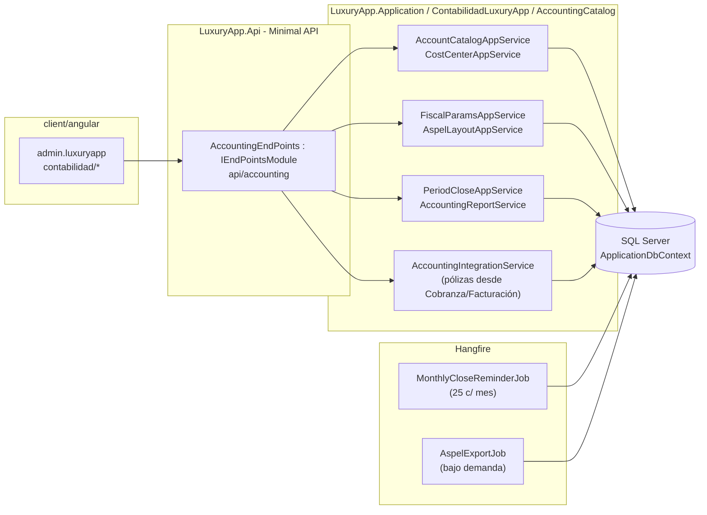
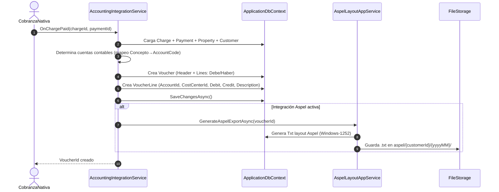
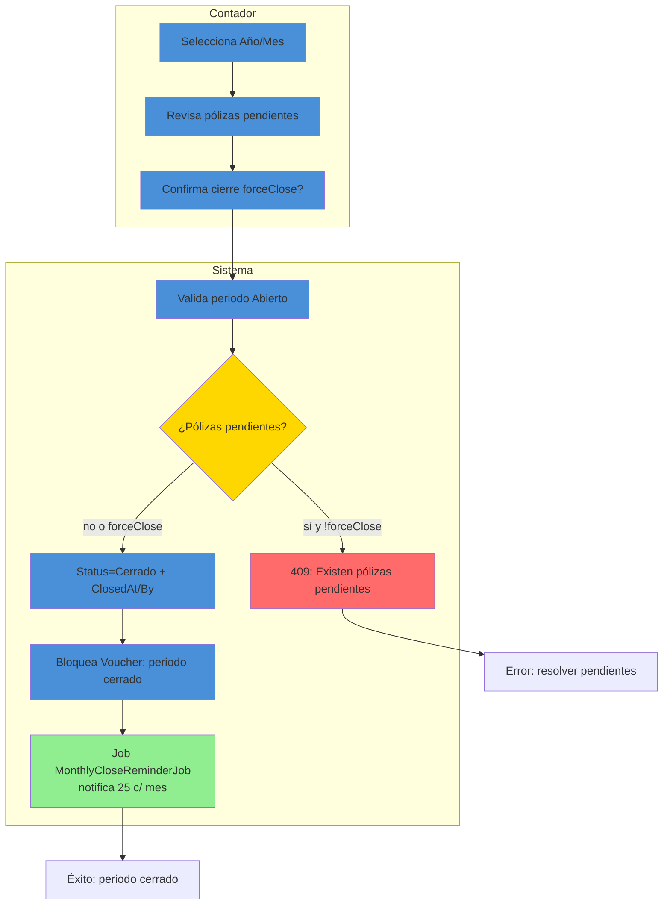
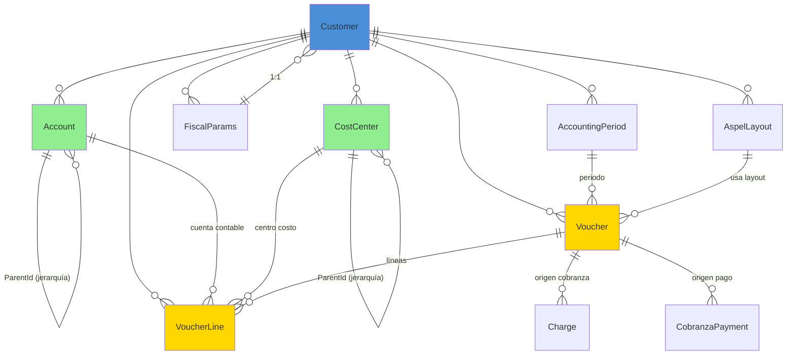

# Contabilidad (Catálogo Contable Base) — Documentación Técnica

> **Ruta**: 📂 Documentación > 💼 Contabilidad > 💰 Contabilidad
> **📅 Última Revisión**: 13-jul-26
> **🛡️ Estado**: ✅ Vigente
> **👤 Responsable**: @equipo-contabilidad

---

## 📑 Tabla de Contenidos

1. [Resumen Ejecutivo](#-resumen-ejecutivo)
2. [Visión Funcional](#-visión-funcional)
3. [Arquitectura Técnica](#-arquitectura-técnica)
4. [API Endpoints](#-api-endpoints)
5. [Flujo del Sistema](#-flujo-del-sistema)
6. [Componentes Frontend](#-componentes-frontend)
7. [Reglas de Negocio](#-reglas-de-negocio)
8. [Matriz de Permisos](#-matriz-de-permisos)
9. [Catálogo de Roles del Sistema](#-catálogo-de-roles-del-sistema)
10. [Base de Datos](#-base-de-datos)
11. [Performance](#-performance)
12. [Glosario de Términos](#-glosario-de-términos)
13. [Checklist de Validación](#-checklist-de-validación)
14. [Historial de Cambios](#-historial-de-cambios)

---

## 🎯 Resumen Ejecutivo

**Propósito**: Catálogo contable base (Chart of Accounts) multi-tenant que define la estructura de cuentas contables, centros de costo, tipos de comprobante y parámetros fiscales para la generación de pólizas, reportes financieros e integración con Aspel COI.

**Actores Involucrados** (`ApplicationRoleEnum`): `Administrador`, `GerenteOperaciones`, `GerenteAtencion`, `Asistente`, `Contador`, `AdministracionGeneral`, `SuperUsuario`.

**Dependencias**: `Customer` (tenant), `ModuleApp` (módulo habilitado), `Charge`/`CobranzaPayment` (origen pólizas), `AspelCobranzaHaus` (integración), `FileStorage` (layouts), Hangfire (cierres mensuales).

**Alcance**:

- ✅ Incluye: Catálogo cuentas (niveles 1-5), centros de costo, tipos comprobante, parámetros SAT (uso CFDI, método pago, régimen fiscal), layouts Aspel, cierres mensuales, reportes contables (balanza, mayor, estado resultados).
- ❌ No incluye: Cobranza operativa (módulo CobranzaNativa), facturación CFDI (módulo InvoiceGeneration), conciliación bancaria (CobranzaOnline), nómina (RRHH).

---

## 🔍 Visión Funcional

**HU-01 — Catálogo de cuentas multi-nivel**

> Como **contador** quiero definir cuentas contables jerárquicas (nivel 1 a 5) con tipo (Activo, Pasivo, Capital, Ingreso, Costo, Gasto), naturaleza (Deudora/Acreedora) y flags (requiere centro costo, permite movimiento directo) para construir pólizas correctas.
> **Criterios**: `Account` con `ParentId` (jerarquía), `Level` (1-5), `AccountType` (`Activo`|`Pasivo`|`Capital`|`Ingreso`|`Costo`|`Gasto`), `Nature` (`Deudora`|`Acreedora`), `AllowsDirectPosting`, `RequiresCostCenter`, `IsActive`; validación nivel ≤ 5; unicidad `Code` por tenant.

**HU-02 — Centros de costo y segmentos**

> Como **analista financiero** quiero centros de costo con jerarquía y asignación a propiedades/áreas para análisis de rentabilidad por unidad.
> **Criterios**: `CostCenter` con `Code`, `Name`, `ParentId`, `PropertyId` (opcional), `AreaId` (opcional), `BudgetAmount` (opcional), `IsActive`; herencia presupuestaria padre→hijos.

**HU-03 — Parámetros fiscales y layouts Aspel**

> Como **contador** quiero configurar parámetros SAT (régimen fiscal, uso CFDI default, método pago default) y layouts de exportación Aspel COI para generar pólizas compatibles.
> **Criterios**: `FiscalParams` por tenant (`TaxRegime`, `DefaultCfdiUse`, `DefaultPaymentMethod`, `SeriesConfig`); `AspelLayout` (campos fijos + mapeo dinámico `AccountCode` → `AspelAccount`); exportación `Txt`/`Csv` con encoding Windows-1252.

**HU-04 — Cierres mensuales y reportes**

> Como **gerente financiero** quiero cerrar periodo contable (bloquea pólizas) y generar balanza de comprobación, mayor auxiliar, estado de resultados y balance general.
> **Criterios**: `AccountingPeriod` (`Year`, `Month`, `Status` `Abierto`|`Cerrado`|`Reabierto`, `ClosedAt`, `ClosedBy`); `ClosePeriodAsync` valida pólizas pendientes → `Status=Cerrado`; reportes con filtros `CostCenter`, `AccountRange`, `Level`; exportación Excel/PDF.

---

## 🏗️ Arquitectura Técnica



| Capa        | Tecnología                                                          |
| ----------- | ------------------------------------------------------------------- |
| Backend     | .NET 10, Minimal APIs (`IEndpointModule`), EF Core 10               |
| Jerarquías  | CTE recursivo (`WITH RECURSIVE`) para árbol cuentas/centros costo   |
| Aspel       | Exportación `Txt` encoding Windows-1252, layout configurable        |
| Jobs        | Hangfire (`HangfireJobCatalog`)                                     |
| Exportación | EPPlus (`GetAsByteArray`) + PDF (`QuestPDF`)                        |
| Respuestas  | `ApiResponseDTO<T>` (nunca `ProblemDetails`)                        |
| Mapeo       | Explícito `ToDTO()` (AutoMapper prohibido)                          |
| Frontend    | Angular 22 (standalone, signals, OnPush), Bootstrap 5, catálogo `@ui/*` |

---

## 📱 Mobile Responsive (§15 CONVENTIONS.md)

| Vista                                        | Patrón (§15.2)         | Implementación                                                                |
| -------------------------------------------- | ---------------------- | ----------------------------------------------------------------------------- |
| `AccountCatalogTree` / `AccountForm`         | **A — CSS Responsive** | `p-tree` + `p-dialog`, grid `p-col-*`, scroll horizontal tabla                |
| `CostCenterList` / `CostCenterForm`          | **A — CSS Responsive** | PrimeFlex, `p-table` responsive, `p-dialog`                                   |
| `FiscalParamsForm` / `AspelLayoutForm`       | **A — CSS Responsive** | `p-tabView` tabs, formularios `p-fluid`                                       |
| `AccountingReports` / `PeriodCloseDashboard` | **A — CSS Responsive** | Cards KPI `p-col-12 p-md-6 p-lg-3`, gráficos `@defer` Chart.js, tablas scroll |

**Reglas aplicadas:**

- Breakpoint único: 768px (`PlatformService.isMobile()`)
- Touch targets ≥ 44×44px
- Safe areas: `p-dialog` / `p-tabView` manejan notch
- Árbol cuentas: `p-tree` con `expandedKeys` persistido en `localStorage`
- Exportar: `onDownloadFile` vía `ApiResponseService` (funciona web/móvil)

---

## 🌐 API Endpoints

Base: `api/accounting`. Todos requieren `Authorization: Bearer <JWT>`; roles vía `AccountingRoles`. Éxitos/errores en `ApiResponseDTO<T>`.

### Tabla General

| Método | Path                        | Roles                    | Request DTO                     | Response DTO                    | Códigos HTTP          |
| ------ | --------------------------- | ------------------------ | ------------------------------- | ------------------------------- | --------------------- |
| GET    | `/accounts`                 | Contador, Admin          | `PaginationCommonDTO` + filtros | `PagedResultDTO<AccountDTO>`    | 200 · 400             |
| GET    | `/accounts/tree`            | Contador, Admin          | —                               | `List<AccountTreeNodeDTO>`      | 200 · 400             |
| POST   | `/accounts`                 | Contador                 | `CreateAccountDTO`              | `AccountDTO`                    | 200 · 400 · 403 · 409 |
| PUT    | `/accounts/{id}`            | Contador                 | `UpdateAccountDTO`              | `AccountDTO`                    | 200 · 400 · 404 · 409 |
| DELETE | `/accounts/{id}`            | Contador                 | —                               | `bool`                          | 200 · 400 · 404 · 409 |
| GET    | `/cost-centers`             | Contador, Admin          | `PaginationCommonDTO`           | `PagedResultDTO<CostCenterDTO>` | 200 · 400             |
| POST   | `/cost-centers`             | Contador                 | `CreateCostCenterDTO`           | `CostCenterDTO`                 | 200 · 400 · 409       |
| GET    | `/fiscal-params`            | Contador, Admin          | —                               | `FiscalParamsDTO`               | 200 · 404             |
| PUT    | `/fiscal-params`            | Contador                 | `UpdateFiscalParamsDTO`         | `FiscalParamsDTO`               | 200 · 400 · 404       |
| GET    | `/aspel-layouts`            | Contador, Admin          | —                               | `List<AspelLayoutDTO>`          | 200 · 400             |
| POST   | `/aspel-layouts`            | Contador                 | `CreateAspelLayoutDTO`          | `AspelLayoutDTO`                | 200 · 400 · 409       |
| POST   | `/periods/close`            | Contador                 | `ClosePeriodDTO`                | `AccountingPeriodDTO`           | 200 · 400 · 403 · 409 |
| GET    | `/reports/trial-balance`    | Contador, Admin, Gerente | `TrialBalanceQueryDTO`          | `TrialBalanceDTO`               | 200 · 400             |
| GET    | `/reports/general-ledger`   | Contador, Admin          | `GeneralLedgerQueryDTO`         | `GeneralLedgerDTO`              | 200 · 400             |
| GET    | `/reports/income-statement` | Contador, Admin, Gerente | `IncomeStatementQueryDTO`       | `IncomeStatementDTO`            | 200 · 400             |
| GET    | `/reports/balance-sheet`    | Contador, Admin, Gerente | `BalanceSheetQueryDTO`          | `BalanceSheetDTO`               | 200 · 400             |
| GET    | `/reports/export`           | Contador                 | `ExportReportDTO`               | `FileStreamResult`              | 200 · 400             |

> [!NOTE]
> El campo `responseCode` viaja **dentro** de `ApiResponseDTO`; el status HTTP siempre es `200 OK` para respuestas de negocio (incluidos errores 4xx de dominio). `500` solo para excepciones no controladas.

### Detalle por Endpoint (ejemplos clave)

#### 🟢 GET `/api/accounting/accounts/tree`

Devuelve árbol completo de cuentas para UI `p-tree` (lazy load opcional).

- **Roles**: `SuperUsuario`, `Contador`, `AdministracionGeneral`, `Administrador`.
- **Response 200** (`ApiResponseDTO<List<AccountTreeNodeDTO>>`):

```json
{
  "success": true,
  "message": "Árbol de cuentas obtenido.",
  "responseCode": 200,
  "data": [
    {
      "id": "019c...",
      "code": "1",
      "name": "ACTIVO",
      "level": 1,
      "accountType": "Activo",
      "nature": "Deudora",
      "allowsDirectPosting": false,
      "children": [
        {
          "id": "019c...",
          "code": "11",
          "name": "ACTIVO CIRCULANTE",
          "level": 2,
          "accountType": "Activo",
          "nature": "Deudora",
          "children": [...]
        }
      ]
    }
  ]
}
```

#### 🟢 POST `/api/accounting/periods/close`

Cierra periodo contable (bloquea pólizas).

- **Roles**: `Contador`, `SuperUsuario`.
- **Request** (`ClosePeriodDTO`):

```json
{ "year": 2026, "month": 7, "forceClose": false }
```

- **Validaciones**: Periodo `Abierto`; no pólizas `Pendientes` (si `forceClose=false`); usuario tiene rol `Contador` o `SuperUsuario`.
- **Response 200**: `AccountingPeriodDTO` con `Status=Cerrado`, `ClosedAt`, `ClosedBy`.

#### 🟢 GET `/api/accounting/reports/trial-balance`

Balanza de comprobación con filtros.

- **Roles**: `Contador`, `AdministracionGeneral`, `GerenteOperaciones`, `SuperUsuario`.
- **Query** (`TrialBalanceQueryDTO`): `year`, `month`, `fromAccountCode`, `toAccountCode`, `costCenterId`, `level` (1-5), `showZeroBalance` (bool).
- **Response** (`TrialBalanceDTO`): `accounts[]` { `code`, `name`, `level`, `initialDebit`, `initialCredit`, `periodDebit`, `periodCredit`, `finalDebit`, `finalCredit` }, `totals`.

---

## 🔄 Flujo del Sistema

### Generación de póliza desde cargo cobranza



### Cierre mensual contable



---

## 🖥️ Componentes Frontend

Workspace: **`client/angular`** (standalone, signals, OnPush, catálogo `@ui/*`, `ApiResponseService`, `Endpoints`).

### Routing (`admin.luxuryapp`)

| App (§14)         | Ruta                               | Componente             | Lazy loading | Guard       | Menú |
| ----------------- | ---------------------------------- | ---------------------- | :----------: | ----------- | :--: |
| `admin.luxuryapp` | `contabilidad/cuentas`             | `AccountCatalog`       |      ✅      | `authGuard` |  ✅  |
| `admin.luxuryapp` | `contabilidad/cuentas/nueva`       | `AccountForm`          |      ✅      | `authGuard` |  ❌  |
| `admin.luxuryapp` | `contabilidad/centros-costo`       | `CostCenterList`       |      ✅      | `authGuard` |  ✅  |
| `admin.luxuryapp` | `contabilidad/parametros-fiscales` | `FiscalParamsForm`     |      ✅      | `authGuard` |  ✅  |
| `admin.luxuryapp` | `contabilidad/layouts-aspel`       | `AspelLayoutList`      |      ✅      | `authGuard` |  ✅  |
| `admin.luxuryapp` | `contabilidad/cierres`             | `PeriodCloseDashboard` |      ✅      | `authGuard` |  ✅  |
| `admin.luxuryapp` | `contabilidad/reportes`            | `AccountingReports`    |      ✅      | `authGuard` |  ✅  |

### Catálogo de Componentes (representativo)

| Componente             | Selector                     | Tipo | Signals clave                                | Servicios                          | Comportamiento                                                                                                |
| ---------------------- | ---------------------------- | ---- | -------------------------------------------- | ---------------------------------- | ------------------------------------------------------------------------------------------------------------- |
| `AccountCatalog`       | `app-account-catalog`        | web  | `treeSignal`, `selectedNode`, `loading`      | `ApiResponseService`               | `p-tree` lazy load (carga hijos al expandir), búsqueda por código/nombre, `il-button-*` nuevo/editar/eliminar |
| `AccountForm`          | `app-account-form`           | web  | `submitting`, `form`, `parentAccountsSignal` | `ApiResponseService`, `FormHelper` | `FormHelper.submitCrud()`, selector padre (solo nivel < 5), valida código único, `p-dropdown` tipo/naturaleza |
| `CostCenterList`       | `app-cost-center-list`       | web  | `dataSignal`, `loading`, `filters`           | `ApiResponseService`               | `p-table` virtual scroll, jerarquía visual (indent), exportar, `il-button-*`                                  |
| `FiscalParamsForm`     | `app-fiscal-params-form`     | web  | `submitting`, `form`                         | `ApiResponseService`, `FormHelper` | `p-tabView`: parámetros SAT / series / regimenes; `FormHelper.submitCrud()`                                   |
| `AspelLayoutList`      | `app-aspel-layout-list`      | web  | `dataSignal`, `loading`                      | `ApiResponseService`               | `p-table`, editor JSON mapeo campos, `il-button-*` probar exportación                                         |
| `PeriodCloseDashboard` | `app-period-close-dashboard` | web  | `periodsSignal`, `closing`                   | `ApiResponseService`               | Lista periodos con badges estado, botón cerrar (confirma forceClose), `@defer` gráfico pólizas/mes            |
| `AccountingReports`    | `app-accounting-reports`     | web  | `reportSignal`, `paramsSignal`, `exporting`  | `ApiResponseService`               | `p-tabView`: balanza / mayor / resultados / balance; cada tab: parámetros + preview tabla + botón exportar    |

**Estilos**: Bootstrap 5 (`card`, `grid`, `text-*`); botones/inputs catálogo `@ui/*` (`il-button`, `il-button-save`, `custom-input-*-signal`). **Testing**: `.spec.ts` por componente (Vitest) — cobertura básica inicialización.

**Interfaces** (`core/interfaces/accounting.dto.ts`): `account`, `account-tree-node`, `cost-center`, `fiscal-params`, `aspel-layout`, `accounting-period`, `trial-balance`, `general-ledger`, `income-statement`, `balance-sheet`, `paged-result`.

---

## 📜 Reglas de Negocio

| ID     | SI (condición)                        | ENTONCES (acción)                                                                                                                                                                                                                   |
| ------ | ------------------------------------- | ----------------------------------------------------------------------------------------------------------------------------------------------------------------------------------------------------------------------------------- |
| RN-001 | Cualquier operación del módulo        | Se filtra por `currentUser.CustomerId`; ningún acceso cross-tenant                                                                                                                                                                  |
| RN-002 | Se crea `Account`                     | `Code` único por `CustomerId`; `Level` ≤ 5; si `ParentId` existe → `Level = Parent.Level + 1`; `Nature` coherente con `AccountType` (Activo→Deudora, Pasivo→Acreedora, etc.)                                                        |
| RN-003 | `Account.AllowsDirectPosting = false` | No permite pólizas directas; solo suma de hijos; valida en `VoucherLine` creation                                                                                                                                                   |
| RN-004 | Se crea `CostCenter`                  | `Code` único por `CustomerId`; `ParentId` opcional → hereda `BudgetAmount` (suma hijos ≤ padre); `PropertyId`/`AreaId` opcionales para filtros                                                                                      |
| RN-005 | `FiscalParams` actualizados           | `TaxRegime` ∈ catálogo SAT; `DefaultCfdiUse` ∈ `UsoCFDI` activo; `DefaultPaymentMethod` ∈ `MetodoDePago` activo; `SeriesConfig` valida prefijo + dígitos                                                                            |
| RN-006 | `AspelLayout` mapeo                   | `AccountCode` (nuestro) → `AspelAccount` (código Aspel) 1:1; campos obligatorios: `Fecha`, `Concepto`, `Cuenta`, `Debe`, `Haber`, `Referencia`; encoding Windows-1252                                                               |
| RN-007 | Cierre periodo (`ClosePeriodAsync`)   | Periodo debe ser `Abierto`; si `forceClose=false` y existe `Voucher` con `Status=Pendiente` en periodo → 409; setea `Status=Cerrado`, `ClosedAt=NOW`, `ClosedBy=currentUser`; `Voucher` con periodo cerrado rechaza edición/borrado |
| RN-008 | Reporte balanza/mayor                 | Filtros: `AccountRange` (from/to), `CostCenter`, `Level` (1-5), `ShowZeroBalance`; agrupación por `Level` configurable; totales por naturaleza                                                                                      |
| RN-009 | Exportación Aspel                     | Genera `Txt` encoding Windows-1252; layout según `AspelLayout` activo; valida `AccountCode` existe en catálogo Aspel; archivo a `aspel/{customerId}/{yyyyMM}/polizas_{voucherId}.txt`                                               |
| RN-010 | Multi-tenant                          | Todas las queries filtran `CustomerId` del usuario autenticado; `SuperUsuario` ve todos (sin filtro `CustomerId`)                                                                                                                   |

---

## 🔐 Matriz de Permisos

Roles de `ApplicationRoleEnum`. Agrupados por `RoleType`.

| Acción                    | Contador (Corporate) |  Admin/Staff  | Sistema |
| ------------------------- | :------------------: | :-----------: | :-----: |
| Catálogo cuentas CRUD     |          ✅          |      ❌       |   ✅    |
| Árbol cuentas consultar   |          ✅          |      ✅       |   ✅    |
| Centros costo CRUD        |          ✅          |      ❌       |   ✅    |
| Parámetros fiscales       |          ✅          | ✅ (lectura)  |   ✅    |
| Layouts Aspel CRUD        |          ✅          |      ❌       |   ✅    |
| Cerrar/Reabrir periodos   |          ✅          |      ❌       |   ✅    |
| Reportes balanza/mayor    |          ✅          |      ✅       |   ✅    |
| Estado resultados/balance |          ✅          | ✅ (Gerente)  |   ✅    |
| Exportar Aspel/Excel      |          ✅          | ✅ (Contador) |   ✅    |
| Integración pólizas       |      ✅ (auto)       |   ✅ (auto)   |   ✅    |

**Detalle por RoleType**:

- **Corporate**: `Contador`, `AdministracionGeneral`, `SistemasGeneral`, `Legal`
- **Staff**: `Administrador`, `GerenteOperaciones`, `GerenteAtencion`, `Asistente`
- **System**: `SuperUsuario`

---

## 🗄️ Catálogo de Roles del Sistema

El módulo **no introduce roles nuevos**: reutiliza `ApplicationRoleEnum` mediante grupos en `AccountingRoles` (`AccountingRoles`, `ViewerRoles`). La autorización es **por rol** (`AuthorizeAttribute { Roles = ... }`), no por claims.

---

## 🗄️ Base de Datos

`ApplicationDbContext` (SQL Server). Filtrado por `CustomerId` manual. FKs con `OnDelete(Restrict)`.



| Tabla               | Columnas clave                                                                                                                     | Índices                                                                             |
| ------------------- | ---------------------------------------------------------------------------------------------------------------------------------- | ----------------------------------------------------------------------------------- | ------------------------------------------------- | --------------------------------------------------------- | ------------------------------ | ----------------------------- | -------------------------------------------------------------------------------------------------------------------------------------- | ----------------------------------------------------------------------------------------------------- |
| `Accounts`          | `Id`, `CustomerId`, `Code`, `Name`, `ParentId`, `Level` (1-5), `AccountType` (`Activo`                                             | `Pasivo`                                                                            | `Capital`                                         | `Ingreso`                                                 | `Costo`                        | `Gasto`), `Nature` (`Deudora` | `Acreedora`), `AllowsDirectPosting`, `RequiresCostCenter`, `IsActive`, `CreatedAt`, `CreatedBy`, `UpdatedAt`, `UpdatedBy`, `DeletedAt` | `UX (CustomerId, Code)`, `IX (CustomerId, ParentId, Level)`, `IX (CustomerId, AccountType, IsActive)` |
| `CostCenters`       | `Id`, `CustomerId`, `Code`, `Name`, `ParentId`, `PropertyId`, `AreaId`, `BudgetAmount`, `IsActive`                                 | `UX (CustomerId, Code)`, `IX (CustomerId, ParentId)`, `IX (CustomerId, PropertyId)` |
| `FiscalParams`      | `Id`, `CustomerId` (UX), `TaxRegime`, `DefaultCfdiUse`, `DefaultPaymentMethod`, `SeriesConfig` (JSON), `CreatedAt`, `UpdatedAt`    | `UX (CustomerId)`                                                                   |
| `AspelLayouts`      | `Id`, `CustomerId`, `Name`, `FieldMappings` (JSON), `Encoding` (`Windows-1252`), `Delimiter`, `IsActive`, `IsDefault`, `CreatedAt` | `IX (CustomerId, IsActive)`, `IX (CustomerId, IsDefault)`                           |
| `AccountingPeriods` | `Id`, `CustomerId`, `Year`, `Month`, `Status` (`Abierto`                                                                           | `Cerrado`                                                                           | `Reabierto`), `ClosedAt`, `ClosedBy`, `CreatedAt` | `UX (CustomerId, Year, Month)`, `IX (CustomerId, Status)` |
| `Vouchers`          | `Id`, `CustomerId`, `PeriodId`, `Date`, `Type` (`Ingreso`                                                                          | `Egreso`                                                                            | `Diario`                                          | `Ajuste`                                                  | `Cierre`), `Status` (`Borrado` | `Firmado`                     | `Cancelado`), `Description`, `TotalDebit`, `TotalCredit`, `CreatedAt`, `CreatedBy`                                                     | `IX (CustomerId, PeriodId, Date)`, `IX (CustomerId, Status)`, `IX (CustomerId, Type)`                 |
| `VoucherLines`      | `Id`, `VoucherId`, `AccountId`, `CostCenterId`, `Debit`, `Credit`, `Description`, `SortOrder`                                      | `IX (VoucherId)`, `IX (AccountId, VoucherId)`, `IX (CostCenterId, VoucherId)`       |

**Enums** (`LuxuryApp.Shared.Enums`): `EAccountType`, `EAccountNature`, `EAccountLevel`, `ECostCenterType`, `EVoucherType`, `EVoucherStatus`, `EAccountingPeriodStatus`, `ETaxRegime`, `ECfdiUse`, `EPaymentMethod`.

---

## ⚡ Performance

- **Lazy loading**: componentes Angular vía `loadComponent` (una carga por ruta).
- **N+1**: consultas con `join`/proyección `.Select()` (sin cargas perezosas por fila); listados paginados server-side (`PaginationCommonDTO`, tope 200).
- **Árbol cuentas**: CTE recursivo SQL (`WITH RECURSIVE`) → devuelve `AccountTreeNodeDTO` plano; frontend `p-tree` lazy load hijos bajo demanda.
- **Reportes contables**: agregaciones SQL (`SUM`, `GROUP BY`) en DB; no materializa entidades; `AsNoTracking()` + proyección DTO.
- **Aspel export**: batch `Voucher` por periodo; `QuestPDF`/`EPPlus` streaming; archivo `Txt` Windows-1252 ≤ 50 MB.
- **Cierres**: `AccountingPeriod` consulta única por `CustomerId+Year+Month`; `Voucher` valida `PeriodId` FK + `Status`.
- **Índices**: compuestos por `CustomerId` + campos filtro frecuente (`Code`, `ParentId`, `AccountType`, `Status`, `Year/Month`).
- **Frontend**: `p-tree` lazy load (`loadChildren` callback), `p-table [virtualScroll]="true"` + `[lazy]="true"`; `@defer (on viewport)` para gráficos Chart.js en dashboard.

---

## 📖 Glosario de Términos

| Término                     | Definición                                                                                                              |
| --------------------------- | ----------------------------------------------------------------------------------------------------------------------- |
| **Chart of Accounts**       | Catálogo de cuentas contables jerárquico (niveles 1-5)                                                                  |
| **Cuenta de mayor**         | Cuenta nivel 1-3 (ej. 1 Activo, 11 Activo Circulante)                                                                   |
| **Cuenta auxiliar**         | Cuenta nivel 4-5 que permite movimiento directo (`AllowsDirectPosting=true`)                                            |
| **Naturaleza**              | `Deudora` (aumenta por débito: Activos, Costos, Gastos) o `Acreedora` (aumenta por crédito: Pasivos, Capital, Ingresos) |
| **Centro de costo**         | Unidad de análisis de rentabilidad (departamento, propiedad, área)                                                      |
| **Póliza**                  | Comprobante contable (Header + Lines) que mantiene partida doble (Σ Debe = Σ Haber)                                     |
| **Partida doble**           | Principio contable: toda transacción afecta al menos 2 cuentas (Debe = Haber)                                           |
| **Periodo contable**        | Mes calendario contable (`Abierto`/`Cerrado`/`Reabierto`)                                                               |
| **Layout Aspel**            | Mapeo campos internos → formato archivo Txt Aspel COI (encoding Windows-1252)                                           |
| **Balanza de comprobación** | Reporte que lista saldos finales por cuenta (Debe/Haber) verificando Σ Debe = Σ Haber                                   |
| **Mayor auxiliar**          | Detalle de movimientos por cuenta (fecha, concepto, debe, haber, saldo)                                                 |
| **Cierre contable**         | Bloqueo de periodo: impide crear/modificar pólizas en periodo cerrado                                                   |

---

## ✅ Checklist de Validación ([CONVENTIONS.md §11](../../../../../../CONVENTIONS.md#11-estándares-de-documentación))

> [!NOTE]
> El link a `CONVENTIONS.md` asume que el documento vive en la raíz del propio módulo. Ajusta la profundidad relativa (`../../../../../../`) según la ubicación final.

- [x] CERO mojibake (UTF-8 sin BOM)
- [x] CERO `any` en TypeScript
- [x] Fechas en formato `dd-MMM-yy`
- [x] Endpoints front/back coinciden carácter a carácter
- [x] Diagramas Mermaid válidos (flowchart swimlanes + sequence con `autonumber`)
- [x] Colores Mermaid según §11 (verde `#90EE90` éxito, amarillo `#FFD700` decisión, azul `#4A90D9` proceso, rojo `#FF6B6B` error)
- [x] Reglas de negocio en formato `SI/ENTONCES` (`RN-xxx`)
- [x] Roles usan nombres exactos de `ApplicationRoleEnum`
- [x] Mobile responsive: §15 aplicado según tipo de vista
- [x] Sin PII en logs
- [x] Emojis consistentes · Todo en español

---

## 📝 Historial de Cambios

| Fecha     | Versión | Autor                | Cambios                                                                                                                                                                                                                                                      |
| --------- | ------- | -------------------- | ------------------------------------------------------------------------------------------------------------------------------------------------------------------------------------------------------------------------------------------------------------ |
| 10-jun-26 | 1.2     | @equipo-contabilidad | Documentación inicial del módulo (template intermedio)                                                                                                                                                                                                       |
| 13-jul-26 | 2.0     | @kilo                | Actualización a template §11 CONVENTIONS.md: Mobile responsive §15, checklist §11, Mermaid colores, sin PII, sin `any`, rutas api kebab-case, TOC completo, arquitectura, flujos, componentes, matriz permisos, ER diagram, performance, glosario, historial |
