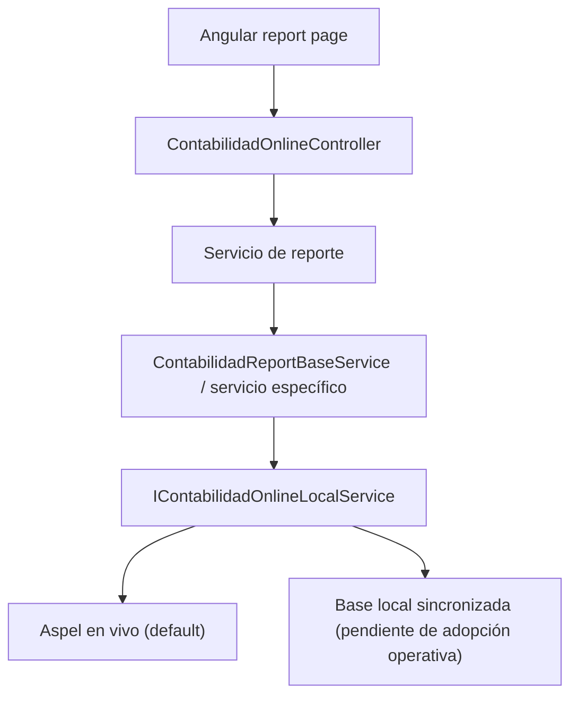

Ruta: 📂 Documentación > 💼 Accounting > 📊 Contabilidad Online

# 📊 Estado Actual de Reportes Contabilidad Online

📅 Última Revisión: 22-jun-26  
🛡️ Estado: En revisión  
👤 Responsable: Codex / equipo Accounting

---

## 1. Resumen Ejecutivo

### 💡 ¿Por qué existe este documento?

Este documento resume el estado actual de los reportes de **Contabilidad Online** distintos a **Flujo de Efectivo**, para que el equipo pueda retomar el trabajo sin perder contexto sobre:

- qué reportes ya volvieron a mostrar información
- qué ajustes se hicieron en backend y frontend
- qué validaciones siguen pendientes con negocio o con el contador

### ✅ Estado general al cierre de esta revisión

- Los reportes principales ya **volvieron a mostrar data** después de corregir la reconstrucción jerárquica de cuentas.
- La prioridad actual sigue siendo **consumo en vivo desde Aspel**.
- La opción de consumir desde base local **permanece disponible a futuro**, pero no es la ruta por defecto en este momento.

### 🎯 Criterios de éxito de esta lectura

- [x] Entender qué reportes entran en este seguimiento
- [x] Saber qué archivos fueron tocados
- [x] Identificar qué correcciones ya quedaron aplicadas
- [x] Tener claro qué pruebas funcionales faltan

---

## 2. Alcance

### Incluye

- `Estado de Posición Financiera (EPF)`
- `Estado de Resultados`
- `Cédula Presupuestal`
- `Bancos e Inversiones`
- `Proyectos Aprobados`

### Excluye

- `Flujo de Efectivo`

> [!NOTE]
> El seguimiento detallado de Flujo de Efectivo continúa en su documento dedicado y no debe mezclarse con este análisis.

---

## 3. Antes vs Después

| Antes (limitación) | Después (solución actual) |
| --- | --- |
| El API podía responder con datos crudos, pero varios reportes terminaban vacíos o en cero | La jerarquía ahora sintetiza cuentas madre y subcuentas faltantes cuando Aspel sólo devuelve hojas |
| Algunas vistas dependían de `cuntasMayor` o detalles ya agrupados, pero se perdían hojas sin contenedor explícito | Los servicios ya contemplan cuentas hoja reales sin depender siempre de detalle de tercer nivel |
| `Cédula Presupuestal` no mostraba correctamente bloques extraordinarios/proyectos/eventos | El frontend ya agrega secciones para `605`, `606` y `607` |
| `Proyectos Aprobados` descartaba cuentas válidas por una heurística demasiado agresiva | Ahora sólo se excluyen cuentas que realmente actúan como padre |

---

## 4. Flujo General del Módulo

---

## 5. Estado por Reporte

### 5.1 EPF

**Endpoint**

- `GET /api/contabilidad-online/estado-posicion-financiera/{customerId}/{year}/{mes}`

**Estado actual**

- Ya debe mostrar información nuevamente.
- Usa `EpfService`, no un servicio independiente llamado `EstadoPosicionFinancieraService`.

**Reglas relevantes**

- trabaja sobre clases `1`, `2` y `3`
- separa `104` para mostrar la parte deudora como activo
- usa `RemanenteDelEjercicio` para `302`
- consolida `206` dentro de `205`

**Riesgo pendiente**

- validar con negocio que los saldos visibles coincidan con el corte esperado por mes

### 5.2 Estado de Resultados

**Endpoint**

- `GET /api/contabilidad-online/estado-resultados/{customerId}/{year}/{mes}`

**Estado actual**

- Ya debe mostrar cuentas con movimiento.
- Se corrigió el aplanado de ingresos `401` para no perder subcuentas que tienen movimiento directo.

**Reglas relevantes**

- mantiene enfoque sobre ingresos y gastos operativos
- excluye `401-001-002`
- excluye `605`, `606`, `607` de la vista clásica

**Riesgo pendiente**

- validar si el nivel visible esperado por negocio debe ser mayor, subcuenta o detalle según cada cuenta

### 5.3 Cédula Presupuestal

**Endpoint**

- `GET /api/contabilidad-online/cedula-presupuestal/{customerId}/{year}/{mes}`

**Estado actual**

- El frontend ya arma correctamente:
  - `GASTOS GENERALES`
  - `EXTRAORDINARIOS`
  - `MEJORAS Y PROYECTOS`
  - `GASTOS EN EVENTOS`

**Reglas relevantes**

- trabaja sobre cuentas `6xx`
- trunca acumulado al mes de corte
- frontend agrupa `605`, `606`, `607` como bloques separados

**Riesgo pendiente**

- validar visualmente que subtotales y gran total coincidan con el reporte esperado del contador

### 5.4 Bancos e Inversiones

**Endpoint**

- `GET /api/contabilidad-online/bancos-inversiones/{customerId}/{year}/{mes}`

**Estado actual**

- Ya contempla hojas reales aunque no exista detalle colgante.
- Esto evita que bancos o inversiones desaparezcan si Aspel devuelve la subcuenta como hoja final.

**Reglas relevantes**

- `102` para bancos
- `103` para inversiones
- identifica `Fondo de Reserva` como parte separada

**Riesgo pendiente**

- confirmar que las descripciones finales y el criterio de fondo de reserva sigan siendo correctos para todos los clientes

### 5.5 Proyectos Aprobados

**Endpoint**

- `GET /api/contabilidad-online/proyectos-aprobados/{customerId}/{year}`

**Estado actual**

- Ya no descarta automáticamente cuentas útiles sólo por terminar en `-000`.
- Ahora detecta si una cuenta es padre revisando si realmente tiene hijos.

**Reglas relevantes**

- trabaja con cuentas `606`
- combina presupuesto y ejecución anual
- arma total general consolidado

**Riesgo pendiente**

- validar si negocio espera ver todas las cuentas activas con presupuesto o sólo las que siguen “vivas” operativamente

---

## 6. Ajustes Técnicos Ya Aplicados

### 🧩 Corrección base compartida

Archivo principal:

- [ContabilidadReportBaseService.cs](D:/repos/luxuryapp-api/api/LuxuryApp.Application.Tenant/Tenant/Accounting/ContabilidadOnline/Services/ContabilidadReportBaseService.cs)

Corrección aplicada:

- se sintetizan nodos jerárquicos faltantes cuando Aspel devuelve hojas sin:
  - cuenta mayor `xxx-000-000`
  - subcuenta contenedora `xxx-yyy-000`

Impacto esperado:

- `EPF`
- `Estado de Resultados`
- `Cédula Presupuestal`
- `Bancos e Inversiones`
- `Proyectos Aprobados`

### 🔧 Ajustes puntuales por servicio

- [EstadoResultadosService.cs](D:/repos/luxuryapp-api/api/LuxuryApp.Application.Tenant/Tenant/Accounting/ContabilidadOnline/Services/EstadoResultadosService.cs)
  - promueve subcuentas o detalles con movimiento a filas visibles de ingresos
- [BancosInversionesService.cs](D:/repos/luxuryapp-api/api/LuxuryApp.Application.Tenant/Tenant/Accounting/ContabilidadOnline/Services/BancosInversionesService.cs)
  - usa hojas reales aunque no tengan detalle
- [ProyectosAprobadosService.cs](D:/repos/luxuryapp-api/api/LuxuryApp.Application.Tenant/Tenant/Accounting/ContabilidadOnline/Services/ProyectosAprobadosService.cs)
  - sólo trata como cuenta madre a las que realmente tienen hijos
- [cedula-presupuestal.ts](D:/repos/luxuryapp-api/client/angular/src/app/features/accounting/general-ledger/contabilidad/contabilidad-online/pages/cedula-presupuestal/cedula-presupuestal.ts)
  - agrega secciones de `605`, `606` y `607`

---

## 7. Guía Funcional para QA / Usuario

### 🔍 Qué revisar manualmente

1. EPF
   Revisar que activo, pasivo y capital ya no aparezcan en cero cuando el API responde cuentas con movimiento.
2. Estado de Resultados
   Revisar que ingresos y gastos ya tengan filas visibles y que el resultado del periodo no quede vacío.
3. Cédula Presupuestal
   Revisar que extraordinarios, mejoras/proyectos y eventos sí aparezcan debajo del bloque general.
4. Bancos e Inversiones
   Revisar que bancos, inversiones y fondo de reserva ya salgan con importe.
5. Proyectos Aprobados
   Revisar que existan proyectos visibles cuando hay cuentas `606` con presupuesto o actividad.

> [!TIP]
> La validación funcional ideal es con el mismo cliente y periodo donde antes se observaba el reporte vacío.

---

## 8. Archivos Clave del Frontend

- [estado-posicion-financiera.ts](D:/repos/luxuryapp-api/client/angular/src/app/features/accounting/general-ledger/contabilidad/contabilidad-online/pages/estado-posicion-financiera/estado-posicion-financiera.ts)
- [estado-posicion-financiera.html](D:/repos/luxuryapp-api/client/angular/src/app/features/accounting/general-ledger/contabilidad/contabilidad-online/pages/estado-posicion-financiera/estado-posicion-financiera.html)
- [estado-resultados.ts](D:/repos/luxuryapp-api/client/angular/src/app/features/accounting/general-ledger/contabilidad/contabilidad-online/pages/estado-resultados/estado-resultados.ts)
- [estado-resultados.html](D:/repos/luxuryapp-api/client/angular/src/app/features/accounting/general-ledger/contabilidad/contabilidad-online/pages/estado-resultados/estado-resultados.html)
- [cedula-presupuestal.ts](D:/repos/luxuryapp-api/client/angular/src/app/features/accounting/general-ledger/contabilidad/contabilidad-online/pages/cedula-presupuestal/cedula-presupuestal.ts)
- [cedula-presupuestal.html](D:/repos/luxuryapp-api/client/angular/src/app/features/accounting/general-ledger/contabilidad/contabilidad-online/pages/cedula-presupuestal/cedula-presupuestal.html)
- [bancos-inversiones.ts](D:/repos/luxuryapp-api/client/angular/src/app/features/accounting/general-ledger/contabilidad/contabilidad-online/pages/bancos-inversiones/bancos-inversiones.ts)
- [bancos-inversiones.html](D:/repos/luxuryapp-api/client/angular/src/app/features/accounting/general-ledger/contabilidad/contabilidad-online/pages/bancos-inversiones/bancos-inversiones.html)
- [proyectos-aprobados.ts](D:/repos/luxuryapp-api/client/angular/src/app/features/accounting/general-ledger/contabilidad/contabilidad-online/pages/proyectos-aprobados/proyectos-aprobados.ts)
- [proyectos-aprobados.html](D:/repos/luxuryapp-api/client/angular/src/app/features/accounting/general-ledger/contabilidad/contabilidad-online/pages/proyectos-aprobados/proyectos-aprobados.html)

---

## 9. Estado de Compilación

### Backend

- `LuxuryApp.Application.Tenant` compila con `0 errores`

### Frontend

- el build de Angular no quedó bloqueado por TypeScript
- la validación completa de `ng build` está afectada por descarga externa de fuentes (`Google Fonts`) en entorno sin acceso a internet

> [!IMPORTANT]
> Ese fallo de build no apunta a un error funcional de estos reportes, sino a una dependencia externa del proceso de compilación.

---

## 10. Matriz de Riesgos / Pendientes

| Qué salió mal o puede salir mal | Qué decirle al usuario o al equipo |
| --- | --- |
| El reporte vuelve a mostrarse vacío en un cliente específico | Revisar si Aspel devuelve sólo hojas atípicas o si el cliente usa otra estructura de cuentas no contemplada |
| El reporte muestra filas pero los importes no cuadran con Excel | La visualización ya está restaurada; el siguiente paso es cuadrar regla de negocio por cuenta |
| Angular no compila en entorno local sin internet | El bloqueo actual es por fuentes externas, no por la lógica del reporte |

---

## 11. Siguiente Paso Recomendado

- Continuar con validación funcional reporte por reporte en ambiente real.
- Tomar capturas o exportes del usuario cuando exista diferencia de importes, no sólo de ausencia de filas.
- Mantener `Flujo de Efectivo` en su seguimiento separado.

---

## 12. Referencias

- [SEGUIMIENTO-FLUJO-EFECTIVO.md](D:/repos/luxuryapp-api/api/LuxuryApp.Application.Tenant/Tenant/Accounting/ContabilidadOnline/SEGUIMIENTO-FLUJO-EFECTIVO.md)
- [documentacion-reportes-contabilidad-online.md](D:/repos/luxuryapp-api/docs/moduls/Accounting/documentacion-reportes-contabilidad-online.md)

---

✅ Documento generado para facilitar la continuidad del análisis y evitar pérdida de contexto entre sesiones.
