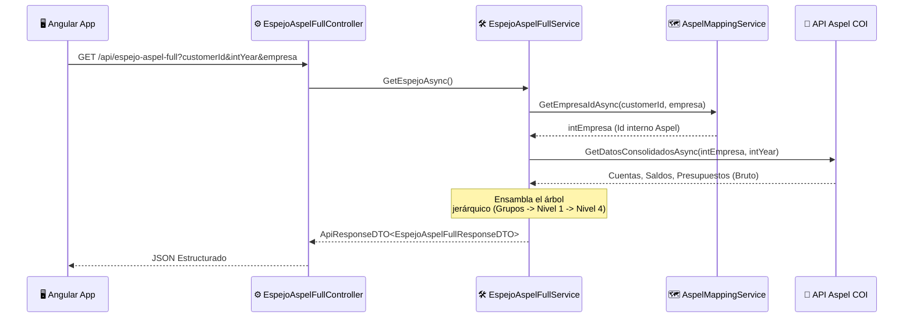

# 📊 Análisis del Módulo: Espejo Aspel Full

> [!NOTE]
> Este documento técnico describe el funcionamiento, obtención de datos y opciones de visualización en el frontend para el módulo **Espejo Aspel Full**.

---

## 🎯 Objetivo del Módulo

El módulo **Espejo Aspel Full** tiene como propósito mostrar el plan de cuentas completo (hasta 4 niveles) proveniente de Aspel COI en una interfaz web moderna. Permite a los usuarios visualizar de manera jerárquica las clases contables (ACTIVO, PASIVO, CAPITAL, INGRESOS, GASTOS) con sus respectivos movimientos mensuales de **Cargo**, **Abono** y **Presupuesto** para un ejercicio fiscal determinado.

---

## 📡 Obtención de Datos (Backend)

La obtención de datos se realiza a través de la API `EspejoAspelFullController`, la cual delega la lógica al servicio `EspejoAspelFullService`. 

### Flujo de Datos



> [!IMPORTANT]
> El sistema consulta 3 endpoints paralelos internamente (`GetCuentas`, `GetSaldos`, `GetPresupuestos`) y agrupa todo dinámicamente según el primer dígito de la cuenta para determinar la clase contable. Las respuestas del API se mantienen en caché temporal para optimizar la velocidad.

---

## 🌳 Estructura Jerárquica del Plan de Cuentas

El backend procesa las cuentas contables activas (`Status == "A"`) y hasta el **Nivel 4**. El formato es tradicionalmente `XXX-YYY-ZZZ` o `XXX-YYY-ZZZ-WWW`. 

* **Grupo Raíz:** Se deduce por el primer dígito (Ej. 1 = ACTIVO, 2 = PASIVO, 6 = GASTOS).
* **Nivel 1:** Cuentas con formato principal `XXX-000-000`.
* **Nivel 2 a 4:** Subcuentas detalladas que heredan el prefijo correspondiente.

### Lógica de Totales

Los valores para los niveles inferiores (hojas) provienen directamente de los saldos y presupuestos reportados por Aspel. Para los niveles padres (Nivel 2, Nivel 1 y Grupos), los saldos se **sumarizan recursivamente** hacia arriba, calculando:
1. **Saldo Inicial:** Suma de saldos iniciales de los hijos directos.
2. **Cargos y Abonos (Mes a mes):** Arreglos de 12 posiciones con las sumatorias consolidadas.
3. **Presupuesto:** Arreglos de 12 meses; su visibilidad es especialmente relevante en las cuentas de Gasto.

---

## 🖥️ Opciones de Visualización en Frontend (Angular)

El componente principal se encuentra en `espejo-aspel-full.ts` y está diseñado de manera exclusiva usando **Signals**, logrando reactividad y desempeño excepcionales sin el uso de `@Input()` ni `@Output()`.

### Interfaz y Filtros Disponibles

La UI presenta una barra superior pegajosa (`sticky`) con múltiples herramientas de interacción:

1. **🏢 Selección de Empresa:** Se permite alternar entre "Contabilidad" y "Cobranza" a través de un componente visual integrado.
2. **📅 Ejercicio Fiscal:** Selectores rápidos de flechas (`<`, `>`) que manipulan de forma reactiva el servicio central para cambiar el año a consultar.
3. **🧭 Navegación Rápida:** Botones generados dinámicamente para saltar fluidamente (mediante `scrollIntoView`) al grupo específico (ACTIVO, PASIVO, etc.).
4. **👁️ Filtro de Ceros:** Opción *"Ocultar sin datos"* que filtra las cuentas que no tienen `Saldo Inicial`, ni presentan movimientos o presupuesto en los 12 meses.
5. **🔍 Buscador por Grupo:** Un campo de búsqueda para cada bloque de clase contable, permitiendo localizar en tiempo real por número de cuenta o descripción.
6. **📂 Profundidad Visible:** Botones de niveles (N1, N2, N3, N4) que adaptan la vista de la tabla para ocultar o expandir la profundidad del árbol contable, detectando dinámicamente el nivel máximo por rubro.

> [!TIP]
> **Estándares Visuales:** Todos los importes numéricos se muestran usando `Intl.NumberFormat('es-MX')` sin decimales, permitiendo compactar una tabla que aloja 12 meses de datos. Cuando se incluyan reportes de operaciones o detalles específicos en otras vistas derivadas, las fechas siempre utilizarán el formato estándar de la plataforma: **dd-MMM-yy** (ej. 14-jun-26).

### ⚠️ Consideraciones de Renderizado: `app-table` (catálogo `@ui/web/table`)

Para prevenir que las tablas desaparezcan de la UI (renderizándose con altura cero), este proyecto **exige** una convención específica con el componente `AppTable` (`@ui/web/table/table`).

> [!WARNING]
> **Regla de Oro:** Nunca utilices la sintaxis `pTemplate="header"` o `pTemplate="body"` en los `<ng-template>`. Esa sintaxis es ignorada por Angular standalone.

Para garantizar compatibilidad nativa sin importar módulos innecesarios, **siempre utiliza referencias locales de plantilla (`#header`, `#body`)** directamente:

✅ **Correcto (Convención del Repositorio):**
```html
<app-table [value]="datos">
  <ng-template #header>
    <tr><th>Cuenta</th></tr>
  </ng-template>
  <ng-template #body let-fila>
    <tr><td>{{ fila.cuenta }}</td></tr>
  </ng-template>
</app-table>
```

❌ **Incorrecto (Causa de UI en Blanco):**
```html
<!-- Esto fallará silenciosamente y no renderizará la tabla -->
<ng-template pTemplate="header">
```

### Tabla Analítica

* **Mes a Mes:** Cada columna del mes contiene de 2 a 3 valores apilados visualmente para optimizar espacio (Cargo en color 🔵 Azul, Abono en 🔴 Rojo, y Presupuesto en 🟢 Verde).
* **Resultado Consolidado:** Al cierre de la tabla, se visualiza el neto anual (`Total Cargo - Total Abono`), aplicando reglas de formato condicional (Verde si es favorable/cero, Rojo si es adverso), permitiendo al usuario auditar la balanza contable con un simple vistazo.

---

> [!NOTE]
> 🚀 ¡Todo listo! Esta arquitectura técnica delega exitosamente el procesamiento pesado de jerarquías a C#, exponiendo los resultados a través de un DTO limpio, mientras Angular capitaliza en la renderización eficiente de miles de celdas mediante su sistema de Signals.
