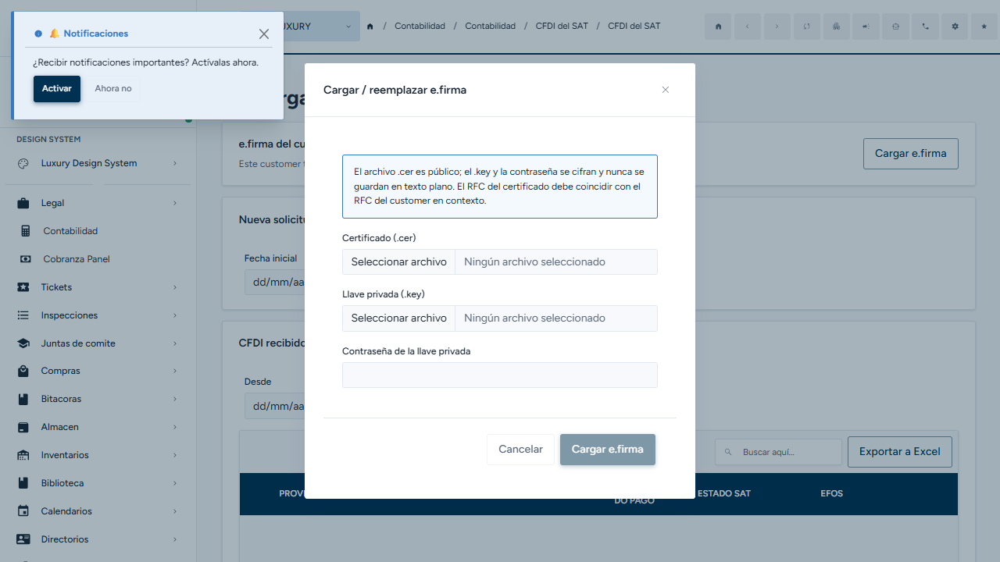
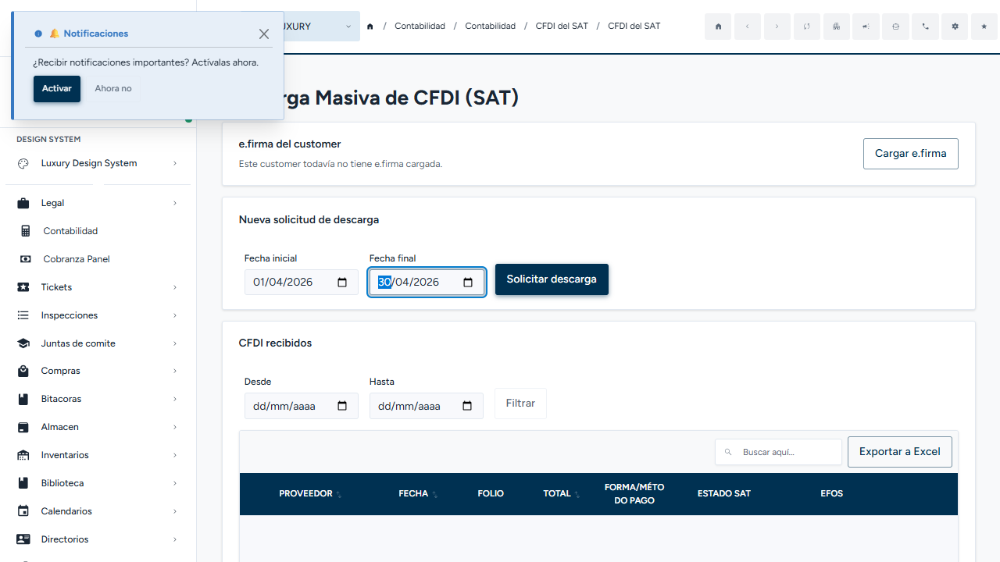

# Guía de Usuario — Descarga Masiva de CFDI del SAT

**Nivel 3** (CONVENTIONS.md §4.7, doc #6). Ubicación real exigida por convención: `appsweb/angular/src/app/modules/accounting.luxuryapp/cfdi-download/docs/guia-usuario.md`; por instrucción del Tech Lead, vive aquí junto con el resto de la documentación del módulo.

Generada con la skill `guia-usuario-modulo`: lectura del código real (backend + frontend), diagrama generado con `archify` sourced del código, y exploración real de la UI con `playwright-cli` contra el entorno de desarrollo (`http://localhost:4200`, backend `http://localhost:7070`), sesión iniciada como `admin`.

---

## Resumen

Este módulo permite que cada condominio (customer) descargue, de forma automática y directamente del SAT, todas las facturas electrónicas (CFDI) que sus proveedores le emitieron — sin depender de programas externos ni de que alguien las descargue manualmente una por una.

## Para qué sirve / qué problema resuelve

Hoy, varios customers descargan sus CFDI usando herramientas externas (por ejemplo, programas como ContadorMx) o el propio portal del SAT, de forma manual y desorganizada. Este módulo centraliza esa tarea dentro de LuxuryApp: el usuario captura un rango de fechas, el sistema se conecta al SAT con la e.firma del customer, descarga los comprobantes, y los deja listos para consultar, exportar o cruzar contra la lista de empresas que el SAT considera de riesgo (EFOS). El módulo **no emite facturas y no gestiona cuentas por pagar** — solo administra los CFDI que el customer **recibió** de sus proveedores.

## Usuarios objetivo

No son roles técnicos, son los perfiles de negocio que hoy intervienen en la administración de un condominio:

- **Dirección / SuperUsuario de la plataforma** — son los únicos que pueden cargar o reemplazar la e.firma del customer, y los únicos que pueden actualizar el padrón de empresas de riesgo (EFOS).
- **Administración, Contaduría, Gerencia de Operaciones, Gerencia de Atención, Asistencia, Gerencia de Mantenimiento y Supervisión Operativa** — pueden solicitar descargas, verificar su estado, consultar los CFDI ya descargados y exportarlos a PDF o Excel. No pueden tocar la e.firma.

## Conceptos clave

| Término | Qué significa |
|---|---|
| **e.firma** | La firma electrónica avanzada del SAT (antes llamada FIEL). Es el archivo `.cer` + `.key` + contraseña que identifica legalmente al customer ante el SAT. Sin ella, el módulo no puede pedir nada al SAT. |
| **Solicitud de descarga** | Un rango de fechas que el usuario captura (fecha inicial y fecha final). El SAT procesa cada solicitud por separado y tarda un tiempo variable en tenerla lista. |
| **CFDI** | Comprobante Fiscal Digital por Internet — la factura electrónica mexicana. Este módulo solo trabaja con los CFDI que el customer **recibió** de sus proveedores. |
| **Padrón EFOS** | Lista pública del SAT de empresas que facturan operaciones simuladas (artículo 69-B del Código Fiscal). El sistema cruza automáticamente a cada proveedor contra este padrón al descargar sus CFDI. |

## Flujo principal

El camino normal tiene cuatro momentos:

1. **Preparar la e.firma** (una sola vez, o cuando vence). Dirección o el SuperUsuario sube el certificado, la llave privada y la contraseña del customer. El sistema valida que la firma sea una e.firma vigente y que corresponda al RFC del customer antes de guardarla de forma cifrada.
2. **Solicitar y verificar la descarga.** Cualquier usuario autorizado captura un rango de fechas y solicita la descarga. El SAT no entrega los CFDI al instante: hay que volver más tarde y presionar "Verificar estado" para ver si ya está lista.
3. **Reconciliación automática.** En cuanto el SAT marca la solicitud como terminada, el sistema descarga los paquetes, los procesa, evita duplicados y cruza cada proveedor contra el padrón EFOS — todo esto ocurre solo, sin que el usuario tenga que hacer nada adicional.
4. **Consultar y exportar.** Los CFDI nuevos aparecen en la tabla del módulo. Desde ahí se puede filtrar por fecha, exportar el PDF de un comprobante individual, o exportar todo el listado a Excel.

## Diagrama

Diagrama interactivo generado con Archify, con evidencia citada del código real (archivo y línea) para cada paso:

[20261005-diagrama-accounting-cfdi-download.html](./20261005-diagrama-accounting-cfdi-download.html)

## Casos de uso

1. **Primer uso de un customer nuevo.** Dirección entra al módulo, ve el mensaje "Este customer todavía no tiene e.firma cargada", sube el `.cer`/`.key`/contraseña del customer. El sistema valida la firma y la guarda. A partir de ahí, cualquiera de los 8 roles autorizados puede empezar a solicitar descargas.
2. **Descarga mensual de rutina.** Contaduría entra el día 5 de cada mes, solicita la descarga del mes anterior completo, y vuelve un rato después a verificar el estado hasta que aparece "Descargada".
3. **Revisión de un proveedor sospechoso.** Un gerente nota un proveedor en la tabla marcado con alerta EFOS y usa esa información para decidir si sigue trabajando con él.
4. **Exportar para el contador externo.** Contaduría filtra por un rango de fechas y exporta el listado completo a Excel para entregárselo a un despacho contable externo.

## Paso a paso para el usuario

Capturas tomadas navegando la aplicación real en el entorno de desarrollo.

### 1. Entrar al módulo

Ruta real: **Contabilidad → CFDI del SAT** (`/accounting/cfdi-download`). La pantalla muestra tres secciones: estado de la e.firma, formulario para solicitar una descarga, y la tabla de CFDI recibidos.

Cuando el customer todavía no tiene e.firma cargada, el texto dice exactamente: *"Este customer todavía no tiene e.firma cargada."*

### 2. Cargar la e.firma (solo Dirección / SuperUsuario)

Al presionar **"Cargar e.firma"** se abre un formulario que pide el certificado (`.cer`), la llave privada (`.key`) y la contraseña de la llave. El propio formulario advierte: *"El archivo .cer es público; el .key y la contraseña se cifran y nunca se guardan en texto plano. El RFC del certificado debe coincidir con el RFC del customer en contexto."*

### 3. Solicitar una descarga

En la sección "Nueva solicitud de descarga" se capturan la fecha inicial y la fecha final. El botón **"Solicitar descarga"** permanece deshabilitado hasta que ambas fechas están capturadas.

Si se intenta solicitar sin tener una e.firma cargada, el sistema responde con un mensaje de error claro en pantalla — texto real observado: *"Este customer no tiene una e.firma cargada todavía."*

### 4. Verificar el estado

El botón **"Verificar estado"** se presiona manualmente — el sistema no revisa el SAT por cuenta propia. Si la solicitud sigue en proceso, hay que volver a intentarlo más tarde.

### 5. Consultar y exportar

Una vez que la solicitud queda en estado "Descargada", los CFDI aparecen en la tabla "CFDI recibidos", con columnas de proveedor, fecha, folio, total, forma/método de pago, estado SAT y alerta EFOS. Desde ahí se puede filtrar por fecha (**Desde** / **Hasta** + botón **Filtrar**), exportar el listado completo con **"Exportar a Excel"**, o abrir el PDF de un comprobante individual.

## Permisos necesarios

| Acción | Quién puede hacerla |
|---|---|
| Cargar o reemplazar la e.firma del customer | Solo Dirección o el SuperUsuario de la plataforma |
| Actualizar el padrón de empresas de riesgo (EFOS) | Solo Dirección o el SuperUsuario de la plataforma |
| Solicitar una descarga, verificar su estado, consultar y exportar CFDI | Administración, Contaduría, Gerencia de Operaciones, Gerencia de Atención, Asistencia, Gerencia de Mantenimiento, Supervisión Operativa, Dirección y SuperUsuario |
| Cualquier otro perfil de la plataforma | Sin acceso al módulo |

Cada acción está, además, siempre acotada al customer en el que el usuario está trabajando — no es posible ver ni afectar los CFDI de otro customer.

## Estados posibles de una solicitud de descarga

| Estado | Qué significa | Qué puede hacer el usuario |
|---|---|---|
| **En proceso** | El SAT todavía está preparando el paquete de CFDI | Volver más tarde y presionar "Verificar estado" de nuevo |
| **Fallida** | El SAT rechazó la solicitud o hubo un error de comunicación (estado final) | Crear una nueva solicitud — esta ya no se puede reintentar |
| **Descargada** | El SAT terminó y el sistema ya trajo, procesó y revisó los CFDI (estado final) | Consultar los CFDI nuevos en la tabla, exportarlos |

## Errores comunes y qué hacer

| Mensaje / situación | Qué hacer |
|---|---|
| *"Este customer no tiene una e.firma cargada todavía."* | Pedirle a Dirección o al SuperUsuario que cargue la e.firma antes de solicitar una descarga |
| El botón "Solicitar descarga" no se habilita | Verificar que las dos fechas (inicial y final) estén capturadas |
| Una solicitud queda "En proceso" mucho tiempo | Es normal — el SAT puede tardar; seguir verificando el estado periódicamente |
| Una solicitud queda "Fallida" | No se puede reintentar la misma solicitud; hay que crear una nueva con el mismo rango de fechas |

## Preguntas frecuentes

**¿Puedo descargar los CFDI que mi condominio emitió a otros?**
No. El módulo solo descarga los CFDI que el customer **recibió** de sus proveedores.

**¿Puedo cargar la e.firma yo mismo si soy de Contaduría?**
No. Solo Dirección o el SuperUsuario de la plataforma pueden cargar o reemplazar la e.firma, por tratarse de una credencial fiscal sensible del customer.

**¿Qué pasa si mi e.firma vence?**
Hay que cargar una nueva (reemplazar la existente) siguiendo el mismo paso de "Cargar e.firma" — el sistema vuelve a validar vigencia y RFC en ese momento.

**¿El sistema avisa automáticamente cuando la descarga está lista?**
No — hay que presionar "Verificar estado" manualmente; no hay revisión automática en segundo plano.

**¿Puedo ver los CFDI de un rango de fechas en el que todavía no he solicitado nada al SAT?**
No. Primero hay que solicitar la descarga de ese rango; el listado solo muestra lo que ya se descargó.

## Limitaciones conocidas

- La importación del padrón EFOS es manual (se sube un archivo CSV) — el SAT no publica una dirección oficial estable desde la cual el sistema pueda descargarlo automáticamente.
- No hay una tarea automática nocturna que solicite descargas por sí sola — siempre requiere que un usuario capture el rango de fechas.
- Una solicitud "Fallida" no se puede reintentar — hay que crear una nueva.
- **PENDIENTE: confirmar con el equipo** — en esta sesión no se contó con una e.firma real ni con un ambiente de pruebas (sandbox) del SAT, así que el flujo de verificar el estado contra el SAT real y la descarga/reconciliación de paquetes **no se pudo probar de principio a fin navegando la UI**. Sí se verificó leyendo el código real (ver el diagrama) y se verificó en la UI real todo lo demás: cargar e.firma (apertura del formulario y sus campos), solicitar una descarga (validación de fechas, habilitación del botón), el mensaje de error real cuando no hay e.firma, y la exportación a Excel con la tabla vacía.

## Archivos relevantes para desarrolladores

Esta guía es para el usuario de negocio. El detalle técnico vive en los otros 6 documentos del módulo:

1. [README del módulo](./20261005-readme-accounting-cfdi-download.md) — propósito funcional, endpoints, actores, reglas de negocio
2. [Documentación técnica](./20261005-documentation-accounting-cfdi-download.md) — arquitectura, entidades, servicios
3. [Operativo](./20261005-operativo-accounting-cfdi-download.md) — rutas, componentes, servicios frontend
4. [Setup / onboarding](./20261005-setup-accounting-cfdi-download.md) — guía para un developer nuevo
5. [Decisiones (matriz)](./20261005-decisiones-accounting-cfdi-download.md) — dónde poner cada feature nueva
7. [Auditoría ejecutada](./20261005-auditoria-accounting-cfdi-download.md) — hallazgos y plan de remediación

Documentos de planeación (previos a la construcción): [discovery](./20261004-discovery-accounting-cfdi-download.md), [reglas de negocio FASE 0](./20261004-business-rules-accounting-cfdi-download.md), [riesgos y dependencias](./20261004-riesgos-dependencias-accounting-cfdi-download.md), [plan de 11 secciones](./20261004-plan-accounting-cfdi-download.md), [checklist](./20261005-checklist-accounting-cfdi-download.md), [recon de entidades](./20261004-entity-recon-accounting-cfdi-download.md), [architecture](./20261005-architecture-accounting-cfdi-download.md).
