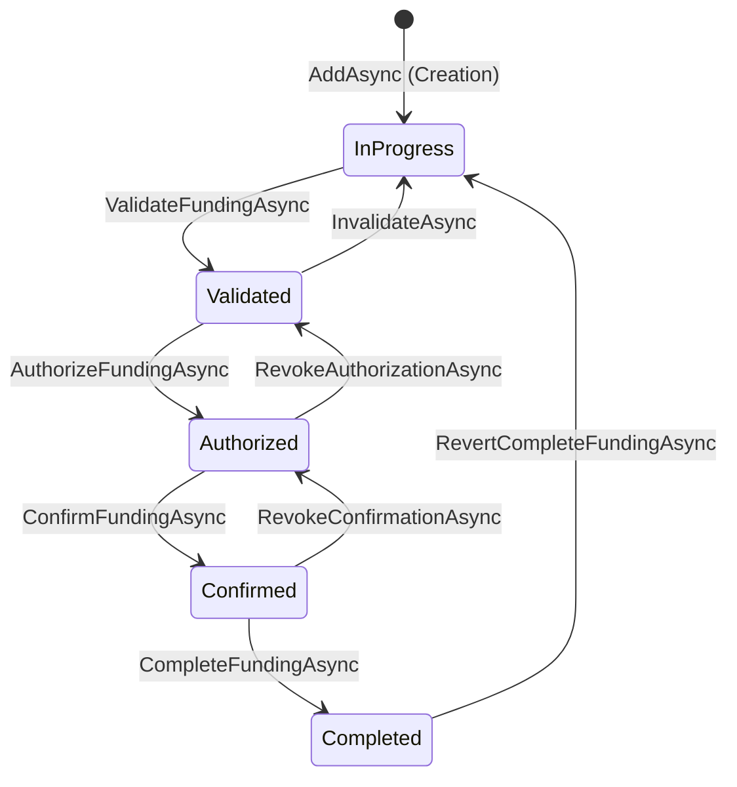

# Auditoría: Fondeos (AccountingLuxuryApp) - 2026-10-05

## 1. Hallazgos Críticos (Errores que ROMPEN Lógica)

- ❌ **Seguridad (IDOR) en ZIPs:** El endpoint `MapPost("download-zip")` en `FundingFileEndpoints.cs` no cuenta con `.RequireAuthorization()`. Cualquier actor externo sin autenticación puede descargar comprobantes (ZIP) enviando IDs válidos.
- ❌ **Modificación en Estados Finales:** En `FundingAppService.cs`, endpoints de mutación como `UpdateAsync`, `UpdateOrderAsync`, `UpdatePurchasePaidStatusAsync` no verifican el estado del fondeo. Un usuario autenticado puede modificar un fondeo incluso si ya fue verificado, autorizado o confirmado (`VerifiedById != null`, etc). El Frontend lo restringe visualmente, pero la API lo permite.
- ❌ **Integridad Relacional (Huérfanos):** Al llamar a `DeleteByIdAsync` se ejecuta un borrado físico sin validar si el fondeo contiene órdenes de compra. Debido a que las `OrdenesCompra` se enlazan mediante variables (Periodo/Año) o booleanos, quedarán apuntando a un fondeo inexistente.
- ❌ **Duplicidad por Concurrencia:** `AddAsync` no verifica si ya existe un fondeo para ese `CustomerId` y `Period`. Un doble envío crea dos fondeos idénticos que rompen consultas y reportes.
- ❌ **Comités Hardcodeados (Diseño):** En `FundingFileAppService.cs` las listas de comités de firmas (`ComiteMTK`, `ComiteRoyal`) y los números de cliente (`"64"`, `"25"`) están quemados en el código. Esto rompe el principio Open/Closed y genera alta fricción de mantenimiento.

---

## 2. Matriz de Reglas de Negocio (4 Niveles)

| Nivel | Tipo | Regla | Estado Actual en Código |
|-------|------|-------|-------------------------|
| **1** | Invariante | Un periodo de fondeo es único por Cliente. | ❌ NO SE CUMPLE. `AddAsync` permite crear duplicados sin restricción ni Unique Index. |
| **2** | Flujo / Estado | Un fondeo Validado/Autorizado/Confirmado es Inmutable en sus partidas y totales. | ❌ NO SE CUMPLE. Backend no bloquea `Update` ni adición/edición de datos de pago sobre estados finales. |
| **2** | Flujo / Estado | Para avanzar a *Validated*, las facturas XML deben cuadrar con el total de la orden. | ❌ NO SE CUMPLE. `ValidateFundingAsync` cambia de estado sin revisar el resultado de `ValidateInvoiceAsync`. |
| **3** | Seguridad | Solo personal autorizado de la compañía/comité puede visualizar y descargar comprobantes de pago. | ❌ NO SE CUMPLE. El endpoint de ZIPs de `FundingFileEndpoints` no requiere token JWT ni valida Tenant (`CustomerId`). |
| **4** | Validación | Las fechas de los períodos deben corresponder estrictamente a quincenas del calendario (1-15 o 16-fin de mes). | ⚠️ PARCIAL. Se parsea en base al día 8 o 16, pero carece de un manejo robusto de excepciones de fecha. |

---

## 3. Matriz de Permisos (Endpoints vs UI)

| Endpoint / Componente | Método | Acción | Rol Requerido (Backend) | ¿Frontend Oculta/Valida? | Coherencia |
|-----------------------|--------|--------|-------------------------|--------------------------|------------|
| `/api/funding/validate/{id}` | GET | Validar Fondeo | `SuperUsuario`, `Direccion`, `Administrador`, `GerenteOperaciones`, `Asistente` | Sí | ✅ OK |
| `/api/funding/authorize/{id}` | GET | Autorizar Fondeo | `SuperUsuario`, `Direccion`, `Administrador`, `GerenteOperaciones` | Sí | ✅ OK |
| `/api/funding/confirm/{id}` | GET | Confirmar Fondeo | `SuperUsuario`, `Direccion`, `Contador` | Sí | ✅ OK |
| `/api/funding-file/download-zip` | POST | Descargar ZIP Solicitudes | **N/A (Público)** | Sólo lo muestra a autenticados | ❌ PELIGROSO (IDOR) |
| `/api/funding/{id}` (Update) | PUT | Editar Fondeo | `[Authorize]` (Cualquiera Autenticado) | Lo restringe vía `canEdit` | ❌ Falsa seguridad |
| `/api/funding/{id}` (Delete) | DELETE | Eliminar Fondeo | `[Authorize]` (Cualquiera Autenticado) | Restringe vía UI | ❌ Falsa seguridad |

---

## 4. Validaciones Inconsistentes (Front vs Back)

| Campo / Acción | Validación Frontend | Validación Backend | ¿Coinciden? |
|----------------|---------------------|--------------------|-------------|
| Modificar Fondeo (Edición) | `!isVerified && !isAuthorized` | Ninguna | ❌ Falsa Seguridad. Backend vulnerable. |
| Agregar OC a Fondeo | `!isVerified && !isAuthorized` | Ninguna | ❌ Falsa Seguridad. Backend vulnerable. |
| Total vs XML (Factura) | Muestra advertencias de descuadre | Genera estado `IsValid`, pero no lo exige | ⚠️ Parcialmente (Ambos ignoran la restricción). |

---

## 5. Diagrama de Flujos de Estados (Máquina de Estados)

*Problema detectado: La transición hacia "Completed" no exige que haya pasado por "Confirmed" previamente en el código.*

---

## 6. Recomendaciones / Plan de Remediación

1. **Asegurar Endpoint de ZIPs:** Agregar inmediatamente `.RequireAuthorization()` en `FundingFileEndpoints.cs` y validar que el usuario pertenece al `CustomerId` en cuestión.
2. **Implementar *Guard Clauses* en Backend:** En `FundingAppService.cs`, agregar validaciones al inicio de los métodos de mutación (Update, Delete, UpdateOrder, UpdatePurchasePaidStatus) que lancen una `BusinessException` si `VerifiedById != null` o el fondeo no está en estado "InProgress".
3. **Bloqueos Lógicos de Relación:** En `DeleteByIdAsync`, validar si existen órdenes de compra en el periodo a eliminar (`FundingPeriod` y `FundingYear`). Si las hay, bloquear el borrado y exigir al usuario eliminar las órdenes primero o desvincularlas.
4. **Validación de Concurrencia:** En `AddAsync`, usar `AnyAsync` para evitar la creación de fondeos duplicados bajo la misma quincena para un mismo cliente, e idealmente añadir un Constraint en BD.
5. **Comités Dinámicos (Refactor):** Eliminar el *hardcodeo* de nombres en `FundingFileAppService.cs` y migrar esta configuración a la base de datos (Ej: Tabla `CustomerCommitteeSettings`), vinculada por `CustomerId` (Guid) y no por `NumeroCliente` en string.
