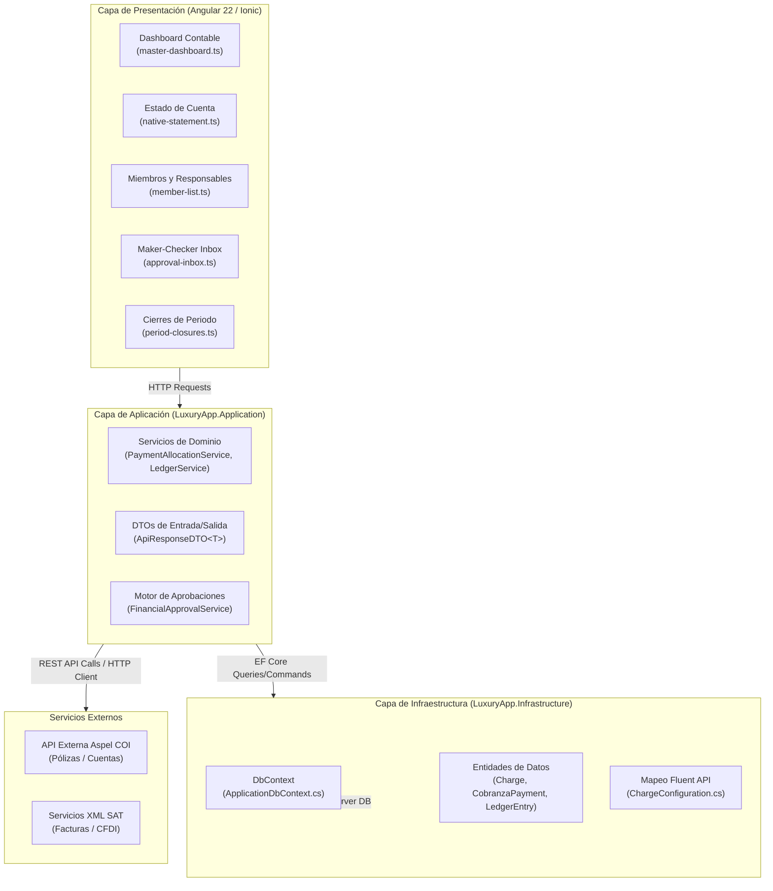
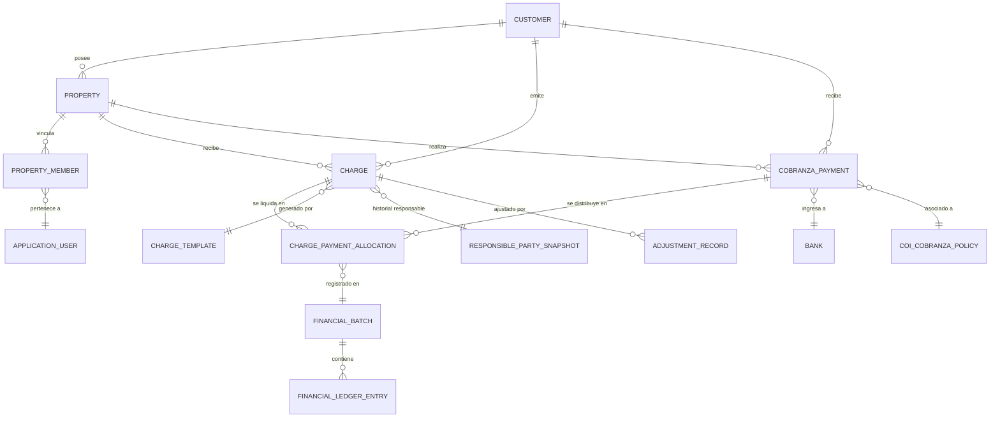
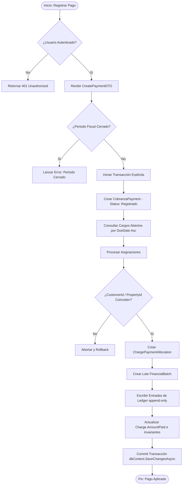
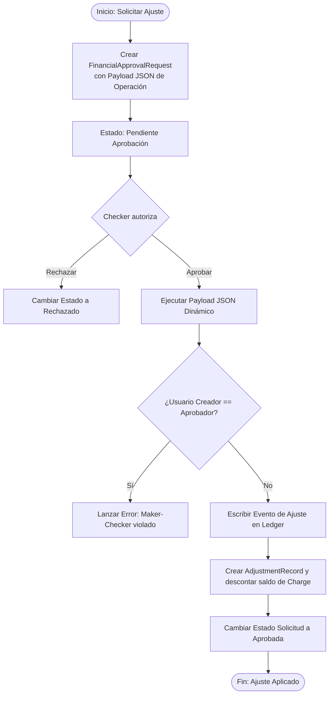

Ruta: 📂 Documentación > 💼 Contabilidad y Finanzas > 📊 Análisis de Módulo
📅 Última Revisión: Junio 2026
🛡️ Estado: Vigente
👤 Responsable: Arquitecto de Software Senior & Analista de Negocios

---

# Análisis del Módulo de Contabilidad y Cobranza - LuxuryApp

## 1. Resumen Ejecutivo

El presente reporte técnico realiza un diagnóstico y descripción forense exhaustiva del módulo de **Contabilidad y Cobranza** de LuxuryApp, que constituye el núcleo financiero del ecosistema. El sistema opera bajo un modelo híbrido estructurado:
1. **Cobranza Nativa:** Un subsistema financiero local blindado y auditable que gestiona la facturación interna, asignación de pagos, condonaciones y cuentas por cobrar de los condóminos, sustentado sobre un Ledger inmutable append-only.
2. **Contabilidad y Enlace ERP (Aspel):** Un modelo de sincronización espejo en base de datos local que consume la API del ERP Aspel (COI/SAE), la cual actúa como la única fuente de verdad contable y fiscal para la emisión de estados financieros globales.

La reciente transición arquitectónica (Fases 0 a 5) ha erradicado la volatilidad operativa tradicional mediante la inmutabilidad de transacciones en base a partidas dobles en el Ledger, la separación del responsable legal mediante la entidad `PropertyMember` e históricos en `ResponsiblePartySnapshot`, y la seguridad Maker-Checker en condonaciones.

---

## 2. Alcance y Metodología

El análisis abarca las tres capas principales de la solución:
*   **Capa de Infraestructura (.NET 10 / EF Core):** Mapeo de entidades del catálogo general contable, pólizas, auxiliares de COI, cargos, pagos y el nuevo Ledger en [ApplicationDbContext.cs](file:///D:/repos/luxuryapp-api/api/LuxuryApp.Infrastructure/Data/ApplicationDbContext.cs).
*   **Capa de Aplicación (.NET 10):** Servicios y controladores en `D:\repos\luxuryapp-api\api\LuxuryApp.Application\Tenant\Accounting\Contabilidad` que ejecutan la lógica financiera, validación anti-fraude, transaccionalidad e integraciones externas.
*   **Capa de Presentación (Angular 22 / Ionic):** Pantallas, componentes reactivos basados exclusivamente en **Signals**, rutas configuradas en [contabilidad.routing.ts](file:///D:/repos/luxuryapp-api/client/angular/src/app/features/accounting/general-ledger/contabilidad/contabilidad.routing.ts) e integración de formularios mediante `FormHelper`.

---

## 3. Arquitectura del Módulo

El módulo de Contabilidad y Cobranza está diseñado bajo principios de **Clean Architecture**, con desacoplamiento estricto entre la lógica de negocio y las integraciones externas (ERP y Pasarelas de Pago).



---

## 4. Modelo de Datos (Infrastructure)

### 4.1 Entidades de Contabilidad

Estas entidades representan los datos contables generales y del ERP Aspel COI sincronizados localmente:
*   **`AccountingCatalog` / `ContabilidadCuenta`:** Catálogo de cuentas contables sincronizado desde Aspel COI (`AccountingAccounts` en BD). Mantiene la jerarquía mediante `CTA_PAPA` (referencia al padre) y propiedades como naturaleza (`D` o `A`) y nivel.
*   **`ContabilidadPoliza`:** Encabezados de pólizas contables sincronizadas (`AccountingPolicies` en BD) clasificadas en Diario, Ingresos o Egresos (`TIPO_POLI`).
*   **`ContabilidadAuxiliar`:** Detalle de movimientos de pólizas contables (`AccountingLedgers` en BD), con montos (`MONTOMOV`) y el indicador cargo/abono (`DEBE_HABER`).
*   **`ContabilidadSaldo`:** Historial de saldos acumulados de las cuentas.
*   **`ContabilidadPresupuesto`:** Presupuestos autorizados por mes.
*   **`ContabilidadFiscalPeriod`:** Control de los periodos fiscales de contabilidad.
*   **`CoiCobranzaAccount`, `CoiCobranzaBalance`, `CoiCobranzaMovement`, `CoiCobranzaPolicy`, `CoiFiscalPeriod`:** Tablas específicas para la conciliación y transiciones contables entre Cobranza y Aspel COI.

### 4.2 Entidades de Cobranza

Son las entidades operativas internas del sistema que permiten controlar la deuda de cada condominio:
*   **`Charge`:** Cargos emitidos (`Charges` en BD). Contiene el importe, saldo (`Balance = Amount - AmountPaid`), vencimiento y el responsable del devengo.
*   **`CobranzaPayment`:** Pagos registrados (`Payments` en BD). Contiene importe recibido, fecha, método, referencia bancaria y póliza COI relacionada.
*   **`ChargePaymentAllocation`:** Tabla bridge (`PaymentAllocations` en BD) que asocia qué parte de un pago se aplica a qué cargo.
*   **`PropertyMember`:** Relación dinámica (`PropertyMembers` en BD) que unifica propietarios e inquilinos, estableciendo quién es el sujeto financiero (`IsFinancialResponsible`).
*   **`ResponsiblePartySnapshot`:** Datos congelados del responsable del pago al momento del devengo del cargo.
*   **`AdjustmentRecord`:** Bitácora inmutable de condonaciones y ajustes aplicados.
*   **`CreditNote`:** Registro y control de Notas de Crédito financieras.
*   **`LateFeePolicy` / `MorosidadPolicy`:** Políticas de cobro de recargos y mora legal.
*   **`FinancialLedgerEntry`:** Registro inmutable (partida del Libro Mayor append-only) que representa eventos financieros (devengos, pagos, reversos).
*   **`FinancialBatch`:** Agrupador transaccional de múltiples registros Ledger.
*   **`CobranzaPeriodClosure`:** Registro de bloqueo mensual que asegura el cierre de periodos.

### 4.3 Diagrama ER (Mermaid)



### 4.4 Tabla de relaciones

| Entidad Origen | Entidad Destino | Cardinalidad | Clave Foránea (FK) | Comportamiento Delete | Propósito / Contexto |
| :--- | :--- | :---: | :--- | :--- | :--- |
| `Charge` | `Customer` | N:1 | `CustomerId` | Restrict | Multi-tenancy. Cada cargo pertenece a una empresa/condominio. |
| `Charge` | `Property` | N:1 | `PropertyId` | Restrict | Relación con la unidad inmobiliaria a la que se le cobra. |
| `Charge` | `CoiCobranzaAccount`| N:1 | `CoiCobranzaAccountId` (Nullable) | Set Null | Cuenta contable COI asociada para pólizas automáticas. |
| `Charge` | `ResponsiblePartySnapshot` | N:1 | `ResponsiblePartySnapshotId` (Nullable) | Set Null | Congela los datos del propietario deudor a la fecha de emisión. |
| `ChargePaymentAllocation` | `Charge` | N:1 | `ChargeId` | Restrict | Asignación de pago. Afecta el saldo de este cargo. |
| `ChargePaymentAllocation` | `CobranzaPayment` | N:1 | `PaymentId` | Restrict | Asignación de pago. Origen del flujo de caja. |
| `PropertyMember` | `Property` | N:1 | `PropertyId` | Restrict | Vinculación del habitante con su respectiva propiedad. |
| `PropertyMember` | `ApplicationUser` | N:1 | `UserId` | Restrict | Liga al miembro de la propiedad con un usuario del sistema. |
| `AdjustmentRecord` | `Charge` | N:1 | `ChargeId` | Restrict | Registro de auditoría por ajuste de saldo. |
| `FinancialLedgerEntry` | `FinancialBatch` | N:1 | `BatchId` | Restrict | Agrupación de entradas del Ledger para control transaccional. |

---

## 5. Lógica de Negocio (Application)

### 5.1 Casos de uso de Contabilidad

1.  **Sincronización Espejo de Aspel COI:**
    *   **Procesamiento:** Invoca periódicamente la API de Aspel para actualizar las tablas locales (`ContabilidadCuenta` y `ContabilidadPoliza`). Permite a la aplicación local consultar cuentas sin latencia de red de la API externa.
2.  **Cálculo de Estados Financieros:**
    *   **Procesamiento:** `ContabilidadOnlineLocalService.cs` y `EstadoResultadosServiceV2.cs` realizan proyecciones directas en base a la cobranza efectivamente recibida (Ingresos) menos los fondeos pagados (Egresos).
    *   **Cédula Presupuestal:** Compara el presupuesto autorizado contra el gasto acumulado en los periodos quincenales de fondeo.

### 5.2 Casos de uso de Cobranza

1.  **Devengo y Emisión Mensual de Cargos:**
    *   **Procesamiento:** Genera los cargos fijos a partir de `ChargeTemplate`. Asigna el deudor resolviendo a la persona con `IsFinancialResponsible = true` vigente a través de `PropertyMemberService.cs`, guardando la información en `ResponsiblePartySnapshot`.
2.  **Registro y Aplicación Automática/Manual de Pagos:**
    *   **Procesamiento:** Registra un `CobranzaPayment`. `PaymentAllocationService.cs` ejecuta la distribución del importe en los cargos abiertos del condómino (priorizando los más vencidos por fecha).
3.  **Condonaciones y Ajustes (Maker-Checker):**
    *   **Procesamiento:** El operador solicita un ajuste (ej. condonación de recargo). Se genera un `FinancialApprovalRequest`. Al ser autorizado por un Checker, se dispara la creación del `AdjustmentRecord` y el reverso proporcional en el Ledger.

### 5.3 Diagramas de flujo por caso de uso (Mermaid)

#### A. Flujo de Registro y Aplicación de Pagos con Ledger



#### B. Flujo de Ajuste / Condonación (Maker-Checker)



### 5.4 Reglas de negocio y condiciones críticas

> [!IMPORTANT]
> **Garantía Anti-Fraude Cross-Tenant y Cross-Property:**
> Durante la asignación de pagos, [PaymentAllocationService.cs](file:///D:/repos/luxuryapp-api/api/LuxuryApp.Application/Tenant/Accounting/Contabilidad/CobranzaNativa/Services/PaymentAllocationService.cs) (Líneas 116-141) valida que el `CustomerId` y `PropertyId` del pago coincidan estrictamente con los del cargo seleccionado. Si hay discrepancia, se aborta la transacción para evitar desvíos de fondos entre condominios.

*   **Inmutabilidad Financiera:** No se realiza borrado físico (`DELETE`) en transacciones monetarias. Las cancelaciones de pagos o cargos generan contramovimientos en el Ledger (`FinancialLedgerEntry`) con montos de naturaleza contraria.
*   **Seguridad de Concurrencia:** Las entidades `Charge`, `CobranzaPayment` y `ChargePaymentAllocation` implementan un token de concurrencia optimista (`[Timestamp] RowVersion`) que previene la sobreasignación de saldos por peticiones simultáneas.
*   **Idempotencia:** La generación mensual de cargos se blinda por una llave compuesta `(TemplateId, PropertyId, Mes, Año)` en `ChargesGeneratorService.cs` para evitar cobros duplicados por reintento del operador.

---

## 6. Experiencia de Usuario (Angular)

### 6.1 Componentes y rutas

El frontend está estructurado en módulos perezosos (lazy-loaded). Los componentes financieros interactúan mediante **Signals** para garantizar máxima reactividad y evitar renderizados costosos.

*   **Dashboard Contable:** ` D:\repos\luxuryapp-api\client\angular\src\app\features\accounting\general-ledger\contabilidad\master-dashboard\`
    *   *Ruta:* `/contabilidad`
    *   *Uso:* Panel principal financiero y acceso a los reportes consolidados.
*   **Cobranza Nativa Dashboard:** `...\contabilidad\cobranza-nativa\pages\cobranza-nativa-dashboard\`
    *   *Ruta:* `/cobranza-nativa`
    *   *Uso:* Métricas de morosidad, cobertura de cuotas y estado global de cobranza del condominio.
*   **Gestión de Miembros:** `...\cobranza-nativa\pages\members\`
    *   *Ruta:* `/cobranza-nativa/members`
    *   *Uso:* Listado y alta de miembros de propiedades. Asignación del flag `IsFinancialResponsible` mediante un stepper que consume `PropertyMemberService`.
*   **Bandeja Maker-Checker:** `...\cobranza-nativa\pages\approvals\`
    *   *Ruta:* `/cobranza-nativa/approvals`
    *   *Uso:* Bandeja de entrada para aprobadores que lista solicitudes pendientes.
*   **Visor Libro Mayor Ledger:** `...\cobranza-nativa\pages\ledger\`
    *   *Ruta:* `/cobranza-nativa/ledger`
    *   *Uso:* Vista forense inmutable de todas las transacciones históricas.

### 6.2 Diagrama de navegación (Mermaid)

```mermaid
flowchart TD
    Main[/contabilidad] -->|Menú Principal| Dashboard[/cobranza-nativa]
    Main -->|Reportes| Reports[/contabilidad/financial-statements-reports]
    Main -->|Catálogo| Catalog[/contabilidad/accounting-catalog]
    
    Dashboard --> Members[/cobranza-nativa/members]
    Dashboard --> Charges[/cobranza-nativa/charges]
    Dashboard --> Payments[/cobranza-nativa/payments]
    Dashboard --> Approvals[/cobranza-nativa/approvals]
    Dashboard --> LedgerView[/cobranza-nativa/ledger]
    Dashboard --> Closures[/cobranza-nativa/period-closures]
```

### 6.3 Integración con el backend

*   **Consumo de API:** Los servicios del frontend (ej. `PropertyMemberService`) inyectan `HttpClient` y mapean las respuestas tipadas al DTO global `ApiResponseDTO<T>`.
*   **Signals Reactivos:** Se emplean `signal()` para manejar el estado del listado y `computed()` para filtros reactivos (ej. término de búsqueda o rango de fechas).
*   **FormHelper:** Todos los formularios operativos (ej. `member-form.ts`) implementan `FormHelper.submitCrud()` para el control de botones de carga y alertas de confirmación en español.

---

## 7. Trazabilidad End-to-End

La siguiente tabla describe la trazabilidad completa del ciclo de vida de las operaciones contables:

| Flujo de Negocio | Entidad (Infrastructure) | Caso de Uso / Servicio (Application) | Endpoint API (Controller) | Componente Angular (Frontend) |
| :--- | :--- | :--- | :--- | :--- |
| **Devengo de Cargo** | `Charge`, `ResponsiblePartySnapshot`, `ChargeTemplate` | `ChargesGeneratorService`, `ChargeAppService` | `POST /api/charges` | `charges/charge-form.ts` |
| **Aplicación de Pago** | `CobranzaPayment`, `ChargePaymentAllocation`, `FinancialLedgerEntry` | `CobranzaPaymentAppService`, `PaymentAllocationService`, `LedgerService` | `POST /api/payments` | `payments/payment-form.ts` |
| **Ajuste / Condonación** | `AdjustmentRecord`, `FinancialApprovalRequest` | `AdjustmentService`, `FinancialApprovalService` | `POST /api/financial-approvals` | `payments/credit-note-modal.ts` |
| **Validación de Fondeo** | `Funding`, `FinancialApprovalRequest`, `FinancialBatch` | `FundingAppService` | `GET /api/funding/validate/{id}` | `fondeos-y-reporteo/funding/funding-detail.ts` |
| **Cierre de Periodo** | `CobranzaPeriodClosure` | `PeriodClosureService` | `POST /api/period-closures/close` | `period-closures/period-closure-dashboard.ts` |

---

## 8. Roles y Permisos

La seguridad financiera se rige bajo una estricta segregación de funciones:

| Acción Contable / Operativa | Asistente (Assistant) | Administrador (Admin) | Contador (Accountant) | Residente (Resident) |
| :--- | :---: | :---: | :---: | :---: |
| **Generar Cargos / Plantillas** | Sí | Sí | No | No |
| **Registrar Pago Recibido** | Sí | Sí | Sí | No |
| **Solicitar Ajuste (Maker)** | Sí | No | No | No |
| **Aprobar Condonaciones (Checker)**| No | Sí | No | No |
| **Ver Libro Mayor (Ledger)** | Sí | Sí | Sí | No |
| **Ejecutar Cierres Mensuales** | No | Sí | Sí | No |
| **Validar Solicitud de Fondeo** | Sí | Sí (como SuperUser) | No | No |
| **Autorizar Pago de Fondeo** | No | Sí | No | No |
| **Confirmar Recepción Contable** | No | No | Sí | No |
| **Consultar Estado Cuenta** | No | No | No | Sí |

---

## 9. Hallazgos y Observaciones

### 9.1 Puntos fuertes
*   **Rigor Financiero con Ledger Inmutable:** El sistema no muta datos históricos arbitrariamente; cualquier reverso de transacción deja registro en el Libro Mayor.
*   ** Maker-Checker Implementado:** Se reduce el riesgo de fraude operativo al exigir doble autorización en condonaciones.
*   **Protección Tenant/Property:** Las validaciones de consistencia bloquean cruzamiento ilegal de datos financieros entre condominios distintos.

### 9.2 Deudas técnicas identificadas

> [!WARNING]
> Se identificaron las siguientes deudas en [TECHNICAL-DEBT.md](file:///D:/repos/luxuryapp-api/api/LuxuryApp.Application/Tenant/Accounting/Contabilidad/TECHNICAL-DEBT.md):
> *   **D01 (Severidad Alta):** El frontend consume `AspelApiClient` en ciertos flujos contables en lugar de las tablas de base de datos local replicadas.
> *   **D02 (Severidad Alta):** Falta validación de `[Authorize]` explícito en controladores de `ReportFinancialStatementsController`.
> *   **D05 (Severidad Baja):** `CedulaPresupuestal` ejecuta lógica matemática pesada para totales en el frontend en lugar de recibirlos procesados del backend.

### 9.3 Oportunidades de mejora
1.  **Refactorización Completa de Entidades Legacy:** Desacoplar definitivamente `Owner.cs` del resto del sistema y usar exclusivamente `PropertyMember.cs` como fuente de verdad.
2.  **Validación Automática de Integridad:** Correr de forma asíncrona mediante un Background Job (`LedgerIntegrityService.cs`) auditorías entre el balance operacional (`Charges`) y el balance del Ledger para disparar alertas inmediatas.

---

## 10. Glosario de Términos

*   **Ledger (Libro Mayor):** Registro histórico inmutable append-only donde se guardan todas las transacciones y eventos contables.
*   **Devengo (Devengado):** Registro de un cargo financiero (deuda) en el momento en que se genera, independientemente de cuándo se pague.
*   **Maker-Checker (Doble Control):** Control de seguridad donde un operador crea una solicitud (Maker) y un usuario diferente con mayor rango debe autorizarla (Checker).
*   **Cierre de Periodo:** Acción de bloquear un mes contable para evitar que se registren o modifiquen transacciones con fecha anterior a la de cierre.
*   **Sincronización Espejo:** Copia local en base de datos de las tablas del ERP Aspel COI para acelerar lecturas y no saturar la API externa.

---

## 11. Anexos

### Fragmento de validación crítica en `PaymentAllocationService.cs`
A continuación se detalla la lógica de validación multi-tenant que bloquea la aplicación de pagos cruzados:

```csharp
// VALIDACION CRITICA: verificar que ningún cargo pertenece a otro tenant o propiedad diferente
var chargesDeOtroTenant = chargesToUpdate
    .Where(c => c.CustomerId != payment.CustomerId)
    .ToList();
if (chargesDeOtroTenant.Any())
{
    logger.LogWarning("Intento de aplicar pago {PaymentId} a cargos de otro tenant. Operación rechazada.", payment.Id);
    return ApiResponseDTO<ApplyPaymentResultDTO>.ErrorResult("Operación rechazada: cargos ajenos al tenant del pago.");
}

var chargesDeOtraPropiedad = chargesToUpdate
    .Where(c => c.PropertyId != payment.PropertyId)
    .ToList();
if (chargesDeOtraPropiedad.Any())
{
    logger.LogWarning("Intento de aplicar pago {PaymentId} a cargos de otra propiedad. Operación rechazada.", payment.Id);
    return ApiResponseDTO<ApplyPaymentResultDTO>.ErrorResult("Operación rechazada: cargos ajenos a la propiedad del pago.");
}
```
