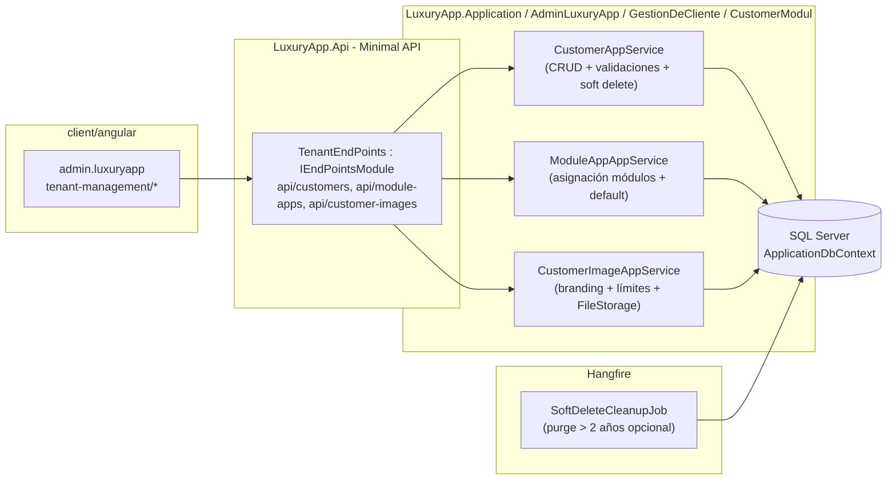
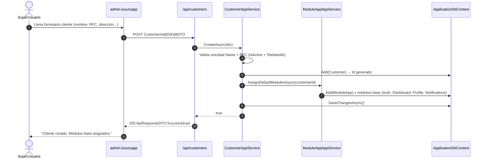
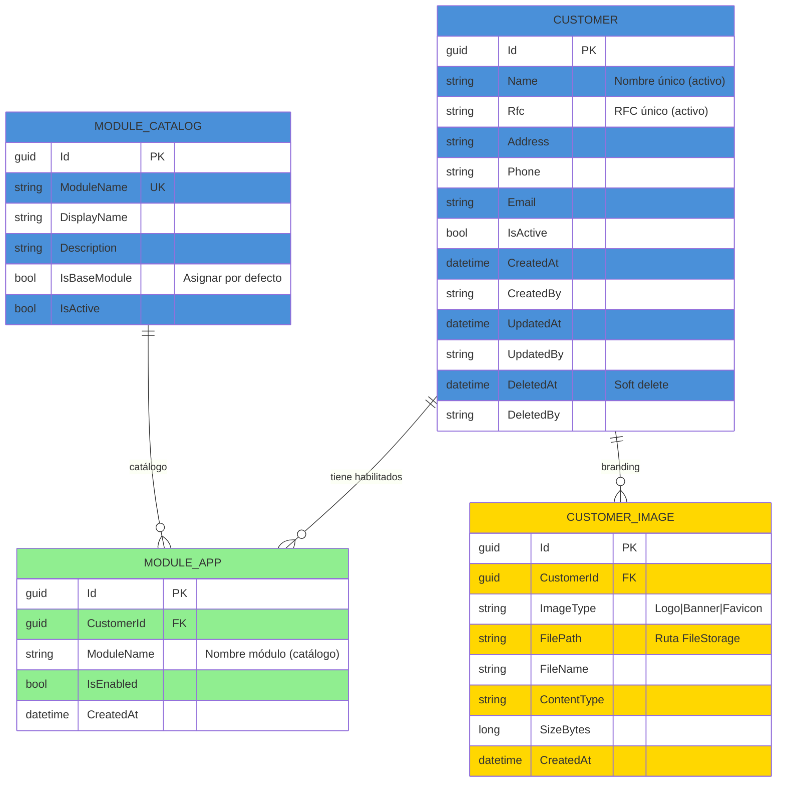

# TenantManagement (Administración Multi-tenant) — Documentación Técnica

> **Ruta**: 📂 Documentación > 💼 Configuración > 🏢 TenantManagement
> **📅 Última Revisión**: 13-jul-26
> **🛡️ Estado**: ✅ Vigente
> **👤 Responsable**: @equipo-arquitectura

---

## 📑 Tabla de Contenidos

1. [Resumen Ejecutivo](#-resumen-ejecutivo)
2. [Visión Funcional](#-visión-funcional)
3. [Arquitectura Técnica](#-arquitectura-técnica)
4. [API Endpoints](#-api-endpoints)
5. [Flujo del Sistema](#-flujo-del-sistema)
6. [Componentes Frontend](#-componentes-frontend)
7. [Reglas de Negocio](#-reglas-de-negocio)
8. [Matriz de Permisos](#-matriz-de-permisos)
9. [Catálogo de Roles del Sistema](#-catálogo-de-roles-del-sistema)
10. [Base de Datos](#-base-de-datos)
11. [Performance](#-performance)
12. [Glosario de Términos](#-glosario-de-términos)
13. [Checklist de Validación](#-checklist-de-validación)
14. [Historial de Cambios](#-historial-de-cambios)

---

## 🎯 Resumen Ejecutivo

**Propósito**: Módulo central de configuración que administra clientes/condominios (`Customer`) y módulos habilitados por cliente (`ModuleApp`) en el sistema multi-tenant LuxuryApp, garantizando aislamiento de datos y control funcional por tenant.

**Actores Involucrados** (`ApplicationRoleEnum`): `SuperUsuario` (único con permisos de alta/baja clientes), `Administrador`, `GerenteOperaciones`, `GerenteAtencion`, `Asistente` (lectura/gestión módulos).

**Dependencias**: `Customer` (entidad raíz tenant), `ModuleApp` (catálogo módulos), `CustomerImage` (branding), `ApplicationUser` (auditoría), `FileStorage` (imágenes), Hangfire (jobs limpieza soft-delete).

**Alcance**:

- ✅ Incluye: CRUD `Customer` + soft delete, asignación módulos por cliente, imágenes branding (logo/banner), validaciones unicidad nombre/RFC, módulos base por defecto, auditoría completa.
- ❌ No incluye: Facturación SaaS, límites uso/usuarios, migración datos entre tenants, portal autogestión cliente (onboarding self-service).

---

## 🔍 Visión Funcional

**HU-01 — Alta de condominio (solo SuperUsuario)**

> Como **SuperUsuario** quiero crear un nuevo cliente/condominio con datos fiscales y contacto para que el sistema lo reconozca como tenant activo.
> **Criterios**: `POST /api/customers` → valida unicidad `Name` + `RFC` → crea `Customer` (`IsActive=true`) → asigna `ModuleApp` base (Auth, Dashboard, Profile) → `ApiResponseDTO.Success(true)`.

**HU-02 — Gestión de módulos por cliente**

> Como **administrador** quiero habilitar/deshabilitar módulos funcionales para cada condominio según su contratación.
> **Criterios**: `GET /api/module-apps/{customerId}` lista módulos con `IsEnabled`; `POST /api/module-apps` actualiza (upsert) lista completa; valida que módulo existe en catálogo `ModuleCatalog`.

**HU-03 — Branding por condominio**

> Como **admin** quiero subir logo/banner por cliente para personalizar la UI del tenant.
> **Criterios**: `POST /api/customer-images` (base64, tipo `Logo`|`Banner`|`Favicon`); valida límite 3 imágenes/cliente; `FileStorage` carpeta `tenant/{customerId}/`; devuelve URL firmada.

**HU-04 — Soft delete y auditoría**

> Como **auditor** quiero que la baja de cliente sea lógica preservando histórico y que todos los cambios queden auditados.
> **Criterios**: `DELETE /api/customers/{id}` → `DeletedAt` + `DeletedBy` (no borra físico); listados excluyen `DeletedAt != null`; `CreatedAt/By`, `UpdatedAt/By` obligatorios en todas las entidades.

---

## 🏗️ Arquitectura Técnica



| Capa         | Tecnología                                                                            |
| ------------ | ------------------------------------------------------------------------------------- |
| Backend      | .NET 10, Minimal APIs (`IEndpointModule`), EF Core 10                                 |
| Imágenes     | `IFileWritePathService` + `IFileReadPathService` (carpeta `tenant/{customerId}/`)     |
| Validaciones | Unicidad `Name` + `RFC` (índice único filtrado `IsActive=true` + `DeletedAt IS NULL`) |
| Módulos base | Seed `ModuleCatalog` → `ModuleAppAppService.AssignDefaultModulesAsync`                |
| Jobs         | Hangfire (`RecurringJob`) limpieza opcional soft-delete > 2 años                      |
| Respuestas   | `ApiResponseDTO<T>` (nunca `ProblemDetails`)                                          |
| Mapeo        | Explícito `ToDTO()` (AutoMapper prohibido)                                            |
| Frontend     | Angular 22 (standalone, signals, OnPush), Bootstrap 5, catálogo `@ui/*`                   |

---

## 📱 Mobile Responsive (§15 CONVENTIONS.md)

| Vista                                               | Patrón (§15.2)         | Implementación                                                           |
| --------------------------------------------------- | ---------------------- | ------------------------------------------------------------------------ |
| `CustomerList` / `CustomerForm` / `ModuleAppMatrix` | **A — CSS Responsive** | PrimeFlex grid (`p-col-*`), `p-table` responsive, `p-dialog` formularios |

**Reglas aplicadas:**

- Breakpoint único: 768px (`PlatformService.isMobile()`)
- Touch targets ≥ 44×44px en botones/iconos
- Safe areas: `p-dialog` / `p-sidenav` manejan notch
- File upload: `p-fileUpload` web (drag&drop + validación tipo/tamaño)

---

## 🌐 API Endpoints

Base por dominio (kebab-case, plural, minúsculas, prefijo `api/`):

| Dominio             | Base Path             | Descripción                             |
| ------------------- | --------------------- | --------------------------------------- |
| Clientes            | `api/customers`       | CRUD + soft delete + listado paginado   |
| Módulos por cliente | `api/module-apps`     | Listado habilitados + upsert asignación |
| Imágenes tenant     | `api/customer-images` | CRUD branding (logo/banner/favicon)     |

### Tabla General

| Método | Path                        | Roles               | Request DTO                     | Response DTO                  | Códigos HTTP                |
| ------ | --------------------------- | ------------------- | ------------------------------- | ----------------------------- | --------------------------- |
| GET    | `/customers`                | SuperUsuario, Admin | `PaginationCommonDTO` + filtros | `PagedResultDTO<CustomerDTO>` | 200 · 400                   |
| GET    | `/customers/{id}`           | SuperUsuario, Admin | —                               | `CustomerDTO`                 | 200 · 404                   |
| POST   | `/customers`                | **SuperUsuario**    | `CustomerAddOrEditDTO`          | `bool`                        | 200 · 400 · 403 · 409       |
| PUT    | `/customers/{id}`           | **SuperUsuario**    | `CustomerAddOrEditDTO`          | `bool`                        | 200 · 400 · 403 · 404 · 409 |
| DELETE | `/customers/{id}`           | **SuperUsuario**    | —                               | `bool`                        | 200 · 403 · 404             |
| GET    | `/module-apps/{customerId}` | SuperUsuario, Admin | —                               | `List<ModuleAppDTO>`          | 200 · 404                   |
| POST   | `/module-apps`              | SuperUsuario, Admin | `ModuleAppCreateOrUpdateDTO[]`  | `bool`                        | 200 · 400 · 403 · 404       |
| POST   | `/customer-images`          | SuperUsuario, Admin | `CustomerImageAddDTO` (base64)  | `CustomerImageDTO`            | 200 · 400 · 403 · 409       |
| DELETE | `/customer-images/{id}`     | SuperUsuario, Admin | —                               | `bool`                        | 200 · 403 · 404             |

> [!NOTE]
> El campo `responseCode` viaja **dentro** de `ApiResponseDTO`; el status HTTP siempre es `200 OK` para respuestas de negocio (incluidos errores 4xx de dominio). `500` solo para excepciones no controladas.

### Detalle por Endpoint (ejemplos clave)

#### 🟢 POST `/api/customers`

Crea nuevo cliente/condominio con validaciones de unicidad y módulos base.

- **Roles**: Solo `SuperUsuario`.
- **Headers**: `Authorization: Bearer <JWT>`, `Content-Type: application/json`.

**Request** (`CustomerAddOrEditDTO`):

```json
{
  "name": "Condominio Torre Solaris",
  "rfc": "CTS260713AB1",
  "address": "Av. Insurgentes Sur 1234, Col. del Valle, CDMX",
  "phone": "55-1234-5678",
  "email": "admin@torresolaris.mx",
  "isActive": true
}
```

**Response 200** (`ApiResponseDTO<bool>`):

```json
{
  "success": true,
  "message": "Cliente creado correctamente. Módulos base asignados.",
  "responseCode": 200,
  "data": true
}
```

**Response 409** (duplicado):

```json
{
  "success": false,
  "message": "Ya existe un cliente activo con el nombre 'Condominio Torre Solaris'.",
  "responseCode": 409,
  "data": false
}
```

**Validaciones**: `Name` único (case-insensitive) entre `IsActive=true` + `DeletedAt IS NULL`; `RFC` formato SAT (12/13 chars) único mismo criterio; `Email` formato válido; `IsActive` default `true`; asigna módulos base vía `ModuleAppAppService.AssignDefaultModulesAsync(customerId)`.

---

#### 🟢 POST `/api/module-apps`

Actualiza (upsert) módulos habilitados para un cliente.

- **Roles**: `SuperUsuario`, `Administrador`.
- **Request** (`ModuleAppCreateOrUpdateDTO[]`):

```json
[
  { "customerId": "019c...", "moduleName": "Auth", "isEnabled": true },
  {
    "customerId": "019c...",
    "moduleName": "CobranzaNativa",
    "isEnabled": true
  },
  { "customerId": "019c...", "moduleName": "PanicAlert", "isEnabled": false }
]
```

- **Validaciones**: `ModuleName` debe existir en `ModuleCatalog` (catálogo maestro); `CustomerId` existe y `IsActive=true` + `DeletedAt IS NULL`; `isEnabled=false` deshabilita sin borrar registro.

---

#### 🟢 POST `/api/customer-images`

Sube imagen de branding (logo/banner/favicon).

- **Roles**: `SuperUsuario`, `Administrador`.
- **Request** (`CustomerImageAddDTO`):

```json
{
  "customerId": "019c...",
  "imageType": "Logo",
  "fileName": "logo-torre-solaris.png",
  "base64": "iVBORw0KGgoAAAANSUhEUg...",
  "contentType": "image/png"
}
```

- **Validaciones**: `ImageType` ∈ {`Logo`, `Banner`, `Favicon`}; `ContentType` ∈ {`image/png`, `image/jpeg`, `image/svg+xml`, `image/x-icon`}; tamaño ≤ 2 MB; límite 3 imágenes por `CustomerId` (1 por tipo); guarda en `FileStorage` → `tenant/{customerId}/{imageType}/{guid}.{ext}`; devuelve `CustomerImageDTO` con `Url` firmada (expiración 1h).

---

## 🔄 Flujo del Sistema

### Creación de cliente + módulos base



---

## 🖥️ Componentes Frontend

Workspace: **`client/angular`** (standalone, signals, OnPush, catálogo `@ui/*`, `ApiResponseService`, `Endpoints`).

### Routing (`admin.luxuryapp`)

| App (§14)         | Ruta                                   | Componente         | Lazy loading | Guard       | Menú |
| ----------------- | -------------------------------------- | ------------------ | :----------: | ----------- | :--: |
| `admin.luxuryapp` | `admin/tenant-management`              | `CustomerList`     |      ✅      | `authGuard` |  ✅  |
| `admin.luxuryapp` | `admin/tenant-management/nuevo`        | `CustomerForm`     |      ✅      | `authGuard` |  ❌  |
| `admin.luxuryapp` | `admin/tenant-management/:id`          | `CustomerDetail`   |      ✅      | `authGuard` |  ❌  |
| `admin.luxuryapp` | `admin/tenant-management/:id/modulos`  | `ModuleAppMatrix`  |      ✅      | `authGuard` |  ❌  |
| `admin.luxuryapp` | `admin/tenant-management/:id/branding` | `CustomerBranding` |      ✅      | `authGuard` |  ❌  |

### Catálogo de Componentes (representativo)

| Componente         | Selector                | Tipo | Signals clave                                     | Servicios                          | Comportamiento                                                                                                   |
| ------------------ | ----------------------- | ---- | ------------------------------------------------- | ---------------------------------- | ---------------------------------------------------------------------------------------------------------------- |
| `CustomerList`     | `app-customer-list`     | web  | `dataSignal`, `loading`, `filters`                | `ApiResponseService`               | `p-table` virtual scroll, filtros nombre/RFC/estado, exportar, `il-button-*` acciones                            |
| `CustomerForm`     | `app-customer-form`     | web  | `submitting`, `form`, `modeSignal`                | `ApiResponseService`, `FormHelper` | `FormHelper.submitCrud()`, valida RFC formato SAT, unicidad cliente-side (debounce API), datepicker Flatpickr    |
| `CustomerDetail`   | `app-customer-detail`   | web  | `customerSignal`, `modulesSignal`, `imagesSignal` | `ApiResponseService`               | Tabs: datos generales / módulos / branding / auditoría; `il-button-*` editar/eliminar                            |
| `ModuleAppMatrix`  | `app-module-app-matrix` | web  | `modulesSignal`, `saving`                         | `ApiResponseService`               | Matriz `ModuleName` × `IsEnabled` (checkbox), `p-table` editable fila, botón guardar batch (`POST /module-apps`) |
| `CustomerBranding` | `app-customer-branding` | web  | `imagesSignal`, `uploading`                       | `ApiResponseService`               | `p-fileUpload` drag&drop, preview, valida tipo/tamaño/límite 3, `il-button-*` subir/eliminar                     |

**Estilos**: Bootstrap 5 (`card`, `grid`, `text-*`); botones/inputs catálogo `@ui/*` (`il-button`, `il-button-save`, `custom-input-*-signal`). **Testing**: `.spec.ts` por componente (Vitest) — cobertura básica inicialización.

**Interfaces** (`core/interfaces/tenant-management.dto.ts`): `customer`, `customer-add-or-edit`, `module-app`, `module-app-create-or-update`, `customer-image`, `customer-image-add`, `paged-result`.

---

## 📜 Reglas de Negocio

| ID     | SI (condición)                                   | ENTONCES (acción)                                                                                                                                                                                       |
| ------ | ------------------------------------------------ | ------------------------------------------------------------------------------------------------------------------------------------------------------------------------------------------------------- |
| RN-001 | Cualquier operación del módulo                   | Se filtra por `currentUser.CustomerId` (excepto `SuperUsuario` que ve todos); ningún acceso cross-tenant                                                                                                |
| RN-002 | `POST /api/customers`                            | Valida `Name` único entre `IsActive=true` + `DeletedAt IS NULL` (case-insensitive); valida `RFC` formato SAT (12/13 chars) único mismo criterio; 409 si duplicado                                       |
| RN-003 | Cliente creado (`Customer`)                      | `IsActive=true` por defecto; `ModuleAppAppService.AssignDefaultModulesAsync` crea `ModuleApp` para módulos base (`Auth`, `Dashboard`, `Profile`, `Notifications`, `FileStorage`) con `IsEnabled=true`   |
| RN-004 | `POST /api/module-apps` (upsert)                 | `ModuleName` debe existir en `ModuleCatalog`; `CustomerId` existe + `IsActive=true` + `DeletedAt IS NULL`; `IsEnabled=false` deshabilita (no borra); `IsEnabled=true` habilita/crea                     |
| RN-005 | `POST /api/customer-images`                      | `ImageType` ∈ {`Logo`, `Banner`, `Favicon`}; `ContentType` válido; tamaño ≤ 2 MB; límite 1 imagen por tipo por cliente (3 total); guarda `FileStorage` → `tenant/{customerId}/{imageType}/{guid}.{ext}` |
| RN-006 | `DELETE /api/customers/{id}` (solo SuperUsuario) | Soft delete: `DeletedAt = NOW()`, `DeletedBy = currentUser`; `IsActive = false`; listados excluyen `DeletedAt IS NOT NULL`; `ModuleApp` y `CustomerImage` se conservan (histórico)                      |
| RN-007 | `PUT /api/customers/{id}`                        | Re-valida unicidad `Name`/`RFC` excluyendo propio `Id`; actualiza `UpdatedAt/By`; si `IsActive` pasa a `false` → deshabilita `ModuleApp` (`IsEnabled=false`)                                            |
| RN-008 | Auditoría                                        | Todas las entidades (`Customer`, `ModuleApp`, `CustomerImage`) tienen `CreatedAt/By`, `UpdatedAt/By`, `DeletedAt/By`; `DeletedAt` no nulo = eliminado lógico                                            |
| RN-009 | Módulos base por defecto                         | Catálogo `ModuleCatalog` define `IsBaseModule=true` para: `Auth`, `Dashboard`, `Profile`, `Notifications`, `FileStorage`; se asignan automáticamente al crear cliente                                   |
| RN-010 | Multi-tenant                                     | `SuperUsuario` ve todos los `Customer` (sin filtro `CustomerId`); resto de roles filtran por `currentUser.CustomerId` obligatorio en queries                                                            |

---

## 🔐 Matriz de Permisos

Roles de `ApplicationRoleEnum`.

| Acción                   | SuperUsuario | Administrador  | Staff (Gerentes/Asistente) | Sistema |
| ------------------------ | :----------: | :------------: | :------------------------: | :-----: |
| Clientes listar          |  ✅ (todos)  | ✅ (su tenant) |       ✅ (su tenant)       |   ✅    |
| Clientes crear           |      ✅      |       ❌       |             ❌             |   ✅    |
| Clientes editar          |      ✅      | ✅ (su tenant) |             ❌             |   ✅    |
| Clientes eliminar (soft) |      ✅      |       ❌       |             ❌             |   ✅    |
| Módulos asignar          |      ✅      | ✅ (su tenant) |             ❌             |   ✅    |
| Imágenes branding        |      ✅      | ✅ (su tenant) |             ❌             |   ✅    |
| Auditoría ver            |      ✅      |       ✅       |             ❌             |   ✅    |

**Detalle por RoleType**:

- **System**: `SuperUsuario` (acceso total, multi-tenant)
- **Staff**: `Administrador`, `GerenteOperaciones`, `GerenteAtencion`, `Asistente` (solo su `CustomerId`)
- **Corporate**: `AdministracionGeneral`, `SistemasGeneral` (lectura global si config)

---

## 🗄️ Catálogo de Roles del Sistema

El módulo **no introduce roles nuevos**: reutiliza `ApplicationRoleEnum`. La autorización es **por rol** (`AuthorizeAttribute { Roles = "SuperUsuario,Administrador" }`), no por claims. `SuperUsuario` es el único con permiso de creación/eliminación de tenants.

---

## 🗄️ Base de Datos

`ApplicationDbContext` (SQL Server). FKs con `OnDelete(Restrict)`.



| Tabla            | Columnas clave                                             | Índices                                                                                                                           |
| ---------------- | ---------------------------------------------------------- | --------------------------------------------------------------------------------------------------------------------------------- |
| `Customers`      | `Id`, `Name`, `Rfc`, `IsActive`, `DeletedAt`, `CreatedAt`  | `UX (Name) WHERE IsActive=1 AND DeletedAt IS NULL`, `UX (Rfc) WHERE IsActive=1 AND DeletedAt IS NULL`, `IX (IsActive, DeletedAt)` |
| `ModuleApps`     | `Id`, `CustomerId`, `ModuleName`, `IsEnabled`, `CreatedAt` | `UX (CustomerId, ModuleName)`, `IX (CustomerId, IsEnabled)`                                                                       |
| `CustomerImages` | `Id`, `CustomerId`, `ImageType`, `FilePath`, `CreatedAt`   | `UX (CustomerId, ImageType)`, `IX (CustomerId)`                                                                                   |
| `ModuleCatalog`  | `Id`, `ModuleName`, `IsBaseModule`, `IsActive`             | `UX (ModuleName)`, `IX (IsBaseModule, IsActive)`                                                                                  |

**Enums** (`LuxuryApp.Shared.Enums`): `ECustomerImageType` (`Logo`, `Banner`, `Favicon`), `EModuleCatalogStatus`.

---

## ⚡ Performance

- **Lazy loading**: componentes Angular vía `loadComponent` (una carga por ruta).
- **N+1**: consultas con `join`/proyección `.Select()` (sin cargas perezosas por fila); listados paginados server-side (`PaginationCommonDTO`, tope 200).
- **Unicidad cliente**: índices únicos filtrados (`WHERE IsActive=1 AND DeletedAt IS NULL`) — consulta unicidad O(1).
- **Módulos base**: `AssignDefaultModulesAsync` insert batch (5-10 filas) en misma transacción.
- **Imágenes**: `IFileReadPathService` genera URLs firmadas (expiración 1h); no se sirven binarios desde API.
- **Soft delete**: query filter global `ISoftDeletable.DeletedAt IS NULL` (ya existente en contexto) + filtro manual `CustomerId` para staff.
- **Export**: tope 10 000 filas (EPPlus streaming).
- **Frontend**: `p-table [virtualScroll]="true"` + `[lazy]="true"`; `@defer` para preview imágenes en branding.

---

## 📖 Glosario de Términos

| Término           | Definición                                                                               |
| ----------------- | ---------------------------------------------------------------------------------------- |
| **Tenant**        | `Customer` (condominio) dueño de datos aislados en multi-tenant                          |
| **Módulo base**   | Módulo con `IsBaseModule=true` asignado automáticamente a todo nuevo cliente             |
| **ModuleCatalog** | Catálogo maestro de módulos disponibles en el sistema (`ModuleName` único)               |
| **ModuleApp**     | Relación `Customer` ↔ `ModuleCatalog` + `IsEnabled` (habilitado/deshabilitado)           |
| **Soft delete**   | Marcado lógico `DeletedAt` + `DeletedBy`; no borrado físico; excluido de listados        |
| **Branding**      | Imágenes de identidad del tenant: Logo, Banner, Favicon (carpeta `tenant/{customerId}/`) |
| **FileStorage**   | Servicio de archivos (`IFileWritePathService`/`IFileReadPathService`) con URLs firmadas  |

---

## ✅ Checklist de Validación ([CONVENTIONS.md §11](../../../../../../CONVENTIONS.md#11-estándares-de-documentación))

> [!NOTE]
> El link a `CONVENTIONS.md` asume que el documento vive en la raíz del propio módulo. Ajusta la profundidad relativa (`../../../../../../`) según la ubicación final.

- [x] CERO mojibake (UTF-8 sin BOM)
- [x] CERO `any` en TypeScript
- [x] Fechas en formato `dd-MMM-yy`
- [x] Endpoints front/back coinciden carácter a carácter
- [x] Diagramas Mermaid válidos (flowchart swimlanes + sequence con `autonumber`)
- [x] Colores Mermaid según §11 (verde `#90EE90` éxito, amarillo `#FFD700` decisión, azul `#4A90D9` proceso, rojo `#FF6B6B` error)
- [x] Reglas de negocio en formato `SI/ENTONCES` (`RN-xxx`)
- [x] Roles usan nombres exactos de `ApplicationRoleEnum`
- [x] Mobile responsive: §15 aplicado según tipo de vista
- [x] Sin PII en logs
- [x] Emojis consistentes · Todo en español

---

## 📝 Historial de Cambios

| Fecha     | Versión | Autor                | Cambios                                                                                                                                                                                                                                                      |
| --------- | ------- | -------------------- | ------------------------------------------------------------------------------------------------------------------------------------------------------------------------------------------------------------------------------------------------------------ |
| 10-jun-26 | 1.0     | @equipo-arquitectura | Documentación inicial del módulo (template intermedio)                                                                                                                                                                                                       |
| 13-jul-26 | 2.0     | @kilo                | Actualización a template §11 CONVENTIONS.md: Mobile responsive §15, checklist §11, Mermaid colores, sin PII, sin `any`, rutas api kebab-case, TOC completo, arquitectura, flujos, componentes, matriz permisos, ER diagram, performance, glosario, historial |
