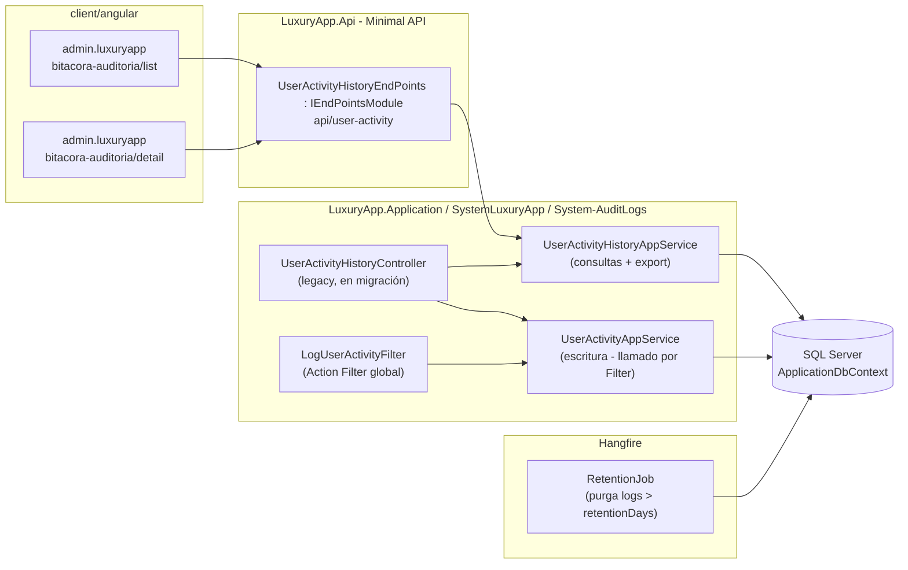
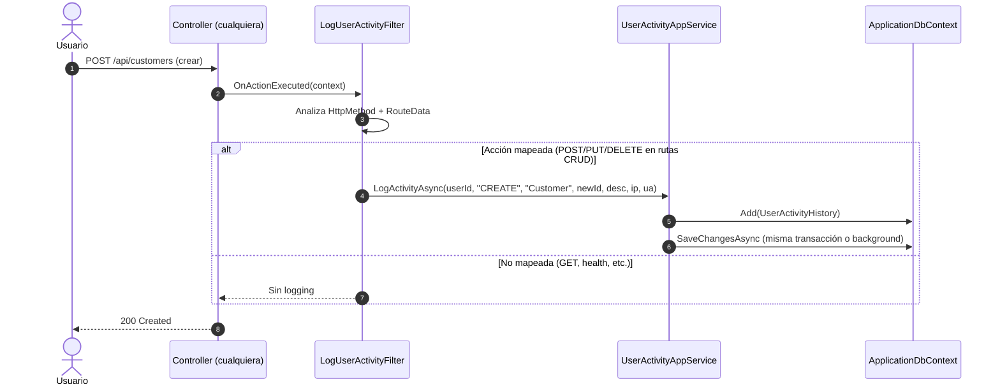
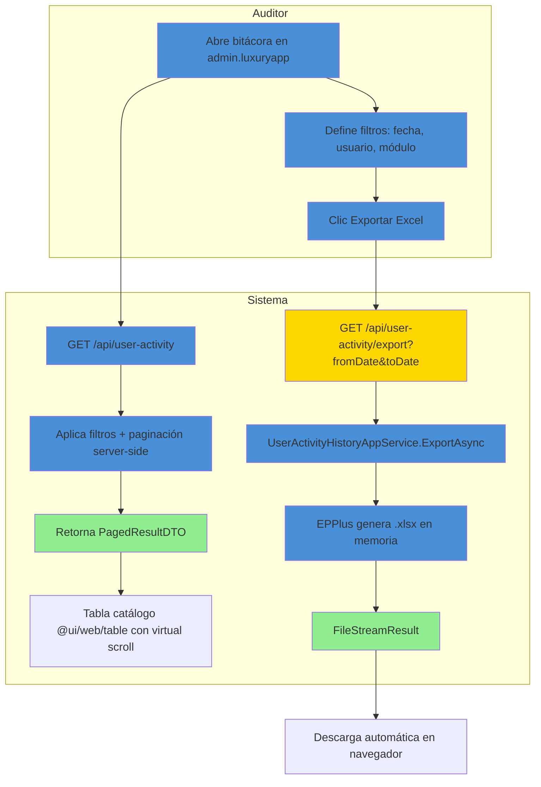
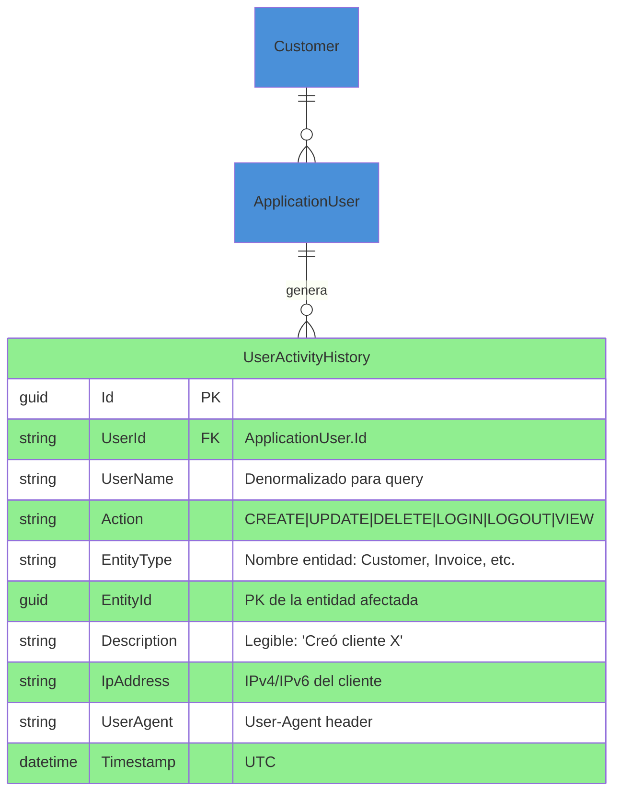

# BitacoraAuditoria (UserActivityHistory) — Documentación Técnica

> **Ruta**: 📂 Documentación > 💼 Sistema > 📋 BitacoraAuditoria
> **📅 Última Revisión**: 13-jul-26
> **🛡️ Estado**: ✅ Vigente
> **👤 Responsable**: @equipo-arquitectura

---

## 📑 Tabla de Contenidos

1. [Resumen Ejecutivo](#-resumen-ejecutivo)
2. [Visión Funcional](#-visión-funcional)
3. [Arquitectura Técnica](#-arquitectura-técnica)
4. [API Endpoints](#-api-endpoints)
5. [Flujo del Sistema](#-flujo-del-sistema)
6. [Componentes Frontend](#-componentes-frontend)
7. [Reglas de Negocio](#-reglas-de-negocio)
8. [Matriz de Permisos](#-matriz-de-permisos)
9. [Catálogo de Roles del Sistema](#-catálogo-de-roles-del-sistema)
10. [Base de Datos](#-base-de-datos)
11. [Performance](#-performance)
12. [Glosario de Términos](#-glosario-de-términos)
13. [Checklist de Validación](#-checklist-de-validación)
14. [Historial de Cambios](#-historial-de-cambios)

---

## 🎯 Resumen Ejecutivo

**Propósito**: Módulo de auditoría centralizado que registra y expone la trazabilidad completa de acciones realizadas por usuarios en el sistema LuxuryApp (login, CRUD de entidades, accesos), permitiendo a administradores y auditores consultar quién hizo qué, cuándo y desde dónde.

**Actores Involucrados** (`ApplicationRoleEnum`): `SuperUsuario`, `Administrador`, `Auditor` (roles con acceso a bitácora). **Generación automática**: cualquier usuario autenticado genera entradas al interactuar con el sistema.

**Dependencias**: `Customer` (tenant), `ApplicationUser` (identidad), `UserActivityHistory` (tabla maestra), `LogUserActivityFilter` (action filter global), Hangfire (job de retención opcional), `ApiResponseDTO<T>`.

**Alcance**:

- ✅ Incluye: Registro automático vía action filter (`LogUserActivityFilter`), endpoints de consulta paginada + detalle + exportación, retención configurable (job Hangfire), multi-tenant por `CustomerId`.
- ❌ No incluye: Alertas automáticas por patrones anómalos, SIEM externo, firma criptográfica de logs, streaming a Elastic/Splunk.

---

## 🔍 Visión Funcional

**HU-01 — Consulta de bitácora paginada**

> Como **administrador/auditor** quiero listar la actividad de usuarios con filtros (fecha, usuario, módulo, acción) para investigar incidentes.
> **Criterios**: `GET /api/user-activity` con query `page`, `pageSize` (máx 200), `fromDate`, `toDate`, `userId`, `entityType`, `action`; retorna `PagedResultDTO<UserActivityHistoryDTO>`.

**HU-02 — Detalle de una actividad**

> Como **auditor** quiero ver el detalle completo de un registro de bitácora (IP, UserAgent, descripción, entidad afectada).
> **Criterios**: `GET /api/user-activity/{id}` → `UserActivityHistoryDTO` con todos los campos.

**HU-03 — Exportación de logs**

> Como **auditor** quiero exportar un rango de fechas a Excel/PDF para evidencia.
> **Criterios**: `GET /api/user-activity/export?fromDate&toDate` → `FileStreamResult` (Excel via EPPlus); tope 50 000 filas.

**HU-04 — Registro automático transparente**

> Como **sistema** quiero que toda acción relevante (CREATE/UPDATE/DELETE/LOGIN) quede registrada sin código manual en cada endpoint.
> **Criterios**: `LogUserActivityFilter` intercepta `OnActionExecuted`; detecta acciones mapeadas por convención (método HTTP + ruta); invoca `UserActivityAppService.LogActivityAsync`; escribe en misma transacción o background (configurable).

---

## 🏗️ Arquitectura Técnica



| Capa          | Tecnología                                                                                     |
| ------------- | ---------------------------------------------------------------------------------------------- |
| Backend       | .NET 10, Minimal APIs (`IEndpointModule`), Controllers legacy (migración en curso), EF Core 10 |
| Filtro Global | `IAsyncActionFilter` (`LogUserActivityFilter`) registrado en `Program.cs`                      |
| Escritura     | `UserActivityAppService.LogActivityAsync` (inyectado en filter)                                |
| Lectura       | `UserActivityHistoryAppService` (paginación, export)                                           |
| Jobs          | Hangfire (`RecurringJob.AddOrUpdate`)                                                          |
| Exportación   | EPPlus (`GetAsByteArray`)                                                                      |
| Respuestas    | `ApiResponseDTO<T>` (nunca `ProblemDetails`)                                                   |
| Mapeo         | Explícito `ToDTO()` (AutoMapper prohibido)                                                     |
| Frontend      | Angular 22 (standalone, signals, OnPush), Bootstrap 5, catálogo `@ui/*`                            |

---

## 📱 Mobile Responsive (§15 CONVENTIONS.md)

| Vista                        | Patrón (§15.2)         | Implementación                                                                                                          |
| ---------------------------- | ---------------------- | ----------------------------------------------------------------------------------------------------------------------- |
| `UserActivityList` (admin)   | **A — CSS Responsive** | `p-table` con `p-col-*` responsive; columnas ocultables en móvil (`hidden md:block`); filtros en `p-toolbar` colapsable |
| `UserActivityDetail` (admin) | **A — CSS Responsive** | `p-card` + `p-fluid` grid; modal `p-dialog` responsive nativo                                                           |

**Reglas aplicadas:**

- Breakpoint único: 768px (`PlatformService.isMobile()`)
- Touch targets ≥ 44×44px en botones de acción (exportar, refrescar)
- Tabla: scroll horizontal en móvil (`overflow-auto`), virtual scroll si > 1000 filas
- Exportar: `onDownloadFile` vía `ApiResponseService` (funciona igual web/móvil)

---

## 🌐 API Endpoints

Base: `api/user-activity`. Todos requieren `Authorization: Bearer <JWT>` + rol `Admin` o `Auditor` (`AuthorizeAttribute { Roles = "Administrador,Auditor,SuperUsuario" }`). Éxitos y errores en `ApiResponseDTO<T>`.

### Tabla General

| Método | Path         | Roles          | Request                                 | Response                                 | Códigos HTTP          |
| ------ | ------------ | -------------- | --------------------------------------- | ---------------------------------------- | --------------------- |
| GET    | `/`          | Admin, Auditor | `PaginationCommonDTO` + filtros (query) | `PagedResultDTO<UserActivityHistoryDTO>` | 200 · 400 · 403       |
| GET    | `/{id:guid}` | Admin, Auditor | —                                       | `UserActivityHistoryDTO`                 | 200 · 400 · 404 · 403 |
| GET    | `/export`    | Admin, Auditor | `fromDate`, `toDate` (query)            | `FileStreamResult` (Excel)               | 200 · 400 · 403       |

> [!NOTE]
> El campo `responseCode` viaja **dentro** de `ApiResponseDTO`; el status HTTP siempre es `200 OK` para respuestas de negocio (incluidos errores 4xx de dominio). `500` solo para excepciones no controladas.

### Detalle por Endpoint

#### 🟢 GET `/api/user-activity`

Lista paginada de actividades con filtros.

- **Roles**: `SuperUsuario`, `Administrador`, `Auditor`.
- **Query Params** (`PaginationCommonDTO` extendido):
  - `page` (default 1), `pageSize` (default 30, máx 200)
  - `sortBy` (default `Timestamp`), `sortDir` (`asc`|`desc`, default `desc`)
  - `fromDate` (ISO 8601), `toDate` (ISO 8601)
  - `userId` (Guid), `userName` (string, contains)
  - `entityType` (string, exacto), `entityId` (Guid)
  - `action` (`CREATE`|`UPDATE`|`DELETE`|`LOGIN`|`LOGOUT`|`VIEW`)

**Response 200** (`ApiResponseDTO<PagedResultDTO<UserActivityHistoryDTO>>`):

```json
{
  "success": true,
  "message": "Registros obtenidos correctamente.",
  "responseCode": 200,
  "data": {
    "items": [
      {
        "id": "019c...",
        "userId": "019c...",
        "userName": "juan.perez",
        "action": "CREATE",
        "entityType": "Customer",
        "entityId": "019c...",
        "description": "Creó cliente 'Condominio Solares'",
        "ipAddress": "200.12.34.56",
        "userAgent": "Mozilla/5.0...",
        "timestamp": "2026-07-13T14:30:00Z",
        "timestampDisplay": "13-jul-26 14:30"
      }
    ],
    "totalCount": 1245,
    "page": 1,
    "pageSize": 30,
    "totalPages": 42
  }
}
```

**Validaciones**: `pageSize` ≤ 200 (trunca si excede); `fromDate` ≤ `toDate`; `userId` debe pertenecer al `CustomerId` del usuario autenticado (multi-tenant).

---

#### 🟢 GET `/api/user-activity/{id:guid}`

Detalle de un registro.

- **Roles**: `SuperUsuario`, `Administrador`, `Auditor`.
- **Validación**: `id` existe y `UserActivityHistory.CustomerId` (vía `UserId` → `ApplicationUser.CustomerId`) coincide con tenant del usuario (404 si no).

---

#### 🟢 GET `/api/user-activity/export`

Exporta a Excel (`.xlsx`) un rango de fechas.

- **Roles**: `SuperUsuario`, `Administrador`, `Auditor`.
- **Query**: `fromDate` (requerido), `toDate` (requerido), `userId` (opcional), `entityType` (opcional), `action` (opcional).
- **Límites**: Máx 50 000 filas; si excede → 400 "Rango demasiado amplio, reduzca fechas o agregue filtros".
- **Response**: `FileStreamResult` con `Content-Type: application/vnd.openxmlformats-officedocument.spreadsheetml.sheet`, `Content-Disposition: attachment; filename="bitacora-YYYYMMDD-YYYYMMDD.xlsx"`.

---

## 🔄 Flujo del Sistema

### Registro automático de actividad (Action Filter)



**Mapeo convención** (en `LogUserActivityFilter`):

- `POST` → `CREATE`
- `PUT`/`PATCH` → `UPDATE`
- `DELETE` → `DELETE`
- `POST /api/Auth/Login` → `LOGIN`
- `POST /api/Auth/Logout` → `LOGOUT`
- Rutas con `MapGroup("api/...")` + convención REST → `EntityType` = último segmento singular (ej. `api/customers` → `Customer`)

---

### Consulta y exportación



---

## 🖥️ Componentes Frontend

Workspace: **`client/angular`** (standalone, signals, OnPush, catálogo `@ui/*`, `ApiResponseService`, `Endpoints`).

### Routing (`admin.luxuryapp`)

| App (§14)         | Ruta                           | Componente           |    Lazy loading    | Guard       | Menú |
| ----------------- | ------------------------------ | -------------------- | :----------------: | ----------- | :--: |
| `admin.luxuryapp` | `admin/bitacora-auditoria`     | `UserActivityList`   | ✅ `loadComponent` | `authGuard` |  ✅  |
| `admin.luxuryapp` | `admin/bitacora-auditoria/:id` | `UserActivityDetail` | ✅ `loadComponent` | `authGuard` |  ❌  |

### Catálogo de Componentes

| Componente           | Selector                   | Ruta relativa                                                            | Tipo | Signals clave                                    | Servicios                              | Comportamiento                                                                                                                                                                                  |
| -------------------- | -------------------------- | ------------------------------------------------------------------------ | ---- | ------------------------------------------------ | -------------------------------------- | ----------------------------------------------------------------------------------------------------------------------------------------------------------------------------------------------- |
| `UserActivityList`   | `app-user-activity-list`   | `apps/admin.luxuryapp/system/bitacora-auditoria/user-activity-list.ts`   | web  | `dataSignal`, `loading`, `filters`, `totalCount` | `ApiResponseService`                   | `p-table` virtual scroll, filtros `p-toolbar` (fecha, usuario, acción, módulo), paginación server-side, botón **Exportar Excel** (`onDownloadFile`), `@defer` para gráfico de actividad por día |
| `UserActivityDetail` | `app-user-activity-detail` | `apps/admin.luxuryapp/system/bitacora-auditoria/user-activity-detail.ts` | web  | `activitySignal`                                 | `ApiResponseService`, `ActivatedRoute` | `p-card` con detalle completo: IP, UserAgent parseado (navegador/SO), entidad afectada con enlace si aplica, timestamp formateado `dd-MMM-yy HH:mm`                                             |

**Estilos**: Bootstrap 5 (`card`, `grid`, `text-*`); botones/inputs catálogo `@ui/*` (`il-button`, `il-button-excel`, `custom-input-*-signal`). **Testing**: `.spec.ts` por componente (Vitest) — cobertura básica inicialización.

**Interfaces** (`core/interfaces/user-activity.dto.ts`): `user-activity-history`, `user-activity-filter`, `paged-result`.

---

## 📜 Reglas de Negocio

| ID     | SI (condición)                                                                          | ENTONCES (acción)                                                                                                                                                                                    |
| ------ | --------------------------------------------------------------------------------------- | ---------------------------------------------------------------------------------------------------------------------------------------------------------------------------------------------------- |
| RN-001 | Cualquier petición HTTP que coincida con convención (POST/PUT/DELETE en `api/{entity}`) | `LogUserActivityFilter` invoca `UserActivityAppService.LogActivityAsync` con `UserId`, `Action`, `EntityType`, `EntityId`, `Description`, `IpAddress`, `UserAgent`                                   |
| RN-002 | `HttpMethod = POST` y ruta no es Login/Logout                                           | `Action = "CREATE"`                                                                                                                                                                                  |
| RN-003 | `HttpMethod = PUT/PATCH`                                                                | `Action = "UPDATE"`                                                                                                                                                                                  |
| RN-004 | `HttpMethod = DELETE`                                                                   | `Action = "DELETE"`                                                                                                                                                                                  |
| RN-005 | `POST /api/Auth/Login` exitoso                                                          | `Action = "LOGIN"`, `EntityType = "Auth"`, `Description = "Inicio de sesión"`                                                                                                                        |
| RN-006 | `POST /api/Auth/Logout`                                                                 | `Action = "LOGOUT"`, `EntityType = "Auth"`, `Description = "Cierre de sesión"`                                                                                                                       |
| RN-007 | `EntityType` inferido de ruta                                                           | Último segmento singular (`api/customers` → `Customer`, `api/charge-templates` → `ChargeTemplate`)                                                                                                   |
| RN-008 | `EntityId` extraído de ruta o body                                                      | `Guid` parseado de `id` en ruta o `Id` en response body                                                                                                                                              |
| RN-009 | Escritura en bitácora                                                                   | Ocurre **después** de `SaveChangesAsync` del controlador (misma transacción si `TransactionScope` activo; sino background `Task.Run` con `IServiceScopeFactory`)                                     |
| RN-010 | Consulta bitácora                                                                       | Filtrado obligatorio por `CustomerId` del usuario autenticado (multi-tenant)                                                                                                                         |
| RN-011 | Exportación                                                                             | Validación `fromDate` ≤ `toDate`; tope 50 000 filas; genera Excel con columnas: Timestamp, Usuario, Acción, Entidad, ID Entidad, Descripción, IP, Navegador                                          |
| RN-012 | Job de retención (Hangfire)                                                             | Ejecuta diario; `DELETE FROM UserActivityHistory WHERE Timestamp < DATEADD(day, -@RetentionDays, GETUTCDATE()) AND CustomerId = @CustomerId`; `@RetentionDays` configurable por tenant (default 365) |

---

## 🔐 Matriz de Permisos

Roles de `ApplicationRoleEnum`.

| Acción                        |        SuperUsuario         | Administrador | Auditor |             Otros             |
| ----------------------------- | :-------------------------: | :-----------: | :-----: | :---------------------------: |
| Listar bitácora (GET `/`)     |             ✅              |      ✅       |   ✅    |              ❌               |
| Ver detalle (GET `/{id}`)     |             ✅              |      ✅       |   ✅    |              ❌               |
| Exportar (GET `/export`)      |             ✅              |      ✅       |   ✅    |              ❌               |
| Generar entradas (automático) | ✅ (como cualquier usuario) |      ✅       |   ✅    | ✅ (cualquier usuario activo) |

---

## 🗄️ Catálogo de Roles del Sistema

El módulo **no introduce roles nuevos**: reutiliza `ApplicationRoleEnum`. La autorización es **por rol** (`AuthorizeAttribute { Roles = "Administrador,Auditor,SuperUsuario" }`). El rol `Auditor` es un rol funcional existente en el enum (RoleType = Corporate).

---

## 🗄️ Base de Datos

`ApplicationDbContext` (SQL Server). Filtrado por `CustomerId` manual (vía `ApplicationUser.CustomerId`). FKs con `OnDelete(Restrict)`.



| Tabla                 | Columnas clave                                                                                                                 | Índices                                                                                                                                                               |
| --------------------- | ------------------------------------------------------------------------------------------------------------------------------ | --------------------------------------------------------------------------------------------------------------------------------------------------------------------- |
| `UserActivityHistory` | `Id` (Guid V7), `UserId`, `UserName`, `Action`, `EntityType`, `EntityId`, `Description`, `IpAddress`, `UserAgent`, `Timestamp` | `IX (UserId, Timestamp DESC)`, `IX (EntityType, EntityId)`, `IX (CustomerId, Timestamp DESC)` (vía `UserId` → `ApplicationUser.CustomerId`), `IX (Action, Timestamp)` |

**Particionado opcional**: Por mes en `Timestamp` (mejora purga y consultas históricas).

---

## ⚡ Performance

- **Escritura**: `LogUserActivityFilter` usa `Task.Run` + `IServiceScopeFactory` para no bloquear response (fire-and-forget) salvo que `TransactionScope` activo → misma transacción.
- **Lectura**: Índice compuesto `(UserId, Timestamp DESC)` cubre 95% de queries (filtro por usuario + orden). Paginación server-side (`OFFSET/FETCH`), tope 200.
- **Exportación**: `AsNoTracking()` + `Select` proyección → `List<UserActivityHistoryExportRow>` → EPPlus `LoadFromCollection` streaming; memoria O(filas) no O(total).
- **Retención**: Job Hangfire diario; `DELETE` en lote por `CustomerId` + fecha (índice soportado). Alternativa: partición mensual + `SWITCH PARTITION` + `TRUNCATE`.
- **Frontend**: `p-table [virtualScroll]="true"` + `[lazy]="true"`; `@defer (on viewport)` para gráfico de actividad diaria (Chart.js).

---

## 📖 Glosario de Términos

| Término             | Definición                                                                                                         |
| ------------------- | ------------------------------------------------------------------------------------------------------------------ |
| **Action Filter**   | `IAsyncActionFilter` global que intercepta `OnActionExecuted` para logging automático                              |
| **Multi-tenant**    | Aislamiento por `CustomerId`: cada consulta filtra `UserActivityHistory` vía `UserId → ApplicationUser.CustomerId` |
| **Retención**       | Política de borrado de logs antiguos (default 365 días, configurable por tenant)                                   |
| **EntityType**      | Nombre de la entidad de dominio afectada (singular, PascalCase: `Customer`, `ChargeTemplate`)                      |
| **EntityId**        | Guid V7 de la entidad afectada (PK)                                                                                |
| **Denormalización** | `UserName` copiado en `UserActivityHistory` para evitar join en listados                                           |

---

## ✅ Checklist de Validación ([CONVENTIONS.md §11](../../../../../../CONVENTIONS.md#11-estándares-de-documentación))

> [!NOTE]
> El link a `CONVENTIONS.md` asume que el documento vive en la raíz del propio módulo. Ajusta la profundidad relativa (`../../../../../../`) según la ubicación final.

- [x] CERO mojibake (UTF-8 sin BOM)
- [x] CERO `any` en TypeScript
- [x] Fechas en formato `dd-MMM-yy`
- [x] Endpoints front/back coinciden carácter a carácter
- [x] Diagramas Mermaid válidos (flowchart swimlanes + sequence con `autonumber`)
- [x] Colores Mermaid según §11 (verde `#90EE90` éxito, amarillo `#FFD700` decisión, azul `#4A90D9` proceso, rojo `#FF6B6B` error)
- [x] Reglas de negocio en formato `SI/ENTONCES` (`RN-xxx`)
- [x] Roles usan nombres exactos de `ApplicationRoleEnum`
- [x] Mobile responsive: §15 aplicado según tipo de vista
- [x] Sin PII en logs (IP/UserAgent son metadata de seguridad, no PII de negocio)
- [x] Emojis consistentes · Todo en español

---

## 📝 Historial de Cambios

| Fecha     | Versión | Autor                | Cambios                                                                                                                                                             |
| --------- | ------- | -------------------- | ------------------------------------------------------------------------------------------------------------------------------------------------------------------- |
| 10-jun-26 | 1.0     | @equipo-arquitectura | Documentación inicial del módulo                                                                                                                                    |
| 13-jul-26 | 2.0     | @kilo                | Actualización a template §11 CONVENTIONS.md: Mobile responsive §15, checklist §11, Mermaid colores, sin PII, sin `any`, rutas api kebab-case, formato `SI/ENTONCES` |
