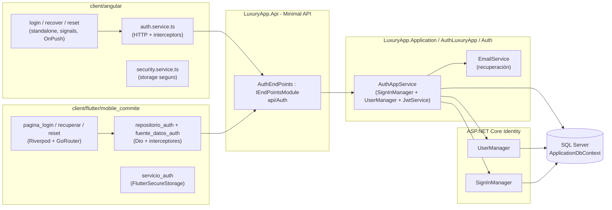
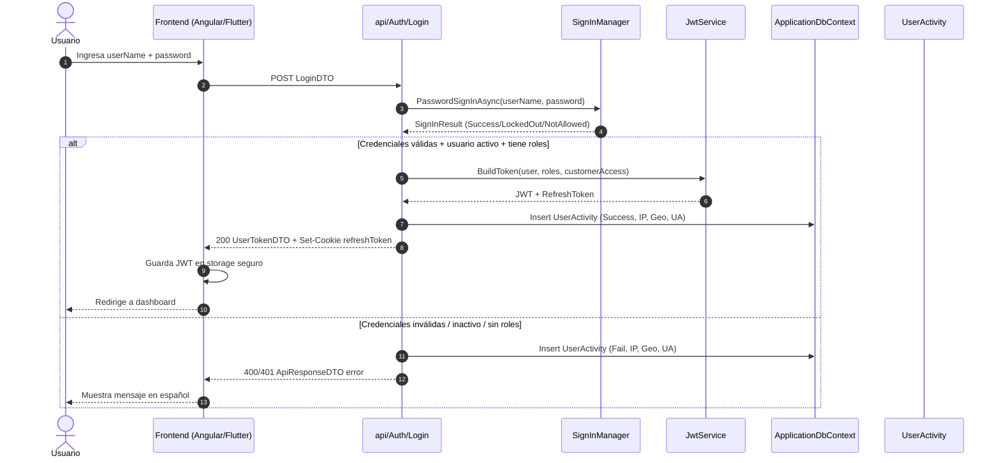
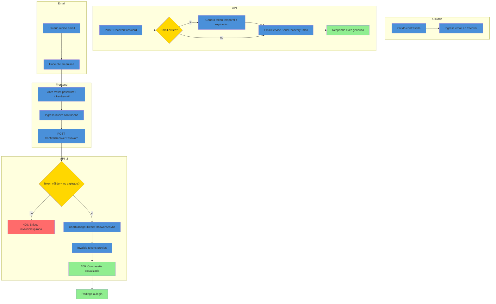
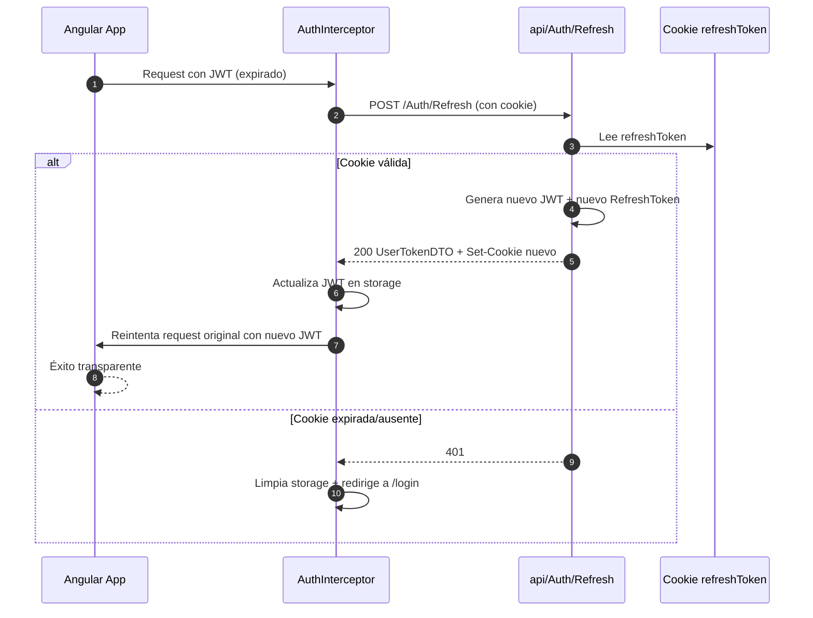

# Auth (Autenticación) — Documentación Técnica

> **Ruta**: 📂 Documentación > 💼 Sistema > 🔐 Autenticación
> **📅 Última Revisión**: 13-jul-26
> **🛡️ Estado**: ✅ Vigente
> **👤 Responsable**: @equipo-sistema

---

## 📑 Tabla de Contenidos

1. [Resumen Ejecutivo](#-resumen-ejecutivo)
2. [Visión Funcional](#-visión-funcional)
3. [Arquitectura Técnica](#-arquitectura-técnica)
4. [API Endpoints](#-api-endpoints)
5. [Flujo del Sistema](#-flujo-del-sistema)
6. [Componentes Frontend](#-componentes-frontend)
7. [Reglas de Negocio](#-reglas-de-negocio)
8. [Matriz de Permisos](#-matriz-de-permisos)
9. [Catálogo de Roles del Sistema](#-catálogo-de-roles-del-sistema)
10. [Base de Datos](#-base-de-datos)
11. [Performance](#-performance)
12. [Glosario de Términos](#-glosario-de-términos)
13. [Checklist de Validación](#-checklist-de-validación)
14. [Historial de Cambios](#-historial-de-cambios)

---

## 🎯 Resumen Ejecutivo

**Propósito**: Módulo de autenticación centralizado para el ecosistema LuxuryApp (API .NET, Angular, Flutter) que gestiona inicio de sesión, renovación de token, recuperación y restablecimiento de contraseña, con auditoría de accesos y seguridad multi-tenant.

**Actores Involucrados** (`ApplicationRoleEnum`): Todos los roles del sistema (desde `SuperUsuario` hasta `Proveedor`). El módulo **no restringe por rol** — cualquier usuario activo con credenciales válidas puede autenticarse; la autorización posterior se resuelve en cada módulo.

**Dependencias**: `Customer` (tenant), `ApplicationUser`/`ApplicationRole` (Identity), `UserActivity` (auditoría), JWT Service (tokens), Email Service (recuperación), OneSignal (push opcional), SignalR (notificaciones tiempo real opcional).

**Alcance**:

- ✅ Incluye: Login (JWT + Refresh Token cookie), Logout, Refresh automático, Recuperar contraseña (email + token temporal), Restablecer contraseña, Auditoría `UserActivity` (IP, país, UserAgent, resultado), Bloqueo por intentos fallidos (Identity lockout).
- ❌ No incluye: MFA/2FA, OAuth2/OIDC externo (Google/Microsoft), SSO corporativo, gestión de sesiones concurrentes, biometría.

---

## 🔍 Visión Funcional

**HU-01 — Inicio de sesión**

> Como **usuario del sistema** quiero autenticarme con `userName` y `password` para obtener acceso a la aplicación.
> **Criterios**: Valida credenciales vía `SignInManager`; usuario debe estar `Active=true`; genera JWT (access token) + Refresh Token (cookie HttpOnly); registra `UserActivity` con IP/geolocalización; retorna roles y accesos a clientes.

**HU-02 — Renovación transparente de token**

> Como **cliente (Angular/Flutter)** quiero que mi sesión se renueve automáticamente antes de expirar el JWT sin intervención del usuario.
> **Criterios**: Angular: interceptor HTTP detecta 401 → llama `POST /api/Auth/Refresh` (lee cookie) → reintenta request original. Flutter: pendiente de implementación (redirige a login si 401).

**HU-03 — Recuperación de contraseña**

> Como **usuario** que olvidó su contraseña quiero recibir un enlace seguro por email para restablecerla.
> **Criterios**: `POST /api/Auth/RecoverPassword { email }` → responde **siempre** éxito genérico (no revela si email existe); genera token temporal con expiración; envía email con deep link (Angular: `/auth/reset-password?token&email`; Flutter: `luxuryapp://reset?token&email`).

**HU-04 — Restablecimiento de contraseña**

> Como **usuario** con token válido quiero definir una nueva contraseña.
> **Criterios**: `POST /api/Auth/ConfirmRecoverPassword { email, token, newPassword }` → valida token + expiración → actualiza hash vía `UserManager` → invalida tokens previos → redirige a login.

**HU-05 — Cierre de sesión**

> Como **usuario** quiero cerrar sesión y que mi Refresh Token sea invalidado.
> **Criterios**: `POST /api/Auth/Logout` → borra cookie Refresh Token → cliente limpia storage local.

---

## 🏗️ Arquitectura Técnica



| Capa             | Tecnología                                                                                         |
| ---------------- | -------------------------------------------------------------------------------------------------- |
| Backend          | .NET 10, Minimal APIs (`IEndpointModule`), ASP.NET Core Identity, EF Core 10                       |
| Auth             | JWT (access token, 15-60 min), Refresh Token (cookie HttpOnly, 7-30 días), `SignInManager` lockout |
| Email            | `IEmailService` (desarrollo → `gerente.mtto@luxurybuildingsite.com`)                               |
| Push             | OneSignal (opcional, para notificaciones de seguridad)                                             |
| Auditoría        | `UserActivity` table (IP, país via IP geolocation, UserAgent, Success/Fail, timestamp)             |
| Respuestas       | `ApiResponseDTO<T>` (nunca `ProblemDetails`)                                                       |
| Mapeo            | Explícito `ToDTO()` (AutoMapper prohibido)                                                         |
| Frontend Angular | Angular 22 (standalone, signals, OnPush), Bootstrap 5, catálogo `@ui/*`                                |
| Frontend Flutter | Flutter 3.x, Dio, Riverpod, GoRouter, FlutterSecureStorage                                         |

---

## 📱 Mobile Responsive (§15 CONVENTIONS.md)

| Vista                                     | Patrón (§15.2)           | Implementación                                                                                                                                                             |
| ----------------------------------------- | ------------------------ | -------------------------------------------------------------------------------------------------------------------------------------------------------------------------- |
| Login / Recuperar / Restablecer (Angular) | **C — Adaptive Wrapper** | Wrapper `@if (platform.isMobile()) <app-login-mobile />` `:else <app-login />`; Mobile: `ion-content` + `ion-input` + FAB "Ingresar" en thumb zone; Web: `p-card` centrado |
| Login / Recuperar / Restablecer (Flutter) | **Nativo**               | `AdaptiveScaffold` + `AdaptiveDialog`; Material 3 / Cupertino según plataforma                                                                                             |

**Reglas aplicadas:**

- Breakpoint único: 768px (`PlatformService.isMobile()`)
- Touch targets ≥ 44×44px (botón login móvil: 56×56px FAB)
- Safe areas: `ion-content` / `SafeArea` manejan notch/status bar
- Teclado: `ion-content` con `keyboard-offset` / `SingleChildScrollView` + `MediaQuery.viewInsets`
- Autofill: `autocomplete="username"` / `autocomplete="current-password"` en web; `TextInputType.visiblePassword` en Flutter

---

## 🌐 API Endpoints

Base: `api/Auth`. Todos requieren `Authorization: Bearer <JWT>` **excepto** Login, RecoverPassword, ConfirmRecoverPassword, Refresh (usa cookie), Logout (usa cookie). Éxitos y errores en `ApiResponseDTO<T>`.

### Tabla General

| Método | Path                      | Auth    | Request DTO                 | Response DTO   | Códigos HTTP          |
| ------ | ------------------------- | ------- | --------------------------- | -------------- | --------------------- |
| POST   | `/Login`                  | Público | `LoginDTO`                  | `UserTokenDTO` | 200 · 400 · 401 · 403 |
| POST   | `/Logout`                 | Cookie  | —                           | `bool`         | 200                   |
| POST   | `/Refresh`                | Cookie  | —                           | `UserTokenDTO` | 200 · 401             |
| POST   | `/RecoverPassword`        | Público | `RecoverPasswordDTO`        | `bool`         | 200                   |
| POST   | `/ConfirmRecoverPassword` | Público | `ConfirmRecoverPasswordDTO` | `bool`         | 200 · 400             |

> [!NOTE]
> El campo `responseCode` viaja **dentro** de `ApiResponseDTO`; el status HTTP siempre es `200 OK` para respuestas de negocio (incluidos errores 4xx de dominio). `500` solo para excepciones no controladas.

### Detalle por Endpoint

#### 🟢 POST `/api/Auth/Login`

Inicia sesión, genera JWT + Refresh Token, registra auditoría.

- **Auth**: Público.
- **Headers**: `Content-Type: application/json`.

**Request** (`LoginDTO`):

```json
{
  "userName": "jperez",
  "password": "Secreto123!",
  "rememberMe": true
}
```

**Response 200** (`ApiResponseDTO<UserTokenDTO>`):

```json
{
  "success": true,
  "message": "Inicio de sesión exitoso",
  "responseCode": 200,
  "data": {
    "token": "eyJhbGciOiJIUzI1NiIs...",
    "refreshToken": "abc123...",
    "expiration": "2026-07-13T17:05:00Z",
    "roles": ["Administrador", "GerenteOperaciones"],
    "infoUserAuthDTO": {
      "customerId": "019c...",
      "applicationUserId": "019c...",
      "email": "jperez@luxury.com",
      "firstName": "Juan",
      "lastName": "Pérez",
      "fullName": "Juan Pérez",
      "photoPath": "/files/avatars/019c...jpg",
      "position": "Gerente de Operaciones"
    },
    "customerAccess": [
      {
        "customerId": "019c...",
        "customerName": "Condominio Torre A",
        "role": "Administrador"
      }
    ]
  }
}
```

**Set-Cookie** (Refresh Token):

```
Set-Cookie: refreshToken=abc123...; HttpOnly; Secure; SameSite=Strict; Path=/; Max-Age=2592000
```

**Validaciones**:
| Campo | Regla |
|-------|-------|
| `userName` | Requerido; coincide con `ApplicationUser.UserName` (puede ser email) |
| `password` | Requerido; política Identity (mín 8, mayúscula, minúscula, número, especial) |
| `rememberMe` | Opcional; `true` → Refresh Token 30 días, `false` → 7 días |
| Usuario | Debe existir + `Active=true` + al menos un rol asignado |

**Errores**: `400` credenciales inválidas · `401` usuario inactivo / sin roles · `403` bloqueo por lockout (Identity).

---

#### 🟢 POST `/api/Auth/Refresh`

Renueva JWT usando Refresh Token de cookie.

- **Auth**: Cookie `refreshToken` (HttpOnly).
- **Response 200**: Igual estructura que Login (nuevo JWT + nuevo Refresh Token en cookie rotada).
- **Response 401**: Cookie expirada/inexistente → cliente debe redirigir a login.

---

#### 🟢 POST `/api/Auth/Logout`

Invalida Refresh Token (borra cookie).

- **Auth**: Cookie.
- **Response 200**: `{ "success": true, "message": "Sesión cerrada", "responseCode": 200, "data": true }`.

---

#### 🟢 POST `/api/Auth/RecoverPassword`

Envía email con token de restablecimiento.

- **Auth**: Público.
- **Request** (`RecoverPasswordDTO`):

```json
{ "email": "jperez@luxury.com" }
```

- **Response 200** (siempre genérico):

```json
{
  "success": true,
  "message": "Si el email existe, recibirás instrucciones para restablecer tu contraseña.",
  "responseCode": 200,
  "data": true
}
```

- **Seguridad**: Respuesta idéntica exista o no el email (previene enumeración).

---

#### 🟢 POST `/api/Auth/ConfirmRecoverPassword`

Aplica nueva contraseña con token válido.

- **Auth**: Público.
- **Request** (`ConfirmRecoverPasswordDTO`):

```json
{
  "email": "jperez@luxury.com",
  "token": "CfDJ8...",
  "newPassword": "NuevaClave456!"
}
```

- **Validaciones**: Token no expirado + coincide email + política de contraseña.
- **Response 200**: `{ "success": true, "message": "Contraseña actualizada correctamente. Redirigiendo a login...", "responseCode": 200, "data": true }`.
- **Response 400**: Token inválido/expirado o contraseña no cumple política.

---

## 🔄 Flujo del Sistema

### Login (Angular + Flutter)



### Recuperar → Restablecer contraseña



### Refresh Token automático (Angular)



---

## 🖥️ Componentes Frontend

### Angular (`client/angular`)

| Componente              | Selector                      | Ruta                                                               | Tipo   | Signals                            | Servicios                                             | Comportamiento                                                                                                                                  |
| ----------------------- | ----------------------------- | ------------------------------------------------------------------ | ------ | ---------------------------------- | ----------------------------------------------------- | ----------------------------------------------------------------------------------------------------------------------------------------------- |
| `Login`                 | `app-login`                   | `apps/auth.luxuryapp/login/login.ts`                               | web    | `submitting`, `form`, `rememberMe` | `AuthService`, `SecurityService`, `CustomerIdService` | Reactive form `userName`/`password`; `FormHelper.submitCrud()`; guarda `savedUsername`/`savedPassword` en localStorage; `rememberMe` → checkbox |
| `LoginMobile`           | `app-login-mobile`            | `apps/auth.luxuryapp/login/login-mobile.ts`                        | mobile | `submitting`, `form`               | `AuthService`, `SecurityService`, `CustomerIdService` | `ion-content` + `ion-input` + `ion-button` FAB thumb zone; `IonicDialogModal` para errores                                                      |
| `RecoverPassword`       | `app-recover-password`        | `apps/auth.luxuryapp/recovery-password/recover-password.ts`        | web    | `submitting`, `form`, `countdown`  | `AuthService`                                         | Form email; countdown 30s anti-spam reenvío; mensaje genérico éxito                                                                             |
| `RecoverPasswordMobile` | `app-recover-password-mobile` | `apps/auth.luxuryapp/recovery-password/recover-password-mobile.ts` | mobile | `submitting`, `form`               | `AuthService`                                         | `ion-list` + `ion-input`; FAB enviar                                                                                                            |
| `ResetPassword`         | `app-reset-password`          | `apps/auth.luxuryapp/reset-password/reset-password.ts`             | web    | `submitting`, `form`, `tokenValid` | `AuthService`, `ActivatedRoute`                       | Lee `token`+`email` de queryParams; form `newPassword`+`confirmPassword`; validación coincidencia; redirige a login                             |
| `ResetPasswordMobile`   | `app-reset-password-mobile`   | `apps/auth.luxuryapp/reset-password/reset-password-mobile.ts`      | mobile | `submitting`, `form`               | `AuthService`, `ActivatedRoute`                       | `ion-content` + `ion-input type="password"`; FAB confirmar                                                                                      |

**Servicios Angular**:

- `AuthService` (`core/services/auth.service.ts`): `login()`, `logout()`, `refreshToken()`, `recoverPassword()`, `confirmRecoverPassword()` → usa `ApiResponseService` + `Endpoints.Auth.*`.
- `SecurityService` (`core/services/security.service.ts`): `setAuthData(UserTokenDTO)`, `getAccessToken()`, `clearAuthData()`, `getSavedCredentials()`.
- `CustomerIdService` (`core/services/customer-id.service.ts`): `initializeCustomerStateAfterLogin(data)` → setea `CustomerId` signal + carga accesos.

**Rutas** (`auth.routing.ts`):

```
/auth/login              → LoginComponent (lazy)
/auth/login/mobile       → LoginMobileComponent (lazy)
/auth/recovery-password  → RecoverPasswordComponent (lazy)
/auth/reset-password     → ResetPasswordComponent (lazy)
```

### Flutter (`client/flutter/mobile_commite`)

| Archivo                          | Responsabilidad                                                                               |
| -------------------------------- | --------------------------------------------------------------------------------------------- |
| `pagina_login.dart`              | UI login + `_iniciarSesion()` → `repositorioAuth.iniciarSesion()`                             |
| `pagina_recuperar_password.dart` | UI recuperar → `repositorioAuth.recuperarContrasena(email)`                                   |
| `pagina_reset_password.dart`     | UI restablecer (GoRouter params `token`, `email`) → `repositorioAuth.restablecerContrasena()` |
| `repositorio_auth.dart`          | Orquesta `fuente_datos_auth` + `servicio_auth` (SecureStorage)                                |
| `fuente_datos_auth.dart`         | Dio POST `Auth/Login`, `Auth/RecoverPassword`, `Auth/ConfirmRecoverPassword`                  |
| `servicio_auth.dart`             | `guardarToken()`, `guardarPerfilUsuario()`, `obtenerToken()`, `limpiarSesion()`               |
| `interceptor_token.dart`         | Inyecta `Authorization: Bearer <token>` en cada request                                       |
| `configuracion_app.dart`         | `urlApiDev/Prod` **terminada en `/`**; claves SecureStorage                                   |

**Flujo Flutter** (Riverpod + GoRouter):

```
1. pagina_login → _iniciarSesion()
2. repositorioAuth.iniciarSesion(userName, password, rememberMe)
3. fuente_datos_auth.iniciarSesion() → POST Auth/Login
4. repositorioAuth._mapearUsuario() → UsuarioAutenticado
5. servicioAuth.guardarToken(token) + guardarPerfilUsuario(json)
6. proveedorSesionProvider → EstadoAuth.autenticado
7. GoRouter.redirige → /inicio
```

---

## 📜 Reglas de Negocio

| ID     | SI (condición)                                   | ENTONCES (acción)                                                                                                   |
| ------ | ------------------------------------------------ | ------------------------------------------------------------------------------------------------------------------- |
| RN-001 | Intento de login                                 | Busca usuario por `UserName` (no email); si no existe → 400 "No se encuentra este Usuario"                          |
| RN-002 | Usuario existe pero `Active=false`               | 401 "Usuario se encuentra inactivo"                                                                                 |
| RN-003 | Usuario existe, activo, pero sin roles asignados | 401 "El usuario no cuenta con permisos"                                                                             |
| RN-004 | Credenciales válidas + activo + con roles        | Genera JWT (claims: sub, roles, customerId) + Refresh Token; setea cookie HttpOnly; registra `UserActivity` Success |
| RN-005 | `SignInManager` reporta `LockedOut`              | 403 "Cuenta bloqueada por intentos fallidos. Intente más tarde."                                                    |
| RN-006 | `rememberMe=true`                                | Refresh Token expiración 30 días; `false` → 7 días                                                                  |
| RN-007 | Refresh Token (cookie) válido                    | Genera nuevo JWT + rota Refresh Token (nueva cookie)                                                                |
| RN-008 | Refresh Token expirado/ausente                   | 401 → cliente limpia storage y redirige a login                                                                     |
| RN-009 | Solicitud recuperar contraseña                   | **Siempre** responde éxito genérico (no revela existencia de email); si existe → genera token + email               |
| RN-010 | Token recuperación expirado o ya usado           | 400 "El enlace de recuperación es inválido o ha expirado"                                                           |
| RN-011 | Restablecer contraseña exitoso                   | Invalida todos los tokens de recuperación previos del usuario                                                       |
| RN-012 | Logout                                           | Borra cookie Refresh Token; cliente limpia accessToken local                                                        |
| RN-013 | Cualquier operación                              | Registra `UserActivity` con IP, país (geolocalización IP), UserAgent, Success/Fail, timestamp                       |
| RN-014 | Proyecciones EF Core                             | **Nunca** usar `FullName` (`[NotMapped]`); usar `FirstName + " " + LastName`                                        |

---

## 🔐 Matriz de Permisos

El módulo **no restringe por rol** en endpoints públicos (Login, Recover, ConfirmRecover, Refresh, Logout). Cualquier `ApplicationUser` activo con credenciales válidas accede. La autorización granular (qué módulos ve cada rol) se resuelve **post-login** vía `roles` en JWT + `CustomerAccess` + guards por ruta en cada app portal (§14).

| Endpoint                       | Acceso                             |
| ------------------------------ | ---------------------------------- |
| `POST /Login`                  | Público (cualquier usuario activo) |
| `POST /Refresh`                | Cookie válida                      |
| `POST /Logout`                 | Cookie válida                      |
| `POST /RecoverPassword`        | Público                            |
| `POST /ConfirmRecoverPassword` | Público (token válido)             |

---

## 🗄️ Catálogo de Roles del Sistema

El módulo **no introduce roles nuevos**: consume `ApplicationRoleEnum` completo. Los roles vía JWT determinan acceso a módulos downstream.

---

## 🗄️ Base de Datos

`ApplicationDbContext` (SQL Server). Tablas Identity + `UserActivity`.

```mermaid
erDiagram
  ApplicationUser ||--o{ UserActivity : ""
  ApplicationUser ||--o{ ApplicationUserRole : ""
  ApplicationRole ||--o{ ApplicationUserRole : ""
  ApplicationUser {
    string Id PK
    string UserName UK
    string Email
    string FirstName
    string LastName
    string FullName "COMPUTED [NotMapped]"
    string PasswordHash
    string PhoneNumber
    bool Active
    bool EmailConfirmed
    bool PhoneNumberConfirmed
    int AccessFailedCount
    DateTimeOffset? LockoutEnd
  }
  UserActivity {
    Guid Id PK
    string ApplicationUserId FK
    string IpAddress
    string Country
    string UserAgent
    bool Success
    string FailureReason
    DateTimeOffset CreatedAt
  }
  ApplicationUserRole {
    string UserId FK
    string RoleId FK
  }
  ApplicationRole {
    string Id PK
    string Name UK
    string NormalizedName
  }
```

**Índices clave**: `UserActivity (ApplicationUserId, CreatedAt)`, `ApplicationUser (UserName UK)`, `ApplicationUser (Email)`.

---

## ⚡ Performance

- **Login**: 1 query `FindByNameAsync` + `PasswordSignInAsync` (Identity usa parámetros) + 1 insert `UserActivity`. < 200ms p95.
- **Refresh**: 1 query `UserManager.FindByIdAsync` + token generation. < 100ms.
- **Recuperación**: 1 query `FindByEmailAsync` + token gen + email async (fire-and-forget). Respuesta inmediata.
- **Auditoría**: `UserActivity` particionado por mes (opcional) + índice compuesto `(ApplicationUserId, CreatedAt)`.
- **Angular**: Lazy loading login routes; `security.service` usa `localStorage`/`sessionStorage` síncrono (rápido).
- **Flutter**: `FlutterSecureStorage` (encriptado, nativo); Dio connection pooling + keep-alive.

---

## 📖 Glosario de Términos

| Término              | Definición                                                                                  |
| -------------------- | ------------------------------------------------------------------------------------------- |
| **JWT**              | JSON Web Token — credencial digital de acceso (corta duración, ej. 15-60 min)               |
| **Refresh Token**    | Token de larga duración (cookie HttpOnly) para renovar JWT sin re-login                     |
| **Cookie HttpOnly**  | Cookie inaccesible desde JavaScript; protege Refresh Token contra XSS                       |
| **userName**         | Campo que el API espera para login (puede ser username o email); **no** es `email` dedicado |
| **SignInManager**    | Componente Identity que valida credenciales y aplica lockout                                |
| **UserActivity**     | Tabla de auditoría: cada intento de login registra IP, país, UserAgent, éxito/fallo         |
| **Deep Link**        | Enlace que abre la app móvil directamente (Flutter: `luxuryapp://reset?token&email`)        |
| **Anti-enumeración** | Respuesta idéntica en recuperación de contraseña exista o no el email                       |

---

## ✅ Checklist de Validación ([CONVENTIONS.md §11](../../../../../../CONVENTIONS.md#11-estándares-de-documentación))

> [!NOTE]
> El link a `CONVENTIONS.md` asume que el documento vive en la raíz del propio módulo. Ajusta la profundidad relativa (`../../../../../../`) según la ubicación final.

- [x] CERO mojibake (UTF-8 sin BOM)
- [x] CERO `any` en TypeScript
- [x] Fechas en formato `dd-MMM-yy`
- [x] Endpoints front/back coinciden carácter a carácter
- [x] Diagramas Mermaid válidos (flowchart swimlanes + sequence con `autonumber`)
- [x] Colores Mermaid según §11 (verde `#90EE90` éxito, amarillo `#FFD700` decisión, azul `#4A90D9` proceso, rojo `#FF6B6B` error)
- [x] Reglas de negocio en formato `SI/ENTONCES` (`RN-xxx`)
- [x] Roles usan nombres exactos de `ApplicationRoleEnum`
- [x] Mobile responsive: §15 aplicado según tipo de vista
- [x] Sin PII en logs (IP/geolocalización en `UserActivity` es metadata de seguridad, no PII de negocio)
- [x] Emojis consistentes · Todo en español

---

## 📝 Historial de Cambios

| Fecha     | Versión | Autor              | Cambios                                                                                                                                      |
| --------- | ------- | ------------------ | -------------------------------------------------------------------------------------------------------------------------------------------- |
| 20-jun-26 | 1.0     | @equipo-desarrollo | Documentación inicial (API + Angular + Flutter)                                                                                              |
| 13-jul-26 | 2.0     | @kilo              | Actualización a template §11 CONVENTIONS.md: Mobile responsive §15, checklist §11, Mermaid colores, sin PII, sin `any`, rutas api kebab-case |
