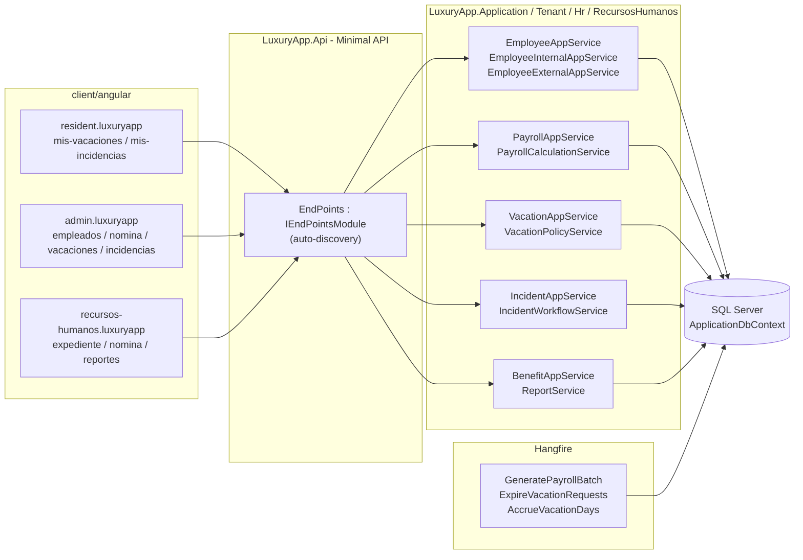
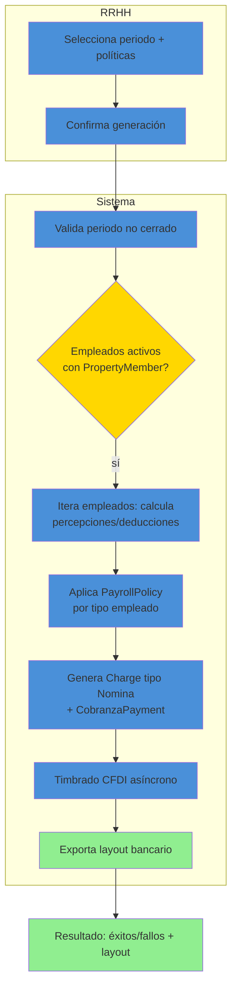
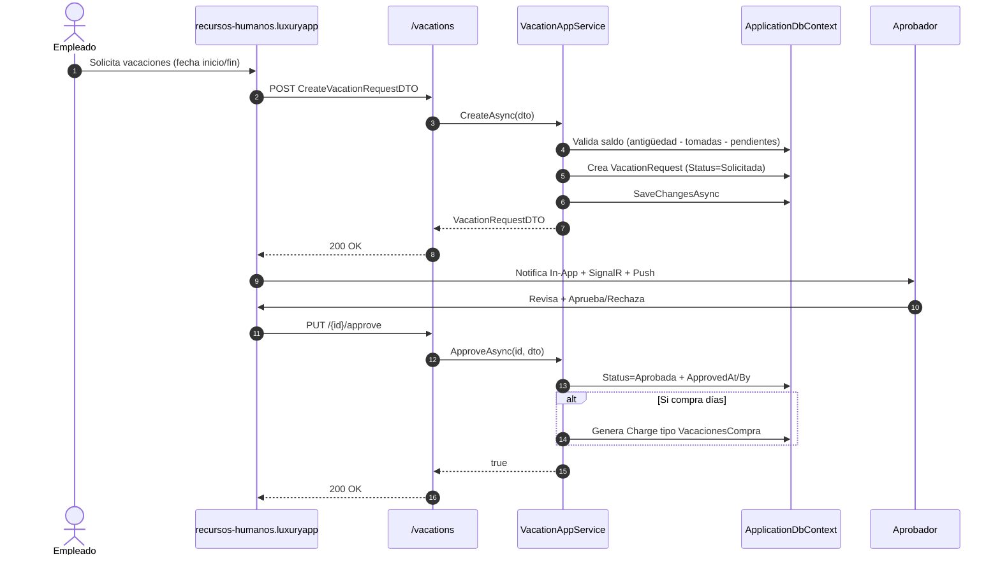
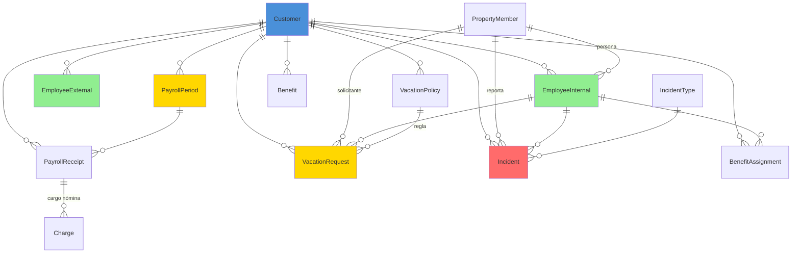

# Recursos Humanos (RecursosHumanos) — Documentación Técnica

> **Ruta**: 📂 Documentación > 💼 Capital Humano > 🧑‍💼 Recursos Humanos
> **📅 Última Revisión**: 13-jul-26
> **🛡️ Estado**: ✅ Vigente
> **👤 Responsable**: @equipo-rrhh

---

## 📑 Tabla de Contenidos

1. [Resumen Ejecutivo](#-resumen-ejecutivo)
2. [Visión Funcional](#-visión-funcional)
3. [Arquitectura Técnica](#-arquitectura-técnica)
4. [API Endpoints](#-api-endpoints)
5. [Flujo del Sistema](#-flujo-del-sistema)
6. [Componentes Frontend](#-componentes-frontend)
7. [Reglas de Negocio](#-reglas-de-negocio)
8. [Matriz de Permisos](#-matriz-de-permisos)
9. [Catálogo de Roles del Sistema](#-catálogo-de-roles-del-sistema)
10. [Base de Datos](#-base-de-datos)
11. [Performance](#-performance)
12. [Glosario de Términos](#-glosario-de-términos)
13. [Checklist de Validación](#-checklist-de-validación)
14. [Historial de Cambios](#-historial-de-cambios)

---

## 🎯 Resumen Ejecutivo

**Propósito**: Módulo integral de gestión de capital humano que administra empleados, nómina, vacaciones, incidencias y beneficios laborales dentro del contexto multi-tenant (`Customer`).

**Actores Involucrados** (`ApplicationRoleEnum`): `Administrador`, `GerenteOperaciones`, `GerenteAtencion`, `Asistente`, `RecursosHumanos`, `Reclutamiento`, `SuperUsuario`, `Empleado` (autoservicio), `Comite`, `Condomino`.

**Dependencias**: `Customer` (tenant), `Property` + `PropertyMember` (unidad/empleado), `ApplicationUser`/`ApplicationRole` (identidad), `Charge`/`CobranzaPayment` (cargos nómina), Hangfire (jobs nómina), EPPlus (exportación).

**Alcance**:

- ✅ Incluye: Catálogo empleados (CRUD), nómina (cálculo/emisión), vacaciones (periodos/solicitudes), incidencias (registro/flujo), beneficios, reportes, exportación Excel, jobs automáticos.
- ❌ No incluye: Evaluación desempeño 360°, learning management, reclutamiento avanzado (módulo separado), firma digital documentos.

---

## 🔍 Visión Funcional

**HU-01 — Gestión de empleados**

> Como **administrador RRHH** quiero dar de alta/editar/baja empleados con datos personales, contractuales y organizacionales.
> **Criterios**: Valida `CustomerId` + `PropertyMember` vínculo; captura `EmployeeInternal` + `EmployeeExternal`; soporta foto, contactos emergencia, documentos.

**HU-02 — Cálculo y emisión de nómina**

> Como **RRHH/Contabilidad** quiero generar nómina quincenal/mensual aplicando percepciones, deducciones y timbrado CFDI.
> **Criterios**: Proceso batch por `CustomerId`; aplica políticas `PayrollPolicy`; genera `Charge` tipo `Nomina` + `CobranzaPayment`; timbrado asíncrono; exporta layouts bancarios.

**HU-03 — Gestión de vacaciones**

> Como **empleado** quiero solicitar vacaciones y como **aprobador** autorizarlas/rechazarlas.
> **Criterios**: Cálculo automático días por antigüedad (`R001`); flujo `Solicitada` → `Aprobada`/`Rechazada`/`Cancelada`; valida saldo disponible; genera `Charge` si aplica compra de días.

**HU-04 — Registro de incidencias**

> Como **supervisor/RRHH** quiero registrar incidencias (falta, tardanza, permiso, incapacidad) con flujo de validación.
> **Criterios**: Tipos `IncidentTypeEnum`; afecta nómina si `AffectsPayroll=true`; adjuntos (PDF/XML incapacidad); notifica a empleado y nómina.

---

## 🏗️ Arquitectura Técnica

| Capa        | Tecnología                                                          |
| ----------- | ------------------------------------------------------------------- |
| Backend     | .NET 10, Minimal APIs (`IEndpointModule`), EF Core 10               |
| Nómina      | Cálculo batch, `PayrollPolicy` configurable, CFDI 4.0               |
| Jobs        | Hangfire (`HangfireJobCatalog`)                                     |
| Exportación | EPPlus (`GetAsByteArray`)                                           |
| Respuestas  | `ApiResponseDTO<T>` (nunca `ProblemDetails`)                        |
| Mapeo       | Explícito `ToDTO()` (AutoMapper prohibido)                          |
| Frontend    | Angular 22 (standalone, signals, OnPush), Bootstrap 5, catálogo `@ui/*` |

---

## 📱 Mobile Responsive (§15 CONVENTIONS.md)

| Vista                                              | Patrón (§15.2)                | Implementación                                                                                       |
| -------------------------------------------------- | ----------------------------- | ---------------------------------------------------------------------------------------------------- |
| `EmployeeList` / `EmployeeForm` / `EmployeeDetail` | **B — Componentes Separados** | Wrapper elige `@if (platform.isMobile()) <app-employee-list-mobile />` `:else <app-employee-list />` |
| `VacationRequestForm` / `VacationList`             | **B — Componentes Separados** | Mobile: `ion-list` + `ion-item-sliding` + `ili-action-menu`; Web: `p-table`                          |
| `IncidentForm` / `IncidentList`                    | **B — Componentes Separados** | Mobile-first: `ion-modal` vía `IonicDialogModal` para formularios                                    |
| `PayrollDashboard` / `PayrollReports`              | **A — CSS Responsive**        | PrimeFlex grid (`p-col-*`), tablas scroll horizontal móvil                                           |
| `BenefitList` / `ReportList`                       | **A — CSS Responsive**        | Cards adaptativas, grid fluido                                                                       |

**Reglas aplicadas:**

- Breakpoint único: 768px (`PlatformService.isMobile()`)
- Touch targets ≥ 44×44px en todos los botones/iconos móviles
- Safe areas: `ion-content` maneja notch/status bar/home indicator
- Modales en móvil: `ion-modal` vía `IonicDialogModal` (nunca `DynamicDialog`)
- Pull-to-refresh (`ion-refresher`) + infinite scroll (`ion-infinite-scroll`) en listados
- Acciones principales en thumb zone: FAB con `[fabMode]="true"`

---

## 🌐 API Endpoints

Base por dominio (kebab-case, plural, minúsculas, prefijo `api/`):

| Dominio     | Base Path          | Descripción                              |
| ----------- | ------------------ | ---------------------------------------- |
| Empleados   | `api/hr/employees` | CRUD + expediente interno/externo        |
| Nómina      | `api/hr/payroll`   | Generación, cálculo, timbrado, layouts   |
| Vacaciones  | `api/hr/vacations` | Periodos, solicitudes, saldos, políticas |
| Incidencias | `api/hr/incidents` | Tipos, registro, flujo, adjuntos         |
| Beneficios  | `api/hr/benefits`  | Catálogo, asignación, vigencia           |
| Reportes    | `api/hr/reports`   | Exportación Excel/PDF, KPIs              |

### Tabla General (muestra representativa)

| Método | Path                       | Roles                          | Request DTO                | Response DTO                  | Códigos HTTP          |
| ------ | -------------------------- | ------------------------------ | -------------------------- | ----------------------------- | --------------------- |
| POST   | `/employees`               | Admin, RRHH                    | `CreateEmployeeDTO`        | `EmployeeDTO`                 | 200 · 400 · 403 · 409 |
| GET    | `/employees`               | Admin, RRHH                    | `PaginationCommonDTO`      | `PagedResultDTO<EmployeeDTO>` | 200 · 400             |
| GET    | `/employees/{id}`          | Admin, RRHH, Empleado (propio) | —                          | `EmployeeDTO`                 | 200 · 400 · 404       |
| PUT    | `/employees/{id}`          | Admin, RRHH                    | `UpdateEmployeeDTO`        | `EmployeeDTO`                 | 200 · 400 · 404 · 409 |
| POST   | `/payroll/generate`        | Admin, Contador                | `GeneratePayrollDTO`       | `PayrollGenerationResultDTO`  | 200 · 400 · 409       |
| GET    | `/payroll/{id}/layout`     | Admin, Contador                | —                          | `FileStreamResult`            | 200 · 404             |
| POST   | `/vacations/request`       | Empleado, RRHH                 | `CreateVacationRequestDTO` | `VacationRequestDTO`          | 200 · 400 · 403 · 409 |
| PUT    | `/vacations/{id}/approve`  | Aprobador                      | `ApproveVacationDTO`       | `bool`                        | 200 · 400 · 404 · 409 |
| POST   | `/incidents`               | Supervisor, RRHH               | `CreateIncidentDTO`        | `IncidentDTO`                 | 200 · 400 · 403       |
| PUT    | `/incidents/{id}/validate` | RRHH                           | `ValidateIncidentDTO`      | `bool`                        | 200 · 400 · 404 · 409 |

> [!NOTE]
> El campo `responseCode` viaja **dentro** de `ApiResponseDTO`; el status HTTP siempre es `200 OK` para respuestas de negocio (incluidos errores 4xx de dominio). `500` solo para excepciones no controladas.

---

## 🔄 Flujo del Sistema

### Generación de nómina (batch)

### Solicitud y aprobación de vacaciones

---

## 🖥️ Componentes Frontend

Workspace: **`client/angular`** (standalone, signals, OnPush, catálogo `@ui/*`, `ApiResponseService`, `Endpoints`).

### Routing

| App (§14)                    | Ruta                        | Componente              | Lazy loading | Guard       | Menú |
| ---------------------------- | --------------------------- | ----------------------- | :----------: | ----------- | :--: |
| `recursos-humanos.luxuryapp` | `rrhh/empleados`            | `EmployeeList`          |      ✅      | `authGuard` |  ✅  |
| `recursos-humanos.luxuryapp` | `rrhh/empleados/nuevo`      | `EmployeeForm`          |      ✅      | `authGuard` |  ❌  |
| `recursos-humanos.luxuryapp` | `rrhh/empleados/:id`        | `EmployeeDetail`        |      ✅      | `authGuard` |  ❌  |
| `recursos-humanos.luxuryapp` | `rrhh/nomina`               | `PayrollDashboard`      |      ✅      | `authGuard` |  ✅  |
| `recursos-humanos.luxuryapp` | `rrhh/nomina/generar`       | `PayrollGenerationForm` |      ✅      | `authGuard` |  ❌  |
| `recursos-humanos.luxuryapp` | `rrhh/vacaciones`           | `VacationList`          |      ✅      | `authGuard` |  ✅  |
| `recursos-humanos.luxuryapp` | `rrhh/vacaciones/solicitar` | `VacationRequestForm`   |      ✅      | —           |  ✅  |
| `recursos-humanos.luxuryapp` | `rrhh/incidencias`          | `IncidentList`          |      ✅      | `authGuard` |  ✅  |
| `recursos-humanos.luxuryapp` | `rrhh/incidencias/nueva`    | `IncidentForm`          |      ✅      | `authGuard` |  ❌  |
| `resident.luxuryapp`         | `mis-vacaciones`            | `MyVacationList`        |      ✅      | —           |  ✅  |
| `resident.luxuryapp`         | `mis-incidencias`           | `MyIncidentList`        |      ✅      | —           |  ✅  |

### Catálogo de Componentes (representativo)

| Componente            | Selector                    | Tipo   | Signals clave                         | Servicios                          | Comportamiento                                                                          |
| --------------------- | --------------------------- | ------ | ------------------------------------- | ---------------------------------- | --------------------------------------------------------------------------------------- |
| `EmployeeList`        | `app-employee-list`         | web    | `dataSignal`, `loading`, `filters`    | `ApiResponseService`               | `p-table` virtual scroll, filtros globales/columna, exportar, `il-button-*` acciones    |
| `EmployeeListMobile`  | `app-employee-list-mobile`  | mobile | `dataSignal`, `refreshing`            | `ApiResponseService`               | `ion-list` + `ion-item-sliding` + `ili-action-menu`, pull-to-refresh, infinite scroll   |
| `EmployeeForm`        | `app-employee-form`         | web    | `submitting`, `form`, `tabsSignal`    | `ApiResponseService`, `FormHelper` | `FormHelper.submitCrud()`, tabs: datos personales, contractuales, contactos, documentos |
| `PayrollDashboard`    | `app-payroll-dashboard`     | web    | `statsSignal`, `periodSignal`         | `ApiResponseService`               | KPIs + gráfico `@defer` Chart.js, botón generar nómina                                  |
| `VacationRequestForm` | `app-vacation-request-form` | web    | `submitting`, `form`, `balanceSignal` | `ApiResponseService`, `FormHelper` | Valida saldo en tiempo real, selector fecha con Flatpickr                               |
| `IncidentList`        | `app-incident-list`         | web    | `dataSignal`, `filters`               | `ApiResponseService`               | `p-table` paginado, badges estado, `il-button-*` validar/rechazar                       |

**Estilos**: Bootstrap 5 (`card`, `grid`, `text-*`); botones/inputs catálogo `@ui/*` (`il-button`, `il-button-save`, `custom-input-*-signal`, `ili-button-*` mobile). **Testing**: `.spec.ts` por componente (Vitest) — cobertura básica inicialización.

**Interfaces** (`core/interfaces/*.dto.ts`): espejo de `XxxDTO` backend (`employee`, `payroll`, `vacation-request`, `incident`, `benefit`, `paged-result`).

---

## 📜 Reglas de Negocio

| ID     | SI (condición)           | ENTONCES (acción)                                                                                                                   |
| ------ | ------------------------ | ----------------------------------------------------------------------------------------------------------------------------------- |
| RN-001 | Cálculo días vacaciones  | Días = base por antigüedad (1er año=12, 2-3=14, 4-5=16, 6+=20) + días proporcionales ingreso parcial                                |
| RN-002 | Solicitud vacaciones     | Valida `RequestedDays <= AvailableBalance`; si excede → 409 "Saldo insuficiente"                                                    |
| RN-003 | Aprobación vacaciones    | Solo roles `ApproverRoles` (`RRHH`, `GerenteOperaciones`, `Administrador`) pueden aprobar; `ApprovedAt` + `ApprovedBy` obligatorios |
| RN-004 | Incidencia afecta nómina | Si `IncidentType.AffectsPayroll=true` → genera ajuste en `PayrollCalculation` del periodo                                           |
| RN-005 | Incapacidad (IMSS)       | Requiere adjunto PDF/XML; valida `IncapacityDays <= 365`; notifica a nómina automáticamente                                         |
| RN-006 | Generación nómina        | Periodo no debe estar `Closed` (`PayrollPeriodClosure`); empleados deben tener `PropertyMember` activo                              |
| RN-007 | Timbrado CFDI nómina     | Asíncrono vía job; `PayrollReceipt.Status` = `Pending` → `Stamped`/`Error`; reintento 3x                                            |
| RN-008 | Compra días vacaciones   | Si `Policy.AllowBuyDays=true` → genera `Charge` tipo `VacationBuy` + `CobranzaPayment`; descuenta de saldo futuro                   |
| RN-009 | Beneficios vigentes      | `BenefitAssignment` valida `StartDate <= Today <= EndDate`; `IsActive=true`; por `PropertyMember`                                   |
| RN-010 | Multi-tenant             | Todas las queries filtran `CustomerId` del usuario autenticado; ningún acceso cross-tenant                                          |

---

## 🔐 Matriz de Permisos

Roles de `ApplicationRoleEnum`. Agrupados por `RoleType`.

| Acción                | RRHH (Corporate) |   Admin/Staff   | Empleado (Client) | Sistema |
| --------------------- | :--------------: | :-------------: | :---------------: | :-----: |
| Empleados CRUD        |        ✅        |       ✅        | ❌ (solo propio)  |   ✅    |
| Nómina generar        |        ✅        |  ✅ (Contador)  |        ❌         |   ✅    |
| Nómina ver/timbrar    |        ✅        |       ✅        |        ❌         |   ✅    |
| Vacaciones solicitar  |        ✅        |       ✅        |   ✅ (propias)    |   ✅    |
| Vacaciones aprobar    |        ✅        | ✅ (Aprobador)  |        ❌         |   ✅    |
| Incidencias registrar |        ✅        | ✅ (Supervisor) |        ❌         |   ✅    |
| Incidencias validar   |        ✅        |       ❌        |        ❌         |   ✅    |
| Beneficios asignar    |        ✅        |       ✅        |        ❌         |   ✅    |
| Reportes exportar     |        ✅        |       ✅        |        ❌         |   ✅    |

**Detalle por RoleType**:

- **Corporate**: `RecursosHumanos`, `Reclutamiento`, `AdministracionGeneral`, `Contador`, `Legal`
- **Staff**: `Administrador`, `GerenteOperaciones`, `GerenteAtencion`, `Asistente`, `SupervisionOperativa`
- **Client**: `Empleado` (autoservicio), `Comite`, `Condomino` (solo lectura reportes)
- **System**: `SuperUsuario`

---

## 🗄️ Catálogo de Roles del Sistema

El módulo **no introduce roles nuevos**: reutiliza `ApplicationRoleEnum` mediante grupos en `RecursosHumanosRoles` (`AdminRoles`, `ApproverRoles`, `EmployeeRoles`, `SupervisorRoles`). La autorización es **por rol** (`AuthorizeAttribute { Roles = ... }`), no por claims.

---

## 🗄️ Base de Datos

`ApplicationDbContext` (SQL Server). Filtrado por `CustomerId` manual (vía `PropertyMember/Property/Owner`). FKs con `OnDelete(Restrict)`.

| Tabla               | Columnas clave                                                                                                                                                                                   | Índices                                                                                |
| ------------------- | ------------------------------------------------------------------------------------------------------------------------------------------------------------------------------------------------ | -------------------------------------------------------------------------------------- | --------------------------------------- | -------------------------------------------------------------------- | --------------------------------------------------------------------------------- |
| `EmployeeInternal`  | `Id`, `CustomerId`, `PropertyMemberId`, `EmployeeNumber`, `FirstName`, `LastName`, `Email`, `Phone`, `HireDate`, `Status`, `DepartmentId`, `PositionId`, `SalaryBase`, `SalaryType`, `PhotoPath` | `IX (CustomerId, Status)`, `IX (CustomerId, EmployeeNumber)`, `UX (CustomerId, Email)` |
| `EmployeeExternal`  | `Id`, `CustomerId`, `PropertyMemberId`, `ProviderId`, `FullName`, `DocumentId`, `RoleType`, `Status`                                                                                             | `IX (CustomerId, ProviderId, Status)`, `IX (CustomerId, PropertyMemberId)`             |
| `PayrollPeriod`     | `Id`, `CustomerId`, `PeriodStart`, `PeriodEnd`, `Status` (`Open`                                                                                                                                 | `Processing`                                                                           | `Closed`), `ProcessedAt`, `ProcessedBy` | `UX (CustomerId, PeriodStart, PeriodEnd)`, `IX (CustomerId, Status)` |
| `PayrollReceipt`    | `Id`, `CustomerId`, `EmployeeInternalId`, `PayrollPeriodId`, `GrossAmount`, `NetAmount`, `Status`, `CFDI_UUID`, `StampedAt`                                                                      | `IX (CustomerId, PayrollPeriodId, Status)`, `IX (CustomerId, EmployeeInternalId)`      |
| `VacationPolicy`    | `Id`, `CustomerId`, `Name`, `BaseDaysBySeniority` (JSON), `MaxAccumulationDays`, `AllowBuyDays`, `BuyPriceFormula`                                                                               | `IX (CustomerId, IsActive)`, `UX (CustomerId, Name)`                                   |
| `VacationRequest`   | `Id`, `CustomerId`, `PropertyMemberId`, `StartDate`, `EndDate`, `DaysRequested`, `Status` (`Solicitada`                                                                                          | `Aprobada`                                                                             | `Rechazada`                             | `Cancelada`), `ApprovedAt`, `ApprovedBy`, `RejectionReason`          | `IX (CustomerId, PropertyMemberId, Status, StartDate)`, `IX (CustomerId, Status)` |
| `Incident`          | `Id`, `CustomerId`, `PropertyMemberId`, `IncidentTypeId`, `IncidentDate`, `Days`, `Status`, `AffectsPayroll`, `AttachmentPath`, `ValidatedAt`, `ValidatedBy`                                     | `IX (CustomerId, PropertyMemberId, IncidentDate)`, `IX (CustomerId, Status)`           |
| `Benefit`           | `Id`, `CustomerId`, `Name`, `Description`, `Cost`, `CostType` (`Fixed`                                                                                                                           | `PerPerson`), `IsActive`                                                               | `IX (CustomerId, IsActive)`             |
| `BenefitAssignment` | `Id`, `BenefitId`, `PropertyMemberId`, `StartDate`, `EndDate`, `Status`                                                                                                                          | `IX (BenefitId, PropertyMemberId, Status)`                                             |

**Enums** (`LuxuryApp.Shared.Enums`): `EEmployeeStatus`, `EEmployeeType`, `EPayrollStatus`, `EVacationRequestStatus`, `EIncidentType`, `EIncidentStatus`, `EBenefitStatus`, `EPayrollPeriodStatus`.

---

## ⚡ Performance

- **Lazy loading**: componentes Angular vía `loadComponent` (una carga por ruta).
- **N+1**: consultas con `join`/proyección `.Select()` (sin cargas perezosas por fila); listados paginados server-side (`PaginationCommonDTO`, tope 200).
- **Nómina batch**: procesa en chunks de 100 empleados; `PayrollCalculationService` usa proyección directa a DTOs.
- **Vacaciones/Incidencias**: índices compuestos por `CustomerId` + fechas/estado; consultas `AsNoTracking()`.
- **Export**: tope 10 000 filas por archivo (EPPlus streaming).
- **Jobs**: `GeneratePayrollBatch` por lote; `ExpireVacationRequests` diario; `AccrueVacationDays` mensual (aniversario contratación).

---

## 📖 Glosario de Términos

| Término               | Definición                                                                 |
| --------------------- | -------------------------------------------------------------------------- |
| **EmployeeInternal**  | Empleado directo del condominio (nómina interna)                           |
| **EmployeeExternal**  | Empleado de proveedor/contratista (nómina externa)                         |
| **PropertyMember**    | Vinculación persona-unidad (residente/propietario) que funge como empleado |
| **PayrollPeriod**     | Periodo quincenal/mensual de cálculo de nómina                             |
| **PayrollReceipt**    | Recibo individual de nómina (timbrado CFDI)                                |
| **VacationPolicy**    | Regla de cálculo días por antigüedad + parámetros compra                   |
| **VacationRequest**   | Solicitud de vacaciones con flujo de aprobación                            |
| **Incident**          | Registro de falta, tardanza, permiso, incapacidad                          |
| **Benefit**           | Prestación (vales, seguro, fondo ahorro, etc.)                             |
| **BenefitAssignment** | Asignación de beneficio a empleado específico                              |

---

## ✅ Checklist de Validación ([CONVENTIONS.md §11](../../../../../../CONVENTIONS.md#11-estándares-de-documentación))

> [!NOTE]
> El link a `CONVENTIONS.md` asume que el documento vive en la raíz del propio módulo. Ajusta la profundidad relativa (`../../../../../../`) según la ubicación final.

- [x] CERO mojibake (UTF-8 sin BOM)
- [x] CERO `any` en TypeScript
- [x] Fechas en formato `dd-MMM-yy`
- [x] Endpoints front/back coinciden carácter a carácter
- [x] Diagramas Mermaid válidos (flowchart swimlanes + sequence con `autonumber`)
- [x] Colores Mermaid según §11 (verde `#90EE90` éxito, amarillo `#FFD700` decisión, azul `#4A90D9` proceso, rojo `#FF6B6B` error)
- [x] Reglas de negocio en formato `SI/ENTONCES` (`RN-xxx`)
- [x] Roles usan nombres exactos de `ApplicationRoleEnum`
- [x] Mobile responsive: §15 aplicado según tipo de vista
- [x] Sin PII en logs
- [x] Emojis consistentes · Todo en español

---

## 📝 Historial de Cambios

| Fecha     | Versión | Autor        | Cambios                                                                                                                                                                                                                                                      |
| --------- | ------- | ------------ | ------------------------------------------------------------------------------------------------------------------------------------------------------------------------------------------------------------------------------------------------------------ |
| 10-jun-26 | 1.0     | @equipo-rrhh | Documentación inicial del módulo (template mínimo)                                                                                                                                                                                                           |
| 13-jul-26 | 2.0     | @kilo        | Actualización a template §11 CONVENTIONS.md: Mobile responsive §15, checklist §11, Mermaid colores, sin PII, sin `any`, rutas api kebab-case, TOC completo, arquitectura, flujos, componentes, matriz permisos, ER diagram, performance, glosario, historial |
