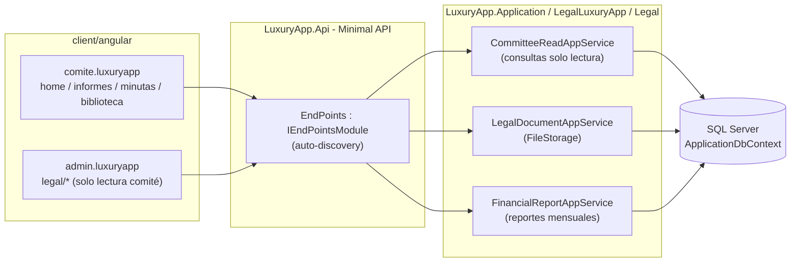
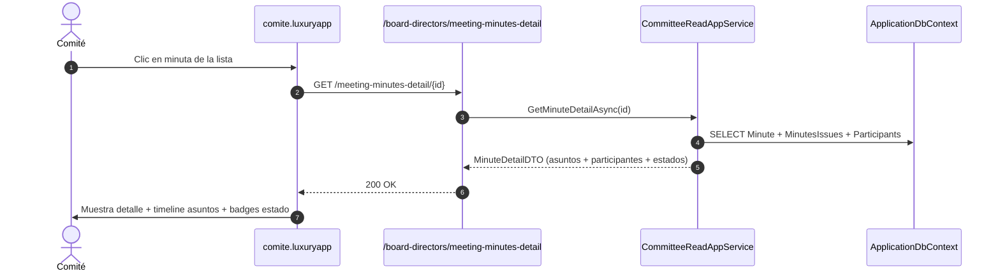
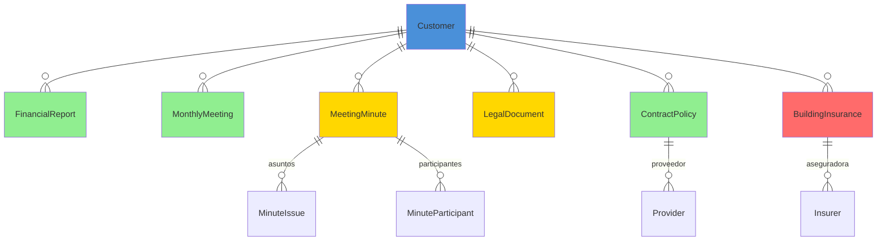

# Análisis del Módulo de Comité (Legal) — Documentación Técnica

> **Ruta**: 📂 Documentación > 💼 Legal > 🏛️ Comité
> **📅 Última Revisión**: 13-jul-26
> **🛡️ Estado**: ✅ Vigente
> **👤 Responsable**: @equipo-legal

---

## 📑 Tabla de Contenidos

1. [Resumen Ejecutivo](#-resumen-ejecutivo)
2. [Visión Funcional](#-visión-funcional)
3. [Arquitectura Técnica](#-arquitectura-técnica)
4. [API Endpoints](#-api-endpoints)
5. [Flujo del Sistema](#-flujo-del-sistema)
6. [Componentes Frontend](#-componentes-frontend)
7. [Reglas de Negocio](#-reglas-de-negocio)
8. [Matriz de Permisos](#-matriz-de-permisos)
9. [Catálogo de Roles del Sistema](#-catálogo-de-roles-del-sistema)
10. [Base de Datos](#-base-de-datos)
11. [Performance](#-performance)
12. [Glosario de Términos](#-glosario-de-términos)
13. [Checklist de Validación](#-checklist-de-validación)
14. [Historial de Cambios](#-historial-de-cambios)

---

## 🎯 Resumen Ejecutivo

**Propósito**: Módulo de consulta ejecutiva para miembros del consejo directivo y comité de vigilancia que permite visualizar documentos, minutas, estados financieros y pólizas de seguros de manera centralizada y de solo lectura, dentro del contexto Legal.

**Actores Involucrados** (`ApplicationRoleEnum`): `Comite`, `Condomino`, `Administrador`, `GerenteOperaciones`, `GerenteAtencion`, `Asistente`, `Legal`, `AdministracionGeneral`, `SuperUsuario`.

**Dependencias**: `Customer` (tenant), `Property` (unidades), `ApplicationUser` (identidad), `FileStorage` (documentos PDF), `Charge` (gastos comité), `FileStorage` (imágenes, PDFs).

**Alcance**:

- ✅ Incluye: Consultas de solo lectura (GET) para imágenes home, estados financieros, juntas mensuales, minutas, biblioteca legal, contratos, seguro edificio; visor PDF integrado; UI ejecutiva con cards e imágenes.
- ❌ No incluye: Edición/creación de documentos, votaciones electrónicas, portal de transparencia pública, firma digital actas.

---

## 🔍 Visión Funcional

**HU-01 — Dashboard ejecutivo comité**

> Como **miembro del comité** quiero acceder a un dashboard visual con tarjetas de acceso rápido a informes financieros, juntas, minutas y biblioteca legal.
> **Criterios**: Grid adaptativo de cards con imágenes de fondo + overlay oscuro; navegación inferior (BottomNavigationBar) con 3 iconos: Inicio, Documentos, Ajustes; cards con ripple effect.

**HU-02 — Consulta de informes financieros y juntas**

> Como **presidente/tesorero** quiero ver listados de informes financieros mensuales y juntas programadas/pasadas con filtros por periodo.
> **Criterios**: Tablas `p-table` (web) / `ion-list` + `ion-item-sliding` (móvil); columnas: mes, tipo, estado, descarga PDF; pull-to-refresh + infinite scroll.

**HU-03 — Gestión de minutas y biblioteca legal**

> Como **secretario** quiero consultar minutas de reuniones con detalle de participantes y asuntos, y acceder a biblioteca legal (actas, asambleas, juicios).
> **Criterios**: Lista minutas con badges estado (Pendiente/En Progreso/Concluido); detalle minuta con timeline UI (asuntos + participantes); biblioteca con tabs "Finanzas", "Legales", "Contratos"; visor PDF modal (`PdfViewerModal`) + botón compartir/descargar.

**HU-04 — Visualización seguro edificio y contratos**

> Como **presidente** quiero ver póliza seguro edificio vigente y listado contratos proveedores con pólizas mantenimiento.
> **Criterios**: Detalle póliza: aseguradora, número póliza, cobertura, prima, vigencia, estado; lista contratos con proveedor, tipo, vigencia, monto; visor PDF integrado.

---

## 🏗️ Arquitectura Técnica



| Capa       | Tecnología                                                                              |
| ---------- | --------------------------------------------------------------------------------------- |
| Backend    | .NET 10, Minimal APIs (`IEndpointModule`), EF Core 10                                   |
| Documentos | `IFileWritePathService` + `IFileReadPathService` (carpeta `legal/{customerId}/{type}/`) |
| PDF        | `PdfViewerModal` (web) / `flutter_pdfview` (móvil nativo)                               |
| Respuestas | `ApiResponseDTO<T>` (nunca `ProblemDetails`)                                            |
| Mapeo      | Explícito `ToDTO()` (AutoMapper prohibido)                                              |
| Frontend   | Angular 22 (standalone, signals, OnPush), Bootstrap 5, catálogo `@ui/*`                     |

---

## 📱 Mobile Responsive (§15 CONVENTIONS.md)

| Vista                                                                             | Patrón (§15.2)                | Implementación                                                                      |
| --------------------------------------------------------------------------------- | ----------------------------- | ----------------------------------------------------------------------------------- |
| `HomeComite` / Dashboard                                                          | **C — Adaptive Wrapper**      | Web: Grid `p-col-*` cards; Móvil: `ion-grid` + `ion-card` + `BottomNavigationBar`   |
| Listados (`informes-financieros`, `reuniones-mensuales`, `minutas`, `biblioteca`) | **B — Componentes Separados** | Wrapper `@if (platform.isMobile()) <app-list-mobile />` `:else <app-list />`        |
| Detalle Minuta / Visor PDF                                                        | **C — Adaptive Wrapper**      | Web: `p-dialog` + `iframe`; Móvil: `ion-modal` full-screen + `Capacitor` PDF viewer |

**Reglas aplicadas:**

- Breakpoint único: 768px (`PlatformService.isMobile()`)
- Touch targets ≥ 44×44px
- Safe areas: `ion-content` / `ion-modal` manejan notch
- Modales en móvil: `ion-modal` vía `IonicDialogModal` (nunca `DynamicDialog`)
- Visor PDF: `flutter_pdfview` nativo móvil / `PDF.js` web

---

## 🌐 API Endpoints

Base: `api/` (kebab-case, plural, minúsculas). Todos **GET** (solo lectura). Respuestas en `ApiResponseDTO<T>`.

### Tabla General

| Categoría           | Endpoint                                                   | Descripción                                         |
| ------------------- | ---------------------------------------------------------- | --------------------------------------------------- |
| Imágenes Home       | `GET /api/files/comite-home-images`                        | Mapeo imágenes menú principal comité                |
| Estados Financieros | `GET /api/board-directors/financial-reports/{customerId}`  | Informes financieros mensuales                      |
| Juntas Mensuales    | `GET /api/board-directors/monthly-meetings/{customerId}`   | Juntas programadas y pasadas                        |
| Minutas             | `GET /api/board-directors/meeting-minutes/{customerId}`    | Listado general minutas                             |
| Detalle Minuta      | `GET /api/board-directors/meeting-minutes-detail/{id}`     | Información detallada + asuntos                     |
| Biblioteca Legal    | `GET /api/customdocument/list/{customerId}/{type}`         | Documentos clasificados (Actas, Asambleas, Juicios) |
| Contratos           | `GET /api/policy-contract/list/{customerId}/true`          | Contratos proveedores + pólizas mantenimiento       |
| Seguro Edificio     | `GET /api/policy-contract/building-insurance/{customerId}` | Póliza seguro vigente edificio                      |

> [!NOTE]
> El campo `responseCode` viaja **dentro** de `ApiResponseDTO`; el status HTTP siempre es `200 OK` para respuestas de negocio (incluidos errores 4xx de dominio). `500` solo para excepciones no controladas.

---

## 🔄 Flujo del Sistema

### Navegación comité (solo lectura)

```mermaid
flowchart TD
  subgraph Comité [comite.luxuryapp]
    A1[Abre Home Comité<br/>Grid cards + imágenes]
    A2[Selecciona sección<br/>Finanzas / Legales / Contratos]
  end
  subgraph API [LuxuryApp.Api]
    B1[GET /board-directors/financial-reports/{customerId}]
    B2[GET /board-directors/monthly-meetings/{customerId}]
    B3[GET /board-directors/meeting-minutes/{customerId}]
    B4[GET /customdocument/list/{customerId}/{type}]
    B5[GET /policy-contract/list/{customerId}/true]
    B6[GET /policy-contract/building-insurance/{customerId}]
  end
  subgraph Visor [PdfViewerModal]
    C1[Abre PDF en modal<br/>iframe web / ion-modal móvil]
  end
  A1 --> A2
  A2 --> B1
  A2 --> B2
  A2 --> B3
  A2 --> B4
  A2 --> B5
  A2 --> B6
  B3 --> C1
  B4 --> C1
  B5 --> C1
  B6 --> C1
  style A1 fill:#4A90D9
  style A2 fill:#4A90D9
  style B1 fill:#4A90D9
  style B2 fill:#4A90D9
  style B3 fill:#4A90D9
  style B4 fill:#4A90D9
  style B5 fill:#4A90D9
  style B6 fill:#4A90D9
  style C1 fill:#90EE90
```

### Consulta detalle minuta + asuntos



---

## 🖥️ Componentes Frontend

Workspace: **`client/angular`** (standalone, signals, OnPush, catálogo `@ui/*`, `ApiResponseService`, `Endpoints`).

### Routing (`comite.luxuryapp`)

| App (§14)          | Ruta                   | Componente                | Lazy loading | Guard | Menú |
| ------------------ | ---------------------- | ------------------------- | :----------: | ----- | :--: |
| `comite.luxuryapp` | `home`                 | `HomeComite`              |      ✅      | —     |  ✅  |
| `comite.luxuryapp` | `informes-financieros` | `InformesFinancierosList` |      ✅      | —     |  ✅  |
| `comite.luxuryapp` | `reuniones-mensuales`  | `ReunionesMensualesList`  |      ✅      | —     |  ✅  |
| `comite.luxuryapp` | `minutas`              | `MinutasList`             |      ✅      | —     |  ✅  |
| `comite.luxuryapp` | `minutas/:id`          | `MinutaDetail`            |      ✅      | —     |  ❌  |
| `comite.luxuryapp` | `biblioteca`           | `BibliotecaLegalList`     |      ✅      | —     |  ✅  |
| `comite.luxuryapp` | `contratos`            | `ContratosList`           |      ✅      | —     |  ✅  |
| `comite.luxuryapp` | `seguro-edificio`      | `SeguroEdificioDetail`    |      ✅      | —     |  ✅  |

### Catálogo de Componentes (representativo)

| Componente                      | Selector                               | Tipo       | Signals clave                                        | Servicios            | Comportamiento                                                                                      |
| ------------------------------- | -------------------------------------- | ---------- | ---------------------------------------------------- | -------------------- | --------------------------------------------------------------------------------------------------- |
| `HomeComite`                    | `app-home-comite`                      | web/mobile | `cardsSignal`, `loading`                             | `ApiResponseService` | Grid adaptativo cards con imágenes fondo + overlay, `BottomNavigationBar` (3 iconos), ripple effect |
| `InformesFinancierosList`       | `app-informes-financieros-list`        | web        | `dataSignal`, `loading`, `filters`                   | `ApiResponseService` | `p-table` virtual scroll, filtros mes/año/tipo, exportar, `il-button-*` descarga PDF                |
| `InformesFinancierosListMobile` | `app-informes-financieros-list-mobile` | mobile     | `dataSignal`, `refreshing`                           | `ApiResponseService` | `ion-list` + `ion-item-sliding` + `ili-action-menu`, pull-to-refresh, infinite scroll               |
| `MinutasList`                   | `app-minutas-list`                     | web        | `dataSignal`, `loading`, `filters`                   | `ApiResponseService` | `p-table` badges estado (Pendiente/En Progreso/Concluido), `il-button-*` ver detalle                |
| `MinutaDetail`                  | `app-minuta-detail`                    | web        | `minuteSignal`, `issuesSignal`, `participantsSignal` | `ApiResponseService` | Timeline UI asuntos (chips estado Verde/Amarillo/Azul), panel participantes, `PdfViewerModal` acta  |
| `BibliotecaLegalList`           | `app-biblioteca-legal-list`            | web        | `dataSignal`, `tabsSignal`                           | `ApiResponseService` | Tabs "Finanzas"/"Legales"/"Contratos", `p-table` por tab, `PdfViewerModal`                          |
| `ContratosList`                 | `app-contratos-list`                   | web        | `dataSignal`, `loading`                              | `ApiResponseService` | `p-table` proveedor/tipo/vigencia/monto, `il-button-*` ver PDF                                      |
| `SeguroEdificioDetail`          | `app-seguro-edificio-detail`           | web        | `policySignal`, `loading`                            | `ApiResponseService` | Cards: aseguradora, póliza, cobertura, prima, vigencia, estado; `il-button-*` descarga PDF          |

**Estilos**: Bootstrap 5 (`card`, `grid`, `text-*`); botones/inputs catálogo `@ui/*` (`il-button`, `custom-input-*-signal`, `ili-button-*` mobile). **Testing**: `.spec.ts` por componente (Vitest) — cobertura básica inicialización.

**Interfaces** (`core/interfaces/committee-legal.dto.ts`): `financial-report`, `monthly-meeting`, `meeting-minute`, `minute-issue`, `minute-participant`, `legal-document`, `contract-policy`, `building-insurance`, `paged-result`.

---

## 📜 Reglas de Negocio

| ID     | SI (condición)                                 | ENTONCES (acción)                                                                                           |
| ------ | ---------------------------------------------- | ----------------------------------------------------------------------------------------------------------- | ------------ | ------------------------------------------- | ---------- | ------------ | ------------------------------- |
| RN-001 | Cualquier operación del módulo                 | Se filtra por `currentUser.CustomerId`; ningún acceso cruza tenants                                         |
| RN-002 | Consulta endpoints comité                      | Solo `GET` permitidos; escritura → 405; `ApplicationRoleEnum` debe incluir `Comite` o `Condomino` (lectura) |
| RN-003 | `GET /financial-reports/{customerId}`          | Filtra por `CustomerId` + `IsActive=true`; ordena por `Year` DESC, `Month` DESC                             |
| RN-004 | `GET /monthly-meetings/{customerId}`           | Incluye `MeetingStatus` (`Programada`                                                                       | `Realizada`  | `Cancelada`); ordena por `ScheduledAt` DESC |
| RN-005 | `GET /meeting-minutes/{customerId}`            | Incluye `MinuteStatus` (`Pendiente`                                                                         | `EnProgreso` | `Concluido`); ordena por `MeetingDate` DESC |
| RN-006 | `GET /meeting-minutes-detail/{id}`             | Retorna `Minute` + `Issues[]` (asunto, estado, responsable) + `Participants[]` (nombre, rol, firma)         |
| RN-007 | `GET /customdocument/list/{customerId}/{type}` | `type` ∈ `LegalDocumentType` (`Acta`                                                                        | `Asamblea`   | `Juicio`                                    | `Contrato` | `Reglamento` | `Otro`); filtra `IsActive=true` |
| RN-008 | `GET /policy-contract/list/{customerId}/true`  | Solo `IsActive=true` + `IsMaintenance=true`; incluye `Provider` + `InsuranceExpiry`                         |
| RN-009 | `GET /building-insurance/{customerId}`         | Retorna `BuildingInsurance` vigente (`EndDate >= Today`); si múltiples, la más reciente                     |
| RN-010 | Visor PDF (`PdfViewerModal`)                   | URL firmada (`IFileReadPathService`) expiración 1h; no sirve binarios desde API                             |
| RN-011 | Multi-tenant                                   | Todas las queries filtran `CustomerId` del usuario autenticado; ningún acceso cross-tenant                  |

---

## 🔐 Matriz de Permisos

Roles de `ApplicationRoleEnum`.

| Acción                   | Comité (Client) | Residente (Client) | Admin/Staff | Legal (Corporate) | Sistema |
| ------------------------ | :-------------: | :----------------: | :---------: | :---------------: | :-----: |
| Ver Home Comité          |       ✅        |         ✅         |     ✅      |        ✅         |   ✅    |
| Ver Informes Financieros |       ✅        | ✅ (solo lectura)  |     ✅      |        ✅         |   ✅    |
| Ver Juntas Mensuales     |       ✅        |         ✅         |     ✅      |        ✅         |   ✅    |
| Ver Minutas + Detalle    |       ✅        |         ✅         |     ✅      |        ✅         |   ✅    |
| Ver Biblioteca Legal     |       ✅        |         ✅         |     ✅      |        ✅         |   ✅    |
| Ver Contratos + Seguro   |       ✅        |         ✅         |     ✅      |        ✅         |   ✅    |
| Descargar PDF            |       ✅        |         ✅         |     ✅      |        ✅         |   ✅    |

**Detalle por RoleType**:

- **Client**: `Comite` (acceso completo lectura), `Condomino` (acceso completo lectura)
- **Staff**: `Administrador`, `GerenteOperaciones`, `GerenteAtencion`, `Asistente`, `SupervisionOperativa`
- **Corporate**: `Legal`, `AdministracionGeneral`, `Contador`, `SistemasGeneral`
- **System**: `SuperUsuario`

---

## 🗄️ Catálogo de Roles del Sistema

El módulo **no introduce roles nuevos**: reutiliza `ApplicationRoleEnum`. La autorización es **por rol** (`AuthorizeAttribute { Roles = "Comite,Condomino,Administrador,..." }`), no por claims.

---

## 🗄️ Base de Datos

`ApplicationDbContext` (SQL Server). Consultas solo lectura (no hay entidades propias de escritura). FKs con `OnDelete(Restrict)`.



| Tabla                | Columnas clave                                                                                             | Índices                                                                    |
| -------------------- | ---------------------------------------------------------------------------------------------------------- | -------------------------------------------------------------------------- | --------------------------------------------- | --------------------------------------------------------------------------------------------- | -------------------------------------------------------------------------- | ----------------------------------------------------------- | ------------------------------------------------------ |
| `FinancialReports`   | `Id`, `CustomerId`, `Year`, `Month`, `ReportType`, `FilePath`, `GeneratedAt`                               | `IX (CustomerId, Year, Month)`, `UX (CustomerId, Year, Month, ReportType)` |
| `MonthlyMeetings`    | `Id`, `CustomerId`, `Title`, `ScheduledAt`, `Status`, `Agenda` (JSON), `MinutesPdfPath`                    | `IX (CustomerId, ScheduledAt)`, `IX (CustomerId, Status)`                  |
| `MeetingMinutes`     | `Id`, `CustomerId`, `MeetingId`, `MeetingDate`, `Status` (`Pendiente`                                      | `EnProgreso`                                                               | `Concluido`), `MinutesPdfPath`, `MinutesHash` | `IX (CustomerId, MeetingDate)`, `UX (CustomerId, MeetingId)`                                  |
| `MinuteIssues`       | `Id`, `MinuteId`, `Subject`, `Description`, `Status` (`Pendiente`                                          | `EnProgreso`                                                               | `Concluido`), `ResponsibleUserId`             | `IX (MinuteId, Status)`, `IX (ResponsibleUserId, Status)`                                     |
| `MinuteParticipants` | `Id`, `MinuteId`, `UserId`, `Role` (`Presidente`                                                           | `Secretario`                                                               | `Tesorero`                                    | `Vocal`                                                                                       | `Vigilancia`), `SignatureBase64`                                           | `UX (MinuteId, UserId)`, `IX (MinuteId, Role)`              |
| `LegalDocuments`     | `Id`, `CustomerId`, `Type` (`Acta`                                                                         | `Asamblea`                                                                 | `Juicio`                                      | `Contrato`                                                                                    | `Reglamento`                                                               | `Otro`), `FilePath`, `FileName`, `UploadedAt`, `UploadedBy` | `IX (CustomerId, Type)`, `IX (CustomerId, UploadedAt)` |
| `ContractPolicies`   | `Id`, `CustomerId`, `ProviderId`, `Type` (`Contrato`                                                       | `Poliza`                                                                   | `Convenio`                                    | `Escritura`), `Name`, `StartDate`, `EndDate`, `Amount`, `Currency`, `Status`, `IsMaintenance` | `IX (CustomerId, IsMaintenance, Status, EndDate)`, `UX (CustomerId, Name)` |
| `BuildingInsurances` | `Id`, `CustomerId`, `InsurerName`, `PolicyNumber`, `Coverage`, `Premium`, `StartDate`, `EndDate`, `Status` | `IX (CustomerId, Status, EndDate)`, `UX (CustomerId, PolicyNumber)`        |

**Enums** (`LuxuryApp.Shared.Enums`): `EFinancialReportType`, `EMeetingStatus`, `EMinuteStatus`, `ELegalDocumentType`, `EContractPolicyType`, `EContractPolicyStatus`, `EInsuranceStatus`.

---

## ⚡ Performance

- **Lazy loading**: componentes Angular vía `loadComponent` (una carga por ruta).
- **N+1**: consultas con `join`/proyección `.Select()` (sin cargas perezosas por fila); listados paginados server-side (`PaginationCommonDTO`, tope 200).
- **PDF**: `IFileReadPathService` genera URLs firmadas (expiración 1h); no se sirven binarios desde API.
- **Imágenes home**: `IFileReadPathService` genera URLs firmadas; no se sirven binarios desde API.
- **Índices**: compuestos por `CustomerId` + campos filtro frecuente (`Year`/`Month`, `Status`, `ScheduledAt`, `Type`).
- **Export**: tope 10 000 filas (EPPlus streaming).
- **Frontend**: `p-table [virtualScroll]="true"` + `[lazy]="true"`; `@defer (on viewport)` para gráficos Chart.js en dashboard (si se añade).

---

## 📖 Glosario de Términos

| Término                  | Definición                                                                           |
| ------------------------ | ------------------------------------------------------------------------------------ |
| **Comité de Vigilancia** | Órgano de fiscalización del condominio (Presidente, Secretario, Tesorero, Vocales)   |
| **Home Comité**          | Pantalla principal con grid de tarjetas de acceso rápido a secciones                 |
| **Informe Financiero**   | Reporte mensual de ejecución presupuestaria, ingresos/gastos, estado de cuenta       |
| **Junta Mensual**        | Reunión periódica del comité con agenda, acta y acuerdos                             |
| **Minuta/Acta**          | Documento PDF firmado (Presidente + Secretario) con hash SHA256 de integridad        |
| **Biblioteca Legal**     | Repositorio categorizado de actas, asambleas, juicios, contratos, reglamentos        |
| **Visor PDF**            | Componente modal (web) / full-screen (móvil) para visualizar PDF sin salir de la app |
| **Multi-tenant**         | Aislamiento por `CustomerId`: cada comité ve solo su información                     |

---

## ✅ Checklist de Validación ([CONVENTIONS.md §11](../../../../../../CONVENTIONS.md#11-estándares-de-documentación))

> [!NOTE]
> El link a `CONVENTIONS.md` asume que el documento vive en la raíz del propio módulo. Ajusta la profundidad relativa (`../../../../../../`) según la ubicación final.

- [x] CERO mojibake (UTF-8 sin BOM)
- [x] CERO `any` en TypeScript
- [x] Fechas en formato `dd-MMM-yy`
- [x] Endpoints front/back coinciden carácter a carácter
- [x] Diagramas Mermaid válidos (flowchart swimlanes + sequence con `autonumber`)
- [x] Colores Mermaid según §11 (verde `#90EE90` éxito, amarillo `#FFD700` decisión, azul `#4A90D9` proceso, rojo `#FF6B6B` error)
- [x] Reglas de negocio en formato `SI/ENTONCES` (`RN-xxx`)
- [x] Roles usan nombres exactos de `ApplicationRoleEnum`
- [x] Mobile responsive: §15 aplicado según tipo de vista
- [x] Sin PII en logs
- [x] Emojis consistentes · Todo en español

---

## 📝 Historial de Cambios

| Fecha     | Versión | Autor | Cambios                                                                   |
| --------- | ------- | ----- | ------------------------------------------------------------------------- |
| 13-jul-26 | 1.0     | @kilo | Conversión a template §11 CONVENTIONS.md completo desde análisis original |
