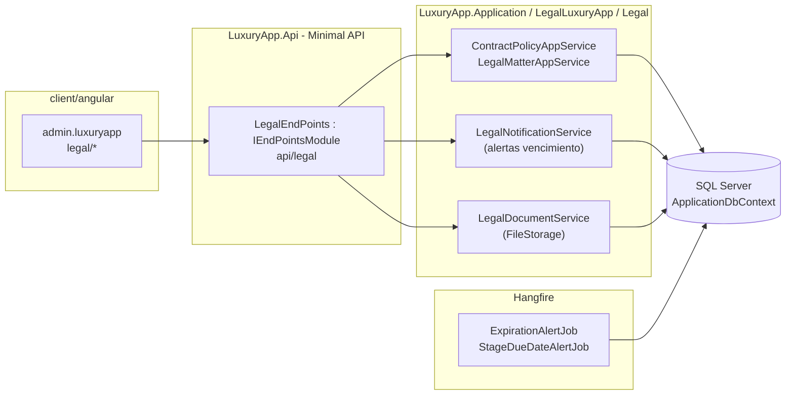
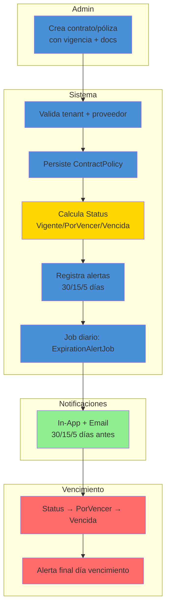
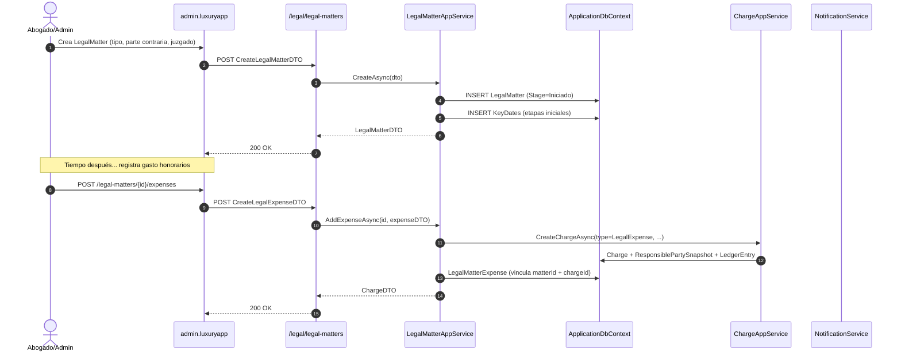
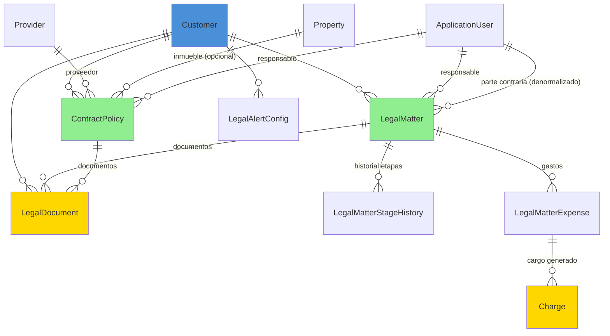

# Legal (Asuntos Legales) — Documentación Técnica

> **Ruta**: 📂 Documentación > 💼 Legal > ⚖️ Asuntos Legales
> **📅 Última Revisión**: 13-jul-26
> **🛡️ Estado**: ✅ Vigente
> **👤 Responsable**: @equipo-legal

---

## 📑 Tabla de Contenidos

1. [Resumen Ejecutivo](#-resumen-ejecutivo)
2. [Visión Funcional](#-visión-funcional)
3. [Arquitectura Técnica](#-arquitectura-técnica)
4. [API Endpoints](#-api-endpoints)
5. [Flujo del Sistema](#-flujo-del-sistema)
6. [Componentes Frontend](#-componentes-frontend)
7. [Reglas de Negocio](#-reglas-de-negocio)
8. [Matriz de Permisos](#-matriz-de-permisos)
9. [Catálogo de Roles del Sistema](#-catálogo-de-roles-del-sistema)
10. [Base de Datos](#-base-de-datos)
11. [Performance](#-performance)
12. [Glosario de Términos](#-glosario-de-términos)
13. [Checklist de Validación](#-checklist-de-validación)
14. [Historial de Cambios](#-historial-de-cambios)

---

## 🎯 Resumen Ejecutivo

**Propósito**: Módulo de gestión legal que centraliza contratos/pólizas, asuntos legales en curso, normativas y cumplimiento normativo para condominios, con trazabilidad documental y alertas de vencimiento.

**Actores Involucrados** (`ApplicationRoleEnum`): `Administrador`, `GerenteOperaciones`, `GerenteAtencion`, `Asistente`, `Legal`, `AdministracionGeneral`, `SuperUsuario`.

**Dependencias**: `Customer` (tenant), `Provider` (proveedores), `Property` (unidades afectadas), `ApplicationUser` (responsables), `Charge` (gastos legales), `FileStorage` (documentos), Hangfire (alertas vencimiento).

**Alcance**:

- ✅ Incluye: Contratos/pólizas (CRUD + vigencia + alertas), Asuntos legales (expediente + etapas + documentos), Catálogo normativo, Reportes de cumplimiento, Integración gastos legales → `Charge`.
- ❌ No incluye: Firma electrónica avanzada, expediente judicial automatizado, portal de abogados externos, gestión de litigios complejos (solo registro).

---

## 🔍 Visión Funcional

**HU-01 — Gestión de contratos y pólizas**

> Como **administrador legal** quiero crear/editar contratos y pólizas con vigencia, tipo, proveedor y documentos adjuntos para tener control centralizado.
> **Criterios**: `ContractPolicy` con `StartDate`/`EndDate`, `Type` (`Contrato`|`Poliza`|`Convenio`|`Escritura`), `ProviderId`, `PropertyId` (opcional), `Amount`, `Currency`, `Status` (`Vigente`|`PorVencer`|`Vencida`|`Cancelada`); alertas 30/15/5 días antes; adjuntos PDF/XML en `FileStorage`.

**HU-02 — Expediente de asuntos legales**

> Como **abogado/admin** quiero registrar asuntos legales con etapas, responsables, fechas clave y documentos para dar seguimiento a litigios, demandas, trámites.
> **Criterios**: `LegalMatter` con `MatterType` (`Civil`|`Mercantil`|`Laboral`|`Administrativo`|`Fiscal`), `Stage` (`Iniciado`|`EnTramite`|`Audiencia`|`Sentencia`|`Concluido`|`Archivado`), `ResponsibleUserId`, `OpposingParty`, `Court`, `FileNumber`, `KeyDates` (JSON etapas), adjuntos; historial de cambios inmutable.

**HU-03 — Alertas de vencimiento**

> Como **admin** quiero recibir alertas automáticas de contratos/pólizas por vencer y etapas legales próximas.
> **Criterios**: Job Hangfire diario → `NotificationService` (In-App + Email) 30/15/5 días; `LegalMatter` etapas con `DueDate` → alerta 2 días antes; configurable por tenant.

**HU-04 — Gastos legales integrados**

> Como **contabilidad** quiero que los gastos legales (honorarios, notariales, judiciales) generen `Charge` automático en `CobranzaNativa`.
> **Criterios**: Al registrar gasto en `LegalMatter` o `ContractPolicy` → `ChargeAppService.CreateAsync` tipo `LegalExpense` + `ResponsiblePartySnapshot`; aparece en estado de cuenta propietario/condominio.

---

## 🏗️ Arquitectura Técnica



| Capa        | Tecnología                                                                              |
| ----------- | --------------------------------------------------------------------------------------- | -------------- |
| Backend     | .NET 10, Minimal APIs (`IEndpointModule`), EF Core 10                                   |
| Documentos  | `IFileWritePathService` + `IFileReadPathService` (carpeta `legal/{customerId}/{matterId | contractId}/`) |
| Alertas     | Hangfire (`RecurringJob`) + `NotificationService` (In-App, Email)                       |
| Integración | `ChargeAppService` (gastos legales → CobranzaNativa)                                    |
| Respuestas  | `ApiResponseDTO<T>` (nunca `ProblemDetails`)                                            |
| Mapeo       | Explícito `ToDTO()` (AutoMapper prohibido)                                              |
| Frontend    | Angular 22 (standalone, signals, OnPush), Bootstrap 5, catálogo `@ui/*`                     |

---

## 📱 Mobile Responsive (§15 CONVENTIONS.md)

| Vista                                       | Patrón (§15.2)         | Implementación                                                          |
| ------------------------------------------- | ---------------------- | ----------------------------------------------------------------------- |
| `ContractPolicyList` / `ContractPolicyForm` | **A — CSS Responsive** | PrimeFlex grid (`p-col-*`), `p-table` responsive, modal `p-dialog`      |
| `LegalMatterList` / `LegalMatterForm`       | **A — CSS Responsive** | PrimeFlex, `p-table` con scroll horizontal móvil, `p-dialog` responsive |
| `LegalDashboard`                            | **A — CSS Responsive** | Cards KPI adaptativas (`p-col-12 p-md-6 p-lg-3`), gráfico `@defer`      |

**Reglas aplicadas:**

- Breakpoint único: 768px (`PlatformService.isMobile()`)
- Touch targets ≥ 44×44px en botones/iconos
- Safe areas: `p-dialog` / `p-sidenav` manejan notch
- Modales: `p-dialog` (web), `DynamicDialog` — **no** `ion-modal` (módulo admin, no operativo móvil)

---

## 🌐 API Endpoints

Base por dominio (kebab-case, plural, minúsculas, prefijo `api/`):

| Dominio           | Base Path                     | Descripción                              |
| ----------------- | ----------------------------- | ---------------------------------------- |
| Contratos/Pólizas | `api/legal/contract-policies` | CRUD + vigencia + adjuntos               |
| Asuntos Legales   | `api/legal/legal-matters`     | CRUD + etapas + adjuntos + historial     |
| Alertas           | `api/legal/alerts`            | Configuración + historial notificaciones |
| Dashboard         | `api/legal/dashboard`         | KPIs + próximos vencimientos             |

### Tabla General (muestra representativa)

| Método | Path                                | Roles | Request DTO                     | Response DTO                        | Códigos HTTP          |
| ------ | ----------------------------------- | ----- | ------------------------------- | ----------------------------------- | --------------------- |
| POST   | `/contract-policies`                | Admin | `CreateContractPolicyDTO`       | `ContractPolicyDTO`                 | 200 · 400 · 404 · 409 |
| GET    | `/contract-policies`                | Admin | `PaginationCommonDTO` + filtros | `PagedResultDTO<ContractPolicyDTO>` | 200 · 400             |
| GET    | `/contract-policies/{id}`           | Admin | —                               | `ContractPolicyDTO`                 | 200 · 404             |
| PUT    | `/contract-policies/{id}`           | Admin | `UpdateContractPolicyDTO`       | `ContractPolicyDTO`                 | 200 · 400 · 404 · 409 |
| POST   | `/contract-policies/{id}/documents` | Admin | `UploadDocumentDTO`             | `LegalDocumentDTO`                  | 200 · 400 · 404       |
| POST   | `/legal-matters`                    | Admin | `CreateLegalMatterDTO`          | `LegalMatterDTO`                    | 200 · 400 · 404       |
| GET    | `/legal-matters`                    | Admin | `PaginationCommonDTO` + filtros | `PagedResultDTO<LegalMatterDTO>`    | 200 · 400             |
| PUT    | `/legal-matters/{id}/stage`         | Admin | `UpdateStageDTO`                | `LegalMatterDTO`                    | 200 · 400 · 404 · 409 |
| POST   | `/legal-matters/{id}/expenses`      | Admin | `CreateLegalExpenseDTO`         | `ChargeDTO`                         | 200 · 400 · 404       |
| GET    | `/dashboard`                        | Admin | —                               | `LegalDashboardDTO`                 | 200 · 400             |

> [!NOTE]
> El campo `responseCode` viaja **dentro** de `ApiResponseDTO`; el status HTTP siempre es `200 OK` para respuestas de negocio (incluidos errores 4xx de dominio). `500` solo para excepciones no controladas.

### Detalle por Endpoint (ejemplos clave)

#### 🟢 POST `/api/legal/contract-policies`

Crea contrato/póliza con vigencia, proveedor, monto y documentos iniciales.

- **Roles**: `SuperUsuario`, `Administrador`, `GerenteOperaciones`, `Legal`, `AdministracionGeneral`.
- **Headers**: `Authorization: Bearer <JWT>`, `Content-Type: application/json`.

**Request** (`CreateContractPolicyDTO`):

```json
{
  "type": "Poliza",
  "providerId": "019c...",
  "propertyId": "019c...",
  "name": "Póliza Responsabilidad Civil",
  "description": "Cobertura daños a terceros áreas comunes",
  "startDate": "2026-07-01",
  "endDate": "2027-06-30",
  "amount": 150000.0,
  "currency": "MXN",
  "documents": [
    {
      "fileName": "poliza-rc-2026.pdf",
      "base64": "JVBERi0xLjQK...",
      "contentType": "application/pdf"
    }
  ]
}
```

**Response 200** (`ApiResponseDTO<ContractPolicyDTO>`):

```json
{
  "success": true,
  "message": "Contrato/póliza creado correctamente.",
  "responseCode": 200,
  "data": {
    "id": "019c...",
    "type": "Poliza",
    "providerName": "Seguros Monterrey",
    "propertyDisplay": "Torre A - Áreas Comunes",
    "name": "Póliza Responsabilidad Civil",
    "status": "Vigente",
    "startDate": "2026-07-01",
    "endDate": "2027-06-30",
    "daysToExpiration": 365,
    "amount": 150000.0,
    "currency": "MXN",
    "documents": [
      {
        "id": "019c...",
        "fileName": "poliza-rc-2026.pdf",
        "url": "api/files/download/019c...",
        "uploadedAt": "2026-07-13T10:00:00Z"
      }
    ]
  }
}
```

**Validaciones**: `endDate > startDate`; `amount > 0`; `providerId` existe en tenant; `propertyId` (si viene) pertenece al tenant; `Status` calculado: `Vigente`/`PorVencer` (≤30 días)/`Vencida`/`Cancelada`.

---

## 🔄 Flujo del Sistema

### Ciclo de vida contrato/póliza



### Expediente asunto legal + gasto integrado



---

## 🖥️ Componentes Frontend

Workspace: **`client/angular`** (standalone, signals, OnPush, catálogo `@ui/*`, `ApiResponseService`, `Endpoints`).

### Routing (`admin.luxuryapp`)

| App (§14)         | Ruta                    | Componente             | Lazy loading | Guard       | Menú |
| ----------------- | ----------------------- | ---------------------- | :----------: | ----------- | :--: |
| `admin.luxuryapp` | `legal/contratos`       | `ContractPolicyList`   |      ✅      | `authGuard` |  ✅  |
| `admin.luxuryapp` | `legal/contratos/nuevo` | `ContractPolicyForm`   |      ✅      | `authGuard` |  ❌  |
| `admin.luxuryapp` | `legal/contratos/:id`   | `ContractPolicyDetail` |      ✅      | `authGuard` |  ❌  |
| `admin.luxuryapp` | `legal/asuntos`         | `LegalMatterList`      |      ✅      | `authGuard` |  ✅  |
| `admin.luxuryapp` | `legal/asuntos/nuevo`   | `LegalMatterForm`      |      ✅      | `authGuard` |  ❌  |
| `admin.luxuryapp` | `legal/asuntos/:id`     | `LegalMatterDetail`    |      ✅      | `authGuard` |  ❌  |
| `admin.luxuryapp` | `legal/dashboard`       | `LegalDashboard`       |      ✅      | `authGuard` |  ✅  |

### Catálogo de Componentes (representativo)

| Componente           | Selector                   | Tipo | Signals clave                                           | Servicios                          | Comportamiento                                                                                  |
| -------------------- | -------------------------- | ---- | ------------------------------------------------------- | ---------------------------------- | ----------------------------------------------------------------------------------------------- |
| `ContractPolicyList` | `app-contract-policy-list` | web  | `dataSignal`, `loading`, `filters`                      | `ApiResponseService`               | `p-table` paginado, filtros tipo/estado/proveedor, exportar Excel, `il-button-*` acciones       |
| `ContractPolicyForm` | `app-contract-policy-form` | web  | `submitting`, `form`, `documentsSignal`                 | `ApiResponseService`, `FormHelper` | `FormHelper.submitCrud()`, selector proveedor/propiedad, adjuntos base64, datepicker Flatpickr  |
| `LegalMatterList`    | `app-legal-matter-list`    | web  | `dataSignal`, `filters`                                 | `ApiResponseService`               | `p-table` badges etapa/tipo, `il-button-*` cambiar etapa, ver detalle                           |
| `LegalMatterForm`    | `app-legal-matter-form`    | web  | `submitting`, `form`, `stagesSignal`                    | `ApiResponseService`, `FormHelper` | Editor etapas JSON, responsable (selector usuarios tenant), parte contraria, juzgado            |
| `LegalMatterDetail`  | `app-legal-matter-detail`  | web  | `matterSignal`, `expensesSignal`, `timelineSignal`      | `ApiResponseService`               | Timeline visual etapas, panel gastos (link a `Charge` en Cobranza), adjuntos, historial cambios |
| `LegalDashboard`     | `app-legal-dashboard`      | web  | `statsSignal`, `expiringSignal`, `upcomingStagesSignal` | `ApiResponseService`               | KPIs: vigentes/por vencer/vencidos, próximas etapas, gastos mes; `@defer` gráfico Chart.js      |

**Estilos**: Bootstrap 5 (`card`, `grid`, `text-*`); botones/inputs catálogo `@ui/*` (`il-button`, `il-button-save`, `custom-input-*-signal`). **Testing**: `.spec.ts` por componente (Vitest) — cobertura básica inicialización.

**Interfaces** (`core/interfaces/legal.dto.ts`): `contract-policy`, `legal-matter`, `legal-expense`, `legal-document`, `legal-dashboard`, `paged-result`.

---

## 📜 Reglas de Negocio

| ID     | SI (condición)                                         | ENTONCES (acción)                                                                                                                                                  |
| ------ | ------------------------------------------------------ | ------------------------------------------------------------------------------------------------------------------------------------------------------------------ | --------------------------------------------------------------------------------------------------------- |
| RN-001 | Cualquier operación del módulo                         | Se filtra por `currentUser.CustomerId`; ningún acceso cruza tenants                                                                                                |
| RN-002 | Se crea `ContractPolicy`                               | `Status` calculado: `Vigente` (hoy ∈ [start,end]), `PorVencer` (end ≤ hoy+30), `Vencida` (end < hoy), `Cancelada` (manual)                                         |
| RN-003 | `ContractPolicy` entra en ventana 30/15/5 días         | Job `ExpirationAlertJob` dispara `NotificationService` → In-App + Email a `ResponsibleUserId` + `LegalRoles`                                                       |
| RN-004 | Se actualiza `LegalMatter.Stage`                       | Valida transición permitida (`Iniciado`→`EnTramite`→`Audiencia`→`Sentencia`→`Concluido`                                                                            | `Archivado`); registra `StageHistory` inmutable (fecha, usuario, etapa anterior/nueva, observaciones)     |
| RN-005 | `LegalMatter` tiene `KeyDates` con `DueDate` ≤ hoy+2   | Job `StageDueDateAlertJob` notifica a `ResponsibleUserId` + `LegalRoles`                                                                                           |
| RN-006 | Se registra gasto en `LegalMatter` (`AddExpenseAsync`) | Crea `Charge` tipo `LegalExpense` via `ChargeAppService` + `ResponsiblePartySnapshot`; vincula `LegalMatterExpense` (matterId + chargeId); notifica a contabilidad |
| RN-007 | `ContractPolicy` o `LegalMatter` adjunta documento     | Sube a `FileStorage` carpeta `legal/{customerId}/{contractId                                                                                                       | matterId}/`; registra `LegalDocument` (nombre, tipo, hash SHA256, subido por); valida magic bytes PDF/XML |
| RN-008 | `LegalMatter` tipo `Laboral`                           | Requiere `EmployeeInternalId` vinculado; valida que empleado pertenezca al tenant                                                                                  |
| RN-009 | Consulta dashboard                                     | Agrega KPIs: contratos vigentes/por vencer/vencidos, asuntos por etapa, gastos mes actual vs anterior, próximos vencimientos 30 días                               |
| RN-010 | Multi-tenant                                           | Todas las queries filtran `CustomerId` del usuario autenticado; ningún acceso cross-tenant                                                                         |

---

## 🔐 Matriz de Permisos

Roles de `ApplicationRoleEnum`. Agrupados por `RoleType`.

| Acción                   | Legal (Corporate) |   Admin/Staff    | Sistema |
| ------------------------ | :---------------: | :--------------: | :-----: |
| Contratos/Pólizas CRUD   |        ✅         |        ✅        |   ✅    |
| Contratos adjuntar docs  |        ✅         |        ✅        |   ✅    |
| Asuntos legales CRUD     |        ✅         |        ✅        |   ✅    |
| Cambiar etapa asunto     |        ✅         | ✅ (Responsable) |   ✅    |
| Asuntos adjuntar docs    |        ✅         |        ✅        |   ✅    |
| Registrar gastos legales |        ✅         |        ✅        |   ✅    |
| Ver dashboard legal      |        ✅         |        ✅        |   ✅    |
| Exportar reportes        |        ✅         |        ✅        |   ✅    |
| Configurar alertas       |        ✅         |        ❌        |   ✅    |

**Detalle por RoleType**:

- **Corporate**: `Legal`, `AdministracionGeneral`, `Contador`, `SistemasGeneral`, `RecursosHumanos`
- **Staff**: `Administrador`, `GerenteOperaciones`, `GerenteAtencion`, `Asistente`, `SupervisionOperativa`
- **System**: `SuperUsuario`

---

## 🗄️ Catálogo de Roles del Sistema

El módulo **no introduce roles nuevos**: reutiliza `ApplicationRoleEnum` mediante grupos en `LegalRoles` (`AdminRoles`, `ResponsibleRoles`, `ViewerRoles`). La autorización es **por rol** (`AuthorizeAttribute { Roles = ... }`), no por claims.

---

## 🗄️ Base de Datos

`ApplicationDbContext` (SQL Server). Filtrado por `CustomerId` manual (vía `Provider/Property/ResponsibleUser`). FKs con `OnDelete(Restrict)`.



| Tabla                     | Columnas clave                                                                                 | Índices                                                                                                                  |
| ------------------------- | ---------------------------------------------------------------------------------------------- | ------------------------------------------------------------------------------------------------------------------------ | ---------------------------------------------------------------------- | ------------------------------------------------------------------------------------------------------ | ------------------------------ | ----------- | --------------------------------------------------- | ------------------------------------------------------------------------------------------------------------------------- | ----------- | ----------------------------------------------------------------------------------------------------------------------------------------------- | ------------------------------------------------------------------------------------------------------------------------------------ |
| `ContractPolicy`          | `Id`, `CustomerId`, `ProviderId`, `PropertyId`, `ResponsibleUserId`, `Type` (`Contrato`        | `Poliza`                                                                                                                 | `Convenio`                                                             | `Escritura`), `Name`, `Description`, `StartDate`, `EndDate`, `Amount`, `Currency`, `Status` (`Vigente` | `PorVencer`                    | `Vencida`   | `Cancelada`), `AutoRenew`, `CreatedAt`, `CreatedBy` | `IX (CustomerId, Status, EndDate)`, `IX (CustomerId, ProviderId)`, `IX (CustomerId, PropertyId)`, `UX (CustomerId, Name)` |
| `LegalMatter`             | `Id`, `CustomerId`, `MatterType` (`Civil`                                                      | `Mercantil`                                                                                                              | `Laboral`                                                              | `Administrativo`                                                                                       | `Fiscal`), `Stage` (`Iniciado` | `EnTramite` | `Audiencia`                                         | `Sentencia`                                                                                                               | `Concluido` | `Archivado`), `ResponsibleUserId`, `OpposingParty`, `Court`, `FileNumber`, `KeyDates` (JSON), `Description`, `Status`, `CreatedAt`, `CreatedBy` | `IX (CustomerId, Stage, Status)`, `IX (CustomerId, ResponsibleUserId)`, `IX (CustomerId, MatterType)`, `UX (CustomerId, FileNumber)` |
| `LegalMatterStageHistory` | `Id`, `LegalMatterId`, `FromStage`, `ToStage`, `ChangedAt`, `ChangedByUserId`, `Observations`  | `IX (LegalMatterId, ChangedAt)`                                                                                          |
| `LegalMatterExpense`      | `Id`, `LegalMatterId`, `ChargeId`, `Concept`, `Amount`, `Currency`, `ExpenseDate`, `CreatedBy` | `IX (LegalMatterId, ExpenseDate)`                                                                                        |
| `LegalDocument`           | `Id`, `CustomerId`, `EntityType` (`ContractPolicy`                                             | `LegalMatter`), `EntityId`, `FilePath`, `FileName`, `ContentType`, `SizeBytes`, `Sha256Hash`, `UploadedBy`, `UploadedAt` | `IX (CustomerId, EntityType, EntityId)`, `IX (CustomerId, UploadedAt)` |
| `LegalAlertConfig`        | `Id`, `CustomerId`, `AlertType` (`ContractExpiration`                                          | `StageDueDate`), `DaysBefore` (JSON array), `Channels` (`InApp`                                                          | `Email`), `IsActive`, `RecipientRoles` (CSV), `RecipientUserIds` (CSV) | `UX (CustomerId, AlertType)`                                                                           |

**Enums** (`LuxuryApp.Shared.Enums`): `EContractPolicyType`, `EContractPolicyStatus`, `ELegalMatterType`, `ELegalMatterStage`, `ELegalMatterStatus`, `ELegalAlertType`, `ELegalAlertChannel`.

---

## ⚡ Performance

- **Lazy loading**: componentes Angular vía `loadComponent` (una carga por ruta).
- **N+1**: consultas con `join`/proyección `.Select()` (sin cargas perezosas por fila); listados paginados server-side (`PaginationCommonDTO`, tope 200).
- **Documentos**: `IFileReadPathService` genera URLs firmadas; no se sirven binarios desde API.
- **Alertas**: job Hangfire diario acotado por `CustomerId` + `AlertType` + `IsActive`; consulta `ContractPolicy`/`LegalMatter` con `AsNoTracking()` + proyección a DTO.
- **Dashboard**: agregaciones SQL (`COUNT`, `SUM`) con `GROUP BY` en DB; no materializa entidades.
- **Índices**: compuestos por `CustomerId` + campos de filtro frecuente (`Status`, `EndDate`, `Stage`, `MatterType`).
- **Export**: tope 10 000 filas por archivo (EPPlus streaming).

---

## 📖 Glosario de Términos

| Término                      | Definición                                                                                                  |
| ---------------------------- | ----------------------------------------------------------------------------------------------------------- | ------------ |
| **ContractPolicy**           | Entidad unificada para contratos, pólizas, convenios y escrituras                                           |
| **LegalMatter**              | Expediente de asunto legal (litigio, trámite, demanda, asesoría)                                            |
| **Stage**                    | Etapa procesal del asunto legal (`Iniciado`→`EnTramite`→`Audiencia`→`Sentencia`→`Concluido`                 | `Archivado`) |
| **KeyDates**                 | JSON con fechas clave del asunto: `{ "AudienciaInicial": "2026-08-15", "PlazoContestacion": "2026-07-20" }` |
| **LegalMatterExpense**       | Gasto asociado a asunto legal que genera `Charge` en CobranzaNativa                                         |
| **LegalDocument**            | Documento adjunto (PDF, XML, imagen) con hash SHA256 para integridad                                        |
| **LegalAlertConfig**         | Configuración de alertas por tenant (días antes, canales, roles destinatarios)                              |
| **ResponsiblePartySnapshot** | Foto del responsable financiero al generar `Charge` (reutiliza lógica CobranzaNativa)                       |

---

## ✅ Checklist de Validación ([CONVENTIONS.md §11](../../../../../../CONVENTIONS.md#11-estándares-de-documentación))

> [!NOTE]
> El link a `CONVENTIONS.md` asume que el documento vive en la raíz del propio módulo. Ajusta la profundidad relativa (`../../../../../../`) según la ubicación final.

- [x] CERO mojibake (UTF-8 sin BOM)
- [x] CERO `any` en TypeScript
- [x] Fechas en formato `dd-MMM-yy`
- [x] Endpoints front/back coinciden carácter a carácter
- [x] Diagramas Mermaid válidos (flowchart swimlanes + sequence con `autonumber`)
- [x] Colores Mermaid según §11 (verde `#90EE90` éxito, amarillo `#FFD700` decisión, azul `#4A90D9` proceso, rojo `#FF6B6B` error)
- [x] Reglas de negocio en formato `SI/ENTONCES` (`RN-xxx`)
- [x] Roles usan nombres exactos de `ApplicationRoleEnum`
- [x] Mobile responsive: §15 aplicado según tipo de vista
- [x] Sin PII en logs
- [x] Emojis consistentes · Todo en español

---

## 📝 Historial de Cambios

| Fecha     | Versión | Autor         | Cambios                                                                                                                                                                                                                                                      |
| --------- | ------- | ------------- | ------------------------------------------------------------------------------------------------------------------------------------------------------------------------------------------------------------------------------------------------------------ |
| 10-jun-26 | 1.0     | @equipo-legal | Documentación inicial del módulo (template mínimo)                                                                                                                                                                                                           |
| 13-jul-26 | 2.0     | @kilo         | Actualización a template §11 CONVENTIONS.md: Mobile responsive §15, checklist §11, Mermaid colores, sin PII, sin `any`, rutas api kebab-case, TOC completo, arquitectura, flujos, componentes, matriz permisos, ER diagram, performance, glosario, historial |
