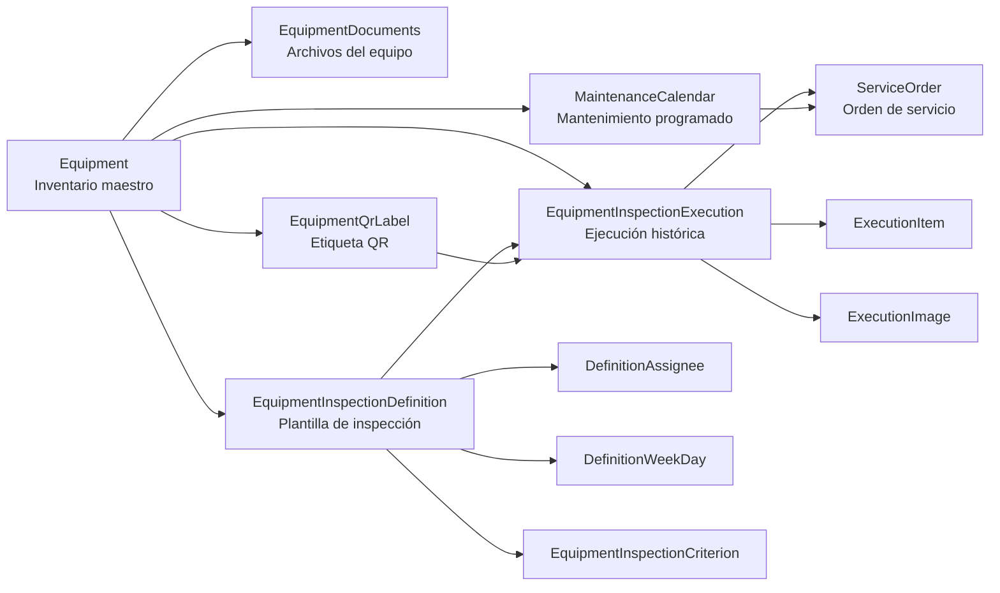
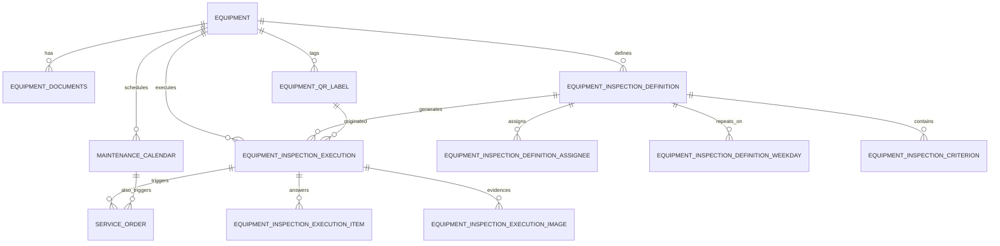
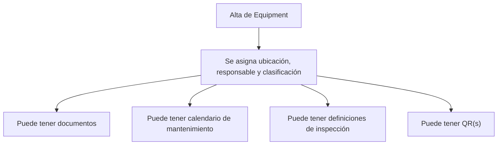
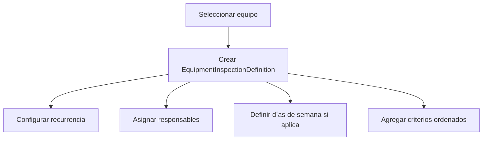
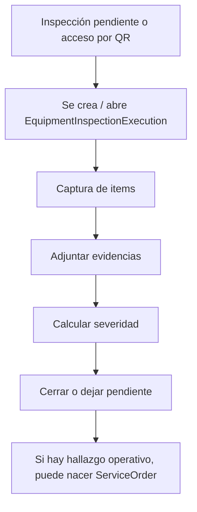
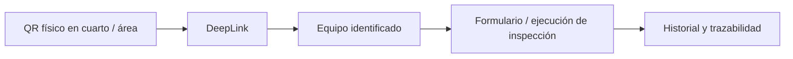
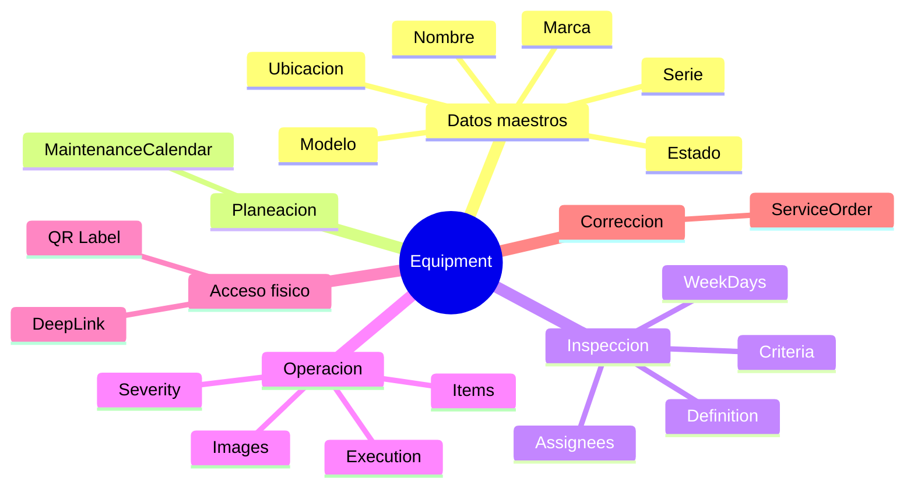

# 🧭 Módulo de Equipamiento e Inspecciones

> Estado documentado con base en las entidades actuales de Infrastructure y sus relaciones reales en código.
>
> Ubicación analizada:
> - `api/LuxuryApp.Infrastructure/Data/Entities/Tenant/Maintenance/Equipments`
> - `api/LuxuryApp.Infrastructure/Data/Entities/Tenant/Maintenance/EquipmentInspections`
> - `api/LuxuryApp.Infrastructure/Data/Entities/Tenant/Operations/FieldService`
> - `api/LuxuryApp.Infrastructure/Data/ApplicationDbContext.cs`

---

## 🎯 Lectura rápida

<span style="color:#0f766e"><strong>Lo que existe hoy</strong></span>

El submódulo está dividido en **dos bloques principales**:

| Bloque | Responsabilidad | Entidad raíz visible |
|---|---|---|
| 🏷️ Equipamiento | Inventario maestro del equipo, datos generales, ubicación, clasificación, documentos y vínculo con mantenimiento | `Equipment` |
| ✅ Inspecciones de equipo | Plantillas de inspección, criterios, asignados, ejecuciones, evidencias y etiquetas QR | `EquipmentInspectionDefinition` / `EquipmentInspectionExecution` |

<span style="color:#b45309"><strong>Dato importante de diseño</strong></span>

Aunque el módulo ya usa la entidad `Equipment`, **muchos campos y nombres de columnas siguen usando el término histórico `Machinery`**:

- `MachineryId`
- `NameMachinery`
- comentarios y nombres de navegación como `Machinery`

Eso significa que el dominio ya evolucionó, pero **el lenguaje interno todavía está mezclado**.

---

## 🧱 Vista general de arquitectura



---

## 🗂️ Estructura actual por agregado

### 1. 🚜 Agregado de equipamiento

La entidad central del inventario es `Equipment`.

#### `Equipment`

| Campo | Tipo / intención | Observaciones |
|---|---|---|
| `Id` | `Guid` | Viene de `GuidIdEntity` |
| `CustomerId` | tenant | Implementa `ITenantEntity` |
| `ApplicationUserId` | responsable | Se guarda como columna `UserId` |
| `EquipoClasificacionId` | clasificación | La columna real es `EquipmentClassificationId` |
| `NameMachinery` | nombre del equipo | La propiedad sigue con naming histórico |
| `Brand` | marca | Inventario |
| `Model` | modelo | Inventario |
| `Serie` | serie | Columna `SerialNumber` |
| `DateOfPurchase` | compra / instalación | Columna `InstallationDate` |
| `Ubication` | ubicación física | Dónde vive el equipo |
| `State` | `EState` | `Activo` / `Inactivo` |
| `InventoryCategory` | `EInventoryCategory` | Categoría de inventario |
| `TechnicalSpecifications` | ficha técnica | Hasta 500 chars |
| `PhotoPath` | foto | Ruta del archivo |
| `Observations` | comentarios | Hasta 255 chars |

#### Navegaciones de `Equipment`

| Navegación | Tipo | Significado |
|---|---|---|
| `MaintenanceCalendars` | 1:N | Planeación de mantenimientos |
| `EquipmentInspectionDefinitions` | 1:N | Plantillas de inspección del equipo |
| `EquipmentInspectionExecutions` | 1:N | Historial ejecutado |
| `EquipmentQrLabels` | 1:N | QRs asociados |

#### `EquipmentDocuments`

| Campo | Tipo / intención | Observaciones |
|---|---|---|
| `MachineryId` | FK a `Equipment` | Conserva naming histórico |
| `Equipment` | navegación | El nombre de navegación ya usa `Equipment` |
| `Document` | ruta / nombre de archivo | Columna `DocumentPath` |

<span style="color:#2563eb"><strong>Interpretación</strong></span>

`Equipment` es el **maestro operativo** del submódulo. Todo lo demás se cuelga de ahí:

- mantenimiento programado
- inspecciones
- historial
- QR
- archivos

---

### 2. 🧩 Agregado de definición de inspecciones

Este bloque define **qué se debe inspeccionar**, **cada cuánto**, y **a quién se asigna**.

#### `EquipmentInspectionDefinition`

| Campo | Tipo / intención | Observaciones |
|---|---|---|
| `CustomerId` | tenant | Multi-tenant |
| `MachineryId` | FK a `Equipment` | Naming heredado |
| `Name` | nombre de la inspección | Ej. "Checklist semanal bomba 1" |
| `Description` | descripción | Opcional |
| `IsActive` | activo/inactivo | Control funcional |
| `RecurrenceUnit` | `ERecurrenceUnit` | `Day`, `Week`, `Month` |
| `RecurrenceInterval` | entero | Cada cuántas unidades |
| `DayOfMonth` | opcional | Para recurrencias mensuales |
| `EstimatedDurationMinutes` | opcional | Duración estimada |
| `LastGeneratedAt` | opcional | Última generación |
| `CreatedAt` | fecha alta | UTC |
| `CreatedByUserId` | creador | Obligatorio |

#### Navegaciones

| Navegación | Tipo | Significado |
|---|---|---|
| `Machinery` | N:1 | Equipo base |
| `Assignees` | 1:N | Usuarios responsables |
| `WeekDays` | 1:N | Días de semana configurados |
| `Criteria` | 1:N | Checklist real |
| `Executions` | 1:N | Historial derivado |

#### `EquipmentInspectionDefinitionAssignee`

| Campo | Significado |
|---|---|
| `EquipmentInspectionDefinitionId` | plantilla padre |
| `ApplicationUserId` | usuario asignado |
| `IsPrimary` | marca al responsable principal |
| `CreatedAt` | auditoría básica |

#### `EquipmentInspectionDefinitionWeekDay`

| Campo | Significado |
|---|---|
| `EquipmentInspectionDefinitionId` | plantilla padre |
| `WeekDay` | día de semana `DayOfWeek` |

#### `EquipmentInspectionCriterion`

| Campo | Significado |
|---|---|
| `EquipmentInspectionDefinitionId` | plantilla padre |
| `Title` | nombre del criterio |
| `Description` | ayuda o detalle |
| `Position` | orden visual / lógico |
| `IsRequired` | si debe contestarse |
| `IsActive` | si sigue vigente |
| `CreatedAt` | auditoría básica |

<span style="color:#7c3aed"><strong>Interpretación</strong></span>

Aquí vive la **configuración reusable** de una inspección. Todavía no es un evento ocurrido; es la receta.

---

### 3. 📋 Agregado de ejecución de inspecciones

Este bloque representa **la ocurrencia real** de una inspección.

#### `EquipmentInspectionExecution`

| Campo | Tipo / intención | Observaciones |
|---|---|---|
| `CustomerId` | tenant | Multi-tenant |
| `MachineryId` | FK a `Equipment` | Equipo inspeccionado |
| `EquipmentInspectionDefinitionId` | FK a definición | Qué plantilla originó la ejecución |
| `AssignedToUserId` | usuario asignado | Responsable previsto |
| `ExecutedByUserId` | usuario ejecutor | Quién la contestó realmente |
| `Status` | `EStatus` | Arranca en `Pendiente` |
| `Severity` | `EInspectionStatus?` | `Normal`, `NoGrave`, `Urgente` |
| `Observations` | observaciones generales | Hasta 1000 chars |
| `ExecutionDate` | fecha operativa | `DateOnly` |
| `StartedAt` | inicio real | opcional |
| `CompletedAt` | fin real | opcional |
| `IsClosed` | cierre | marca de clausura |
| `LastModifiedAt` | última edición | útil para ajustes admin |
| `LastModifiedByUserId` | quién editó | auditoría |
| `AdministrativeModificationReason` | motivo | cambio administrativo |
| `AdministrativeModificationCount` | contador | cuántas veces se tocó |
| `GeneratedFromQrLabelId` | QR origen | opcional |

#### Navegaciones

| Navegación | Tipo | Significado |
|---|---|---|
| `Machinery` | N:1 | Equipo inspeccionado |
| `EquipmentInspectionDefinition` | N:1 | Plantilla usada |
| `AssignedToUser` | N:1 | Asignado |
| `ExecutedByUser` | N:1 | Ejecutante |
| `LastModifiedByUser` | N:1 | Último editor admin |
| `GeneratedFromQrLabel` | N:1 | QR disparador |
| `Items` | 1:N | Respuestas de criterios |
| `Images` | 1:N | Evidencias |
| `ServiceOrders` | 1:N | Órdenes generadas desde hallazgos |

#### `EquipmentInspectionExecutionItem`

| Campo | Significado |
|---|---|
| `EquipmentInspectionExecutionId` | ejecución padre |
| `EquipmentInspectionCriterionId` | criterio respondido |
| `IsCompliant` | cumple / no cumple |
| `Observation` | detalle del hallazgo |
| `Position` | orden copiado o consolidado |

#### `EquipmentInspectionExecutionImage`

| Campo | Significado |
|---|---|
| `EquipmentInspectionExecutionId` | ejecución padre |
| `ImagePath` | archivo de evidencia |
| `Caption` | descripción |
| `UploadedAt` | fecha de subida |
| `UploadedByUserId` | autor de evidencia |
| `Position` | orden |

<span style="color:#dc2626"><strong>Interpretación</strong></span>

La ejecución ya es un **registro histórico y auditable**. Tiene suficiente información para:

- saber qué se inspeccionó
- quién debía hacerlo
- quién lo hizo
- qué salió mal
- qué imágenes se adjuntaron
- si disparó una orden de servicio

---

### 4. 🔳 Agregado de QR

#### `EquipmentQrLabel`

| Campo | Tipo / intención | Observaciones |
|---|---|---|
| `CustomerId` | tenant | Multi-tenant |
| `MachineryId` | FK a `Equipment` | equipo destino |
| `Code` | código único visible | identificador de etiqueta |
| `Name` | alias | nombre amigable |
| `QrType` | `EEquipmentInspectionQrType` | `Inspection`, `TechnicalSheet`, `Internal` |
| `DeepLink` | enlace destino | clave para app / frontend |
| `IsActive` | vigente | solo uno o varios según regla de negocio |
| `PrintedAt` | última impresión | auditoría física |
| `PrintedByUserId` | quién imprimió | auditoría |
| `Notes` | notas | contexto de colocación |
| `CreatedAt` | alta | UTC |

#### Navegaciones

| Navegación | Tipo | Significado |
|---|---|---|
| `Machinery` | N:1 | equipo |
| `PrintedByUser` | N:1 | auditoría |
| `Executions` | 1:N | inspecciones disparadas desde ese QR |

<span style="color:#0891b2"><strong>Interpretación</strong></span>

El QR no es solo decorativo. En el diseño actual ya es un **punto de entrada operacional** al flujo de inspección.

---

## 🔗 Relaciones clave entre módulos

### Relación principal



### Cruces más importantes

| Origen | Destino | Tipo | Para qué sirve |
|---|---|---|---|
| `Equipment` | `MaintenanceCalendar` | 1:N | mantenimiento planeado |
| `Equipment` | `EquipmentInspectionDefinition` | 1:N | checklist por equipo |
| `EquipmentInspectionDefinition` | `EquipmentInspectionExecution` | 1:N | historial generado desde plantilla |
| `EquipmentInspectionExecution` | `ServiceOrder` | 1:N | convertir hallazgos en trabajo correctivo |
| `EquipmentQrLabel` | `EquipmentInspectionExecution` | 1:N | trazabilidad de origen por QR |
| `MaintenanceCalendar` | `ServiceOrder` | 1:N | órdenes nacidas desde plan preventivo |

---

## 🔄 Flujos funcionales actuales

### 1. Flujo de inventario del equipo



### 2. Flujo de definición de inspección



### 3. Flujo de ejecución



### 4. Flujo QR



---

## 🎛️ Enums que gobiernan el comportamiento

### Estados principales

| Enum | Valores relevantes | Uso |
|---|---|---|
| `EState` | `Activo`, `Inactivo` | estado del equipo |
| `EStatus` | `Pendiente`, `Concluido`, otros estados compartidos | estado de ejecución y órdenes |
| `EInspectionStatus` | `Normal`, `NoGrave`, `Urgente` | severidad del hallazgo |
| `ERecurrenceUnit` | `Day`, `Week`, `Month` | unidad de frecuencia en definición |
| `EEquipmentInspectionQrType` | `Inspection`, `TechnicalSheet`, `Internal` | intención del QR |
| `EInventoryCategory` | categorías de inventario | clasificación funcional |
| `ETypeMaintance` | `Preventivo`, `Correctivo`, `Predictivo`, etc. | órdenes y calendarios |

<span style="color:#b91c1c"><strong>Observación</strong></span>

`EStatus` es un enum compartido y amplio. Eso ayuda a reutilizar, pero también puede meter ruido semántico si inspecciones y órdenes necesitan estados realmente distintos.

---

## 🧠 Convenciones y decisiones técnicas visibles hoy

### 1. Multi-tenant parcial pero consistente en entidades principales

Tienen `CustomerId`:

- `Equipment`
- `EquipmentInspectionDefinition`
- `EquipmentInspectionExecution`
- `EquipmentQrLabel`

No lo tienen:

- `EquipmentDocuments`
- `EquipmentInspectionCriterion`
- `EquipmentInspectionDefinitionAssignee`
- `EquipmentInspectionDefinitionWeekDay`
- `EquipmentInspectionExecutionItem`
- `EquipmentInspectionExecutionImage`

Esto sugiere un patrón de tenant por agregados raíz, no por hijos.

### 2. Naming híbrido `Equipment` vs `Machinery`

Hay una mezcla entre:

- lenguaje nuevo: `Equipment`
- lenguaje viejo: `MachineryId`, `NameMachinery`, `Machinery`

Esto es probablemente el principal indicador de deuda de nomenclatura del módulo.

### 3. Borrado restringido global

En `ApplicationDbContext` existe una regla global:

```csharp
foreignKey.DeleteBehavior = DeleteBehavior.Restrict;
```

Eso implica:

- no hay cascadas automáticas reales
- eliminar un equipo con hijos asociados puede bloquearse
- cualquier refactor de borrado o archivado debe contemplar limpieza explícita

### 4. Poco Fluent API específico

No se observan configuraciones dedicadas visibles para este agregado en `OnModelCreating`; el modelo depende principalmente de:

- atributos `[Table]`
- atributos `[Column]`
- convenciones EF
- restricción global de borrado

### 5. Trazabilidad administrativa en ejecución

`EquipmentInspectionExecution` ya contempla edición administrativa con:

- `LastModifiedAt`
- `LastModifiedByUserId`
- `AdministrativeModificationReason`
- `AdministrativeModificationCount`

Eso indica que la ejecución ya se considera un documento sensible que puede ser corregido, no solo capturado.

---

## 🟡 Zonas de posible confusión o deuda

| Tema | Qué pasa hoy | Riesgo si modificamos |
|---|---|---|
| Naming | coexisten `Equipment` y `Machinery` | contratos ambiguos, errores en mapeos |
| Documentos | `EquipmentDocuments` está en singular de dominio pero plural en clase | inconsistencia semántica |
| Estados | `EStatus` se comparte entre varios procesos | estados demasiado genéricos |
| Tenant | hijos sin `CustomerId` | dependencia total del padre para aislamiento |
| Borrado | `Restrict` global | refactors con deletes pueden romper flujo |
| QR | `DeepLink` vive en BD | si cambia el contrato del front/app, hay que migrar datos |
| Historial | ejecución referencia QR opcional | parte del historial puede no tener origen QR |

---

## 🔥 Puntos críticos si vamos a modificar el módulo

### Cambios relativamente seguros

- agregar campos descriptivos nuevos
- ampliar DTOs / vistas
- agregar validaciones de negocio
- enriquecer reporteo e historial

### Cambios sensibles

- renombrar `MachineryId` a `EquipmentId`
- renombrar `NameMachinery` o navegaciones `Machinery`
- tocar `EStatus` si es compartido por otros módulos
- cambiar comportamiento del QR o formato del `DeepLink`
- cambiar reglas de borrado
- separar más fuerte planeación vs inspección vs orden de servicio

### Cambios de alto impacto

- mover inspecciones a otro bounded context
- convertir `ExecutionItem` en snapshot más rico del criterio
- introducir versionado de definiciones
- permitir múltiples tipos de QR con destinos distintos y reglas distintas

---

## 🧪 Cómo entenderlo mentalmente antes del refactor

### Modelo conceptual actual



### Lectura recomendada

1. `Equipment` es el activo maestro.
2. `EquipmentInspectionDefinition` describe la regla reusable.
3. `EquipmentInspectionExecution` es el evento histórico.
4. `EquipmentQrLabel` es el acceso físico/operativo.
5. `ServiceOrder` es la respuesta correctiva cuando una inspección escala.

---

## ✅ Conclusión operativa

<span style="color:#166534"><strong>El módulo actual ya tiene una base bastante clara</strong></span>:

- un maestro de equipos
- una capa de configuración de inspecciones
- una capa histórica de ejecución
- un mecanismo QR para acceso directo
- una salida hacia órdenes de servicio

<span style="color:#991b1b"><strong>La principal deuda no parece ser de funcionalidad, sino de coherencia del modelo</strong></span>:

- nombres históricos mezclados con nombres nuevos
- responsabilidades cercanas pero aún separadas por convención más que por diseño explícito
- dependencias cruzadas que conviene proteger antes de renombrar o consolidar

---

## 🛠️ Sugerencia para el siguiente paso

Antes de modificar entidades, conviene validar una decisión base:

| Decisión | Pregunta |
|---|---|
| Lenguaje de dominio | ¿vamos a estandarizar todo a `Equipment` y retirar `Machinery`? |
| Límite del agregado | ¿inspecciones seguirán colgando directo de `Equipment` o tendrán identidad más independiente? |
| QR | ¿el QR siempre debe abrir inspección o coexistirán varios destinos reales? |
| Órdenes correctivas | ¿una ejecución puede generar varias órdenes o debe limitarse? |
| Estados | ¿conviene seguir usando `EStatus` compartido o separar estado de inspección? |

Si este documento se usa como base de refactor, lo ideal es que el siguiente archivo sea uno de **target design** con:

1. nombres finales deseados
2. tablas/columnas que se preservan
3. contratos que cambian
4. estrategia de migración

