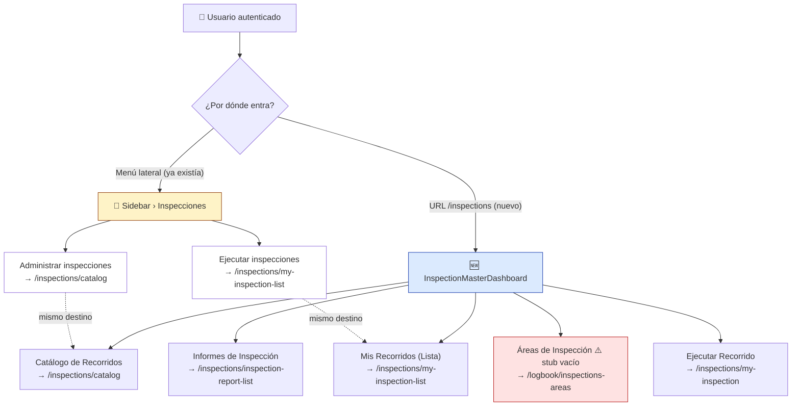
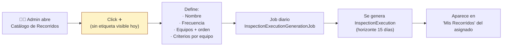
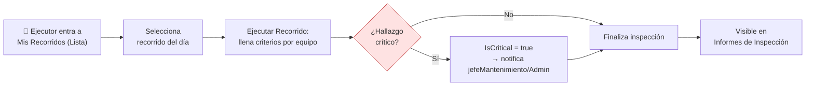

# 🧭 Análisis de Flujo — Módulo de Inspecciones/Recorridos

> **Fecha:** 2026-09-30
> **Método:** navegación real con Playwright (Chromium headless), sesión autenticada como `admin`, contra `ng serve` local + API en `localhost:7070`.
> **Disparador:** el usuario probó el `inspection-master-dashboard` recién creado y reportó que, visual y operativamente, el módulo **no se explica solo** — un usuario nuevo no entendería qué hacer.

---

## 🎯 Resumen ejecutivo

El `InspectionMasterDashboard` funciona técnicamente (5 cards, navegación correcta, 0 errores de consola propios). El problema **no es el dashboard en sí**, son 3 cosas que el dashboard no resuelve porque no eran su alcance:

| # | Hallazgo | Severidad |
|---|----------|-----------|
| 1 | Ya existía una **segunda puerta de entrada** al módulo (submenú lateral "Inspecciones") con 2 links que se solapan parcialmente con las 5 cards del dashboard nuevo, sin ninguna señal de que son "la misma cosa" | 🟠 Alta — causa directa de la confusión reportada |
| 2 | `/logbook/inspections-areas` ("Áreas de Inspección") es una página **100% vacía**, sin mensaje ni de "no implementado" — dead-end silencioso | 🔴 Crítica — parece un bug, no un placeholder intencional |
| 3 | Ninguna pantalla del módulo explica en español simple **qué es un "Recorrido"**, quién lo crea, ni qué pasa después de crearlo — no hay guía ni copy de ayuda en ningún punto | 🟠 Alta — es la causa raíz de "no entiendo el flujo" |

Además, no fue posible validar visualmente el flujo end-to-end porque **no hay datos de prueba** en dev (0 recorridos, 0 ejecuciones) — cada pantalla muestra su estado vacío, lo cual es correcto pero no ayuda a "ver que funciona".

---

## 🗺️ Diagrama 1 — Las dos puertas de entrada (el problema central)

**Lectura:** el sidebar ya cubría 2 de los 5 destinos con nombres distintos ("Administrar"/"Ejecutar inspecciones" vs "Catálogo de Recorridos"/"Mis Recorridos"). El dashboard nuevo no está mal — pero apareció como una **tercera nomenclatura** sobre las mismas 2 pantallas, más 3 destinos genuinamente nuevos. Nadie le dice al usuario "esto es lo mismo que ves en el menú de la izquierda, aquí nada más está todo junto".

---

## 🗺️ Diagrama 2 — Flujo previsto: Administrador crea un Recorrido

## 🗺️ Diagrama 3 — Flujo previsto: Ejecutor realiza el Recorrido

Estos dos flujos están **implementados en el backend** (verificado en fases anteriores de este proyecto: `InspectionExecutionGenerationService`, `InspectionCriticalFindingNotificationService`), pero **ninguna pantalla del frontend los explica**. El usuario ve tablas vacías y un botón "+", no una narrativa.

---

## 📋 Inventario real de pantallas (navegado con Playwright, sesión admin)

| Ruta | Pantalla | Estado observado | Problema de claridad |
|------|----------|-------------------|----------------------|
| `/inspections` | `InspectionMasterDashboard` (nuevo) | ✅ Renderiza 2 grupos, 5 cards | Ninguna explicación de qué es un "recorrido" |
| `/inspections/catalog` | Listado de Inspecciones | ✅ Funciona, filtros Área/Frecuencia, botón ➕ y botón QR | El ➕ no tiene texto/tooltip; no hay copy de "qué es esto" |
| `/inspections/inspection-report-list` | Reporte de Inspecciones | ✅ Funciona, filtro por fecha | "No hay datos para mostrar" sin explicar por qué (¿hay que ejecutar primero?) |
| `/logbook/inspections-areas` | Áreas de Inspección | 🔴 **Vacía por completo** — ni breadcrumb con contenido | Parece roto, no parece "en construcción" |
| `/inspections/my-inspection-list` | Mis Recorridos (Lista) | ✅ Funciona, agrupado por día | Muestra solo el día de hoy; no es obvio que se puede cambiar de fecha para ver otros |
| `/inspections/my-inspection` | Ejecutar Recorrido | ✅ Funciona, tabla + botón Finalizar | Sin `id`/contexto muestra tabla vacía — como destino de "ir a" desde el dashboard es confuso (no hay recorrido activo que ejecutar) |
| `/inspections/details/:id` | Detalle de Inspección | No probado (requiere id real) | — |
| `/inspections/result/:id` | Resultado de Inspección | No probado (requiere id real) | — |
| `/inspections/qr/:code` | Entrada por QR | No probado (requiere código real) | — |

**Nota sobre `/inspections/my-inspection` como card del dashboard:** al no recibir parámetro, hoy no muestra ningún recorrido activo — el card "Ejecutar Recorrido" navega a una pantalla que sin datos previos no tiene nada que ejecutar. No es un bug, es un límite esperado de una herramienta de navegación genérica, pero refuerza por qué se necesita una guía que lo explique.

---

## 🔍 Componente de ayuda existente descartado (chequeo anti-duplicación)

Antes de proponer algo nuevo se buscó si ya existe un patrón de "guía de módulo" reutilizable. Existe `shared/ui/web/module-guide/module-guide.ts` (`app-module-guide`), pero es un **visor de análisis JSON** hecho específicamente para el espejo de Aspel (`aspel-full-mirror`) — carga `/assets/flow-analysis/{module}.json` con un esquema pesado (flows/endpoints/components/domainEvents) pensado para documentación técnica de esa migración puntual. No aplica aquí: forzarlo implicaría generar un JSON completo solo para mostrar 3 párrafos de ayuda. Se descarta reutilizarlo — se propone un bloque de ayuda simple y propio del dashboard (ver siguiente sección).

---

## ✅ Propuesta — qué agregar (para ejecutar en la siguiente fase)

1. **Sección "Guía rápida" en `InspectionMasterDashboard`**, arriba de las cards: 2-3 líneas explicando en español simple qué es un Recorrido, quién lo crea (Administrador/jefeMantenimiento) y qué hace el ejecutor — sin componente nuevo pesado, un bloque simple con texto + 2 pasos (Admin/Ejecutor) reutilizando `lx-card` o un simple `
`.
2. **Mensaje real en el stub `/logbook/inspections-areas`**, reemplazando el vacío total por un mensaje "Próximamente" claro (no falso-positivo de bug).
3. **Tooltip/label en el botón ➕ del catálogo** ("Nuevo Recorrido") para que no sea un ícono huérfano.

Estos 3 puntos quedan como **Fase 2** en `docs/MaintenanceLuxuryApp/Inspections/20260930-plan-inspection-master-dashboard.md` (Registro de Ejecución), con el mismo flujo maestro/chalán de siempre.

---

## 🚨 Hallazgo crítico (agregado 2026-09-30, tras feedback del usuario) — gestión de equipos/criterios desconectada

El usuario probó `/inspections/details/:id` real (no un id inventado) y confirmó: **el diálogo de Editar solo tiene Nombre/Departamento/Frecuencia/Activa** — nada de equipos ni criterios. La pantalla de Detalle tampoco los muestra. Pregunta correcta: *"¿dónde está la opción para agregar equipos a cada inspección? ¿dónde la de agregar items de revisión por equipo?"*

**No es una funcionalidad faltante — es una funcionalidad perdida en la refactorización:**

| Componente | Estado | Qué hace |
|---|---|---|
| `InspectionDetailComponent` (`inspection-detail/inspection-detalle.ts`) | ✅ Ruteado en `/inspections/details/:id` | Solo header (nombre/depto/frecuencia/estado) + Editar/Eliminar. **Sin sección de equipos.** |
| `DetallesInspeccion` (`inspection-details/detalles-inspeccion.ts`) | ❌ Huérfano, no ruteado, 2 imports rotos (`inspeccion-activo-condominio-agregar` y `inspeccion-agregar-revision` ya no existen con esos nombres) | Lista equipos ("áreas") con sus criterios ("revisiones"), botón Agregar Equipo, Editar/Eliminar por equipo, Eliminar por criterio. **Es exactamente la funcionalidad que falta.** |
| `InspeccionActivoCondominio` (`inspection-asset-add/`) | ✅ Funcional, huérfano (solo lo abre `DetallesInspeccion`) | Diálogo: selecciona equipo (`Endpoints.Inspections.equipmentByCustomer`), selecciona criterios del catálogo (`InspectionReviewCatalog.getAll`), guarda vía `POST inspection/add-or-update-condominium-asset` |
| `InspeccionActivoCondominioEditar` (`inspection-asset-edit/`) | ✅ Funcional, huérfano | Diálogo: edita equipo+posición+criterios (agregar/quitar vía autocomplete), guarda vía `PUT inspection-condominium-asset/{id}` |
| `InspeccionAgregarRevision` (`inspection-revision-add/`) | 🔴 Roto de verdad (no se recupera) | Catálogo hardcodeado de 5 opciones, **sin `onSubmit`**, no llama ningún endpoint — dead-end real, no placeholder |

**Backend verificado (`InspectionAppService.AddOrUpdateCondominiumAssetAsync`, líneas 246-309):** correctamente conectado al modelo unificado (`Equipment`, `InspectionAssetItem`, `InspectionCriteria`) — no es código legacy apuntando a tablas eliminadas por la migración. El backend está listo; falta reconectar el frontend.

**Plan de corrección:** ver `docs/MaintenanceLuxuryApp/Inspections/20260930-plan-restaurar-gestion-equipos-recorrido.md`.

---

## 📒 Registro de verificación de este análisis

| Verificación | Resultado |
|---|---|
| Login Playwright con `admin` | ✅ Redirige a `/dashboard` |
| Las 5 cards del dashboard renderizan y navegan | ✅ Confirmado (título de cada card + click funcional) |
| Errores de consola atribuibles al dashboard nuevo | ✅ Ninguno (los únicos 404 son de una imagen de perfil de usuario, preexistente, no relacionado) |
| Submenú lateral "Inspecciones" — destinos reales | ✅ Confirmado por `href`: `/inspections/catalog` y `/inspections/my-inspection-list` |
| Estado de `/logbook/inspections-areas` | ✅ Confirmado vacío (ya sabíamos que `InspectionsAreas` es un stub — ahora confirmado visualmente) |
