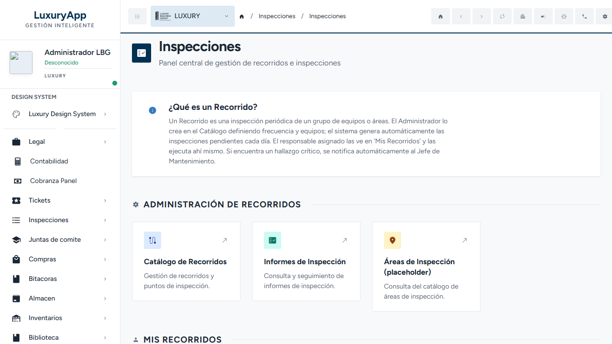
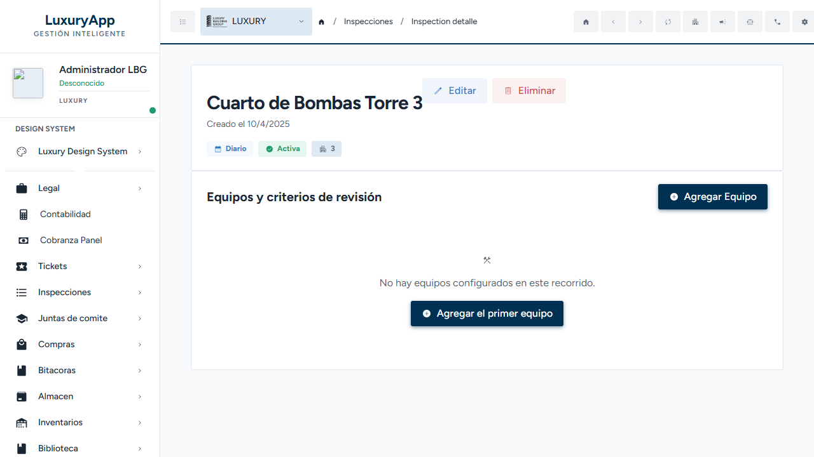
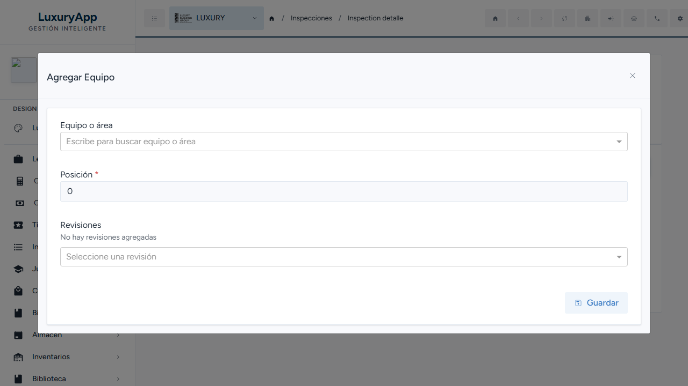
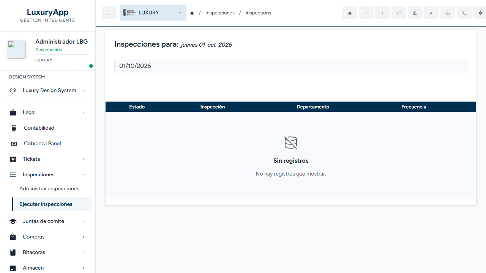
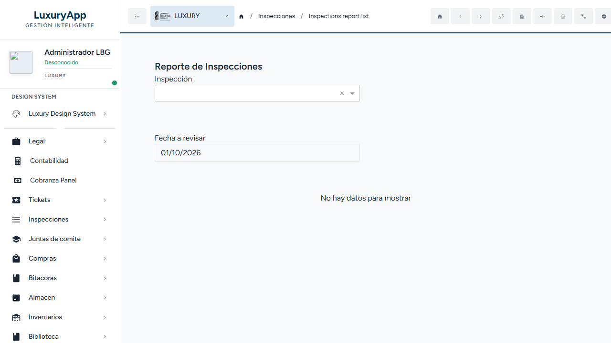
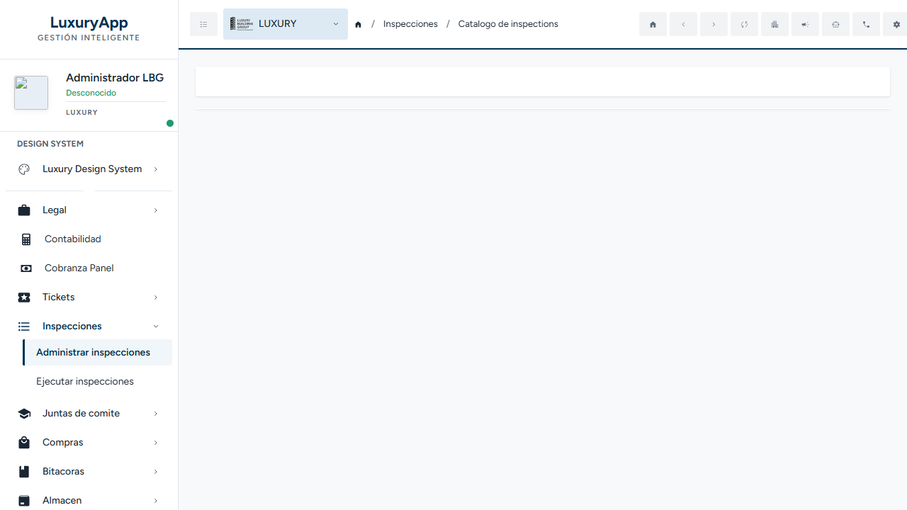

# Guía de Usuario — Inspecciones / Recorridos

> **Módulo:** `maintenance.luxuryapp` → submódulo **Inspecciones (Recorridos)**
> **Público:** usuarios de negocio, soporte y capacitación (no desarrolladores)
> **Última actualización:** 2026-10-01
> **Cómo se generó:** lectura del código real (backend `OperationsLuxuryApp/Inspections` y frontend `maintenance.luxuryapp/inspection`) + exploración de la interfaz real con un usuario administrador. Todo lo que no pudo verificarse se marca `PENDIENTE: confirmar con el equipo`.

---

## 1. Resumen

El módulo de **Inspecciones** permite administrar los **Recorridos** de revisión de un residencial: definir qué equipos o áreas se revisan, con qué **criterios**, cada cuánto tiempo y quién es el responsable. El sistema genera automáticamente las inspecciones pendientes del día, el responsable las ejecuta desde el celular o la computadora, y el resultado queda disponible como reporte (con evidencia fotográfica) y en un aviso automático cuando aparece un hallazgo crítico.

En la pantalla de inicio del módulo la propia aplicación lo describe así (texto real del panel):

> **¿Qué es un Recorrido?**
> Un Recorrido es una inspección periódica de un grupo de equipos o áreas. El Administrador lo crea en el Catálogo definiendo frecuencia y equipos; el sistema genera automáticamente las inspecciones pendientes cada día. El responsable asignado las ve en 'Mis Recorridos' y las ejecuta ahí mismo. Si encuentra un hallazgo crítico, se notifica automáticamente al Jefe de Mantenimiento.

---

## 2. Para qué sirve / qué problema resuelve

- **Estandariza** las revisiones: los criterios se toman de un catálogo común, así todos revisan lo mismo con las mismas palabras.
- **Programa** las revisiones por frecuencia (diaria, semanal o mensual) y genera solas las inspecciones de cada día.
- **Asigna responsabilidad**: cada recorrido tiene responsables y uno principal que recibe la tarea.
- **Deja evidencia**: cada punto revisado puede marcarse como “Bien” o “Mal”, con observaciones y fotografías.
- **Escala los hallazgos críticos**: al finalizar una inspección con hallazgos críticos se envía aviso a Jefe de Mantenimiento y Administrador.
- **Produce reportes** consultables y descargables en PDF.

---

## 3. Usuarios objetivo (roles de negocio)

| Rol de negocio | Qué hace en el módulo |
|---|---|
| **Administrador** | Crea y edita los Recorridos en el Catálogo, configura equipos y criterios, y consulta informes. Recibe avisos de hallazgos críticos. |
| **Jefe de Mantenimiento** | Recibe los avisos de hallazgos críticos (correo y notificación push) para dar seguimiento. |
| **Responsable del recorrido** | Ve en “Mis Recorridos” las inspecciones que le tocan y las ejecuta (Bien/Mal, observaciones y fotos). |

> **Nota de permisos:** los servicios del módulo exigen **sesión iniciada** (autorización general). No se observó en el código una restricción por rol específico distinta de la autorización general. `PENDIENTE: confirmar con el equipo` si algún rol debe quedar excluido del Catálogo.

---

## 4. Conceptos clave (glosario)

| Término | Significado |
|---|---|
| **Recorrido** (o “inspección”, en la definición) | La plantilla: qué se revisa, con qué criterios, con qué frecuencia y quién es responsable. Se administra en el **Catálogo de Recorridos**. |
| **Inspección / Ejecución** | El llenado real de un Recorrido en una fecha. Es lo que el responsable ve en “Mis Recorridos” y marca como realizada. |
| **Equipo o área** | El activo que se revisa dentro de un Recorrido (por ejemplo, un equipo de bombeo o un área común). |
| **Criterio de revisión** | El punto concreto que se evalúa en un equipo (por ejemplo “NIVEL DE ACEITE”, “REVISIÓN DE FUGAS”). Se eligen de un catálogo común. |
| **Frecuencia / Recurrencia** | Cada cuánto debe hacerse el recorrido: **Diaria**, **Semanal** (con días de la semana) o **Mensual** (con día del mes). |
| **Responsable primario** | La persona a la que se asigna la inspección generada. |
| **Hallazgo crítico** | Un punto marcado como crítico; al finalizar la inspección dispara un aviso a Jefe de Mantenimiento y Administrador. |
| **Reporte de Inspección** | La vista del resultado de una ejecución, con observaciones y fotos; se puede descargar en PDF. |

---

## 5. Flujo principal (narrado)

1. **El Administrador entra al módulo** (“Inspecciones” en el menú lateral) y abre **Administrar inspecciones** o **Catálogo de Recorridos**.
2. **Crea un Recorrido** con “Nuevo Recorrido”: nombre, **frecuencia** y estado (Activa / Inactiva). Si es semanal elige los días; si es mensual, el día del mes.
3. **Abre el detalle del Recorrido** y agrega equipos con **“Agregar Equipo”**, seleccionando el equipo o área, su **posición** y una o más **revisiones** (criterios del catálogo).
4. **El sistema programa las inspecciones**: cada día revisa qué Recorridos activos corresponden a la fecha según su recurrencia y crea una **inspección pendiente** por cada uno (una sola vez por día), asignándola al responsable primario.
5. **El responsable entra a “Mis Recorridos”**, elige la fecha y ve la lista (“Realizada” / “Pendiente”). Con el botón **Inspeccionar** abre la inspección.
6. **Ejecuta**: en cada criterio marca **Bien/Mal**, escribe **Observaciones** y puede **Agregar fotos**. Los cambios se guardan por punto.
7. **Finaliza la inspección** con el botón **Finalizar Inspección**, que guarda los resultados y deja la inspección marcada como **Realizada**.
8. **Cierre y aviso**: el cierre formal de la ejecución (estado “Completada”) y el envío del aviso por **hallazgo crítico** (correo/push/notificación a Jefe de Mantenimiento y Administrador, **una sola vez** por ejecución) existen en el sistema; `PENDIENTE: confirmar con el equipo` si la pantalla actual los dispara al pulsar “Finalizar Inspección” o si se ejecuta por otra vía.
9. **Consulta del resultado**: desde “Mis Recorridos” (botón “Ver resultado”) o desde **Informes de Inspección** se ve el reporte y se puede **Descargar PDF**.

### Diagrama

Diagrama de flujo generado con la herramienta **Archify** a partir del código real (cada paso cita archivo y línea en la tarjeta “Fuentes del código”):

- **Archivo:** [`recorridos-workflow.html`](recorridos-workflow.html)
- **Tipo:** workflow (ciclo de vida del Recorrido: Administración → Programación → Ejecución → Seguimiento).
- **Validación:** pasar los cuatro sellos automáticos de Archify (validación, entrega, verificación estricta y verificación en navegador real). No se realizó revisión visual perceptual manual; Archify sugirió revisar dos relaciones con desvíos (`finalizar → reporte` y `vincular_activo → recurrencia`), sin cruces detectados.

---

## 6. Casos de uso reales

1. **Alta de un recorrido diario de bombas.** El Administrador crea “Cuarto de Bombas” con frecuencia **Diaria**, lo deja **Activa** y le agrega el equipo con criterios como “BOMBAS- SUCCION Y DESCARGA DE AGUA”. Desde el día siguiente aparece todos los días en “Mis Recorridos”.
2. **Recorrido semanal de áreas comunes.** Frecuencia **Semanal** seleccionando, por ejemplo, lunes y jueves; el sistema solo lo genera esos días.
3. **Recorrido mensual.** Frecuencia **Mensual** con día del mes (1–31); para meses más cortos se ajusta al último día disponible. *(El ajuste a fin de mes se verificó en el cálculo de recurrencia del código; `PENDIENTE: confirmar con el equipo` si el negocio espera otro comportamiento.)*
4. **Ejecución con evidencia.** El responsable recorre, marca “Actividad” como **Bien** o **Mal**, escribe observaciones y adjunta fotos; al finalizar, el reporte queda con la evidencia.

---

## 7. Paso a paso con capturas reales

### 7.1 Entrar al módulo
En el menú lateral, grupo **Inspecciones** (aparece entre “Tickets” y “Juntas de comite”), use **Administrar inspecciones** (Catálogo) o **Ejecutar inspecciones** (Mis Recorridos). El panel central muestra los accesos descritos en el Resumen (ver captura de la sección 1).

### 7.2 Ver el detalle y los equipos de un Recorrido
Al abrir un Recorrido se muestra su nombre, la fecha de creación y etiquetas de **frecuencia**, **estado** y **departamento**, más la sección **“Equipos y criterios de revisión”** con el botón **“Agregar Equipo”**.

En la captura se ve el recorrido real **“Cuarto de Bombas Torre 3”**, con etiquetas **Diario**, **Activa** y **“3”** (ver Limitaciones: el departamento se muestra como número).

### 7.3 Agregar un Equipo (flujo verificado en pantalla)
El botón **“Agregar Equipo”** abre la ventana **“Agregar Equipo”** con estos campos reales:

- **Equipo o área** — autocompletado “Escribe para buscar equipo o área”.
- **Posición** — obligatorio.
- **Revisiones** — lista de criterios; mientras no haya ninguno dice “No hay revisiones agregadas”. Se elige con el selector “Seleccione una revisión”.
- Botón **Guardar** (permanece deshabilitado hasta llenar los campos y agregar al menos una revisión).

> **Nota de verificación:** se abrió la ventana, se seleccionó un equipo (“Lobby Principal”), una posición y un criterio (“AC - CONFIRMAR FUNCIONAMIENTO DE VENTILADORES Y MOTORES”). **No se completó el guardado** porque la página se recargó (servidor de desarrollo) antes de enviar. **No se dejó ningún dato de prueba.** `PENDIENTE: confirmar con el equipo` el mensaje exacto de éxito al guardar un equipo.

### 7.4 Mis Recorridos (lista del día)
La pantalla **“Mis Recorridos”** muestra el encabezado “Inspecciones para: [fecha]” con un selector de fecha, y una tabla con columnas **Estado**, **Inspección**, **Departamento** y **Frecuencia**. El estado se muestra como **“Realizada”** (con palomita) o **“Pendiente”** (con tache). Cada fila ofrece **Inspeccionar** y, si ya está realizada, **Ver resultado**.

En la cuenta explorada la lista salió **“Sin registros — No hay registros que mostrar”** para la fecha mostrada.

### 7.5 Ejecutar la inspección (pantalla descrita desde el código)
La pantalla **“Ejecutar Inspección”** agrupa los criterios por equipo/área. Por cada criterio hay:
- un **interruptor** que muestra **“Bien”** o **“Mal”**,
- un campo de **Observaciones** (“Observaciones…” / “Añade observaciones si es necesario…”),
- la lista de **fotos** ya cargadas y un botón **“Agregar fotos”**,
- al pie, el botón **“Finalizar Inspección”** (guarda los resultados y marca la inspección como Realizada).

> **No se pudo capturar esta pantalla en la interfaz real** porque la cuenta explorada no tenía recorridos asignados para la fecha. `PENDIENTE: confirmar con el equipo` una captura de esta pantalla y el texto de confirmación al finalizar. También queda por confirmar si este botón dispara el cierre formal y el aviso de hallazgo crítico (ver Limitaciones).

### 7.6 Informes de Inspección (reportes)
La pantalla **“Reporte de Inspecciones”** permite elegir una **Inspección** y una **Fecha a revisar**; cuando hay datos se habilita **“Descargar PDF”**. El reporte muestra Nombre, Departamento, Frecuencia, “Realizado por”, y por cada criterio su estado (palomita / alerta), observaciones y **Reporte Fotográfico** con las imágenes.

---

## 8. Permisos necesarios (lenguaje de negocio)

- **Sesión iniciada** en la aplicación (autorización general del módulo).
- Para **crear/editar Recorridos y equipos**: perfil con acceso al menú **Inspecciones** (la pantalla de prueba era del usuario `admin`).
- Para **recibir el aviso de hallazgo crítico**: ser **Jefe de Mantenimiento** o **Administrador** del cliente.
- El **Catálogo** y **Mis Recorridos** trabajan con el **cliente (edificio) activo** del usuario: cada cliente ve sus propios recorridos y equipos.

> `PENDIENTE: confirmar con el equipo` la matriz exacta de roles permitidos por acción (quién puede eliminar un equipo con historial, quién reasigna, etc.).

---

## 9. Estados posibles

### 9.1 Lo que el usuario ve en “Mis Recorridos”
| Estado visible | Significado |
|---|---|
| **Pendiente** | La inspección fue generada pero aún no se ha ejecutado. |
| **Realizada** | La inspección ya se ejecutó y tiene resultado. |

### 9.2 Ciclo de vida interno de una ejecución
| Estado (interno) | Nombre visible en el sistema | Significado |
|---|---|---|
| NotStarted | — | Creada, aún no iniciada. |
| InProgress | — | En progreso. |
| Completed | — | Completada y cerrada. |
| Reopened | — | Reabierta. |
| Overdue (5) | **Vencida** | Fuera de tiempo. |

> Solo **“Vencida”** tiene nombre en español definido. `PENDIENTE: confirmar con el equipo` si los demás estados deben mostrarse con un nombre en español en la interfaz de negocio.

### 9.3 Estado del Recorrido (definición)
| Estado | Significado |
|---|---|
| **Activa** | Participa en la generación de inspecciones. |
| **Inactiva** | Deja de generar inspecciones programadas. |

---

## 10. Errores comunes y qué hacer

| Mensaje | Cuándo aparece | Qué hacer |
|---|---|---|
| “Debe seleccionar al menos un día para frecuencia semanal.” | Al guardar un Recorrido semanal sin días. | Seleccione al menos un día de la semana. |
| “Debe seleccionar un día válido para frecuencia mensual.” | Al guardar un Recorrido mensual sin día (1–31). | Indique el día del mes. |
| “Debe incluir al menos un criterio de revisión.” | Al guardar un Equipo sin criterios. | Agregue al menos una revisión. |
| “El equipo no pertenece al cliente del recorrido.” | Al vincular un equipo de otro cliente. | Use equipos del mismo cliente/edificio del recorrido. |
| “No se puede eliminar la configuración porque existen inspecciones ejecutadas históricamente. Contacte a soporte para inactivar el registro.” | Al intentar borrar un equipo con historial. | No se elimina; se inactiva o se solicita a soporte. |
| “El estado de la inspección fue modificado simultáneamente por otro usuario. Recargue los datos.” | Al finalizar una inspección que otro usuario cambió a la vez. | Recargue y vuelva a finalizar. |
| “Solo se puede reasignar una ejecución no iniciada o en progreso.” | Al reasignar una inspección ya cerrada. | La reasignación no aplica a inspecciones terminadas. |
| “No se pueden obtener inspecciones antes del 10 de enero de 2025.” | Al consultar “Mis Recorridos” con una fecha muy antigua. | Elija una fecha posterior a esa. |
| “No se pueden generar inspecciones para fechas mayores a 15 días desde la fecha actual.” | Al consultar una fecha muy futura. | Elija una fecha dentro de los próximos 15 días. |

---

## 11. Preguntas frecuentes

**¿Cada cuánto se generan las inspecciones?**
Según la frecuencia del Recorrido: todas las fechas para **Diario**, los días elegidos para **Semanal**, y el día del mes para **Mensual**. Se genera una sola por Recorrido por día.

**¿Por qué no veo una inspección en “Mis Recorridos”?**
Posibles causas: el Recorrido está **Inactivo**, la fecha no corresponde a su frecuencia (o cae fuera del rango permitido), o la inspección está asignada a **otro responsable**. `PENDIENTE: confirmar con el equipo` si un usuario ve las inspecciones de otros o solo las propias.

**¿Puedo borrar un equipo que ya tiene historial?**
No. Si ya existen inspecciones ejecutadas, el sistema lo impide y pide contactar a soporte.

**¿Cómo llega el aviso de un hallazgo crítico?**
El sistema lo envía por correo y notificación, a **Jefe de Mantenimiento** y **Administrador**, una sola vez por ejecución. `PENDIENTE: confirmar con el equipo` en qué momento exacto se dispara desde la pantalla actual (ver Limitaciones).

**¿Puedo sacar un reporte en PDF?**
Sí, desde el reporte de la inspección con el botón **“Descargar PDF”**.

**¿Qué es un “criterio de revisión”?**
Cada punto que se evalúa en un equipo (por ejemplo “NIVEL DE ACEITE”). Proviene de un catálogo común para mantener consistencia.

---

## 12. Limitaciones conocidas

1. **El Catálogo de Recorridos no mostró contenido en la cuenta explorada.** Al abrir “Catálogo de Recorridos” la pantalla quedó en blanco (ver captura), mientras la API de listado respondió correctamente. La cuenta administradora usada pertenece a un cliente distinto al del recorrido real de ejemplo, por lo que es posible que simplemente no tuviera recorridos propios; también podría ser un comportamiento a corregir. `PENDIENTE: confirmar con el equipo`.

   

2. **El departamento se muestra como número.** En el detalle, la etiqueta de departamento mostró **“3”** en lugar de un nombre (p. ej. “Mantenimiento”). `PENDIENTE: confirmar con el equipo`.

3. **La lista de equipos del modal “Agregar Equipo” corresponde al cliente activo del usuario.** Si el recorrido pertenece a otro cliente, no se pueden vincular equipos (el backend los rechaza). `PENDIENTE: confirmar con el equipo` si el catálogo de equipos debería tomarse del cliente del recorrido.

4. **No se observó un control en la interfaz para marcar un criterio como “crítico”.** El sistema soporta hallazgos críticos y su aviso, pero en la pantalla de ejecución solo se vieron estado (Bien/Mal), observaciones y fotos. `PENDIENTE: confirmar con el equipo` cómo marca el inspector un hallazgo como crítico.

5. **Pantalla “Ejecutar Inspección” no capturada.** No había recorridos asignados al usuario de prueba para la fecha; se describe desde el código. `PENDIENTE: confirmar con el equipo`.

6. **“Áreas de Inspección” está marcado como “(placeholder)”** en el propio panel; su pantalla aún no es funcional.

7. **Diferencia entre “Finalizar” en la pantalla y el cierre formal del sistema.** La pantalla de ejecución envía los resultados al guardar/finalizar (y deja la inspección como Realizada), pero el cierre formal (estado “Completada”) y el aviso de hallazgos críticos pertenecen a una operación separada del sistema. `PENDIENTE: confirmar con el equipo` si la pantalla debe iniciar ese cierre o si alguna otra parte lo hace.

---

## 13. Archivos relevantes para desarrolladores

Esta guía no duplica el contenido técnico. Para desarrollo, consulte:

- **README del módulo (Nivel 1)** — [`api/LuxuryApp.Application/Modules/OperationsLuxuryApp/Inspections/README.md`](../../../../../../../../api/LuxuryApp.Application/Modules/OperationsLuxuryApp/Inspections/README.md)
- **Servicio activo** — `api/LuxuryApp.Application/Modules/OperationsLuxuryApp/Inspections/Services/InspectionAppService.cs`
  (los nombres parecidos en `MaintenanceLuxuryApp/EquipmentInspections` y `MaintenanceLuxuryApp/FireInspectionPeriods` **no** son el backend de esta pantalla).
- **Frontend del submódulo** — `appsweb/angular/src/app/modules/maintenance.luxuryapp/inspection/`
- **Auditorías y planes previos** — `docs/MaintenanceLuxuryApp/Inspections/` (análisis de flujo, auditoría de UI, auditoría de código muerto, planes de remediación).
- **Documentación técnica relacionada** — `api/LuxuryApp.Application/Modules/OperationsLuxuryApp/Docs/`.

> Los documentos **Operativo, Setup y Decisiones** del frontend (los otros 3 de los 6 obligatorios de módulo) aún **no existen** para este submódulo; se crearán al completar la documentación de `maintenance.luxuryapp/inspection/docs/`.
