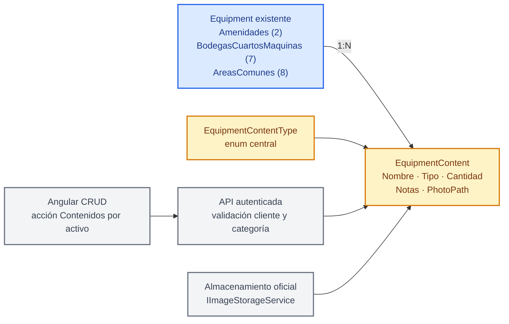

# 🧺 Plan: Contenidos de activos
### 🔀 Amenidades y áreas compartidas organizan sus artículos sin alterar inventarios actuales

## 2. 📋 Metadata

| Campo | Valor |
|---|---|
| Módulo backend | `MaintenanceLuxuryApp/Machinery/EquipmentContents` |
| Módulo frontend | `maintenance.luxuryapp/machinery/equipment-content` |
| Tipo | B — Ampliación de módulo existente |
| Origen | Requerimiento directo del dueño del módulo, confirmado en discovery |
| Datos reales | Los `Equipment` de categoría `Mobiliarios` existen y permanecerán intactos. Conteos por categoría aún no consultados; no se migran datos en este plan. |
| Documento relacionado | `docs/MaintenanceLuxuryApp/Machinery/20260926-plan-maintenance-machinery.md` (iniciativa distinta: activos contra incendio) |
| Estado | Borrador para revisión; no autoriza implementación |
| Fecha | 2026-10-02 |

## 3. 🗺️ Panorama en un vistazo

> 🔵 Azul = entidad existente sin cambio de datos · 🟠 Ámbar = capacidad nueva · ⚪ Gris = UI/API/almacenamiento

`Equipment` seguirá siendo propietario del contenido; `EquipmentContent` tendrá su propia identidad, cantidad e imagen representativa. Inventario actual de Mobiliarios no se modifica ni migra.

## FASE 0 — Pre-planeación

### 0.1 Problema y métricas

El equipo necesita separar la ficha de una amenidad/espacio de los grupos de objetos que contiene, sin tocar los registros de mobiliario independientes que ya están guardados en `Equipment`.

KPIs de aceptación: ver tabla ejecutiva. No se establecen fechas; los hitos son gates técnicos verificables.

### 0.2 Reglas de negocio

**Nivel 1 — Invariantes de dominio**

| RN | Regla |
|---|---|
| RN-ECO-001 | Cada contenido pertenece a exactamente un `Equipment` padre existente. |
| RN-ECO-002 | La iniciativa no altera registros existentes de `Equipment` categoría `Mobiliarios`. |
| RN-ECO-003 | Un `EquipmentContent` representa un grupo de artículos equivalentes; `Quantity` almacena su cantidad total. |

**Nivel 2 — Flujo y estados**

| RN | Regla |
|---|---|
| RN-ECO-010 | El contenido se crea, consulta, actualiza y elimina desde el contexto de su padre. |
| RN-ECO-011 | El padre no se elimina si tiene contenidos; la FK restringe borrado accidental. |
| RN-ECO-012 | Imagen ausente al editar conserva imagen existente; reemplazo o eliminación explícita se ejecuta de forma segura. |

**Nivel 3 — Seguridad y autorización**

| RN | Regla | Roles / control |
|---|---|---|
| RN-ECO-020 | CRUD requiere autenticación y conserva permisos actuales de gestión de `Equipment`. | Igual que Machinery actual |
| RN-ECO-021 | Usuario solo puede operar contenidos cuyo padre pertenece al cliente activo. | Validación de tenant en cada operación |

**Nivel 4 — Validación de datos**

| RN | Regla |
|---|---|
| RN-ECO-030 | Solo `Amenidades`, `BodegasCuartosMaquinas` y `AreasComunes` pueden ser padres. |
| RN-ECO-031 | `Name` es requerido; `Quantity` es entero mayor que cero; `Type` debe ser valor válido del enum. |
| RN-ECO-032 | Foto opcional; se almacena solo nombre relativo en BD y API expone URL segura. |
| RN-ECO-033 | `Notes` opcional; foto debe cumplir validación oficial de imágenes. |

### 0.3 Pre-mortem y flujos

| Supuesto fallido | Impacto | Probabilidad | Mitigación | Owner |
|---|---|:---:|---|---|
| 🔴 API acepta padre de otro cliente o categoría no permitida | Exposición/modificación de datos o contenido mal asociado | Media | Resolver padre con cliente activo y categoría permitida; pruebas negativas por ruta CRUD | Backend |
| Error al guardar BD deja archivo de imagen huérfano o se borra imagen anterior antes del commit | Archivo huérfano o pérdida de foto | Media | Estrategia compensatoria; borrar reemplazo anterior solo tras guardar correctamente | Backend |
| Borrado de amenidad elimina contenidos inesperadamente | Pérdida de inventario de contenido | Baja | FK `Restrict` y mensaje claro; prueba de borrado de padre | Backend |
| Select enum no aparece por faltar ruta central | Formulario no puede asignar tipo | Media | Agregar mapeo explícito al hub central y probar flujo Angular | Backend + frontend |

**Happy path:** usuario autorizado abre contenidos de amenidad, crea grupo con tipo, cantidad, notas e imagen; registro reaparece en lista con foto segura.

**Sad path:** usuario intenta crear contenido bajo cliente ajeno o categoría prohibida; API rechaza y no crea fila ni archivo huérfano.

**Edge path:** padre tiene contenidos y se intenta eliminar; operación se rechaza sin borrar padre ni contenidos.

## 4. 📌 Resumen Ejecutivo

### Problem Statement

Actualmente, el personal que administra amenidades sufre de no tener un inventario estructurado de los artículos que contiene cada espacio cuando intenta organizar salones, áreas comunes, bodegas o espacios de amenidad; esto mezcla la ficha del espacio con los artículos que se encuentran dentro y dificulta controlar cantidades e imágenes.

Esto afecta a la administración de amenidades, bodegas y áreas comunes. El alcance no incluye convertir los registros existentes de `Equipment` categoría `Mobiliarios`.

### KPIs

| Métrica | Baseline | Target | Timeline | Verificación |
|---|---|---|---|---|
| Operaciones CRUD para contenidos | 0 endpoints de `EquipmentContent` en código | 5 operaciones disponibles y probadas: listado por padre, detalle, alta, edición y baja | Gate API | Pruebas de servicio/endpoints y contrato Angular |
| Categorías permitidas como padre | 0 reglas de `EquipmentContent` | Solo categorías 2, 7 y 8 aceptadas; otras rechazadas | Gate API | Pruebas positivas y negativas por categoría |
| Filas de `Equipment` Mobiliarios modificadas por esta iniciativa | Sin baseline de ejecución; se medirá antes de pruebas integradas | 0 | Cada gate de datos | Comparación de IDs y valores antes/después; no ejecutar migración de mobiliario |
| Accesos entre clientes | Feature aún no existe | 0 contenidos de otro cliente visibles o modificables | Gate seguridad | Pruebas cruzadas con dos clientes |

### Objetivo

Crear CRUD de contenidos ligados a un `Equipment` padre en las tres categorías aprobadas, con cantidad, notas y foto opcional; mantener permisos actuales del inventario de equipos; dejar mobiliarios existentes sin cambios.

## 5. 🗺️ Alcance

| Componente | Cambio | Esfuerzo | Status |
|---|---|:---:|---|
| Backend: entidad `EquipmentContent` | Tabla, FK, validaciones, `DbSet` e índice por padre | M | 🟡 |
| Backend: enum `EquipmentContentType` | Ocho tipos iniciales con `DisplayName` español y ruta central de select | S | 🟡 |
| Backend: API `EquipmentContents` | DTOs tipados, interfaz, servicio, endpoints y permisos existentes | M | 🟡 |
| Backend: imagen | Persistencia oficial y URL segura con `PhotoPath` opcional | M | 🟡 |
| Frontend: feature `equipment-content` | Listado y formulario responsive; entrada desde activo elegible | M | 🟡 |
| Persistencia | Migración aditiva que crea tabla/relación; sin backfill | S | 🟡 |
| Datos existentes de `Equipment` categoría `Mobiliarios` | Sin cambio; no se convierten registros | S | 🟢 |

**Leyenda:** S=Small, M=Medium, L=Large; tamaños relativos, sin calendario asignado.

**Dentro de alcance:**
- CRUD de contenido agrupado: una fila puede representar varias piezas equivalentes.
- Padres permitidos: `Amenidades=2`, `BodegasCuartosMaquinas=7`, `AreasComunes=8`.
- Enum de tipo inicial aprobado: Mobiliario, Audio y video, Cocina y servicio, Utensilios, Decoración, Gimnasio y ejercicio, Juegos y entretenimiento, Otros.
- Imagen opcional por fila de contenido.
- Acción de UI para administrar contenidos desde un activo elegible.
- Seguridad por cliente y validación de categoría padre en servidor.

**Fuera de alcance (confirmado):**
- Modificar `Equipment`, `InventoryCategory` o los datos existentes de `Mobiliarios`.
- Elegir, asociar o migrar registros antiguos de mobiliario a amenidades.
- Crear CRUD administrativo para tipos; el tipo se manejará con enum y hub central de enums.
- Contenidos sin padre, decimalidad en cantidades, seguimiento individual/serie por pieza, reportes y reservas de amenidades.
- Cambiar permisos de gestión de `Equipment` o diseñar RBAC separado.

## 6. 🏛️ Arquitectura y diseño técnico

### Entidades y estructura propuesta

| Pieza | Representación de negocio | Ubicación candidata |
|---|---|---|
| `Equipment` | Amenidad, bodega/cuarto de máquinas o área común que contiene bienes; permanece sin cambios | `Infrastructure/Data/Entities/MaintenanceLuxuryApp/Machinery/Equipment.cs` |
| `EquipmentContent` | Grupo de artículos dentro de un padre; cantidad, tipo, notas e imagen | `Infrastructure/Data/Entities/MaintenanceLuxuryApp/Machinery/EquipmentContent.cs` |
| `EquipmentContentType` | Clasificación fija para contenidos residenciales | `Shared/Enums/EquipmentContentType.cs` |

La relación se configura desde `EquipmentContent` hacia `Equipment` mediante FK requerida y `WithMany()` sin colección nueva en `Equipment`. El `DbSet` será `EquipmentContents`; índice por `EquipmentId`; borrado del padre restringido. No se duplica `CustomerId`: se verifica por la relación con el padre y el cliente activo.

**Campos propuestos:** `Id`, `EquipmentId`, `Name`, `Type`, `Quantity`, `Notes`, `PhotoPath`. `PhotoPath` guarda nombre relativo del archivo, nunca ruta física.

**Valores del enum aprobados por el dueño; nombres de código y valores numéricos deben permanecer estables:**

| Valor de negocio | Miembro de enum propuesto | DisplayName |
|---|---|---|
| Mobiliario | `Furniture` | Mobiliario |
| Audio y video | `AudioVideo` | Audio y video |
| Cocina y servicio | `KitchenService` | Cocina y servicio |
| Utensilios | `Utensils` | Utensilios |
| Decoración | `Decoration` | Decoración |
| Gimnasio y ejercicio | `FitnessExercise` | Gimnasio y ejercicio |
| Juegos y entretenimiento | `GamesEntertainment` | Juegos y entretenimiento |
| Otros | `Other` | Otros |

**API:** submódulo `Modules/MaintenanceLuxuryApp/Machinery/EquipmentContents/` con `DTOs/`, `Interfaces/`, `Services/`, `EndPoints/`. Operaciones: listar por padre, consultar detalle, crear, editar, borrar. Rutas públicas en kebab-case; DTOs tipados, uno por archivo. Alta/edición con imagen usa `[FromForm]` y `.DisableAntiforgery()` según convención; consultas manuales con `.Select()`.

| Operación | Ruta propuesta | Contrato principal |
|---|---|---|
| Listar por padre | `GET /api/equipment-contents/by-equipment/{equipmentId}` | `EquipmentContentListItemDTO[]` |
| Consultar detalle | `GET /api/equipment-contents/{id}` | `EquipmentContentResponseDTO` |
| Crear | `POST /api/equipment-contents` | `CreateEquipmentContentDTO` multipart |
| Actualizar | `PUT /api/equipment-contents/{id}` | `UpdateEquipmentContentDTO` multipart |
| Eliminar | `DELETE /api/equipment-contents/{id}` | Resultado tipado de eliminación |

DTOs se mantienen en archivos individuales. `CreateEquipmentContentDTO` recibe padre, nombre, enum, cantidad, notas e imagen opcional. `UpdateEquipmentContentDTO` separa conservar imagen (sin archivo), reemplazar imagen (archivo) y eliminarla (indicador explícito). La respuesta contiene `PhotoUrl` segura, nunca ruta física.

**Imagen:** reutilizar `IImageStorageService`, `IFileWritePathService.MachineryDirectory(parent.CustomerId)` e `IFileReadPathService.GetMachineryFilePath(...)`. Guardar en BD solo el nombre y devolver URL segura. La operación de reemplazo conserva archivo anterior hasta confirmar persistencia.

**Frontend:** feature `maintenance.luxuryapp/machinery/equipment-content/`; lista filtrada por `EquipmentId`, formulario CRUD y acción desde el listado de equipos para categorías 2, 7 y 8. Reusar `ApiResponseService`, `InputImg`, servicios de diálogo y enum select. `EquipmentContentType` usa el endpoint central `equipment-content-type`; cualquier extensión de servicios/hub shared se limita a este enum y se revisa por su impacto transversal.

### Glosario

| Término | Código | Significado |
|---|---|---|
| 🏗️ Activo padre | `Equipment` | Espacio o instalación principal existente. |
| 🧺 Contenido | `EquipmentContent` | Grupo de objetos dentro del activo padre. |
| 📋 Tipo | `EquipmentContentType` | Familia controlada del contenido. |
| 🔢 Cantidad | `Quantity` | Número de artículos equivalentes representados por una fila. |
| 📷 Imagen | `PhotoPath` | Referencia relativa a imagen representativa. |

### Decisiones de Diseño (ADR mini)

| Decisión | Alternativa rechazada | Razón |
|---|---|---|
| Crear entidad hija `EquipmentContent` | Agregar columnas repetidas a `Equipment` | Un padre tiene cero o muchos contenidos y cada contenido tiene cantidad, tipo e imagen propias. |
| Enum central con valores estables | Texto libre o CRUD de catálogo por cliente | El dueño aprobó lista fija común para amenidades residenciales. |
| FK desde contenido sin colección en `Equipment` | Alterar modelo/campos de `Equipment` | Mantener entidad y datos de `Equipment` intactos en esta etapa. |
| Cantidad agrupada entera | Un registro por artículo individual | Bienes repetidos se gestionan como grupos; no se requiere serie/estado individual en esta etapa. |
| FK restrictiva al borrar padre | Cascada automática | Evita perder contenidos por eliminación accidental del activo padre. |

### Migración de Datos y Prevención de Pérdida

**Responsable de ejecutar migración:** Tech Lead. **Cambio de datos históricos:** no aplica; el plan no mueve ni actualiza filas existentes.

| Tabla | Cambio | Riesgo | Mitigación |
|---|---|---|---|
| `EquipmentContents` | Crear tabla nueva, FK requerida a `Equipment`, índice por `EquipmentId` | Bajo antes de uso; alto si se elimina después de capturar contenido | Backup según proceso normal; validar migración reversible en desarrollo; después de uso, rollback de app conserva tabla/datos |
| `Equipment` | Ninguno | Riesgo de regresión por snapshot/migración | Revisar SQL generado: cero `UPDATE`, `DELETE`, `DROP` o cambios de columna de `Equipment` |
| Enum `EquipmentContentType` | Valores compilados a enteros | Cambio/reordenamiento futuro puede reclasificar registros | Asignar números explícitos; nunca renumerar/reutilizar valores publicados |

**Validación antes de despliegue:** backup según política vigente; comprobar tabla y FK; comparar conteos e IDs de `Equipment` antes/después; confirmar cero filas de contenidos creadas automáticamente.

**Rollback:** redeploy de versión anterior no elimina datos nuevos. No ejecutar `Down()` que retire `EquipmentContents` una vez que existan filas sin exportación/respaldo y aprobación del Tech Lead. En desarrollo vacío, revertir migración EF y confirmar que `Equipment` no cambió.

## 7. 🛤️ Fases y backlog

### Fase 1 — Modelo y migración aditiva

| Atributo | Valor |
|---|---|
| Owner | Backend |
| Esfuerzo estimado | M |
| Dependencias previas | Aprobación de este plan |
| Criterio de éxito | Tabla nueva y FK creadas; datos de `Equipment` intactos |

Crear enum, entidad, `DbSet`, configuración y migración EF de nueva tabla/FK/índice. No incluir DML de mobiliario ni modificar `Equipment`.

**Checklist:**
- [ ] Entity y DbSet siguen naming conventions.
- [ ] FK apunta a `Equipment` con `Restrict`.
- [ ] Índice cubre consultas por `EquipmentId`.
- [ ] Migración crea tabla; no cambia filas existentes.
- [ ] Enum y DisplayNames coinciden con lista aprobada.

### Fase 2 — CRUD y seguridad API

| Atributo | Valor |
|---|---|
| Owner | Backend |
| Esfuerzo estimado | M |
| Dependencias previas | Fase 1 |
| Criterio de éxito | CRUD completo con tenant/categoría validados |

Crear DTOs, interfaz, servicio y endpoints; validar el cliente y la categoría del padre en cada operación. Agregar la ruta enum central, autorización existente y manejo seguro de imagen.

**Checklist:**
- [ ] GET lista contenidos de un padre autorizado.
- [ ] GET detalle no permite acceso cross-tenant.
- [ ] POST valida tipo, nombre, cantidad, padre y foto.
- [ ] PUT conserva o reemplaza imagen de forma segura.
- [ ] DELETE elimina registro y archivo tras commit.
- [ ] Bloquear alta bajo categoría distinta a 2, 7 u 8.
- [ ] Bloquear borrado de `Equipment` padre con contenidos.

### Fase 3 — CRUD Angular

| Atributo | Valor |
|---|---|
| Owner | Frontend |
| Esfuerzo estimado | M |
| Dependencias previas | Contratos API y enum central disponibles |
| Criterio de éxito | Usuario administra contenidos desde los tres tipos de activo padre |

Crear interfaz tipada, listado/formulario y acción contextual. Mantener estructura desktop/mobile del módulo y componentes compartidos existentes.

**Checklist:**
- [ ] Acción aparece solo en categorías elegibles.
- [ ] Lista siempre conserva contexto del padre.
- [ ] Formulario envía `FormData` sin fijar Content-Type.
- [ ] Imagen se muestra mediante URL segura.
- [ ] Alta, edición, reemplazo de imagen y baja actualizan UI.
- [ ] Pruebas Angular cubren errores API y formularios.

### Fase 4 — Validación integrada en desarrollo

| Atributo | Valor |
|---|---|
| Owner | Backend + frontend + Tech Lead |
| Esfuerzo estimado | S |
| Dependencias previas | Fases 1–3 |
| Criterio de éxito | Gates de CRUD, seguridad, datos y UI en verde |

Aplicar la migración en desarrollo y probar los tres tipos de padre. Esta fase no ejecuta conversión de Mobiliarios.

**Checklist:**
- [ ] Build backend y Angular pasan.
- [ ] Tests API validan reglas y acceso por cliente.
- [ ] Tests UI confirman CRUD en 2, 7 y 8.
- [ ] Conteo/IDs de `Equipment` Mobiliarios no cambia.
- [ ] Revisión de convenciones y encoding queda limpia.

## 8. 🚦 Criterios de Paso

**Happy path:** usuario autorizado abre un padre elegible, crea contenido con cantidad e imagen y lo ve en su lista.
**PASS si:** respuesta y UI contienen el mismo padre, cantidad, tipo y URL segura.
**Automatización:** pruebas xUnit de servicio/API + prueba Angular del flujo de alta.

**Sad path:** usuario intenta crear contenido bajo equipo de otro cliente o categoría no permitida.
**PASS si:** petición rechazada; no queda fila ni archivo persistido.
**Automatización:** pruebas xUnit de autorización/validación y verificación de estado de almacenamiento.

**Edge path:** contenido tiene imagen y se intenta borrar padre.
**PASS si:** borrado padre es rechazado y contenido/imagen permanecen íntegros.
**Automatización:** prueba de integración EF para FK restrictiva.

## 9. ⚠️ Riesgos y mitigaciones

| Supuesto fallido | Impacto | Probabilidad | Mitigación | Owner |
|---|---|:---:|---|---|
| 🔴 Query no aplica aislamiento por cliente | Acceso o cambio de datos ajenos | Media | Cargar padre por cliente activo en todo CRUD; tests cross-tenant obligatorios | Backend |
| Migración altera categoría/filas existentes por snapshot incorrecto | Daño a inventario actual | Baja | Revisar SQL generado; gate de cero DML y comparación de IDs de Mobiliarios | Backend + Tech Lead |
| Imagen queda desincronizada de BD | Archivos huérfanos o foto perdida | Media | Compensación y orden transaccional; pruebas de falla de almacenamiento/BD | Backend |
| Mapeo enum omitido en endpoint central | Formulario inutilizable | Media | Incluir ruta central en fase API y prueba de select | Backend + frontend |
| Padre se elimina con contenido asociado | Pérdida de datos hijos | Baja | FK `Restrict`; mostrar respuesta de conflicto y verificar UI | Backend + frontend |

## 10. 🔗 Dependencias e Impactos

| Sistema | Relación | Versión mínima | Impacto en este plan |
|---|---|---|---|
| `Equipment` / `InventoryCategory` | Depende de | Modelo actual | Solo se permiten categorías 2, 7 y 8; entidad y filas permanecen intactas |
| `ApplicationDbContext` / EF Core | Impacta | Configuración actual | Nuevo DbSet, relación e índice; migración aditiva |
| `SelectItemEnumEndPoints` | Impacta | Hub vigente | Ruta nueva para `EquipmentContentType`; no altera rutas/selects existentes |
| Angular `EnumSelectService` / endpoint constants | Impacta si falta método reutilizable | Servicios actuales | Conectar tipo enum y nuevo CRUD respetando contratos existentes |
| Almacenamiento de imágenes | Depende de | `IImageStorageService` + servicios de path | Reutiliza almacenamiento y URL segura de maquinaria |
| Menú/listado de Machinery | Impacta | UI actual | Agrega acción contextual solo para 2, 7 y 8 |
| Inventario de `Mobiliarios` existente | No impacta | Datos actuales | No se migran, editan ni eliminan registros |

## 11. 🏁 Cierre esperado

Los tres tipos de activos padre pueden administrar contenidos agrupados con tipo controlado, cantidad, notas e imagen opcional. La nueva tabla no modifica activos actuales ni migra `Mobiliarios`; cualquier conversión futura requerirá decisión y plan separados.

---

**Aprobación de implementación:** pendiente de aprobación integral del plan. La aprobación de la lista de enum quedó registrada; no autoriza aún escritura de código ni ejecución de migración.
