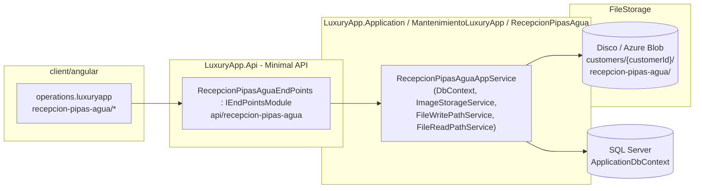
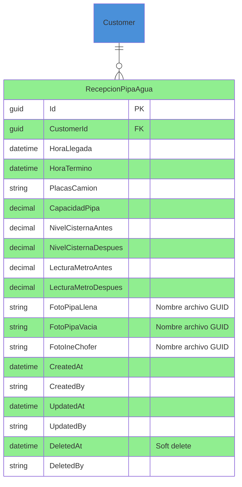

# Recepción de Pipas de Agua — Documentación Técnica

> **Ruta**: 📂 Documentación > 💼 Mantenimiento > 🚛 Recepción de Pipas de Agua
> **📅 Última Revisión**: 13-jul-26
> **🛡️ Estado**: ✅ Vigente
> **👤 Responsable**: @equipo-mantenimiento

---

## 📑 Tabla de Contenidos

1. [Resumen Ejecutivo](#-resumen-ejecutivo)
2. [Visión Funcional](#-visión-funcional)
3. [Arquitectura Técnica](#-arquitectura-técnica)
4. [API Endpoints](#-api-endpoints)
5. [Flujo del Sistema](#-flujo-del-sistema)
6. [Componentes Frontend](#-componentes-frontend)
7. [Reglas de Negocio](#-reglas-de-negocio)
8. [Matriz de Permisos](#-matriz-de-permisos)
9. [Catálogo de Roles del Sistema](#-catálogo-de-roles-del-sistema)
10. [Base de Datos](#-base-de-datos)
11. [Performance](#-performance)
12. [Glosario de Términos](#-glosario-de-términos)
13. [Checklist de Validación](#-checklist-de-validación)
14. [Historial de Cambios](#-historial-de-cambios)

---

## 🎯 Resumen Ejecutivo

**Propósito**: Módulo operativo para registrar cada entrega de agua en pipa que recibe un condominio, capturando datos del camión, niveles de cisterna antes/después de la descarga, lecturas de medidor y hasta tres fotografías de evidencia (pipa llena, pipa vacía, INE del chofer).

**Actores Involucrados** (`ApplicationRoleEnum`): `Administrador`, `GerenteOperaciones`, `GerenteAtencion`, `Asistente`, `Recepcionista`, `Concierge`, `JefeMantenimiento`, `TecnicoMantenimiento`, `SuperUsuario`, `Comite`, `Condomino` (solo lectura reportes).

**Dependencias**: `Customer` (tenant), `Property` (cisterna objetivo), `ApplicationUser` (vigilante/registrador), `FileStorage` (fotos evidencia), `ImageStorageService` (gestión archivos), Hangfire (jobs opcionales limpieza), EPPlus (exportación reporte).

**Alcance**:

- ✅ Incluye: Registro llegada (camión + cisterna antes + fotos pipa llena/INE), actualización salida (cisterna después + lectura medidor + foto pipa vacía), listado histórico con URLs fotos, reporte por periodo con KPIs (litros recibidos, diferencia cisterna, tendencia mensual), análisis con gráficos (barras litros/mes, línea diferencia cisterna), exportación Excel.
- ❌ No incluye: Facturación proveedor agua, integración medidores IoT, control calidad agua (cloro/pH), facturación CFDI.

---

## 🔍 Visión Funcional

**HU-01 — Registro de llegada de pipa**

> Como **vigilante/recepcionista** quiero registrar la llegada de una pipa de agua capturando placa, capacidad, niveles cisterna antes/después, lectura medidor antes/después y fotos (pipa llena + INE chofer).
> **Criterios**: `HoraLlegada` obligatoria; `HoraTermino` nullable (descarga en curso); `CustomerId` del token; subida `multipart/form-data` con hasta 3 `IFormFile`; guardado en `FileStorage` carpeta `customers/{customerId}/recepcion-pipas-agua/`; entidad persiste solo nombre archivo (GUID); DTO respuesta incluye URLs firmadas.

**HU-02 — Cierre de descarga**

> Como **vigilante** quiero actualizar el registro cuando termina la descarga con hora término, niveles cisterna después, lectura medidor después y foto pipa vacía.
> **Criterios**: `PUT` mismo endpoint; si se envía nueva foto → borra archivo anterior (`ImageStorageService.DeleteAsync`) y guarda nuevo; si no se envía → conserva anterior; valida `HoraTermino > HoraLlegada`.

**HU-03 — Consulta histórica y evidencias**

> Como **administrador** quiero ver listado de recepciones ordenado por fecha descendente con previsualización de fotos y poder exportar a Excel.
> **Criterios**: `GET /list/{customerId}` ordenado `HoraLlegada` desc; DTO incluye `FotoPipaLlenaUrl`, `FotoPipaVaciaUrl`, `FotoIneChoferUrl` (URLs firmadas 1h); `p-table` virtual scroll + `app-data-view-mobile` para móvil.

**HU-04 — Reporte y análisis de consumo**

> Como **gerente operaciones** quiero reporte por periodo con KPIs (total litros, diferencia cisterna promedio, nº recepciones) y gráficos (litros/mes barras, diferencia cisterna línea) para detectar anomalías.
> **Criterios**: Selector periodo (quincena/mes/año); 3 tarjetas KPI; gráfico Chart.js `@defer (on viewport)`; tabla tendencia mensual agrupada; exportación Excel (EPPlus streaming).

---

## 🏗️ Arquitectura Técnica



| Capa        | Tecnología                                                                                            |
| ----------- | ----------------------------------------------------------------------------------------------------- |
| Backend     | .NET 10, Minimal APIs (`IEndpointModule`), EF Core 10                                                 |
| Entidad     | `RecepcionPipaAgua` : `GuidIdEntity` + `IAuditable` + `ISoftDeletable`                                |
| Soft Delete | Query filter global `ISoftDeletable.DeletedAt IS NULL` (ignorar con `.IgnoreQueryFilters()`)          |
| Archivos    | `IImageStorageService` (Save/Delete) + `IFileWritePathService` / `IFileReadPathService` (rutas)       |
| URLs fotos  | `IFileReadPathService.GetRecepcionPipasAguaPhotoPath` → URL firmada `api/files/download?filePath=...` |
| Mapeo       | Manual `MapToDTO()` (sin AutoMapper)                                                                  |
| Exportación | EPPlus (`GetAsByteArray`)                                                                             |
| Respuestas  | `ApiResponseDTO<T>` (nunca `ProblemDetails`)                                                          |
| Frontend    | Angular 22 (standalone, signals, OnPush), Bootstrap 5, catálogo `@ui/*`                                   |

---

## 📱 Mobile Responsive (§15 CONVENTIONS.md)

| Vista                        | Patrón (§15.2)           | Implementación                                                                          |
| ---------------------------- | ------------------------ | --------------------------------------------------------------------------------------- |
| `RecepcionPipasAguaList`     | **A — CSS Responsive**   | `p-table` responsive + `app-data-view-mobile` (`ion-list` + `ion-item-sliding`)         |
| `RecepcionPipasAguaForm`     | **C — Adaptive Wrapper** | Web: `p-dialog` + `p-fluid` grid; Móvil: `ion-modal` full-screen vía `IonicDialogModal` |
| `RecepcionPipasAguaReporte`  | **A — CSS Responsive**   | KPIs `p-col-12 p-md-6 p-lg-3`, gráficos `@defer`, tabla scroll horizontal               |
| `RecepcionPipasAguaAnalisis` | **A — CSS Responsive**   | Cards KPI grid, gráficos `@defer`, tabla responsive                                     |

**Reglas aplicadas:**

- Breakpoint único: 768px (`PlatformService.isMobile()`)
- Touch targets ≥ 44×44px
- Safe areas: `ion-content` / `ion-modal` manejan notch
- File upload: `p-fileUpload` web / `ion-input type="file"` + `Capacitor Filesystem` móvil
- Modales móvil: `ion-modal` vía `IonicDialogModal` (nunca `DynamicDialog`)
- Pull-to-refresh + infinite scroll en listado

---

## 🌐 API Endpoints

Base: `api/recepcion-pipas-agua`. Todos requieren `Authorization: Bearer <JWT>`; `multipart/form-data` para fotos. Respuestas en `ApiResponseDTO<T>`.

### Tabla General

| Método | Path                 | Descripción                                                 |
| ------ | -------------------- | ----------------------------------------------------------- |
| GET    | `/{id}`              | Obtiene registro por Id (con URLs fotos)                    |
| GET    | `/list/{customerId}` | Lista registros del condominio ordenados `HoraLlegada` desc |
| POST   | `/`                  | Crea registro (`[FromForm]` con `IFormFile?` fotos)         |
| PUT    | `/{id}`              | Actualiza registro (`[FromForm]`, fotos opcionales)         |
| DELETE | `/{id}`              | Soft delete (marca `DeletedAt`)                             |

> [!NOTE]
> El campo `responseCode` viaja **dentro** de `ApiResponseDTO`; el status HTTP siempre es `200 OK` para respuestas de negocio (incluidos errores 4xx de dominio). `500` solo para excepciones no controladas.

### Detalle por Endpoint

#### 🟢 POST `/api/recepcion-pipas-agua`

Crea recepción con fotos opcionales.

- **Headers**: `Authorization: Bearer <JWT>`, `Content-Type: multipart/form-data`.

**Request** (`RecepcionPipaAguaAddDTO`):
| Campo | Tipo | Requerido | Notas |
|-------|------|-----------|-------|
| `customerId` | Guid | Sí | Del token (validado) |
| `horaLlegada` | DateTime | Sí | ISO 8601 |
| `horaTermino` | DateTime? | No | Nullable |
| `placasCamion` | string | Sí | Max 20 chars |
| `capacidadPipa` | decimal(18,4) | Sí | Litros |
| `nivelCisternaAntes` | decimal(18,4) | Sí | |
| `nivelCisternaDespues` | decimal(18,4) | No | Nullable |
| `lecturaMetroAntes` | decimal(18,4) | Sí | |
| `lecturaMetroDespues` | decimal(18,4) | No | Nullable |
| `fotoPipaLlena` | IFormFile? | No | Max 10MB, image/_ |
| `fotoPipaVacia` | IFormFile? | No | Max 10MB, image/_ |
| `fotoIneChofer` | IFormFile? | No | Max 10MB, image/\* |

**Response 200** (`ApiResponseDTO<RecepcionPipaAguaDTO>`):

```json
{
  "success": true,
  "message": "Recepción registrada correctamente.",
  "responseCode": 200,
  "data": {
    "id": "019c...",
    "customerId": "019c...",
    "horaLlegada": "2026-07-13T08:00:00Z",
    "horaTermino": null,
    "placasCamion": "ABC-1234",
    "capacidadPipa": 20000.0,
    "nivelCisternaAntes": 15000.0,
    "nivelCisternaDespues": null,
    "lecturaMetroAntes": 125000.0,
    "lecturaMetroDespues": null,
    "fotoPipaLlenaUrl": "https://api/files/download?filePath=...",
    "fotoPipaVaciaUrl": null,
    "fotoIneChoferUrl": "https://api/files/download?filePath=...",
    "createdAt": "2026-07-13T08:05:00Z"
  }
}
```

**Validaciones**: `customerId` del token = request; `horaLlegada` ≤ ahora; `capacidadPipa` > 0; `nivelCisternaAntes` ≤ capacidad cisterna configurada; archivos `image/*` ≤ 10MB.

---

#### 🟢 PUT `/api/recepcion-pipas-agua/{id}`

Actualiza registro (cierre descarga). Mismo DTO que POST (`UpdateDTO`); fotos opcionales → si no se envían, conserva anteriores; si se envían → borra anterior + guarda nueva.

**Response 200**: igual estructura que POST.

---

#### 🟢 GET `/api/recepcion-pipas-agua/list/{customerId}`

Lista paginada ordenada `HoraLlegada` desc.

**Query**: `page` (def 1), `pageSize` (def 30, máx 200), `sortBy` (def `horaLlegada`), `sortDir` (def `desc`).

**Response 200** (`ApiResponseDTO<PagedResultDTO<RecepcionPipaAguaDTO>>`):

```json
{
  "success": true,
  "message": "Registros obtenidos correctamente.",
  "responseCode": 200,
  "data": {
    "items": [
      {
        "id": "019c...",
        "horaLlegada": "2026-07-13T08:00:00Z",
        "horaTermino": "2026-07-13T09:30:00Z",
        "placasCamion": "ABC-1234",
        "capacidadPipa": 20000.0,
        "nivelCisternaAntes": 15000.0,
        "nivelCisternaDespues": 35000.0,
        "lecturaMetroAntes": 125000.0,
        "lecturaMetroDespues": 145000.0,
        "fotoPipaLlenaUrl": "https://api/files/download?filePath=...",
        "fotoPipaVaciaUrl": "https://api/files/download?filePath=...",
        "fotoIneChoferUrl": "https://api/files/download?filePath=...",
        "createdAt": "2026-07-13T08:05:00Z"
      }
    ],
    "totalCount": 42,
    "page": 1,
    "pageSize": 30,
    "totalPages": 2
  }
}
```

---

## 🔄 Flujo del Sistema

### Registro completo de una recepción

```mermaid
flowchart TD
  subgraph Vigilante
    A1[Llega pipa\nRegistra llegada] --> A2[Captura datos camión\n+ cisterna antes\n+ foto pipa llena + INE]
  end
  subgraph Sistema
    B1[POST /recepcion-pipas-agua] --> B2[Guarda entidad + fotos]
    B2 --> B3[Devuelve DTO con URLs fotos]
  end
  subgraph Descarga
    C1[Pipa descarga agua] --> C2[Termina descarga]
  end
  subgraph Vigilante_Cierre
    C2 --> D1[Actualiza registro\nHora termino + cisterna después\n+ lectura medidor después + foto pipa vacía]
    D1 --> D2[PUT /recepcion-pipas-agua/{id}]
  end
  subgraph Almacenamiento
    D2 --> E1[Si nueva foto pipa vacía\nBorra anterior + guarda nueva]
    E1 --> E2[Persiste entidad actualizada]
  end
  subgraph Consulta
    E2 --> F1[Admin: GET /list/{customerId}\nVe histórico + fotos + exporta]
  end
  A2 --> B1
  B3 --> C1
  D2 --> E1
  E2 --> F1
  style A1 fill:#4A90D9
  style A2 fill:#4A90D9
  style B1 fill:#4A90D9
  style B2 fill:#4A90D9
  style B3 fill:#90EE90
  style C1 fill:#4A90D9
  style C2 fill:#4A90D9
  style D1 fill:#4A90D9
  style D2 fill:#4A90D9
  style E1 fill:#4A90D9
  style E2 fill:#90EE90
  style F1 fill:#90EE90
```

### Cálculo de litros recibidos (implícito)

```
LitrosRecibidos = NivelCisternaDespues - NivelCisternaAntes
Validación: LitrosRecibidos ≤ CapacidadPipa + 5% (tolerancia medición)
```

---

## 🖥️ Componentes Frontend

Workspace: **`client/angular`** (standalone, signals, OnPush, catálogo `@ui/*`, `ApiResponseService`, `Endpoints`).

### Routing (`operations.luxuryapp`)

| App (§14)              | Ruta                                     | Componente                   | Lazy loading | Guard       | Menú |
| ---------------------- | ---------------------------------------- | ---------------------------- | :----------: | ----------- | :--: |
| `operations.luxuryapp` | `logbook/water-truck-reception`          | `RecepcionPipasAguaList`     |      ✅      | `authGuard` |  ✅  |
| `operations.luxuryapp` | `logbook/water-truck-reception/reporte`  | `RecepcionPipasAguaReporte`  |      ✅      | `authGuard` |  ✅  |
| `operations.luxuryapp` | `logbook/water-truck-reception/analisis` | `RecepcionPipasAguaAnalisis` |      ✅      | `authGuard` |  ✅  |

### Catálogo de Componentes

| Componente                   | Selector                            | Tipo       | Signals clave                                                    | Servicios                                               | Comportamiento                                                                                                                          |
| ---------------------------- | ----------------------------------- | ---------- | ---------------------------------------------------------------- | ------------------------------------------------------- | --------------------------------------------------------------------------------------------------------------------------------------- |
| `RecepcionPipasAguaList`     | `app-recepcion-pipas-agua-list`     | web        | `dataSignal`, `loading`, `filters`                               | `ApiResponseService`                                    | `p-table` virtual scroll, preview fotos, `app-data-view-mobile` (`ion-list` + `ion-item-sliding`), filtro global, exportar Excel        |
| `RecepcionPipasAguaForm`     | `app-recepcion-pipas-agua-form`     | web/mobile | `submitting`, `form`, `id`                                       | `ApiResponseService`, `FormBuilder`, `DynamicDialogRef` | Grid 2 columnas, 3 selectores imagen independientes, `buildFormData` solo adjunta archivos nuevos, `FormHelper.submitCrud()`            |
| `RecepcionPipasAguaReporte`  | `app-recepcion-pipas-agua-reporte`  | web        | `reportSignal`, `kpisSignal`, `periodSignal`                     | `ApiResponseService`                                    | Selector periodo (quincena/mes/año), 3 tarjetas KPI, tabla diferencia cisterna coloreada (verde/rojo), exportar Excel                   |
| `RecepcionPipasAguaAnalisis` | `app-recepcion-pipas-agua-analisis` | web        | `kpisSignal`, `barChartSignal`, `lineChartSignal`, `trendSignal` | `ApiResponseService`                                    | 5 KPIs, gráfico barras litros/mes, gráfico línea diferencia cisterna, tabla tendencia mensual agrupada, `@defer (on viewport)` Chart.js |

**Estilos**: Bootstrap 5 (`card`, `grid`, `text-*`); botones/inputs catálogo `@ui/*` (`il-button`, `il-button-save`, `custom-input-*-signal`, `ili-button-*` mobile). **Testing**: `.spec.ts` por componente (Vitest) — cobertura básica inicialización.

**Interfaces** (`core/interfaces/recepcion-pipas-agua.dto.ts`): `recepcion-pipa-agua`, `recepcion-pipa-agua-add`, `recepcion-pipa-agua-update`, `paged-result`.

---

## 📜 Reglas de Negocio

| ID     | SI (condición)                                                   | ENTONCES (acción)                                                                                                                                                                                                             |
| ------ | ---------------------------------------------------------------- | ----------------------------------------------------------------------------------------------------------------------------------------------------------------------------------------------------------------------------- |
| RN-001 | Cualquier operación del módulo                                   | Se filtra por `currentUser.CustomerId`; ningún acceso cruza tenants                                                                                                                                                           |
| RN-002 | `POST` creación recepción                                        | Valida `CustomerId` token = request; `HoraLlegada` ≤ ahora; `CapacidadPipa` > 0; `NivelCisternaAntes` ≤ capacidad cisterna configurada; archivos `image/*` ≤ 10MB                                                             |
| RN-003 | Se sube foto (`fotoPipaLlena`, `fotoPipaVacia`, `fotoIneChofer`) | `ImageStorageService.Save` → guarda en `FileStorage` carpeta `customers/{customerId}/recepcion-pipas-agua/` con nombre GUID; entidad persiste solo nombre archivo; DTO respuesta incluye URL firmada (`IFileReadPathService`) |
| RN-004 | `PUT` actualiza con nueva foto                                   | `ImageStorageService.DeleteAsync(archivoAnterior)` → guarda nueva → actualiza nombre en entidad                                                                                                                               |
| RN-005 | `PUT` sin enviar foto                                            | Conserva archivo anterior (no toca almacenamiento ni entidad)                                                                                                                                                                 |
| RN-006 | `DELETE` soft delete                                             | `DeletedAt = NOW()`, `DeletedBy = currentUser`; query filter global excluye `DeletedAt IS NOT NULL`; **archivos físicos NO se borran** (conserva evidencia)                                                                   |
| RN-007 | `GET /list/{customerId}`                                         | Ordena `HoraLlegada` desc; DTO incluye `FotoPipaLlenaUrl`, `FotoPipaVaciaUrl`, `FotoIneChoferUrl` (URLs firmadas 1h via `IFileReadPathService`)                                                                               |
| RN-008 | Cálculo litros recibidos                                         | `LitrosRecibidos = NivelCisternaDespues - NivelCisternaAntes`; validación tolerancia: `LitrosRecibidos ≤ CapacidadPipa * 1.05`                                                                                                |
| RN-009 | Reporte periodo                                                  | Agrupa por `CustomerId` + rango fechas; KPIs: `TotalLitros`, `PromedioDiferenciaCisterna`, `TotalRecepciones`; exporta Excel (EPPlus streaming, tope 10k filas)                                                               |
| RN-010 | Análisis mensual                                                 | Agrupa por mes (`YEAR(HoraLlegada)`, `MONTH(HoraLlegada)`); `TotalLitrosMes`, `PromedioDiferenciaCisterna`; gráfico barras + línea; `@defer (on viewport)` Chart.js                                                           |
| RN-010 | Multi-tenant                                                     | Todas las queries filtran `CustomerId` del usuario autenticado; ningún acceso cross-tenant                                                                                                                                    |

---

## 🔐 Matriz de Permisos

Roles de `ApplicationRoleEnum`.

| Acción                     | Operaciones (Staff) | Admin | Comité/Residente  | Sistema |
| -------------------------- | :-----------------: | :---: | :---------------: | :-----: |
| Registrar llegada          |         ✅          |  ✅   |        ❌         |   ✅    |
| Actualizar cierre descarga |         ✅          |  ✅   |        ❌         |   ✅    |
| Ver listado histórico      |         ✅          |  ✅   | ✅ (solo lectura) |   ✅    |
| Ver fotos evidencias       |         ✅          |  ✅   |        ✅         |   ✅    |
| Generar reporte/exportar   |         ✅          |  ✅   |        ❌         |   ✅    |
| Ver análisis gráficos      |         ✅          |  ✅   |        ✅         |   ✅    |
| Eliminar (soft delete)     |         ✅          |  ✅   |        ❌         |   ✅    |

**Detalle por RoleType**:

- **Staff**: `Administrador`, `GerenteOperaciones`, `GerenteAtencion`, `Asistente`, `Recepcionista`, `Concierge`, `JefeMantenimiento`, `TecnicoMantenimiento`, `SupervisionOperativa`
- **Client**: `Comite`, `Condomino` (solo lectura listado/reporte/análisis)
- **System**: `SuperUsuario`

---

## 🗄️ Catálogo de Roles del Sistema

El módulo **no introduce roles nuevos**: reutiliza `ApplicationRoleEnum`. La autorización es **por rol** (`AuthorizeAttribute { Roles = "Administrador,GerenteOperaciones,..." }`), no por claims.

---

## 🗄️ Base de Datos

`ApplicationDbContext` (SQL Server). FKs con `OnDelete(Restrict)`. Query filter global soft-delete (`ISoftDeletable.DeletedAt IS NULL`).



| Tabla               | Columnas clave                                                                                                                                                                                                                              | Índices                                                           |
| ------------------- | ------------------------------------------------------------------------------------------------------------------------------------------------------------------------------------------------------------------------------------------- | ----------------------------------------------------------------- |
| `RecepcionPipaAgua` | `Id`, `CustomerId`, `HoraLlegada`, `HoraTermino`, `PlacasCamion`, `CapacidadPipa`, `NivelCisternaAntes`, `NivelCisternaDespues`, `LecturaMetroAntes`, `LecturaMetroDespues`, `FotoPipaLlena`, `FotoPipaVacia`, `FotoIneChofer`, `DeletedAt` | `IX (CustomerId, HoraLlegada DESC)`, `IX (CustomerId, DeletedAt)` |

---

## ⚡ Performance

- **Lazy loading**: componentes Angular vía `loadComponent` (una carga por ruta).
- **N+1**: consultas con `join`/proyección `.Select()` (sin cargas perezosas por fila); listados paginados server-side (`PaginationCommonDTO`, tope 200).
- **Fotos**: `IFileReadPathService` genera URLs firmadas (expiración 1h); no se sirven binarios desde API.
- **Soft delete**: query filter global `ISoftDeletable.DeletedAt IS NULL` + índice `(CustomerId, DeletedAt)`.
- **Export**: tope 10 000 filas (EPPlus streaming).
- **Frontend**: `p-table [virtualScroll]="true"` + `[lazy]="true"`; `@defer (on viewport)` para gráficos Chart.js en análisis.

---

## 📖 Glosario de Términos

| Término                   | Definición                                                                              |
| ------------------------- | --------------------------------------------------------------------------------------- |
| **Pipa de agua**          | Camión cisterna que transporta agua potable al condominio                               |
| **Cisterna**              | Tanque de almacenamiento de agua del condominio                                         |
| **Nivel cisterna**        | Volumen de agua en la cisterna (litros) medido antes/después de descarga                |
| **Lectura medidor**       | Registro del medidor de agua del condominio (antes/después)                             |
| **Evidencia fotográfica** | 3 fotos obligatorias: pipa llena (llegada), INE chofer (identidad), pipa vacía (salida) |
| **Litros recibidos**      | `NivelCisternaDespues - NivelCisternaAntes` (validado ≤ capacidad pipa + 5%)            |
| **Soft delete**           | Marcado lógico `DeletedAt` + `DeletedBy`; archivos físicos conservados para auditoría   |
| **URL firmada**           | URL temporal (1h) generada por `IFileReadPathService` para acceso seguro a fotos        |

---

## ✅ Checklist de Validación ([CONVENTIONS.md §11](../../../../../../CONVENTIONS.md#11-estándares-de-documentación))

> [!NOTE]
> El link a `CONVENTIONS.md` asume que el documento vive en la raíz del propio módulo. Ajusta la profundidad relativa (`../../../../../../`) según la ubicación final.

- [x] CERO mojibake (UTF-8 sin BOM)
- [x] CERO `any` en TypeScript
- [x] Fechas en formato `dd-MMM-yy`
- [x] Endpoints front/back coinciden carácter a carácter
- [x] Diagramas Mermaid válidos (flowchart swimlanes + sequence con `autonumber`)
- [x] Colores Mermaid según §11 (verde `#90EE90` éxito, amarillo `#FFD700` decisión, azul `#4A90D9` proceso, rojo `#FF6B6B` error)
- [x] Reglas de negocio en formato `SI/ENTONCES` (`RN-xxx`)
- [x] Roles usan nombres exactos de `ApplicationRoleEnum`
- [x] Mobile responsive: §15 aplicado según tipo de vista
- [x] Sin PII en logs
- [x] Emojis consistentes · Todo en español

---

## 📝 Historial de Cambios

| Fecha     | Versión | Autor                 | Cambios                                                                                                                                                                                                                                                      |
| --------- | ------- | --------------------- | ------------------------------------------------------------------------------------------------------------------------------------------------------------------------------------------------------------------------------------------------------------ |
| 13-may-26 | 1.0     | @equipo-mantenimiento | Documentación inicial del módulo (guía implementación)                                                                                                                                                                                                       |
| 13-jul-26 | 2.0     | @kilo                 | Actualización a template §11 CONVENTIONS.md: Mobile responsive §15, checklist §11, Mermaid colores, sin PII, sin `any`, rutas api kebab-case, TOC completo, arquitectura, flujos, componentes, matriz permisos, ER diagram, performance, glosario, historial |
