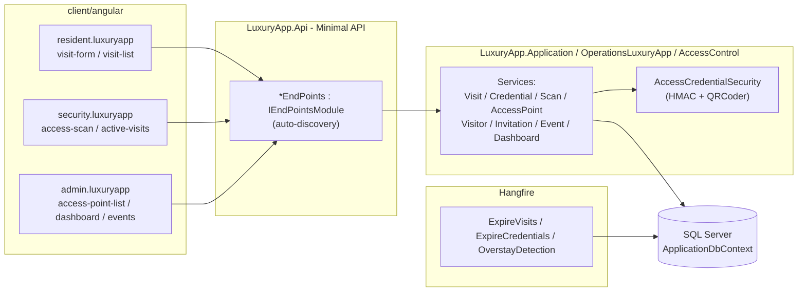
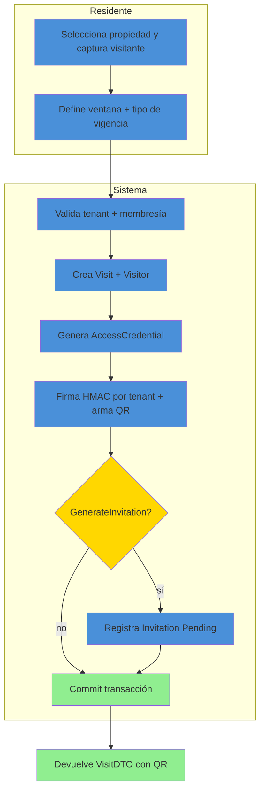
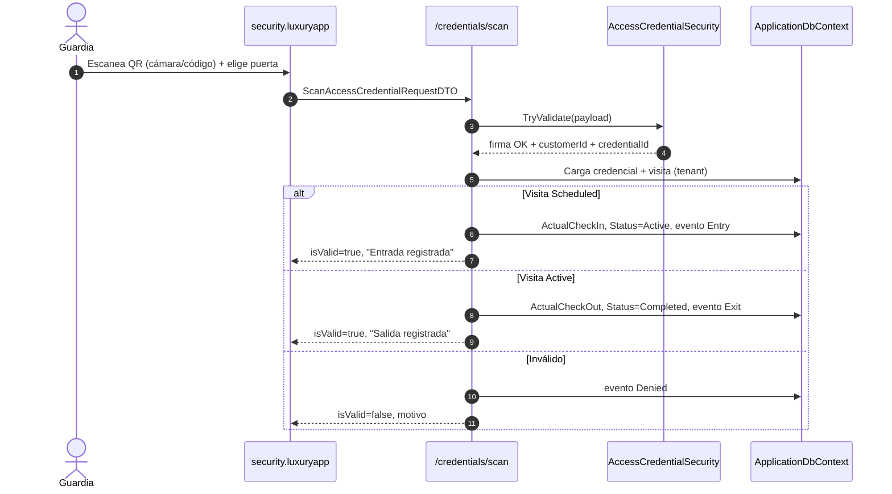
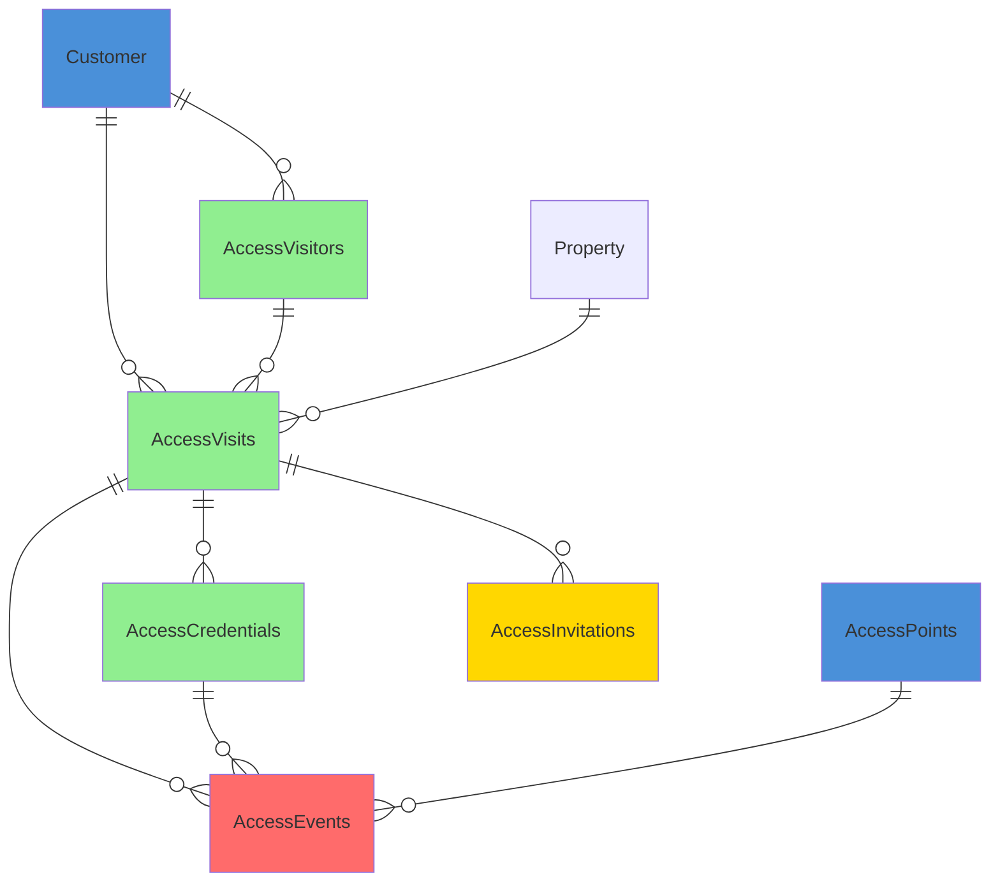

# 🚪 Control de Acceso (AccessControl) — Documentación Técnica

> **Ruta**: 📂 Documentación > 💼 Operaciones > 🚪 Control de Acceso
> **📅 Última Revisión**: 13-jul-26
> **🛡️ Estado**: ✅ Vigente
> **👤 Responsable**: @geshyrihu

---

## 📑 Tabla de Contenidos

1. [Resumen Ejecutivo](#-resumen-ejecutivo)
2. [Visión Funcional](#-visión-funcional)
3. [Arquitectura Técnica](#-arquitectura-técnica)
4. [API Endpoints](#-api-endpoints)
5. [Flujo del Sistema](#-flujo-del-sistema)
6. [Componentes Frontend](#-componentes-frontend)
7. [Reglas de Negocio](#-reglas-de-negocio)
8. [Matriz de Permisos](#-matriz-de-permisos)
9. [Catálogo de Roles del Sistema](#-catálogo-de-roles-del-sistema)
10. [Base de Datos](#-base-de-datos)
11. [Performance](#-performance)
12. [Glosario de Términos](#-glosario-de-términos)
13. [Checklist de Criterios](#-checklist-de-criterios)
14. [Historial de Cambios](#-historial-de-cambios)

---

## 🎯 Resumen Ejecutivo

**Propósito**: Sistema de acceso multi-tenant donde **residentes** o **administración** generan credenciales **QR** temporales para sus visitas, y **seguridad** valida entrada/salida en puerta desde la API de LuxuryApp. Toda la operación ocurre dentro del tenant (`Customer`) del usuario autenticado.

**Actores Involucrados** (`ApplicationRoleEnum`): `Condomino`, `Comite` (residentes que autorizan), `Administrador`/`GerenteOperaciones`/`Asistente`/`Recepcionista`/`Concierge` (administración), `JefeSeguridadInterna`/`SeguridadInterna`/`Monitorista` (seguridad operativa), `SuperUsuario`.

**Dependencias**: `Customer` (límite de tenant), `Property` + `PropertyMember` (destino/autorización), `ApplicationUser`/`ApplicationRoleEnum` (identidad y seguridad), Hangfire (jobs), QRCoder (imagen QR), EPPlus (exportación).

**Alcance**:

- ✅ Incluye: visitantes, visitas programadas, QR temporal (single/multi/recurrente/permanente), check-in/out por escaneo, bitácora inmutable, puntos de acceso (CRUD), invitaciones (registro), dashboard/ocupación, exportación Excel, jobs de expiración/overstay.
- ❌ No incluye: torniquetes/IoT, biometría, BLE/NFC, OCR de placas, entrega real de invitaciones por proveedor (WhatsApp/Email/SMS), turnos de guardia (`GuardShift` existe como entidad pero sin servicio en el MVP).

> [!NOTE]
> Backend movido a `api/LuxuryApp.Application/OperationsLuxuryApp/AccessControl/`. Entidades EF en `api/LuxuryApp.Infrastructure.Data/Data/Entities/Tenant/Operations/AccessControl/`. Jobs en `api/LuxuryApp.Application.Tenant/Infrastructure/Jobs/Workers/`.

---

## 🔍 Visión Funcional

**HU-01 — Residente crea visita con QR**

> Como **residente** quiero registrar a mi visitante y obtener un QR temporal.
> **Criterios**: la propiedad debe pertenecerme (`PropertyMember`/propietario); el sistema emite `Visit` + `AccessCredential` y devuelve la imagen QR.

**HU-02 — Administración crea visita**

> Como **staff administrativo** quiero crear visitas para cualquier propiedad del tenant y compartir/imprimir el QR.

**HU-03 — Seguridad valida acceso**

> Como **guardia** quiero escanear el QR en la puerta (cámara o código) y que el sistema decida entrada/salida y registre el evento.
> **Criterios**: valida firma HMAC, tenant, vigencia y estado; primera lectura = entrada, siguiente = salida.

**HU-04 — Administración supervisa**

> Como **administrador** quiero ver la ocupación actual, métricas del día y la bitácora, y exportarla a Excel.

---

## 🏗️ Arquitectura Técnica



| Capa        | Tecnología                                                          |
| ----------- | ------------------------------------------------------------------- |
| Backend     | .NET 10, Minimal APIs (`IEndpointModule`), EF Core 10               |
| Firma QR    | HMACSHA256 (clave derivada por tenant)                              |
| Imagen QR   | QRCoder (`PngByteQRCode`, sin System.Drawing)                       |
| Exportación | EPPlus (`GetAsByteArray`)                                           |
| Jobs        | Hangfire (`HangfireJobCatalog`)                                     |
| Respuestas  | `ApiResponseDTO<T>` (nunca `ProblemDetails`)                        |
| Mapeo       | Explícito `ToDTO()` (AutoMapper prohibido)                          |
| Frontend    | Angular 22 (standalone, signals, OnPush), Bootstrap 5, catálogo `@ui/*` |

---

## 📱 Mobile Responsive (§15 CONVENTIONS.md)

| Vista                                                                          | Patrón (§15.2)                | Implementación                                                                                                         |
| ------------------------------------------------------------------------------ | ----------------------------- | ---------------------------------------------------------------------------------------------------------------------- |
| `VisitForm` / `VisitList` / `VisitDetail` (resident)                           | **B — Componentes Separados** | Wrapper `access-control-wrapper.ts` → `@if (platform.isMobile()) <app-visit-form-mobile />` `:else <app-visit-form />` |
| `AccessScan` / `ActiveVisits` (security)                                       | **B — Componentes Separados** | Mobile-first: `ion-content` + `ion-list` + `ion-item-sliding`; escáner usa `BarcodeDetector` nativo                    |
| `AccessPointList` / `AccessDashboard` / `AccessEvents` / `VisitorList` (admin) | **A — CSS Responsive**        | PrimeFlex grid (`p-col-*`), tablas con scroll horizontal en móvil                                                      |

**Reglas aplicadas:**

- Breakpoint único: 768px (`PlatformService.isMobile()`)
- Touch targets ≥ 44×44px en todos los botones/iconos móviles
- Safe areas: `ion-content` maneja notch/status bar/home indicator
- Modales en móvil: `ion-modal` vía `IonicDialogModal` (nunca `DynamicDialog`)
- Pull-to-refresh (`ion-refresher`) + infinite scroll (`ion-infinite-scroll`) en listados
- Acciones principales en thumb zone: FAB con `[fabMode]="true"`

---

## 🌐 API Endpoints

Base: `api/access-controls`. Todos requieren `Authorization: Bearer <JWT>`; roles vía `AccessControlRoles` (nombres reales de `ApplicationRoleEnum`). Éxitos y errores siempre en `ApiResponseDTO<T>`.

### Tabla General

| Método | Path                              | Roles              | Request DTO                        | Response DTO                     | Códigos HTTP          |
| ------ | --------------------------------- | ------------------ | ---------------------------------- | -------------------------------- | --------------------- |
| POST   | `/visits`                         | Manager            | `CreateVisitRequestDTO`            | `VisitDTO` (con `credential`)    | 200 · 400 · 403 · 404 |
| GET    | `/visits`                         | Manager            | `PaginationCommonDTO` (query)      | `PagedResultDTO<VisitDTO>`       | 200 · 400             |
| GET    | `/visits/active`                  | Security           | —                                  | `List<VisitDTO>`                 | 200 · 400             |
| GET    | `/visits/{id}`                    | Manager            | —                                  | `VisitDTO`                       | 200 · 400 · 404       |
| PATCH  | `/visits/{id}/cancel`             | Manager            | `CancelVisitRequestDTO`            | `bool`                           | 200 · 400 · 404 · 409 |
| POST   | `/credentials/qr`                 | Manager            | `GenerateQrCredentialRequestDTO`   | `AccessCredentialDTO`            | 200 · 400 · 404       |
| POST   | `/credentials/scan`               | Security           | `ScanAccessCredentialRequestDTO`   | `AccessScanResultDTO`            | 200 · 400             |
| GET    | `/credentials/{id}`               | Manager            | —                                  | `AccessCredentialDTO`            | 200 · 400 · 404       |
| PATCH  | `/credentials/{id}/revoke`        | Manager            | `RevokeAccessCredentialRequestDTO` | `bool`                           | 200 · 400 · 404 · 409 |
| GET    | `/access-points`                  | Manager + Security | —                                  | `List<AccessPointDTO>`           | 200 · 400             |
| POST   | `/access-points`                  | Manager            | `CreateAccessPointRequestDTO`      | `AccessPointDTO`                 | 200 · 400             |
| PUT    | `/access-points/{id}`             | Manager            | `UpdateAccessPointRequestDTO`      | `AccessPointDTO`                 | 200 · 400 · 404       |
| GET    | `/visitors`                       | Manager            | —                                  | `List<VisitorDTO>`               | 200 · 400             |
| GET    | `/visitors/{id}`                  | Manager            | —                                  | `VisitorDTO`                     | 200 · 400 · 404       |
| POST   | `/visitors`                       | Manager            | `CreateVisitorRequestDTO`          | `VisitorDTO`                     | 200 · 400             |
| PUT    | `/visitors/{id}`                  | Manager            | `UpdateVisitorRequestDTO`          | `VisitorDTO`                     | 200 · 400 · 404       |
| POST   | `/invitations`                    | Manager            | `SendInvitationRequestDTO`         | `InvitationDTO`                  | 200 · 400 · 404       |
| POST   | `/invitations/{id}/resend`        | Manager            | —                                  | `InvitationDTO`                  | 200 · 400 · 404       |
| GET    | `/invitations/by-visit/{visitId}` | Manager            | —                                  | `List<InvitationDTO>`            | 200 · 400             |
| GET    | `/events`                         | Manager + Security | `PaginationCommonDTO` (query)      | `PagedResultDTO<AccessEventDTO>` | 200 · 400             |
| GET    | `/events/export`                  | Manager            | —                                  | archivo `.xlsx`                  | 200 · 400             |
| GET    | `/dashboard/occupancy`            | Manager + Security | —                                  | `OccupancyDTO`                   | 200 · 400             |
| GET    | `/dashboard/stats`                | Manager + Security | —                                  | `DashboardStatsDTO`              | 200 · 400             |

> [!NOTE]
> El campo `responseCode` viaja **dentro** de `ApiResponseDTO`; el status HTTP siempre es `200 OK` para respuestas de negocio (incluidos errores 4xx de dominio). `500` solo para excepciones no controladas.

### Detalle por Endpoint

#### 🟢 POST `/api/access-controls/visits`

Crea la visita (y el visitante si no existe) y **emite la credencial QR** en una transacción.

- **Roles**: `SuperUsuario`, `Administrador`, `GerenteOperaciones`, `GerenteAtencion`, `SupervisionOperativa`, `Asistente`, `Recepcionista`, `MasterConcierge`, `Concierge`, `Comite`, `Condomino`.
- **Headers**: `Authorization: Bearer <JWT>`, `Content-Type: application/json`.

**Request** (`CreateVisitRequestDTO`):

```json
{
  "propertyId": "019c...",
  "visitorId": null,
  "visitorFullName": "Juan Pérez",
  "visitorPhone": "5512345678",
  "visitorEmail": "juan@example.com",
  "company": "Repartos SA",
  "vehiclePlate": "ABC-123",
  "scheduledStart": "2026-07-13T16:00:00Z",
  "scheduledEnd": "2026-07-13T20:00:00Z",
  "purpose": "Entrega",
  "credentialValidityType": "SingleUseScheduled",
  "maxUsages": null,
  "generateInvitation": true,
  "invitationChannel": "WhatsApp"
}
```

**Response 200** (`ApiResponseDTO<VisitDTO>`):

```json
{
  "success": true,
  "message": "Visita creada y credencial emitida.",
  "responseCode": 200,
  "data": {
    "id": "019c...",
    "visitorName": "Juan Pérez",
    "propertyDisplay": "Torre: A Dpto: 101",
    "status": "Scheduled",
    "credential": {
      "publicCode": "A1B2C3D4E5F6",
      "validityType": "SingleUseScheduled",
      "qrImageBase64": "iVBORw0KGgo...",
      "status": "Active",
      "maxUsages": 1,
      "currentUsages": 0
    }
  }
}
```

**Response 4xx** (dominio):

```json
{
  "success": false,
  "message": "No puedes crear visitas para una propiedad que no te pertenece.",
  "responseCode": 403,
  "data": null
}
```

**Validaciones por campo**:

| Campo                             | Regla                                                                                                     |
| --------------------------------- | --------------------------------------------------------------------------------------------------------- |
| `propertyId`                      | Requerido; debe existir y pertenecer al `CustomerId` del usuario (404 si no)                              |
| `scheduledStart` / `scheduledEnd` | Requeridos; `scheduledEnd > scheduledStart` (400)                                                         |
| `visitorId`                       | Si es `null`, `visitorFullName` es obligatorio (400)                                                      |
| `credentialValidityType`          | Enum `AccessCredentialValidityType`; default `SingleUseScheduled`                                         |
| (residente)                       | Si el rol es `Condomino`/`Comite`, la propiedad debe estar en su `PropertyMember` o ser propietario (403) |

**Errores**: `400` entrada inválida · `403` residente sin membresía · `404` propiedad/visitante fuera del tenant.

---

#### 🟢 POST `/api/access-controls/credentials/scan`

Valida un QR en puerta y decide entrada/salida. **Siempre** registra un `AccessEvent`.

- **Roles**: `SecurityRoles` (seguridad + concierge + admin).

**Request** (`ScanAccessCredentialRequestDTO`):

```json
{
  "scannedPayload": "base64-firmado",
  "accessPointId": "019c...",
  "deviceInfo": "Kiosko-Caseta-1"
}
```

**Response 200 — acceso concedido** (`AccessScanResultDTO`):

```json
{
  "success": true,
  "responseCode": 200,
  "data": {
    "isValid": true,
    "resultType": "Entry",
    "message": "Entrada registrada.",
    "visitorName": "Juan Pérez",
    "propertyDisplay": "Torre: A Dpto: 101",
    "occurredAt": "2026-07-13T16:05:00Z"
  }
}
```

**Response 200 — acceso denegado** (negocio, no error HTTP):

```json
{
  "success": true,
  "responseCode": 200,
  "data": {
    "isValid": false,
    "resultType": "Denied",
    "message": "El código no pertenece a este condominio.",
    "visitId": null
  }
}
```

**Validaciones**: `accessPointId` debe existir en el tenant; `scannedPayload` requerido y con firma HMAC válida; credencial `Active`, dentro de vigencia, con usos disponibles; `Recurrent` valida horario en la entrada.
**Motivos de denegación**: código inválido/alterado · otro tenant · credencial inexistente/revocada/expirada · usos agotados · fuera de horario recurrente · visita en estado no válido.

> [!IMPORTANT]
> **Sin PII en logs**: Nunca se loguean `visitorFullName`, `visitorPhone`, `visitorEmail`, `vehiclePlate`, `scannedPayload` ni `PublicCode` en Serilog. Solo IDs técnicos (`VisitId`, `CredentialId`, `CustomerId`) y códigos de resultado.

---

#### 🟢 POST `/api/access-controls/credentials/qr`

Emite una credencial QR sobre una visita existente.

**Request** (`GenerateQrCredentialRequestDTO`):

```json
{
  "visitId": "019c...",
  "validityType": "MultiUseScheduled",
  "maxUsages": 5,
  "validFrom": null,
  "validUntil": null,
  "recurrenceRule": null
}
```

**Validaciones**: `visitId` del tenant (404); `validityType` enum válido (400); si `Recurrent` → `recurrenceRule` requerido (formato `DAYS=MO,TU;FROM=08:00;TO=18:00`).

---

#### 🟢 POST `/api/access-controls/access-points`

**Request** (`CreateAccessPointRequestDTO`):

```json
{
  "name": "Caseta principal",
  "accessPointType": "Pedestrian",
  "location": "Entrada norte",
  "deviceIdentifier": null
}
```

**Validaciones**: `name` requerido (400); `accessPointType` enum `AccessPointType` (`Pedestrian|Vehicle|Service|Emergency`, 400).

> [!IMPORTANT]
> Los DTO de request no llevan atributos `[Required]`/`[MaxLength]`: la validación de entrada se realiza en la capa de servicio (mensajes en español) y las longitudes se garantizan en las entidades EF (`[MaxLength]`).

---

## 🔄 Flujo del Sistema

### Creación de visita + emisión de QR



### Escaneo en puerta (entrada/salida)



**Escenarios**: QR alterado → `Denied` ("Código inválido o alterado"); QR de otro tenant → `Denied`; credencial revocada/expirada → `Denied`; usos agotados (single-use) → `Denied`; fuera de horario recurrente (solo en entrada) → `Denied`.

---

## 🖥️ Componentes Frontend

Workspace: **`client/angular`** (standalone, signals, OnPush, catálogo `@ui/*`, `ApiResponseService`, `Endpoints`). Todos los componentes son de tipo **web** (Bootstrap 5 desktop); no hay variantes mobile/adaptive en el MVP.

### Routing

| App (§14)            | Ruta                           | Componente        |    Lazy loading    | Guard       | Menú |
| -------------------- | ------------------------------ | ----------------- | :----------------: | ----------- | :--: |
| `resident.luxuryapp` | `access-control/visitas`       | `VisitList`       | ✅ `loadComponent` | —           |  ❌  |
| `resident.luxuryapp` | `access-control/visitas/nueva` | `VisitForm`       | ✅ `loadComponent` | —           |  ❌  |
| `resident.luxuryapp` | `access-control/visitas/:id`   | `VisitDetail`     | ✅ `loadComponent` | —           |  ❌  |
| `security.luxuryapp` | `access-control/escaneo`       | `AccessScan`      | ✅ `loadComponent` | —           |  ❌  |
| `security.luxuryapp` | `access-control/activas`       | `ActiveVisits`    | ✅ `loadComponent` | —           |  ❌  |
| `admin.luxuryapp`    | `access-control/visitantes`    | `VisitorList`     | ✅ `loadComponent` | `authGuard` |  ❌  |
| `admin.luxuryapp`    | `access-control/puertas`       | `AccessPointList` | ✅ `loadComponent` | `authGuard` |  ❌  |
| `admin.luxuryapp`    | `access-control/dashboard`     | `AccessDashboard` | ✅ `loadComponent` | `authGuard` |  ❌  |
| `admin.luxuryapp`    | `access-control/bitacora`      | `AccessEvents`    | ✅ `loadComponent` | `authGuard` |  ❌  |

> [!WARNING]
> **Menú**: DB-driven (la tabla `MenuItems` por cliente filtra rutas permitidas); las rutas son navegables pero aún no aparecen en el sidebar sin seeding. **Guard**: las rutas de admin usan `authGuard`; las de resident/security aún no tienen guard (pendiente de endurecer).

### Catálogo de Componentes

| Componente        | Selector                | Ruta relativa                                              | Tipo | Inputs | Outputs | Signals                                                                                        | Servicios                                 | Comportamiento                                                                                                                                 |
| ----------------- | ----------------------- | ---------------------------------------------------------- | ---- | ------ | ------- | ---------------------------------------------------------------------------------------------- | ----------------------------------------- | ---------------------------------------------------------------------------------------------------------------------------------------------- |
| `VisitForm`       | `app-visit-form`        | `apps/resident.luxuryapp/access-control/visit-form.ts`     | web  | —      | —       | `submitting`, `properties`, `createdVisit`                                                     | `ApiResponseService`, `CustomerIdService` | Form reactivo tipado; al crear muestra el QR (`qrImageBase64`) y código público; opción de invitación (switch + canal)                         |
| `VisitList`       | `app-visit-list`        | `apps/resident.luxuryapp/access-control/visit-list.ts`     | web  | —      | —       | `dataSignal`, `loading`                                                                        | `ApiResponseService`, `CustomerIdService` | `effect` recarga al cambiar `customerId`; tabla del catálogo `@ui/web/table` paginada; cancelar visita `Scheduled`; enlace a detalle                                |
| `VisitDetail`     | `app-visit-detail`      | `apps/resident.luxuryapp/access-control/visit-detail.ts`   | web  | —      | —       | `visit`, `credential`, `invitations`, `sending`                                                | `ApiResponseService`, `ActivatedRoute`    | Detalle de visita + QR; **regenerar/revocar credencial** (`credentials` qr/getById/revoke); panel de invitaciones (enviar / listar / reenviar) |
| `VisitorList`     | `app-visitor-list`      | `apps/admin.luxuryapp/access-control/visitor-list.ts`      | web  | —      | —       | `dataSignal`, `submitting`, `editingId`                                                        | `ApiResponseService`                      | Catálogo de visitantes: alta/edición + lista negra; carga fresca por `getById` al editar                                                       |
| `AccessScan`      | `app-access-scan`       | `apps/security.luxuryapp/access-control/access-scan.ts`    | web  | —      | —       | `accessPoints`, `submitting`, `result`, `cameraOn`, `cameraSupported` (+ `viewChild('video')`) | `ApiResponseService`                      | Escaneo con `BarcodeDetector` (cámara) o input manual; limpia el stream en `OnDestroy`; muestra resultado color-coded                          |
| `ActiveVisits`    | `app-active-visits`     | `apps/security.luxuryapp/access-control/active-visits.ts`  | web  | —      | —       | `dataSignal`                                                                                   | `ApiResponseService`                      | Tabla de visitas activas del día; botón actualizar                                                                                             |
| `AccessPointList` | `app-access-point-list` | `apps/admin.luxuryapp/access-control/access-point-list.ts` | web  | —      | —       | `dataSignal`, `submitting`, `editingId`                                                        | `ApiResponseService`                      | Form inline alta/edición (create/update) + tabla; `il-button` editar por fila                                                                  |
| `AccessDashboard` | `app-access-dashboard`  | `apps/admin.luxuryapp/access-control/access-dashboard.ts`  | web  | —      | —       | `stats`, `occupancy`                                                                           | `ApiResponseService`                      | KPIs del día (grid de tarjetas) + tabla de ocupación actual                                                                                    |
| `AccessEvents`    | `app-access-events`     | `apps/admin.luxuryapp/access-control/access-events.ts`     | web  | —      | —       | `dataSignal`                                                                                   | `ApiResponseService`                      | Bitácora paginada; botón **Exportar Excel** (`onDownloadFile`)                                                                                 |

**Estilos**: Bootstrap 5 (`card`, `grid`, `text-*`); botones/inputs del catálogo `@ui/*` (`il-button`, `il-button-save`, `custom-input-*-signal`). **Testing**: `.spec.ts` por componente (Vitest) — pendiente de escribir para este módulo.

**Interfaces** (`core/interfaces/*.dto.ts`, espejo de los `XxxDTO` del backend): `visit`, `access-credential`, `create-visit-request`, `access-point`, `access-scan-result`, `access-event`, `occupancy`, `dashboard-stats`, `paged-result`.

> [!TIP]
> El QR se renderiza con `` — no requiere librería en el cliente. El escáner usa la API nativa `BarcodeDetector` (Chromium) con fallback a input manual.

---

## 📜 Reglas de Negocio

| ID     | SI (condición)                      | ENTONCES (acción)                                                                                                         |
| ------ | ----------------------------------- | ------------------------------------------------------------------------------------------------------------------------- |
| RN-001 | Cualquier operación del módulo      | Se filtra por `currentUser.CustomerId`; ningún acceso cruza tenants                                                       |
| RN-002 | Se emite una credencial             | Se firma con clave HMAC **derivada del tenant** (`HMACSHA256(masterSecret, customerId)`); un QR nunca vale en otro tenant |
| RN-003 | El creador es `Condomino`/`Comite`  | La propiedad debe pertenecerle (`PropertyMember` o propietario); si no → 403                                              |
| RN-004 | `ValidityType = SingleUseScheduled` | `MaxUsages=1`; el primer escaneo consume la credencial (`Status=Used`)                                                    |
| RN-005 | Visita `Scheduled` escaneada        | Registra `Entry`, `ActualCheckIn`, `Status=Active`; si `Active` → `Exit`, `Completed`                                     |
| RN-006 | Credencial no permanente            | Debe estar dentro de `[ValidFrom, ValidUntil]`; `Permanent` no tiene fin                                                  |
| RN-007 | `ValidityType = Recurrent`          | En la **entrada** se valida la regla `DAYS/FROM/TO`; la salida nunca se bloquea                                           |
| RN-008 | Revocación de credencial            | `Status=Revoked` + evento `Revoked`; cancelar visita revoca sus credenciales activas                                      |
| RN-009 | Cualquier escaneo (éxito o fallo)   | Se registra en `AccessEvents` (bitácora **inmutable**, sin soft delete)                                                   |
| RN-010 | Jobs programados                    | Expira visitas sin entrada, expira credenciales vencidas, detecta overstay (idempotente)                                  |

---

## 🔐 Matriz de Permisos

Roles de `ApplicationRoleEnum`. **M** = `AccessControlRoles.ManagerRoles`, **S** = `SecurityRoles`.

| Acción                     | Manager (M) | Security (S) |
| -------------------------- | :---------: | :----------: |
| Crear/gestionar visitas    |     ✅      |      ❌      |
| Emitir/revocar credencial  |     ✅      |      ❌      |
| Gestionar visitantes       |     ✅      |      ❌      |
| Gestionar puntos de acceso |     ✅      |      ❌      |
| Escanear (entrada/salida)  |     ❌      |      ✅      |
| Ver visitas activas        |     ❌      |      ✅      |
| Listar puntos de acceso    |     ✅      |      ✅      |
| Ver bitácora / dashboard   |     ✅      |      ✅      |
| Exportar bitácora          |     ✅      |      ❌      |

**Manager** (`RoleType` Dirección/Administrativo + Cliente): `SuperUsuario`, `Administrador`, `GerenteOperaciones`, `GerenteAtencion`, `SupervisionOperativa`, `Asistente`, `Recepcionista`, `MasterConcierge`, `Concierge`, `Comite`, `Condomino`.
**Security** (Operativo): `SuperUsuario`, `Administrador`, `SupervisionOperativa`, `JefeSeguridadInterna`, `SeguridadInterna`, `Monitorista`, `Recepcionista`, `MasterConcierge`, `Concierge`.

---

## 🗄️ Catálogo de Roles del Sistema

El módulo **no introduce roles nuevos**: reutiliza `ApplicationRoleEnum` mediante los grupos `AccessControlRoles.ManagerRoles`, `SecurityRoles` y `ManagerAndSecurityRoles`. La autorización es **por rol** (`AuthorizeAttribute { Roles = ... }`), no por claims.

---

## 🗄️ Base de Datos

`ApplicationDbContext` (SQL Server). No hay filtro global de tenant (solo soft-delete); el filtrado por `CustomerId` es manual en cada consulta. FKs con `OnDelete(Restrict)`.



| Tabla               | Columnas clave                                                                                   | Índices                                                                                                               |
| ------------------- | ------------------------------------------------------------------------------------------------ | --------------------------------------------------------------------------------------------------------------------- |
| `AccessVisitors`    | CustomerId, FullName, IsBlacklisted                                                              | `IX (CustomerId, FullName)`                                                                                           |
| `AccessVisits`      | CustomerId, VisitorId, PropertyId, Status, ScheduledStart/End, ActualCheckIn/Out                 | `IX (CustomerId, PropertyId, Status, ScheduledStart)`                                                                 |
| `AccessCredentials` | CustomerId, VisitId, ValidityType, PublicCode, SecurePayload, ValidFrom/Until, MaxUsages, Status | `IX (CustomerId,VisitId,Status,ValidUntil)`, `IX (CustomerId,ValidityType,Status)`, **UX** `(CustomerId, PublicCode)` |
| `AccessEvents`      | CustomerId, VisitId?, AccessCredentialId?, AccessPointId?, OccurredAt, EventType, WasSuccessful  | `IX (CustomerId, OccurredAt)`                                                                                         |
| `AccessPoints`      | CustomerId, Name, AccessPointType, IsActive                                                      | `IX (CustomerId, IsActive)`                                                                                           |
| `AccessInvitations` | CustomerId, VisitId, Channel, Status                                                             | `IX (CustomerId, VisitId, Status)`                                                                                    |
| `AccessGuardShifts` | CustomerId, GuardUserId, AccessPointId?, Status                                                  | `IX (CustomerId, Status, ShiftStart)`                                                                                 |

**Enums** (`LuxuryApp.Shared.Enums`): `AccessVisitStatus`, `AccessCredentialStatus`, `AccessCredentialValidityType`, `AccessEventType`, `AccessPointType`, `AccessInvitationStatus`, `GuardShiftStatus`.

---

## ⚡ Performance

- **Lazy loading**: componentes Angular vía `loadComponent` (una carga por ruta).
- **N+1**: consultas con `join`/proyección `.Select()` (sin cargas perezosas por fila); listados paginados server-side (`PaginationCommonDTO`, tope 200).
- **QR**: `PngByteQRCode` en memoria; la imagen no se persiste (se regenera desde `SecurePayload`).
- **Índices**: compuestos por `CustomerId` para las consultas más frecuentes; único en `PublicCode` por tenant.
- **Jobs**: consultas acotadas por estado; overstay es idempotente (no duplica eventos).
- **Export**: tope de 10 000 filas por archivo.

---

## 📖 Glosario de Términos

| Término             | Definición                                                   |
| ------------------- | ------------------------------------------------------------ |
| **Tenant**          | `Customer` (condominio) dueño de todos los datos del acceso  |
| **Credencial**      | Registro que respalda un QR (`AccessCredential`)             |
| **SecurePayload**   | Cadena firmada (Base64) codificada en el QR                  |
| **PublicCode**      | Código corto legible/compartible, único por tenant           |
| **Overstay**        | Permanencia de una visita activa más allá del rango esperado |
| **Punto de acceso** | Puerta física (`AccessPoint`) donde se escanea               |

---

## ✅ Checklist de Validación ([CONVENTIONS.md §11](../../../../../../CONVENTIONS.md#11-estándares-de-documentación))

> [!NOTE]
> El link a `CONVENTIONS.md` asume que el documento vive en la raíz del propio módulo. Ajusta la profundidad relativa (`../../../../../../`) según la ubicación final.

- [x] CERO mojibake (UTF-8 sin BOM)
- [x] CERO `any` en TypeScript
- [x] Fechas en formato `dd-MMM-yy`
- [x] Endpoints front/back coinciden carácter a carácter
- [x] Diagramas Mermaid válidos (flowchart swimlanes + sequence con `autonumber`)
- [x] Colores Mermaid según §11 (verde `#90EE90` éxito, amarillo `#FFD700` decisión, azul `#4A90D9` proceso, rojo `#FF6B6B` error)
- [x] Reglas de negocio en formato `SI/ENTONCES` (`RN-xxx`)
- [x] Roles usan nombres exactos de `ApplicationRoleEnum`
- [x] Mobile responsive: §15 aplicado según tipo de vista
- [x] Sin PII en logs
- [x] Emojis consistentes · Todo en español

---

## 📝 Historial de Cambios

| Fecha     | Versión | Autor      | Cambios                                                                                                                |
| --------- | ------- | ---------- | ---------------------------------------------------------------------------------------------------------------------- |
| 13-jul-26 | 1.0     | @geshyrihu | Documentación inicial del módulo (Fases 1–5 completas)                                                                 |
| 13-jul-26 | 1.1     | @kilo      | Actualización a template §11 CONVENTIONS.md: Mobile responsive §15, checklist §11, Mermaid colores, sin PII, sin `any` |
