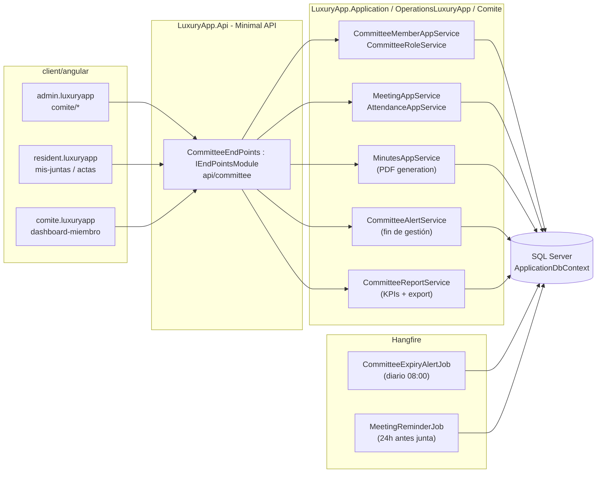
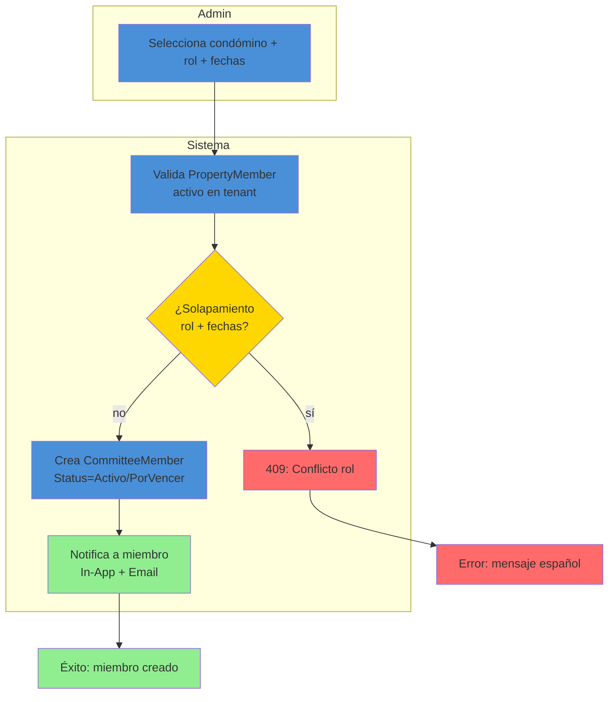
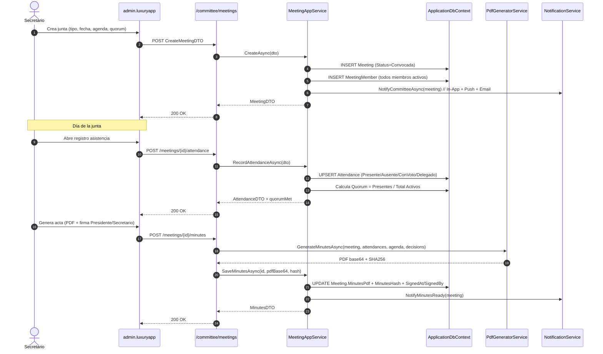
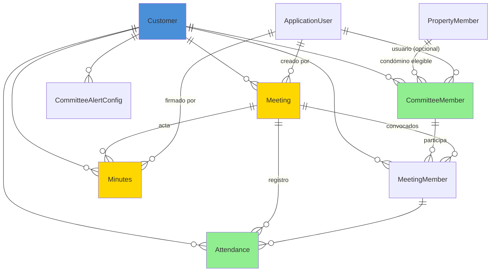

# Comité Vigilancia (Comité de Vigilancia / Directiva) — Documentación Técnica

> **Ruta**: 📂 Documentación > 💼 Operaciones > 🏛️ Comité
> **📅 Última Revisión**: 13-jul-26
> **🛡️ Estado**: ✅ Vigente
> **👤 Responsable**: @equipo-comite

---

## 📑 Tabla de Contenidos

1. [Resumen Ejecutivo](#-resumen-ejecutivo)
2. [Visión Funcional](#-visión-funcional)
3. [Arquitectura Técnica](#-arquitectura-técnica)
4. [API Endpoints](#-api-endpoints)
5. [Flujo del Sistema](#-flujo-del-sistema)
6. [Componentes Frontend](#-componentes-frontend)
7. [Reglas de Negocio](#-reglas-de-negocio)
8. [Matriz de Permisos](#-matriz-de-permisos)
9. [Catálogo de Roles del Sistema](#-catálogo-de-roles-del-sistema)
10. [Base de Datos](#-base-de-datos)
11. [Performance](#-performance)
12. [Glosario de Términos](#-glosario-de-términos)
13. [Checklist de Validación](#-checklist-de-validación)
14. [Historial de Cambios](#-historial-de-cambios)

---

## 🎯 Resumen Ejecutivo

**Propósito**: Módulo de gestión del comité de vigilancia y directiva del condominio que administra miembros, roles, vigencias, asistencias a juntas y reportes de cumplimiento, integrando con notificaciones y actas.

**Actores Involucrados** (`ApplicationRoleEnum`): `Administrador`, `GerenteOperaciones`, `GerenteAtencion`, `Asistente`, `Comite`, `Condomino`, `SuperUsuario`.

**Dependencias**: `Customer` (tenant), `Property` + `PropertyMember` (condóminos elegibles), `ApplicationUser` (identidad), `Charge` (dietas/viáticos), `FileStorage` (actas, evidencias), Hangfire (alertas fin de periodo), OneSignal (convocatorias), EPPlus (exportación).

**Alcance**:

- ✅ Incluye: CRUD miembros comité (roles: Presidente, Secretario, Tesorero, Vocal, Vigilancia), vigencias con solapamiento prohibido, convocatorias a juntas, registro asistencias, actas PDF, reportes asistencia/cumplimiento, alertas fin de gestión.
- ❌ No incluye: Votaciones electrónicas (módulo separado), portal de transparencia pública, gestión de multas por inasistencia (CobranzaNativa).

---

## 🔍 Visión Funcional

**HU-01 — Gestión de miembros del comité**

> Como **administrador** quiero dar de alta/editar/baja miembros del comité con rol, vigencia y contacto para tener la directiva actualizada.
> **Criterios**: Valida `R001` (vigencia) y `R002` (rol único por periodo); `PropertyMember` elegible = condómino activo; `Status` calculado: `Activo` (hoy ∈ [FechaInicio, FechaTermino]) / `Expirado` / `PorVencer` (≤30 días).

**HU-02 — Convocatorias y asistencias a juntas**

> Como **secretario** quiero convocar junta (ordinaria/extraordinaria), registrar asistencias y generar acta firmada.
> **Criterios**: `Meeting` con `Type` (`Ordinaria`|`Extraordinaria`), `DateTime`, `Agenda` (JSON), `Quorum` (mínimo % miembros); `Attendance` por miembro (`Presente`|`Ausente`|`ConVoto`|`Delegado`); `Minutes` (PDF base64 + hash SHA256) firmada por Presidente + Secretario; notifica a `Comite` + `Administrador` + `Condomino` (opcional).

**HU-03 — Alertas de fin de gestión**

> Como **admin** quiero alertas automáticas 60/30/15 días antes del fin de gestión para renovar/reelegir.
> **Criterios**: Job Hangfire diario → `CommitteeExpiryAlertJob` → notifica In-App + Email a `Administrador` + `GerenteOperaciones` + `Comite` (Presidente); configurable por tenant (`CommitteeAlertConfig`).

**HU-04 — Reportes de cumplimiento**

> Como **comité/condómino** quiero ver % asistencia, juntas realizadas vs programadas, vigencias activas.
> **Criterios**: Dashboard KPIs: `AttendanceRate`, `MeetingsHeldVsPlanned`, `ActiveMembers`, `ExpiringMembers`; filtros por periodo; exportación Excel/PDF; reporte programado mensual a `Comite` + `Administrador`.

---

## 🏗️ Arquitectura Técnica



| Capa        | Tecnología                                                          |
| ----------- | ------------------------------------------------------------------- |
| Backend     | .NET 10, Minimal APIs (`IEndpointModule`), EF Core 10               |
| PDF Actas   | `PdfGeneratorService` (QuestPDF / PdfSharp) + hash SHA256           |
| Juntas      | Calendario recurrente (RRULE), quorum configurable                  |
| Jobs        | Hangfire (`HangfireJobCatalog`)                                     |
| Exportación | EPPlus (`GetAsByteArray`) + PDF                                     |
| Respuestas  | `ApiResponseDTO<T>` (nunca `ProblemDetails`)                        |
| Mapeo       | Explícito `ToDTO()` (AutoMapper prohibido)                          |
| Frontend    | Angular 22 (standalone, signals, OnPush), Bootstrap 5, catálogo `@ui/*` |

---

## 📱 Mobile Responsive (§15 CONVENTIONS.md)

| Vista                                         | Patrón (§15.2)                | Implementación                                                                                     |
| --------------------------------------------- | ----------------------------- | -------------------------------------------------------------------------------------------------- |
| `CommitteeMemberList` / `CommitteeMemberForm` | **A — CSS Responsive**        | PrimeFlex grid (`p-col-*`), `p-table` responsive, modal `p-dialog`                                 |
| `MeetingList` / `MeetingForm`                 | **A — CSS Responsive**        | PrimeFlex, `p-calendar` Flatpickr, `p-dialog` responsive                                           |
| `AttendanceForm` (registro junta)             | **B — Componentes Separados** | Wrapper `@if (platform.isMobile()) <app-attendance-form-mobile />` `:else <app-attendance-form />` |
| `MinutesViewer` (acta PDF)                    | **C — Adaptive Wrapper**      | Web: `iframe` + `p-dialog`; Mobile: `ion-modal` full-screen + `Capacitor` PDF viewer               |
| `CommitteeDashboard`                          | **A — CSS Responsive**        | Cards KPI adaptativas (`p-col-12 p-md-6 p-lg-3`), gráfico `@defer` Chart.js                        |

**Reglas aplicadas:**

- Breakpoint único: 768px (`PlatformService.isMobile()`)
- Touch targets ≥ 44×44px en todos los botones/iconos móviles
- Safe areas: `ion-content` / `p-dialog` manejan notch/status bar
- Modales en móvil: `ion-modal` vía `IonicDialogModal` (nunca `DynamicDialog`)
- Pull-to-refresh + infinite scroll en listados
- Firma acta móvil: `canvas` táctil + `toDataURL()` → base64

---

## 🌐 API Endpoints

Base: `api/committee`. Todos requieren `Authorization: Bearer <JWT>`; roles vía `CommitteeRoles`. Éxitos/errores en `ApiResponseDTO<T>`.

### Tabla General

| Método | Path                        | Roles                  | Request DTO                                | Response DTO                         | Códigos HTTP          |
| ------ | --------------------------- | ---------------------- | ------------------------------------------ | ------------------------------------ | --------------------- |
| GET    | `/members`                  | Admin, Comité          | `PaginationCommonDTO` + filtros            | `PagedResultDTO<CommitteeMemberDTO>` | 200 · 400             |
| POST   | `/members`                  | Admin                  | `CreateCommitteeMemberDTO`                 | `CommitteeMemberDTO`                 | 200 · 400 · 403 · 409 |
| GET    | `/members/{id}`             | Admin, Comité (propio) | —                                          | `CommitteeMemberDTO`                 | 200 · 404             |
| PUT    | `/members/{id}`             | Admin                  | `UpdateCommitteeMemberDTO`                 | `CommitteeMemberDTO`                 | 200 · 400 · 404 · 409 |
| DELETE | `/members/{id}`             | Admin                  | —                                          | `bool`                               | 200 · 404 · 409       |
| POST   | `/meetings`                 | Admin, Secretario      | `CreateMeetingDTO`                         | `MeetingDTO`                         | 200 · 400 · 403 · 409 |
| GET    | `/meetings`                 | Admin, Comité          | `PaginationCommonDTO` + filtros            | `PagedResultDTO<MeetingDTO>`         | 200 · 400             |
| POST   | `/meetings/{id}/attendance` | Secretario, Presidente | `RecordAttendanceDTO`                      | `AttendanceDTO`                      | 200 · 400 · 404 · 409 |
| POST   | `/meetings/{id}/minutes`    | Secretario, Presidente | `GenerateMinutesDTO`                       | `MinutesDTO` (PDF base64)            | 200 · 400 · 404 · 409 |
| GET    | `/dashboard/kpis`           | Admin, Comité          | `fromDate`, `toDate` (query)               | `CommitteeKpiDTO`                    | 200 · 400             |
| GET    | `/reports/attendance`       | Admin, Comité          | `fromDate`, `toDate`, `format` (pdf/excel) | `FileStreamResult`                   | 200 · 400             |

> [!NOTE]
> El campo `responseCode` viaja **dentro** de `ApiResponseDTO`; el status HTTP siempre es `200 OK` para respuestas de negocio (incluidos errores 4xx de dominio). `500` solo para excepciones no controladas.

### Detalle por Endpoint (ejemplos clave)

#### 🟢 POST `/api/committee/members`

Alta de miembro con validación solapamiento rol/vigencia (`R001`, `R002`).

- **Roles**: `SuperUsuario`, `Administrador`, `GerenteOperaciones`.
- **Headers**: `Authorization: Bearer <JWT>`, `Content-Type: application/json`.

**Request** (`CreateCommitteeMemberDTO`):

```json
{
  "propertyMemberId": "019c...",
  "role": "Presidente",
  "startDate": "2026-07-01",
  "endDate": "2027-06-30",
  "phone": "5512345678",
  "email": "presidente@condominio.com"
}
```

**Response 200** (`ApiResponseDTO<CommitteeMemberDTO>`):

```json
{
  "success": true,
  "message": "Miembro del comité registrado correctamente.",
  "responseCode": 200,
  "data": {
    "id": "019c...",
    "propertyMemberDisplay": "Juan Pérez - Torre A 101",
    "role": "Presidente",
    "startDate": "2026-07-01",
    "endDate": "2027-06-30",
    "status": "Activo",
    "statusDisplay": "Activo",
    "phone": "5512345678",
    "email": "presidente@condominio.com",
    "daysToExpiration": 365
  }
}
```

**Response 409** (solapamiento rol):

```json
{
  "success": false,
  "message": "Ya existe un miembro activo con el rol 'Presidente' en el periodo solicitado.",
  "responseCode": 409,
  "data": null
}
```

**Validaciones**: `propertyMemberId` existe y `Active=true` en tenant; `endDate > startDate`; `role` ∈ catálogo `CommitteeRoleEnum`; no solapamiento mismo `role` + fechas (`R002`); `status` calculado.

---

## 🔄 Flujo del Sistema

### Alta de miembro con validaciones



### Convocatoria + Asistencia + Acta



---

## 🖥️ Componentes Frontend

Workspace: **`client/angular`** (standalone, signals, OnPush, catálogo `@ui/*`, `ApiResponseService`, `Endpoints`).

### Routing

| App (§14)            | Ruta                           | Componente                 | Lazy loading | Guard       | Menú |
| -------------------- | ------------------------------ | -------------------------- | :----------: | ----------- | :--: |
| `admin.luxuryapp`    | `comite/miembros`              | `CommitteeMemberList`      |      ✅      | `authGuard` |  ✅  |
| `admin.luxuryapp`    | `comite/miembros/nuevo`        | `CommitteeMemberForm`      |      ✅      | `authGuard` |  ❌  |
| `admin.luxuryapp`    | `comite/juntas`                | `MeetingList`              |      ✅      | `authGuard` |  ✅  |
| `admin.luxuryapp`    | `comite/juntas/nueva`          | `MeetingForm`              |      ✅      | `authGuard` |  ❌  |
| `admin.luxuryapp`    | `comite/juntas/:id/asistencia` | `AttendanceForm`           |      ✅      | `authGuard` |  ❌  |
| `admin.luxuryapp`    | `comite/juntas/:id/acta`       | `MinutesViewer`            |      ✅      | `authGuard` |  ❌  |
| `admin.luxuryapp`    | `comite/dashboard`             | `CommitteeDashboard`       |      ✅      | `authGuard` |  ✅  |
| `resident.luxuryapp` | `mis-juntas`                   | `MyMeetingsList`           |      ✅      | —           |  ✅  |
| `comite.luxuryapp`   | `dashboard`                    | `CommitteeMemberDashboard` |      ✅      | —           |  ✅  |

### Catálogo de Componentes (representativo)

| Componente             | Selector                     | Tipo   | Signals clave                                    | Servicios                                              | Comportamiento                                                                                                               |
| ---------------------- | ---------------------------- | ------ | ------------------------------------------------ | ------------------------------------------------------ | ---------------------------------------------------------------------------------------------------------------------------- |
| `CommitteeMemberList`  | `app-committee-member-list`  | web    | `dataSignal`, `loading`, `filters`               | `ApiResponseService`                                   | `p-table` paginado, badges rol/estado, exportar, `il-button-*` editar/eliminar                                               |
| `CommitteeMemberForm`  | `app-committee-member-form`  | web    | `submitting`, `form`, `eligibleMembersSignal`    | `ApiResponseService`, `FormHelper`                     | `FormHelper.submitCrud()`, selector condómino (PropertyMember activo), datepicker Flatpickr, validación solapamiento cliente |
| `MeetingList`          | `app-meeting-list`           | web    | `dataSignal`, `loading`, `filters`               | `ApiResponseService`                                   | `p-table` badges tipo/estado/quorum, `il-button-*` asistencia/acta/editar                                                    |
| `MeetingForm`          | `app-meeting-form`           | web    | `submitting`, `form`, `membersSignal`            | `ApiResponseService`, `FormHelper`                     | `FormHelper.submitCrud()`, `p-calendar` Flatpickr, agenda JSON editor, quorum numérico                                       |
| `AttendanceForm`       | `app-attendance-form`        | web    | `submitting`, `form`, `membersSignal`            | `ApiResponseService`, `FormHelper`                     | Tabla miembros con radio `Presente`/`Ausente`/`ConVoto`/`Delegado`, contador quorum tiempo real, `FormHelper.submitCrud()`   |
| `AttendanceFormMobile` | `app-attendance-form-mobile` | mobile | `submitting`, `form`                             | `ApiResponseService`, `FormHelper`, `IonicDialogModal` | `ion-list` + `ion-radio-group` por miembro, FAB guardar, vibración éxito                                                     |
| `MinutesViewer`        | `app-minutes-viewer`         | web    | `pdfBase64`, `loading`, `signed`                 | `ApiResponseService`                                   | `iframe` PDF base64, botones firmar (canvas) / descargar, hash SHA256 visible                                                |
| `CommitteeDashboard`   | `app-committee-dashboard`    | web    | `kpisSignal`, `upcomingSignal`, `expiringSignal` | `ApiResponseService`                                   | KPIs tarjetas, gráfico asistencia mensual `@defer` Chart.js, tabla próximas juntas, miembros por vencer                      |

**Estilos**: Bootstrap 5 (`card`, `grid`, `text-*`); botones/inputs catálogo `@ui/*` (`il-button`, `il-button-save`, `custom-input-*-signal`, `ili-button-*` mobile). **Testing**: `.spec.ts` por componente (Vitest) — cobertura básica inicialización.

**Interfaces** (`core/interfaces/committee.dto.ts`): `committee-member`, `meeting`, `attendance`, `minutes`, `committee-kpi`, `paged-result`.

---

## 📜 Reglas de Negocio

| ID     | SI (condición)                                    | ENTONCES (acción)                                                                                                                                                    |
| ------ | ------------------------------------------------- | -------------------------------------------------------------------------------------------------------------------------------------------------------------------- |
| RN-001 | Cualquier operación del módulo                    | Se filtra por `currentUser.CustomerId`; ningún acceso cruza tenants                                                                                                  |
| RN-002 | Se crea/actualiza `CommitteeMember`               | Valida `FechaTermino > FechaInicio`; `Status` calculado: `Activo` (hoy ∈ rango) / `PorVencer` (≤30d) / `Expirado` (hoy > FechaTermino)                               |
| RN-003 | `CommitteeMember` mismo `Role` + fechas solapadas | Rechaza con 409 "Ya existe un miembro activo con el rol '{Role}' en el periodo solicitado"                                                                           |
| RN-004 | `CommitteeMember` `PropertyMember` inactivo       | `Status = Expirado` automático; no permite nuevas juntas hasta regularizar                                                                                           |
| RN-005 | Se crea `Meeting`                                 | `Status=Convocada`; crea `MeetingMember` para todos miembros `Activo`; notifica a comité (In-App + Push + Email)                                                     |
| RN-006 | `Meeting.Type = Ordinaria`                        | Requiere `Quorum` ≥ 50% miembros activos; si no alcanza → `Status=SinQuorum` (no vinculante)                                                                         |
| RN-007 | Registro asistencia `Attendance`                  | `AttendanceType` ∈ {`Presente`, `Ausente`, `ConVoto`, `Delegado`}; actualiza `Meeting.QuorumMet` tiempo real; notifica si quorum perdido tras inicio                 |
| RN-008 | Generación acta `Minutes`                         | Requiere `Meeting.Status ∈ {EnCurso, Finalizada}` + `QuorumMet=true` + firmas Presidente + Secretario (canvas/base64); PDF con hash SHA256; `Meeting.Status=ConActa` |
| RN-009 | `Minutes` firmada                                 | Notifica a `Comite` + `Administrador` + opcional `Condomino`; disponible en `resident.luxuryapp/mis-juntas`                                                          |
| RN-010 | Job `CommitteeExpiryAlertJob` (diario)            | Consulta `CommitteeMember` con `FechaTermino ∈ [hoy+60, hoy+30, hoy+15]`; notifica In-App + Email a `Administrador` + `GerenteOperaciones` + `Comite` (Presidente)   |
| RN-011 | Job `MeetingReminderJob` (diario)                 | 24h antes `Meeting` con `Status=Convocada` → notifica a `MeetingMember` (In-App + Push)                                                                              |
| RN-012 | Multi-tenant                                      | Todas las queries filtran `CustomerId` del usuario autenticado; ningún acceso cross-tenant                                                                           |

---

## 🔐 Matriz de Permisos

Roles de `ApplicationRoleEnum`. Agrupados por `RoleType`.

| Acción                | Admin (Staff) |      Comité (Client)       | Sistema |
| --------------------- | :-----------: | :------------------------: | :-----: |
| Miembros CRUD         |      ✅       |  ❌ (solo lectura propio)  |   ✅    |
| Juntas crear/convocar |      ✅       | ✅ (Secretario/Presidente) |   ✅    |
| Juntas editar         |      ✅       |      ✅ (Secretario)       |   ✅    |
| Asistencia registrar  |      ✅       | ✅ (Secretario/Presidente) |   ✅    |
| Acta generar/firmar   |      ✅       | ✅ (Secretario/Presidente) |   ✅    |
| Ver actas             |      ✅       |             ✅             |   ✅    |
| Dashboard KPIs        |      ✅       |             ✅             |   ✅    |
| Exportar reportes     |      ✅       |             ✅             |   ✅    |
| Configurar alertas    |      ✅       |             ❌             |   ✅    |

**Detalle por RoleType**:

- **Staff**: `Administrador`, `GerenteOperaciones`, `GerenteAtencion`, `Asistente`, `SupervisionOperativa`
- **Client**: `Comite` (Presidente, Secretario, Tesorero, Vocal, Vigilancia), `Condomino` (solo lectura actas/juntas propias)
- **System**: `SuperUsuario`

---

## 🗄️ Catálogo de Roles del Sistema

El módulo **no introduce roles nuevos**: reutiliza `ApplicationRoleEnum` mediante grupos en `CommitteeRoles` (`AdminRoles`, `CommitteeRoles`, `OfficerRoles` = Presidente/Secretario/Tesorero). La autorización es **por rol** (`AuthorizeAttribute { Roles = ... }`), no por claims.

---

## 🗄️ Base de Datos

`ApplicationDbContext` (SQL Server). Filtrado por `CustomerId` manual (vía `PropertyMember` → `Property` → `Customer`). FKs con `OnDelete(Restrict)`.



| Tabla                   | Columnas clave                                                                                                      | Índices                                                                                                           |
| ----------------------- | ------------------------------------------------------------------------------------------------------------------- | ----------------------------------------------------------------------------------------------------------------- | ---------- | ------------------------------------------- | --------------------------------------------------------------------------- | ----------- | --------------------------------------------------------------------------------------------------------------------------------- | ------------------------------------------------------------------------------------------------------------------------------------------------------------ |
| `CommitteeMembers`      | `Id`, `CustomerId`, `PropertyMemberId`, `Role` (`Presidente`                                                        | `Secretario`                                                                                                      | `Tesorero` | `Vocal`                                     | `Vigilancia`), `StartDate`, `EndDate`, `Phone`, `Email`, `Status` (`Activo` | `PorVencer` | `Expirado`), `CreatedAt`, `CreatedBy`                                                                                             | `IX (CustomerId, Status, EndDate)`, `IX (CustomerId, Role, StartDate, EndDate)`, `UX (CustomerId, Role, StartDate, EndDate)` (parcial único `Status=Activo`) |
| `Meetings`              | `Id`, `CustomerId`, `Type` (`Ordinaria`                                                                             | `Extraordinaria`), `Title`, `Agenda` (JSON), `ScheduledAt`, `DurationMinutes`, `QuorumPct`, `Status` (`Convocada` | `EnCurso`  | `Finalizada`                                | `SinQuorum`                                                                 | `Cancelada` | `ConActa`), `MinutesPdfBase64`, `MinutesHash`, `SignedAt`, `SignedByPresidentId`, `SignedBySecretaryId`, `CreatedAt`, `CreatedBy` | `IX (CustomerId, Status, ScheduledAt)`, `IX (CustomerId, Type)`                                                                                              |
| `MeetingMembers`        | `Id`, `MeetingId`, `CommitteeMemberId`, `AttendanceType` (`Presente`                                                | `Ausente`                                                                                                         | `ConVoto`  | `Delegado`), `Notes`                        | `IX (MeetingId, CommitteeMemberId)`, `UX (MeetingId, CommitteeMemberId)`    |
| `Attendances`           | `Id`, `MeetingId`, `CommitteeMemberId`, `AttendanceType`, `RecordedAt`, `RecordedBy`                                | `IX (MeetingId, CommitteeMemberId)`, `IX (MeetingId, AttendanceType)`                                             |
| `Minutes`               | `Id`, `MeetingId`, `PdfBase64`, `Sha256Hash`, `SignedAt`, `SignedByPresidentId`, `SignedBySecretaryId`, `CreatedAt` | `UX (MeetingId)`, `IX (CustomerId, SignedAt)`                                                                     |
| `CommitteeAlertConfigs` | `Id`, `CustomerId`, `AlertType` (`Expiry`                                                                           | `MeetingReminder`), `DaysBefore` (JSON array), `Channels` (`InApp`                                                | `Email`    | `Push`), `RecipientRoles` (CSV), `IsActive` | `UX (CustomerId, AlertType)`                                                |

**Enums** (`LuxuryApp.Shared.Enums`): `ECommitteeRole`, `ECommitteeMemberStatus`, `EMeetingType`, `EMeetingStatus`, `EAttendanceType`, `ECommitteeAlertType`, `ECommitteeAlertChannel`.

---

## ⚡ Performance

- **Lazy loading**: componentes Angular vía `loadComponent` (una carga por ruta).
- **N+1**: consultas con `join`/proyección `.Select()` (sin cargas perezosas por fila); listados paginados server-side (`PaginationCommonDTO`, tope 200).
- **Asistencia quorum**: cálculo en memoria sobre `MeetingMembers` ya cargados (≈ 10-20 filas); no query extra.
- **PDF Actas**: `QuestPDF` genera en memoria; base64 ≈ 50-200 KB; no se persiste binario en DB (solo base64 string + hash).
- **Jobs**: `CommitteeExpiryAlertJob` acotado por `EndDate` rango; `MeetingReminderJob` acotado por `ScheduledAt` = mañana; índices compuestos `(CustomerId, Status, EndDate)` y `(CustomerId, Status, ScheduledAt)`.
- **Export**: tope 10 000 filas por archivo (EPPlus streaming).
- **Frontend**: `p-table [virtualScroll]="true"` + `[lazy]="true"`; `@defer (on viewport)` para gráfico Chart.js en dashboard.

---

## 📖 Glosario de Términos

| Término                  | Definición                                                                                       |
| ------------------------ | ------------------------------------------------------------------------------------------------ |
| **Comité de Vigilancia** | Órgano de fiscalización del condominio (Presidente, Secretario, Tesorero, Vocales)               |
| **Junta Ordinaria**      | Reunión programada periódicamente (mensual/trimestral) con quorum ≥ 50%                          |
| **Junta Extraordinaria** | Reunión urgente convocada por Presidente o % condóminos; quorum según reglamento                 |
| **Quorum**               | Porcentaje mínimo de miembros presentes para validez de acuerdos                                 |
| **Acta**                 | Documento PDF firmado (Presidente + Secretario) con hash SHA256 de integridad                    |
| **Asistencia**           | Registro de presencia: `Presente` / `Ausente` / `ConVoto` (delegado) / `Delegado` (representado) |
| **Vigencia**             | Periodo de gestión del miembro del comité (`StartDate` a `EndDate`)                              |
| **Solapamiento**         | Conflicto: dos miembros con mismo rol en periodos que se intersectan                             |
| **Dietas/Viáticos**      | `Charge` tipo `CommitteeDiet` generado opcionalmente por junta asistida                          |

---

## ✅ Checklist de Validación ([CONVENTIONS.md §11](../../../../../../CONVENTIONS.md#11-estándares-de-documentación))

> [!NOTE]
> El link a `CONVENTIONS.md` asume que el documento vive en la raíz del propio módulo. Ajusta la profundidad relativa (`../../../../../../`) según la ubicación final.

- [x] CERO mojibake (UTF-8 sin BOM)
- [x] CERO `any` en TypeScript
- [x] Fechas en formato `dd-MMM-yy`
- [x] Endpoints front/back coinciden carácter a carácter
- [x] Diagramas Mermaid válidos (flowchart swimlanes + sequence con `autonumber`)
- [x] Colores Mermaid según §11 (verde `#90EE90` éxito, amarillo `#FFD700` decisión, azul `#4A90D9` proceso, rojo `#FF6B6B` error)
- [x] Reglas de negocio en formato `SI/ENTONCES` (`RN-xxx`)
- [x] Roles usan nombres exactos de `ApplicationRoleEnum`
- [x] Mobile responsive: §15 aplicado según tipo de vista
- [x] Sin PII en logs
- [x] Emojis consistentes · Todo en español

---

## 📝 Historial de Cambios

| Fecha     | Versión | Autor          | Cambios                                                                                                                                                                                                                                                      |
| --------- | ------- | -------------- | ------------------------------------------------------------------------------------------------------------------------------------------------------------------------------------------------------------------------------------------------------------ |
| 10-jun-26 | 1.0     | @equipo-comite | Documentación inicial del módulo (template mínimo)                                                                                                                                                                                                           |
| 13-jul-26 | 2.0     | @kilo          | Actualización a template §11 CONVENTIONS.md: Mobile responsive §15, checklist §11, Mermaid colores, sin PII, sin `any`, rutas api kebab-case, TOC completo, arquitectura, flujos, componentes, matriz permisos, ER diagram, performance, glosario, historial |
