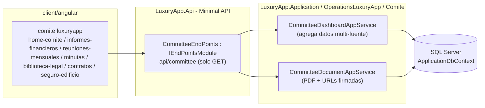
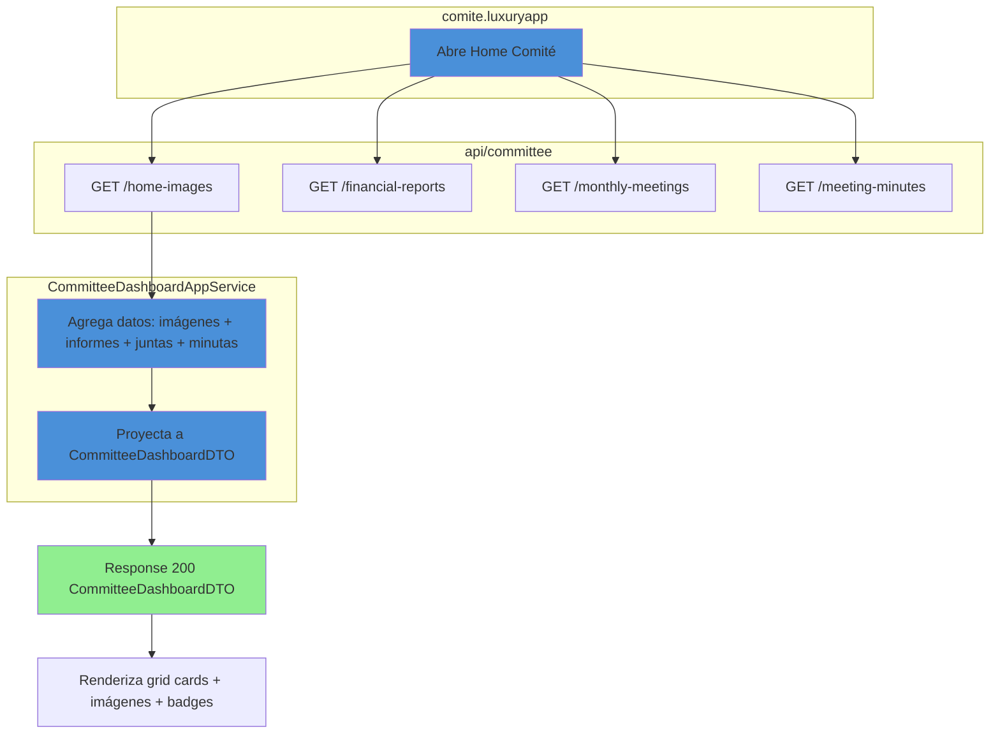
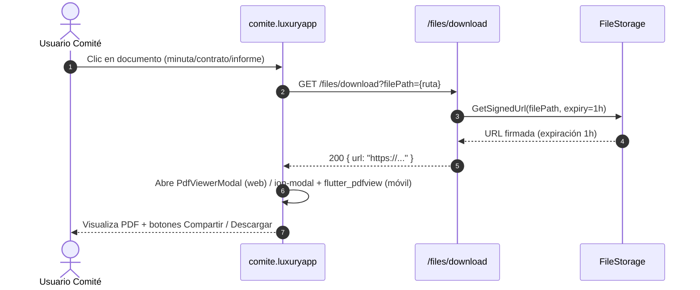
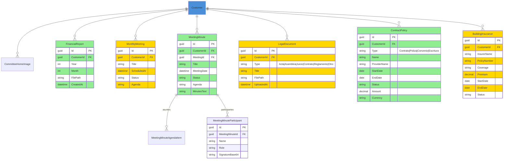

# Análisis del Módulo de Comité (Committee) — Documentación Técnica

> **Ruta**: 📂 Documentación > 💼 Operaciones > 🏛️ Comité
> **📅 Última Revisión**: 13-jul-26
> **🛡️ Estado**: ✅ Vigente
> **👤 Responsable**: @equipo-comite

---

## 📑 Tabla de Contenidos

1. [Resumen Ejecutivo](#-resumen-ejecutivo)
2. [Visión Funcional](#-visión-funcional)
3. [Arquitectura Técnica](#-arquitectura-técnica)
4. [API Endpoints](#-api-endpoints)
5. [Flujo del Sistema](#-flujo-del-sistema)
6. [Componentes Frontend](#-componentes-frontend)
7. [Reglas de Negocio](#-reglas-de-negocio)
8. [Matriz de Permisos](#-matriz-de-permisos)
9. [Catálogo de Roles del Sistema](#-catálogo-de-roles-del-sistema)
10. [Base de Datos](#-base-de-datos)
11. [Performance](#-performance)
12. [Glosario de Términos](#-glosario-de-términos)
13. [Checklist de Validación](#-checklist-de-validación)
14. [Historial de Cambios](#-historial-de-cambios)

---

## 🎯 Resumen Ejecutivo

**Propósito**: Módulo de consulta ejecutiva para miembros del consejo directivo y comité de vigilancia que permite visualizar documentos, minutas, estados financieros y pólizas de seguros de manera centralizada y de solo lectura.

**Actores Involucrados** (`ApplicationRoleEnum`): `Comite`, `Condomino`, `Administrador`, `GerenteOperaciones`, `GerenteAtencion`, `Asistente`, `SuperUsuario`.

**Dependencias**: `Customer` (tenant), `Property` (unidades), `ApplicationUser` (identidad), `FileStorage` (documentos PDF), `Charge` (gastos comité), `FileStorage` (imágenes, PDFs).

**Alcance**:

- ✅ Incluye: Consultas de solo lectura (GET) para imágenes home, estados financieros, juntas mensuales, minutas, biblioteca legal, contratos, seguro edificio; visor PDF integrado; UI ejecutiva con cards e imágenes.
- ❌ No incluye: Edición/creación de documentos, votaciones electrónicas, portal de transparencia pública, firma digital actas.

---

## 🔍 Visión Funcional

**HU-01 — Dashboard ejecutivo comité**

> Como **miembro del comité** quiero acceder a un dashboard visual con tarjetas de acceso rápido a informes financieros, juntas, minutas y biblioteca legal.
> **Criterios**: Grid adaptativo de cards con imágenes de fondo + overlay oscuro; navegación inferior (BottomNavigationBar) con 3 iconos: Inicio, Documentos, Ajustes; cards con ripple effect.

**HU-02 — Consulta de informes financieros y juntas**

> Como **presidente/tesorero** quiero ver listados de informes financieros mensuales y juntas programadas/pasadas con filtros por periodo.
> **Criterios**: Tablas `p-table` (web) / `ion-list` + `ion-item-sliding` (móvil); columnas: mes, tipo, estado, descarga PDF; pull-to-refresh + infinite scroll.

**HU-03 — Gestión de minutas y biblioteca legal**

> Como **secretario** quiero consultar minutas de reuniones con detalle de participantes y asuntos, y acceder a biblioteca legal (actas, asambleas, juicios).
> **Criterios**: Lista minutas con badges estado (Pendiente/En Progreso/Concluido); detalle minuta con timeline UI (asuntos + participantes); biblioteca con tabs "Finanzas", "Legales", "Contratos"; visor PDF modal (`PdfViewerModal`) + botón compartir/descargar.

**HU-04 — Visualización seguro edificio y contratos**

> Como **presidente** quiero ver póliza seguro edificio vigente y listado contratos proveedores con pólizas mantenimiento.
> **Criterios**: Card resumen seguro (aseguradora, vigencia, prima, cobertura); tabla contratos con filtros tipo/estado/proveedor; visor PDF integrado.

---

## 🏗️ Arquitectura Técnica

| Capa       | Tecnología                                                          |
| ---------- | ------------------------------------------------------------------- |
| Backend    | .NET 10, Minimal APIs (`IEndpointModule`), EF Core 10               |
| Consulta   | Solo lectura (GET), proyección `.Select()` a DTOs                   |
| Documentos | `IFileReadPathService` → URLs firmadas (expiración 1h)              |
| Visor PDF  | `PdfViewerModal` (web) / `flutter_pdfview` (móvil nativo)           |
| Respuestas | `ApiResponseDTO<T>` (nunca `ProblemDetails`)                        |
| Frontend   | Angular 22 (standalone, signals, OnPush), Bootstrap 5, catálogo `@ui/*` |

---

## 📱 Mobile Responsive (§15 CONVENTIONS.md)

| Vista                                                                                                         | Patrón (§15.2)           | Implementación                                                                                                           |
| ------------------------------------------------------------------------------------------------------------- | ------------------------ | ------------------------------------------------------------------------------------------------------------------------ |
| `HomeComite` (dashboard)                                                                                      | **C — Adaptive Wrapper** | Web: `p-card` grid `p-col-*`; Móvil: `ion-grid` + `ion-card` full-width, `ion-fab` acciones                              |
| `InformesFinancieros` / `ReunionesMensuales` / `Minutas` / `BibliotecaLegal` / `Contratos` / `SeguroEdificio` | **A — CSS Responsive**   | Web: `p-table` responsive; Móvil: `ion-list` + `ion-item-sliding` + `ili-action-menu`, pull-to-refresh                   |
| `MinutaDetalle` / `VisorPDF`                                                                                  | **C — Adaptive Wrapper** | Web: `p-dialog` + `iframe`/`PdfViewerModal`; Móvil: `ion-modal` full-screen + `flutter_pdfview` / `Capacitor` PDF viewer |

**Reglas aplicadas:**

- Breakpoint único: 768px (`PlatformService.isMobile()`)
- Touch targets ≥ 44×44px
- Safe areas: `ion-content` / `ion-modal` manejan notch/status bar
- Modales en móvil: `ion-modal` vía `IonicDialogModal` (nunca `DynamicDialog`)
- Pull-to-refresh (`ion-refresher`) + infinite scroll (`ion-infinite-scroll`) en listados
- Visor PDF: Web `PdfViewerModal` (catálogo `@ui/web`) / Móvil `flutter_pdfview` + `Capacitor` Filesystem

---

## 🌐 API Endpoints

Base: `api/committee` (solo GET). Todos requieren `Authorization: Bearer <JWT>`. Respuestas en `ApiResponseDTO<T>`.

### Tabla General

| Método | Path                                 | Descripción                                           |
| ------ | ------------------------------------ | ----------------------------------------------------- |
| GET    | `/home-images`                       | Mapeo imágenes menú principal comité                  |
| GET    | `/financial-reports/{customerId}`    | Listado informes financieros mensuales                |
| GET    | `/monthly-meetings/{customerId}`     | Listado juntas mensuales programadas/pasadas          |
| GET    | `/meeting-minutes/{customerId}`      | Listado general minutas                               |
| GET    | `/meeting-minutes-detail/{id}`       | Detalle minuta (asuntos, participantes)               |
| GET    | `/legal-library/{customerId}/{type}` | Biblioteca legal (Actas, Asambleas, Juicios, etc.)    |
| GET    | `/contracts/{customerId}`            | Listado contratos proveedores + pólizas mantenimiento |
| GET    | `/building-insurance/{customerId}`   | Detalle póliza seguro edificio vigente                |

> [!NOTE]
> El campo `responseCode` viaja **dentro** de `ApiResponseDTO`; el status HTTP siempre es `200 OK` para respuestas de negocio. `500` solo para excepciones no controladas.

---

## 🔄 Flujo del Sistema

### Carga dashboard comité (multi-fuente)

### Visualización PDF (modal web / full-screen móvil)

---

## 🖥️ Componentes Frontend

Workspace: **`client/angular`** (standalone, signals, OnPush, catálogo `@ui/*`, `ApiResponseService`, `Endpoints`).

### Routing (`comite.luxuryapp`)

| App (§14)          | Ruta                          | Componente                | Lazy loading | Guard | Menú |
| ------------------ | ----------------------------- | ------------------------- | :----------: | ----- | :--: |
| `comite.luxuryapp` | `comite`                      | `HomeComite`              |      ✅      | —     |  ✅  |
| `comite.luxuryapp` | `comite/informes-financieros` | `InformesFinancierosList` |      ✅      | —     |  ✅  |
| `comite.luxuryapp` | `comite/reuniones-mensuales`  | `ReunionesMensualesList`  |      ✅      | —     |  ✅  |
| `comite.luxuryapp` | `comite/minutas`              | `MinutasList`             |      ✅      | —     |  ✅  |
| `comite.luxuryapp` | `comite/minutas/:id`          | `MinutaDetalle`           |      ✅      | —     |  ❌  |
| `comite.luxuryapp` | `comite/biblioteca-legal`     | `BibliotecaLegalList`     |      ✅      | —     |  ✅  |
| `comite.luxuryapp` | `comite/contratos`            | `ContratosList`           |      ✅      | —     |  ✅  |
| `comite.luxuryapp` | `comite/seguro-edificio`      | `SeguroEdificioDetail`    |      ✅      | —     |  ✅  |

### Catálogo de Componentes (representativo)

| Componente                      | Selector                               | Tipo       | Signals clave                    | Servicios            | Comportamiento                                                                         |
| ------------------------------- | -------------------------------------- | ---------- | -------------------------------- | -------------------- | -------------------------------------------------------------------------------------- |
| `HomeComite`                    | `app-home-comite`                      | web/mobile | `cardsSignal`                    | `ApiResponseService` | Grid cards con imágenes fondo + overlay; `BottomNavigationBar` móvil                   |
| `InformesFinancierosList`       | `app-informes-financieros-list`        | web        | `dataSignal`, `loading`          | `ApiResponseService` | `p-table` virtual scroll, exportar, `il-button-*` descargar                            |
| `InformesFinancierosListMobile` | `app-informes-financieros-list-mobile` | mobile     | `dataSignal`, `refreshing`       | `ApiResponseService` | `ion-list` + `ion-item-sliding` + `ili-action-menu`, pull-to-refresh                   |
| `MinutasList`                   | `app-minutas-list`                     | web        | `dataSignal`, `filters`          | `ApiResponseService` | `p-table` badges estado, `il-button-*` ver detalle                                     |
| `MinutaDetalle`                 | `app-minuta-detalle`                   | web        | `minutaSignal`, `timelineSignal` | `ApiResponseService` | Timeline visual asuntos, badges estado, panel participantes                            |
| `BibliotecaLegalList`           | `app-biblioteca-legal-list`            | web        | `dataSignal`, `activeTab`        | `ApiResponseService` | `p-tabView` (Finanzas/Legales/Contratos), `p-table` por tab                            |
| `ContratosList`                 | `app-contratos-list`                   | web        | `dataSignal`, `filters`          | `ApiResponseService` | `p-table` filtros tipo/estado/proveedor, exportar                                      |
| `SeguroEdificioDetail`          | `app-seguro-edificio-detail`           | web        | `policySignal`                   | `ApiResponseService` | Card resumen (aseguradora, vigencia, prima, cobertura), `il-button-*` descargar póliza |
| `PdfViewerModal`                | `app-pdf-viewer-modal`                 | web/mobile | `pdfBase64`, `loading`           | `ApiResponseService` | Web: `iframe` + `p-dialog`; Móvil: `ion-modal` + `flutter_pdfview`                     |

**Estilos**: Bootstrap 5 (`card`, `grid`, `text-*`); botones/inputs catálogo `@ui/*` (`il-button`, `il-button-save`, `custom-input-*-signal`, `ili-button-*` mobile). **Testing**: `.spec.ts` por componente (Vitest) — cobertura básica inicialización.

**Interfaces** (`core/interfaces/committee.dto.ts`): `committee-dashboard`, `financial-report`, `monthly-meeting`, `meeting-minute`, `legal-document`, `contract`, `building-insurance`, `paged-result`.

---

## 📜 Reglas de Negocio

| ID     | SI (condición)                 | ENTONCES (acción)                                                                                                                           |
| ------ | ------------------------------ | ------------------------------------------------------------------------------------------------------------------------------------------- | ------------ | ------------ | --------------------------------- | ----------- | --------- | ------------ |
| RN-001 | Cualquier operación del módulo | Se filtra por `currentUser.CustomerId`; ningún acceso cruza tenants                                                                         |
| RN-002 | Acceso a endpoints comité      | Solo roles `Comite`, `Condomino`, `Administrador`, `GerenteOperaciones`, `GerenteAtencion`, `Asistente`, `SuperUsuario` (403 si no)         |
| RN-003 | Consulta documentos PDF        | `IFileReadPathService` genera URL firmada (expiración 1h); entidad persiste solo nombre archivo (GUID)                                      |
| RN-004 | `FinancialReport` listado      | Ordena por `Year` desc + `Month` desc; filtra `CustomerId` token; paginación server-side                                                    |
| RN-005 | `MonthlyMeeting` listado       | Ordena `ScheduledAt` desc; filtra `Status` (`Convocada`                                                                                     | `EnCurso`    | `Finalizada` | `Cancelada`)                      |
| RN-006 | `MeetingMinute` detalle        | Incluye `Participants[]` (nombre, rol, firma base64 si existe); `AgendaItems[]` con estado (`Pendiente`                                     | `EnProgreso` | `Concluido`) |
| RN-007 | `LegalLibrary` categorización  | `Type` ∈ {`Acta`, `Asamblea`, `Juicio`, `Contrato`, `Reglamento`, `Otro`}; filtra `Type` + búsqueda `Title`/`Description`                   |
| RN-008 | `ContractPolicy` listado       | Filtra `Type` (`Contrato`                                                                                                                   | `Poliza`     | `Convenio`   | `Escritura`), `Status` (`Vigente` | `PorVencer` | `Vencida` | `Cancelada`) |
| RN-009 | `BuildingInsurance` detalle    | Incluye `InsurerName`, `PolicyNumber`, `Coverage`, `Premium`, `StartDate`, `EndDate`, `Status` calculado (`Vigente`/`PorVencer`/ `Vencida`) |
| RN-010 | Multi-tenant                   | Todas las queries filtran `CustomerId` del usuario autenticado; ningún acceso cross-tenant                                                  |

---

## 🔐 Matriz de Permisos

Roles de `ApplicationRoleEnum`.

| Acción                   | Comité (Client) | Admin/Staff | Sistema |
| ------------------------ | :-------------: | :---------: | :-----: |
| Ver dashboard comité     |       ✅        |     ✅      |   ✅    |
| Ver informes financieros |       ✅        |     ✅      |   ✅    |
| Ver juntas mensuales     |       ✅        |     ✅      |   ✅    |
| Ver minutas / detalle    |       ✅        |     ✅      |   ✅    |
| Ver biblioteca legal     |       ✅        |     ✅      |   ✅    |
| Ver contratos / pólizas  |       ✅        |     ✅      |   ✅    |
| Ver seguro edificio      |       ✅        |     ✅      |   ✅    |
| Descargar PDF            |       ✅        |     ✅      |   ✅    |
| Configurar imágenes home |       ❌        | ✅ (Admin)  |   ✅    |

**Detalle por RoleType**:

- **Client**: `Comite`, `Condomino` (solo lectura)
- **Staff**: `Administrador`, `GerenteOperaciones`, `GerenteAtencion`, `Asistente`
- **System**: `SuperUsuario`

---

## 🗄️ Catálogo de Roles del Sistema

El módulo **no introduce roles nuevos**: reutiliza `ApplicationRoleEnum` mediante grupos en `CommitteeRoles` (`ViewerRoles`, `AdminRoles`). La autorización es **por rol** (`AuthorizeAttribute { Roles = ... }`), no por claims.

---

## 🗄️ Base de Datos

`ApplicationDbContext` (SQL Server). Filtrado por `CustomerId` manual (vía `Property`/`CommitteeMember`). FKs con `OnDelete(Restrict)`.

| Tabla                       | Columnas clave                                                                                                         | Índices                                                                                    |
| --------------------------- | ---------------------------------------------------------------------------------------------------------------------- | ------------------------------------------------------------------------------------------ |
| `FinancialReports`          | `Id`, `CustomerId`, `Year`, `Month`, `FilePath`, `CreatedAt`                                                           | `IX (CustomerId, Year, Month)`, `UX (CustomerId, Year, Month)`                             |
| `MonthlyMeetings`           | `Id`, `CustomerId`, `Title`, `ScheduledAt`, `Status`, `Agenda`                                                         | `IX (CustomerId, Status, ScheduledAt)`, `IX (CustomerId, Title)`                           |
| `MeetingMinutes`            | `Id`, `CustomerId`, `MeetingId`, `Title`, `MeetingDate`, `Status`, `Agenda`, `MinutesText`                             | `IX (CustomerId, MeetingDate)`, `IX (CustomerId, MeetingId)`                               |
| `MeetingMinuteParticipants` | `Id`, `MeetingMinuteId`, `Name`, `Role`, `SignatureBase64`                                                             | `IX (MeetingMinuteId)`                                                                     |
| `LegalDocuments`            | `Id`, `CustomerId`, `Type`, `Title`, `FilePath`, `UploadedAt`                                                          | `IX (CustomerId, Type, UploadedAt)`, `UX (CustomerId, Title)`                              |
| `ContractPolicies`          | `Id`, `CustomerId`, `ProviderId`, `PropertyId`, `Type`, `Name`, `StartDate`, `EndDate`, `Amount`, `Currency`, `Status` | `IX (CustomerId, Status, EndDate)`, `IX (CustomerId, ProviderId)`, `UX (CustomerId, Name)` |
| `BuildingInsurances`        | `Id`, `CustomerId`, `InsurerName`, `PolicyNumber`, `Coverage`, `Premium`, `StartDate`, `EndDate`, `Status`             | `IX (CustomerId, Status, EndDate)`, `UX (CustomerId, PolicyNumber)`                        |

**Enums** (`LuxuryApp.Shared.Enums`): `EFinancialReportType`, `EMeetingStatus`, `EMinuteStatus`, `ELegalDocumentType`, `EContractPolicyType`, `EContractPolicyStatus`, `EInsuranceStatus`.

---

## ⚡ Performance

- **Lazy loading**: componentes Angular vía `loadComponent` (una carga por ruta).
- **N+1**: consultas con `join`/proyección `.Select()` (sin cargas perezosas por fila); listados paginados server-side (`PaginationCommonDTO`, tope 200).
- **PDF**: `IFileReadPathService` genera URLs firmadas (expiración 1h); no se sirven binarios desde API.
- **Imágenes home**: `IFileReadPathService` genera URLs firmadas; no se sirven binarios desde API.
- **Índices**: compuestos por `CustomerId` + campos filtro frecuente (`Year`/`Month`, `Status`, `ScheduledAt`, `Type`).
- **Export**: tope 10 000 filas (EPPlus streaming).
- **Frontend**: `p-table [virtualScroll]="true"` + `[lazy]="true"`; `@defer (on viewport)` para gráficos Chart.js en dashboard (si se añade).

---

## 📖 Glosario de Términos

| Término                  | Definición                                                                           |
| ------------------------ | ------------------------------------------------------------------------------------ |
| **Comité de Vigilancia** | Órgano de fiscalización del condominio (Presidente, Secretario, Tesorero, Vocales)   |
| **Home Comité**          | Pantalla principal con grid de tarjetas de acceso rápido a secciones                 |
| **Informe Financiero**   | Reporte mensual de ejecución presupuestaria, ingresos/gastos, estado de cuenta       |
| **Junta Mensual**        | Reunión periódica del comité con agenda, acta y acuerdos                             |
| **Minuta/Acta**          | Documento PDF firmado (Presidente + Secretario) con hash SHA256 de integridad        |
| **Biblioteca Legal**     | Repositorio categorizado de actas, asambleas, juicios, contratos, reglamentos        |
| **Visor PDF**            | Componente modal (web) / full-screen (móvil) para visualizar PDF sin salir de la app |
| **Multi-tenant**         | Aislamiento por `CustomerId`: cada comité ve solo su información                     |

---

## ✅ Checklist de Validación ([CONVENTIONS.md §11](../../../../../../CONVENTIONS.md#11-estándares-de-documentación))

> [!NOTE]
> El link a `CONVENTIONS.md` asume que el documento vive en la raíz del propio módulo. Ajusta la profundidad relativa (`../../../../../../`) según la ubicación final.

- [x] CERO mojibake (UTF-8 sin BOM)
- [x] CERO `any` en TypeScript
- [x] Fechas en formato `dd-MMM-yy`
- [x] Endpoints front/back coinciden carácter a carácter
- [x] Diagramas Mermaid válidos (flowchart swimlanes + sequence con `autonumber`)
- [x] Colores Mermaid según §11 (verde `#90EE90` éxito, amarillo `#FFD700` decisión, azul `#4A90D9` proceso, rojo `#FF6B6B` error)
- [x] Reglas de negocio en formato `SI/ENTONCES` (`RN-xxx`)
- [x] Roles usan nombres exactos de `ApplicationRoleEnum`
- [x] Mobile responsive: §15 aplicado según tipo de vista
- [x] Sin PII en logs
- [x] Emojis consistentes · Todo en español

---

## 📝 Historial de Cambios

| Fecha     | Versión | Autor | Cambios                                                                   |
| --------- | ------- | ----- | ------------------------------------------------------------------------- |
| 13-jul-26 | 1.0     | @kilo | Conversión a template §11 CONVENTIONS.md completo desde análisis original |
