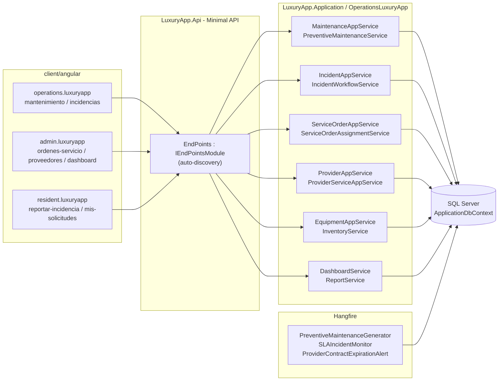
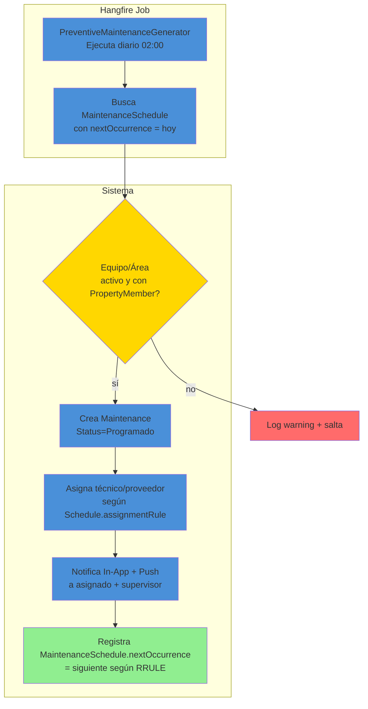
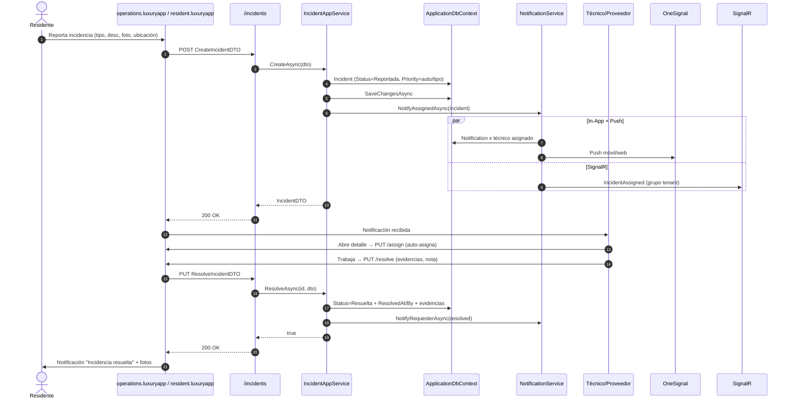
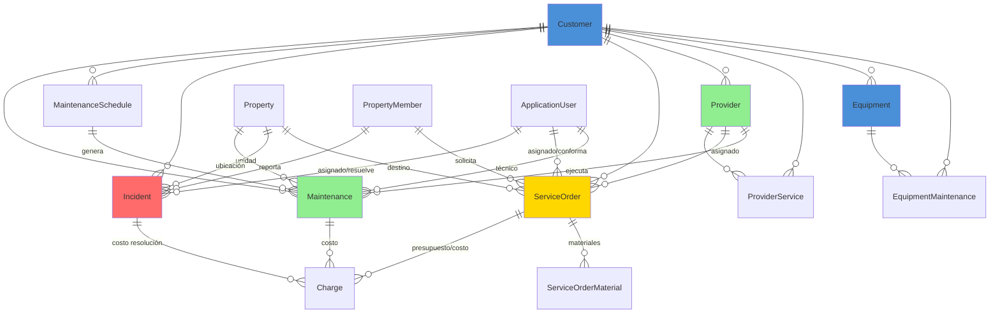

# Operaciones (Operations) — Documentación Técnica

> **Ruta**: 📂 Documentación > 💼 Operaciones > 🔧 Operaciones
> **📅 Última Revisión**: 13-jul-26
> **🛡️ Estado**: ✅ Vigente
> **👤 Responsable**: @equipo-operaciones

---

## 📑 Tabla de Contenidos

1. [Resumen Ejecutivo](#-resumen-ejecutivo)
2. [Visión Funcional](#-visión-funcional)
3. [Arquitectura Técnica](#-arquitectura-técnica)
4. [API Endpoints](#-api-endpoints)
5. [Flujo del Sistema](#-flujo-del-sistema)
6. [Componentes Frontend](#-componentes-frontend)
7. [Reglas de Negocio](#-reglas-de-negocio)
8. [Matriz de Permisos](#-matriz-de-permisos)
9. [Catálogo de Roles del Sistema](#-catálogo-de-roles-del-sistema)
10. [Base de Datos](#-base-de-datos)
11. [Performance](#-performance)
12. [Glosario de Términos](#-glosario-de-términos)
13. [Checklist de Validación](#-checklist-de-validación)
14. [Historial de Cambios](#-historial-de-cambios)

---

## 🎯 Resumen Ejecutivo

**Propósito**: Módulo integral de operaciones diarias del condominio que gestiona mantenimiento (correctivo/preventivo), incidencias operativas, seguimiento de trabajos, órdenes de servicio y gestión de proveedores/servicios, todo dentro del contexto multi-tenant (`Customer`).

**Actores Involucrados** (`ApplicationRoleEnum`): `Administrador`, `GerenteOperaciones`, `GerenteAtencion`, `Asistente`, `Recepcionista`, `Concierge`, `JefeMantenimiento`, `TecnicoMantenimiento`, `SupervisionOperativa`, `Proveedor`, `Jardineria`, `Limpieza`, `Seguridad`, `SuperUsuario`, `Comite`, `Condomino` (reportes).

**Dependencias**: `Customer` (tenant), `Property` + `PropertyMember` (unidad/solicitante), `ApplicationUser`/`ApplicationRole` (identidad), `Charge`/`CobranzaPayment` (cargos por servicio), `Equipment` (inventario mantenimiento), Hangfire (jobs preventivos), OneSignal (notificaciones), EPPlus (exportación).

**Alcance**:

- ✅ Incluye: Mantenimientos CRUD + calendario preventivo, incidencias (reporte/flujo/cierre), órdenes de servicio (creación/asignación/seguimiento/cierre), proveedores/servicios (catálogo + rating), equipamiento/inventario, reportes KPIs, exportación Excel.
- ❌ No incluye: IoT/sensores, gestión de flotas, compras/procurement (módulo Compras), nómina personal mantenimiento (RRHH).

---

## 🔍 Visión Funcional

**HU-01 — Mantenimiento correctivo/preventivo**

> Como **jefe de mantenimiento** quiero programar y dar seguimiento a mantenimientos preventivos (calendarizados) y correctivos (reactivos) con asignación a técnico/proveedor.
> **Criterios**: Preventivo: recurrencia configurable + checklist + alertas vencimiento; Correctivo: prioridad + SLA + cierre con evidencias; Ambos: generan `Charge` si aplica costo.

**HU-02 — Reporte de incidencias operativas**

> Como **residente/admin** quiero reportar incidencias (fuga, ruido, falla ascensor, zona común) con foto/ubicación y recibir notificaciones de avance.
> **Criterios**: Tipos `IncidentTypeEnum`; prioridad (Baja/Media/Alta/Crítica); SLA por prioridad; flujo `Reportada` → `Asignada` → `EnProceso` → `Resuelta` → `Cerrada`; notifica a técnico + residente.

**HU-03 — Órdenes de servicio**

> Como **admin/operaciones** quiero crear órdenes de servicio para trabajos específicos (pintura, plomería, electricidad) con presupuesto, asignación, materiales y cierre con conformidad.
> **Criterios**: Presupuesto opcional → `Charge` tipo `Servicio`; asignación a proveedor/interno; checklist materiales; firma digital conformidad (residente/admin); cierre genera `CobranzaPayment` si aplica.

**HU-04 — Gestión de proveedores y servicios**

> Como **compras/admin** quiero catálogo de proveedores con servicios, rating, vigencia contrato y documentos (RFC, seguro, seguridad).
> **Criterios**: `Provider` + `ProviderService`; rating 1-5; alertas vencimiento seguro/contrato; integración módulo Compras para OC.

---

## 🏗️ Arquitectura Técnica

| Capa          | Tecnología                                                            |
| ------------- | --------------------------------------------------------------------- |
| Backend       | .NET 10, Minimal APIs (`IEndpointModule`), EF Core 10                 |
| Mantenimiento | Calendario preventivo recurrente (RRULE), checklists, SLA             |
| Incidencias   | Workflow state machine, SLA por prioridad, notificaciones multi-canal |
| Jobs          | Hangfire (`HangfireJobCatalog`)                                       |
| Exportación   | EPPlus (`GetAsByteArray`)                                             |
| Respuestas    | `ApiResponseDTO<T>` (nunca `ProblemDetails`)                          |
| Mapeo         | Explícito `ToDTO()` (AutoMapper prohibido)                            |
| Frontend      | Angular 22 (standalone, signals, OnPush), Bootstrap 5, catálogo `@ui/*`   |

---

## 📱 Mobile Responsive (§15 CONVENTIONS.md)

| Vista                                                          | Patrón (§15.2)                | Implementación                                                                                                       |
| -------------------------------------------------------------- | ----------------------------- | -------------------------------------------------------------------------------------------------------------------- |
| `MaintenanceList` / `MaintenanceForm` / `MaintenanceDetail`    | **B — Componentes Separados** | Wrapper `@if (platform.isMobile()) <app-maintenance-list-mobile />` `:else <app-maintenance-list />`                 |
| `IncidentReportForm` / `IncidentList` / `IncidentDetail`       | **B — Componentes Separados** | Mobile-first: `ion-fab` reporte, `ion-list` + `ion-item-sliding` + `ili-action-map` (ubicación), `ion-modal` detalle |
| `ServiceOrderList` / `ServiceOrderForm` / `ServiceOrderDetail` | **B — Componentes Separados** | Wrapper elige; mobile usa `ion-modal` firma conformidad, `ion-action-sheet` acciones                                 |
| `ProviderList` / `ProviderForm` / `Dashboard`                  | **A — CSS Responsive**        | PrimeFlex grid (`p-col-*`), tablas scroll horizontal móvil                                                           |

**Reglas aplicadas:**

- Breakpoint único: 768px (`PlatformService.isMobile()`)
- Touch targets ≥ 44×44px en todos los botones/iconos móviles
- Safe areas: `ion-content` maneja notch/status bar/home indicator
- Modales en móvil: `ion-modal` vía `IonicDialogModal` (nunca `DynamicDialog`)
- Pull-to-refresh (`ion-refresher`) + infinite scroll (`ion-infinite-scroll`) en listados
- Acciones principales en thumb zone: FAB con `[fabMode]="true"`
- Mapa incidencias: `leaflet`/`google-maps` web; nativo `Capacitor` Geolocation + `ion-modal` móvil

---

## 🌐 API Endpoints

Base por dominio (kebab-case, plural, minúsculas, prefijo `api/`):

| Dominio          | Base Path                       | Descripción                                  |
| ---------------- | ------------------------------- | -------------------------------------------- |
| Mantenimientos   | `api/operations/maintenance`    | CRUD + preventivo + checklist + evidencias   |
| Incidencias      | `api/operations/incidents`      | Reporte + flujo + SLA + adjuntos             |
| Órdenes servicio | `api/operations/service-orders` | CRUD + asignación + materiales + conformidad |
| Proveedores      | `api/operations/providers`      | CRUD + servicios + rating + documentos       |
| Equipamiento     | `api/operations/equipment`      | Inventario + mantenimiento asociado          |
| Dashboard        | `api/operations/dashboard`      | KPIs + métricas + alertas                    |

### Tabla General (muestra representativa)

| Método | Path                              | Roles                           | Request DTO                      | Response DTO                     | Códigos HTTP          |
| ------ | --------------------------------- | ------------------------------- | -------------------------------- | -------------------------------- | --------------------- |
| POST   | `/maintenance`                    | Admin, Mantenimiento            | `CreateMaintenanceDTO`           | `MaintenanceDTO`                 | 200 · 400 · 403 · 409 |
| GET    | `/maintenance`                    | Admin, Mantenimiento, Residente | `PaginationCommonDTO`            | `PagedResultDTO<MaintenanceDTO>` | 200 · 400             |
| POST   | `/maintenance/preventive`         | Admin, Mantenimiento            | `CreatePreventiveMaintenanceDTO` | `MaintenanceDTO`                 | 200 · 400 · 409       |
| POST   | `/incidents`                      | Residente, Admin, Recepción     | `CreateIncidentDTO`              | `IncidentDTO`                    | 200 · 400 · 403       |
| PUT    | `/incidents/{id}/assign`          | Admin, Mantenimiento            | `AssignIncidentDTO`              | `bool`                           | 200 · 400 · 404 · 409 |
| PUT    | `/incidents/{id}/resolve`         | Técnico, Admin                  | `ResolveIncidentDTO`             | `bool`                           | 200 · 400 · 404 · 409 |
| POST   | `/service-orders`                 | Admin, Operaciones              | `CreateServiceOrderDTO`          | `ServiceOrderDTO`                | 200 · 400 · 403       |
| PUT    | `/service-orders/{id}/conformity` | Admin, Residente                | `ConformityDTO`                  | `bool`                           | 200 · 400 · 404 · 409 |
| POST   | `/providers`                      | Admin, Compras                  | `CreateProviderDTO`              | `ProviderDTO`                    | 200 · 400 · 409       |
| GET    | `/dashboard/kpis`                 | Admin, Operaciones              | —                                | `OperationsDashboardDTO`         | 200 · 400             |

> [!NOTE]
> El campo `responseCode` viaja **dentro** de `ApiResponseDTO`; el status HTTP siempre es `200 OK` para respuestas de negocio (incluidos errores 4xx de dominio). `500` solo para excepciones no controladas.

---

## 🔄 Flujo del Sistema

### Mantenimiento preventivo (generación automática)

### Reporte y resolución de incidencia

---

## 🖥️ Componentes Frontend

Workspace: **`client/angular`** (standalone, signals, OnPush, catálogo `@ui/*`, `ApiResponseService`, `Endpoints`).

### Routing

| App (§14)              | Ruta                                 | Componente            | Lazy loading | Guard       | Menú |
| ---------------------- | ------------------------------------ | --------------------- | :----------: | ----------- | :--: |
| `operations.luxuryapp` | `operaciones/mantenimiento`          | `MaintenanceList`     |      ✅      | `authGuard` |  ✅  |
| `operations.luxuryapp` | `operaciones/mantenimiento/nuevo`    | `MaintenanceForm`     |      ✅      | `authGuard` |  ❌  |
| `operations.luxuryapp` | `operaciones/mantenimiento/:id`      | `MaintenanceDetail`   |      ✅      | `authGuard` |  ❌  |
| `operations.luxuryapp` | `operaciones/incidencias`            | `IncidentList`        |      ✅      | `authGuard` |  ✅  |
| `operations.luxuryapp` | `operaciones/incidencias/reportar`   | `IncidentReportForm`  |      ✅      | —           |  ✅  |
| `operations.luxuryapp` | `operaciones/ordenes-servicio`       | `ServiceOrderList`    |      ✅      | `authGuard` |  ✅  |
| `operations.luxuryapp` | `operaciones/ordenes-servicio/nueva` | `ServiceOrderForm`    |      ✅      | `authGuard` |  ❌  |
| `operations.luxuryapp` | `operaciones/proveedores`            | `ProviderList`        |      ✅      | `authGuard` |  ✅  |
| `operations.luxuryapp` | `operaciones/dashboard`              | `OperationsDashboard` |      ✅      | `authGuard` |  ✅  |
| `resident.luxuryapp`   | `mis-incidencias`                    | `MyIncidentList`      |      ✅      | —           |  ✅  |
| `resident.luxuryapp`   | `reportar-incidencia`                | `IncidentReportForm`  |      ✅      | —           |  ✅  |

### Catálogo de Componentes (representativo)

| Componente                 | Selector                          | Tipo   | Signals clave                                   | Servicios                                                                    | Comportamiento                                                                                                                |
| -------------------------- | --------------------------------- | ------ | ----------------------------------------------- | ---------------------------------------------------------------------------- | ----------------------------------------------------------------------------------------------------------------------------- |
| `MaintenanceList`          | `app-maintenance-list`            | web    | `dataSignal`, `loading`, `filters`              | `ApiResponseService`                                                         | `p-table` virtual scroll, filtros tipo/estado/equipo, exportar, `il-button-*` acciones                                        |
| `MaintenanceListMobile`    | `app-maintenance-list-mobile`     | mobile | `dataSignal`, `refreshing`                      | `ApiResponseService`                                                         | `ion-list` + `ion-item-sliding` + `ili-action-menu`, pull-to-refresh, infinite scroll                                         |
| `MaintenanceForm`          | `app-maintenance-form`            | web    | `submitting`, `form`, `equipmentSignal`         | `ApiResponseService`, `FormHelper`                                           | `FormHelper.submitCrud()`, selector equipo/área, checklist dinámico, datepicker Flatpickr                                     |
| `IncidentReportForm`       | `app-incident-report-form`        | web    | `submitting`, `form`, `locationSignal`          | `ApiResponseService`, `FormHelper`, `GeolocationService`                     | Captura GPS opcional 5s, adjunto foto (base64), selector tipo/prioridad, `FormHelper.submitCrud()`                            |
| `IncidentReportFormMobile` | `app-incident-report-form-mobile` | mobile | `submitting`, `form`                            | `ApiResponseService`, `FormHelper`, `GeolocationService`, `IonicDialogModal` | `ion-fab` GPS, `ion-input`/`ion-textarea`, `ion-modal` adjuntos, vibración éxito                                              |
| `ServiceOrderForm`         | `app-service-order-form`          | web    | `submitting`, `form`, `materialsSignal`         | `ApiResponseService`, `FormHelper`                                           | `FormHelper.submitCrud()`, partidas materiales (agregar/quitar), selector proveedor/interno, presupuesto opcional             |
| `ProviderList`             | `app-provider-list`               | web    | `dataSignal`, `filters`                         | `ApiResponseService`                                                         | `p-table` paginado, rating estrellas, badges vigencia seguro/contrato, `il-button-*` editar/documentos                        |
| `OperationsDashboard`      | `app-operations-dashboard`        | web    | `statsSignal`, `alertsSignal`, `upcomingSignal` | `ApiResponseService`                                                         | KPIs: incidencias abiertas/resueltas, mantenimientos vencidos/hoy, proveedores rating <3, SLA cumplimiento; `@defer` Chart.js |

**Estilos**: Bootstrap 5 (`card`, `grid`, `text-*`); botones/inputs catálogo `@ui/*` (`il-button`, `il-button-save`, `custom-input-*-signal`, `ili-button-*` mobile). **Testing**: `.spec.ts` por componente (Vitest) — cobertura básica inicialización.

**Interfaces** (`core/interfaces/operations.dto.ts`): `maintenance`, `preventive-maintenance`, `incident`, `service-order`, `provider`, `equipment`, `operations-dashboard`, `paged-result`.

---

## 📜 Reglas de Negocio

| ID     | SI (condición)                                                  | ENTONCES (acción)                                                                                                                                                        |
| ------ | --------------------------------------------------------------- | ------------------------------------------------------------------------------------------------------------------------------------------------------------------------ |
| RN-001 | Cualquier operación del módulo                                  | Se filtra por `currentUser.CustomerId`; ningún acceso cruza tenants                                                                                                      |
| RN-002 | Se crea mantenimiento preventivo                                | Requiere `MaintenanceSchedule` con `RRULE` válido + `Equipment`/`Area` activo + asignación (técnico/proveedor)                                                           |
| RN-003 | Job `PreventiveMaintenanceGenerator` ejecuta                    | Crea `Maintenance` `Status=Programado` + asigna según `assignmentRule` (RoundRobin/Especialidad/Ubicación) + notifica                                                    |
| RN-004 | Residente reporta incidencia                                    | `Priority` auto según `IncidentType` (Fuga=Crítica, Ruido=Baja); `SLA` = Crítica 2h / Alta 4h / Media 8h / Baja 24h                                                      |
| RN-005 | Incidencia asignada                                             | `Status=Asignada` + `AssignedAt` + `AssignedBy`; notifica técnico (In-App + Push + SignalR); inicia cronómetro SLA                                                       |
| RN-006 | Incidencia resuelta                                             | `Status=Resuelta` + `ResolvedAt` + `ResolvedBy` + `ResolutionNotes` + `Evidences` (fotos/firma); notifica solicitante; si `Cost > 0` → genera `Charge` tipo `Incidencia` |
| RN-007 | SLA incumplido (`Now > CreatedAt + SLA` y `Status != Resuelta`) | Job `SLAIncidentMonitor` escala: notifica supervisor + gerente + crea `IncidentEscalation` log; re-asigna si regla configurada                                           |
| RN-008 | Orden de servicio con presupuesto                               | Si `BudgetAmount > 0` → valida `ProviderService.Price` ≤ `BudgetAmount` + 10%; genera `Charge` tipo `Servicio` al crear                                                  |
| RN-009 | Conformidad orden servicio                                      | Requiere firma digital (residente/admin) + `ConformityDate` + `ConformedBy`; `Status=Conforme`; si pendiente pago → notifica cobranza                                    |
| RN-010 | Proveedor rating < 3.0 por 3 servicios consecutivos             | Alerta a compras/admin; `Provider.Status = EnRevision`; bloquea nuevas OC hasta revisión                                                                                 |
| RN-011 | Vencimiento seguro/contrato proveedor (30/15/5 días)            | Job `ProviderContractExpirationAlert` notifica a compras + admin + legal vía In-App + Email                                                                              |
| RN-012 | Multi-tenant                                                    | Todas las queries filtran `CustomerId` del usuario autenticado; ningún acceso cross-tenant                                                                               |

---

## 🔐 Matriz de Permisos

Roles de `ApplicationRoleEnum`. Agrupados por `RoleType`.

| Acción                       | Operaciones (Staff) | Mantenimiento | Admin/Compras | Residente (Client) | Proveedor (Contractor) | Sistema |
| ---------------------------- | :-----------------: | :-----------: | :-----------: | :----------------: | :--------------------: | :-----: |
| Mantenimientos CRUD          |         ✅          |      ✅       |      ✅       |         ❌         |           ❌           |   ✅    |
| Preventivos programar        |         ✅          |      ✅       |      ❌       |         ❌         |           ❌           |   ✅    |
| Incidencias reportar         |         ✅          |      ✅       |      ✅       |         ✅         |           ❌           |   ✅    |
| Incidencias asignar/resolver |         ✅          |      ✅       |      ❌       |         ❌         |      ✅ (propias)      |   ✅    |
| Incidencias escalar          |         ✅          |      ❌       |      ❌       |         ❌         |           ❌           |   ✅    |
| Órdenes servicio CRUD        |         ✅          |      ✅       |      ✅       |         ❌         |           ❌           |   ✅    |
| Órdenes conformidad          |         ✅          |      ❌       |      ✅       |         ✅         |           ❌           |   ✅    |
| Proveedores CRUD             |         ✅          |      ❌       |      ✅       |         ❌         |           ❌           |   ✅    |
| Proveedores rating/docs      |         ✅          |      ❌       |      ✅       |         ❌         |      ✅ (propios)      |   ✅    |
| Equipamiento CRUD            |         ✅          |      ✅       |      ✅       |         ❌         |           ❌           |   ✅    |
| Dashboard KPIs               |         ✅          |      ✅       |      ✅       |         ❌         |           ❌           |   ✅    |
| Exportar reportes            |         ✅          |      ✅       |      ✅       |         ❌         |           ❌           |   ✅    |

**Detalle por RoleType**:

- **Staff**: `Administrador`, `GerenteOperaciones`, `GerenteAtencion`, `Asistente`, `Recepcionista`, `Concierge`, `SupervisionOperativa`, `JefeMantenimiento`, `TecnicoMantenimiento`
- **Admin/Compras**: `Administrador`, `GerenteOperaciones`, `AdministracionGeneral`, `Compras`, `Legal`
- **Client**: `Comite`, `Condomino` (solo reportar incidencias + ver propias)
- **Contractor**: `Proveedor`, `Jardineria`, `Limpieza`, `Seguridad` (solo ver/actualizar incidencias/ordenes asignadas)
- **System**: `SuperUsuario`

---

## 🗄️ Catálogo de Roles del Sistema

El módulo **no introduce roles nuevos**: reutiliza `ApplicationRoleEnum` mediante grupos en `OperationsRoles` (`AdminRoles`, `MaintenanceRoles`, `TechnicianRoles`, `ProviderRoles`, `ResidentRoles`). La autorización es **por rol** (`AuthorizeAttribute { Roles = ... }`), no por claims.

---

## 🗄️ Base de Datos

`ApplicationDbContext` (SQL Server). Filtrado por `CustomerId` manual (vía `Property/PropertyMember/Provider`). FKs con `OnDelete(Restrict)`.

| Tabla                  | Columnas clave                                                                                                                              | Índices                                              |
| ---------------------- | ------------------------------------------------------------------------------------------------------------------------------------------- | ---------------------------------------------------- | ---------------------------------------------------------------------------------------- | -------------------------------------------------------------------------------------------------------------------------- | ------------ | ---------------------------------------------------------------------------------------------------------------------------------------------------------------------- | ----------------------------------------------------------------------------------------------------------------------------- | ---------------------------------------------------------------------------------------------------------------------------------------------------------------------- | --------------------------------------------------------------------------------------------------------------------------------------- |
| `Maintenance`          | `Id`, `CustomerId`, `PropertyId`, `EquipmentId`, `ScheduleId`, `Type` (`Preventivo`                                                         | `Correctivo`), `Priority`, `Status` (`Programado`    | `Asignado`                                                                               | `EnProceso`                                                                                                                | `Completado` | `Cancelado`), `ScheduledDate`, `AssignedToUserId`, `AssignedToProviderId`, `ChecklistJson`, `EvidencesJson`, `Cost`, `CompletedAt`, `CompletedBy`                      | `IX (CustomerId, Status, ScheduledDate)`, `IX (CustomerId, EquipmentId, Status)`, `IX (CustomerId, AssignedToUserId, Status)` |
| `MaintenanceSchedule`  | `Id`, `CustomerId`, `EquipmentId`, `AreaId`, `Name`, `Description`, `Frequency` (`RRULE`), `NextOccurrence`, `AssignmentRule` (`RoundRobin` | `Specialty`                                          | `Location`), `AssignedUserId`, `AssignedProviderId`, `ChecklistTemplateJson`, `IsActive` | `IX (CustomerId, NextOccurrence, IsActive)`, `IX (CustomerId, EquipmentId)`                                                |
| `Incident`             | `Id`, `CustomerId`, `PropertyId`, `PropertyMemberId`, `IncidentTypeId`, `Title`, `Description`, `Latitude`, `Longitude`, `Priority` (`Baja` | `Media`                                              | `Alta`                                                                                   | `Critica`), `Status` (`Reportada`                                                                                          | `Asignada`   | `EnProceso`                                                                                                                                                            | `Resuelta`                                                                                                                    | `Cerrada`), `SLAMinutes`, `ReportedAt`, `AssignedAt`, `AssignedToUserId`, `AssignedToProviderId`, `ResolvedAt`, `ResolvedByUserId`, `ResolutionNotes`, `EvidencesJson` | `IX (CustomerId, Status, Priority, ReportedAt)`, `IX (CustomerId, AssignedToUserId, Status)`, `IX (CustomerId, PropertyId, ReportedAt)` |
| `IncidentType`         | `Id`, `CustomerId`, `Name`, `DefaultPriority`, `SLAMinutes`, `Icon`, `Color`, `RequiresEvidence`, `IsActive`                                | `IX (CustomerId, IsActive)`, `UX (CustomerId, Name)` |
| `ServiceOrder`         | `Id`, `CustomerId`, `PropertyId`, `PropertyMemberId`, `Title`, `Description`, `BudgetAmount`, `Status` (`Pendiente`                         | `Asignada`                                           | `EnProceso`                                                                              | `Completada`                                                                                                               | `Conforme`   | `Cancelada`), `AssignedToUserId`, `AssignedToProviderId`, `ScheduledDate`, `CompletedAt`, `ConformedAt`, `ConformedByUserId`, `ConformityNotes`, `ConformitySignature` | `IX (CustomerId, Status, ScheduledDate)`, `IX (CustomerId, PropertyId)`, `IX (CustomerId, AssignedToUserId, Status)`          |
| `ServiceOrderMaterial` | `Id`, `ServiceOrderId`, `Name`, `Quantity`, `Unit`, `UnitCost`, `TotalCost`, `IsProvidedByProvider`                                         | `IX (ServiceOrderId)`                                |
| `Provider`             | `Id`, `CustomerId`, `Name`, `TaxId`, `ContactName`, `Email`, `Phone`, `Address`, `InsuranceExpiry`, `ContractExpiry`, `Status` (`Activo`    | `EnRevision`                                         | `Inactivo`), `Rating` (1-5), `CreatedAt`                                                 | `IX (CustomerId, Status)`, `IX (CustomerId, InsuranceExpiry)`, `IX (CustomerId, ContractExpiry)`, `UX (CustomerId, TaxId)` |
| `ProviderService`      | `Id`, `ProviderId`, `Name`, `Description`, `UnitPrice`, `Unit`, `Category`, `IsActive`                                                      | `IX (ProviderId, IsActive)`, `UX (ProviderId, Name)` |
| `Equipment`            | `Id`, `CustomerId`, `PropertyId`, `AreaId`, `Name`, `SerialNumber`, `Model`, `Brand`, `InstallDate`, `WarrantyExpiry`, `Status` (`Activo`   | `EnMantenimiento`                                    | `DadoDeBaja`), `QRCode`                                                                  | `IX (CustomerId, PropertyId, Status)`, `IX (CustomerId, SerialNumber)`, `UX (CustomerId, QRCode)`                          |

**Enums** (`LuxuryApp.Shared.Enums`): `EMaintenanceType`, `EMaintenanceStatus`, `EMaintenancePriority`, `EIncidentPriority`, `EIncidentStatus`, `EServiceOrderStatus`, `EProviderStatus`, `EEquipmentStatus`, `EAssignmentRule`.

---

## ⚡ Performance

- **Lazy loading**: componentes Angular vía `loadComponent` (una carga por ruta).
- **N+1**: consultas con `join`/proyección `.Select()` (sin cargas perezosas por fila); listados paginados server-side (`PaginationCommonDTO`, tope 200).
- **Jobs**: `PreventiveMaintenanceGenerator` acotado por `NextOccurrence` = hoy; `SLAIncidentMonitor` solo incidencias `Reportada`/`Asignada`/`EnProceso`; `ProviderContractExpirationAlert` acotado por `IsActive` + fechas.
- **Mapas/Ubicación**: `GeolocationService` nativo (web) / `Capacitor` Geolocation (móvil) — no bloquea UI (Promise + `finally` limpia loading).
- **Índices**: compuestos por `CustomerId` + campos de filtro frecuente (`Status`, `ScheduledDate`, `Priority`, `AssignedToUserId`).
- **Export**: tope 10 000 filas por archivo (EPPlus streaming).
- **Notificaciones**: `NotificationService` multi-canal con `try/catch` individual por canal (In-App, SignalR, Push).

---

## 📖 Glosario de Términos

| Término                      | Definición                                                                         |
| ---------------------------- | ---------------------------------------------------------------------------------- |
| **Mantenimiento preventivo** | Trabajo programado recurrente (`MaintenanceSchedule` + `RRULE`) para evitar fallas |
| **Mantenimiento correctivo** | Trabajo reactivo por falla reportada (`Incident` → `Maintenance` o directo)        |
| **RRULE**                    | Regla de recurrencia iCal (ej. `FREQ=MONTHLY;BYMONTHDAY=1` = día 1 cada mes)       |
| **Incidencia operativa**     | Evento no planificado que afecta operación (fuga, ruido, falla, seguridad)         |
| **SLA**                      | Acuerdo de nivel de servicio: tiempo máximo de resolución por prioridad            |
| **Orden de servicio**        | Trabajo específico con presupuesto, materiales, asignación y conformidad           |
| **Proveedor**                | Externo que presta servicios (mantenimiento, limpieza, seguridad, jardinería)      |
| **Equipamiento**             | Activo físico rastreable (bomba, elevador, generador, cisterna, portón)            |
| **Checklist**                | Lista de verificación JSON para mantenimiento preventivo/correctivo                |
| **Conformidad**              | Aceptación formal de trabajo completado (firma digital + fecha + observaciones)    |

---

## ✅ Checklist de Validación ([CONVENTIONS.md §11](../../../../../../CONVENTIONS.md#11-estándares-de-documentación))

> [!NOTE]
> El link a `CONVENTIONS.md` asume que el documento vive en la raíz del propio módulo. Ajusta la profundidad relativa (`../../../../../../`) según la ubicación final.

- [x] CERO mojibake (UTF-8 sin BOM)
- [x] CERO `any` en TypeScript
- [x] Fechas en formato `dd-MMM-yy`
- [x] Endpoints front/back coinciden carácter a carácter
- [x] Diagramas Mermaid válidos (flowchart swimlanes + sequence con `autonumber`)
- [x] Colores Mermaid según §11 (verde `#90EE90` éxito, amarillo `#FFD700` decisión, azul `#4A90D9` proceso, rojo `#FF6B6B` error)
- [x] Reglas de negocio en formato `SI/ENTONCES` (`RN-xxx`)
- [x] Roles usan nombres exactos de `ApplicationRoleEnum`
- [x] Mobile responsive: §15 aplicado según tipo de vista
- [x] Sin PII en logs
- [x] Emojis consistentes · Todo en español

---

## 📝 Historial de Cambios

| Fecha     | Versión | Autor               | Cambios                                                                                                                                                                                                                                                      |
| --------- | ------- | ------------------- | ------------------------------------------------------------------------------------------------------------------------------------------------------------------------------------------------------------------------------------------------------------ |
| 10-jun-26 | 1.0     | @equipo-operaciones | Documentación inicial del módulo (template mínimo)                                                                                                                                                                                                           |
| 13-jul-26 | 2.0     | @kilo               | Actualización a template §11 CONVENTIONS.md: Mobile responsive §15, checklist §11, Mermaid colores, sin PII, sin `any`, rutas api kebab-case, TOC completo, arquitectura, flujos, componentes, matriz permisos, ER diagram, performance, glosario, historial |
