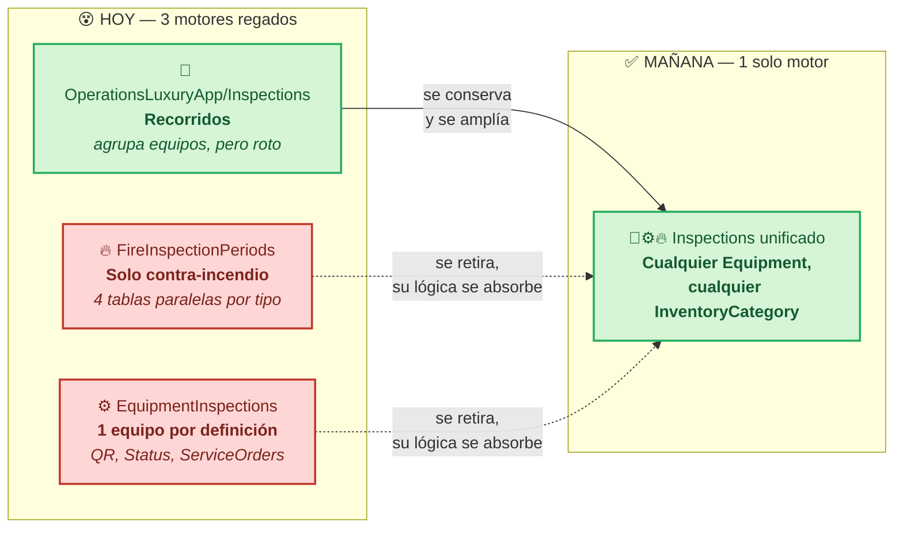
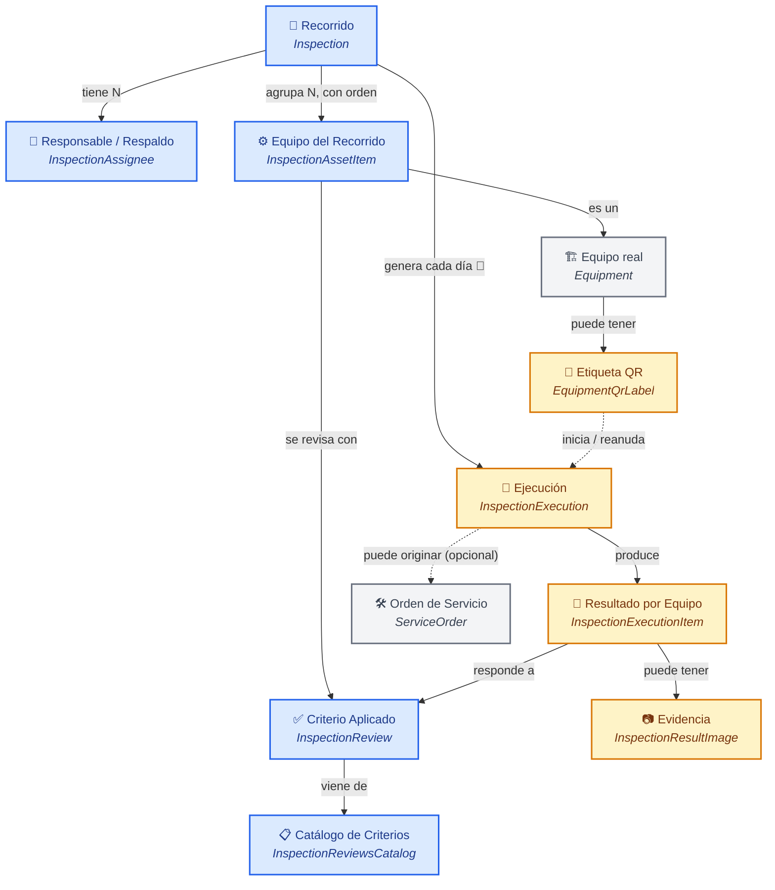
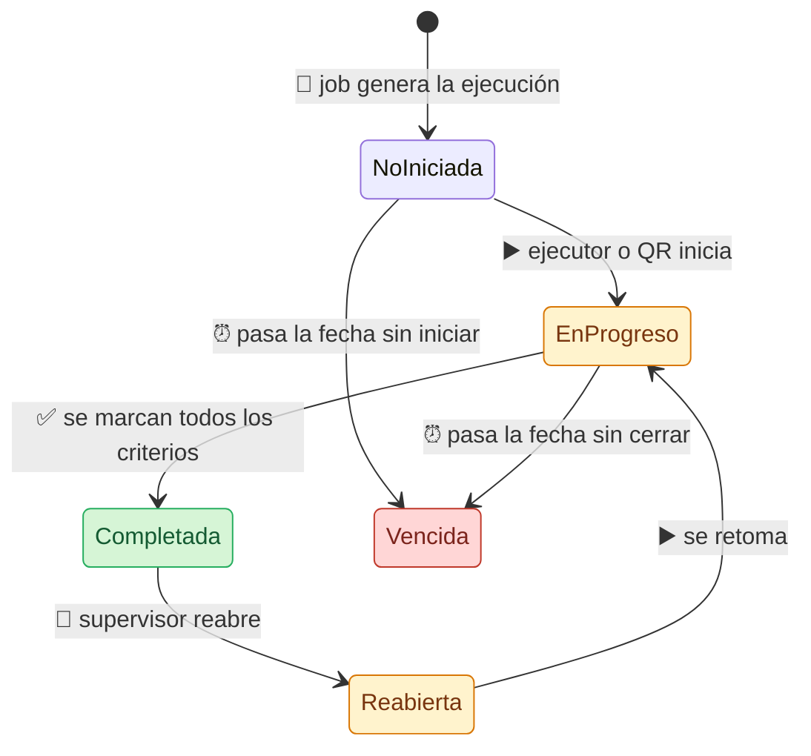
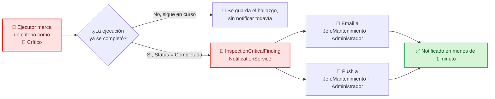

# 🧭 Plan: Motor Único de Inspecciones Periódicas (Recorridos)
### 🔀 Consolidación de 3 motores en 1 — del tepache regado a un solo camino

## 1. 📋 Metadata

| Campo | Valor |
|---|---|
| Módulo sobreviviente | `OperationsLuxuryApp/Inspections` (backend) + `maintenance.luxuryapp/inspection` (frontend, se mantiene ahí) |
| Tipo | B — Ampliar módulo existente, **absorbiendo y retirando otros dos** |
| Origen | Requerimiento de negocio directo del usuario (2026-09-29) + hallazgo propio en discovery: existían 3 motores redundantes |
| Módulos retirados | `MaintenanceLuxuryApp/FireInspectionPeriods` (completo) + `MaintenanceLuxuryApp/EquipmentInspections` (completo, incluye QR) |
| Datos existentes | Ninguno de los 3 motores tiene datos reales en producción (confirmado por el usuario) — se puede rediseñar sin plan de migración de datos |
| Documento de discovery previo | `docs/modulos-nuevos/recorridos-inspecciones/01b-entidad-estructura.md` |

---

## 🗺️ Panorama en un vistazo

> 🟢 **Verde = sobrevive y crece** · 🔴 **Rojo = se retira por completo** (backend + frontend + jobs + rutas)
> Ningún motor tiene datos reales hoy → la fusión es de código, no de datos.

---

## 2. 📌 Resumen Ejecutivo

**Problem Statement:**

Actualmente, el sistema sufre de tener **tres motores de inspección periódica distintos y redundantes** (`OperationsLuxuryApp/Inspections`, `MaintenanceLuxuryApp/FireInspectionPeriods`, `MaintenanceLuxuryApp/EquipmentInspections`) cuando el negocio intenta programar revisiones recurrentes sobre `Equipment`, lo que resulta en que ninguno está completo por sí solo (cada uno tiene piezas que los otros dos no tienen), ninguno tiene datos reales, y mantenerlos por separado repite exactamente el problema que la unificación de activos en `Equipment` (T-203) buscaba resolver un nivel más abajo.

Esto afecta a todo cliente que necesite programar recorridos de mantenimiento preventivo sobre cualquier categoría de `Equipment` (no solo contra incendio).

**KPIs:**

| Métrica | Baseline | Target | Timeline | Verificación |
|---|---|---|---|---|
| Motores de inspección periódica en el repo | 3 | 1 | Fin de Fase 1 | `grep` de entidades: 0 referencias a `FireInspectionPeriod*`/`EquipmentInspectionDefinition/Execution` fuera de migraciones históricas |
| Recorridos que agrupan N equipos con orden | Solo 1 de 3 motores lo soporta | El motor único lo soporta para cualquier `InventoryCategory` | Fin de Fase 1 | Test de integración: crear recorrido con equipos de 2 categorías distintas |
| Ejecuciones generadas automáticamente por día | 0% en Recorridos, 100% en FireInspectionPeriods (sin datos) | 100% en el motor único | Fin de Fase 3 | Log de Hangfire + conteo en BD |
| Hallazgos críticos notificados a JefeMantenimiento/Administrador | 0% (no existe en ningún motor) | 100% en <1 minuto desde cierre | Fin de Fase 4 | Prueba end-to-end |
| Inicio de ejecución por QR | Solo en `EquipmentInspections`, 1 equipo por QR | Disponible en el motor único, cualquier equipo de cualquier recorrido | Fin de Fase 5 | Prueba manual con QR de prueba |

## 3. 🎯 Objetivo

Consolidar los 3 motores existentes en **uno solo**, viviendo en `OperationsLuxuryApp/Inspections`, que:
1. Agrupe N equipos de **cualquier `InventoryCategory`** en un recorrido, con orden (`Position`) — la única capacidad que hoy solo tiene Recorridos.
2. Use el modelo de recurrencia flexible de Machinery (`RecurrenceUnit`/`RecurrenceInterval`/`DayOfMonth`/días de semana) en vez del enum simple Daily/Weekly/Monthly.
3. Tenga responsable + respaldos (`Assignees` con `IsPrimary`, patrón de Machinery) con reasignación diaria.
4. Tenga estados tipo ticket (`NotStarted`/`InProgress`/`Completed`/`Reopened`) y severidad por hallazgo.
5. Genere ejecuciones automáticamente cada día (job, patrón de `FireInspectionCycleGenerationJob`).
6. Soporte inicio por QR (patrón de `EquipmentQrLabel`/`StartFromQrAsync`).
7. Mantenga el vínculo opcional a `ServiceOrder` (ya existe como FK nullable, se preserva la forma).
8. Notifique hallazgos críticos por email + push a `JefeMantenimiento`/`Administrador`.
9. Retire por completo `FireInspectionPeriods` y `EquipmentInspections` (backend + frontend), sin dejar código muerto.

## 4. 🗺️ Alcance

**Dentro de alcance:**
- Backend: `Modules/OperationsLuxuryApp/Inspections/` — entidades, servicios, DTOs, endpoints (ampliado con las capacidades portadas).
- Frontend: `maintenance.luxuryapp/inspection/` (se mantiene ahí, se amplía y rediseña).
- **Retiro completo** de `Modules/MaintenanceLuxuryApp/FireInspectionPeriods/` (4 servicios, 4 interfaces, 4 grupos de DTOs, 4 archivos de endpoints, 12 entidades) y su frontend (`maintenance.luxuryapp/fire-equipment/inspection-periods/*`, ~18 archivos).
- **Retiro completo** de `Modules/MaintenanceLuxuryApp/EquipmentInspections/` (3 servicios, 3 interfaces, entidades incl. `EquipmentQrLabel`) y su frontend (`maintenance.luxuryapp/machinery/equipment-inspections/*`, ~15 archivos).
- Retiro del job `FireInspectionCycleGenerationJob` del catálogo de Hangfire, reemplazado por el nuevo job unificado.
- Migración EF: nuevas columnas/tablas en el modelo de `Inspection` + tablas `DROP` de los 2 motores retirados (sin backfill, tablas vacías).
- Renombrar `InspectionCondominiumAsset` → nombre que refleje la realidad (ya no es "condominio", es "equipo dentro de un recorrido") — a definir en Fase 1, mismo archivo/tabla física reutilizada.

**Fuera de alcance (confirmado):**
- Generación automática de `ServiceOrder` desde un hallazgo crítico (se preserva el FK/relación, no se automatiza el disparo en este ciclo).
- Migración de datos reales (no existen en ninguno de los 3 motores).

## 5. 🚧 Restricciones

- No se puede modificar `SelectItem`/`SelectItemEnum` existentes.
- `#nullable disable`, prohibido `?` en propiedades `string`.
- AutoMapper prohibido en `ProjectTo`; usar `.Select()` manual.
- Roles desde `ApplicationRoleEnum` (`JefeMantenimiento=17`, `Administrador=10`, `GerenteMantenimiento=6`, `TecnicoMantenimiento=18`).
- Notificaciones vía primitivas ya existentes (`ISendEmailService`, `ISendOneSignalWebService`, `ISendOneSignalService`, `ISendSignalRService`), wrapper propio en Inspections (no importar namespace de HumanResources).
- El FK nullable `ServiceOrder.EquipmentInspectionExecutionId` debe preservarse en forma (renombrado a la nueva tabla de ejecución) — no romper la relación existente aunque no se use activamente todavía.
- Migraciones reversibles en `Down()`. Como no hay datos reales, los `DROP TABLE` de los motores retirados no requieren backfill previo.

## 6. 🏛️ Arquitectura & Diseño Técnico — Modelo Unificado

### Entidades (nombres finales, todas bajo `OperationsLuxuryApp/Inspections`)

| Entidad | Reemplaza / absorbe | Campos nuevos clave |
|---|---|---|
| `Inspection` (recorrido/plantilla) | `Inspection` (Recorridos) + `EquipmentInspectionDefinition` (Machinery) + `FireInspectionPeriod` (Fire) | `RecurrenceUnit`, `RecurrenceInterval`, `DayOfMonth` (reemplaza `FrequencyType` simple); `Assignees` (nuevo, HashSet con `IsPrimary`) |
| `InspectionAssetItem` (renombrado de `InspectionCondominiumAsset`) | `InspectionCondominiumAsset` + concepto 1:1 de `EquipmentInspectionDefinition.MachineryId` + `FireInspectionPeriodExtinguisher/Hydrant/Station/Detector` (4 tablas → 1) | `EquipmentId` (FK real a `Equipment`, reemplaza el `CondominiumAssetId` roto), `Position` (ya existía) |
| `InspectionReviewsCatalog` / `InspectionReview` | Igual + concepto de `EquipmentInspectionCriterion` (pero reutilizable entre equipos, a diferencia de Machinery) | Sin cambio estructural |
| `CustomerInspection` → renombrado `InspectionExecution` | `CustomerInspection` (Recorridos) + `EquipmentInspectionExecution` (Machinery) + `FireInspectionCycle` (Fire) | `Status` (enum `NotStarted/InProgress/Completed/Reopened`), `AssignedToUserId`/`ExecutedByUserId` (separados, patrón Machinery), `IsClosed`, `AdministrativeModificationReason/Count`, `GeneratedFromQrLabelId` |
| `InspectionResult` → renombrado `InspectionExecutionItem` | `InspectionResult` (Recorridos) + `EquipmentInspectionExecutionItem` (Machinery) + `FireCycleInspection*` (Fire) | `IsCritical` (bool, nuevo — hallazgo importante) |
| `InspectionResultImage` | Sin cambio | — |
| `EquipmentQrLabel` (se mueve/adapta a Inspections) | Igual entidad, se re-scope: el deep link ya no resuelve 1 ejecución fija, resuelve "la ejecución activa del recorrido que incluye este equipo hoy" | Sin cambio de columnas, cambia la lógica de resolución en el servicio |

### 🗂️ Glosario de Clases en Español

> Para entender las relaciones sin tener que leer C#: así se llama cada cosa en negocio, y así se llama en código.

| En español | Clase en código | Qué es en negocio |
|---|---|---|
| 🧭 **Recorrido** | `Inspection` | La plantilla: qué se revisa, con qué frecuencia, quién es responsable |
| 🧍 **Responsable / Respaldo** | `InspectionAssignee` *(nuevo)* | Usuario(s) asignado(s) al recorrido; uno marcado como principal (`IsPrimary`) |
| ⚙️ **Equipo del Recorrido** | `InspectionAssetItem` *(renombrado)* | Un equipo específico dentro de un recorrido, con su posición/orden |
| 🏗️ **Equipo (real)** | `Equipment` *(externo, T-203)* | El activo físico: extintor, hidrante, maquinaria, amenidad, área, etc. |
| 📋 **Catálogo de Criterios** | `InspectionReviewsCatalog` | Lista maestra reutilizable de "qué se revisa" |
| ✅ **Criterio Aplicado** | `InspectionReview` | Qué criterio del catálogo aplica a qué equipo del recorrido |
| 🏃 **Ejecución del Recorrido** | `InspectionExecution` *(renombrado)* | Una ocurrencia concreta del recorrido en una fecha, con estado y responsable |
| 📝 **Resultado por Equipo** | `InspectionExecutionItem` *(renombrado)* | El hallazgo de un criterio en una ejecución (marca si es crítico) |
| 📷 **Evidencia Fotográfica** | `InspectionResultImage` | Foto asociada a un resultado |
| 📲 **Etiqueta QR del Equipo** | `EquipmentQrLabel` | Código QR físico pegado en un equipo para iniciar su revisión |
| 🛠️ **Orden de Servicio** | `ServiceOrder` *(externo)* | Trabajo correctivo, opcionalmente ligado a la ejecución que lo originó |

### 🧭 Diagrama de Relaciones (cómo se conectan entre sí)

> 🔵 **Azul = el "diseño" del recorrido** (se configura una vez) · 🟠 **Naranja = la "ejecución" del día a día** (se genera y se trabaja) · ⚪ **Gris = entidades externas** que ya existían antes de este plan.

### 📐 Matriz de Reglas de Negocio

**Nivel 1 — Invariantes de Dominio**

| RN | Regla |
|---|---|
| RN-INS-001 | Todo `InspectionAssetItem.EquipmentId` es real y del mismo `CustomerId` que su `Inspection` |
| RN-INS-002 | Un recorrido pertenece a un único `CustomerId` |
| RN-INS-003 | `Position` único y consecutivo por recorrido |
| RN-INS-004 | Un recorrido admite equipos de cualquier `InventoryCategory` en simultáneo (no se filtra por tipo) |

**Nivel 2 — Flujo y Estados**

| RN | Regla |
|---|---|
| RN-INS-010 | `InspectionExecution.Status`: `NotStarted → InProgress → Completed`, `Completed → Reopened → InProgress` |
| RN-INS-011 | Reasignación (`AssignedToUserId`) solo en `NotStarted`/`InProgress` |
| RN-INS-012 | Generación automática diaria vía job, horizonte de 15 días (patrón `FireInspectionCycleGenerationJob`), dirigida por `RecurrenceUnit/Interval/DayOfMonth` |
| RN-INS-013 | `AssignedToUserId` se copia del `Assignee` con `IsPrimary=true` al generar |
| RN-INS-014 | Ciclos/ejecuciones vencidas sin completar se marcan automáticamente (estado `Vencido`/`NoRealizada`, patrón Fire) |
| RN-INS-015 | Iniciar una ejecución por escaneo de QR (`GeneratedFromQrLabelId`) resuelve la ejecución activa del recorrido que incluye ese equipo hoy; si no existe, la crea |

**Nivel 3 — Seguridad / Autorización**

| RN | Regla | Roles |
|---|---|---|
| RN-INS-020 | CRUD de recorridos | `Administrador`, `GerenteMantenimiento`, `JefeMantenimiento` |
| RN-INS-021 | Marcar resultados: solo el ejecutor asignado; reasignar: roles supervisores | `TecnicoMantenimiento` (ejecuta) / `JefeMantenimiento`, `GerenteMantenimiento` (reasignan) |
| RN-INS-022 | Al completar una ejecución con ≥1 hallazgo `IsCritical`, notificar por email+push a todos los `JefeMantenimiento`+`Administrador` del `CustomerId` |

**Nivel 4 — Validación de Datos**

| RN | Regla |
|---|---|
| RN-INS-030 | `InspectionAssetItem.EquipmentId` requerido, mismo tenant que el recorrido |
| RN-INS-031 | `InspectionExecutionItem.IsCritical` default `false` |
| RN-INS-032 | Un solo endpoint de creación de punto de revisión (se elimina la ruta rota del frontend viejo) |
| RN-INS-033 | `ServiceOrder.InspectionExecutionId` (renombrado del actual `EquipmentInspectionExecutionId`) permanece nullable, sin lógica automática de creación |

## 7. 🛤️ Fases

### Fase 0 — 🧹 Preparación del retiro
- Inventariar y confirmar (grep) que ningún dato real existe en `FireInspectionPeriods*` ni `EquipmentInspections*` en dev/staging antes de tocar prod.
- Congelar cambios nuevos en ambos módulos (no aceptar más trabajo ahí).

**Checklist:**
- [ ] Conteo de filas = 0 en las 20 tablas de ambos motores (dev y producción)

### Fase 1 — 🏗️ Modelo unificado (entidades + migración)
- Migración EF: agregar a `Inspection` los campos de recurrencia flexible + `Assignees`; renombrar `InspectionCondominiumAsset` → `InspectionAssetItem` con `EquipmentId`; renombrar `CustomerInspection` → `InspectionExecution` con `Status`/`AssignedToUserId`/`ExecutedByUserId`/auditoría; renombrar `InspectionResult` → `InspectionExecutionItem` con `IsCritical`.
- Migración EF: `DROP` de las 20 tablas de `FireInspectionPeriods`/`EquipmentInspections` (incluye `EquipmentQrLabels`, que se recrea en Inspections).
- Recrear `EquipmentQrLabel` bajo `OperationsLuxuryApp/Inspections`.
- Renombrar `ServiceOrder.EquipmentInspectionExecutionId` → `ServiceOrder.InspectionExecutionId` (mismo shape, nullable).
- Descomentar/reescribir las referencias rotas a `CondominiumAsset`.

**Checklist:**
- [ ] Migración aplica y revierte limpio en dev
- [ ] 0 referencias a las entidades retiradas en el código (`grep`)
- [ ] Test de integración: recorrido con equipos de 2 `InventoryCategory` distintas

### Fase 2 — 🔗 Endpoint único + selector de equipos
- Un solo endpoint para "agregar equipo a recorrido"; frontend actualizado.
- Selector de equipos consulta `Equipment` por `CustomerId`, sin filtrar por categoría.

**Checklist:**
- [ ] Botón "Agregar equipo" funcional, sin rutas duplicadas ni 404

### Fase 3 — 🤖📅 Generación automática + asignación
- Job unificado (clona `FireInspectionCycleGenerationJob`, dirigido por la recurrencia de `Inspection`), registrado en `HangfireJobCatalog.cs`; se retira el job de Fire.
- `ReassignAsync` (RN-INS-011).
- Marcado de vencidos (RN-INS-014).

**🔄 Ciclo de vida de una ejecución (`InspectionExecution.Status`):**

**Checklist:**
- [ ] Job corre en dev, genera ejecuciones asignadas al `Assignee` primario
- [ ] Reasignación funcional
- [ ] Ejecuciones vencidas se marcan correctamente

### Fase 4 — 🚨📣 Hallazgos críticos y notificación
- `InspectionExecutionItem.IsCritical` + bitácora/reporte dedicado.
- `InspectionCriticalFindingNotificationService` (email+push a `JefeMantenimiento`+`Administrador`), disparado al `Status = Completed`.

**🔄 Flujo de un hallazgo crítico:**

**Checklist:**
- [ ] Notificación llega en <1 minuto en prueba
- [ ] Reporte de hallazgos críticos filtra por cliente

### Fase 5 — 📲 QR unificado
- Adaptar `EquipmentQrLabel`/`StartFromQrAsync` para resolver "la ejecución activa del recorrido de este equipo hoy" (RN-INS-015), no una ejecución 1:1 fija.
- UI de impresión de QR (portada de Machinery) apuntando a la entidad recreada en Inspections.

**Checklist:**
- [ ] Escaneo de QR abre/reanuda la ejecución correcta
- [ ] Impresión de QR funcional

### Fase 6 — 🎨🧹 Retiro de frontend legado + rediseño del ejecutor
- Eliminar `maintenance.luxuryapp/fire-equipment/inspection-periods/*` (~18 archivos) y `maintenance.luxuryapp/machinery/equipment-inspections/*` (~15 archivos), y sus rutas en `logbook.routing.ts`/`maintenance.routing.ts`.
- Rediseñar `mis-inspecciones-lista`/`ejecutar` siguiendo el patrón de `my-assigned-tasks-list.html` (estado, tarjetas móvil, impresión).

**Checklist:**
- [ ] 0 rutas rotas tras eliminar frontend legado (`grep` de rutas + build sin errores)
- [ ] Paridad visual/funcional confirmada por el usuario

## 8. 🚦 Criterios de Paso (por flujo)

**Happy path:** Recorrido semanal con equipos de 2 categorías (`Equipos` + `FireProtection`) → job genera la ejecución del día, asignada al responsable primario → ejecutor la ve, la ejecuta (o la inicia por QR), marca un hallazgo crítico → al completar, `JefeMantenimiento`+`Administrador` notificados en <1 min.
**PASS si:** los 4 pasos ocurren sin error, con datos correctos.

**Sad path:** Responsable base no se presenta → supervisor reasigna la ejecución `NotStarted` → nuevo ejecutor la ve.
**PASS si:** reasignación visible de inmediato, desaparece de la lista del anterior.

**Edge path:** Se completa una inspección sin hallazgos críticos.
**PASS si:** no se dispara notificación.

**Edge path (migración):** Tras el `DROP` de las tablas legado, el build compila sin referencias huérfanas y ningún endpoint legado responde (404 esperado, no 500).
**PASS si:** `dotnet build` sin errores, smoke test de rutas viejas confirma 404 limpio.

## 9. ⚠️ Riesgos y Mitigaciones (Pre-Mortem)

> 🔴 **CRÍTICO antes de aplicar en producción:** el `DROP TABLE` de los 20 tablas legado es irreversible en la práctica. Fase 0 exige conteo de filas = 0 verificado — sin ese conteo confirmado, no se aplica la migración.

| Supuesto fallido | Impacto | Probabilidad | Mitigación | Owner |
|---|---|---|---|---|
| Se pierde el vínculo `ServiceOrder`↔ejecución al renombrar la tabla | Órdenes de servicio huérfanas (aunque no hay datos reales hoy) | Baja | Migración explícita `RENAME COLUMN`, no `DROP`+`ADD`, para preservar cualquier fila futura entre el diseño y el despliegue | Backend |
| El job unificado no cubre un caso de recurrencia que sí cubría Fire (`Eventual`) | Recorridos "eventuales" nunca se generan | Media | Portar explícitamente el caso `Eventual` de `FireInspectionCycleGenerationJob` al job nuevo | Backend |
| Frontend legado deja rutas colgantes en el menú tras el retiro | Usuario hace clic y ve 404 | Media | Checklist explícito de `grep` de rutas antes de cerrar Fase 6 | Frontend |
| El re-scope del QR (1 equipo → 1 recorrido con N equipos) rompe la semántica esperada por quien imprimió QR viejos | N/A — no hay QR reales impresos (confirmado) | N/A | — |
| Migración `DROP TABLE` corre en producción antes de confirmar que ninguna tabla tiene filas | Pérdida de datos si el supuesto "sin datos reales" era incorrecto | Baja (ya confirmado por el usuario) | Fase 0 exige conteo de filas = 0 verificado antes de aplicar en producción | Backend + usuario |

## 10. 🔗 Dependencias e Impactos

- Depende de: `Equipment`/`InventoryCategory` (ya estable, T-203).
- Depende de: primitivas de notificación ya en producción (PanicAlerts, HR).
- Impacta: `HangfireJobCatalog.cs` (retiro de 1 job, alta de 1 job nuevo).
- Impacta: `ServiceOrder` (rename de FK nullable, sin cambio de comportamiento).
- Impacta: `logbook.routing.ts`, `maintenance.routing.ts` (retiro de ~10 rutas legado).
- No impacta: `ApplicationDbContext` de otros módulos no relacionados.

## 11. 🏁 Cierre Esperado

Un solo motor de inspecciones periódicas (`OperationsLuxuryApp/Inspections`) cubre: recorridos multi-equipo con orden, sobre cualquier `InventoryCategory`; asignación con respaldo y reasignación diaria; generación automática; estados tipo ticket; hallazgos críticos con notificación; inicio por QR; vínculo preservado a `ServiceOrders`. `FireInspectionPeriods` y `EquipmentInspections` quedan completamente retirados (backend, frontend, job, rutas), sin dejar código muerto ni motores redundantes — exactamente la misma lógica de centralización que T-203 aplicó a los activos, aplicada ahora a su programación de revisión.
