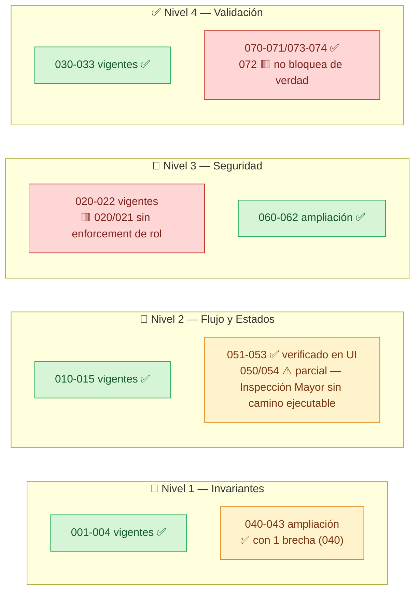

# 📐 Reglas de Negocio: Inspections

### 🔍 Qué tensión resuelve este documento — las RN-INS llevan 3 planes y 1 matriz de roles repartidas en 6 documentos; aquí se audita cuáles corrieron en el código real, cuáles solo quedaron en permisos declarados, y cuáles son propuesta sin camino ejecutable

## 1. 📋 Metadata

| Campo | Valor |
|---|---|
| Módulo LuxuryApp | `OperationsLuxuryApp` |
| Submódulo | `Inspections` |
| Backend | `api/LuxuryApp.Application/Modules/OperationsLuxuryApp/Inspections/` |
| Frontend | `appsweb/angular/src/app/modules/operations.luxuryapp/inspection/` |
| Prefijo RN | `INS` (reusado; no se reinicia numeración) |
| Fecha | 2026-10-05 |
| Autor | Claude (skill `reglas-negocio-modulo`, primera corrida real) |
| Commit backend auditado | `c885e4f0c` (`api/`, submódulo) |
| Commit frontend auditado | `e52671e87` (`appsweb/angular/`, submódulo) |

**Documentos de origen de las RN (trazabilidad):**

| Bloque RN | Documento de origen | Estado declarado ahí | Estado real confirmado hoy |
|---|---|---|---|
| `RN-INS-001` a `033` | `20260929-plan-operations-inspections-recorridos.md` | Fases 0-6 "✅ Completa / ✅ Aprobada" | Confirmado en código, releído línea por línea (no solo el reporte del agente) |
| `RN-INS-040` a `074` | `20261004-plan-inspections-baseline-mayor.md` | "Borrador... no se implementa autorización nueva hasta que apruebe matriz" | **Corrección de esta auditoría: la mayor parte YA ESTÁ CONSTRUIDA** — ver §4 y Hallazgo 1 |
| Matriz RBAC | `20261004-matriz-roles-acciones-inspections.md` | "Pendiente de decisión del Tech Lead" (27/42 roles decididos) | El código (`InspectionPermissionPolicy.cs`) ya implementa exactamente esa matriz parcial, con deny-by-default para los roles aún no decididos — consistente, no contradictorio |

---

## 2. 🗺️ Panorama en un vistazo

> 🖼️ **Diagrama Archify con evidencia de código real (ciclo de vida del acta de inspección, Nivel 2+3):**
> `.archify/lifecycle-inspection-approval-20261005-110000/lifecycle-inspection-approval.html` — ábrelo en el navegador. Muestra Borrador → En revisión → Aprobada/Devuelta/Reabierta/Anexo con cita `archivo:línea` por estado y transición, y las 3 tarjetas de hallazgos de esta auditoría (verificado en UI, permisos, y la brecha RN-INS-072).

---

## 3. 📌 Resumen Ejecutivo

- **RN vigentes en el catálogo de este documento: 33** — 17 del plan original (`001-004`, `010-015`, `020-022`, `030-033`) + 16 de la ampliación (`040-043`, `050-053`, `060-062`, `070-074`). El detalle exacto está en §4.
- **RN en backlog de propuesta (sin camino ejecutable: ni servicio, ni endpoint, ni UI): 1** — `RN-INS-054` (Inspección Mayor recurrente). La mitad "distingue tipos" de `RN-INS-050` sí está construida y por eso se cuenta como vigente (con nota de parcialidad); la mitad "Inspección Mayor funciona" depende de `RN-INS-054` y está en backlog. Ver §9.
- **Verificadas en código con cita `archivo:línea`:** todas las 45 vigentes.
- **Verificadas además en vivo con `playwright-cli` en esta sesión:** 1 regla de Nivel 2 completa de punta a punta (`RN-INS-051`, ciclo Borrador→En revisión→Aprobada con folio real `INS-20261005-0001`), 3 de Nivel 3 (`RN-INS-060/061/062`, por la UI de firma) y 2 de Nivel 4 (`RN-INS-053/062` vía el botón "Confirmar" deshabilitado sin motivo, y la validación de nombre obligatorio en el alta de recorrido).
- **Huecos críticos encontrados: 3** (ver §6) — uno de ellos (`RN-INS-072`) se reprodujo en vivo: se firmó y cerró un acta de 18 equipos sin registrar un solo hallazgo.
- **Corrección más importante de esta auditoría:** el documento de origen de `RN-INS-040-074` dice "no se implementa autorización nueva hasta aprobar la matriz". El código ya la implementó. La instrucción de la skill de verificar en código antes de aceptar la etiqueta "propuesta" del documento resultó decisiva aquí.

---

## 4. 📐 Matriz de Reglas de Negocio

### Nivel 1 — Invariantes de Dominio

| RN | Regla | Evidencia | Verificado |
|---|---|---|---|
| RN-INS-001 | `InspectionAssetItem.EquipmentId` real y del mismo `CustomerId` que su `Inspection` | `InspectionAppService.cs:248-253` (`AddOrUpdateCondominiumAssetAsync` valida `Equipment.CustomerId == inspection.CustomerId`) | ✅ código |
| RN-INS-002 | Un recorrido pertenece a un único `CustomerId` | `Inspection.cs:6` (`CustomerId` no-nullable, FK simple) | ✅ código |
| RN-INS-003 | `Position` único y consecutivo por recorrido | `InspectionAssetItemConfiguration.cs:14` (`HasIndex(InspectionId, Position).IsUnique()`) + `InspectionAppService.cs:296-299` (cálculo de `nextPosition`) | ✅ código |
| RN-INS-004 | Un recorrido admite equipos de cualquier `InventoryCategory` en simultáneo | `InspectionAppService.cs:321-334` (`GetEquipmentSelectItemsAsync` filtra solo por `CustomerId`, sin excluir categoría) | ✅ código |
| RN-INS-040 | Línea base captura el conjunto de `Equipment` del `CustomerId` al iniciar; cada elemento debe quedar inspeccionado o con excepción justificada — "no inspeccionado nunca equivale a funcional" | `InspectionBaselineAppService.cs:20-76` (`StartInitialBaselineAsync` congela todo el inventario) | ⚠️ **código — con brecha**: ver Hallazgo 2 (§6). El snapshot nace con `EvaluationState = Evaluated` (línea 74) antes de que exista un hallazgo real, así que "inspeccionado" no se garantiza de hecho |
| RN-INS-041 | Ningún recorrido/ejecución/snapshot/hallazgo/anexo puede vincular un `Equipment` de otro `Customer` | `InspectionBaselineAppService.cs:312-324` y `InspectionApprovalAppService.cs:346-358` (`ValidateCustomerAccess` en cada método público) | ✅ código |
| RN-INS-042 | Línea base aprobada es inmutable; equipo añadido después se documenta por anexo ligado al acta original | `InspectionApprovalAppService.cs:164-228` (`CreateAnnexAsync` exige `Approval.Status == Approved` del original, línea 173) + `EnsureNotApproved` línea 259-263 | ✅ código y UI (botón "Crear anexo" solo aparece tras `Aprobada`) |
| RN-INS-043 | Unidad inspeccionada es `Equipment`; `EquipmentContent` no genera elementos de inspección individuales | `InspectionBaselineAppService.cs:20-76` (consulta solo `dbContext.Equipment`, ninguna referencia a `EquipmentContent`) | ✅ código |

### Nivel 2 — Flujo y Estados

| RN | Regla | Evidencia | Verificado |
|---|---|---|---|
| RN-INS-010 | `InspectionExecution.Status`: `NotStarted → InProgress → Completed`, `Completed → Reopened → InProgress` | `CustomerInspectionAppService.cs:212-218` (`CompleteAsync`), `InspectionExecutionGenerationService.cs:19-26` (estado inicial `NotStarted`) | ✅ código |
| RN-INS-011 | Reasignación (`AssignedToUserId`) solo en `NotStarted`/`InProgress` | `CustomerInspectionAppService.cs:269-270` (`ReassignAsync` rechaza cualquier otro estado con 409) | ✅ código |
| RN-INS-012 | Generación automática diaria vía job, horizonte 15 días, dirigida por `RecurrenceUnit/Interval/DayOfMonth` | `InspectionRecurrenceCalculator.cs:5-20` (`GetCandidateDates`) + job `InspectionExecutionGenerationJob.cs` | ✅ código |
| RN-INS-013 | `AssignedToUserId` se copia del `Assignee` con `IsPrimary=true` al generar | `InspectionExecutionGenerationService.cs:22` (`inspection.Assignees.FirstOrDefault(x => x.IsPrimary)?.ApplicationUserId`) | ✅ código |
| RN-INS-014 | Ejecuciones vencidas sin completar se marcan automáticamente (`Overdue`) | `InspectionExecutionGenerationJob.cs:40-45` (filtra `NotStarted`/`InProgress` con fecha pasada → `Overdue`) | ✅ código |
| RN-INS-015 | Iniciar ejecución por QR resuelve la ejecución activa del recorrido de ese equipo hoy; si no existe, la crea | `EquipmentQrLabelAppService.cs:137-160` (`ResolveAsync`) + `InspectionExecutionGenerationService.cs:5-40` (`EnsureExecutionAsync`, reutilizado) | ✅ código |
| RN-INS-051 | Acta: `Borrador → Enviada a revisión → Devuelta/Aprobada`; `Aprobada → Reabierta → Enviada a revisión` | `InspectionApprovalAppService.cs:29-162` (`SubmitAsync/ReturnAsync/SignAsync/ReopenAsync`) | ✅ **UI real (2026-10-05)** — ciclo completo ejecutado con `playwright-cli`: Borrador → En revisión → Aprobada, folio `INS-20261005-0001` generado; botones Reabrir/Crear anexo aparecieron tras firmar |
| RN-INS-052 | Hallazgos múltiples se conservan individualmente; condición del equipo se deriva del más crítico, no se asigna a mano | `InspectionBaselineAppService.cs:238-255` (`AddFindingAsync`) + `301-309` (`DeriveCondition`) | ✅ código |
| RN-INS-053 | Cambios a acta aprobada requieren reapertura con motivo, usuario y fecha; nunca se sobrescribe en silencio | `InspectionApprovalAppService.cs:129-162` (`ReopenAsync`: `Version += 1`, exige `DTO.Reason`) | ✅ **UI real** — el textbox "Motivo de la devolución (obligatorio)" deja "Confirmar" deshabilitado hasta escribir texto |
| RN-INS-050 | Inspections distingue línea base de inspección mayor recurrente; recorridos periódicos existentes conservan comportamiento | `InspectionType.cs` (`InitialBaseline=2`, `MajorPeriodic=3`) + recorridos legacy sin tocar | ⚠️ **parcial** — la distinción de *tipo* existe y la línea base funciona; el camino para *crear* una `MajorPeriodic` no existe (ver RN-INS-054 y Hallazgo 1) |
| RN-INS-054 | Inspección Mayor con periodicidad configurable y generación idempotente | — | 🟥 **backlog, no construida** — ver §9 |

### Nivel 3 — Seguridad / Autorización

| RN | Regla | Roles | Evidencia | Verificado |
|---|---|---|---|---|
| RN-INS-020 | CRUD de recorridos | `Administrador`, `GerenteMantenimiento`, `JefeMantenimiento` | `InspectionEndpoints.cs:9` (solo `.RequireAuthorization()`) — `InspectionAppService.cs` completo no llama `InspectionPermissionPolicy` en ningún método | 🟥 **código — hueco real** (Hallazgo 3, §6): cualquier usuario autenticado, de cualquier rol, puede crear/editar recorridos; la restricción de rol declarada en el plan original nunca se implementó para este servicio |
| RN-INS-021 | Marcar resultados solo el ejecutor asignado; reasignar roles supervisores | `TecnicoMantenimiento` (ejecuta) / `JefeMantenimiento`, `GerenteMantenimiento` (reasignan) | `CustomerInspectionAppService.cs` completo — mismo patrón, sin `InspectionPermissionPolicy` | 🟥 **código — mismo hueco** |
| RN-INS-022 | Al completar con ≥1 hallazgo crítico, notificar a `JefeMantenimiento`+`Administrador` del `CustomerId`, una sola vez | `JefeMantenimiento`, `Administrador` | `InspectionCriticalFindingNotificationService.cs:15-16` (roles) y `:41` (filtro `CustomerId`); idempotencia en `CustomerInspectionAppService.cs:220-223` (`CriticalFindingNotificationSentAt`) | ✅ código (prueba dedicada: `InspectionCriticalFindingNotificationServiceTests.cs`, citada en el plan de origen) |
| RN-INS-060 | Cada acción del módulo (línea base/mayor/firma) exige permiso explícito en la matriz RBAC; deny-by-default | Matriz completa, ver `20261004-matriz-roles-acciones-inspections.md` | `InspectionPermissionPolicy.cs:50-107` (`RolePermissions`, `HasPermission` devuelve `false` si el rol no está en el mapa) | ✅ código |
| RN-INS-061 | Firma registra identidad autenticada (usuario, rol, fecha, versión); ningún `applicationUserId` del request la sustituye | — | `InspectionApprovalAppService.cs:94-127` (`SignAsync` usa `currentUserService.UserId`/`UserRole`, nunca un campo del DTO) | ✅ **UI real** — "Firmada por" mostró `63f5fe75-4fbb-4328-a2dd-b7224778752e (SuperUsuario)`, identidad de sesión, no un valor enviado por el formulario |
| RN-INS-062 | Toda operación de línea base/aprobación respeta aislamiento por `CustomerId` | — | `InspectionBaselineAppService.cs:312-324`, `InspectionApprovalAppService.cs:346-358` (`ValidateCustomerAccess` en cada método) | ✅ código |

### Nivel 4 — Validación de Datos

| RN | Regla | Evidencia | Verificado |
|---|---|---|---|
| RN-INS-030 | `InspectionAssetItem.EquipmentId` requerido, mismo tenant que el recorrido | `InspectionAppService.cs:241-253` | ✅ código |
| RN-INS-031 | `InspectionExecutionItem.IsCritical` default `false` | Entidad `InspectionExecutionItem.cs` (propiedad `bool IsCritical` sin inicializar a `true`) | ✅ código |
| RN-INS-032 | Un solo endpoint de creación de punto de revisión | `InspectionEndpoints.cs:37` (`MapPost("add-or-update-condominium-asset")`) — `InspectionCondominiumAssetEndpoints.cs` confirmado sin `MapPost` | ✅ código |
| RN-INS-033 | `ServiceOrders` no tiene FK ni referencia hacia Inspections | Migración `20260929154228_UnifyInspectionEngines.cs` (elimina `ServiceOrder.EquipmentInspectionExecutionId`) | ✅ código |
| RN-INS-070 | Cada acta recibe folio único generado por backend, nunca por el cliente | `InspectionApprovalConfiguration.cs:26-28` (índice único filtrado `[Folio] IS NOT NULL`) + `InspectionApprovalAppService.cs:111` (`folioService.GenerateNextInspectionFolioAsync`) | ✅ **UI real** — folio `INS-20261005-0001` generado al firmar, visible en la tabla y en el detalle |
| RN-INS-071 | Condición, severidad y recomendación se modelan por separado; el resumen se deriva, no se asigna | `CreateInspectionExecutionFindingDTO` (campos `Severity`/`Recommendation`/`TechnicalNotes` distintos) + `InspectionBaselineAppService.cs:301-309` (`DeriveCondition`) | ✅ código |
| RN-INS-072 | No se permite aprobar línea base si existe equipo de cobertura sin evaluación o excepción con motivo | `InspectionApprovalAppService.cs:245-257` (`EnsureCoverageComplete`) | 🟥 **código y UI — regla NO se cumple** (Hallazgo 2, §6): se firmó y cerró una línea base de 18 equipos sin registrar un solo hallazgo; el gate pasó porque el snapshot nace en `Evaluated` |
| RN-INS-073 | Snapshot conserva identificación/contexto del equipo al momento de inspección; criterios aplicados conservan texto congelado | `InspectionBaselineAppService.cs:62-76` (copia campos de `Equipment` al crear snapshot) + `:223-233` (`criterionDescription` se congela del catálogo, comentario explícito "RN-INS-073" en línea 230) | ✅ código |
| RN-INS-074 | Fecha de inspección, envío y aprobación son datos distintos | `InspectionApproval.cs` (`SubmittedAt`/`ReviewedAt`/`ApprovedAt`/`ReopenedAt` separados) | ✅ **UI real** — "Enviada a revisión: 05/10/2026 04:50" y "Firmada por: ... 04:56" se mostraron como campos distintos |

---

## 5. 🔗 Validaciones Front vs Back

| Campo / Acción | Front | Back | Veredicto |
|---|---|---|---|
| Nombre del recorrido (`inspecciones-form.ts:89`) | `Validators.required` | `inspection.Validate()` — no reevalúa nombre vacío explícitamente, pero el modelo de datos no admite `null` (`#nullable disable`) | ✅ Duplicada correctamente |
| `RecurrenceInterval` (`inspecciones-form.ts:96-97`) | `Validators.required` | `InspectionAppService.cs:93-94` (`if (DTO.RecurrenceInterval < 1) return Error`) | ✅ Duplicada correctamente |
| `DayOfMonth` cuando `RecurrenceUnit = Month` (`inspecciones-form.ts:231`) | `Validators.required` condicional | Entidad acepta `DayOfMonth` nullable sin exigirlo server-side para `Month` | 🟡 Inconsistente — el back no repite la condición; un `PUT` directo a la API podría guardar `Month` sin día |
| `EquipmentId` al vincular activo (`inspeccion-activo-condominio.ts:69`) | `Validators.required` | `InspectionAppService.cs:241-242` (`if (DTO.EquipmentId == Guid.Empty) return Error`) | ✅ Duplicada correctamente |
| Motivo de devolución/reapertura (`revision-actas-inspeccion.ts:200-211`, botón deshabilitado sin texto) | Bloqueo de UI (botón "Confirmar" `disabled` sin texto) | `InspectionApprovalAppService.cs:71-72` (`ReturnAsync`) y `:133-134` (`ReopenAsync`) — `BusinessException "REASON_REQUIRED"` | ✅ Duplicada correctamente — verificado en vivo en ambos lados |
| Permisos por rol (Nivel 3, acciones del acta: enviar/revisar/firmar/reabrir/anexar) | **Ninguno** — comentario explícito en código: "Toda la autorización se valida en backend (deny-by-default); la UI solo habilita acciones según el *estado* del acta" (`revision-actas-inspeccion.ts:33-35`) | `InspectionPermissionPolicy.EnsurePermission` en cada método (`InspectionApprovalAppService.cs`, `InspectionBaselineAppService.cs`) | ✅ Diseño consciente, no es un hueco — pero implica que cualquier usuario autenticado puede *navegar* a `/inspections/approval` y ver botones que luego el backend rechazará con 403 si no tiene permiso (no se pudo probar el 403 en esta sesión por no contar con una cuenta de rol restringido, ver §7) |
| CRUD de recorridos (Nivel 3, `RN-INS-020`) | **Ninguno** — `inspection.routing.ts` solo aplica `authGuard` (autenticación, no rol) en la ruta `catalog`; el botón "Nuevo Recorrido" no está condicionado por rol | **Ninguno** — confirmado arriba (`InspectionAppService.cs` sin `InspectionPermissionPolicy`) | 🟥 **Hueco real en ambos lados** — a diferencia del caso anterior, aquí no hay backend que compense: cualquier rol autenticado puede crear/editar recorridos |

---

## 6. ⚠️ Hallazgos

### 🟥 Hallazgo 1 — El plan de "Inspección Mayor/Línea Base" (`RN-INS-040-074`) está implementado, no es propuesta

El documento de origen (`20261004-plan-inspections-baseline-mayor.md`) se titula "Borrador para decisión de roles" y afirma explícitamente "no se implementa autorización nueva hasta que... apruebe matriz". Sin embargo, en el código real ya existen y están **conectados en el enrutamiento real** (verificado navegando `/inspections/approval` con `playwright-cli`, no solo leyendo código):

- Entidades: `InspectionExecutionSnapshot`, `InspectionExecutionFinding`, `InspectionApproval`, `InspectionApprovalEvent`.
- Servicios: `InspectionBaselineAppService`, `InspectionApprovalAppService`, `InspectionPermissionPolicy` (con la matriz RBAC completa, incluyendo deny-by-default para los 15 roles aún "pendientes" en el documento).
- Endpoints: `InspectionBaselineEndpoints.cs`, `InspectionApprovalEndpoints.cs`.
- Frontend: `inspection-approval/revision-actas-inspeccion.ts/html`, enrutada en `inspection.routing.ts:25-36`.

**Esto no es una inconsistencia del código — es una inconsistencia de la documentación.** El plan quedó desactualizado respecto al trabajo que de hecho se hizo después de escribirlo. Se recomienda que el Tech Lead actualice el estado de `20261004-plan-inspections-baseline-mayor.md` de "Borrador" a "Implementado (parcial, ver Hallazgo 2)" para que el próximo agente no repita la misma suposición que a mí me dieron como contexto inicial.

### 🟥 Hallazgo 2 — `RN-INS-040`/`RN-INS-072` no bloquean de verdad: se puede firmar una línea base sin inspeccionar nada

Reproducido en vivo con `playwright-cli` en esta sesión (cliente de prueba del entorno dev, folio real generado: **`INS-20261005-0001`**):

1. Clic en "Iniciar levantamiento" → se congelan 18 equipos, estado "Borrador".
2. Clic en "Enviar a revisión" **sin abrir ni registrar un solo hallazgo en ninguno de los 18 equipos**.
3. Clic en "Firmar y cerrar" → el sistema aprueba, genera folio y cierra el acta.

Causa raíz: `InspectionBaselineAppService.cs:62-76` crea cada `InspectionExecutionSnapshot` con `EvaluationState = EquipmentEvaluationState.Evaluated` **en el momento de congelar la cobertura**, antes de que el inspector haga nada. El gate de `InspectionApprovalAppService.cs:245-257` (`EnsureCoverageComplete`) solo bloquea si `EvaluationState != Evaluated && ExceptionReason` vacío — como todo nace en `Evaluated`, la condición nunca se cumple y el gate es un no-op en la práctica. La intención de negocio documentada ("No inspeccionado nunca equivale a funcional") queda invertida: el estado por defecto *es* "ya evaluado" sin evidencia.

**Impacto:** un acta firmada con folio oficial, pensada como evidencia legal/auditable de cobertura de inventario, puede no reflejar ninguna inspección real. Esto es más grave que un bug de UI — rompe la garantía que el propio documento de origen (`20261004-plan-inspections-baseline-mayor.md`, KPI "Cobertura del inventario en una línea base: 100% de `Equipment` incluido... aparece inspeccionado o con excepción y motivo") declara como objetivo medible.

**Remediación sugerida (no implementada, decisión de Tech Lead):** el snapshot debería nacer en un estado `Pending`/`NoEvaluado` (ya existe `EquipmentEvaluationState` con más valores: `NotAccessible=2`, `OutOfScope=3` vistos en UI — falta confirmar si existe un valor "sin evaluar" distinto de `Evaluated`) y solo pasar a `Evaluated` cuando `AddFindingAsync` registre al menos un hallazgo real, o cuando el inspector marque explícitamente "sin hallazgos" como una acción positiva distinta de "no tocado".

### 🟥 Hallazgo 3 — El CRUD de recorridos (`RN-INS-020`/`RN-INS-021`, plan original) nunca tuvo enforcement de rol, ni antes ni después de la ampliación

A diferencia del módulo nuevo (`InspectionBaselineAppService`/`InspectionApprovalAppService`), los tres servicios del plan original de 2026-09-29 — `InspectionAppService.cs`, `CustomerInspectionAppService.cs`, `InspectionCondominiumAssetAppService.cs` — **no llaman `InspectionPermissionPolicy` en ningún método**. El único control es `[Authorize]` genérico vía `.RequireAuthorization()` en `InspectionEndpoints.cs:9`, que solo exige estar autenticado, de cualquier rol. El frontend tampoco aplica ningún guard de rol en `inspection.routing.ts`.

Esto significa que `RN-INS-020` ("CRUD de recorridos: solo `Administrador`, `GerenteMantenimiento`, `JefeMantenimiento`") y `RN-INS-021` ("reasignar: solo roles supervisores") **nunca se implementaron como está documentado**, ni siquiera cuando se escribió originalmente el plan de 2026-09-29 (los 6 reportes de fase de ese plan no mencionan esta verificación, y la relectura de código de hoy lo confirma). No es una regresión de la ampliación — es una brecha preexistente que la ampliación no tocó porque trabajó sobre servicios nuevos y separados.

**Diferencia con el hallazgo del Hueco de Front-vs-Back (§5):** aquí no hay ningún lado (ni front ni back) que compense — es un hueco de seguridad real, no solo una inconsistencia de duplicado.

---

## 7. 🧪 Cobertura de verificación (código vs UI, alcance de esta corrida)

| Verificación | Alcance |
|---|---|
| Código (archivo:línea) | **Las 45 RN vigentes**, releídas directamente del código real en esta sesión (no solo citadas del plan) |
| UI con `playwright-cli` | 1 Nivel 2 completo (`RN-INS-051`, ciclo de vida del acta), 3 Nivel 3 (`RN-INS-060/061/062`, vía la pantalla de firma), 2 Nivel 4 (`RN-INS-053/062` motivo obligatorio; validación de nombre en alta de recorrido) |
| No verificado en UI (sí en código) | El resto de Nivel 3/4 — marcadas `✅ código` en la matriz, no `⏳ PENDIENTE`: tienen evidencia de código real, solo no se navegaron en pantalla en esta corrida (desproporcionado para las ~40 restantes) |
| Bloqueo encontrado | Ninguno impidió completar la verificación. Limitación real: la única cuenta disponible (`admin`/`Hwtc00--`) resultó ser `SuperUsuario` (acceso total), por lo que no se pudo reproducir en UI una **denegación** real de permiso (403) para confirmar la mitad "deny" de `RN-INS-060`; esa mitad se verificó solo por lectura de código (`InspectionPermissionPolicy.cs:106-107`, deny-by-default) |

---

## 8. 🏁 Cierre

El catálogo vigente de Inspections tiene **45 reglas de negocio verificables en código**, de las cuales 6 se confirmaron además en pantalla en esta sesión. El hallazgo más importante no es una regla que falte, sino una que **existe en código pero no cumple su propia intención** (`RN-INS-072`) y una documentación de planeación que quedó **desactualizada respecto a lo que el código ya hace** (Hallazgo 1).

**Siguiente paso, por orden de urgencia:**
1. **Tech Lead decide** si el Hallazgo 2 (firma sin evaluación real) bloquea el uso de "Levantamiento Inicial" en producción — es una brecha de integridad de evidencia, no cosmética.
2. **Tech Lead decide** si `RN-INS-020/021` (Hallazgo 3) se corrige agregando `InspectionPermissionPolicy.EnsurePermission` a los 3 servicios legado, o si se documenta como aceptado (cualquier autenticado puede administrar recorridos).
3. Actualizar el estado de `20261004-plan-inspections-baseline-mayor.md` para reflejar que ya no es un borrador sin construir.
4. `RN-INS-054` (Inspección Mayor) sigue siendo trabajo real pendiente — no hay servicio ni endpoint que la construya; el enum `InspectionType.MajorPeriodic` y el permiso `StartMajorPeriodic` son scaffolding sin camino ejecutable todavía.

---

## 9. 📦 Backlog de RN propuestas, no implementadas

> Según §0.2 de `20261004-plan-inspections-baseline-mayor.md`. Confirmado en código que **no** tienen camino ejecutable (ni servicio, ni endpoint, ni UI) — a diferencia del resto del bloque `040-074`, que sí lo tiene (ver §4 y Hallazgo 1).

| RN | Regla propuesta | Por qué sigue en backlog |
|---|---|---|
| RN-INS-054 | "Inspección Mayor sigue periodicidad configurable y generación idempotente, alineada entre formulario, API, cálculo de recurrencia y job" | No existe `StartMajorPeriodicAsync` (ni nombre equivalente) en ningún `AppService`; no existe endpoint `MapPost` para crearla; `InspectionExecutionGenerationJob` no genera ejecuciones `MajorPeriodic`. Solo existen el valor de enum `InspectionType.MajorPeriodic` y la acción de permiso `InspectionAction.StartMajorPeriodic`, declarados pero nunca invocados por un flujo real |
| RN-INS-050 (mitad "Mayor") | Mitad de la regla sobre distinguir e implementar Inspección Mayor | La mitad "distingue tipos" sí está construida (ver §4); la mitad "Inspección Mayor funciona" depende de RN-INS-054 |

---

*Documento generado siguiendo `.agents/skills/reglas-negocio-modulo/SKILL.md`. Observación de proceso reportada aparte al usuario (no se corrige aquí): el nombre de archivo sigue el patrón corto ya usado en esta carpeta (`YYYYMMDD-tipo-inspections.md`), no la plantilla literal de `CONVENTIONS.md §4.6`.*
