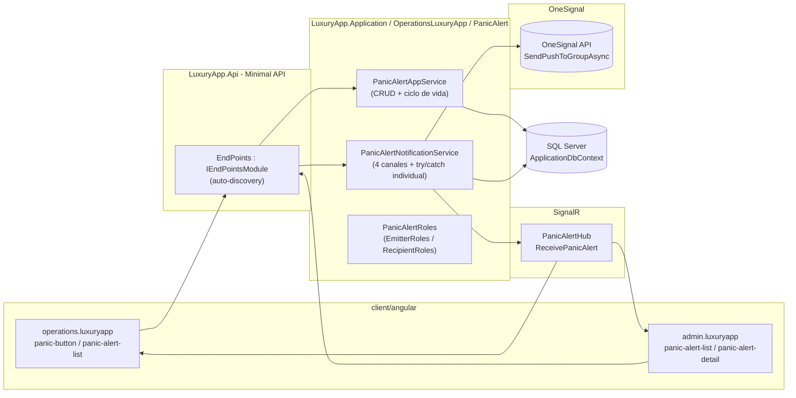
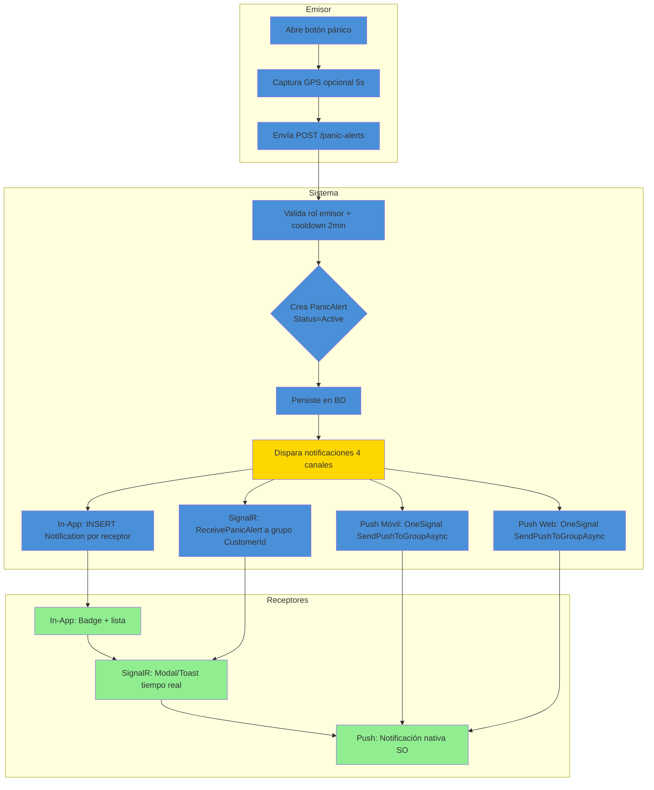
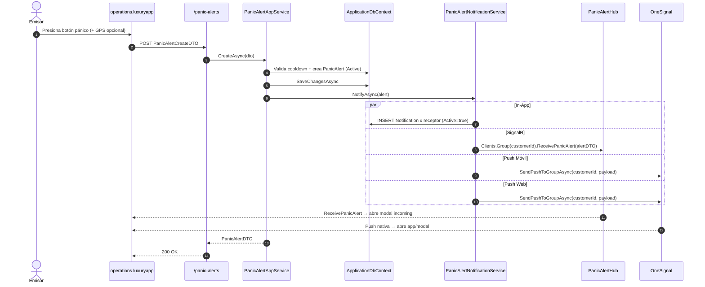
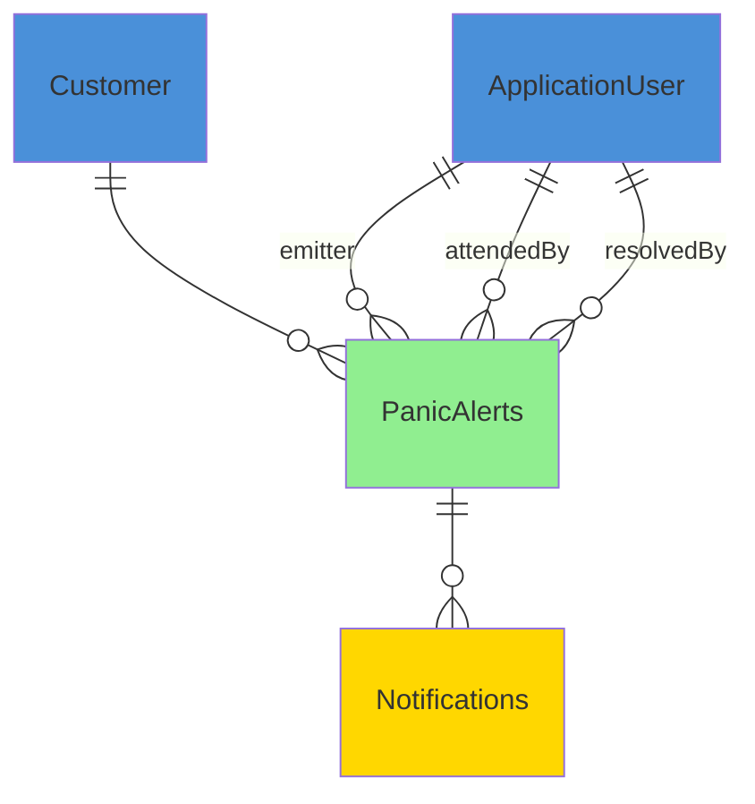

# PanicAlert (Alertas de Pánico) — Documentación Técnica

> **Ruta**: 📂 Documentación > 💼 Operaciones > 🚨 PanicAlert
> **📅 Última Revisión**: 13-jul-26
> **🛡️ Estado**: ✅ Vigente
> **👤 Responsable**: @equipo-operaciones

---

## 📑 Tabla de Contenidos

1. [Resumen Ejecutivo](#-resumen-ejecutivo)
2. [Visión Funcional](#-visión-funcional)
3. [Arquitectura Técnica](#-arquitectura-técnica)
4. [API Endpoints](#-api-endpoints)
5. [Flujo del Sistema](#-flujo-del-sistema)
6. [Componentes Frontend](#-componentes-frontend)
7. [Reglas de Negocio](#-reglas-de-negocio)
8. [Matriz de Permisos](#-matriz-de-permisos)
9. [Catálogo de Roles del Sistema](#-catálogo-de-roles-del-sistema)
10. [Base de Datos](#-base-de-datos)
11. [Performance](#-performance)
12. [Glosario de Términos](#-glosario-de-términos)
13. [Checklist de Validación](#-checklist-de-validación)
14. [Historial de Cambios](#-historial-de-cambios)

---

## 🎯 Resumen Ejecutivo

**Propósito**: Sistema de alerta de pánico multi-canal que permite a usuarios administrativos/staff activar una emergencia notificando a roles receptores del mismo condominio vía In-App, SignalR (tiempo real), Push Móvil y Push Web.

**Actores Involucrados** (`ApplicationRoleEnum`): **Emisores** — `Administrador`, `GerenteOperaciones`, `GerenteAtencion`, `SupervisionOperativa`, `Asistente`, `Recepcionista`, `MasterConcierge`, `Concierge`, `JefeSeguridadInterna`, `SeguridadInterna`, `Monitorista`, `SuperUsuario`. **Receptores** — `Administrador`, `GerenteOperaciones`, `GerenteAtencion`, `Asistente`, `SuperUsuario`.

**Dependencias**: `Customer` (tenant), `ApplicationUser`/`ApplicationRoleEnum` (identidad), SignalR (tiempo real), OneSignal (push), QRCoder (no usado aquí), Hangfire (limpieza opcional).

**Alcance**:

- ✅ Incluye: Activación de alerta con GPS opcional, 4 canales de notificación, ciclo de vida Active→Attended→Resolved/FalseAlarm, anti-spam cooldown, historial paginado.
- ❌ No incluye: Geofencing, escalamiento automático a servicios de emergencia externos (911), integración con IoT/wearables, audio bidireccional.

---

## 🔍 Visión Funcional

**HU-01 — Emisor activa alerta de pánico**

> Como **staff administrativo/seguridad** quiero activar una alerta de pánico con mi ubicación actual.
> **Criterios**: Valida cooldown 2 min; captura GPS (timeout 5s, opcional); emite a 4 canales; excluye al emisor; persiste `PanicAlert` con `Status=Active`.

**HU-02 — Receptor recibe y atiende alerta**

> Como **administrador/gerente** quiero recibir la alerta en tiempo real, ver ubicación en mapa y marcarla como atendida.
> **Criterios**: SignalR `ReceivePanicAlert` + push + in-app; modal con datos del emisor + mapa; botón "Atender" → `Status=Attended` + `AttendedAt` + `AttendedBy`.

**HU-03 — Receptor resuelve o descarta alerta**

> Como **administrador/gerente** quiero resolver la alerta (emergencia real) o marcarla como falsa alarma.
> **Criterios**: Desde `Attended` → `Resolved` (con nota) o `FalseAlarm`; registra `ResolvedAt` + `ResolvedBy` + `ResolutionNote`.

**HU-04 — Consulta de historial**

> Como **admin** quiero ver historial paginado de alertas de mi condominio con filtros.
> **Criterios**: `GET /active` (solo `Active`/`Attended`) y `GET /history` (todas); paginación server-side (tope 200); filtros por fecha/estado/emisor.

---

## 🏗️ Arquitectura Técnica



| Capa        | Tecnología                                                          |
| ----------- | ------------------------------------------------------------------- |
| Backend     | .NET 10, Minimal APIs (`IEndpointModule`), EF Core 10               |
| Tiempo Real | SignalR (`PanicAlertHub`, grupo por `CustomerId`)                   |
| Push        | OneSignal (`SendPushToGroupAsync` por `CustomerId`)                 |
| GPS         | Navegador `navigator.geolocation.getCurrentPosition` (timeout 5s)   |
| Respuestas  | `ApiResponseDTO<T>` (nunca `ProblemDetails`)                        |
| Mapeo       | Explícito `ToDTO()` (AutoMapper prohibido)                          |
| Frontend    | Angular 22 (standalone, signals, OnPush), Bootstrap 5, catálogo `@ui/*` |

---

## 📱 Mobile Responsive (§15 CONVENTIONS.md)

| Vista                                 | Patrón (§15.2)                | Implementación                                                                                                                                              |
| ------------------------------------- | ----------------------------- | ----------------------------------------------------------------------------------------------------------------------------------------------------------- |
| `PanicButton` (emisor)                | **C — Adaptive Wrapper**      | Wrapper `@if (platform.isMobile()) <app-panic-button-mobile />` `:else <app-panic-button />`; mobile usa `ion-fab` en thumb zone, web usa `p-button` grande |
| `PanicAlertIncomingDialog` (receptor) | **C — Adaptive Wrapper**      | Web: `p-dialog` modal centrado; Mobile: `ion-modal` full-screen vía `IonicDialogModal`                                                                      |
| `PanicAlertList` (historial)          | **B — Componentes Separados** | Wrapper elige `PanicAlertList` (p-table) vs `PanicAlertListMobile` (ion-list + ion-infinite-scroll)                                                         |

**Reglas aplicadas:**

- Breakpoint único: 768px (`PlatformService.isMobile()`)
- Touch targets ≥ 44×44px (FAB pánico: 64×64px móvil)
- Safe areas: `ion-content` + `ion-modal` manejan notch/status bar
- Modales en móvil: `ion-modal` vía `IonicDialogModal` (nunca `DynamicDialog`)
- GPS: `navigator.geolocation.getCurrentPosition({ timeout: 5000, enableHighAccuracy: true })` con fallback silencioso

---

## 🌐 API Endpoints

Base: `api/panic-alerts`. Todos requieren `Authorization: Bearer <JWT>`; roles vía `PanicAlertRoles` (nombres reales de `ApplicationRoleEnum`). Éxitos y errores en `ApiResponseDTO<T>`.

### Tabla General

| Método | Path            | Roles          | Request DTO                   | Response DTO                    | Códigos HTTP          |
| ------ | --------------- | -------------- | ----------------------------- | ------------------------------- | --------------------- |
| POST   | `/`             | EmitterRoles   | `PanicAlertCreateDTO`         | `PanicAlertDTO`                 | 200 · 400 · 403 · 429 |
| GET    | `/active`       | RecipientRoles | `PaginationCommonDTO` (query) | `PagedResultDTO<PanicAlertDTO>` | 200 · 400             |
| GET    | `/history`      | RecipientRoles | `PaginationCommonDTO` (query) | `PagedResultDTO<PanicAlertDTO>` | 200 · 400             |
| GET    | `/{id}`         | EmitterRoles   | —                             | `PanicAlertDTO`                 | 200 · 400 · 404       |
| PUT    | `/{id}/attend`  | RecipientRoles | —                             | `bool`                          | 200 · 400 · 404 · 409 |
| PUT    | `/{id}/resolve` | RecipientRoles | `PanicAlertResolveDTO`        | `bool`                          | 200 · 400 · 404 · 409 |

> [!NOTE]
> El campo `responseCode` viaja **dentro** de `ApiResponseDTO`; el status HTTP siempre es `200 OK` para respuestas de negocio (incluidos errores 4xx de dominio). `500` solo para excepciones no controladas.

### Detalle por Endpoint

#### 🟢 POST `/api/panic-alerts`

Crea alerta de pánico, valida cooldown, captura GPS opcional, dispara notificaciones 4 canales.

- **Roles**: `Administrador`, `GerenteOperaciones`, `GerenteAtencion`, `SupervisionOperativa`, `Asistente`, `Recepcionista`, `MasterConcierge`, `Concierge`, `JefeSeguridadInterna`, `SeguridadInterna`, `Monitorista`, `SuperUsuario`.
- **Headers**: `Authorization: Bearer <JWT>`, `Content-Type: application/json`.

**Request** (`PanicAlertCreateDTO`):

```json
{
  "latitude": 19.4326,
  "longitude": -99.1332,
  "accuracy": 12.5,
  "note": "Incidente en lobby torre B"
}
```

**Response 200** (`ApiResponseDTO<PanicAlertDTO>`):

```json
{
  "success": true,
  "message": "Alerta de pánico activada. Notificando a receptores...",
  "responseCode": 200,
  "data": {
    "id": "019c...",
    "emitterUserId": "019c...",
    "emitterName": "Juan Pérez (Seguridad)",
    "customerId": "019c...",
    "latitude": 19.4326,
    "longitude": -99.1332,
    "accuracy": 12.5,
    "note": "Incidente en lobby torre B",
    "status": "Active",
    "createdAt": "2026-07-13T16:05:00Z",
    "attendedAt": null,
    "attendedBy": null,
    "resolvedAt": null,
    "resolvedBy": null,
    "resolutionNote": null,
    "statusDisplay": "Activa"
  }
}
```

**Response 429** (cooldown):

```json
{
  "success": false,
  "message": "Debe esperar 2 minutos antes de activar otra alerta.",
  "responseCode": 429,
  "data": null
}
```

**Validaciones**:
| Campo | Regla |
|-------|-------|
| `latitude`/`longitude` | Opcionales; si vienen, rango válido (-90/90, -180/180) |
| `accuracy` | Opcional; metros, ≥ 0 |
| `note` | Opcional; máx 500 chars |
| Cooldown | 2 min desde última alerta del mismo `emitterUserId` (429) |
| GPS | Timeout 5s; si falla/niega → `latitude`/`longitude` = null; alerta se envía igual |

**Errores**: `400` entrada inválida · `403` rol no emisor · `429` cooldown activo.

---

#### 🟢 GET `/api/panic-alerts/active`

Lista alertas `Active` + `Attended` del customer del usuario.

- **Roles**: `Administrador`, `GerenteOperaciones`, `GerenteAtencion`, `Asistente`, `SuperUsuario`.
- **Query**: `page` (default 1), `pageSize` (default 30, máx 200), `sortBy` (`createdAt`), `sortDir` (`desc`).

**Response 200** (`ApiResponseDTO<PagedResultDTO<PanicAlertDTO>>`): estándar paginado.

---

#### 🟢 GET `/api/panic-alerts/history`

Historial completo (todos los estados) del customer.

- **Roles**: Igual que `/active`.
- **Query**: Igual + `status` (opcional: `Active`|`Attended`|`Resolved`|`FalseAlarm`), `fromDate`, `toDate`, `emitterUserId`.

---

#### 🟢 GET `/api/panic-alerts/{id}`

Detalle de una alerta.

- **Roles**: `EmitterRoles` (emisor ve su propia; admin ve todas del tenant).
- **Validación**: `id` existe y pertenece al `CustomerId` del usuario (404 si no).

---

#### 🟢 PUT `/api/panic-alerts/{id}/attend`

Marca alerta como atendida.

- **Roles**: `RecipientRoles`.
- **Precondición**: `Status == Active`.
- **Efecto**: `Status=Attended`, `AttendedAt=now`, `AttendedBy=currentUser`.
- **Conflicto**: Si ya `Attended`/`Resolved`/`FalseAlarm` → 409.

---

#### 🟢 PUT `/api/panic-alerts/{id}/resolve`

Resuelve o descarta alerta.

- **Roles**: `RecipientRoles`.
- **Precondición**: `Status == Attended`.
- **Request** (`PanicAlertResolveDTO`):

```json
{
  "resolutionType": "Resolved",
  "resolutionNote": "Falsa alarma: sensor de humo defectuoso"
}
```

- `resolutionType`: `Resolved` | `FalseAlarm`.
- **Efecto**: `Status=Resolved` o `FalseAlarm`, `ResolvedAt=now`, `ResolvedBy=currentUser`, `ResolutionNote`.
- **Conflicto**: Si no `Attended` → 409.

---

## 🔄 Flujo del Sistema

### Activación de alerta + notificación 4 canales



### Ciclo de vida de la alerta



**Estados**: `Active` → `Attended` (PUT `/attend`) → `Resolved` | `FalseAlarm` (PUT `/resolve`).

---

## 🖥️ Componentes Frontend

Workspace: **`client/angular`** (standalone, signals, OnPush, catálogo `@ui/*`, `ApiResponseService`, `Endpoints`).

### Routing

| App (§14)              | Ruta                                  | Componente         |    Lazy loading    | Guard       | Menú |
| ---------------------- | ------------------------------------- | ------------------ | :----------------: | ----------- | :--: |
| `operations.luxuryapp` | `operations/alertas-panico`           | `PanicButton`      | ✅ `loadComponent` | —           |  ✅  |
| `operations.luxuryapp` | `operations/alertas-panico/historial` | `PanicAlertList`   | ✅ `loadComponent` | —           |  ✅  |
| `admin.luxuryapp`      | `admin/alertas-panico`                | `PanicAlertList`   | ✅ `loadComponent` | `authGuard` |  ✅  |
| `admin.luxuryapp`      | `admin/alertas-panico/:id`            | `PanicAlertDetail` | ✅ `loadComponent` | `authGuard` |  ❌  |

### Catálogo de Componentes

| Componente                 | Selector                          | Ruta relativa                                                          | Tipo   | Signals clave                              | Servicios                                                  | Comportamiento                                                                                             |
| -------------------------- | --------------------------------- | ---------------------------------------------------------------------- | ------ | ------------------------------------------ | ---------------------------------------------------------- | ---------------------------------------------------------------------------------------------------------- |
| `PanicButton`              | `app-panic-button`                | `apps/operations.luxuryapp/panic-alert/panic-button.ts`                | web    | `loading`, `cooldownSignal`, `lastAlertAt` | `ApiResponseService`, `GeolocationService`                 | Botón grande FAB-style; click → GPS 5s → POST; muestra cooldown regresivo; `il-button-danger`              |
| `PanicButtonMobile`        | `app-panic-button-mobile`         | `apps/operations.luxuryapp/panic-alert/panic-button-mobile.ts`         | mobile | `loading`, `cooldownSignal`                | `ApiResponseService`, `GeolocationService`                 | `ion-fab` en thumb zone (bottom-right); `ion-toast` feedback; vibración `navigator.vibrate([200,100,200])` |
| `PanicAlertIncomingDialog` | `app-panic-alert-incoming-dialog` | `apps/operations.luxuryapp/panic-alert/panic-alert-incoming-dialog.ts` | web    | `visible`, `alertSignal`, `mapLoaded`      | `ApiResponseService`, `SignalRService`                     | `p-dialog` modal centrado; mapa Leaflet/Google Maps; botones "Atender" + "Descartar" (solo admin)          |
| `PanicAlertIncomingModal`  | `app-panic-alert-incoming-modal`  | `apps/operations.luxuryapp/panic-alert/panic-alert-incoming-modal.ts`  | mobile | `visible`, `alertSignal`                   | `ApiResponseService`, `SignalRService`, `IonicDialogModal` | `ion-modal` full-screen; mapa nativo; botones grandes thumb zone; `ion-action-sheet` para resolver         |
| `PanicAlertList`           | `app-panic-alert-list`            | `apps/admin.luxuryapp/panic-alert/panic-alert-list.ts`                 | web    | `dataSignal`, `loading`, `filters`         | `ApiResponseService`                                       | `p-table` paginado; filtros estado/fecha/emisor; `@defer` para mapa en detalle; `il-button-*` acciones     |
| `PanicAlertListMobile`     | `app-panic-alert-list-mobile`     | `apps/admin.luxuryapp/panic-alert/panic-alert-list-mobile.ts`          | mobile | `dataSignal`, `loading`, `refreshing`      | `ApiResponseService`                                       | `ion-list` + `ion-item-sliding` + `ili-action-menu`; pull-to-refresh + infinite scroll                     |
| `PanicAlertDetail`         | `app-panic-alert-detail`          | `apps/admin.luxuryapp/panic-alert/panic-alert-detail.ts`               | web    | `alertSignal`, `timelineSignal`            | `ApiResponseService`                                       | Timeline visual (Active→Attended→Resolved); mapa ubicación; nota resolución; `il-button-back`              |

**Estilos**: Bootstrap 5 (`card`, `grid`, `text-*`); botones/inputs catálogo `@ui/*` (`il-button`, `il-button-danger`, `il-button-save`, `custom-input-*-signal`, `ili-button-*` mobile). **Testing**: `.spec.ts` por componente (Vitest) — cobertura básica inicialización.

**Interfaces** (`core/interfaces/panic-alert.dto.ts`): `panic-alert`, `panic-alert-create`, `panic-alert-resolve`, `panic-alert-realtime`, `paged-result`.

> [!TIP]
> SignalR: `signalr.service.ts` registra listener `ReceivePanicAlert` → emite a `BehaviorSubject` → `toSignal` en componentes. Reconexión automática con `HubConnectionBuilder.withAutomaticReconnect()`.

---

## 📜 Reglas de Negocio

| ID     | SI (condición)                                           | ENTONCES (acción)                                                                                                                                                              |
| ------ | -------------------------------------------------------- | ------------------------------------------------------------------------------------------------------------------------------------------------------------------------------ |
| RN-001 | Cualquier operación del módulo                           | Se filtra por `currentUser.CustomerId`; ningún acceso cruza tenants                                                                                                            |
| RN-002 | Usuario presiona botón pánico                            | Valida rol en `EmitterRoles`; si no → 403                                                                                                                                      |
| RN-003 | Existe alerta del mismo `emitterUserId` en últimos 2 min | Rechaza con 429 "Debe esperar 2 minutos antes de activar otra alerta"                                                                                                          |
| RN-004 | GPS capturado con éxito                                  | Incluye `latitude`/`longitude`/`accuracy` en `PanicAlert` y notificaciones                                                                                                     |
| RN-005 | GPS falla/niega/timeout 5s                               | Crea alerta con `latitude`/`longitude` = null; notifica sin ubicación                                                                                                          |
| RN-006 | Se crea `PanicAlert`                                     | Dispara 4 canales en paralelo con `try/catch` individual; fallo de uno no aborta otros                                                                                         |
| RN-007 | Notificación In-App                                      | `INSERT Notification` por cada receptor (`RecipientRoles` ∧ `Active=true` ∧ `UserId != EmitterUserId`)                                                                         |
| RN-008 | Notificación SignalR                                     | `Clients.Group(customerId).ReceivePanicAlert(alertDTO)`; receptores suscritos al grupo                                                                                         |
| RN-009 | Notificación Push (Móvil/Web)                            | `OneSignal.SendPushToGroupAsync(customerId, payload)`; payload incluye `alertId`, `emitterName`, `lat/lng`                                                                     |
| RN-010 | Emisor excluido                                          | `EmitterUserId` nunca recibe notificación propia (ni In-App ni Push)                                                                                                           |
| RN-011 | PUT `/attend`                                            | Requiere `Status=Active`; setea `Status=Attended`, `AttendedAt=now`, `AttendedBy=currentUser`; 409 si estado distinto                                                          |
| RN-012 | PUT `/resolve`                                           | Requiere `Status=Attended`; `resolutionType` ∈ {`Resolved`,`FalseAlarm`}; setea `Status`, `ResolvedAt=now`, `ResolvedBy=currentUser`, `ResolutionNote`; 409 si estado distinto |
| RN-013 | Consulta `/active`                                       | Solo `Status ∈ {Active, Attended}` del `CustomerId` del usuario                                                                                                                |
| RN-014 | Consulta `/history`                                      | Todos los estados del `CustomerId`; soporta filtros `status`, `fromDate`, `toDate`, `emitterUserId`                                                                            |

---

## 🔐 Matriz de Permisos

Roles de `ApplicationRoleEnum`. **E** = `PanicAlertRoles.EmitterRoles`, **R** = `RecipientRoles`.

| Acción                                   |  Emisor (E)  |   Receptor (R)    |
| ---------------------------------------- | :----------: | :---------------: |
| Crear alerta (POST `/`)                  |      ✅      |        ❌         |
| Ver alertas activas (GET `/active`)      |      ❌      |        ✅         |
| Ver historial (GET `/history`)           |      ❌      |        ✅         |
| Ver detalle (GET `/{id}`)                | ✅ (propias) | ✅ (todas tenant) |
| Atender (PUT `/{id}/attend`)             |      ❌      |        ✅         |
| Resolver/Descartar (PUT `/{id}/resolve`) |      ❌      |        ✅         |

**EmitterRoles** (`RoleType` Dirección/Administrativo + Operativo): `SuperUsuario`, `Administrador`, `GerenteOperaciones`, `GerenteAtencion`, `SupervisionOperativa`, `Asistente`, `Recepcionista`, `MasterConcierge`, `Concierge`, `JefeSeguridadInterna`, `SeguridadInterna`, `Monitorista`.

**RecipientRoles** (Dirección/Administrativo): `SuperUsuario`, `Administrador`, `GerenteOperaciones`, `GerenteAtencion`, `Asistente`.

---

## 🗄️ Catálogo de Roles del Sistema

El módulo **no introduce roles nuevos**: reutiliza `ApplicationRoleEnum` mediante los grupos `PanicAlertRoles.EmitterRoles` y `RecipientRoles`. La autorización es **por rol** (`AuthorizeAttribute { Roles = ... }`), no por claims.

---

## 🗄️ Base de Datos

`ApplicationDbContext` (SQL Server). No hay filtro global de tenant (solo soft-delete); filtrado por `CustomerId` manual en cada consulta. FKs con `OnDelete(Restrict)`.



| Tabla           | Columnas clave                                                                                                 | Índices                                                                         |
| --------------- | -------------------------------------------------------------------------------------------------------------- | ------------------------------------------------------------------------------- | ---------- | ---------------------------------------------------------------------------------------------------- | --------------------------------------------------------------------------------- |
| `PanicAlerts`   | `Id` (Guid V7), `CustomerId`, `EmitterUserId`, `Latitude`, `Longitude`, `Accuracy`, `Note`, `Status` (`Active` | `Attended`                                                                      | `Resolved` | `FalseAlarm`), `CreatedAt`, `AttendedAt`, `AttendedBy`, `ResolvedAt`, `ResolvedBy`, `ResolutionNote` | `IX (CustomerId, Status, CreatedAt)`, `IX (CustomerId, EmitterUserId, CreatedAt)` |
| `Notifications` | `Id`, `CustomerId`, `UserId`, `Type` (`PanicAlert`), `EntityId`, `Title`, `Body`, `ReadAt`, `CreatedAt`        | `IX (CustomerId, UserId, ReadAt, CreatedAt)`, `IX (CustomerId, Type, EntityId)` |

**Enums** (`LuxuryApp.Shared.Enums`): `EPanicAlertStatus` (`Active=1`, `Attended=2`, `Resolved=3`, `FalseAlarm=4`).

---

## ⚡ Performance

- **Lazy loading**: componentes Angular vía `loadComponent` (una carga por ruta).
- **N+1**: consultas con `join`/proyección `.Select()` (sin cargas perezosas por fila); listados paginados server-side (`PaginationCommonDTO`, tope 200).
- **SignalR**: grupos por `CustomerId` (un grupo por tenant); mensaje único broadcast a receptores.
- **OneSignal**: `SendPushToGroupAsync` por `CustomerId` (tag `customer_{id}`); una llamada por alerta.
- **Índices**: compuestos por `CustomerId` para consultas frecuentes; `CreatedAt` para ordenamiento.
- **GPS**: `navigator.geolocation.getCurrentPosition({ timeout: 5000, enableHighAccuracy: true })` — no bloquea UI (Promise + `finally` limpia loading).
- **Cooldown**: cache en memoria (`IMemoryCache` / `HybridCache`) por `EmitterUserId` key `panic-cooldown-{userId}` TTL 2 min.

---

## 📖 Glosario de Términos

| Término           | Definición                                                                          |
| ----------------- | ----------------------------------------------------------------------------------- |
| **Emisor**        | Usuario con rol en `EmitterRoles` que activa la alerta                              |
| **Receptor**      | Usuario con rol en `RecipientRoles` que recibe notificación                         |
| **Cooldown**      | Ventana de 2 min tras una activación donde el mismo emisor no puede crear otra      |
| **Ciclo de vida** | `Active` → `Attended` → `Resolved` \| `FalseAlarm`                                  |
| **Grupo SignalR** | Canal por `CustomerId` (`panic-alerts-{customerId}`) al que se suscriben receptores |
| **Tag OneSignal** | `customer_{customerId}` asignado al login para segmentar push por tenant            |

---

## ✅ Checklist de Validación ([CONVENTIONS.md §11](../../../../../../CONVENTIONS.md#11-estándares-de-documentación))

> [!NOTE]
> El link a `CONVENTIONS.md` asume que el documento vive en la raíz del propio módulo. Ajusta la profundidad relativa (`../../../../../../`) según la ubicación final.

- [x] CERO mojibake (UTF-8 sin BOM)
- [x] CERO `any` en TypeScript
- [x] Fechas en formato `dd-MMM-yy`
- [x] Endpoints front/back coinciden carácter a carácter
- [x] Diagramas Mermaid válidos (flowchart swimlanes + sequence con `autonumber`)
- [x] Colores Mermaid según §11 (verde `#90EE90` éxito, amarillo `#FFD700` decisión, azul `#4A90D9` proceso, rojo `#FF6B6B` error)
- [x] Reglas de negocio en formato `SI/ENTONCES` (`RN-xxx`)
- [x] Roles usan nombres exactos de `ApplicationRoleEnum`
- [x] Mobile responsive: §15 aplicado según tipo de vista
- [x] Sin PII en logs
- [x] Emojis consistentes · Todo en español

---

## 📝 Historial de Cambios

| Fecha     | Versión | Autor               | Cambios                                                                                                                |
| --------- | ------- | ------------------- | ---------------------------------------------------------------------------------------------------------------------- |
| 10-jul-26 | 1.0     | @equipo-operaciones | Documentación inicial del módulo                                                                                       |
| 13-jul-26 | 2.0     | @kilo               | Actualización a template §11 CONVENTIONS.md: Mobile responsive §15, checklist §11, Mermaid colores, sin PII, sin `any` |
