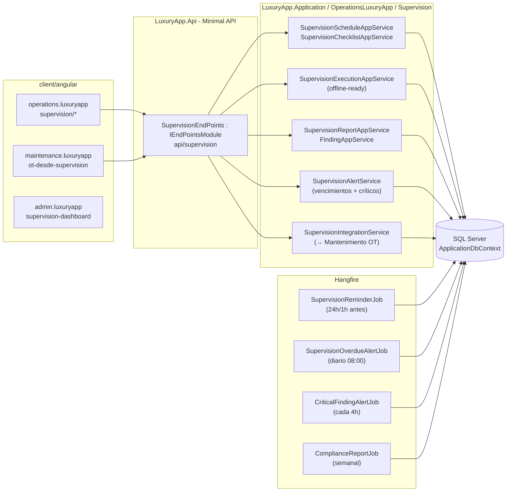
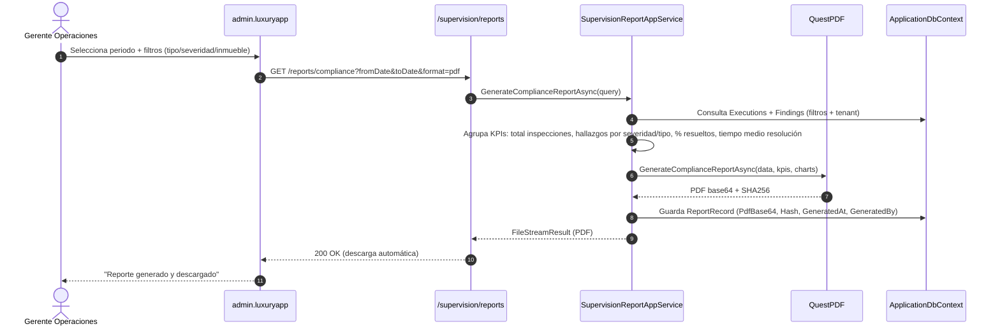
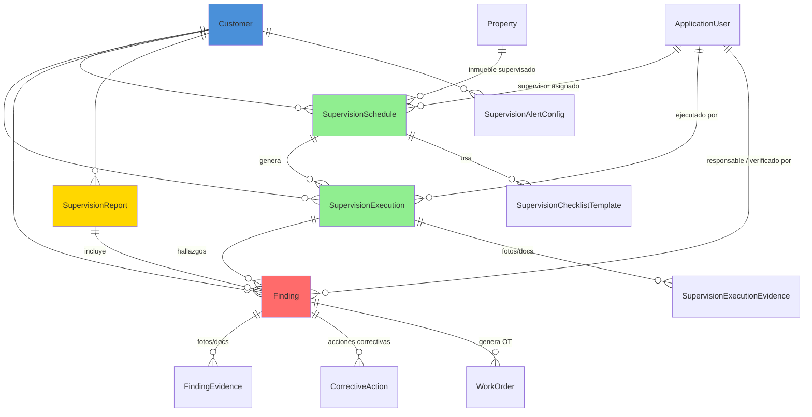

# Supervisión y Auditoría de Campo — Documentación Técnica

> **Ruta**: 📂 Documentación > 💼 Operaciones > 👁️ Supervisión
> **📅 Última Revisión**: 13-jul-26
> **🛡️ Estado**: ✅ Vigente
> **👤 Responsable**: @equipo-supervision

---

## 📑 Tabla de Contenidos

1. [Resumen Ejecutivo](#-resumen-ejecutivo)
2. [Visión Funcional](#-visión-funcional)
3. [Arquitectura Técnica](#-arquitectura-técnica)
4. [API Endpoints](#-api-endpoints)
5. [Flujo del Sistema](#-flujo-del-sistema)
6. [Componentes Frontend](#-componentes-frontend)
7. [Reglas de Negocio](#-reglas-de-negocio)
8. [Matriz de Permisos](#-matriz-de-permisos)
9. [Catálogo de Roles del Sistema](#-catálogo-de-roles-del-sistema)
10. [Base de Datos](#-base-de-datos)
11. [Performance](#-performance)
12. [Glosario de Términos](#-glosario-de-términos)
13. [Checklist de Validación](#-checklist-de-validación)
14. [Historial de Cambios](#-historial-de-cambios)

---

## 🎯 Resumen Ejecutivo

**Propósito**: Módulo de supervisión técnica y operativa que gestiona la agenda de visitas de supervisión a inmuebles, la ejecución de auditorías de campo (mantenimiento, limpieza, seguridad) y la generación de reportes de cumplimiento y hallazgos, integrando con notificaciones y exportación de actas.

**Actores Involucrados** (`ApplicationRoleEnum`): `Administrador`, `GerenteOperaciones`, `GerenteAtencion`, `Asistente`, `SupervisionOperativa`, `JefeMantenimiento`, `TecnicoMantenimiento`, `SuperUsuario`, `Comite`, `Condomino`.

**Dependencias**: `Customer` (tenant), `Property` (inmueble a supervisar), `ApplicationUser` (supervisor/auditor), `Equipment` (activos a auditar), `FileStorage` (fotos, actas), Hangfire (jobs agenda), OneSignal (notificaciones), EPPlus (exportación).

**Alcance**:

- ✅ Incluye: Agenda supervisión (CRUD + calendario + recurrencia), Checklists NFPA/reglamento (mantenimiento, limpieza, seguridad), Ejecución móvil offline-first (fotos, observaciones, firma), Reportes hallazgos + evidencias + exportación PDF/Excel, Alertas vencimiento/incumplimiento, Integración Mantenimiento (OT automática por hallazgo).
- ❌ No incluye: Portal proveedores supervisión, Certificación oficial normas, Gestión seguros/incendios (módulo Legal), IoT sensores.

---

## 🔍 Visión Funcional

**HU-01 — Agenda de supervisión programada**

> Como **jefe supervisión** quiero programar visitas técnicas recurrentes o puntuales a inmuebles asignando supervisor, fecha, tipo checklist y prioridad.
> **Criterios**: `SupervisionSchedule` con RRULE recurrencia; `SupervisionType` (`Mantenimiento`|`Limpieza`|`Seguridad`|`Integral`); `Priority` (`Alta`|`Media`|`Baja`); `AssignedSupervisorId`; `PropertyId`; alerta 24h/1h antes (In-App + Push + Email); conflict detection mismo supervisor misma franja horaria.

**HU-02 — Ejecución de auditoría en campo (mobile-first offline)**

> Como **supervisor técnico** quiero ejecutar checklist en inmueble capturando hallazgos con fotos, observaciones y firma, funcionando offline.
> **Criterios**: Checklist dinámico por `SupervisionType` (secciones + ítems booleanos + obs + foto obligatoria si `No`); `BarcodeDetector` escanea QR activo → carga checklist; `offlineInterceptorFn` encola JSON en `localforage` (`SyncQueueService`) → reintenta al recuperar red; `FormData` fotos excluido offline (solo escritorio); firma `canvas` táctil → base64; sincroniza al recuperar red → reintenta exponencial.

**HU-03 — Reporte de hallazgos y seguimiento**

> Como **gerente operaciones** quiero ver reporte consolidado de hallazgos por inmueble/tipo/prioridad con evidencias y generar OT automática en Mantenimiento.
> **Criterios**: `SupervisionReport` con `Findings[]` (`Category`: `Mantenimiento`|`Limpieza`|`Seguridad`|`SeguridadCivil`; `Severity`: `Crítica`|`Alta`|`Media`|`Baja`; `Status`: `Abierto`|`EnProceso`|`Resuelto`|`Cerrado`; `Evidence[]`: foto + obs; `AssignedTo` (técnico/mantenimiento); `DueDate` según severidad); exportación PDF/Excel (EPPlus); `SupervisionReport.CreateFindingOTAsync` → `MaintenanceAppService.CreateWorkOrderAsync` (vincula `SupervisionReportId`).

**HU-04 — Alertas y cumplimiento**

> Como **admin** quiero alertas de supervisión vencida, hallazgos críticos sin resolver y reportes programados al comité.
> **Criterios**: Job `SupervisionOverdueAlertJob` (diario 08:00) → `SupervisionSchedule` con `Status=Programada` y `ScheduledAt < hoy` → notifica In-App + Email a `GerenteOperaciones` + `SupervisorAsignado`; `CriticalFindingAlertJob` → hallazgos `Severity=Crítica` + `Status=Abierto` > 48h → escala `GerenteOperaciones` + `Administrador`; `ComplianceReportJob` (semanal) → PDF consolidado → Email `Comite` + `Administrador` + `GerenteOperaciones`.

---

## 🏗️ Arquitectura Técnica



| Capa          | Tecnología                                                                          |
| ------------- | ----------------------------------------------------------------------------------- |
| Backend       | .NET 10, Minimal APIs (`IEndpointModule`), EF Core 10                               |
| Checklists    | JSON dinámico (secciones + ítems + validaciones condicionales)                      |
| Offline móvil | `offlineInterceptorFn` + `SyncQueueService` + `localforage` + `ConnectivityService` |
| Scanner QR    | `BarcodeDetector` API nativa + fallback input manual                                |
| Jobs          | Hangfire (`HangfireJobCatalog`)                                                     |
| Exportación   | EPPlus (`GetAsByteArray`) + PDF (`QuestPDF`)                                        |
| Respuestas    | `ApiResponseDTO<T>` (nunca `ProblemDetails`)                                        |
| Mapeo         | Explícito `ToDTO()` (AutoMapper prohibido)                                          |
| Frontend      | Angular 22 (standalone, signals, OnPush), Bootstrap 5, catálogo `@ui/*`                 |

---

## 📱 Mobile Responsive (§15 CONVENTIONS.md)

| Vista                                                 | Patrón (§15.2)                | Implementación                                                                                                                       |
| ----------------------------------------------------- | ----------------------------- | ------------------------------------------------------------------------------------------------------------------------------------ |
| `SupervisionScheduleList` / `SupervisionScheduleForm` | **A — CSS Responsive**        | PrimeFlex grid (`p-col-*`), `p-table` responsive, `p-calendar` Flatpickr, `p-dialog` formularios                                     |
| `SupervisionChecklist` (ejecución)                    | **C — Adaptive Wrapper**      | Mobile: `ion-content` + `ion-list` + `ion-item` expansible + cámara nativa + `ion-fab` guardar; Web: `p-table` editable + `p-dialog` |
| `SupervisionReportList` / `SupervisionReportDetail`   | **A — CSS Responsive**        | PrimeFlex grid, `p-table` scroll horizontal, `@defer` Chart.js                                                                       |
| `FindingDetail` / `FindingForm`                       | **B — Componentes Separados** | Wrapper `@if (platform.isMobile()) <app-finding-form-mobile />` `:else <app-finding-form />`                                         |

**Reglas aplicadas:**

- Breakpoint único: 768px (`PlatformService.isMobile()`)
- Touch targets ≥ 44×44px en todos los botones/iconos móviles
- Safe areas: `ion-content` / `ion-modal` manejan notch/status bar
- Offline: `offlineInterceptorFn` + `SyncQueueService` + `localforage` + `ConnectivityService` (solo JSON `[FromBody]`, no `FormData` fotos)
- Scanner QR: `BarcodeDetector` nativo (Chrome/Edge/Android) + fallback `ion-input` manual (iOS Safari/Firefox)
- Modales en móvil: `ion-modal` vía `IonicDialogModal` (nunca `DynamicDialog`)
- Firma digital: `canvas` táctil + `toDataURL()` → base64
- Pull-to-refresh + infinite scroll en listados

---

## 🌐 API Endpoints

Base por dominio (kebab-case, plural, minúsculas, prefijo `api/`):

| Dominio            | Base Path                    | Descripción                              |
| ------------------ | ---------------------------- | ---------------------------------------- |
| Agenda Supervisión | `api/supervision/schedules`  | CRUD + recurrencia RRULE + calendario    |
| Checklists         | `api/supervision/checklists` | Plantillas por tipo supervisión          |
| Ejecución          | `api/supervision/executions` | CRUD + offline sync + firma + fotos      |
| Hallazgos          | `api/supervision/findings`   | CRUD + severidad + evidencia + OT        |
| Reportes           | `api/supervision/reports`    | Consolidados + exportación + KPIs        |
| Alertas            | `api/supervision/alerts`     | Configuración + historial notificaciones |

### Tabla General (muestra representativa)

| Método | Path                     | Roles                      | Request DTO                                    | Response DTO                             | Códigos HTTP          |
| ------ | ------------------------ | -------------------------- | ---------------------------------------------- | ---------------------------------------- | --------------------- |
| GET    | `/schedules`             | Supervisión, Admin         | `PaginationCommonDTO` + filtros                | `PagedResultDTO<SupervisionScheduleDTO>` | 200 · 400             |
| GET    | `/schedules/{id}`        | Supervisión, Admin         | —                                              | `SupervisionScheduleDTO`                 | 200 · 404             |
| POST   | `/schedules`             | Supervisión, Admin         | `CreateSupervisionScheduleDTO`                 | `SupervisionScheduleDTO`                 | 200 · 400 · 403 · 409 |
| PUT    | `/schedules/{id}`        | Supervisión, Admin         | `UpdateSupervisionScheduleDTO`                 | `SupervisionScheduleDTO`                 | 200 · 400 · 404 · 409 |
| POST   | `/executions`            | Supervisor, Técnico        | `[FromForm] CreateExecutionDTO` + `IFormFile?` | `SupervisionExecutionDTO`                | 200 · 400 · 403       |
| PUT    | `/executions/{id}/sync`  | Supervisor, Técnico        | `SyncExecutionDTO` (JSON)                      | `SupervisionExecutionDTO`                | 200 · 400 · 404       |
| POST   | `/findings`              | Supervisor, Técnico        | `CreateFindingDTO` (JSON)                      | `FindingDTO`                             | 200 · 400 · 404       |
| PUT    | `/findings/{id}/resolve` | Técnico, Mantenimiento     | `ResolveFindingDTO`                            | `bool`                                   | 200 · 400 · 404 · 409 |
| GET    | `/reports/compliance`    | Supervisión, Admin, Comité | `fromDate`, `toDate`, `format` (pdf/excel)     | `FileStreamResult`                       | 200 · 400             |
| GET    | `/reports/kpis`          | Supervisión, Admin         | `fromDate`, `toDate`                           | `SupervisionKpiDTO`                      | 200 · 400             |

> [!NOTE]
> El campo `responseCode` viaja **dentro** de `ApiResponseDTO`; el status HTTP siempre es `200 OK` para respuestas de negocio (incluidos errores 4xx de dominio). `500` solo para excepciones no controladas.

---

## 🔄 Flujo del Sistema

### Ejecución de supervisión (offline-first)

```mermaid
flowchart TD
  subgraph Supervisor [Móvil - operations.luxuryapp]
    A1[Abre checklist asignado\n(escanea QR o lista)]
    A2[Recorre ítems: OK/NO + obs + foto si NO]
    A3{¿Hay hallazgos\ncríticos?}
    A3 -- Sí --> A4[Registra Finding\nSeverity=Crítica + foto]
    A3 -- No --> A5[Completa checklist]
  end
  subgraph Sincronización [Background Sync]
    A5 --> B1[Guarda Execution local\nIndexedDB + localforage]
    B1 --> B2{¿Online?}
    B2 -- No --> B3[Encola en SyncQueueService\nMock 200 a UI]
    B2 -- Sí --> B4[POST /executions\n+ findings batch]
  end
  subgraph Backend
    B4 --> C1[SupervisionExecutionAppService\nCreateOrUpdateAsync]
    C1 --> C2[Valida checklist completo\n+ hallazgos coherentes]
    C2 --> C3[Persiste Execution + Findings]
    C3 --> C4{Finding Severity=Crítica?}
    C4 -- Sí --> C5[CriticalFindingAlertJob\nnotifica Gerente + Admin]
    C4 -- No --> C6[SupervisionIntegrationService\nCreateWorkOrderAsync si config]
    C6 --> C7[MaintenanceAppService\nCreateWorkOrderAsync]
  end
  subgraph Notificaciones
    C5 --> D1[In-App + Push + Email\nGerenteOperaciones + Admin]
    C6 --> D2[OT creada en Mantenimiento\nvincula SupervisionReportId]
  end
  A1 --> A2
  A2 --> A3
  A4 --> A5
  B3 --> B4
  style A1 fill:#4A90D9
  style A2 fill:#4A90D9
  style A3 fill:#FFD700
  style A4 fill:#FF6B6B
  style A5 fill:#4A90D9
  style B1 fill:#4A90D9
  style B2 fill:#FFD700
  style B3 fill:#FFD700
  style B4 fill:#4A90D9
  style C1 fill:#4A90D9
  style C2 fill:#4A90D9
  style C3 fill:#90EE90
  style C4 fill:#FFD700
  style C5 fill:#FF6B6B
  style C6 fill:#4A90D9
  style C7 fill:#90EE90
  style D1 fill:#FFD700
  style D2 fill:#90EE90
```

### Generación de reporte de cumplimiento



---

## 🖥️ Componentes Frontend

Workspace: **`client/angular`** (standalone, signals, OnPush, catálogo `@ui/*`, `ApiResponseService`, `Endpoints`).

### Routing

| App (§14)               | Ruta                                 | Componente                | Lazy loading | Guard       | Menú |
| ----------------------- | ------------------------------------ | ------------------------- | :----------: | ----------- | :--: |
| `operations.luxuryapp`  | `supervision/agenda`                 | `SupervisionScheduleList` |      ✅      | `authGuard` |  ✅  |
| `operations.luxuryapp`  | `supervision/agenda/nueva`           | `SupervisionScheduleForm` |      ✅      | `authGuard` |  ❌  |
| `operations.luxuryapp`  | `supervision/checklist/:id`          | `SupervisionChecklist`    |      ✅      | `authGuard` |  ❌  |
| `operations.luxuryapp`  | `supervision/reportes`               | `SupervisionReportList`   |      ✅      | `authGuard` |  ✅  |
| `operations.luxuryapp`  | `supervision/reportes/:id`           | `SupervisionReportDetail` |      ✅      | `authGuard` |  ❌  |
| `operations.luxuryapp`  | `supervision/hallazgos`              | `FindingList`             |      ✅      | `authGuard` |  ✅  |
| `admin.luxuryapp`       | `admin/supervision/dashboard`        | `SupervisionDashboard`    |      ✅      | `authGuard` |  ✅  |
| `maintenance.luxuryapp` | `mantenimiento/ot-desde-supervision` | `SupervisionOTList`       |      ✅      | `authGuard` |  ✅  |

### Catálogo de Componentes (representativo)

| Componente                 | Selector                         | Tipo   | Signals clave                                                          | Servicios                                  | Comportamiento                                                                                                               |
| -------------------------- | -------------------------------- | ------ | ---------------------------------------------------------------------- | ------------------------------------------ | ---------------------------------------------------------------------------------------------------------------------------- |
| `SupervisionScheduleList`  | `app-supervision-schedule-list`  | web    | `dataSignal`, `loading`, `filters`                                     | `ApiResponseService`                       | `p-table` virtual scroll, filtros tipo/estado/supervisor, exportar, `il-button-*` CRUD                                       |
| `SupervisionScheduleForm`  | `app-supervision-schedule-form`  | web    | `submitting`, `form`, `recurrenceSignal`                               | `ApiResponseService`, `FormHelper`         | `FormHelper.submitCrud()`, RRULE editor, selector supervisor/propiedad, `p-calendar` Flatpickr                               |
| `SupervisionChecklist`     | `app-supervision-checklist`      | mobile | `checklistSignal`, `currentSection`, `findingsSignal`, `offlineSignal` | `ApiResponseService`, `OfflineSyncService` | `ion-content` + secciones colapsables, ítems radio OK/NO + cámara nativa, `ion-fab` guardar, `BackgroundSync`                |
| `SupervisionExecutionForm` | `app-supervision-execution-form` | web    | `submitting`, `form`, `sectionsSignal`                                 | `ApiResponseService`, `FormHelper`         | `FormHelper.submitCrud()`, secciones colapsables, `p-fileUpload` fotos, valida ítems obligatorios                            |
| `FindingList`              | `app-finding-list`               | web    | `dataSignal`, `filters`, `severitySignal`                              | `ApiResponseService`                       | `p-table` badges severidad, `il-button-*` resolver/editar/ver OT, exportar                                                   |
| `FindingForm`              | `app-finding-form`               | web    | `submitting`, `form`, `evidencesSignal`                                | `ApiResponseService`, `FormHelper`         | `FormHelper.submitCrud()`, selector severidad/categoría, `p-fileUpload` evidencias, asignado técnico                         |
| `SupervisionDashboard`     | `app-supervision-dashboard`      | web    | `kpisSignal`, `upcomingSignal`, `criticalSignal`                       | `ApiResponseService`                       | KPIs tarjetas, gráfico `@defer` Chart.js (hallazgos severidad/mes), tabla próximas inspecciones, hallazgos críticos abiertos |

**Estilos**: Bootstrap 5 (`card`, `grid`, `text-*`); botones/inputs catálogo `@ui/*` (`il-button`, `il-button-save`, `custom-input-*-signal`, `ili-button-*` mobile). **Testing**: `.spec.ts` por componente (Vitest) — cobertura básica inicialización.

**Interfaces** (`core/interfaces/supervision.dto.ts`): `supervision-schedule`, `supervision-checklist`, `supervision-execution`, `finding`, `supervision-report`, `supervision-kpi`, `paged-result`.

---

## 📜 Reglas de Negocio

| ID     | SI (condición)                                                            | ENTONCES (acción)                                                                                                                                                                                                                                                                                   |
| ------ | ------------------------------------------------------------------------- | --------------------------------------------------------------------------------------------------------------------------------------------------------------------------------------------------------------------------------------------------------------------------------------------------- |
| RN-001 | Cualquier operación del módulo                                            | Se filtra por `currentUser.CustomerId`; ningún acceso cruza tenants                                                                                                                                                                                                                                 |
| RN-002 | Se crea `SupervisionSchedule`                                             | Valida `ScheduledAt` ≥ ahora; `AssignedSupervisorId` pertenece al tenant; no solapa otra agenda mismo supervisor misma franja horaria (409); `RecurrenceRule` válido (RRULE parser)                                                                                                                 |
| RN-003 | `SupervisionSchedule` entra en ventana 24h/1h                             | Job `SupervisionReminderJob` notifica a `AssignedSupervisorId` (In-App + Push + Email)                                                                                                                                                                                                              |
| RN-004 | `SupervisionSchedule` vencido (`ScheduledAt < Now` y `Status=Programada`) | Job `SupervisionOverdueAlertJob` notifica a `AssignedSupervisorId` + `GerenteOperaciones` + `Administrador` (In-App + Email)                                                                                                                                                                        |
| RN-005 | Técnico ejecuta `SupervisionExecution`                                    | Valida checklist 100% ítems obligatorios; si ítem `RequiresPhoto=true` y respuesta `NO` → exige evidencia foto; `Findings` vinculados a `ChecklistItemId`                                                                                                                                           |
| RN-006 | `Finding.Severity = Crítica`                                              | Crea `Finding` + notifica inmediatamente In-App + Push + Email a `GerenteOperaciones` + `Administrador` + `SupervisorAsignado`; `DueDate` = Now + 24h                                                                                                                                               |
| RN-007 | `Finding.Severity = Alta` sin resolver 48h                                | Job `CriticalFindingAlertJob` (cada 4h) escala: Nivel 1 (responsable + supervisor), Nivel 2 (+ `GerenteOperaciones`), Nivel 3 (+ `Administrador` + `Direccion`)                                                                                                                                     |
| RN-008 | `Finding` resuelto (`Status=Resuelto`)                                    | Requiere `ResolutionNotes` + `VerificationEvidences[]` (foto/documento); `VerifiedByUserId` + `VerifiedAt`; notifica a creador + asignado                                                                                                                                                           |
| RN-009 | `SupervisionExecution` completada + hallazgos con `CreateWorkOrder=true`  | `SupervisionIntegrationService.CreateWorkOrderAsync` → `MaintenanceAppService.CreateWorkOrderAsync` (vincula `SupervisionReportId`); `WorkOrder.Type = Correctiva`                                                                                                                                  |
| RN-010 | `SupervisionSchedule` recurrente (RRULE)                                  | Job `SupervisionSchedulerJob` (diario 02:00) genera `SupervisionExecution` `Status=Programada` para hoy según RRULE; clona `ChecklistTemplate` snapshot                                                                                                                                             |
| RN-011 | Ejecución offline (`offlineInterceptorFn`)                                | Captura `status===0` + `!navigator.onLine` → encola en `localforage` vía `SyncQueueService` → responde mock 200; al recuperar red `ConnectivityService.isOnline$` → reintenta cola (backoff exponencial 1s, 2s, 4s, 8s, max 30s); **solo JSON** (`[FromBody]`), `FormData` (fotos) excluido offline |
| RN-012 | Scanner QR (`BarcodeDetector`)                                            | Web Chrome/Edge/Android: `BarcodeDetector` nativo + preview `video`; iOS Safari/Firefox: fallback `ion-input` manual para ingresar ID desde etiqueta impresa; QR codifica `luxuryapp://inspect/{equipmentId}`                                                                                       |
| RN-013 | Multi-tenant                                                              | Todas las queries filtran `CustomerId` del usuario autenticado; ningún acceso cross-tenant                                                                                                                                                                                                          |

---

## 🔐 Matriz de Permisos

Roles de `ApplicationRoleEnum`.

| Acción                         | Supervisión (Staff) |      Mantenimiento       | Admin/Contador | Comité/Residente | Sistema |
| ------------------------------ | :-----------------: | :----------------------: | :------------: | :--------------: | :-----: |
| Agenda CRUD                    |         ✅          |       ✅ (lectura)       |       ✅       |        ❌        |   ✅    |
| Agenda recurrencia             |         ✅          |            ❌            |       ❌       |        ❌        |   ✅    |
| Checklist plantilla CRUD       |         ✅          |            ❌            |       ❌       |        ❌        |   ✅    |
| Ejecución checklist (técnico)  |         ✅          |       ✅ (técnico)       |       ❌       |        ❌        |   ✅    |
| Hallazgos registrar            |         ✅          |       ✅ (técnico)       |       ❌       |        ❌        |   ✅    |
| Hallazgos resolver/verificar   |         ✅          | ✅ (técnico/responsable) |       ✅       |        ❌        |   ✅    |
| Hallazgos escalamiento crítico |         ✅          |            ❌            |       ✅       |        ❌        |   ✅    |
| OT desde hallazgo              |         ✅          |        ✅ (auto)         |       ✅       |        ❌        |   ✅    |
| Reportes cumplimiento          |         ✅          |            ✅            |       ✅       |   ✅ (Comité)    |   ✅    |
| Exportar PDF/Excel             |         ✅          |            ✅            |       ✅       |        ❌        |   ✅    |
| Configurar alertas             |         ✅          |            ❌            |       ✅       |        ❌        |   ✅    |

**Detalle por RoleType**:

- **Staff**: `Administrador`, `GerenteOperaciones`, `GerenteAtencion`, `Asistente`, `SupervisionOperativa`, `JefeMantenimiento`, `TecnicoMantenimiento`, `Concierge`
- **Corporate**: `Contador`, `AdministracionGeneral`, `Legal`, `SistemasGeneral`
- **Client**: `Comite`, `Condomino` (solo lectura reportes/actas)
- **System**: `SuperUsuario`

---

## 🗄️ Catálogo de Roles del Sistema

El módulo **no introduce roles nuevos**: reutiliza `ApplicationRoleEnum` mediante grupos en `SupervisionRoles` (`ScheduleRoles`, `InspectorRoles`, `ResolverRoles`, `ViewerRoles`, `AdminRoles`). La autorización es **por rol** (`AuthorizeAttribute { Roles = ... }`), no por claims.

---

## 🗄️ Base de Datos

`ApplicationDbContext` (SQL Server). Filtrado por `CustomerId` manual (vía `Property`/`AssignedSupervisor`). FKs con `OnDelete(Restrict)`.



| Tabla                           | Columnas clave                                                                                                                                                      | Índices                                                               |
| ------------------------------- | ------------------------------------------------------------------------------------------------------------------------------------------------------------------- | --------------------------------------------------------------------- | -------------------------------------------------------------- | ----------------------------------------------------------------------------------------------- | ---------------------------------------------------------------------------------------------------------- | ---------------------------------------------------------------------------------------------------------------------------------------- | ---------------------------- | ----------- | ---------- | ----------------------------------------------------------------------------------------------------------------------------------------- | ---------------------------------------------------------------------------------------------------------------- |
| `SupervisionSchedules`          | `Id`, `CustomerId`, `PropertyId`, `AssignedSupervisorId`, `SupervisionType`, `Priority`, `ScheduledAt`, `DurationMinutes`, `RecurrenceRule`, `Status` (`Programada` | `EnCurso`                                                             | `Completada`                                                   | `Cancelada`                                                                                     | `Reprogramada`), `CreatedAt`                                                                               | `IX (CustomerId, Status, ScheduledAt)`, `IX (CustomerId, AssignedSupervisorId, ScheduledAt)`, `UX (CustomerId, PropertyId, ScheduledAt)` |
| `SupervisionExecutions`         | `Id`, `CustomerId`, `ScheduleId`, `SupervisorUserId`, `PropertyId`, `ChecklistTemplateId`, `Status` (`Programada`                                                   | `EnCurso`                                                             | `Completada`                                                   | `Cancelada`), `StartedAt`, `CompletedAt`, `OfflineSyncId`, `ComplianceScore`, `CreatedAt`       | `IX (CustomerId, Status, CompletedAt)`, `IX (CustomerId, ScheduleId)`, `IX (CustomerId, SupervisorUserId)` |
| `SupervisionChecklistTemplates` | `Id`, `CustomerId`, `SupervisionType`, `Name`, `Sections` (JSON), `Version`, `IsActive`, `CreatedAt`                                                                | `IX (CustomerId, SupervisionType, IsActive)`, `UX (CustomerId, Name)` |
| `Findings`                      | `Id`, `CustomerId`, `ExecutionId`, `ScheduleId`, `ChecklistItemId`, `Category` (`Mantenimiento`                                                                     | `Limpieza`                                                            | `Seguridad`                                                    | `SeguridadCivil`), `Severity` (`Crítica`                                                        | `Alta`                                                                                                     | `Media`                                                                                                                                  | `Baja`), `Status` (`Abierto` | `EnProceso` | `Resuelto` | `Cerrado`), `Description`, `AssignedToUserId`, `DueDate`, `ResolvedAt`, `ResolvedByUserId`, `VerifiedAt`, `VerifiedByUserId`, `CreatedAt` | `IX (CustomerId, Severity, Status)`, `IX (CustomerId, ExecutionId)`, `IX (CustomerId, AssignedToUserId, Status)` |
| `FindingEvidences`              | `Id`, `FindingId`, `FilePath`, `FileName`, `ContentType`, `SizeBytes`, `UploadedBy`, `UploadedAt`                                                                   | `IX (FindingId)`                                                      |
| `CorrectiveActions`             | `Id`, `FindingId`, `Description`, `ResponsibleUserId`, `DueDate`, `Status` (`Pendiente`                                                                             | `EnProceso`                                                           | `Completada`), `CompletedAt`, `VerifiedByUserId`, `VerifiedAt` | `IX (FindingId, Status)`, `IX (ResponsibleUserId, DueDate)`                                     |
| `SupervisionReports`            | `Id`, `CustomerId`, `ReportType` (`Cumplimiento`                                                                                                                    | `Hallazgos`                                                           | `Tendencia`                                                    | `Eficiencia`), `FilePath`, `GeneratedAt`, `GeneratedBy`, `FromDate`, `ToDate`, `Filters` (JSON) | `IX (CustomerId, GeneratedAt)`, `IX (CustomerId, ReportType)`                                              |

**Enums** (`LuxuryApp.Shared.Enums`): `ESupervisionType` (`Mantenimiento`=0, `Limpieza`=1, `Seguridad`=2, `Integral`=3), `ESupervisionPriority`, `ESupervisionStatus`, `EFindingCategory`, `EFindingSeverity`, `EFindingStatus`, `ECorrectiveActionStatus`, `ESupervisionReportType`, `ESupervisionAlertType`, `ESupervisionAlertChannel`.

---

## ⚡ Performance

- **Lazy loading**: componentes Angular vía `loadComponent` (una carga por ruta).
- **N+1**: consultas con `join`/proyección `.Select()` (sin cargas perezosas por fila); listados paginados server-side (`PaginationCommonDTO`, tope 200).
- **Checklists**: `ChecklistTemplate.Sections` JSON → deserializa en cliente; motor de validación condicional en TypeScript (no round-trip servidor).
- **Offline móvil**: `IndexedDB` (`localforage`) almacena ejecución parcial (≈ 50-200 KB); `BackgroundSync` envía batch al conectar (reintento exponencial).
- **Hallazgos críticos**: job `CriticalFindingAlertJob` cada 4h; consulta `Finding` con `Status IN (Abierto, EnProceso) AND Severity=Critica AND DueDate < NOW()`; índice compuesto `(CustomerId, Severity, Status, DueDate)`.
- **Reportes**: agregaciones SQL (`COUNT`, `AVG`, `PERCENTILE_CONT`) con `GROUP BY` en DB; no materializa entidades.
- **Export**: tope 10 000 filas (EPPlus streaming).
- **Frontend**: `p-table [virtualScroll]="true"` + `[lazy]="true"`; `@defer (on viewport)` para gráficos Chart.js en dashboard.

---

## 📖 Glosario de Términos

| Término                     | Definición                                                                                                                  |
| --------------------------- | --------------------------------------------------------------------------------------------------------------------------- |
| **Supervisión programada**  | Visita técnica planificada con fecha, supervisor, inmueble y checklist asociado                                             |
| **Checklist template**      | Plantilla reutilizable por tipo supervisión: secciones + ítems (bool + obs + foto obligatoria) + validaciones condicionales |
| **Ejecución**               | Instancia concreta de una supervisión programada (o ad-hoc) con respuestas del técnico, fotos, hallazgos y firma            |
| **Hallazgo (Finding)**      | Incidencia detectada durante inspección: categoría + severidad + descripción + evidencias + acción correctiva               |
| **Severidad**               | `Crítica` (riesgo inmediato seguridad/operación), `Alta` (afecta operación), `Media` (mejora), `Baja` (observación)         |
| **Acción correctiva**       | Plan para resolver hallazgo: responsable + fecha + evidencia verificación                                                   |
| **OT desde hallazgo**       | Orden de trabajo en Mantenimiento generada automáticamente desde hallazgo con `CreateWorkOrder=true`                        |
| **RRULE**                   | Regla de recurrencia iCal (ej. `FREQ=WEEKLY;BYDAY=MO;INTERVAL=1`) para agenda recurrente                                    |
| **Compliance Score**        | % ítems OK / total obligatorios en ejecución (0-100)                                                                        |
| **Escalamiento automático** | Notificación en cascada por hallazgo crítico sin resolver (N1→N2→N3)                                                        |

---

## ✅ Checklist de Validación ([CONVENTIONS.md §11](../../../../../../CONVENTIONS.md#11-estándares-de-documentación))

> [!NOTE]
> El link a `CONVENTIONS.md` asume que el documento vive en la raíz del propio módulo. Ajusta la profundidad relativa (`../../../../../../`) según la ubicación final.

- [x] CERO mojibake (UTF-8 sin BOM)
- [x] CERO `any` en TypeScript
- [x] Fechas en formato `dd-MMM-yy`
- [x] Endpoints front/back coinciden carácter a carácter
- [x] Diagramas Mermaid válidos (flowchart swimlanes + sequence con `autonumber`)
- [x] Colores Mermaid según §11 (verde `#90EE90` éxito, amarillo `#FFD700` decisión, azul `#4A90D9` proceso, rojo `#FF6B6B` error)
- [x] Reglas de negocio en formato `SI/ENTONCES` (`RN-xxx`)
- [x] Roles usan nombres exactos de `ApplicationRoleEnum`
- [x] Mobile responsive: §15 aplicado según tipo de vista
- [x] Sin PII en logs
- [x] Emojis consistentes · Todo en español

---

## 📝 Historial de Cambios

| Fecha     | Versión | Autor               | Cambios                                                                                                                                                                                                                                                      |
| --------- | ------- | ------------------- | ------------------------------------------------------------------------------------------------------------------------------------------------------------------------------------------------------------------------------------------------------------ |
| 10-jun-26 | 1.0     | @equipo-supervision | Documentación inicial del módulo (template mínimo)                                                                                                                                                                                                           |
| 13-jul-26 | 2.0     | @kilo               | Actualización a template §11 CONVENTIONS.md: Mobile responsive §15, checklist §11, Mermaid colores, sin PII, sin `any`, rutas api kebab-case, TOC completo, arquitectura, flujos, componentes, matriz permisos, ER diagram, performance, glosario, historial |
