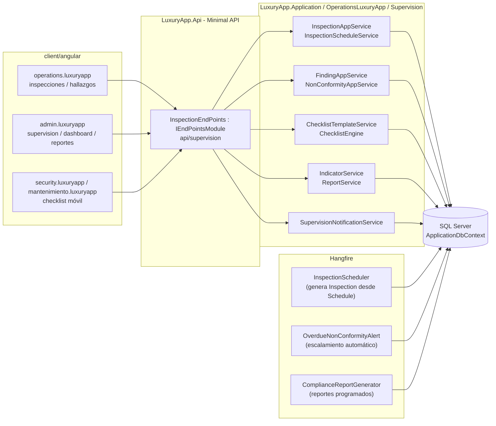
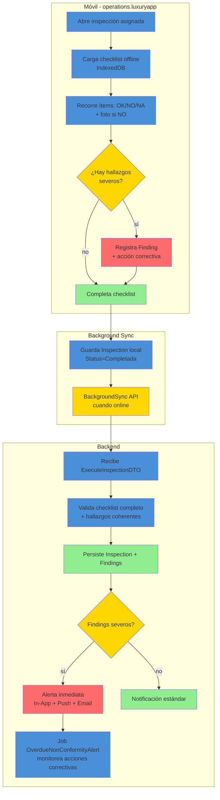
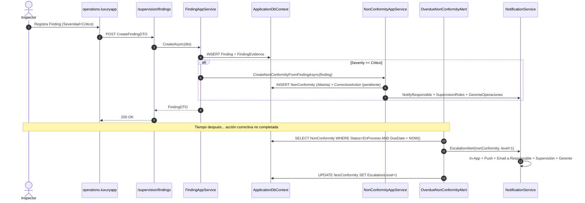
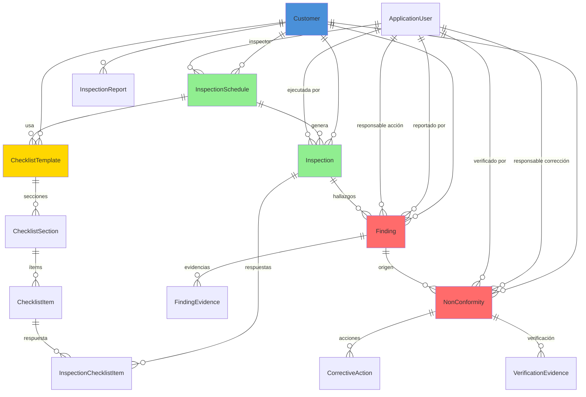

# Supervisión (Inspección y Control de Calidad) — Documentación Técnica

> **Ruta**: 📂 Documentación > 💼 Operaciones > 👁️ Supervisión
> **📅 Última Revisión**: 13-jul-26
> **🛡️ Estado**: ✅ Vigente
> **👤 Responsable**: @equipo-supervision

---

## 📑 Tabla de Contenidos

1. [Resumen Ejecutivo](#-resumen-ejecutivo)
2. [Visión Funcional](#-visión-funcional)
3. [Arquitectura Técnica](#-arquitectura-técnica)
4. [API Endpoints](#-api-endpoints)
5. [Flujo del Sistema](#-flujo-del-sistema)
6. [Componentes Frontend](#-componentes-frontend)
7. [Reglas de Negocio](#-reglas-de-negocio)
8. [Matriz de Permisos](#-matriz-de-permisos)
9. [Catálogo de Roles del Sistema](#-catálogo-de-roles-del-sistema)
10. [Base de Datos](#-base-de-datos)
11. [Performance](#-performance)
12. [Glosario de Términos](#-glosario-de-términos)
13. [Checklist de Validación](#-checklist-de-validación)
14. [Historial de Cambios](#-historial-de-cambios)

---

## 🎯 Resumen Ejecutivo

**Propósito**: Módulo de supervisión, inspección y control de calidad que permite programar y ejecutar inspecciones periódicas/aleatorias a áreas comunes, instalaciones y proveedores del condominio, registrando hallazgos, no conformidades y generando indicadores de cumplimiento.

**Actores Involucrados** (`ApplicationRoleEnum`): `Administrador`, `GerenteOperaciones`, `GerenteAtencion`, `Asistente`, `SupervisionOperativa`, `JefeMantenimiento`, `TecnicoMantenimiento`, `Concierge`, `Jardineria`, `Limpieza`, `Seguridad`, `Proveedor`, `SuperUsuario`, `Comite`, `Condomino` (visualización reportes).

**Dependencias**: `Customer` (tenant), `Property` + `PropertyMember` (unidad/área inspeccionada), `ApplicationUser` (inspector/responsable), `Equipment` (activos inspeccionados), `Provider` (proveedores supervisados), `Charge` (costos reinspección/corrección), Hangfire (programación), EPPlus (exportación), OneSignal (alertas).

**Alcance**:

- ✅ Incluye: Inspecciones CRUD + programación recurrente (RRULE) + checklists dinámicos, Hallazgos (tipología + severidad + evidencias + acciones correctivas), No conformidades (flujo apertura/seguimiento/cierre), Indicadores KPI (cumplimiento, tendencia, top hallazgos), Reportes PDF/Excel, Alertas vencimiento/incumplimiento.
- ❌ No incluye: Auditoría interna formal (ISO), gestión de certificaciones, integración sensores IoT, matriz de riesgos corporativa.

---

## 🔍 Visión Funcional

**HU-01 — Programación y ejecución de inspecciones**

> Como **supervisor** quiero programar inspecciones recurrentes (semanal/quincenal/mensual) con checklist por área/tipo y asignar inspector.
> **Criterios**: `InspectionSchedule` con RRULE + `ChecklistTemplate` (secciones + ítems + tipo respuesta: OK/NO/NA + foto obligatoria opcional); ejecución móvil offline-first → sincroniza al conectar; genera `Inspection` con `Status` (`Programada`|`EnCurso`|`Completada`|`Cancelada`|`Reprogramada`).

**HU-02 — Registro de hallazgos y no conformidades**

> Como **inspector** quiero registrar hallazgos durante la inspección con severidad, evidencias y acción correctiva propuesta.
> **Criterios**: `Finding` vinculado a `Inspection` + `ChecklistItem`; `Severity` (`Leve`|`Moderado`|`Critico`|`RiesgoSeguridad`); `Category` (`Limpieza`|`Mantenimiento`|`Seguridad`|`Normativa`|`Estetica`|`Documental`); `Evidence[]` (foto/video/documento); `CorrectiveAction` (descripción + responsable + fecha compromiso); si `Severity >= Critico` → alerta inmediata + genera `Charge` tipo `CorrectionCost` si aplica.

**HU-03 — Seguimiento y cierre de no conformidades**

> Como **supervisor** quiero dar seguimiento a acciones correctivas hasta cierre efectivo con verificación.
> **Criterios**: `NonConformity` (abre de `Finding` severo o manual); flujo `Abierta` → `EnProceso` → `Verificacion` → `Cerrada`|`Reabierta`; `VerificationEvidence` obligatoria al cerrar; escalamiento automático si `DueDate` vencida → notifica a `ResponsibleUserId` + `SupervisionRoles` + `GerenteOperaciones`.

**HU-04 — Indicadores y reportes de cumplimiento**

> Como **gerente** quiero ver KPIs de inspección: % cumplimiento programa, hallazgos por severidad/categoría/área, tiempo medio cierre, tendencia mensual.
> **Criterios**: Dashboard con `InspectionComplianceRate`, `FindingsBySeverity`, `FindingsByCategory`, `FindingsByArea`, `AvgClosureTimeDays`, `OverdueNonConformities`; filtros por rango fechas, inspector, área; exportación PDF/Excel; reporte programado email semanal/mensual a `Comite`/`Administrador`.

---

## 🏗️ Arquitectura Técnica

| Capa          | Tecnología                                                           |
| ------------- | -------------------------------------------------------------------- |
| Backend       | .NET 10, Minimal APIs (`IEndpointModule`), EF Core 10                |
| Checklists    | Motor dinámico JSON (secciones + ítems + validaciones condicionales) |
| Programación  | RRULE (iCal) para recurrencia; Hangfire `RecurringJob`               |
| Offline móvil | `IndexedDB` + `BackgroundSync` API; cola local → sincroniza online   |
| Jobs          | Hangfire (`RecurringJob` + `BackgroundJob`)                          |
| Exportación   | EPPlus (`GetAsByteArray`) + PDF (`PdfGeneratorService`)              |
| Respuestas    | `ApiResponseDTO<T>` (nunca `ProblemDetails`)                         |
| Mapeo         | Explícito `ToDTO()` (AutoMapper prohibido)                           |
| Frontend      | Angular 22 (standalone, signals, OnPush), Bootstrap 5, catálogo `@ui/*`  |

---

## 📱 Mobile Responsive (§15 CONVENTIONS.md)

| Vista                                                    | Patrón (§15.2)                | Implementación                                                                                                                       |
| -------------------------------------------------------- | ----------------------------- | ------------------------------------------------------------------------------------------------------------------------------------ |
| `InspectionList` / `InspectionForm` / `InspectionDetail` | **B — Componentes Separados** | Wrapper `@if (platform.isMobile()) <app-inspection-list-mobile />` `:else <app-inspection-list />`                                   |
| `ChecklistExecution` (ejecución móvil)                   | **C — Adaptive Wrapper**      | Mobile: `ion-content` + `ion-list` + `ion-item` expansible + cámara nativa + `ion-fab` guardar; Web: `p-table` editable + `p-dialog` |
| `FindingForm` / `NonConformityDetail`                    | **B — Componentes Separados** | Mobile: `ion-modal` firma verificación + cámara; Web: `p-dialog`                                                                     |
| `SupervisionDashboard` / `Reports`                       | **A — CSS Responsive**        | PrimeFlex grid (`p-col-*`), gráficos `@defer` Chart.js, tablas scroll horizontal                                                     |

**Reglas aplicadas:**

- Breakpoint único: 768px (`PlatformService.isMobile()`)
- Touch targets ≥ 44×44px en todos los botones/iconos móviles
- Safe areas: `ion-content` maneja notch/status bar/home indicator
- Offline-first: `IndexedDB` guarda inspección parcial → `BackgroundSync` sincroniza al conectar
- Cámara: `Capacitor Camera` nativo móvil / `navigator.mediaDevices.getUserMedia` web
- Modales en móvil: `ion-modal` vía `IonicDialogModal` (nunca `DynamicDialog`)
- Pull-to-refresh + infinite scroll en listados
- Acciones principales en thumb zone: FAB `[fabMode]="true"`

---

## 🌐 API Endpoints

Base por dominio (kebab-case, plural, minúsculas, prefijo `api/`):

| Dominio          | Base Path                              | Descripción                                       |
| ---------------- | -------------------------------------- | ------------------------------------------------- |
| Inspecciones     | `api/supervision/inspections`          | CRUD + ejecución + reprogramación                 |
| Programación     | `api/supervision/inspection-schedules` | CRUD recurrencia RRULE + checklists               |
| Checklists       | `api/supervision/checklist-templates`  | CRUD plantillas (secciones/ítems/validaciones)    |
| Hallazgos        | `api/supervision/findings`             | CRUD + severidad + evidencias + acción correctiva |
| No conformidades | `api/supervision/non-conformities`     | Flujo apertura/seguimiento/cierre + escalamiento  |
| Indicadores      | `api/supervision/indicators`           | KPIs + tendencias + exportación                   |
| Reportes         | `api/supervision/reports`              | PDF/Excel programados + ad-hoc                    |

### Tabla General (muestra representativa)

| Método | Path                               | Roles                      | Request DTO                                | Response DTO                    | Códigos HTTP          |
| ------ | ---------------------------------- | -------------------------- | ------------------------------------------ | ------------------------------- | --------------------- |
| POST   | `/inspections`                     | Supervisión, Mantenimiento | `CreateInspectionDTO`                      | `InspectionDTO`                 | 200 · 400 · 403 · 409 |
| GET    | `/inspections`                     | Supervisión, Admin, Comité | `PaginationCommonDTO` + filtros            | `PagedResultDTO<InspectionDTO>` | 200 · 400             |
| POST   | `/inspections/{id}/execute`        | Inspector                  | `ExecuteInspectionDTO`                     | `InspectionDTO`                 | 200 · 400 · 404 · 409 |
| POST   | `/inspection-schedules`            | Supervisión, Admin         | `CreateInspectionScheduleDTO`              | `InspectionScheduleDTO`         | 200 · 400 · 409       |
| POST   | `/checklist-templates`             | Supervisión, Admin         | `CreateChecklistTemplateDTO`               | `ChecklistTemplateDTO`          | 200 · 400 · 409       |
| POST   | `/findings`                        | Inspector, Supervisión     | `CreateFindingDTO`                         | `FindingDTO`                    | 200 · 400 · 403       |
| PUT    | `/findings/{id}/corrective-action` | Responsable, Supervisión   | `UpdateCorrectiveActionDTO`                | `bool`                          | 200 · 400 · 404 · 409 |
| POST   | `/non-conformities`                | Supervisión, Admin         | `CreateNonConformityDTO`                   | `NonConformityDTO`              | 200 · 400 · 403       |
| PUT    | `/non-conformities/{id}/verify`    | Supervisión, Admin         | `VerifyNonConformityDTO`                   | `bool`                          | 200 · 400 · 404 · 409 |
| GET    | `/indicators/compliance`           | Supervisión, Admin, Comité | `fromDate`, `toDate`, `areaId` (query)     | `ComplianceIndicatorsDTO`       | 200 · 400             |
| GET    | `/reports/compliance`              | Supervisión, Admin, Comité | `fromDate`, `toDate`, `format` (pdf/excel) | `FileStreamResult`              | 200 · 400             |

> [!NOTE]
> El campo `responseCode` viaja **dentro** de `ApiResponseDTO`; el status HTTP siempre es `200 OK` para respuestas de negocio (incluidos errores 4xx de dominio). `500` solo para excepciones no controladas.

---

## 🔄 Flujo del Sistema

### Ejecución de inspección móvil (offline-first)

### Ciclo de no conformidad (escalamiento automático)

---

## 🖥️ Componentes Frontend

Workspace: **`client/angular`** (standalone, signals, OnPush, catálogo `@ui/*`, `ApiResponseService`, `Endpoints`).

### Routing

| App (§14)              | Ruta                                    | Componente                   | Lazy loading | Guard       | Menú |
| ---------------------- | --------------------------------------- | ---------------------------- | :----------: | ----------- | :--: |
| `operations.luxuryapp` | `supervision/inspecciones`              | `InspectionList`             |      ✅      | —           |  ✅  |
| `operations.luxuryapp` | `supervision/inspecciones/ejecutar/:id` | `InspectionExecution`        |      ✅      | —           |  ❌  |
| `operations.luxuryapp` | `supervision/hallazgos`                 | `FindingList`                |      ✅      | —           |  ✅  |
| `operations.luxuryapp` | `supervision/no-conformidades`          | `NonConformityList`          |      ✅      | —           |  ✅  |
| `admin.luxuryapp`      | `admin/supervision/programacion`        | `InspectionScheduleList`     |      ✅      | `authGuard` |  ✅  |
| `admin.luxuryapp`      | `admin/supervision/checklists`          | `ChecklistTemplateList`      |      ✅      | `authGuard` |  ✅  |
| `admin.luxuryapp`      | `admin/supervision/dashboard`           | `SupervisionDashboard`       |      ✅      | `authGuard` |  ✅  |
| `admin.luxuryapp`      | `admin/supervision/reportes`            | `ComplianceReportList`       |      ✅      | `authGuard` |  ✅  |
| `comite.luxuryapp`     | `comite/supervision`                    | `ComiteSupervisionDashboard` |      ✅      | —           |  ✅  |

### Catálogo de Componentes (representativo)

| Componente              | Selector                      | Tipo   | Signals clave                                                          | Servicios                                  | Comportamiento                                                                                                             |
| ----------------------- | ----------------------------- | ------ | ---------------------------------------------------------------------- | ------------------------------------------ | -------------------------------------------------------------------------------------------------------------------------- |
| `InspectionList`        | `app-inspection-list`         | web    | `dataSignal`, `loading`, `filters`                                     | `ApiResponseService`                       | `p-table` virtual scroll, filtros inspector/área/estado/fecha, exportar, `il-button-*`                                     |
| `InspectionListMobile`  | `app-inspection-list-mobile`  | mobile | `dataSignal`, `refreshing`                                             | `ApiResponseService`                       | `ion-list` + `ion-item-sliding` + `ili-action-menu`, pull-to-refresh, infinite scroll                                      |
| `InspectionExecution`   | `app-inspection-execution`    | mobile | `checklistSignal`, `currentSection`, `findingsSignal`, `offlineSignal` | `ApiResponseService`, `OfflineSyncService` | `ion-content` + secciones colapsables, ítems `ion-item` radio OK/NO/NA, cámara nativa, `ion-fab` guardar, `BackgroundSync` |
| `ChecklistTemplateList` | `app-checklist-template-list` | web    | `dataSignal`, `loading`                                                | `ApiResponseService`                       | `p-table` plantillas, editor JSON secciones/ítems/validaciones, `il-button-*`                                              |
| `FindingList`           | `app-finding-list`            | web    | `dataSignal`, `filters`                                                | `ApiResponseService`                       | `p-table` badges severidad/categoría, `il-button-*` acción correctiva, filtro área/inspector                               |
| `NonConformityList`     | `app-non-conformity-list`     | web    | `dataSignal`, `filters`, `escalationSignal`                            | `ApiResponseService`                       | `p-table` badges estado/escalamiento, timeline visual, `il-button-*` verificar/reenviar                                    |
| `SupervisionDashboard`  | `app-supervision-dashboard`   | web    | `kpisSignal`, `trendSignal`, `overdueSignal`                           | `ApiResponseService`                       | KPIs tarjetas, gráficos `@defer` Chart.js (cumplimiento, hallazgos severidad, tendencia cierre), alertas vencidas          |
| `ComplianceReportList`  | `app-compliance-report-list`  | web    | `dataSignal`, `filters`                                                | `ApiResponseService`                       | `p-table` reportes generados, `onDownloadFile` PDF/Excel, programar nuevo                                                  |

**Estilos**: Bootstrap 5 (`card`, `grid`, `text-*`); botones/inputs catálogo `@ui/*` (`il-button`, `il-button-save`, `custom-input-*-signal`, `ili-button-*` mobile). **Testing**: `.spec.ts` por componente (Vitest) — cobertura básica inicialización.

**Interfaces** (`core/interfaces/supervision.dto.ts`): `inspection`, `inspection-schedule`, `checklist-template`, `finding`, `non-conformity`, `indicator`, `report`, `paged-result`.

---

## 📜 Reglas de Negocio

| ID     | SI (condición)                    | ENTONCES (acción)                                                                                                                                                                                        |
| ------ | --------------------------------- | -------------------------------------------------------------------------------------------------------------------------------------------------------------------------------------------------------- |
| RN-001 | Cualquier operación del módulo    | Se filtra por `currentUser.CustomerId`; ningún acceso cruza tenants                                                                                                                                      |
| RN-002 | Se crea `InspectionSchedule`      | Valida `RRULE` sintaxis (iCal); `ChecklistTemplateId` existe y activo; `InspectorUserId` pertenece al tenant                                                                                             |
| RN-003 | Job `InspectionScheduler` ejecuta | Genera `Inspection` con `Status=Programada` + `InspectorUserId` + `ChecklistTemplate` clonado (snapshot); notifica a inspector (In-App + Push)                                                           |
| RN-004 | Inspector ejecuta `Inspection`    | Debe completar 100% ítems obligatorios del checklist; si ítem `RequiresPhoto=true` y respuesta `NO` → exige evidencia; `Findings` vinculados a `ChecklistItemId`                                         |
| RN-005 | `Finding.Severity >= Critico`     | Crea `NonConformity` automática (`Status=Abierta`) + `CorrectiveAction` (responsable = `Finding.ResponsibleUserId` o inspector) + `DueDate` = hoy + SLA según severidad (Critico=2d, RiesgoSeguridad=1d) |
| RN-006 | `NonConformity` vence sin cerrar  | Job `OverdueNonConformityAlert` escala: Nivel 1 (responsable + supervisión), Nivel 2 (+ gerente operaciones), Nivel 3 (+ dirección); cada nivel = notificación In-App + Push + Email                     |
| RN-007 | Cierre `NonConformity`            | Requiere `VerificationEvidence[]` (foto/documento) + `VerifiedByUserId` + `VerifiedAt`; valida que evidencia corresponda a acción correctiva                                                             |
| RN-008 | `Inspection` completada           | Calcula `ComplianceScore` = (ítems OK / total obligatorios) \* 100; actualiza `InspectionSchedule.LastComplianceScore`; si < 70% → alerta supervisión                                                    |
| RN-009 | Reporte programado                | Job `ComplianceReportGenerator` ejecuta según `ReportSchedule` (RRULE); genera PDF/Excel → `FileStorage` + `Notification` a destinatarios (`Comite`/`Administrador`/`SupervisionRoles`)                  |
| RN-010 | Multi-tenant                      | Todas las queries filtran `CustomerId` del usuario autenticado; ningún acceso cross-tenant                                                                                                               |

---

## 🔐 Matriz de Permisos

Roles de `ApplicationRoleEnum`. Agrupados por `RoleType`.

| Acción                      | Supervisión (Corporate) | Operativo (Staff) | Proveedores (Contractor) | Comité/Residente (Client) | Sistema |
| --------------------------- | :---------------------: | :---------------: | :----------------------: | :-----------------------: | :-----: |
| Inspecciones programar      |           ✅            |        ✅         |            ❌            |            ❌             |   ✅    |
| Inspecciones ejecutar       |           ❌            |  ✅ (Inspector)   | ✅ (Proveedor asignado)  |            ❌             |   ✅    |
| Inspecciones ver/reporte    |           ✅            |        ✅         |            ❌            |        ✅ (Comité)        |   ✅    |
| Hallazgos registrar         |           ❌            |  ✅ (Inspector)   |      ✅ (Proveedor)      |            ❌             |   ✅    |
| Hallazgos acción correctiva |           ✅            | ✅ (Responsable)  |      ✅ (Proveedor)      |            ❌             |   ✅    |
| No conformidades gestionar  |           ✅            | ✅ (Seguimiento)  |            ❌            |            ❌             |   ✅    |
| No conformidades verificar  |           ✅            |        ❌         |            ❌            |            ❌             |   ✅    |
| Checklists CRUD             |           ✅            |        ❌         |            ❌            |            ❌             |   ✅    |
| Dashboard/Indicadores       |           ✅            |        ✅         |            ❌            |        ✅ (Comité)        |   ✅    |
| Reportes exportar           |           ✅            |        ✅         |            ❌            |            ❌             |   ✅    |
| Escalamiento alertas        |           ✅            |        ❌         |            ❌            |            ❌             |   ✅    |

**Detalle por RoleType**:

- **Corporate**: `SupervisionOperativa`, `AdministracionGeneral`, `Legal`, `SistemasGeneral`
- **Staff**: `Administrador`, `GerenteOperaciones`, `GerenteAtencion`, `Asistente`, `JefeMantenimiento`, `TecnicoMantenimiento`, `Concierge`, `SupervisionOperativa`
- **Contractor**: `Proveedor`, `Jardineria`, `Limpieza`, `Seguridad`
- **Client**: `Comite`, `Condomino`
- **System**: `SuperUsuario`

---

## 🗄️ Catálogo de Roles del Sistema

El módulo **no introduce roles nuevos**: reutiliza `ApplicationRoleEnum` mediante grupos en `SupervisionRoles` (`AdminRoles`, `InspectorRoles`, `ResponsibleRoles`, `ViewerRoles`). La autorización es **por rol** (`AuthorizeAttribute { Roles = ... }`), no por claims.

---

## 🗄️ Base de Datos

`ApplicationDbContext` (SQL Server). Filtrado por `CustomerId` manual (vía `InspectorUserId`/`ResponsibleUserId` → `ApplicationUser.CustomerId`). FKs con `OnDelete(Restrict)`.

| Tabla                      | Columnas clave                                                                                                                                                                    | Índices                                                                                  |
| -------------------------- | --------------------------------------------------------------------------------------------------------------------------------------------------------------------------------- | ---------------------------------------------------------------------------------------- | ----------------------------------------------------- | ---------------------------------------------------------------------------------------------- | ----------------------------------------------------------------------------------------------------------------------------------- | -------------------------------------------------------------------------------------------------------------------- | ----------------------- | ------------------------------------------------------------------------------------------------------------------ |
| `InspectionSchedules`      | `Id`, `CustomerId`, `Name`, `RRULE`, `StartDate`, `EndDate`, `ChecklistTemplateId`, `InspectorUserId`, `AreaIds`?, `PropertyIds?`, `IsActive`, `LastComplianceScore`, `CreatedAt` | `IX (CustomerId, IsActive)`, `IX (CustomerId, InspectorUserId)`, `UX (CustomerId, Name)` |
| `Inspections`              | `Id`, `CustomerId`, `ScheduleId`, `InspectorUserId`, `PropertyId`, `AreaId`, `Status` (`Programada`                                                                               | `EnCurso`                                                                                | `Completada`                                          | `Cancelada`                                                                                    | `Reprogramada`), `StartedAt`, `CompletedAt`, `ComplianceScore`, `OfflineSyncId`, `CreatedAt`                                        | `IX (CustomerId, Status, CompletedAt)`, `IX (CustomerId, ScheduleId)`, `IX (CustomerId, InspectorUserId)`            |
| `ChecklistTemplates`       | `Id`, `CustomerId`, `Name`, `Description`, `Sections` (JSON), `Version`, `IsActive`, `CreatedAt`                                                                                  | `IX (CustomerId, IsActive)`, `UX (CustomerId, Name)`                                     |
| `InspectionChecklistItems` | `Id`, `InspectionId`, `ChecklistItemId`, `Response` (`OK`                                                                                                                         | `NO`                                                                                     | `NA`), `EvidencePath?`, `Observations?`, `AnsweredAt` | `IX (InspectionId, ChecklistItemId)`                                                           |
| `Findings`                 | `Id`, `CustomerId`, `InspectionId`, `ChecklistItemId?`, `InspectorUserId`, `ResponsibleUserId`, `Category`, `Severity` (`Leve`                                                    | `Moderado`                                                                               | `Critico`                                             | `RiesgoSeguridad`), `Description`, `CorrectiveAction`, `DueDate`, `Status` (`Abierto`          | `EnProceso`                                                                                                                         | `Verificacion`                                                                                                       | `Cerrado`), `CreatedAt` | `IX (CustomerId, Severity, Status)`, `IX (CustomerId, ResponsibleUserId, Status)`, `IX (CustomerId, InspectionId)` |
| `NonConformities`          | `Id`, `CustomerId`, `FindingId?`, `Title`, `Description`, `Status` (`Abierta`                                                                                                     | `EnProceso`                                                                              | `Verificacion`                                        | `Cerrada`                                                                                      | `Reabierta`), `EscalationLevel` (0-3), `ResponsibleUserId`, `VerifiedByUserId?`, `VerifiedAt?`, `DueDate`, `ClosedAt?`, `CreatedAt` | `IX (CustomerId, Status, DueDate)`, `IX (CustomerId, ResponsibleUserId, Status)`, `IX (CustomerId, EscalationLevel)` |
| `CorrectiveActions`        | `Id`, `NonConformityId`, `Description`, `ResponsibleUserId`, `DueDate`, `Status` (`Pendiente`                                                                                     | `EnProceso`                                                                              | `Completada`), `CompletedAt?`, `CreatedAt`            | `IX (NonConformityId, ResponsibleUserId)`                                                      |
| `VerificationEvidences`    | `Id`, `NonConformityId`, `FilePath`, `FileName`, `Description`, `VerifiedByUserId`, `VerifiedAt`                                                                                  | `IX (NonConformityId)`                                                                   |
| `InspectionReports`        | `Id`, `CustomerId`, `ReportType` (`Cumplimiento`                                                                                                                                  | `Hallazgos`                                                                              | `NoConformidades`                                     | `Tendencia`), `FilePath`, `GeneratedAt`, `GeneratedBy`, `FromDate`, `ToDate`, `Filters` (JSON) | `IX (CustomerId, GeneratedAt)`, `IX (CustomerId, ReportType)`                                                                       |

**Enums** (`LuxuryApp.Shared.Enums`): `EInspectionStatus`, `EFindingCategory`, `EFindingSeverity`, `EFindingStatus`, `ENonConformityStatus`, `ECorrectiveActionStatus`, `EChecklistResponse`, `EInspectionComplianceLevel`.

---

## ⚡ Performance

- **Lazy loading**: componentes Angular vía `loadComponent` (una carga por ruta).
- **N+1**: consultas con `join`/proyección `.Select()` (sin cargas perezosas por fila); listados paginados server-side (`PaginationCommonDTO`, tope 200).
- **Offline móvil**: `IndexedDB` almacena inspección parcial (≈ 50-200 KB); `BackgroundSync` envía batch al conectar (reintento exponencial).
- **Checklists**: `ChecklistTemplate.Sections` JSON → deserializa en cliente; motor de validación condicional en TypeScript (no round-trip servidor).
- **Programación**: `InspectionScheduler` usa `NRecurrences` (RRULE parser) → genera `Inspection` en lote (batch 50); `Hangfire` `RecurringJob` diario 02:00.
- **Escalamiento**: `OverdueNonConformityAlert` consulta `NonConformity` con `Status IN (Abierta, EnProceso, Verificacion) AND DueDate < NOW()`; índice compuesto `(CustomerId, Status, DueDate)`.
- **Indicadores**: agregaciones SQL (`COUNT`, `AVG`, `PERCENTILE_CONT`) con `GROUP BY` en DB; no materializa entidades.
- **Export**: tope 10 000 filas por archivo (EPPlus streaming).
- **Frontend**: `p-table [virtualScroll]="true"` + `[lazy]="true"`; `@defer (on viewport)` para gráficos Chart.js en dashboard.

---

## 📖 Glosario de Términos

| Término                | Definición                                                                                         |
| ---------------------- | -------------------------------------------------------------------------------------------------- |
| **InspectionSchedule** | Programa recurrente de inspección (RRULE + checklist + inspector + áreas)                          |
| **Inspection**         | Ejecución concreta de una inspección programada (o ad-hoc)                                         |
| **ChecklistTemplate**  | Plantilla reutilizable: secciones + ítems + tipo respuesta + validaciones                          |
| **ChecklistItem**      | Ítem individual: texto, tipo respuesta (OK/NO/NA), requiere foto, validación condicional           |
| **Finding**            | Hallazgo detectado en inspección (categoría + severidad + acción correctiva)                       |
| **NonConformity**      | No conformidad formal abierta desde hallazgo severo o manual; flujo de cierre                      |
| **CorrectiveAction**   | Acción para resolver no conformidad (responsable + fecha + evidencia verificación)                 |
| **EscalationLevel**    | Nivel de escalamiento automático por vencimiento (0=normal, 1=supervisión, 2=gerente, 3=dirección) |
| **ComplianceScore**    | % ítems OK / total obligatorios en inspección (0-100)                                              |
| **RRULE**              | Regla de recurrencia iCal (ej. `FREQ=WEEKLY;BYDAY=MO;INTERVAL=1`)                                  |

---

## ✅ Checklist de Validación ([CONVENTIONS.md §11](../../../../../../CONVENTIONS.md#11-estándares-de-documentación))

> [!NOTE]
> El link a `CONVENTIONS.md` asume que el documento vive en la raíz del propio módulo. Ajusta la profundidad relativa (`../../../../../../`) según la ubicación final.

- [x] CERO mojibake (UTF-8 sin BOM)
- [x] CERO `any` en TypeScript
- [x] Fechas en formato `dd-MMM-yy`
- [x] Endpoints front/back coinciden carácter a carácter
- [x] Diagramas Mermaid válidos (flowchart swimlanes + sequence con `autonumber`)
- [x] Colores Mermaid según §11 (verde `#90EE90` éxito, amarillo `#FFD700` decisión, azul `#4A90D9` proceso, rojo `#FF6B6B` error)
- [x] Reglas de negocio en formato `SI/ENTONCES` (`RN-xxx`)
- [x] Roles usan nombres exactos de `ApplicationRoleEnum`
- [x] Mobile responsive: §15 aplicado según tipo de vista
- [x] Sin PII en logs
- [x] Emojis consistentes · Todo en español

---

## 📝 Historial de Cambios

| Fecha     | Versión | Autor               | Cambios                                                                                                                                                                                                                                                      |
| --------- | ------- | ------------------- | ------------------------------------------------------------------------------------------------------------------------------------------------------------------------------------------------------------------------------------------------------------ |
| 10-jun-26 | 1.0     | @equipo-supervision | Documentación inicial del módulo (template mínimo)                                                                                                                                                                                                           |
| 13-jul-26 | 2.0     | @kilo               | Actualización a template §11 CONVENTIONS.md: Mobile responsive §15, checklist §11, Mermaid colores, sin PII, sin `any`, rutas api kebab-case, TOC completo, arquitectura, flujos, componentes, matriz permisos, ER diagram, performance, glosario, historial |
