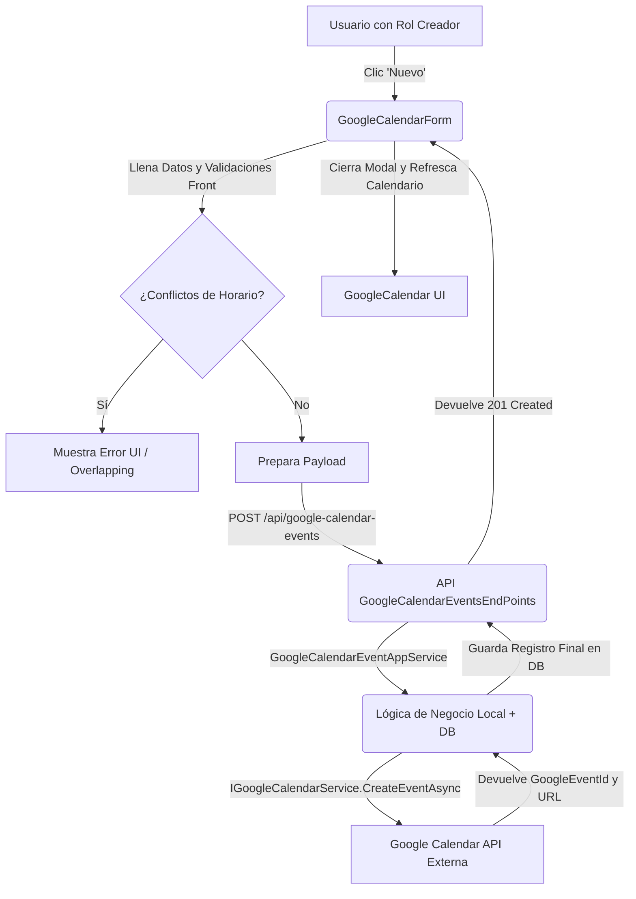

# Auditoría: Módulo GoogleCalendar - 2026-08-11

## 1. Hallazgos Críticos (Errores que ROMPEN Lógica)
- ✅ **Sin Errores Críticos Identificados:** Los permisos de frontend y backend se encuentran perfectamente sincronizados.
- ⚠️ **Hallazgo Arquitectónico / Ubicación (Medio):** La solicitud de la auditoría menciona la ruta `OperationsLuxuryApp/GoogleCalendar/` como el Backend, sin embargo, dicha ruta solo contiene el Wrapper de Integración con Google (Service Account, JWT, REST payload). Los Endpoints reales (`/api/google-calendar-events`), DTOs y lógica de negocio consumidos por el Frontend se encuentran en `OperationsLuxuryApp/JuntasMensuales/GoogleCalendar/`. Se recomienda revisar si la carpeta en frontend (`apps/operations.luxuryapp/google-calendar`) debería reubicarse dentro de `juntas-mensuales` para mantener simetría con el backend, o si la lógica del backend debería estar descentralizada de JuntasMensuales.

## 2. Matriz de Permisos

| Endpoint | Método | Acción | Rol Requerido | ¿Front lo Llama? | ¿Hay Guard/Check? |
|----------|--------|--------|---------------|-----------------|------------------|
| `/api/google-calendar-events/customer/{id}` | GET | Listar Eventos | Administrador, Asistente, GerenteOperaciones, GerenteAtencion, SuperUsuario, Direccion, GerenteMantenimiento, SupervisionOperativa | ✅ SÍ | ✅ (Front Check `canViewAllDetails` / `customerId`) |
| `/api/google-calendar-events/{id}` | GET | Ver Detalle | (Mismos de Lectura) | ✅ SÍ | ✅ |
| `/api/google-calendar-events` | POST | Crear Evento | Administrador, Asistente, GerenteOperaciones, GerenteAtencion, SuperUsuario | ✅ SÍ | ✅ (Front Check `canCreate`) |
| `/api/google-calendar-events/{id}` | PUT | Actualizar | (Mismos de Creación) | ✅ SÍ | ✅ (Front Check `canManageItem`) |
| `/api/google-calendar-events/{id}/series` | PUT | Actualizar Serie | (Mismos de Creación) | ✅ SÍ | ✅ |
| `/api/google-calendar-events/{id}` | DELETE | Eliminar | (Mismos de Creación) | ✅ SÍ | ✅ (Front Check `canManageItem`) |
| `/api/google-calendar-events/{id}/series`| DELETE | Eliminar Serie | (Mismos de Creación) | ✅ SÍ | ✅ |

*Nota: La sincronización de roles entre API y UI es excelente.*

## 3. Validaciones Inconsistentes (Front vs Back)

| Campo | Validación Frontend | Validación Backend | ¿Coinciden? |
|-------|-------------------|------------------|-----------|
| **Title** | (Generado automáticamente / No en form) | `MaxLength(200)` | ✅ OK (Generado back) |
| **CustomerId** | `Required` | `Required` | ✅ OK |
| **StartAt / EndAt** | `Required`, `meetingDate` + `startTime` calculados, validación de conflictos | `Required` | ⚠️ Front valida conflictos locales (overlappingSchedule) que el back quizás valida después, pero el back asume tipos `DateTime`. |
| **Description** | N/A (solo texto libre) | `MaxLength(2000)` | ❌ Front no limita a 2000 chars |
| **Location** | `Required` | `Required`, `MaxLength(250)` | ❌ Front no limita a 250 chars |
| **PaddlesQuantity**| `Required` si `RequiresPaddles`, `Min(1)` | (Asumido en Domain / App Service) | ⚠️ Verificar back |
| **Guest Email** | `Required`, `Email` | (Asumido en objeto Guest) | ⚠️ Verificar back |

## 4. Diagramas de Flujo

## 5. Entidades y Relaciones
*Basado en los DTOs analizados en JuntasMensuales:*
| Entidad Lógica | Responsabilidad | Relaciones |
|----------------|-----------------|------------|
| **GoogleCalendarEvent** | Registro principal de un evento programado. | `1:N` con Guests, `1:1` con AssemblyPlan, `N:1` Customer |
| **GoogleCalendarGuest** | Participante / Invitado notificado. | `N:1` con Evento |
| **AssemblyPlan** | Datos operativos (Paddles, Legal, Invitee, AudioVisual) para Asambleas (SubjectType=1). | `1:1` con Evento |

## 6. DTOs vs Interfaces

Se analizó la comparativa entre los DTOs de Backend y Frontend:
- ✅ La correspondencia de propiedades entre `IGoogleCalendarEventDetail` (Front) y `GoogleCalendarEventDetailDTO` (Back) es casi exacta (incluyendo `assembly`, `guests`, `isRecurring`, `hasAssemblyChecklist`, etc.).
- ✅ El form del frontend usa sub-formularios anidados que se compilan correctamente en un objeto coincidente con `GoogleCalendarEventAddOrEditDTO`.

## 7. Listado de Funcionalidades

| Componente | Rol Requerido | ¿Qué Puedo Hacer? |
|-----------|---------------|------------------|
| `google-calendar` | Creadores + Lectores | Visualizar calendario (Month/Week/Day) de eventos. Ver Tooltips. |
| `google-calendar` | Creadores | Crear, Editar o Eliminar eventos. |
| `google-calendar-detail` | Todos con acceso | Ver modal con los detalles de sólo lectura y Google Meet URL. |
| `google-calendar-form` | Creadores | Editar detalles, invitados (Guests) e información extra si es Asamblea (Paddles, Checklist). |

## 8. Recomendaciones
1. **Corregir Validaciones de Longitud (Frontend):** Agregar validadores de `MaxLength(250)` para el campo Location y `MaxLength(2000)` para Description en el frontend (`google-calendar-form.ts`) para evitar errores `HTTP 400` sorpresivos devueltos por el backend.
2. **Reubicación de Carpetas / Refactor (Arquitectura):** Se recomienda consolidar los endpoints y DTOs bajo una sola jerarquía clara en backend o mover la app del frontend a `apps/juntas-mensuales.luxuryapp` en lugar de `operations.luxuryapp`, dado que la lógica de negocio depende fuertemente de la naturaleza de las "Juntas Mensuales" y "Asambleas".
3. **Manejo de Errores Externos:** Asegurar que si la API de Google falla (en `IGoogleCalendarService`), el Frontend muestre un mensaje amigable indicando que "El evento local se generó pero hubo un problema al sincronizar con Google", evitando que el usuario asuma que no se guardó nada. (El DTO maneja el flag `IsSynchronized`).
