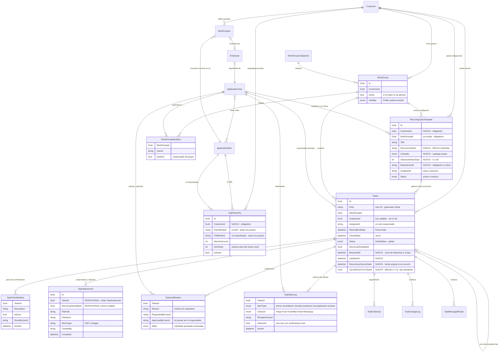
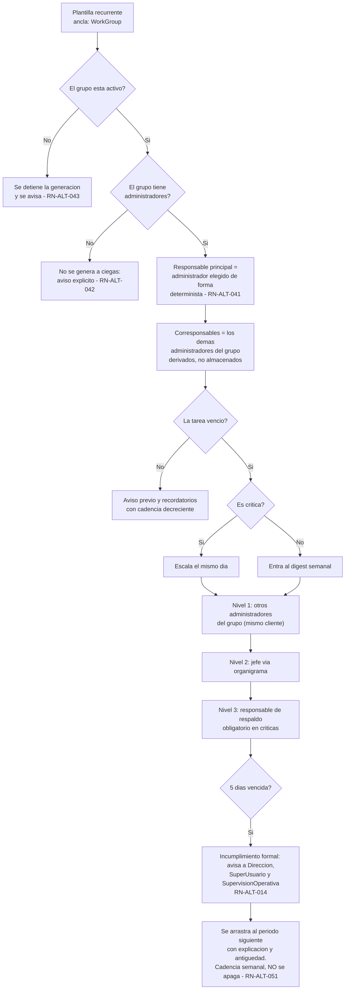
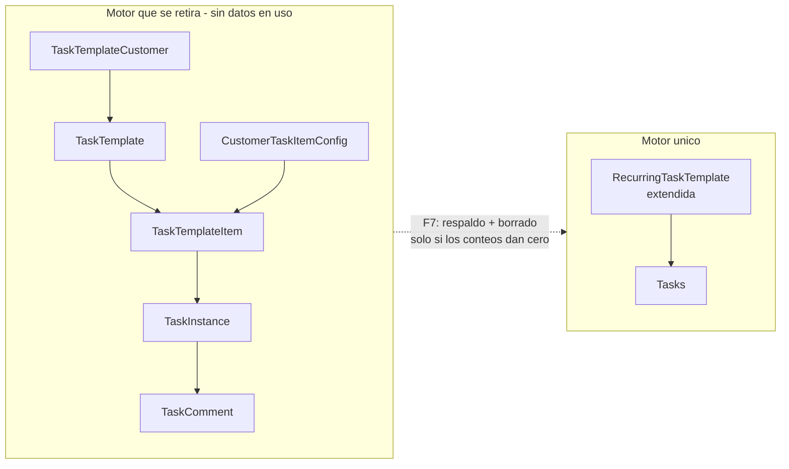

# 04 — Plan de Implementación: Alertas de Tareas Recurrentes

## Metadata

| Campo | Valor |
| --- | --- |
| **Módulo** | Alertas de Tareas Recurrentes |
| **Tipo de trabajo** | B — Ampliación de módulo existente + retiro de motor duplicado |
| **Fecha del plan** | 2026-08-20 |
| **Protocolo** | `conventions/operations/plan-creation-protocol.md` |
| **FASE 0** | `02-business-rules-analysis.md` + `02b-enmienda-anclaje-grupos.md` (**ambos, en ese orden**) |
| **Riesgos** | `03-riesgos-dependencias.md` |
| **Estructura de entidades** | `01b-entidad-estructura.md` |
| **Backend** | `api/LuxuryApp.Application/Moduls/OperationsLuxuryApp/Tasks/` |
| **Frontend** | `client/angular/src/app/apps/operations.luxuryapp/` |
| **Afecta `Shared`** | ✅ Sí — enums nuevos en `LuxuryApp.Shared/Enums`. **No se modifica ninguno existente** |
| **Requiere migración de datos** | ⚠️ Cambios de esquema sí; **migración de datos no** (el motor que se retira no tiene datos en uso, confirmado por el dueño el 2026-08-20) |
| **Estado** | Propuesto — pendiente de aprobación |

---

## 1. Resumen Ejecutivo

### Problema

> Actualmente, el **personal responsable de obligaciones recurrentes** (contadores, RR.HH.,
> mantenimiento, proveedores) sufre de **falta de un control claro y de vigilancia externa**
> cuando intenta **cumplir tareas periódicas obligatorias**, lo que resulta en **incumplimientos
> que sólo se detectan cuando llega el daño** — multa, cliente molesto o retrabajo.

Costo verificado: **6 multas de ~$5,000 MXN = $30,000 MXN**. La causa raíz no es
desconocimiento: el responsable sabía de la obligación, pero su control no era claro y **nadie
más vigilaba**. El detector real del incumplimiento fue un tercero externo: el SAT.

### Solución

Un **motor único de tareas recurrentes anclado al grupo de trabajo**, que:

1. Genera la tarea dentro del grupo y la asigna a su administrador.
2. **Insiste** mientras siga pendiente, en vez de avisar una sola vez al crearla.
3. **Detecta el vencimiento** y escala hacia arriba según la criticidad.
4. Exige **comprobante y checklist** en las tareas críticas.
5. Expone un **tablero de cumplimiento** por grupo y por persona.

En paralelo, retira el motor duplicado que hoy convive en el mismo espacio y que nunca notificó
nada.

### Beneficios

| Antes | Después |
| --- | --- |
| Una notificación, al crear la tarea | Aviso previo, recordatorios y escalación |
| El vencimiento no lo detecta nadie | El sistema lo detecta antes de que llegue el daño |
| El olvido no sube a ningún lado | El jefe se entera en ≤ 1 día en tareas críticas |
| Cerrar una tarea no exige evidencia | Comprobante obligatorio en críticas |
| Dos motores de recurrencia, uno mudo y roto | Uno solo, monitoreado |

---

## 2. Alcance y Restricciones

### Dentro del alcance

- Catálogo de tareas recurrentes anclado a **cliente + grupo(s) de trabajo**, con RRULE,
  criticidad, días de aviso previo y responsable de respaldo.
- Generador único que produce `Tasks` dentro del grupo, con folio real, `CustomerId` y
  notificación.
- Motor de alertas: aviso previo, recordatorio, vencida, escalación comprimida y **corte de tolerancia a los 5 días** con arrastre.
- Justificación con aprobación del jefe.
- Checklist de pasos y comprobante documental (reutilizando `TaskFiles`).
- Tablero de cumplimiento por grupo, área y persona.
- Bitácora auditable de alertas.
- Retiro de `TaskTemplate` / `TaskTemplateItem` / `TaskInstance` y su job.

### Fuera del alcance

| Tema | Motivo |
| --- | --- |
| **Canal SMS** | Decisión del dueño. `SmsService` reporta éxito sin enviar: queda como deuda técnica de otro ticket |
| **Corregir `SmsService`** | Fuera de este módulo. `RN-ALT-006` impide usarlo mientras siga falso |
| **Ampliar el catálogo de festivos** | `HolidayService` sólo tiene los 8 de ley. Un calendario fiscal completo es otro módulo |
| **Rediseñar el sistema de tickets** | Se reutiliza tal cual; sólo se le agrega lo que falta |
| **Detección de vacaciones** | Condicionada a identificar la entidad de periodo vacacional (D-07). Si no se resuelve, se libera sin ella y se documenta |
| **Mover la capa de aplicación fuera de `ReclutamientoLuxuryApp`** | Muere con el retiro del motor viejo; no requiere mudanza |

### Restricciones

| # | Restricción | Origen |
| --- | --- | --- |
| R1 | **Prohibido renumerar, renombrar o eliminar** miembros de `Status`, `PriorityLevel`, `GanttStatus`, `NotificationChannel` y cualquier `SelectItem` existente. **Agregar al final sí se permite**, y obliga a revisar todos los consumidores | Regla crítica del proyecto, con el matiz que ya documenta `NotificationChannel`. Ver A11 y RT-21 |
| R2 | Todo enum nuevo lleva `DisplayName` en español y se registra en `SharedLuxuryApp/SelectItemEnumEndPoints` | Reglas críticas 6 y 7 |
| R3 | Ningún valor visual hardcodeado: todo por `var(--ds-*)` | Regla crítica 8. Ver §3.6 |
| R4 | Ninguna alerta puede reportarse como enviada si el canal no la entregó | `RN-ALT-006` |
| R5 | WhatsApp no puede usarse hasta habilitarlo en `INotificationDispatcher` | `NotificationDispatcher.cs:34-38` |
| R6 | Ninguna consulta puede devolver tareas de otro cliente, aunque `Tasks` no sea `ITenantEntity` | `RN-ALT-047` |
| R7 | El acceso a documentos sigue el patrón documental del proyecto (`IFileReadPathService`) | Regla crítica 9 |

---

## 3. Arquitectura y Diseño Técnico

### 3.1 Decisiones de diseño

| # | Decisión | Justificación |
| --- | --- | --- |
| A1 | **Extender `RecurringTaskTemplate`**, no crear entidad nueva de plantilla | Ya tiene `WorkGroupId` obligatorio y la relación con `Tasks`. Crear otra sería duplicar |
| A2 | **`PlannedEndDate` es la fecha límite** | Es el campo nativo de Gantt para fin planeado. `ScheduledDate` queda como fecha de arranque sugerida |
| A3 | **Corresponsables derivados, no almacenados** | Los administradores del grupo salen de `WorkGroupMembers.IsAdmin`. Guardar copias los desincronizaría |
| A4 | **`Vencida` derivada; el incumplimiento se persiste** | `Vencida` = `PlannedEndDate < ahora AND ClosedDate IS NULL`. El corte de tolerancia al día 5 es un hecho con fecha: necesita campo propio |
| A13 | **El comprobante va por `TaskFiles`, no por `BeforeWork`/`AfterWork`** | `Tasks` ya guarda dos rutas de imagen sueltas. Son para evidencia de trabajo, no admiten PDF ni varios archivos. No se tocan, pero el comprobante **no** pasa por ahí |
| A11 | **Un solo campo: `Critical` se agrega al final de `PriorityLevel`** | Decisión del dueño (2026-08-20). Un campo en vez de dos: más simple para el usuario y sin doble clasificación. Es una **adición al final**, no una modificación: los valores 0 y 1 conservan su significado. Precedente en el repo: `NotificationChannel` documenta explícitamente "sólo se agregan miembros al final" |
| A12 | **La criticidad de una tarea generada es inmutable** | Nadie —ni el administrador del grupo— puede cambiarla. Sin esto la adición es peligrosa: `TaskAppService.cs:962` **alterna** prioridad entre `High` y `Low`, así que una tarea crítica quedaría degradada en silencio con un clic |
| A10 | **El digest semanal deja de ser el canal de escalación de las no críticas** | Con una tolerancia de 5 días, un resumen semanal llegaría después del corte. Sustituye la decisión #2 |
| A9 | **La tolerancia son 5 días y el sistema nunca deja de alertar** | Decisión del dueño (2026-08-20). Pasado el día 5 la tarea no se archiva: se marca incumplimiento y se arrastra con cadencia semanal |
| A5 | **Aviso previo calculado desde la plantilla**, no desde la instancia | Resuelve RT-01: no depende de que la tarea ya exista |
| A6 | **Fechas límite en hora de México; auditoría en UTC** | Resuelve RT-07 |
| A7 | **En festivo la tarea se recorre al siguiente día hábil** | Resuelve RT-02. Se conserva la fecha de recurrencia original para trazabilidad |
| A8 | **La generación es idempotente** por (plantilla, grupo, fecha de recurrencia) | `RN-ALT-038` |

### 3.1.1 Modelo de datos y relaciones

Leyenda: 🟢 se reutiliza tal cual · 🟡 se extiende · 🔵 entidad nueva



**Entidades por categoría**

| Categoría | Entidades |
| --- | --- |
| 🟢 Se reutilizan sin tocar | `Customer`, `ApplicationUser`, `WorkGroup`, `WorkGroupCategories`, `WorkGroupMembers`, `TaskFollowUp`, `TaskChangeLog`, `TaskMessageReads`, `Employee`, `WorkPosition`, `OrgHierarchy` |
| 🟡 Se extienden | `RecurringTaskTemplate` (6 campos nuevos, 4 retirados), `Tasks` (3 campos y 3 índices nuevos) |
| 🔵 Nacen | `TaskChecklistItem`, `TaskJustification`, `TaskAlertLog` |
| 🔁 Se reapunta | `TaskAttachment` (tabla `TaskFiles`): cambia de padre, conserva sus campos |
| 🔴 Se retiran | `TaskTemplate`, `TaskTemplateItem`, `TaskTemplateCustomer`, `CustomerTaskItemConfig`, `TaskInstance`, `TaskComment` |

### 3.1.2 Cadena de resolución del responsable y la escalación



**El nivel 2 se resuelve por rol, no por puesto** (decisión del 2026-08-20). La cadena pasó de
cinco saltos a tres, y dejó de depender del expediente de empleado:

```text
ANTES (por puesto, 5 saltos, sin CustomerId en el organigrama)
  ApplicationUser → Employee → WorkPosition → OrgHierarchy → WorkPosition → Employee → ApplicationUser
  ✗ un contratista sin expediente no tenía jefe resoluble
  ✗ la jerarquía podía cruzar clientes

AHORA (por rol, con CustomerId obligatorio)
  ApplicationUser → sus roles → OrgHierarchy(CustomerId) → rol jefe → usuarios con ese rol en ese cliente
  ✓ no requiere expediente de empleado
  ✓ imposible cruzar clientes
```

`WorkPosition` no desaparece: es la **fuente de qué roles son elegibles**. El API arma el listado
de roles a partir de los puestos existentes del cliente (`WorkPosition.ApplicationRoleId` +
`WorkPosition.CustomerId`), y sobre ese listado se construye el organigrama. En la interfaz nunca
se ofrecen todos los roles de la base, sólo los que están vivos en puestos de ese cliente.

Tres consecuencias que el módulo debe manejar, porque **el rol no es una persona**:

1. **El rol jefe puede tener varios usuarios.** La escalación notifica a todos los que tengan el
   rol superior en ese cliente. Es un aviso, no una asignación: no aplica el problema de RT-04.
2. **Un usuario tiene un solo rol** (convención vigente confirmada por el dueño el 2026-08-20).
   Eso vuelve la resolución del jefe inequívoca. Pero es una **convención, no una restricción**:
   `AspNetUserRoles` es muchos a muchos y nada en la base impide una segunda fila. El módulo
   resuelve con el rol único y, si encuentra más de uno, **lo reporta como anomalía en vez de
   elegir con `.First()`**. Ya cometimos ese error en `GetAdministratorGroupAsync`; no se repite.
3. **El rol jefe puede no tener a nadie** en ese cliente, aunque exista en el organigrama. Mismo
   patrón que el grupo sin administradores: se avisa explícitamente y se pasa al respaldo. Nunca
   se calla.

### 3.1.3 Qué desaparece



`TaskComment` y `TaskAttachment` caen con `TaskInstance` porque cuelgan de ella. Sus funciones
las cubre `TaskFollowUp`, ya existente. **`TaskAttachment` no cae con ellas**: se reapunta a `Tasks`
y conserva su tabla `TaskFiles`.

---

### 3.2 Backend (.NET 10)

**Entidad extendida — `RecurringTaskTemplate`** (tabla `TaskRecurringTemplates`)

| Campo | Cambio | Regla |
| --- | --- | --- |
| `CustomerId` | ➕ Nuevo, obligatorio. La entidad pasa a `ITenantEntity` | `RN-ALT-046` |
| `RecurrenceRule` | ➕ Nuevo, RRULE de iCalendar | `RN-ALT-030` |
| `Pattern`, `Interval`, `DayOfWeek`, `DayOfMonth` | ➖ Se retiran: los reemplaza la RRULE | — |
| `Priority` | 🔄 Se reutiliza `PriorityLevel` con el valor nuevo `Critical` al final. **Sin enum propio** (A11) | `RN-ALT-031` |
| `AdvanceNoticeDays` | ➕ Nuevo, entero 0–30, default 3 | `RN-ALT-032` |
| `BackupUserId` | ➕ Nuevo, obligatorio **sólo si es crítica** | `RN-ALT-033` |
| `AssigneeId` | 🔄 Pasa a opcional: se resuelve al generar, desde los administradores del grupo | `RN-ALT-041` |
| `WorkGroupId` | ✅ Sin cambio, ya obligatorio | `RN-ALT-041` |

**Entidades nuevas**

| Entidad | Para qué | Regla / GAP |
| --- | --- | --- |
| `TaskChecklistItem` | Pasos de confirmación dentro de una tarea | G-16 |

**Entidad reapuntada (no se crea nada)**

| Entidad | Cambio | Regla / GAP |
| --- | --- | --- |
| `TaskAttachment` (tabla `TaskFiles`) | `TaskInstanceId` → `TasksId`; `TaskTemplateId` → `RecurringTemplateId` y **pasa a nullable**. Los campos de archivo no se tocan | G-15, `RN-ALT-034` |

| `TaskJustification` | Motivo, solicitante, aprobador y resolución | `RN-ALT-012`, `013`, `035` |
| `TaskAlertLog` | Bitácora: qué alerta, a quién, por qué canal, cuándo, entregada o no | `RN-ALT-028`, `RN-ALT-006` |

**Campos nuevos en `Tasks`**

| Campo | Para qué |
| --- | --- |
| `BreachedAt` | Fecha del corte de tolerancia a los 5 días (`RN-ALT-014`) |
| `CarriedOverFrom` | Periodo del que se arrastra, cuando aplica (`RN-ALT-051`) |
| `LastAlertAt` | Evita re-alertar de más y permite cadencia decreciente (RT-16) |
| `RecurrenceSourceDate` | Fecha original de recurrencia cuando se recorrió por festivo (A7) |

**Enums** — con `DisplayName` en español y registrados en `SelectItemEnumEndPoints`.

- `PriorityLevel` — 🔄 **se le agrega `Critical` al final** (A11). No se renumera ni se renombra nada.
  Obliga a corregir los tres consumidores que hoy asumen que `High` es "lo importante" (RT-21)
- `TaskAlertType` — 🔵 nuevo: AvisoPrevio, Recordatorio, Vencida, Escalación, Incumplimiento, Arrastre
- `TaskJustificationState` — 🔵 nuevo: Solicitada, Aprobada, Rechazada

**Servicios**

| Servicio | Responsabilidad |
| --- | --- |
| `IRecurringTaskCatalogService` | Alta, edición y baja de plantillas; valida `RN-ALT-042`, `043`, `044` |
| `IRecurringTaskGeneratorService` | Generación diaria. Se **reescribe** portando RRULE y festivos, ahora contra grupos |
| `ITaskAlertEngineService` | Aviso previo, recordatorios y detección de vencidas |
| `ITaskEscalationService` | Escalación por criticidad y digest semanal |
| `ITaskJustificationService` | Solicitud y aprobación, con la validación de `RN-ALT-004` en servidor |
| `ITaskComplianceDashboardService` | Consultas del tablero |

**Jobs de Hangfire** (nuevos en `HangfireJobCatalog.cs`)

| Clave | Frecuencia | Qué hace |
| --- | --- | --- |
| `generar-tareas-recurrentes` | Diaria, madrugada | Genera con horizonte ≥ 35 días |
| `motor-alertas-tareas` | Varias veces al día | Aviso previo, recordatorio, marca vencidas |
| `escalar-tareas-vencidas` | Diaria | Críticas el mismo día |
| `digest-semanal-tareas-arrastradas` | Semanal | Resumen de arrastradas por jefe. **Ya no es el mecanismo de escalación** (ver A10) |
| `cortar-tolerancia-tareas-vencidas` | Diaria | Escalera de 5 días, incumplimiento formal y arrastre |

**Índices** (resuelve RT-05, ahora sobre `Tasks`)

- `(CustomerId, Status, PlannedEndDate)` — barrido de vencidas
- `(RecurringTemplateId, PlannedEndDate)` — idempotencia de la generación
- `(WorkGroupId, Status)` — tablero por grupo

### 3.3 Mapeo Regla → Componente

| Regla | Dónde vive |
| --- | --- |
| `RN-ALT-001`, `030` | `IRecurringTaskCatalogService` — validación de RRULE con `Ical.Net` |
| `RN-ALT-003`, `033`, `042`, `044` | Validación al guardar la plantilla |
| `RN-ALT-004`, `023` | `ITaskJustificationService`, **en servidor** (RS-02) |
| `RN-ALT-005`, `018`, `019`, `041` | Cadena de resolución en el generador |
| `RN-ALT-006` | `TaskAlertLog`: sólo se marca entregada con confirmación real del canal |
| `RN-ALT-007` | Reasignación: no toca `PlannedEndDate` |
| `RN-ALT-010`, `011`, `A4` | `ITaskAlertEngineService` |
| `RN-ALT-014`, `015`, `051`, `053` | Job `cortar-tolerancia-tareas-vencidas` + `ITaskEscalationService` |
| `RN-ALT-034` | `TaskAttachment` reapuntada + validación al cerrar |
| `RN-ALT-038` | Índice de idempotencia + verificación previa |
| `RN-ALT-039`, `A7` | Generador: recorre; motor de alertas: no notifica en festivo |
| `RN-ALT-043` | Generador verifica `WorkGroup.Active` |
| `RN-ALT-045` | Generador usa el generador oficial de folios |
| `RN-ALT-046`, `047` | `CustomerId` heredado del grupo + filtro en toda consulta |
| `RN-ALT-025`, `026`, `027` | `ITaskComplianceDashboardService` + autorización por endpoint (RS-04) |

### 3.4 Frontend (Angular 22)

| Componente | Función |
| --- | --- |
| `recurring-task-catalog-list` | Listado de plantillas del cliente en contexto |
| `recurring-task-catalog-form` | Alta y edición: grupos activos, RRULE, criticidad, aviso previo, respaldo, checklist |
| `task-checklist-panel` | Pasos de confirmación dentro de la tarea |
| `task-justification-modal` | Solicitud y aprobación |
| `compliance-dashboard` | Tablero por grupo, área y persona |

Reglas de plataforma que aplican: el cliente se toma de `customer-id.service.ts`, nunca por
parámetro manual; los grupos se listan **activos y del cliente en contexto**, excluyendo los de
visibilidad `Public` (`RN-ALT-044`); acceso a API por `ApiResponseService`; interfaces en
`interfaces/`; componentes del catálogo `shared/ui`, nunca PrimeNG o Ionic directo.

### 3.5 Migración de Datos y Prevención de Pérdida

**Aplica**: hay cambios de esquema. **No hay migración de datos**: el dueño confirmó el
2026-08-20 que lo que exista en el motor viejo no está en uso.

#### 3.5.1 Cambios de estructura

| Tabla | Cambio | Reversible | Riesgo |
| --- | --- | --- | --- |
| `TaskRecurringTemplates` | ➕ `CustomerId`, `RecurrenceRule`, `Criticality`, `AdvanceNoticeDays`, `BackupUserId` | ✅ Sí | Bajo |
| `TaskRecurringTemplates` | ➖ `Pattern`, `Interval`, `DayOfWeek`, `DayOfMonth` | ❌ **No** | Bajo — sin datos en uso |
| `TaskRecurringTemplates` | 🔄 `AssigneeId` a opcional | ✅ Sí | Bajo |
| `Tasks` | ➕ `BreachedAt`, `LastAlertAt`, `RecurrenceSourceDate` (T-07). `CarriedOverFrom*` diferido a T-11: su forma depende del diseño de arrastre que ese ticket define | ✅ Sí | Bajo |
| `Tasks` | ➕ 3 índices | ✅ Sí | Bajo |
| `TaskChecklistItems`, `TaskJustifications`, `TaskAlertLogs` | ➕ Tablas nuevas | ✅ Sí | Bajo |
| `TaskFiles` | 🔄 Reapuntar FKs a `Tasks` y a `RecurringTaskTemplate`; la de plantilla pasa a nullable | ⚠️ Parcial | Bajo — sin datos en uso |
| `TaskInstances`, `TaskTemplates`, `TaskTemplateItems`, `TaskTemplateCustomers`, `CustomerTaskItemConfigs`, `TaskComments` | ➖ **Se eliminan** | ❌ **No** | **Alto si la premisa es falsa** |

#### 3.5.2 Análisis de pérdida de datos

El único riesgo real es que la premisa "no está en uso" resulte incorrecta en algún cliente.
Se protege así, y **no se salta ningún paso**:

1. **Verificación previa obligatoria.** El conteo debe correrse en producción y quedar
   registrado en el plan antes de ejecutar el borrado:
   ```sql
   SELECT COUNT(*) FROM TaskInstances;
   SELECT COUNT(*) FROM TaskTemplates WHERE IsActive = 1;
   SELECT COUNT(*) FROM TaskAttachments;
   SELECT COUNT(*) FROM TaskComments;
   ```
2. **Respaldo completo** de esas tablas antes del borrado, aunque el conteo sea cero.
3. **Borrado en fase separada** (F7), nunca en la misma entrega que agrega funcionalidad.
4. Si algún conteo es distinto de cero, **el borrado se detiene** y el caso vuelve al dueño.

Un `DROP TABLE` no es "volver atrás": la reversión es restaurar el respaldo, no revertir la
migración. Referencia: `data-migration-protocol.md`.

#### 3.5.3 Scripts

`docs/migraciones/` — uno por fase, con responsable Tech Lead:

- `YYYYMMDD-alertas-f1-catalogo.sql` (aditivo)
- `YYYYMMDD-alertas-f2-tasks-campos-indices.sql` (aditivo)
- `YYYYMMDD-alertas-f7-retiro-motor-viejo.sql` (**destructivo**, con verificación y respaldo)

### 3.6 Tokens de Diseño

Todo valor visual sale de tokens; **cero hardcoding** (R3).

| Uso | Token |
| --- | --- |
| Fondo de tarjetas y tablero | `--surface`, `--surface-card` |
| Bordes | `--ds-border-default` |
| Tarea al corriente | `--success-600` |
| Tarea próxima a vencer | `--info-600` |
| Tarea vencida | `--danger-600` |
| Tarea en incumplimiento o arrastrada | `--danger-600` con opacidad reducida |
| Espaciado de tarjeta / formulario / sección | `--ds-space-lg` / `--ds-space-md` / `--ds-space-xl` |
| Títulos / cuerpo / etiquetas | `--font-size-title-lg` / `--font-size-body-md` / `--font-size-label-md` |
| Sombra de tarjeta / modal / foco | `--ds-shadow-2` / `--ds-shadow-3` / `--ds-shadow-focus-md` |
| Radio de botones y tarjetas / modales | `--ds-radius-md` / `--ds-radius-lg` |

**Tokens nuevos:** ninguno previsto. Los estados de la tarea se pintan con la escala semántica
existente. Si hiciera falta un matiz propio del módulo, va como variable local en `:host {}`,
no como token global.

**Validación antes de mergear** — los seis `grep` de `plan-agent-instructions.md` §3.6.3 deben
devolver cero sobre la carpeta del módulo.

---

## 4. Tabla de Reutilización (obligatoria)

Antes de crear cualquier cosa, esto es lo que **no** se crea.

| Necesidad | Se reutiliza | Veredicto |
| --- | --- | --- |
| Grupos y responsables | `WorkGroup` + `WorkGroupMembers.IsAdmin` | ✅ Tal cual |
| Asignar al administrador | `GetAdministratorGroupAsync` (`TaskAppService.cs:616`) | ✅ Reutilizar, agregando orden determinista |
| Permisos sobre la tarea | Verificación de administrador (`TaskAppService.cs:1308`) | ✅ Tal cual |
| Folio | Generador oficial por grupo | ✅ Obligatorio (`RN-ALT-045`) |
| Seguimiento y bitácora de la tarea | `TaskFollowUp`, `TaskChangeLog`, `TaskMessageReads` | ✅ Tal cual |
| Recurrencia | RRULE con `Ical.Net` | ✅ Portar del motor que se retira |
| Días festivos | `IHolidayService` | ✅ Portar, con la corrección A7 |
| Envío de alertas | `INotificationDispatcher` | ✅ Tal cual |
| Andamiaje de recurrencia en el ticket | `RecurringTemplateId`, `IsRecurring`, `ParentRecurringTaskId` | ✅ Ya existe |
| Plantilla recurrente | `RecurringTaskTemplate` | ✅ **Extender**, no crear otra |
| Jerarquía para escalar | `OrgHierarchy` + `WorkPosition` | ✅ Segundo nivel, siempre filtrado por cliente |
| Acceso a documentos | `IFileReadPathService` / `IFileWritePathService` | ✅ Tal cual |
| Programación de jobs | `HangfireJobCatalog` | ✅ Tal cual |
| Criticidad | `PriorityLevel` | ❌ No sirve y no se toca. Enum propio |
| Estados | `Status`, `GanttStatus` | ❌ No se modifican. `Vencida` derivada, incumplimiento con campo propio |
| Comprobante y adjuntos | `TaskAttachment` (tabla `TaskFiles`) | ✅ **Reutilizar reapuntando la FK a `Tasks`.** Los campos de archivo sirven tal cual |
| Comentarios | `TaskComment` | ❌ Mismo caso. Se usa `TaskFollowUp` |

---

## 5. Fases de Ejecución

**Sin fechas.** Secuenciación por dependencias y tamaño relativo. Las fechas las pone quien
conoce la capacidad del equipo.

| Fase | Contenido | Tamaño | Depende de |
| --- | --- | --- | --- |
| **F0 — Verificación y contención** | Correr los conteos de §3.5.2 y los de B4/B6. Apagar el job legado. Monitoreo de corridas (RT-08) | **S** | — |
| **F1 — Catálogo recurrente** | Extender `RecurringTaskTemplate`, enums nuevos, servicio de catálogo con sus validaciones, pantalla de alta y edición | **M** | F0 |
| **F2 — Generador único** | Reescribir el generador: grupos, RRULE, festivos con recorrido, folio oficial, `CustomerId`, idempotencia, cadena de responsable. Campos e índices en `Tasks` | **M** | F1 |
| **F3 — Motor de alertas** | Aviso previo, recordatorios con cadencia decreciente, detección de vencidas, `TaskAlertLog` con entrega verificada | **L** | F2 |
| **F4 — Escalación y justificación** | Escalera comprimida de 5 días, corte de tolerancia, arrastre, justificación con aprobación del jefe | **M** | F3 |
| **F5 — Checklist y comprobante** | `TaskChecklistItem`, reapuntar `TaskAttachment` a `Tasks`, obligatoriedad configurable | **M** | F2 |
| **F6 — Tablero de cumplimiento** | Consultas y pantalla por grupo, área y persona | **M** | F3 |
| **F7 — Retiro del motor viejo** | Respaldo, borrado de tablas y código, limpieza del catálogo de jobs | **S** | F2, F5 |
| **F8 — WhatsApp** | Habilitar el canal en el dispatcher (B1), ruta propia en el enlace de la plantilla (B8), plantillas por tipo de alerta, y webhook de estado de Twilio para confirmar entrega (B9) | **M** | F3 |

**Ruta crítica:** F0 → F1 → F2 → F3. F5 y F6 pueden ir en paralelo tras F3.

---

## 6. Criterios de Paso por Fase

Cada criterio es verificable: se cumple o no se cumple.

| Fase | Criterio de PASO |
| --- | --- |
| **F0** | Los conteos están registrados en este documento con su fecha. El job legado ya no aparece activo. Una corrida fallida del generador **produce un aviso a una persona**, no sólo un log |
| **F1** | No se puede guardar una plantilla contra un grupo inactivo, sin administradores o de visibilidad `Public`. Una crítica sin respaldo se rechaza. Una RRULE inválida se rechaza |
| **F2** | Una obligación con recurrencia en día festivo **existe**, con vencimiento en el siguiente día hábil y su fecha original registrada. Un grupo con 3 administradores produce **una** tarea, no tres. Correr el job dos veces no duplica. Toda tarea generada tiene folio válido de ≤ 20 caracteres, `CustomerId` y responsable |
| **F3** | Una tarea con 10 días de aviso previo alerta 10 días antes, no 7. Una tarea vencida sigue alertando. La bitácora **no** marca entregada una alerta que el canal rechazó |
| **F4** | El responsable no puede aprobar su propia justificación **llamando directo al endpoint**, no sólo desde la interfaz. Una crítica vencida escala el mismo día. Al sexto día vencida, la tarea figura como incumplimiento, Dirección fue notificada y **la tarea sigue alertando**, no desapareció. Escalar en un cliente no notifica al jefe de otro cliente (RS-01) |
| **F5** | Una tarea crítica no se puede cerrar sin comprobante. El documento se descarga con nombre legible y por URL segura |
| **F6** | Un administrador ve su grupo y no otros. Un responsable ve lo suyo y no lo de sus pares. Los conteos del tablero cuadran con la consulta directa a la base |
| **F7** | Los conteos previos siguen en cero, existe el respaldo, y el sistema funciona sin las tablas retiradas |
| **F8** | Un mensaje real llega a un teléfono real, el enlace abre la tarea correcta (no el módulo legal), y la bitácora lo marca entregado **sólo tras el webhook de Twilio**, no al encolarlo |

### Criterios de cierre del módulo

- [ ] Cobertura de pruebas ≥ 80 % en servicios de generación, alertas y escalación
- [ ] Cero hallazgos en los seis `grep` de tokens (§3.6)
- [ ] Auditoría del módulo en PASS según `docs/audit/CHECKLIST_AUDITORIA_MODULO.md`
- [ ] `node scripts/audit-conventions.mjs` y `node scripts/check-agent-rules.mjs` en verde
- [ ] Prueba explícita de no fuga entre clientes, documentada

---

## 7. Riesgos y Mitigaciones

Matriz completa en `03-riesgos-dependencias.md`, actualizada por `02b` §9. Los que gobiernan
la secuencia de fases:

| ID | Riesgo | Fase que lo cierra | Mitigación |
| --- | --- | --- | --- |
| RT-01 | Ventana de 7 días impide el aviso previo | F2 | Horizonte ≥ 35 días y aviso calculado desde la plantilla (A5) |
| RT-02 | El festivo borra la obligación | F2 | Se recorre al siguiente día hábil (A7) |
| RT-03 / RT-19 | Grupo sin administradores o inactivo, en silencio | F1 + F2 | `RN-ALT-042`, `043` y aviso explícito |
| RT-08 | El error de un cliente se traga | F0 | Contador de corridas y alerta ante fallo |
| RT-17 | Folio de 49 caracteres contra un límite de 20 | F2 | Generador oficial (`RN-ALT-045`) |
| RT-18 | Tareas generadas sin `CustomerId` | F2 | Heredado del grupo (`RN-ALT-046`) |
| RS-01 | Escalación cruzando clientes | F4 | Filtro por `CustomerId` y prueba de fuga |
| RS-02 | Auto-aprobación de justificaciones | F4 | Validación en servidor |
| RS-09 | Grupos `Public` entre clientes | F1 | Se excluyen del catálogo (`RN-ALT-044`) |
| G-18 | `Tasks` sin `ITenantEntity` | F2 | Filtro explícito en toda consulta (`RN-ALT-047`) |
| PM-01 | Nadie captura las obligaciones | F1 + F6 | El tablero expone qué grupos no tienen ninguna |
| PM-06 / RT-16 | Todo se marca crítico y satura | F3 | `RN-ALT-022`, tope de alertas y cadencia decreciente |

---

## 8. Dependencias e Impactos

Matriz completa en `03-riesgos-dependencias.md` §3.

| Dependencia | Estado | Efecto en el plan |
| --- | --- | --- |
| `INotificationDispatcher` | ✅ Disponible | Columna vertebral. Se valida en F3 |
| Proveedor WhatsApp (`IWhatsAppService` sobre Twilio) | ✅ **Operativo** | 4 plantillas aprobadas con Content SID configurado. B2 cerrado |
| WhatsApp en el dispatcher (B1) | ❌ Lanza excepción | Afecta F8. O se habilita el canal, o el módulo llama al proveedor directo y pierde la bitácora unificada |
| Plantillas específicas del módulo (B8) | ⚠️ Parcial | `AlertaTareaUrgente` cubre 2 de los 5 tipos de alerta y su enlace apunta al módulo legal |
| Confirmación de entrega (B9) | ❌ Sin webhook | Sin ella, `TaskAlertLog.Delivered` sería falso. Reproduce el defecto por el que se excluyó SMS |
| OneSignal | ✅ En producción | — |
| Módulo de tareas (`OperationsLuxuryApp/Tasks`) | ✅ En producción | **Se modifica**: campos y entidades nuevas |
| `OrgHierarchy` | ⚠️ Sin `CustomerId` | Segundo nivel de escalación, siempre filtrado |
| Módulo de vacaciones (D-07) | ❓ Entidad sin identificar | Si no se resuelve, se libera sin ello y se documenta |
| Baseline K6 (B4) | ⏳ Sin medir | Se cierra en F0 |

**Impacto sobre terceros:** se agregan enums a `Shared` (sin modificar los existentes) y jobs al
catálogo de Hangfire. El sistema de tickets gana campos y tablas, sin cambiar su comportamiento
actual.

---

## 9. Métricas y KPIs de Éxito

Copiados de la FASE 0, con la corrección de origen que impone la enmienda: K5 y K6 ya no se
miden sobre `TaskInstances` sino sobre `Tasks`.

| # | Métrica | Baseline | Target | Plazo | Verificación |
| --- | --- | --- | --- | --- | --- |
| K1 | Multas por obligación olvidada | 6 acumuladas | 0 | 6 meses tras F3 | Registro contable |
| K2 | Costo por multas evitables | $30,000 MXN | $0 adicionales | 6 meses tras F3 | Registro contable |
| K3 | Quién detecta el incumplimiento | Un tercero externo | El sistema, antes del vencimiento | F3 | `TaskAlertLog` vs fecha de sanción |
| K4 | Tiempo entre vencimiento y aviso al superior | Semanas | ≤ 1 día en críticas | F4 | Timestamp de escalación vs `PlannedEndDate` |
| K5 | Críticas cerradas con comprobante | 0 % | 100 % | F5 | Conteo de `TaskAttachment` por tarea crítica cerrada |
| K6 | Vencidas sin cerrar al corte mensual | **Sin medir — se cierra en F0** | −70 % vs baseline | 3 meses tras F3 | Consulta sobre `Tasks` |
| K7 | Corridas exitosas del generador | Sin monitoreo | 100 % con alerta ante fallo | F0 | Bitácora de Hangfire |

---

## 10. Plan de Rollback

| Fase | Cómo se revierte |
| --- | --- |
| F0 | Reactivar el job legado. Sin cambios de esquema |
| F1, F2 | Migraciones aditivas: `Down()` retira columnas, índices y tablas nuevas. La pérdida de `Pattern`/`Interval`/`DayOfWeek`/`DayOfMonth` **no se revierte** con la migración: se restaura del respaldo |
| F3, F4 | Apagar los jobs de alertas. Las tareas siguen generándose; se pierde la insistencia, no los datos |
| F5, F6 | Ocultar las pantallas. Las tablas quedan y no estorban |
| **F7** | ⚠️ **No hay rollback por migración.** La reversión es **restaurar el respaldo** tomado antes del borrado. Por eso F7 va sola, al final, y sólo con los conteos en cero |
| F8 | Desactivar el canal por configuración |

**Comunicación:** si se revierte F3 o F4, hay que avisar a los responsables, porque dejarán de
recibir alertas que ya esperaban. Un módulo de alertas que se apaga en silencio reproduce el
problema original.

---

## 11. Cierre Esperado y Revisión Posterior

### Cierre esperado

- Un solo motor de tareas recurrentes, anclado al grupo, monitoreado.
- Ninguna obligación crítica sin responsable ni sin destinatario de escalación.
- El sistema, no un tercero, es quien detecta el incumplimiento.
- El motor duplicado y sus tablas, retirados.

### Revisión posterior (a los 3 meses de F3)

- ¿Se cumplieron K1 a K7? ¿Cuál se quedó corto y por qué?
- ¿Cuántas alertas se enviaron por tarea cerrada? Si son muchas, RT-16 se materializó.
- ¿Qué proporción de tareas se marcó crítica? Si es alta, PM-06 se materializó.
- ¿Cuántas justificaciones se aprobaron sin motivo real? Mide PM-04.
- ¿Aparecieron obligaciones que nadie capturó? Mide PM-01, el riesgo que mata el módulo.
- ¿Qué se aprende para el calendario fiscal y los asuetos de empresa (RT-15)?

---

## Pendientes antes de aprobar

1. Registrar en §3.5.2 los conteos reales de producción (F0).
2. Registrar el baseline de K6 (B4).
3. Confirmar si la entidad de periodo vacacional existe (D-07); si no, F5 se libera sin ella.
4. Arrancar el trámite de plantillas de Meta (B2).
