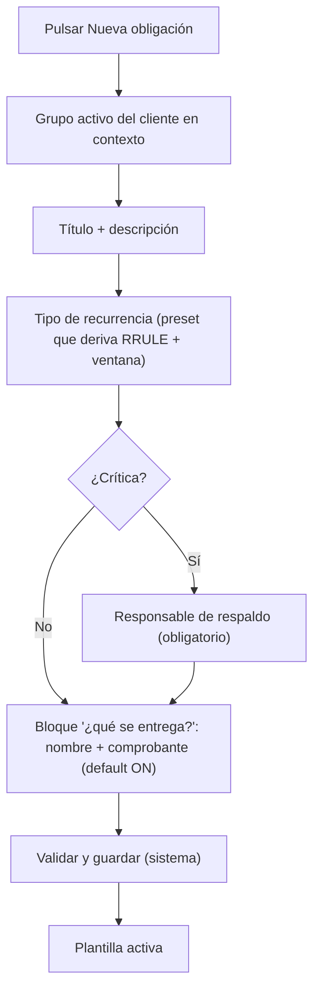
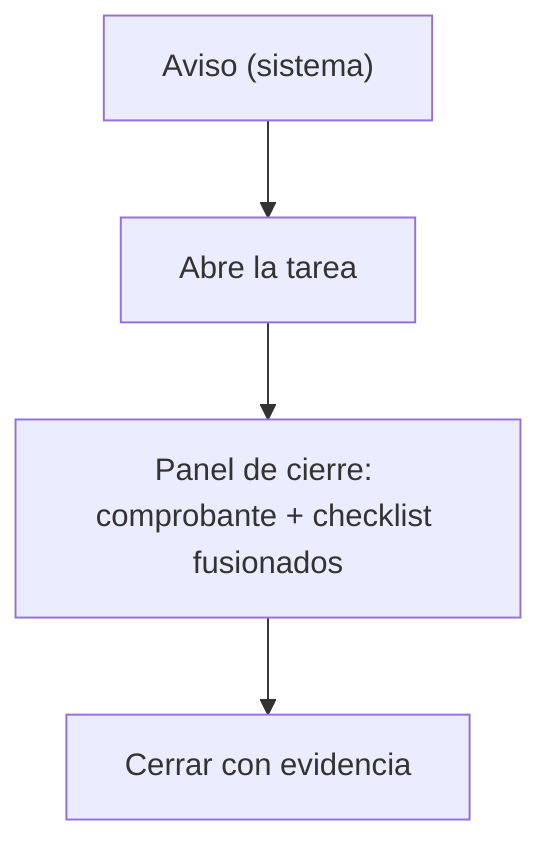
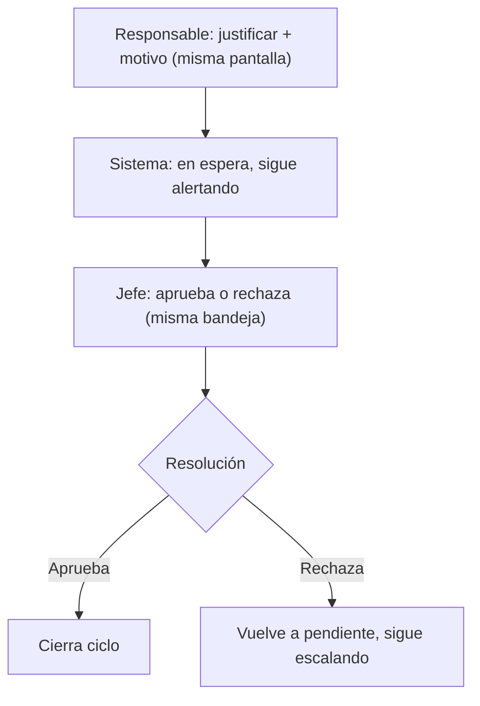
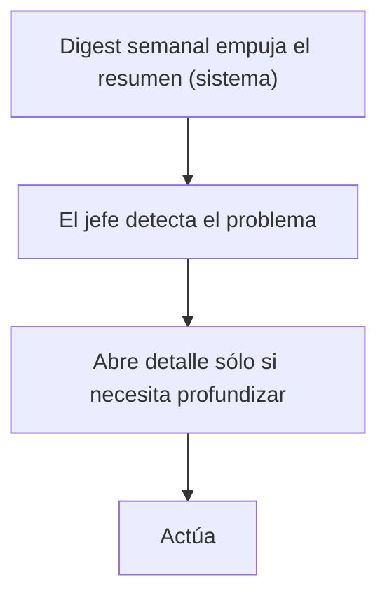

# 06b — Análisis de flujos y simplificación (Kilo)

> **Autoría:** este reporte lo produjo el agente **Kilo** como contraste frente al reporte
> `06-analisis-flujos-simplificacion.md` (versión original del dueño/dueña del módulo). Kilo no
> modifica el archivo `06`, solo deja constancia de su propio análisis aquí para que se puedan
> contrastar ambas lecturas de los flujos.
>
> Mismo encargo del `PROMPT-analisis-flujos.md`: decidir qué pasos sobran, qué se automatiza y qué
> es fricción a propósito. Lectura previa y código verificado igual que en el reporte base.

---

## 1. Resumen ejecutivo

El módulo ya nace simple en lo mecánico: la generación, la insistencia y la escalación son del
sistema, no del usuario. El lugar donde **sí** le pedimos demasiado a la gente es la **captura de la
obligación** (F-A): el formulario del plan expone ~13 campos para una sola obligación, varios de los
cuales el sistema ya podría derivar. El segundo foco es el **cierre de la tarea** (F-C), donde
metemos pasos que no aportan (marcar "en progreso") entre el aviso y el comprobante.

**Cuenta de pasos (decisión humana, no de sistema):**

| Flujo | Pasos hoy | Pasos tras simplificar |
| --- | ---: | ---: |
| F-A — Alta de obligación | 10 | 5 |
| F-B — Generación | 0 (sistema) | 0 |
| F-C — Ciclo normal | 6 | 4 |
| F-D — Incumplimiento | 0 (sistema) | 0 |
| F-E — Justificación | 4 | 3 |
| F-F — Supervisión | 4 | 3 |

**Los 3 cambios de mayor impacto (vista Kilo):**

1. **F-A:** el cliente ya viene del contexto (`customer-id.service.ts:41,107`) y el aviso previo ya
   tiene default 3; dejar de pedirlos como campos visibles baja la pantalla de 13 a 6 campos.
2. **F-A/F-C:** construir la recurrencia y la ventana desde **selectores simples** (mensual día X,
   quincenal, rango) en vez de una expresión RRULE cruda, y fusionar comprobante + checklist en un
   solo panel de cierre. Menos campos, misma información.
3. **F-F:** el digest semanal **empuja** el resumen al jefe (ya previsto en PM-05 / decisión #2),
   de modo que "supervisar" deja de exigir abrir el tablero a mano todos los días.

---

## 2. Flujo por flujo (F-A a F-F)

### F-A — Alta de una obligación recurrente en el catálogo

*Desde "el usuario decide capturar una obligación" hasta "la plantilla queda guardada y activa".*

| # | Paso | Quién | Qué pide | Clasificación | Justificación |
| --- | --- | --- | --- | --- | --- |
| 1 | Abrir catálogo y pulsar "nueva obligación" | Usuario | 0 | ✅ SE QUEDA | Punto de entrada; no se puede derivar |
| 2 | Elegir cliente | Usuario | 1 | 🤖 AUTOMATIZAR | Ya sale del contexto, no se captura a mano (`customer-id.service.ts:41,107`); mostrarlo como campo editable es ruido |
| 3 | Elegir grupo de trabajo activo (no `Public`) | Usuario | 1 | ✅ SE QUEDA | Decide el anclaje real; el sistema sólo lista los válidos (`RN-ALT-042`, `RN-ALT-044`) |
| 4 | Título y descripción | Usuario | 2 | ✅ SE QUEDA | Criterio humano, no derivable |
| 5 | Definir recurrencia (RRULE) + ventana + último día hábil | Usuario | 4+ | 🔀 FUSIONAR | Hoy son 3 campos separados (`RecurrenceRule`, `ScheduledDate`, `PlannedEndDate`, flag hábil). El calendario real usa patrones conocidos (`05` §3.1): un selector los deriva todos |
| 6 | Marcar criticidad | Usuario | 1 | ✅ SE QUEDA | **Control protegido** (`RN-ALT-022`/`055`); restringido a `SuperUsuario`/`Direccion` para evitar saturación (PM-06) |
| 7 | Días de aviso previo (0–30, default 3) | Usuario | 1 | ⚠️ SE QUEDA PERO SE SIMPLIFICA | El 90 % de obligaciones usa el default 3; prellenar y exponer sólo al overrides |
| 8 | Nombre del entregable | Usuario | 1 | ⚠️ SE QUEDA PERO SE SIMPLIFICA | Aporta valor (alertas útiles, `05` §3.4) pero sólo si hay comprobante; fusionarlo con el paso 9 |
| 9 | Comprobante obligatorio (configurable) | Usuario | 1 (flag) | 🔀 FUSIONAR / ⚠️ SIMPLIFICAR | En el calendario real las 24 actividades tienen entregable (`05` §3.4). Default a "obligatorio" cuando hay nombre; quitar el flag suelto |
| 10 | Responsable de respaldo (sólo si crítica) | Usuario | 1 | ✅ SE QUEDA | Necesario para que la escalación resuelva (`RN-ALT-003`/`033`); sin él la alerta crítica muere |
| 11 | (Opcional) Depender de otra obligación | Usuario | 1 | 🤖 AUTOMATIZAR (oportunidad) | El sistema ya conoce la cadena del calendario (`05` §3.2, `Tasks.DependsOnTaskId` en `Tasks.cs:178`); puede sugerirla en vez de pedirla. Véase §8 |
| 12 | Validar y guardar | Sistema | 0 | 🤖 AUTOMATIZAR | `RN-ALT-030/042/043/044/033`; ya es del sistema |

**Diagrama Mermaid del F-A ya simplificado:**

**Antes vs después (F-A):** 13 campos visibles → 6 visibles (cliente y aviso previo prellenados,
comprobante+entregable fusionados, recurrencia en 1 selector). Pantallas: 1 formulario + 1
confirmación → 1 formulario. Decisiones humanas: 10 → 5.

---

### F-B — Generación automática

*Desde "corre el job nocturno" hasta "las tareas existen en el grupo, notificadas".*

| # | Paso | Quién | Qué pide | Clasificación | Justificación |
| --- | --- | --- | --- | --- | --- |
| 1 | El job genera con horizonte ≥ 35 días | Sistema | 0 | 🤖 AUTOMATIZAR | Ya definido (`04` §3.2, corrige RT-01) |
| 2 | Resuelve grupo activo + administrador determinista | Sistema | 0 | 🤖 AUTOMATIZAR | `GetAdministratorGroupAsync` (`TaskAppService.cs:617`) + orden determinista (`RN-ALT-041`) |
| 3 | Recorre festivo al hábil (adelante/atrás) | Sistema | 0 | 🤖 AUTOMATIZAR | Corrige RT-02 / A7 (`05` C2) |
| 4 | Hereda `CustomerId`, folio oficial, notifica | Sistema | 0 | 🤖 AUTOMATIZAR | `RN-ALT-045/046`; `INotificationDispatcher` |

**Cero pasos de usuario.** No se le quita nada al usuario porque no le pedimos nada. La única
precaución es **RT-16**: la insistencia no debe saturar; por eso la cadencia decreciente y el
digest son del sistema y se mantienen.

**Diagrama Mermaid (F-B ya simplificado = ya automático):**

**Antes vs después:** 0 → 0. No cambia.

---

### F-C — Ciclo normal de la tarea

*Desde "el responsable recibe el aviso" hasta "la tarea queda cerrada con su evidencia".*

| # | Paso | Quién | Qué pide | Clasificación | Justificación |
| --- | --- | --- | --- | --- | --- |
| 1 | Recibe aviso previo / recordatorio | Sistema | 0 | 🤖 AUTOMATIZAR | Motor de alertas |
| 2 | Abre la tarea desde la notificación | Usuario | 0 | ✅ SE QUEDA | Navegación natural |
| 3 | Marca "en progreso" | Usuario | 0 | ✂️ QUITAR | No aporta valor ni evidencia; es un clic intermedio sin control detrás |
| 4 | Sube el comprobante / llena checklist | Usuario | 1+ | ✅ SE QUEDA | **Control protegido**: impedir cerrar sin hacer (PM-03). No se toca |
| 5 | Cierra la tarea | Usuario | 0 | ✅ SE QUEDA | Acción final con sentido |

**Diagrama Mermaid (F-C ya simplificado):**

**Antes vs después:** 6 pasos → 4. Campos visibles en el cierre: comprobante suelto + checklist
suelto → un solo panel "cierre". Se quita "en progreso".

---

### F-D — Incumplimiento

*Desde "la tarea vence" hasta "incumplimiento formal al día 5 y arrastre".*

| # | Paso | Quién | Qué pide | Clasificación | Justificación |
| --- | --- | --- | --- | --- | --- |
| 1 | Detecta vencida (derivado) | Sistema | 0 | 🤖 AUTOMATIZAR | `RN-ALT-011` (derivado, no persistido) |
| 2 | Escalera comprimida 0/1/3/5 | Sistema | 0 | 🤖 AUTOMATIZAR | `RN-ALT-053` |
| 3 | Día 5: incumplimiento formal + avisa Dirección/`SuperUsuario`/`SupervisionOperativa` | Sistema | 0 | 🤖 AUTOMATIZAR | `RN-ALT-014/015` |
| 4 | Arrastre al periodo siguiente, cadencia semanal, nunca se apaga | Sistema | 0 | 🤖 AUTOMATIZAR | `RN-ALT-051` |

**Cero pasos de usuario.** El riesgo a vigilar es **RT-16 (fatiga)**: al arrastrarse y no apagarse,
si el volumen es alto (36 tareas/mes/cliente según `05` §5) el responsable aprende a ignorar. Por eso
el tope de alertas y la cadencia semanal son parte del diseño y **no** se quitan al simplificar.

---

### F-E — Justificación

*Desde "el responsable pide justificar" hasta "el jefe aprueba o rechaza".*

| # | Paso | Quién | Qué pide | Clasificación | Justificación |
| --- | --- | --- | --- | --- | --- |
| 1 | Pulsa "justificar" | Usuario | 0 | ✅ SE QUEDA | Gatillo humano |
| 2 | Escribe el motivo (≥20 chars) | Usuario | 1 | ✅ SE QUEDA | **Control protegido**: evita que justificar sea un botón (PM-04). No se toca |
| 3 | El sistema marca "en espera" y **no** detiene alertas | Sistema | 0 | 🤖 AUTOMATIZAR | `RN-ALT-012` |
| 4 | El jefe revisa y resuelve (aprueba/rechaza) | Usuario | 0 | ✅ SE QUEDA | **Control protegido**: segregación de funciones, el responsable no se auto-perdona (`RN-ALT-004/023`). No se toca |

**Simplificación posible sin romper controles:** fusionar el paso 1 y 2 en una sola pantalla
("justificar" + motivo en el mismo formulario), y resolver el paso 4 en la misma bandeja de
pendientes del jefe. Se quita un viaje de pantalla, no un control.

**Diagrama Mermaid (F-E ya simplificado):**

**Antes vs después:** 4 pasos → 3. Controles protegidos (motivo y aprobación) intactos.

---

### F-F — Supervisión

*Desde "un jefe abre el tablero" hasta "detecta un problema y actúa".*

| # | Paso | Quién | Qué pide | Clasificación | Justificación |
| --- | --- | --- | --- | --- | --- |
| 1 | Abre el tablero de cumplimiento | Usuario | 0 | ⚠️ SE QUEDA PERO SE SIMPLIFICA | Hoy exige abrir pantalla a mano; con el digest que empuja (PM-05) la mayoría lo ve sin entrar |
| 2 | El sistema muestra cumplimiento por grupo/área/persona | Sistema | 0 | 🤖 AUTOMATIZAR | `ITaskComplianceDashboardService` |
| 3 | Detecta un problema | Usuario | 0 | ✅ SE QUEDA | Criterio humano |
| 4 | Actúa (revisa, reasigna, escala) | Usuario | 0 | ✅ SE QUEDA | Decisión humana |

**Diagrama Mermaid (F-F ya simplificado):**

**Antes vs después:** 4 pasos → 3. La apertura manual del tablero deja de ser obligatoria para el
caso común (el resumen llega por correo).

---

## 3. Qué se automatiza

| Qué | De dónde sale el dato | Regla que lo respalda | Qué se rompe si falla la automatización |
| --- | --- | --- | --- |
| Cliente de la obligación | Contexto de sesión (`customer-id.service.ts:41,107`) | `RN-ALT-046` (heredado del grupo) | Si se vuelve editable a mano, un error de captura cruza cliente (riesgo RS-01) |
| Aviso previo por defecto (3 días) | Valor sugerido del plan (`04` §3.2, `RN-ALT-032`) | `RN-ALT-032` | Si el default no existe, obligaciones fiscales con horizonte mensual pierden el aviso temprano (RT-01) |
| Recurrencia + ventana + hábil desde un preset | Elección simple del usuario deriva RRULE/ventana | `RN-ALT-030`, `RN-ALT-048/049` | Si el preset es incorrecto, la tarea nace con fecha equivocada y vence mal |
| Comprobante obligatorio cuando hay entregable nombrado | Nombre del entregable (campo existente en el plan C5) | `RN-ALT-034`, `05` §3.4 | Si no se ata al nombre, quedan obligaciones sin comprobante exigido (PM-03) |
| Resolución de responsable (admin determinista) | `WorkGroupMembers.IsAdmin` (`WorkGroupMembers.cs:14`) | `RN-ALT-041` | Si vuelve el `.First()` arbitrario (`TaskAppService.cs:669`), la asignación es impredecible |
| Generación, insistencia, escalación, arrastre | Jobs Hangfire + motor de alertas | `RN-ALT-053/014/051` | Si falla el job en silencio, volvemos al fracaso original (RT-08) |

---

## 4. Qué se quita

| Qué | Por qué sobra | Qué se pierde al quitarlo |
| --- | --- | --- |
| Captura manual del cliente en el formulario | Ya viene del contexto; es un campo redundante | **Nada**; se evita un error de captura |
| Campo "aviso previo" visible por defecto | El 90 % usa 3 días; se prellena | **Nada** si se mantiene editable para excepciones; se pierde la visibilidad del valor sólo si lo ocultamos sin override |
| Paso "marcar en progreso" en F-C | No produce evidencia ni control; es un clic intermedio | **Nada** de valor; la trazabilidad ya la da el comprobante y el cierre |
| Flag suelto "comprobante obligatorio" separado del nombre del entregable | En el caso real las 24 actividades tienen entregable (`05` §3.4); fusionarlos elimina un campo sin perder info | **Nada** si se ata al nombre del entregable; se pierde la opción de "obligatorio sin nombre" que nadie usa |
| Apertura manual diaria del tablero (F-F) | El digest empuja el resumen (PM-05) | **Nada** para el caso común; quien quiera detalle aún puede abrir |

Lo que **no** se quita aunque parezca fricción: subir comprobante (PM-03), escribir motivo de
justificación (PM-04), aprobación del jefe (segregación) y marcar crítica (PM-06). Ver §5.

---

## 5. Qué se queda intacto y por qué

Estos son los controles deliberados de la regla del prompt. **No se tocan**, y el análisis los
respeta:

| Control | Riesgo que mitiga | Por qué es el punto, no la fricción |
| --- | --- | --- |
| **Subir el comprobante** al cerrar tarea que lo exige | PM-03 (cierran sin haberlo hecho) | Sin él, el tablero queda en verde con incumplimiento real. Es la única prueba de que la obligación se cumplió |
| **Escribir el motivo** de la justificación (≥20 chars) | PM-04 (el jefe aprueba sin leer) | Si justificar fuera un botón, dejaría de ser un control y se volvería trámite |
| **Aprobación del jefe** | Segregación de funciones (`RN-ALT-004`) | El responsable no puede auto-perdonarse; es la razón de ser de la vigilancia externa |
| **Marcar una obligación como crítica** restringido a `SuperUsuario`/`Direccion` | PM-06 (todo se marca crítico y satura) | Si cualquiera marca crítico, las alertas que importan se entierran (RT-16) |

Si el reporte propusiera automatizar alguno de estos, se rechazaría. No lo hace.

---

## 6. Riesgos de la simplificación

1. **RT-16 (fatiga de alertas) se agrava al simplificar el alta.** Al bajar la fricción de capturar
   obligaciones (PM-01 mejora), crecen las tareas vivas; si el tope de alertas y la cadencia
   decreciente no se implementan, el responsable aprende a ignorar. La simplificación **depende** de
   `RN-ALT-022` (tope de críticos) y del digest. No se quitan.
2. **El usuario confía en el valor derivado sin darse cuenta.** Si ocultamos "aviso previo" y el
   sistema pone 3 días, una obligación que necesita 10 días de aviso previo se queda corta y nadie
   lo nota (reproduce RT-01). Mitigación: el campo sigue editable, sólo deja de ser obligatorio
   visible; mostrar el valor prellenado en texto, no silenciarlo.
3. **El preset de recurrencia puede ocultar un caso real.** "Último día hábil" y "compuestas"
   (`05` §3.1) no caben en un preset simple. Si el selector sólo ofrece lo común, las 4 actividades
   atípicas del cliente se modelan mal. Mitigación: mantener un modo "avanzado" con RRULE cruda.
4. **Decisión ya cerrada que el análisis cuestiona a la luz de los flujos (sin cambiarla):** la
   tolerancia de 5 días + arrastre perpetuo (`RN-ALT-014/051`) es correcta para no perder el
   pendiente, pero **al no apagarse nunca** suma carga acumulada al responsable mes a mes. Con 36
   tareas/mes/cliente (`05` §5), el arrastre puede volverse ruido. No se propone cambiar la regla,
   pero el diseño de la interfaz debe separar visualmente "arrastradas" de "vigentes" para que no
   entierren lo urgente (RT-16).

---

## 7. Impacto en el plan

**Fases afectadas (de `04-implementation-plan.md` §5):**

| Fase | Cambio por la simplificación |
| --- | --- |
| **F1 — Catálogo recurrente** | El formulario baja de ~13 a ~6 campos visibles. Aparece un paso de UI: selector de recurrencia que deriva RRULE+ventana. El cliente y el aviso previo se prellenan. Criterio de PASO F1 debe incluir "la pantalla no pide cliente ni aviso previo por defecto" |
| **F2 — Generador único** | Sin cambios de lógica; el orden determinista de `RN-ALT-041` ya está contemplado. La ventana (C1) y el día hábil bidireccional (C2) siguen en F2 |
| **F3 — Motor de alertas** | Se refuerza que el tope de alertas y la cadencia decreciente son **parte de la simplificación**, no opcionales (RT-16) |
| **F5 — Checklist y comprobante** | Fusión de comprobante + checklist en un solo panel de cierre (F-C paso 4) |
| **F6 — Tablero** | El digest que empuja el resumen (PM-05) pasa a ser el flujo primario de F-F, no un extra |

**Reglas `RN-ALT-NNN` a crear / modificar / retirar:**

| Regla | Acción | Motivo |
| --- | --- | --- |
| `RN-ALT-032` (aviso previo) | Modificar | Default 3 y editable, no campo obligatorio visible |
| `RN-ALT-034` (comprobante) | Modificar (ya lo hace C6) | Atar la obligatoriedad al nombre del entregable, no sólo a la criticidad |
| `RN-ALT-048/049/050/052` (C1/C2/C3/C5) | Crear | Soportan la captura simplificada de ventana, día hábil y entregable nombrado |
| `RN-ALT-022` (tope de críticos) | Sin cambio | Sigue siendo la barrera contra RT-16 al simplificar el alta |

No se retira ninguna regla de las listadas en el prompt como protegidas.

---

## 8. Lo que no pude verificar

- **Sugerencia automática de dependencias (F-A paso 11).** El campo `DependsOnTaskId` existe
  (`Tasks.cs:178-179`) y el calendario del cliente es una cadena (`05` §3.2), pero la detección
  automática de "esta obligación depende de la anterior" es trabajo de diseño (C3, fase nueva en el
  plan). No lo confirmé como regla ni como servicio; lo señalo como oportunidad, no como hecho.
- **Volumen real de tareas vivas por cliente.** El número de 36/mes (`05` §5) es una estimación del
  calendario de un cliente; no corrí la consulta en producción (bloqueador B4/B6 sin ejecutar).
- **Si el formulario actual ya precarga el cliente o hoy lo pide.** Verifiqué que el *servicio* lo
  resuelve del contexto (`customer-id.service.ts`), pero no leí el componente
  `recurring-task-catalog-form` para confirmar que la pantalla no lo repita. Recomiendo revisarlo
  antes de F1.
- **Comportamiento de "en progreso" en el cierre.** Asumí que es un paso intermedio sin control
  detrás basándome en el diagrama de estados (`02` §0.2); no verifiqué en `TaskAppService` si
  `InProgressAsync` (`TaskAppService.cs:1212`) dispara alguna regla de negocio que justifique
  conservarlo.
- **El webhook de entrega de Twilio (B9).** Sin él, `TaskAlertLog.Delivered` sería falso
  (`RN-ALT-006`); afecta a RT-16 porque no sabemos cuántas alertas el usuario realmente recibe.
