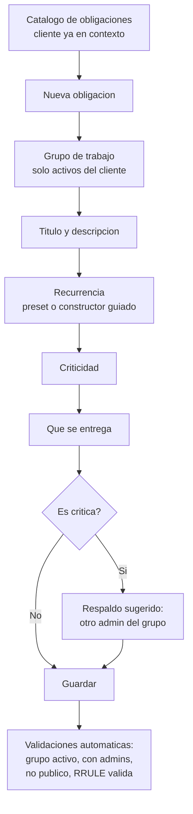
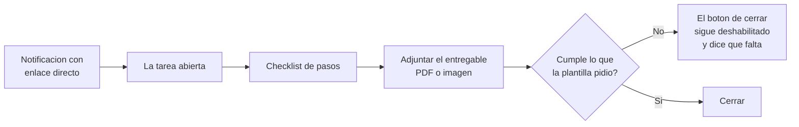

# 06 — Análisis de flujos y simplificación

**Módulo:** Alertas de Tareas Recurrentes · **Fecha:** 2026-08-20
**Encargo:** qué pasos se automatizan, cuáles son realmente necesarios y cuáles se quitan
**Método:** lectura del código y de los formularios reales que existen hoy, más los flujos del plan
**Consolidado:** incorpora los aportes del reporte paralelo `06b-analisis-flujos-Kilo.md` (marcados con 🅚)

---

## 1. Resumen ejecutivo

| Flujo                            |   Pasos hoy   | Pasos propuestos | Pantallas hoy → después |
| -------------------------------- | :-----------: | :--------------: | :---------------------: |
| **F-A** Alta de una obligación   |      19       |      **8**       |          3 → 1          |
| **F-B** Generación automática    | 0 del usuario |  0 del usuario   |            —            |
| **F-C** Ciclo normal de la tarea |       8       |      **5**       |          2 → 1          |
| **F-D** Incumplimiento           | 0 del usuario |  0 del usuario   |            —            |
| **F-E** Justificación            |   No existe   |        4         |          0 → 2          |
| **F-F** Supervisión              |   No existe   |        2         |          0 → 1          |

### Los tres cambios de mayor impacto

1. **Desaparece el triple nivel plantilla → ítem → configuración por cliente.** Hoy capturar una
   obligación exige tres pantallas y decir dos veces a qué cliente pertenece. Una obligación pasa
   a ser un solo registro.
2. **La notificación lleva directo a la tarea.** Hoy el aviso dice que hay algo pendiente y el
   usuario tiene que ir a buscarlo. Con el enlace directo desaparece el paso de buscar.
3. **El cierre exige lo que la obligación pidió.** Hoy la evidencia es opcional y el cargador
   **sólo acepta imágenes**: un acuse del SAT en PDF no se puede subir. El cierre pasa a validar
   lo que la plantilla declaró como entregable.

---

## 2. Flujo por flujo

### F-A — Alta de una obligación recurrente

**Lo que existe hoy** son tres pantallas encadenadas:

| Pantalla                  | Campos                                                                                | Archivo                                                               |
| ------------------------- | ------------------------------------------------------------------------------------- | --------------------------------------------------------------------- |
| Plantilla                 | Nombre, Descripción, **Rol asignado**, Activo, **Clientes asignados**                 | `templates/task-template-form/task-template-form.html:4-28`           |
| Ítem de plantilla         | Título, Descripción, Recurrencia, Inicio ventana horaria, Fin ventana horaria, Activo | `templates/task-template-item-form/task-template-item-form.html:5-51` |
| Configuración por cliente | Selecciona cliente → activa ítems uno por uno → Guardar                               | `templates/customer-config/customer-config.html:3-43`                 |

| #   | Paso hoy                         | Quién   | Clasificación              | Justificación                                                                                            |
| --- | -------------------------------- | ------- | -------------------------- | -------------------------------------------------------------------------------------------------------- |
| 1   | Abrir catálogo de plantillas     | Usuario | ✅ Se queda                | Punto de entrada                                                                                         |
| 2   | Nombre de la plantilla           | Usuario | 🔀 Fusionar                | Se funde con el título de la obligación: hoy se escribe dos veces, una en la plantilla y otra en el ítem |
| 3   | Descripción de la plantilla      | Usuario | 🔀 Fusionar                | Misma duplicación                                                                                        |
| 4   | Elegir **Rol asignado**          | Usuario | ✂️ **Quitar**              | El responsable se deriva de los administradores del grupo (`TaskAppService.cs:617-624`). Decisión #14    |
| 5   | Marcar plantilla activa          | Usuario | ✂️ **Quitar**              | Una plantilla recién creada nace activa. Desactivar se hace desde la lista                               |
| 6   | Elegir **Clientes asignados**    | Usuario | ✂️ **Quitar**              | El cliente viene del contexto (`core/auth/services/customer-id.service.ts`)                              |
| 7   | Guardar plantilla                | Usuario | 🔀 Fusionar                | Un solo guardado al final                                                                                |
| 8   | Entrar a los ítems               | Usuario | ✂️ **Quitar**              | Desaparece el nivel intermedio                                                                           |
| 9   | Título del ítem                  | Usuario | ✅ Se queda                | Es el nombre real de la obligación                                                                       |
| 10  | Descripción del ítem             | Usuario | ✅ Se queda                |                                                                                                          |
| 11  | Configurar recurrencia           | Usuario | ⚠️ Se queda pero se amplía | Ver abajo: el constructor actual no alcanza                                                              |
| 12  | Inicio de ventana **horaria**    | Usuario | ⚠️ Se queda pero cambia    | La ventana real es en **días**, no en horas                                                              |
| 13  | Fin de ventana horaria           | Usuario | ⚠️ Se queda pero cambia    | Idem                                                                                                     |
| 14  | Marcar ítem activo               | Usuario | ✂️ **Quitar**              | Segundo "activo" en el mismo alta                                                                        |
| 15  | Guardar ítem                     | Usuario | 🔀 Fusionar                |                                                                                                          |
| 16  | Ir a Configuración por Cliente   | Usuario | ✂️ **Quitar**              | Tercera pantalla para repetir el cliente                                                                 |
| 17  | Seleccionar cliente              | Usuario | ✂️ **Quitar**              | Ya se pidió en el paso 6 y ya está en el contexto                                                        |
| 18  | Activar el ítem para ese cliente | Usuario | ✂️ **Quitar**              | Tercer "activo" del mismo alta                                                                           |
| 19  | Guardar configuración            | Usuario | 🔀 Fusionar                |                                                                                                          |
| —   | Elegir grupo(s) de trabajo       | Usuario | 🆕 **Nuevo, necesario**    | Es el ancla del modelo                                                                                   |
| —   | Criticidad                       | Usuario | 🆕 **Nuevo, necesario**    | Un clic. Define escalación, respaldo y comprobante                                                       |
| —   | Nombre del entregable            | Usuario | 🆕 **Nuevo, necesario**    | Permite que la alerta diga _"falta: Opinión de cumplimiento"_                                            |

**Sobre la recurrencia.** El constructor guiado ya existe y está bien hecho: frecuencia,
intervalo, días de la semana, y arma la RRULE solo
(`instances/recurrence-input/recurrence-input.ts:237`). Pero genera **un solo día del mes**:
`monthDay` es un `FormControl<number>` singular (`recurrence-input.ts:38`). Contra el calendario
real del cliente, eso no alcanza:

- _"Días 5 y 20"_, _"Días 7 y 22"_, _"Días 10 y 25"_ — **5 actividades** que necesitan dos días
- _"Días 1 al 5"_, _"Días 11 al 14"_ — **8 actividades** que necesitan un rango
- _"Último día hábil"_ — **2 actividades** que necesitan cálculo hacia atrás

No se construye de cero: se amplía. Y se le agregan **presets** con el lenguaje del cliente
—"del día 1 al 5", "día 15 y último día hábil"— para que nadie tenga que pensar en RRULE.

🅚 **Conservar un modo avanzado con RRULE cruda.** Ningún catálogo de presets cubre todos los
casos; sin una salida de escape, las obligaciones atípicas se modelan mal o no se capturan.

**Antes y después**

|                                | Hoy | Propuesto |
| ------------------------------ | :-: | :-------: |
| Pasos                          | 19  |   **8**   |
| Pantallas                      |  3  |   **1**   |
| Campos visibles                | 11  |   **6**   |
| Veces que se indica el cliente |  2  |   **0**   |
| Veces que se marca "activo"    |  3  |   **0**   |

Cuatro campos más quedan en una sección avanzada, plegada y con valor por omisión: días de
aviso previo (según criticidad), responsable de respaldo (se sugiere otro administrador del
grupo), checklist de pasos y dependencia de otra obligación.

---

### F-B — Generación automática

Cero pasos del usuario, hoy y después. Lo que cambia es lo que el sistema hace **cuando algo
sale mal**.

| Paso                      | Hoy          | Clasificación                                                                                      |
| ------------------------- | ------------ | -------------------------------------------------------------------------------------------------- |
| Leer obligaciones activas | Automático   | ✅ Se queda                                                                                        |
| Resolver responsable      | Automático   | 🤖 Mejorar: hoy toma `.First()` de una lista sin ordenar (`TaskAppService.cs:669`)                 |
| Calcular fechas           | Automático   | 🤖 Mejorar: hoy omite los festivos en vez de recorrer (`RecurringTaskGeneratorService.cs:120-124`) |
| Crear la tarea            | Automático   | ✅ Se queda                                                                                        |
| Notificar                 | Automático   | ✅ Se queda                                                                                        |
| **Reportar la corrida**   | ❌ No existe | 🆕 **Nuevo, obligatorio**                                                                          |

Ese último renglón es el importante. Hoy, si un cliente falla, el error se escribe en un log y
nadie se entera (`RecurringTaskGeneratorService.cs:33`); si un grupo no tiene responsables, se
salta con un aviso en el log y sigue (`:83-86`). Un módulo que existe para que nada se pase por
alto no puede fallar en silencio.

---

### F-C — Ciclo normal de la tarea

| #   | Paso hoy                         | Quién   | Clasificación                        | Justificación                                                             |
| --- | -------------------------------- | ------- | ------------------------------------ | ------------------------------------------------------------------------- |
| 1   | Recibir la notificación          | Sistema | ✅ Se queda                          |                                                                           |
| 2   | Abrir la aplicación              | Usuario | ✅ Se queda                          |                                                                           |
| 3   | **Buscar la tarea**              | Usuario | ✂️ **Quitar**                        | El enlace de la notificación abre la tarea directamente                   |
| 4   | Abrir la tarea                   | Usuario | ✅ Se queda                          |                                                                           |
| 5   | Hacer el trabajo                 | Usuario | ✅ Se queda                          | Ocurre fuera del sistema                                                  |
| 6   | Abrir el formulario de completar | Usuario | 🔀 **Fusionar**                      | Hoy es otra pantalla (`complete-task-form`); pasa a ser parte de la tarea |
| 7   | Escribir comentarios             | Usuario | ⚠️ Se queda opcional                 | Ya es opcional                                                            |
| 8   | Adjuntar evidencia               | Usuario | ✅ **Se queda y se endurece**        | Ver abajo                                                                 |
| —   | Marcar pasos del checklist       | Usuario | 🆕 Nuevo, opcional salvo en críticas |                                                                           |

**Dos defectos concretos del cierre actual**, en
`instances/complete-task-form/complete-task-form.html:10-15`:

- El cargador declara `accept="image/*"`. **Un acuse del SAT en PDF no se puede subir.** El
  entregable de la mayoría de las actividades del calendario real es justamente un PDF.
- La evidencia dice "(Opcional)". Se puede cerrar una tarea crítica sin nada que lo respalde,
  que es exactamente el riesgo PM-03: tablero en verde con incumplimiento real.

El límite de 1 MB también es estrecho para un acuse escaneado.

**Sobre "marcar en progreso" (🅚).** El paso parece un clic vacío, pero no lo es:
`InProgressAsync` (`TaskAppService.cs:1211-1234`) cambia el estado **y notifica al creador** de
la tarea. La respuesta depende del origen:

- **Tarea generada por el motor:** el "creador" es el sistema, así que el aviso no le llega a
  nadie. El paso **se quita**.
- **Ticket manual:** avisa a quien lo levantó de que alguien ya lo tomó. El paso **se conserva**.

Quitarlo indiscriminadamente eliminaría una señal útil del sistema de tickets, que no es de este
módulo.

**Antes y después:** de 8 pasos y 2 pantallas a **5 pasos y 1 pantalla**.

---

### F-D — Incumplimiento

Cero pasos del usuario. Todo lo dispara el sistema: escalera al día 0, 1, 3 y 5, incumplimiento
formal y arrastre.

Lo único que hay que vigilar aquí no es la cantidad de pasos, sino **el volumen de avisos**. Con
24 obligaciones por cliente y una insistencia que ya no se apaga, notificar cada tarea por
separado y por varios canales satura al responsable en la primera semana, y entonces deja de
leer todo — incluido lo que importa. Es el riesgo RT-16, y aquí es donde se materializa.

Lo que evita que ocurra: un tope de avisos por persona y por día, cadencia decreciente conforme
pasan los días, y agrupar en un solo mensaje las obligaciones del mismo responsable. **Un aviso
diario con cinco pendientes se lee; cinco avisos diarios se ignoran.**

---

### F-E — Justificación

No existe hoy: no hay línea base contra la cual comparar.

| #   | Paso propuesto                                | Quién   | Clasificación              |
| --- | --------------------------------------------- | ------- | -------------------------- |
| 1   | Solicitar justificación desde la tarea        | Usuario | ✅ Se queda                |
| 2   | **Escribir el motivo** (mínimo 20 caracteres) | Usuario | 🔒 **Fricción deliberada** |
| 3   | El jefe recibe el aviso con enlace directo    | Sistema | 🤖 Automático              |
| 4   | **El jefe lee el motivo y resuelve**          | Usuario | 🔒 **Fricción deliberada** |

**Aquí conviene no simplificar de más.** La tentación natural es poner "Aprobar" y "Rechazar"
como botones dentro de la notificación, para resolver sin entrar al sistema. **No debe hacerse.**
El riesgo PM-04 es precisamente que el jefe apruebe todo sin leerlo, y un botón en la
notificación convierte esa aprobación en un reflejo.

Lo que sí se simplifica es **llegar**: el aviso lleva directo a la pantalla donde está el motivo.
Se quita el paso de buscar, no el de leer.

---

### F-F — Supervisión

| #   | Paso propuesto                                 | Quién   | Clasificación     |
| --- | ---------------------------------------------- | ------- | ----------------- |
| 1   | Recibir el resumen de lo que necesita atención | Sistema | 🤖 **Automático** |
| 2   | Abrir el tablero sólo si hay que actuar        | Usuario | ✅ Se queda       |

🅚 Esto no es una intuición: **PM-05** ya lo anticipó en la FASE 0 —*"nadie abre el tablero de
cumplimiento"*, con el digest empujado como mitigación—. El anti-patrón a evitar es
**"el tablero que hay que visitar"**: si la información sólo existe
para quien entra a buscarla, reproduce el problema original —el incumplimiento estaba ahí, pero
nadie miró—. El resumen debe empujarse; el tablero es para profundizar, no para enterarse.

---

## 3. Qué se automatiza

| Qué                         | De dónde sale                                           | Regla        | Qué pasa si la automatización falla                                                                       |
| --------------------------- | ------------------------------------------------------- | ------------ | --------------------------------------------------------------------------------------------------------- |
| Cliente de la obligación    | Contexto de sesión (`customer-id.service.ts`)           | `RN-ALT-046` | La obligación quedaría sin cliente. Se valida al guardar                                                  |
| Responsable de la tarea     | Administradores del grupo (`TaskAppService.cs:617-624`) | `RN-ALT-041` | Tarea sin dueño: es el fallo que el módulo combate. Por eso hay cadena de resolución y aviso explícito    |
| Prioridad del ticket        | Derivada de la criticidad                               | A12          | El tablero de tickets ordenaría mal. No afecta las alertas                                                |
| Fecha límite                | Recurrencia + ventana + días hábiles                    | `RN-ALT-049` | **El riesgo más serio**: una fecha mal calculada alerta tarde. Requiere pruebas con festivos y fin de mes |
| Días de aviso previo        | Valor por omisión según criticidad                      | `RN-ALT-032` | Se avisaría con menos anticipación de la deseada. Es ajustable por obligación                             |
| Responsable de respaldo     | Sugerido: otro administrador del grupo                  | `RN-ALT-033` | Se sugiere, no se impone: el usuario confirma                                                             |
| Destinatarios de escalación | Organigrama de roles del cliente                        | `RN-ALT-053` | La escalación muere. Por eso existe el respaldo obligatorio en críticas                                   |
| Estado "vencida"            | Derivado de la fecha límite                             | `RN-ALT-011` | No se detectaría el vencimiento                                                                           |
| Folio                       | Generador oficial por grupo                             | `RN-ALT-045` | Hoy el job arma un folio de 49 caracteres contra un límite de 20 y el guardado falla                      |
| Creación mes con mes        | Recurrencia                                             | `RN-ALT-001` | Sin esto no hay módulo                                                                                    |

---

## 4. Qué se quita

| Qué se quita                            | Por qué sobra                                             | Qué se pierde                                                                                                                                                                                                                                                                                     |
| --------------------------------------- | --------------------------------------------------------- | ------------------------------------------------------------------------------------------------------------------------------------------------------------------------------------------------------------------------------------------------------------------------------------------------- |
| Elegir el cliente en el alta            | Ya está en el contexto de sesión                          | **Nada.** Sólo se pierde la posibilidad de crear obligaciones para un cliente distinto al activo, que además es fuente de errores                                                                                                                                                                 |
| La pantalla "Configuración por cliente" | Repite el cliente y el "activo" por tercera vez           | **Sí se pierde algo:** hoy permite tener una plantilla global y encenderla cliente por cliente. En el modelo nuevo cada cliente tiene sus obligaciones. Si en el futuro se quiere replicar un calendario entre clientes, hará falta un "duplicar a otro cliente", que **no** está en este alcance |
| Elegir el rol asignado                  | El responsable sale del grupo                             | **Nada**                                                                                                                                                                                                                                                                                          |
| El nivel intermedio plantilla → ítem    | Una obligación es un registro, no un contenedor con hijos | Se pierde agrupar varias obligaciones bajo un nombre común. El grupo de trabajo ya cumple esa función                                                                                                                                                                                             |
| Los tres campos "activo"                | Uno basta, y se administra desde la lista                 | **Nada**                                                                                                                                                                                                                                                                                          |
| Buscar la tarea tras recibir el aviso   | El enlace directo la abre                                 | **Nada**                                                                                                                                                                                                                                                                                          |
| La pantalla aparte para completar       | Se integra en la tarea                                    | **Nada**                                                                                                                                                                                                                                                                                          |
| Fijar la prioridad a mano               | Se deriva de la criticidad                                | Se pierde priorizar una tarea generada por separado. Es deliberado: `RN-ALT-056` la vuelve inmutable                                                                                                                                                                                              |

---

## 5. Qué se queda intacto y por qué

Cinco puntos de fricción que **no** se automatizan. Cada uno existe para evitar un fallo concreto:

| Control                                                          | Riesgo que evita                                                                                                 |
| ---------------------------------------------------------------- | ---------------------------------------------------------------------------------------------------------------- |
| **Subir el entregable** al cerrar una tarea que lo exige         | PM-03: cerrar la tarea sin haberla hecho. Sin evidencia, el tablero se pone verde y el incumplimiento sigue vivo |
| **Escribir el motivo** de la justificación, mínimo 20 caracteres | PM-04: justificar de un clic. Redactar obliga a pensar y deja rastro auditable                                   |
| **La aprobación la da el jefe**, nunca el responsable            | Auto-perdón. Es segregación de funciones, y se valida en el servidor: ocultar el botón no es control             |
| **Sólo Dirección y SuperUsuario marcan crítica**                 | PM-06: que todo sea crítico y el ruido entierre lo que importa                                                   |
| **Marcar los pasos del checklist** en críticas                   | Cerrar "de memoria" sin haber revisado cada punto                                                                |

A esto se suma la inmutabilidad de la criticidad en tareas generadas (`RN-ALT-056`). No es
fricción, es un candado: hoy existe un botón que **alterna** la prioridad entre alta y baja
(`TaskAppService.cs:962`), y sin el candado degradaría una obligación crítica con un solo clic.

---

## 6. Riesgos de la simplificación

**Confiar en un valor derivado sin saber que lo es.** Es el riesgo principal. Cuando el sistema
calcula la fecha límite, elige al responsable y fija la prioridad, el usuario deja de verificarlos
—y con razón, para eso los automatizamos—. Pero el día que uno salga mal, nadie lo va a notar,
porque ya nadie los mira. Mitigación: que la pantalla muestre **de dónde salió** cada valor
derivado ("vence el 5 de mayo porque el 3 fue festivo", "asignada a Ana por ser administradora
del grupo Contabilidad"), y que se pueda corregir dejando rastro.

**Quitar la configuración por cliente cierra una puerta.** Hoy se puede definir un calendario una
vez y encenderlo en varios clientes. El modelo nuevo obliga a capturarlo cliente por cliente. Con
24 obligaciones por cliente, replicarlo a mano es trabajo real. Lo señalo como hallazgo: si la
cartera es grande, va a hacer falta un "duplicar obligaciones a otro cliente", y no está en el
alcance actual.

🅚 **Las arrastradas pueden enterrar lo vigente.** Al no apagarse nunca la insistencia, cada mes
se acumulan pendientes viejos sobre los nuevos. Con 24 obligaciones por cliente, en tres meses
la lista del responsable puede tener más arrastre que trabajo del mes. La interfaz debe
**separarlas visualmente**: "vigentes" y "arrastradas" en bloques distintos, nunca en una sola
lista ordenada por fecha. Es RT-16 por acumulación, no por frecuencia.

**El enlace directo asume que el destinatario es el autorizado.** Quitar el paso de buscar es
correcto, pero el permiso debe validarse en el endpoint, no darse por hecho porque la
notificación llegó a esa persona (riesgo RS-04).

**Menos pasos de captura significa más peso en los valores por omisión.** Si el aviso previo por
omisión resulta corto para las obligaciones fiscales, el error se replica en todas las que se
capturen sin abrir la sección avanzada. Conviene revisar esos valores tras el primer mes real.

**Una decisión cerrada que este análisis pone en duda.** La decisión #7 limitaba el comprobante
obligatorio a las tareas críticas para no generar fricción. Visto el calendario real, donde las
24 actividades tienen entregable, la fricción de subir el archivo **no es un costo, es el
producto**: la columna "qué entrego" es la razón de ser del cuadro. No la cambio por mi cuenta,
pero recomiendo que la obligatoriedad sea configurable por obligación y venga activada por
omisión, no apagada.

---

## 7. Impacto en el plan

| Fase                             | Cambio                                                                                                                                                                |
| -------------------------------- | --------------------------------------------------------------------------------------------------------------------------------------------------------------------- |
| **F1 — Catálogo**                | Crece: absorbe la unificación de las tres pantallas y la ampliación del constructor de recurrencia (varios días, rangos, último día hábil, presets). De **M** a **L** |
| **F2 — Generador**               | Sin cambio de tamaño. Se agrega el reporte de corrida, que ya estaba en F0                                                                                            |
| **F3 — Alertas**                 | Se agrega el agrupamiento por destinatario y el tope de avisos. Ya estaba contemplado como mitigación de RT-16                                                        |
| **F5 — Checklist y comprobante** | Crece: incluye corregir el cargador para aceptar PDF, subir el límite de tamaño y hacer el entregable obligatorio cuando la plantilla lo pida                         |
| **F6 — Tablero**                 | Se agrega el resumen empujado. El tablero deja de ser el único camino a la información                                                                                |

**Reglas a crear**

| Regla        | Enunciado                                                                                                          |
| ------------ | ------------------------------------------------------------------------------------------------------------------ |
| `RN-ALT-058` | Toda notificación lleva enlace directo a la tarea, y el permiso se valida en el endpoint, no en el envío           |
| `RN-ALT-059` | Todo valor derivado (fecha límite, responsable, prioridad) se muestra con su origen y admite corrección con rastro |
| `RN-ALT-060` | Las alertas del mismo destinatario se agrupan en un envío, con tope por persona y día                              |
| `RN-ALT-061` | El cargador de entregables acepta PDF e imagen, con límite suficiente para un documento escaneado                  |

**Reglas a modificar**

- `RN-ALT-034` — el comprobante deja de depender sólo de la criticidad: lo declara cada obligación
- `RN-ALT-032` — el aviso previo tiene valor por omisión según criticidad

**Reglas que se retiran:** ninguna.

---

## 8. Lo que no pude verificar

- **No ejecuté la aplicación.** Los conteos de pasos y pantallas salen de leer los formularios y
  sus campos, no de cronometrar a un usuario real. El número de clics puede diferir.
- **No revisé la pantalla de detalle del ticket** en `OperationsLuxuryApp/Tasks`. Asumo que
  existe y que ahí se integraría el checklist; no verifiqué su estructura.
- **F-E y F-F no tienen línea base**: justificación y tablero no existen hoy. Sus "pasos antes"
  son cero por inexistencia, no por eficiencia.
- **No verifiqué el componente móvil.** El análisis cubre la aplicación web; si la operación usa
  la app de Flutter para cerrar tareas, ese flujo puede diferir.
- **No sé cuántas obligaciones tiene un cliente promedio.** El cálculo de volumen usa las 24 del
  calendario de Royal Reforma como referencia, que es un solo caso.
- **No verifiqué si el constructor de recurrencia se reutiliza en otros módulos.** Si es así,
  ampliarlo afecta a más consumidores de los que este análisis contempla.
