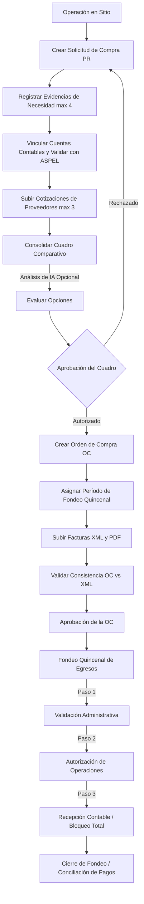
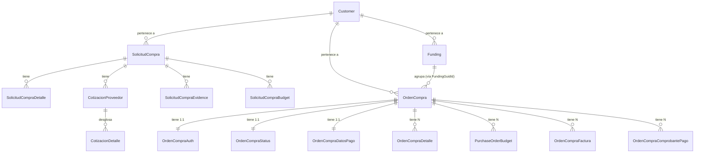
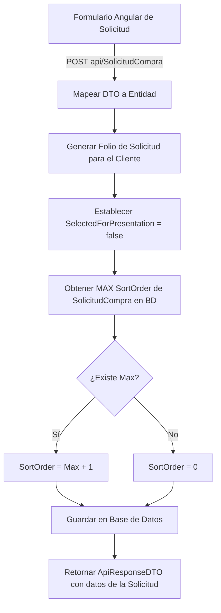
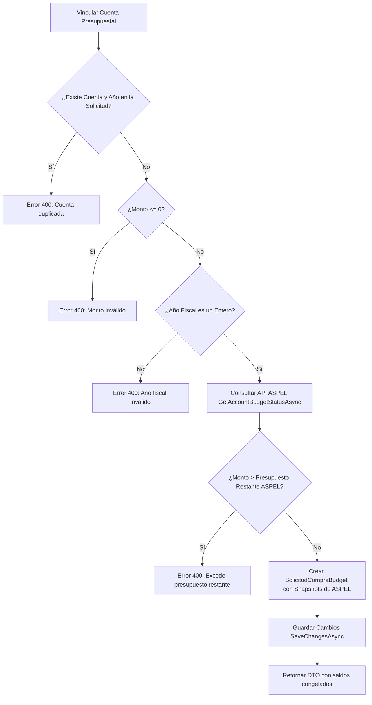
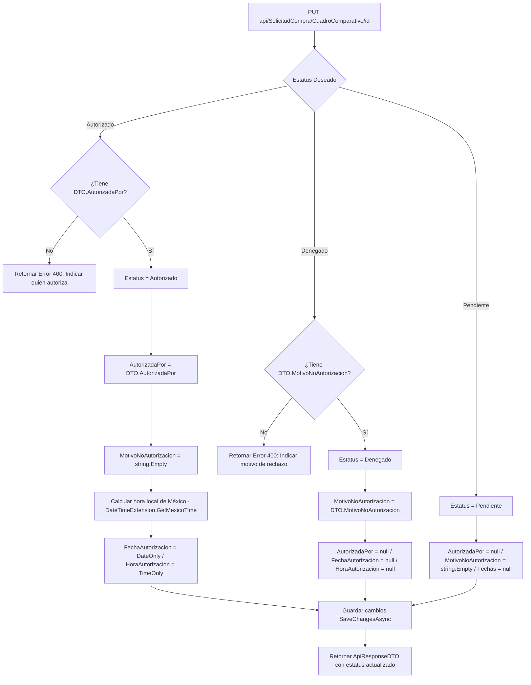
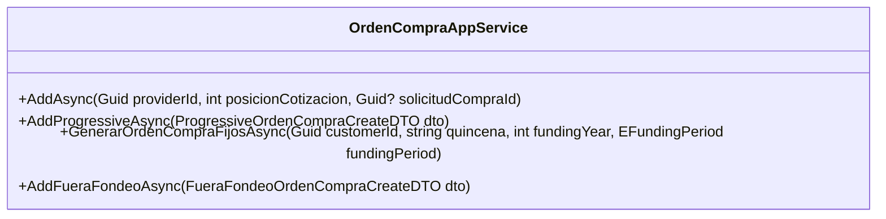
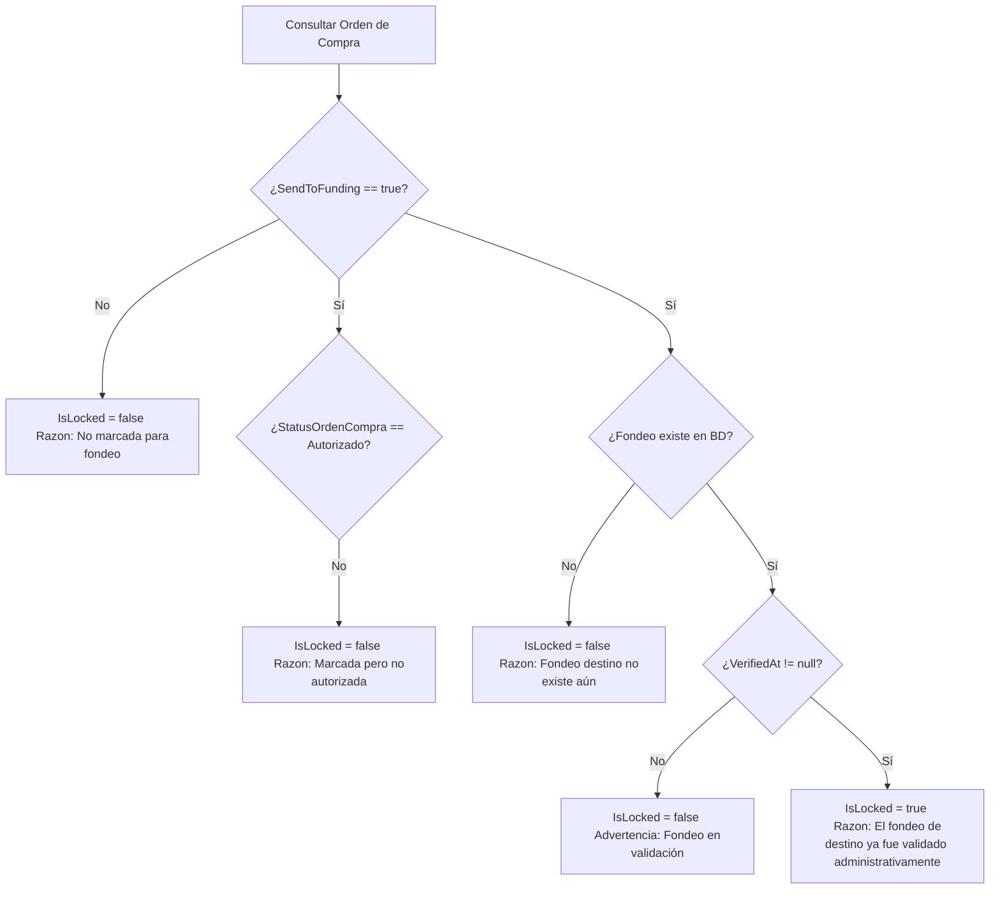
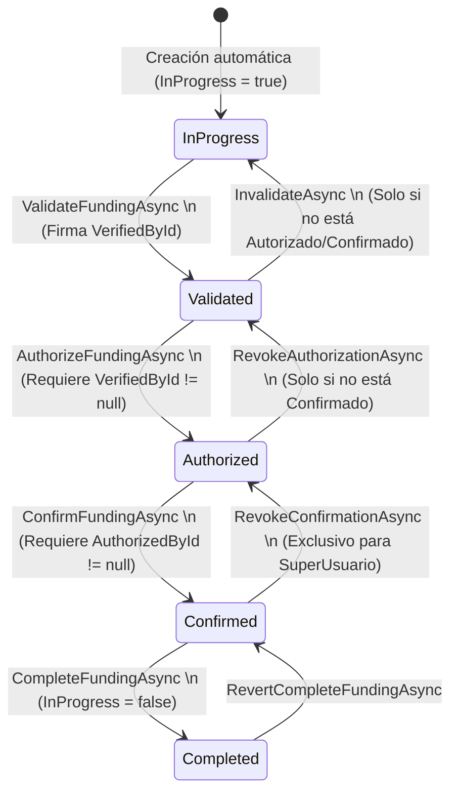

# 📚 Reporte de Análisis Técnico Exhaustivo y Detallado: Flujo de Compras & Fondeos

> **Módulo:** Compras (`Purchases`) y Fondeos (`Funding`)  
> **Última actualización:** 17 de junio de 2026  
> **Estado:** Documentación Técnica de Referencia y de Negocio  
> **Ámbito de Aplicación:** LuxuryApp Backend (C# / .NET 10) & Frontend (Angular 22)

---

## 🚀 1. Visión General del Proceso de Egresos

El ciclo de egresos y control de gastos de **LuxuryApp** está compuesto por cuatro pilares fundamentales: **Solicitudes de Compra**, **Cuadros Comparativos**, **Órdenes de Compra** y **Fondeos Quincenales**. Este sistema garantiza la trazabilidad fiscal y el control presupuestal de los condominios y clientes administrados (multi-tenant).

El flujo se orquesta desde que el personal operativo detecta una necesidad de compra en sitio hasta que el área contable realiza la dispersión de fondos y consolida el pago al proveedor.



---

## 📂 2. Estructura de Entidades de Base de Datos y Relaciones

El backend se conecta a SQL Server mediante Entity Framework Core. A continuación, se detalla el esquema relacional de datos involucrado en el flujo de compras y fondeos.



### 📋 2.1. Tabla: `SolicitudCompra` (Solicitudes de Compra)
*   **Id** (`Guid` - PK): Identificador único global.
*   **CustomerId** (`Guid` - FK): Enlace al cliente propietario (multi-tenant).
*   **Folio** (`string`): Secuencia alfanumérica única calculada por el cliente.
*   **Solicita** (`string`): Nombre del usuario solicitante.
*   **EquipoOInstalacion** (`string`): Área o equipo específico de la solicitud.
*   **JustificacionGasto** (`string`): Explicación detallada de la necesidad.
*   **Estatus** (`EStatusOrdenCompra` - Enum): Estatus actual de la solicitud (`0 = Pendiente`, `1 = Autorizado`, `2 = Denegado`).
*   **FechaSolicitud** (`DateTime?`): Fecha de creación en base de datos.
*   **SortOrder** (`int`): Orden para la visualización en la interfaz.
*   **SelectedForPresentation** (`bool`): Bandera para indicar si la solicitud se incluye en la presentación mensual del comité.
*   **SupportFilePath** (`string`): Ruta física del archivo PDF de soporte de la solicitud.
*   **RequiereContrato** (`bool`): Indica si el gasto requiere un contrato legal formal con el proveedor.
*   **ComiteGoogleCalendarEventId** (`Guid?` - FK): Vínculo opcional al evento de Google Calendar agendado para su revisión.

### 📋 2.2. Tabla: `CotizacionProveedor` (Cotizaciones)
*   **Id** (`Guid` - PK): Identificador único global.
*   **SolicitudCompraId** (`Guid` - FK): Enlace a la solicitud de compra padre.
*   **PosicionCotizacion** (`int`): Ranking de la cotización (`1`, `2` o `3`).
*   **NameProvider** (`string`): Nombre o razón social del proveedor.
*   **FechaCotizacion** (`DateTime`): Fecha de la cotización.
*   **NumeroCotizacion** (`string`): Folio del documento del proveedor.
*   **Garantia** (`string`): Términos de garantía ofertados.
*   **Entrega** (`string`): Tiempo estimado de entrega de bienes/servicios.
*   **PoliticaPago** (`string`): Términos comerciales de pago (ej. 50% anticipo, 50% contra entrega).
*   **FilePath** (`string`): Nombre del archivo PDF de la cotización en el servidor.

### 📋 2.3. Tabla: `OrdenCompra` (Órdenes de Compra)
*   **Id** (`Guid` - PK): Identificador único global.
*   **CustomerId** (`Guid` - FK): Enlace al cliente propietario.
*   **Folio** (`string`): Folio secuencial interno único para la orden de compra.
*   **Indice** (`string`): Índice lógico del tipo de gasto dentro del fondeo (ej. `"1.1"`, `"2.3"`).
*   **FundingId** (`Guid?` - FK): FK formal con integridad referencial que conecta con la tabla `Funding`.
*   **SortOrder** (`int`): Secuencial global de ordenamiento para despliegue visual.
*   **FechaSolicitud** (`DateOnly`): Fecha del registro en formato local de México.
*   **ApplicationUserId** (`string` - FK): Usuario creador del registro.
*   **FolioSolicitudCompra** (`string`): Copia del folio de la solicitud origen (desnormalización de compatibilidad).
*   **SolicitudCompraId** (`Guid?` - FK): Enlace opcional a la solicitud de compra que le dio origen.
*   **IsDevolucion** (`bool`): Bandera para indicar si es una orden de compra tipo devolución (resta al presupuesto).
*   **EquipoOInstalacion** (`string`): Área o equipo asociado heredado.
*   **JustificacionGasto** (`string`): Propósito del egreso.
*   **NotasEspeciales** (`string`): Observaciones adicionales.
*   **IsFueraFondeo** (`bool`): Indica si la orden fue creada directamente fuera del flujo regular de validación de quincenas.

---

## 🚦 3. Flujo Detallado 1: Solicitudes de Compra (`SolicitudCompra`)

El flujo operativo se inicia en el backend a través del servicio [SolicitudCompraAppService.cs](file:///d:/repos/luxuryapp-api/api/LuxuryApp.Application/Tenant/Purchasing/Purchases/SolicitudCompra/Services/SolicitudCompraAppService.cs).

### ⚙️ 3.1. Proceso de Creación (`AddAsync`)
Cuando el usuario envía una nueva solicitud de compra en el frontend, el backend ejecuta los siguientes pasos:
1.  **Mapeo de DTO a Entidad**: Se recibe `SolicitudCompraAddOrEditDTO` y se mapea mediante AutoMapper a la entidad `SolicitudCompra`.
2.  **Generación de Folio Único**: Llama al servicio `generateFolioService.OnGenerateFolioSC(DTO.CustomerId)`. Éste realiza una consulta en BD para determinar el último consecutivo numérico asignado a ese cliente y devuelve el folio en formato estructurado (ej. `SC-CUSTOMER-0045`).
3.  **Fuerza de Banderas**: Establece `SelectedForPresentation = false`.
4.  **Cálculo de Ordenamiento (`SortOrder`)**:
    *   Ejecuta una consulta SQL asincrónica para obtener el `MAX(SortOrder)` de las solicitudes existentes para el mismo `CustomerId`.
    *   Si no existen registros, el valor devuelto es `null`, inicializando en `-1`.
    *   Asigna el valor final de la forma: `(MaxSortOrder ?? -1) + 1`.
5.  **Persistencia**: Añade el objeto al DbSet de Entity Framework y realiza un `SaveChangesAsync()`.



### 📂 3.2. Gestión de Evidencias de Solicitud (`AddEvidenceAsync`)
Para justificar una solicitud de compra, los residentes en sitio cargan evidencias físicas (fotografías). El backend implementa reglas de guard muy estrictas:
*   **Guard de Existencia**: Verifica si la solicitud con `solicitudCompraId` realmente existe. Si no, devuelve `404 Not Found`.
*   **Guard de Archivo Vacío**: Si `dto.File` es nulo o su longitud es `0`, retorna `400 Bad Request` ("La evidencia es obligatoria.").
*   **Guard de Límite Máximo (Regla de Negocio)**:
    ```csharp
    int totalEvidencias = await dbContext.SolicitudCompraEvidence.CountAsync(x => x.SolicitudCompraId == solicitudCompraId);
    if (totalEvidencias >= 4) {
        return ApiResponseDTO<SolicitudCompraEvidenceDTO>.ErrorResult("Solo se permiten 4 fotos por solicitud.", 400);
    }
    ```
    Si la base de datos ya cuenta con 4 registros de evidencia para esa solicitud, rechaza la operación de inmediato.
*   **Guard de Formato de Imagen**:
    Llama a `ValidateEvidenceFile(dto.File)`. Este método valida el tipo MIME (`ContentType`) contra la lista estática permitida: `"image/jpeg"`, `"image/jpg"`, `"image/png"`. Si el formato no coincide, lanza una excepción de negocio `BusinessException` con el código de error `PURCHASE_REQUEST_EVIDENCE_INVALID_TYPE`.
*   **Almacenamiento Físico en Servidor (Arquitectura de 3 Capas)**:
    1.  *Capa 1 (Directorio destino)*: Llama a `fileWritePathService.PurchaseRequestEvidenceDirectory(CustomerId, SolicitudId)`. Esto devuelve la ruta de almacenamiento físico configurada en el servidor (ej. `C:/LuxuryStorage/private/customers/{customerId}/purchaserequests/{solicitudId}/evidence/`).
    2.  *Capa 2 (Escritura en disco)*: Ejecuta `fileStorageService.SaveOrigExt(file, directory)` que valida la firma binaria del archivo (magic bytes), genera un nombre único y escribe el stream en el disco preservando la extensión original.
    3.  *Capa 3 (Persistencia de base de datos)*: Agrega el registro en `SolicitudCompraEvidence` con la ruta física y la metadata.
    4.  *Capa 4 (URL de lectura segura)*: Al devolver el DTO de respuesta, resuelve la URL pública consumiendo `fileReadPathService.GetPurchaseRequestEvidenceFilePath(...)` para que el frontend la renderice de forma segura.

### 💰 3.3. Sincronización y Validación Presupuestal contra ASPEL (`AddBudgetAsync`)
La vinculación de presupuestos a la solicitud de compra está protegida por cuatro filtros lógicos y una validación externa:
1.  **Filtro de Duplicados en BD**:
    Evita fallas del índice único compuesto `(SolicitudCompraId, AccountNumber, FiscalYear)` mediante validación previa en C#:
    ```csharp
    if (solicitudCompra.Budgets.Any(x => x.AccountNumber == dto.AccountNumber && x.FiscalYear == dto.FiscalYear)) {
        return ApiResponseDTO<SolicitudCompraBudgetDTO>.ErrorResult("La cuenta presupuestal ya fue agregada a la solicitud.", 400);
    }
    ```
2.  **Filtro de Montos Válidos**: El monto solicitado debe ser estrictamente mayor a cero (`dto.Amount <= 0` retorna error `400`).
3.  **Filtro de Año Fiscal**: El año fiscal ingresado debe ser un entero válido (`int.TryParse` retorna error `400` si es inválido).
4.  **Consulta y Validación de Saldo contra ASPEL (Tiempo Real)**:
    *   Consume la API externa de ASPEL mediante `aspelQuotationService.GetAccountBudgetStatusAsync(...)` pasándole la cuenta, año y el identificador de cliente.
    *   ASPEL devuelve un objeto de estado con el saldo presupuestal restante (`PresupuestoRestante`).
    *   **Guard de Excedente de Presupuesto**:
        ```csharp
        if (dto.Amount > status.PresupuestoRestante) {
            return ApiResponseDTO<SolicitudCompraBudgetDTO>.ErrorResult("El monto excede el presupuesto restante de la cuenta.", 400);
        }
        ```
        Si el monto de la solicitud excede el disponible real en ASPEL, la asignación es denegada y se devuelve un error estructurado al usuario.
5.  **Persistencia de Snapshots Inmutables**:
    Si la validación es aprobada, el sistema captura e inserta en la tabla `SolicitudCompraBudget` una **fotografía permanente** del estado de la cuenta contable en ese momento exacto:
    *   `PresupuestoMensualSnapshot` = saldo mensual de la cuenta.
    *   `PresupuestoAnualSnapshot` = presupuesto anual asignado en ASPEL.
    *   `GastadoEjecutadoSnapshot` = total gastado a la fecha.
    *   `GastosPendientesSnapshot` = total de gastos comprometidos en tránsito.
    *   `PresupuestoRestanteSnapshot` = saldo remanente.
    
    > [!IMPORTANT]
    > Estos saldos no cambian dinámicamente si ASPEL cambia posteriormente. Sirven de evidencia histórica ante auditorías del comité para comprobar que al momento de la solicitud sí existían fondos disponibles.



---

## ⚖️ 4. Flujo del Cuadro Comparativo (Comparativos)

El Cuadro Comparativo gestiona y evalúa cotizaciones de múltiples proveedores antes de emitir una Orden de Compra.

### 📋 4.1. Límite de Proveedores y Posicionamiento Secuencial
*   **Límite Máximo**: El sistema está diseñado en frontend y backend para soportar un máximo de **3 cotizaciones** (3 proveedores) por solicitud.
*   **Inserción de Cotización (`CotizacionProveedorAppService.AddAsync`)**:
    El backend analiza las cotizaciones cargadas para la solicitud y determina de manera automática el valor de `PosicionCotizacion` en el rango del `{1, 2, 3}` asignando la primera vacante física libre.
*   **Filtro de Archivos**: Únicamente se permiten archivos con extensión **PDF** para el soporte de la cotización comercial.
*   **Sincronización de Partidas**: Al registrar un proveedor en el cuadro, el sistema clona de manera inmediata la cantidad de partidas definidas en la solicitud de compra hacia la tabla `CotizacionDetalle` asociándole un precio inicial de cero.

### 🗑️ 4.2. Prevención de Errores 500 al Eliminar Proveedores (`DeleteProvider`)
La eliminación de un proveedor en medio de la cotización del cuadro comparativo es una operación crítica que en versiones legacy generaba errores 500 de violación de claves foráneas (`FK Constraint Violation`). El backend implementa un flujo controlado de borrado en cascada en memoria antes de persistir los cambios:
1.  **Limpieza de Detalle de Precios**:
    Busca todas las partidas cargadas para la cotización y las remueve explícitamente:
    ```csharp
    var detalles = await dbContext.CotizacionDetalle.Where(x => x.CotizacionProveedorId == cotizacionProveedorId).ToListAsync();
    if (detalles.Any()) { dbContext.CotizacionDetalle.RemoveRange(detalles); }
    ```
2.  **Eliminación Física de Archivos PDF**:
    Resuelve el directorio físico `PurchaseRequestQuotationDirectory(CustomerId, SolicitudId)` y ejecuta la eliminación del PDF de cotización mediante `fileStorageService.DeleteFile(path, cotizacionDelete.FilePath)`.
3.  **Limpieza de Evidencias de Soporte**:
    Si la cotización tiene evidencias fotográficas adicionales cargadas en `CotizacionProveedorEvidence`, el servicio borra las imágenes físicas de su respectivo directorio y elimina la colección completa de registros en BD.
4.  **Eliminación del Padre**: Elimina el registro de `CotizacionProveedor` y ejecuta `SaveChangesAsync()`.

### 🤖 4.3. Extracción Geométrica y Análisis Asistido por Inteligencia Artificial
La API permite evaluar y recomendar la mejor opción comercial a través de Inteligencia Artificial mediante el método `AnalyzeComparativeChartAsync`:
1.  **Extracción de PDF**: Lee el archivo PDF físico guardado en el servidor usando la biblioteca `UglyToad.PdfPig`.
2.  **Algoritmo de Agrupación Geométrica**:
    Para evitar que el contenido de tablas de precios se mezcle y pierda orden al extraerse como texto plano, el backend implementa un procesamiento espacial:
    *   Extrae las palabras individuales y sus rectángulos límites (`BoundingBox`).
    *   Agrupa las palabras que comparten la misma coordenada vertical `BoundingBox.Bottom` redondeada a un decimal (tolerancia de línea física).
    *   Ordena las palabras dentro de cada grupo de forma horizontal mediante su coordenada `BoundingBox.Left`.
    *   Reconstruye el texto línea por línea respetando el formato visual del presupuesto original.
3.  **Detección de Archivos No Seleccionables**:
    Si la extracción de caracteres da una longitud de cero, inserta una advertencia explícita en el reporte indicando que es un archivo PDF escaneado (imagen no seleccionable) y la IA no puede evaluar su contenido interno.
4.  **Guard de Saturación de Contexto**: Para evitar exceder los límites de tokens de los LLM, corta el texto de cada cotización a un máximo estricto de **4000 caracteres**.
5.  **Recomendación de Compra**: Envía el consolidado de cotizaciones y el texto parseado de los PDFs a `IAiAssistantService` para generar una recomendación estructurada de adjudicación basada en costo, garantía y entrega.

### 🚦 4.4. Flujo Lógico de Aprobación de la Solicitud y Cuadro Comparativo
La autorización o desautorización de un cuadro comparativo y su solicitud de compra asociada está regulada en `UpdateCuadroComparativoAsync` por las siguientes condiciones obligatorias:



---

## 🧾 5. Ciclo de Vida de las Órdenes de Compra (`OrdenCompra`)

Una vez que una solicitud de compra / cuadro comparativo es aprobada, el flujo avanza al submódulo de Órdenes de Compra.

### 📋 5.1. Cuatro Métodos de Creación de OC
El sistema del backend provee cuatro flujos lógicos para inicializar una orden de compra:



#### A. Creación desde Cotización (`AddAsync`)
*   **Origen**: Cuadro Comparativo Autorizado.
*   **Operación**:
    *   Busca la solicitud y la cotización del proveedor en la posición indicada.
    *   Genera el Folio único de la orden (`generateFolio.OnGenerateFolioOC`).
    *   Asigna el estatus inicial de autorización a `Pendiente`.
    *   Clona la justificación del gasto, el área de equipo e instalación.
    *   Mapea los detalles de partidas (`OrdenCompraDetalle`) aplicando los precios unitarios, tasas de IVA y descuentos de la cotización ganadora.
    *   Inserta de forma predeterminada el registro de datos de pago asociándole los catálogos del SAT por defecto y marcando `SendToFunding = true`.

#### B. Creación Progresiva (`AddProgressiveAsync`)
*   **Origen**: Creación rápida/directa en el frontend por personal de administración.
*   **Operación**:
    *   Inserta en una sola transacción la cabecera, detalles de partidas, datos de pago y asignaciones presupuestales.
    *   **Guard de Fondeo Confirmado**: Llama a `GetFundingConfirmedErrorAsync`. Si el período quincenal de fondeo asignado a la orden ya fue confirmado por el área de contabilidad, detiene el proceso y retorna un error de negocio que impide la inserción.

#### C. Creación por Catálogo de Gastos Fijos (`GenerarOrdenCompraFijosAsync`)
*   **Origen**: Generación masiva en lote para servicios recurrentes (renta, internet, seguridad, etc.).
*   **Condicionantes obligatorias**:
    1.  *Guard de Fondeo Validado*:
        ```csharp
        var funding = await dbContext.Funding.FirstOrDefaultAsync(f => f.CustomerId == customerId && f.FundingPeriod == fundingPeriod && f.FundingYear == fundingYear);
        if (funding != null && funding.VerifiedById != null) {
            return ApiResponseDTO<bool>.ErrorResult("La generación falló: el fondeo seleccionado ya fue validado administrativamente.");
        }
        ```
        Si la quincena destino ya tiene la validación del gerente de operaciones (`VerifiedById != null`), se bloquea la generación en bloque.
    2.  *Filtro de Quincena*: Únicamente selecciona registros del catálogo de gastos fijos del cliente cuya quincena configurada coincida con el parámetro enviado.
    3.  *HashSet Anti-Duplicados*:
        Para evitar duplicidad ante clics repetidos del usuario, recupera los índices contables (`Indice`) de las OC ya existentes de ese cliente para ese período exacto y los almacena en un `HashSet<string>`. En el bucle de generación, si el índice del gasto fijo ya existe en el HashSet, ejecuta un `continue` para omitir su creación.

#### D. Creación Fuera de Fondeo (`AddFueraFondeoAsync`)
*   **Origen**: Compras de extrema urgencia e imprevistos en sitio.
*   **Operación Especial**:
    *   **Omitido**: No aplica ningún guard de fondeo verificado o confirmado, permitiendo vincular la OC a quincenas cerradas.
    *   **Auto-Aprobación**: Se crea con estatus `StatusOrdenCompra = EStatusOrdenCompra.Autorizado` de manera automática, firmando con el usuario actual y la fecha local de México.
    *   **Banderas de Exclusión**: Establece `IsFueraFondeo = true` y `SendToFunding = false`. Esto excluye la OC de los cálculos contables ordinarios de la quincena del fondeo para evitar doble conteo, pero mantiene la asociación visual al paquete.
    *   *Detalle de Lógica*: Los montos y presupuestos se cargan de forma diferida (opcional en creación, editable posteriormente en el detalle).

---

### 🔒 5.2. Árbol de Decisiones de Bloqueo de OC (`IsLockedForModification`)
La mutabilidad de una orden de compra para ser editada o autorizada en el frontend está calculada por el backend en `GetByIdAsync` mediante las siguientes condiciones lógicas:



> [!WARNING]
> Este árbol determina si el usuario puede ver los botones de edición en la UI. Sin embargo, en el backend, la restricción dura de modificación está controlada a nivel de transacción por el método `GetFundingConfirmedErrorAsync`, el cual bloquea los servicios si el fondeo ya cuenta con la recepción contable registrada (`ConfirmedById != null`).

---

### 📂 5.3. Modificación de Período y Reubicación Física de Facturas
En `OrdenCompraDatosPagoAppService.UpdateAsync`, si el usuario cambia el período quincenal o el año de fondeo de una OC, los archivos físicos de las facturas asociados (PDF y XML) deben ser trasladados en el almacenamiento del servidor para mantener la consistencia física:
1.  **Validación de Bloqueo**: Llama a `GetFundingConfirmedErrorAsync`. Si el fondeo original está confirmado, bloquea el cambio.
2.  **Detección de Cambio**: Compara `oldPeriod != entity.FundingPeriod || oldYear != entity.FundingYear`.
3.  **Cálculo de Directorios**:
    *   Carpeta Origen: `FundingHelper.GetPeriodoFolderName(oldPeriod, oldYear)`.
    *   Carpeta Destino: `FundingHelper.GetPeriodoFolderName(newPeriod, newYear)`.
4.  **Mapeo de Facturas**:
    Recorre la lista de facturas asociadas a la OC. Para cada PDF (`PdfFile`) y XML (`XmlFile`), el método ejecuta la llamada interna:
    ```csharp
    private void MoveFile(string oldPath, string newPath, string fileName) {
        var oldFile = Path.Combine(oldPath, fileName);
        var newFile = Path.Combine(newPath, fileName);
        if (File.Exists(oldFile)) {
            if (!Directory.Exists(newPath)) Directory.CreateDirectory(newPath);
            File.Move(oldFile, newFile, true); // Sobreescribe si existe
        }
    }
    ```
5.  **Defecto del Flujo (Riesgo Crítico)**:
    Como se detalla en el reporte de observaciones, el backend realiza el `SaveChangesAsync()` del período *antes* de mover los archivos en disco. Si la llamada a `File.Move` arroja un error de red o permisos, la excepción es capturada en un bloque `catch` que loguea la falla pero no interrumpe el servicio, dejando la base de datos apuntando al nuevo período mientras los archivos físicos permanecen huérfanosen la carpeta del período anterior.

---

### 📊 5.4. Extracción de Metadatos de CFDI XML y Validación de Consistencia
Al registrar una factura a través de `OrdenCompraStatusAppService.AddInvoiceAsync`:
*   **Extracción de XML (CFDI 4.0)**:
    Parse el XML cargado buscando los namespaces del SAT (`http://www.sat.gob.mx/cfd/4` y `http://www.sat.gob.mx/TimbreFiscalDigital`). Extrae de forma automática:
    *   UUID SAT (`FolioFiscal`).
    *   RFC y Razón Social del Emisor/Proveedor.
    *   Monto Total y Subtotal.
    *   Tipo de Comprobante (`I = Ingreso`, `E = Egreso / Nota de Crédito`).
    *   Método de Pago y Forma de Pago.
*   **Nombre de Archivo Anti-Colisión**:
    Para evitar que facturas con series o folios duplicados de diferentes proveedores se sobreescriban en el disco (ej. dos proveedores subiendo factura `"A-001"`), el backend guarda el archivo físico usando como nombre el **Folio Fiscal (UUID SAT)** extraído, garantizando unicidad absoluta en el servidor.
*   **Validación de Consistencia Financiera (`ValidateInvoiceAsync`)**:
    El servicio de Fondeo valida que los XML cargados coincidan con el monto de la orden de compra antes de pasar a auditoría:
    *   Suma todos los XMLs vinculados: `MontoXml = TotalFacturasIngreso - TotalFacturasEgreso`.
    *   Suma el total de las partidas de la OC: `TotalOC = OrdenCompraDetalle.Sum(x => x.Total)`.
    *   **Condición de Tolerancia**:
        ```csharp
        bool isValid = Math.Abs(totalFacturasNeto - purchaseOrderTotal) < 0.5m;
        ```
        Si la diferencia entre el total de las facturas netas y el total de la OC es **menor a 50 centavos ($0.50 MXN)**, el estatus se marca como `Validación correcta`. En caso contrario, se genera un mensaje de error detallando la diferencia de centavos para alertar al usuario contable.

---

## 🏧 6. Flujo de Trabajo del Fondeo Quincenal (`Funding`)

El Fondeo Quincenal consolida y controla los egresos autorizados en bloques de pago quincenales.

### 🔄 6.1. Sincronización Automática de Períodos
Al cargar el listado general de fondeos en [FundingAppService.cs](file:///d:/repos/luxuryapp-api/api/LuxuryApp.Application/Tenant/Accounting/Contabilidad/Fondeos/Services/FundingAppService.cs):
1.  **Períodos Teóricos**: Llama a `FundingHelper.GetCurrentAndAdjacentPeriods()`, obteniendo una lista de strings de los períodos quincenales teóricos que representan el mes anterior, mes actual y mes posterior (ej. `"2026-05-08"`, `"2026-05-23"`, `"2026-06-08"`).
2.  **Períodos Físicos en OC**:
    Realiza una consulta a la base de datos en `OrdenCompraDatosPago` filtrando por el cliente, extrayendo las combinaciones únicas de `FundingPeriod` y `FundingYear` activas en las órdenes de compra.
3.  **Sincronización (`EnsurePeriodsAreSynchronizedAsync`)**:
    *   Cruza las listas de períodos teóricos y períodos físicos.
    *   Para cualquier período que se haya detectado y no exista un registro físico en la tabla `Funding`, el servicio crea de manera automática una fila de fondeo con el estatus `InProgress = true`.
    *   Esto garantiza la existencia del contenedor de fondeo en BD sin que el usuario requiera crearlo de manera manual.

---

### 🚦 6.2. Ciclo de Vida del Fondeo y Firmas Digitales
El fondeo quincenal transita por cinco estatus protegidos por roles y reglas estrictas de reversión:



#### A. Validación del Fondeo (`ValidateFundingAsync`)
*   *Descripción*: El gerente de operaciones o el asistente valida que la lista de OC del período esté completa.
*   *Firmas*: Registra `VerifiedById = userId` y `VerifiedAt = DateTime.UtcNow`.
*   *Reversión (`InvalidateAsync`)*:
    *   **Guard de Estado**:
        ```csharp
        if (entity.AuthorizedById != null || entity.ConfirmedById != null) {
            return ApiResponseDTO<bool>.ErrorResult("No se puede revertir la verificación: el fondeo ya tiene autorización o confirmación registrada.");
        }
        ```
        Si el fondeo avanzó a los siguientes niveles de aprobación, la reversión queda bloqueada.

#### B. Autorización del Fondeo (`AuthorizeFundingAsync`)
*   *Descripción*: El director general de operaciones aprueba la salida de dinero.
*   *Guard de Precondición*: Requiere que el fondeo esté previamente verificado (`VerifiedById == null` retorna error).
*   *Firmas*: Registra `AuthorizedById = userId` and `AuthorizedAt = DateTime.UtcNow`.
*   *Reversión (`RevokeAuthorizationAsync`)*: Bloqueada si el fondeo ya fue confirmado por el área contable (`ConfirmedById != null`).

#### C. Confirmación / Recepción Contable (`ConfirmFundingAsync`)
*   *Descripción*: El contador confirma que los fondos se han asignado y dispersado.
*   *Guard de Precondición*: Requiere que el fondeo esté autorizado (`AuthorizedById == null` retorna error).
*   *Firmas*: Registra `ConfirmedById = userId` and `ConfirmedAt = DateTime.UtcNow`.
*   *Efecto de Bloqueo Transaccional*:
    Una vez confirmada la quincena, se dispara la regla de negocio `GetFundingConfirmedErrorAsync` en todos los submódulos. Cualquier intento de crear, editar, eliminar partidas, modificar presupuestos o cambiar datos de pago de las OC incluidas en este fondeo retorna un error controlado, congelando financieramente el período.
*   *Reversión (`RevokeConfirmationAsync`)*:
    **Regla de Seguridad**: Operación altamente crítica. Únicamente el rol de **SuperUsuario** puede revocar la recepción contable una vez firmada.

#### D. Cierre del Fondeo (`CompleteFundingAsync`)
*   *Descripción*: Marca el fondeo como cerrado operativamente.
*   *Efecto*: Establece `InProgress = false` y `CompletedAt = DateTime.UtcNow`. Las OC se depuran de las listas de pendientes de pago.

---

### 📢 6.3. Arquitectura del Orquestador de Notificaciones en Paralelo
Cuando un fondeo cambia de estatus en `FundingAppService`, se ejecuta el método privado `NotifyFundingStatusChangedAsync`:
1.  **Recuperación de Destinatarios por Roles**:
    Realiza consultas al servicio `customerDataCompanyAppService` para recopilar las listas de IDs de usuarios asociados a los roles de Administrador, Asistente, Contador y Gerente de Mantenimiento del cliente.
2.  **Desacoplamiento (SendEmailGlobal)**:
    Cumpliendo con el estándar de arquitectura, el servicio no inyecta clientes push o SMTP directamente. Delega a la interfaz `IFundingNotificationOrchestrator` implementada en la capa global.
3.  **Ejecución Concurrente en Paralelo**:
    Para evitar retardos en la respuesta de la API debido a llamadas de red lentas hacia servicios externos, las notificaciones Push de OneSignal y las notificaciones en tiempo real a través de los WebSockets de SignalR se orquestan en paralelo por cada usuario:
    ```csharp
    // Envío concurrente por usuario
    await Task.WhenAll(
        RT.SendNotifyUserAsync(userId, notificationMessage),
        P.SendPushNotificationAsync(userId, pushMessage)
    );
    ```
4.  **Aislamiento de Errores por Bloque**:
    El envío a cada destinatario está envuelto individualmente en un bloque `try/catch`. Si la notificación push de OneSignal falla para un usuario debido a un token expirado, el sistema captura el error, lo loguea y **continúa procesando al resto de los usuarios en el bucle**. La transacción de base de datos del cambio de estado del fondeo nunca se interrumpe por fallas en los canales de comunicación externos.

---

## 🔐 7. Matriz Completa de Roles, Permisos y Operaciones

A continuación, se detalla qué roles del sistema tienen autorización en el backend para ejecutar las acciones del flujo de egresos:

| Submódulo / Operación | SuperUsuario | Administrador | Asistente | GerenteOperaciones | Contador | Residente | Tesorero |
| :--- | :---: | :---: | :---: | :---: | :---: | :---: | :---: |
| **SolicitudCompra: Crear / Editar** | 🟢 | 🟢 | 🟢 | 🟢 | ❌ | 🟢 | ❌ |
| **SolicitudCompra: Eliminar** | 🟢 | 🟢 | ❌ | ❌ | ❌ | ❌ | ❌ |
| **SolicitudCompra: Subir Evidencias** | 🟢 | 🟢 | 🟢 | 🟢 | ❌ | 🟢 | ❌ |
| **SolicitudCompra: Agregar Presupuesto** | 🟢 | 🟢 | 🟢 | 🟢 | 🟢 | ❌ | ❌ |
| **Cuadro Comparativo: Agregar Proveedor**| 🟢 | 🟢 | 🟢 | 🟢 | ❌ | 🟢 | ❌ |
| **Cuadro Comparativo: Autorizar / Denegar**| 🟢 | 🟢 | ❌ | 🟢 | ❌ | ❌ | ❌ |
| **OrdenCompra: Crear Progresiva** | 🟢 | 🟢 | 🟢 | 🟢 | ❌ | ❌ | ❌ |
| **OrdenCompra: Generar Gastos Fijos** | 🟢 | 🟢 | 🟢 | 🟢 | ❌ | ❌ | ❌ |
| **OrdenCompra: Crear Fuera de Fondeo** | 🟢 | 🟢 | 🟢 | 🟢 | ❌ | ❌ | ❌ |
| **OrdenCompra: Autorizar / Rechazar** | 🟢 | 🟢 | ❌ | 🟢 | ❌ | ❌ | ❌ |
| **OrdenCompra: Modificar Datos de Pago** | 🟢 | 🟢 | 🟢 | 🟢 | 🟢 | ❌ | ❌ |
| **Fondeo: Validación Administrativa** | 🟢 | 🟢 | 🟢 | 🟢 | ❌ | ❌ | ❌ |
| **Fondeo: Revertir Validación** | 🟢 | 🟢 | 🟢 | 🟢 | ❌ | ❌ | ❌ |
| **Fondeo: Autorización Operativa** | 🟢 | 🟢 | ❌ | 🟢 | ❌ | ❌ | ❌ |
| **Fondeo: Revertir Autorización** | 🟢 | 🟢 | ❌ | 🟢 | ❌ | ❌ | ❌ |
| **Fondeo: Recepción Contable (Confirmar)** | 🟢 | ❌ | ❌ | ❌ | 🟢 | ❌ | ❌ |
| **Fondeo: Revertir Confirmación** | 🟢 | ❌ | ❌ | ❌ | ❌ | ❌ | ❌ |
| **Fondeo: Completar / Cerrar Período** | 🟢 | 🟢 | ❌ | 🟢 | ❌ | ❌ | ❌ |

---

> [!NOTE]
> Toda la información de fechas mostrada en las tablas de la interfaz de usuario de compras y fondeos sigue el formato unificado **dd-MMM-yy** en español (ej. `17-jun-26`). Esto se logra aplicando la proyección en memoria con `CultureInfo("es-MX")` en el backend y controlando que el frontend nunca renderice el valor Date sin el formateador local.

---

💡 _Este manual de flujo y reglas de negocio representa fielmente la arquitectura implementada en el sistema. Debe ser consultado y actualizado ante cualquier refactorización del código de compras o fondeos._
