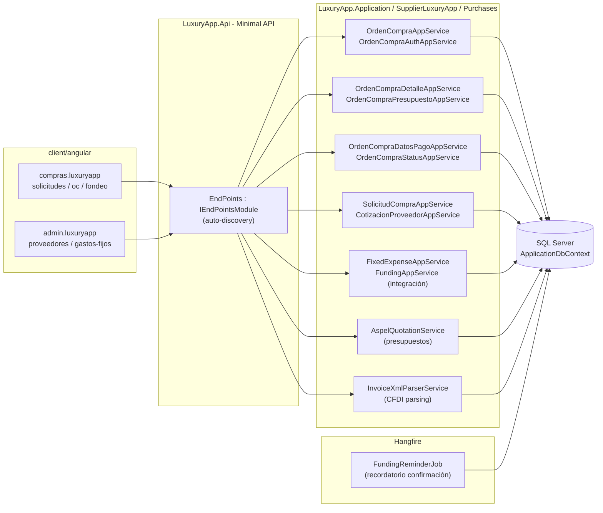
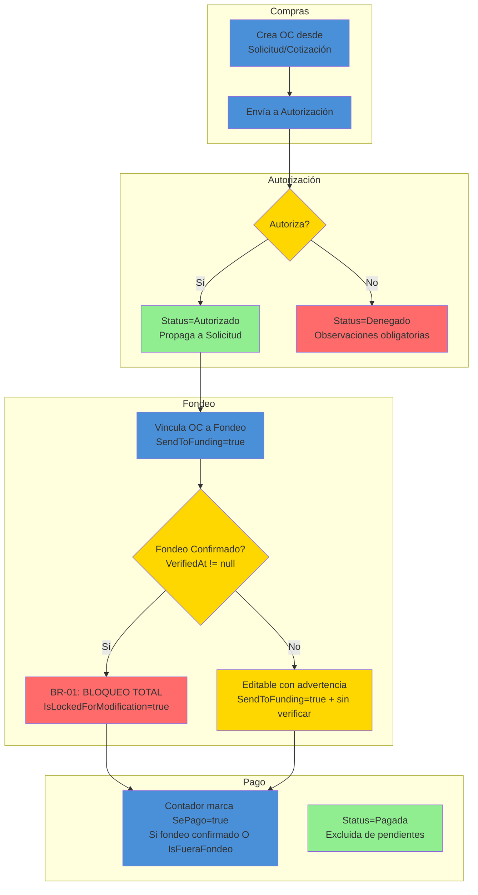
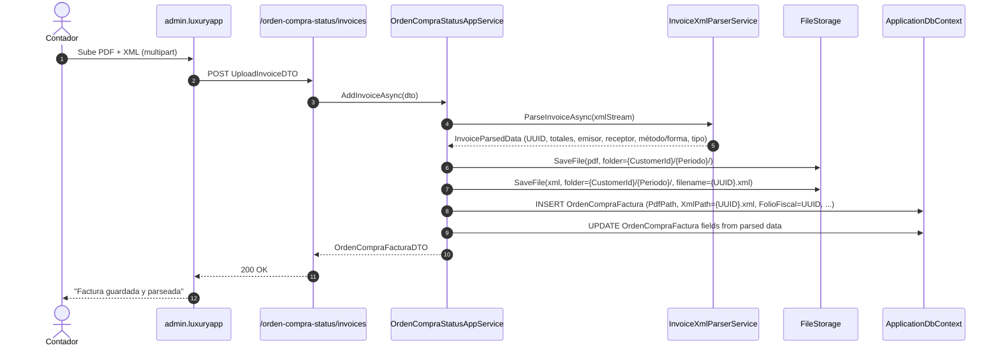
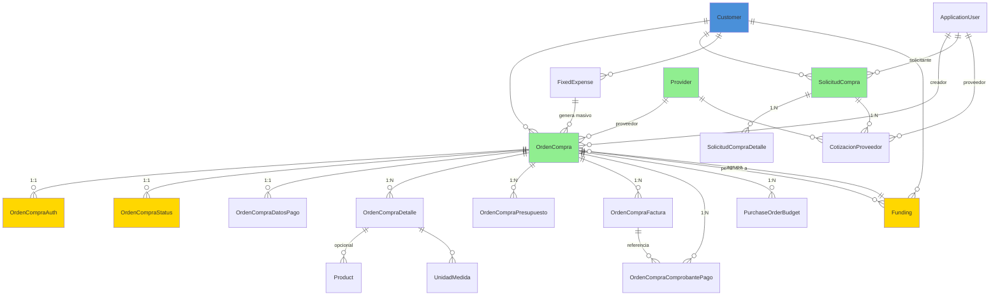

# Compras (Purchases) — Documentación Técnica

> **Ruta**: 📂 Documentación > 💼 Operaciones > 🛒 Compras
> **📅 Última Revisión**: 13-jul-26
> **🛡️ Estado**: ✅ Vigente
> **👤 Responsable**: @equipo-compras

---

## 📑 Tabla de Contenidos

1. [Resumen Ejecutivo](#-resumen-ejecutivo)
2. [Visión Funcional](#-visión-funcional)
3. [Arquitectura Técnica](#-arquitectura-técnica)
4. [API Endpoints](#-api-endpoints)
5. [Flujo del Sistema](#-flujo-del-sistema)
6. [Componentes Frontend](#-componentes-frontend)
7. [Reglas de Negocio](#-reglas-de-negocio)
8. [Matriz de Permisos](#-matriz-de-permisos)
9. [Catálogo de Roles del Sistema](#-catálogo-de-roles-del-sistema)
10. [Base de Datos](#-base-de-datos)
11. [Performance](#-performance)
12. [Glosario de Términos](#-glosario-de-términos)
13. [Checklist de Validación](#-checklist-de-validación)
14. [Historial de Cambios](#-historial-de-cambios)

---

## 🎯 Resumen Ejecutivo

**Propósito**: Módulo integral de gestión de Órdenes de Compra (OC) que cubre el ciclo completo: solicitud → cotización → creación → autorización → facturación → fondeo (quincenas de pago) → pago → conciliación, con integración a presupuestos, ASPEL y catálogos fiscales.

**Actores Involucrados** (`ApplicationRoleEnum`): `Administrador`, `GerenteOperaciones`, `GerenteAtencion`, `Asistente`, `Compras`, `Contador`, `SuperUsuario`, `Proveedor`, `JefeMantenimiento`, `Reclutamiento`, `Legal`, `SupervisionOperativa`, `RecursosHumanos`.

**Dependencias**: `Customer` (tenant), `Provider` (proveedores + rating), `Charge`/`CobranzaPayment` (pagos), `Funding` (quincenas de fondeo), `AspelCobranzaHaus` (presupuestos), `FileStorage` (PDF/XML facturas), `CatalogosMaestros` (MétodoPago, UsoCFDI, FormaPago, Banco), Hangfire (jobs), EPPlus (exportación).

**Alcance**:

- ✅ Incluye: Solicitudes de compra + cuadro comparativo IA, OC CRUD + autorización + estados, Partidas + presupuestos + datos pago, Facturas (PDF/XML + parsing CFDI), Fondeo (quincenas + confirmación + bloqueo), OC fuera de proceso, Gastos fijos (generación masiva), Integración ASPEL (presupuestos), Análisis IA cuadro comparativo.
- ❌ No incluye: Portal proveedores (autogestión OC), Conciliación bancaria automática, Facturación CFDI emisor (módulo InvoiceGeneration), Nómina (RRHH).

---

## 🔍 Visión Funcional

**HU-01 — Ciclo completo OC con fondeo**

> Como **compras/admin** quiero crear OC desde solicitud/cotización, autorizarla, vincularla a fondeo quincenal y que se bloquee edición al confirmar fondeo.
> **Criterios**: `SendToFunding=true` + `Funding.VerifiedAt != null` → `IsLockedForModification=true` (BR-01, BR-02); autorización propaga a `SolicitudCompra`; desautorización revierte `SePago=false`.

**HU-02 — OC fuera de proceso (urgencias)**

> Como **gerente operaciones** quiero crear OC vinculada a fondeo ya confirmado para pagos urgentes sin esperar quincena siguiente.
> **Criterios**: `POST /fuera-fondeo` → `IsFueraFondeo=true`, `SendToFunding=false`, auto-autorizada, `FundingId` opcional; visible en `FundingDetail` sección separada; contador puede marcar `SePago=true` sin fondeo confirmado (excepción única).

**HU-03 — Facturación CFDI + parsing automático**

> Como **contador** quiero subir PDF+XML y que el sistema extraiga datos fiscales (UUID, totales, emisor, receptor, método/forma pago) y renombre archivos con UUID para evitar colisiones.
> **Criterios**: Parsing namespace SAT + fallback local-name; `FolioFiscal` (UUID) como nombre archivo; directorio `{CustomerId}/{PeriodoFolder}/`; enriquecimiento automático en `GetByIdAsync` si faltan datos.

**HU-04 — Presupuestos por OC + ASPEL**

> Como **contador** quiero asignar presupuesto por cuenta contable a cada OC y ver disponibilidad real desde ASPEL en tiempo real.
> **Criterios**: `PurchaseOrderBudget` (año + cuenta + monto); `GetByIdAsync` llama `AspelQuotationService.GetMultipleAccountsBudgetStatusAsync` → enriquece `PresupuestoAnual`, `GastadoEjecutado`, `Pendiente`, `Restante`; fallo ASPEL no aborta carga.

**HU-05 — Generación masiva gastos fijos**

> Como **admin** quiero generar OC recurrentes (rentas, servicios) por quincena desde catálogo `FixedExpense` con anti-duplicados por `Indice`.
> **Criterios**: `POST /GenerarOrdenCompraFijos/{customerId}/{quincena}/{year}/{period}`; valida fondeo no confirmado; filtra `FixedExpense.Quincena == quincena`; `HashSet` de `Indice` existentes → omite duplicados.

---

## 🏗️ Arquitectura Técnica

| Capa        | Tecnología                                                             |
| ----------- | ---------------------------------------------------------------------- |
| Backend     | .NET 10, Minimal APIs (`IEndpointModule`), EF Core 10                  |
| OC/Fondeo   | Doble FK `FundingId` (string índice) + `FundingGuidId` (Guid FK real)  |
| Facturas    | Parsing CFDI (namespace SAT + fallback local-name), UUID anti-colisión |
| ASPEL       | `AspelQuotationService` (sync, sin cache, sin timeout explícito)       |
| IA          | `analyze-comparative-chart` (OpenAI/Gemini) para cuadro comparativo    |
| Jobs        | Hangfire (`HangfireJobCatalog`)                                        |
| Exportación | EPPlus (`GetAsByteArray`)                                              |
| Respuestas  | `ApiResponseDTO<T>` (nunca `ProblemDetails`)                           |
| Mapeo       | Explícito `ToDTO()` (AutoMapper legacy en `Mapping/` — deuda técnica)  |
| Frontend    | Angular 22 (standalone, signals, OnPush), Bootstrap 5, catálogo `@ui/*`    |

---

## 📱 Mobile Responsive (§15 CONVENTIONS.md)

| Vista                                                               | Patrón (§15.2)           | Implementación                                                              |
| ------------------------------------------------------------------- | ------------------------ | --------------------------------------------------------------------------- |
| `OrdenCompraList` / `OrdenCompraForm` / `OrdenCompraDetail`         | **A — CSS Responsive**   | `p-table` responsive, `p-dialog` formularios, `p-tabView` secciones         |
| `SolicitudCompraList` / `SolicitudCompraForm` / `CuadroComparativo` | **A — CSS Responsive**   | PrimeFlex grid, `p-table` scroll horizontal, `p-fileUpload` drag&drop       |
| `FondeoDetail` / `FundingOrdenCompraList`                           | **A — CSS Responsive**   | Cards KPI, `p-table` virtual scroll, sección "Fuera de proceso" condicional |
| `CuadroComparativo` (IA)                                            | **C — Adaptive Wrapper** | Web: `p-dialog` ancho completo; Móvil: `ion-modal` full-screen              |

**Reglas aplicadas:**

- Breakpoint único: 768px (`PlatformService.isMobile()`)
- Touch targets ≥ 44×44px
- Safe areas: `p-dialog` / `ion-modal` manejan notch
- File upload: `p-fileUpload` web / `ion-input type="file"` + `Capacitor Filesystem` móvil
- Modales: `p-dialog` (web), `ion-modal` vía `IonicDialogModal` (móvil)
- Pull-to-refresh + infinite scroll en listados

---

## 🌐 API Endpoints

Base por dominio (kebab-case, plural, minúsculas, prefijo `api/`):

| Dominio                | Base Path                           | Descripción                                       |
| ---------------------- | ----------------------------------- | ------------------------------------------------- |
| Órdenes de Compra      | `api/orden-compra`                  | CRUD + autorización + fondeo + PDF + gastos fijos |
| Autorización OC        | `api/orden-compra-auth`             | Autorizar / Desautorizar / Denegar                |
| Estado OC              | `api/orden-compra-status`           | Seguimiento + facturas + comprobantes             |
| Detalle OC             | `api/orden-compra-detalle`          | Partidas (productos/servicios) + totales          |
| Presupuesto OC         | `api/orden-compra-presupuesto`      | Asignaciones contables por OC                     |
| Datos Pago OC          | `api/orden-compra-datos-pago`       | Proveedor, banco, CLABE, fondeo, tipo gasto       |
| Comprobantes Pago      | `api/orden-compra-comprobante-pago` | Subida/eliminación archivos pago                  |
| Solicitudes Compra     | `api/solicitud-compra`              | CRUD + cuadro comparativo IA + cotizaciones       |
| Cotizaciones Proveedor | `api/cotizacion-proveedor`          | CRUD + archivos + análisis IA                     |
| Gastos Fijos           | `api/gasto-fijo`                    | Catálogo generación masiva OC                     |
| Fondeo                 | `api/funding`                       | Quincenas, confirmación, detalle OC vinculadas    |

> [!NOTE]
> El campo `responseCode` viaja **dentro** de `ApiResponseDTO`; el status HTTP siempre es `200 OK` para respuestas de negocio (incluidos errores 4xx de dominio). `500` solo para excepciones no controladas.

### Tabla General (muestra representativa)

| Método | Path                                                                                          | Roles                    | Request DTO                       | Response DTO                                     | Códigos HTTP          |
| ------ | --------------------------------------------------------------------------------------------- | ------------------------ | --------------------------------- | ------------------------------------------------ | --------------------- |
| GET    | `/orden-compra/list/{customerId}/{estatus}/{tipoGasto}`                                       | Compras, Admin           | `PaginationCommonDTO`             | `PagedResultDTO<OrdenCompraDTO>`                 | 200 · 400             |
| GET    | `/orden-compra/{id}`                                                                          | Compras, Admin, Contador | —                                 | `OrdenCompraDTO` (con `IsLockedForModification`) | 200 · 404             |
| POST   | `/orden-compra/{providerId}/{posicionCotizacion}/{solicitudCompraId?}`                        | Compras, Admin           | —                                 | `OrdenCompraDTO`                                 | 200 · 400 · 404 · 409 |
| POST   | `/orden-compra/progressive-create`                                                            | Compras, Admin           | `ProgressiveCreateDTO`            | `OrdenCompraDTO`                                 | 200 · 400 · 409       |
| POST   | `/orden-compra/Fondeo`                                                                        | Compras, Admin           | `FondeoOCBatchDTO`                | `bool`                                           | 200 · 400 · 409       |
| POST   | `/orden-compra/GenerarOrdenCompraFijos/{customerId}/{quincena}/{fundingYear}/{fundingPeriod}` | Admin                    | —                                 | `GenerateFixedExpenseResultDTO`                  | 200 · 400 · 409       |
| POST   | `/orden-compra/fuera-fondeo`                                                                  | Admin, GerOps, Asistente | `FueraFondeoCreateDTO`            | `OrdenCompraDTO`                                 | 200 · 400 · 403 · 404 |
| DELETE | `/orden-compra/{id}/fuera-fondeo`                                                             | SuperUsuario, Admin      | —                                 | `bool`                                           | 200 · 403 · 404       |
| GET    | `/orden-compra-auth/Autorizar/{ordenCompraId}/{applicationUserId}`                            | Compras, Admin           | —                                 | `bool`                                           | 200 · 400 · 404 · 409 |
| GET    | `/orden-compra-auth/Desautorizar/{ordenCompraId}`                                             | Compras, Admin           | —                                 | `bool`                                           | 200 · 400 · 404 · 409 |
| PUT    | `/orden-compra-auth/NoAutorizada/{ordenCompraAuthId}/{applicationUserId}`                     | Compras, Admin           | `DenyDTO`                         | `bool`                                           | 200 · 400 · 404 · 409 |
| POST   | `/orden-compra-status/invoices`                                                               | Contador, Admin          | `UploadInvoiceDTO` (multipart)    | `OrdenCompraFacturaDTO`                          | 200 · 400 · 404       |
| POST   | `/solicitud-compra/analyze-comparative-chart/{id}`                                            | Compras, Admin           | —                                 | `ComparativeChartAnalysisDTO`                    | 200 · 400 · 404       |
| POST   | `/cotizacion-proveedor`                                                                       | Compras, Admin           | `CreateCotizacionDTO` (multipart) | `CotizacionProveedorDTO`                         | 200 · 400 · 404       |
| POST   | `/gasto-fijo/generar-orden-compra-fijos`                                                      | Admin                    | —                                 | `GenerateFixedExpenseResultDTO`                  | 200 · 400 · 409       |

---

## 🔄 Flujo del Sistema

### Ciclo de vida OC + Fondeo (con bloqueo)

### Flujo factura CFDI (upload + parsing + anti-colisión)

---

## 🖥️ Componentes Frontend

Workspace: **`client/angular`** (standalone, signals, OnPush, catálogo `@ui/*`, `ApiResponseService`, `Endpoints`).

### Routing

| App (§14)           | Ruta                                   | Componente            | Lazy loading | Guard       | Menú |
| ------------------- | -------------------------------------- | --------------------- | :----------: | ----------- | :--: |
| `compras.luxuryapp` | `compras/solicitudes`                  | `SolicitudCompraList` |      ✅      | `authGuard` |  ✅  |
| `compras.luxuryapp` | `compras/solicitudes/nueva`            | `SolicitudCompraForm` |      ✅      | `authGuard` |  ❌  |
| `compras.luxuryapp` | `compras/solicitudes/{id}/comparativo` | `CuadroComparativo`   |      ✅      | `authGuard` |  ❌  |
| `compras.luxuryapp` | `compras/ordenes-compra`               | `OrdenCompraList`     |      ✅      | `authGuard` |  ✅  |
| `compras.luxuryapp` | `compras/ordenes-compra/nueva`         | `OrdenCompraForm`     |      ✅      | `authGuard` |  ❌  |
| `compras.luxuryapp` | `compras/ordenes-compra/{id}`          | `OrdenCompraDetail`   |      ✅      | `authGuard` |  ❌  |
| `compras.luxuryapp` | `compras/fondeo`                       | `FundingList`         |      ✅      | `authGuard` |  ✅  |
| `compras.luxuryapp` | `compras/fondeo/{id}`                  | `FundingDetail`       |      ✅      | `authGuard` |  ❌  |
| `admin.luxuryapp`   | `admin/proveedores`                    | `ProviderList`        |      ✅      | `authGuard` |  ✅  |
| `admin.luxuryapp`   | `admin/gastos-fijos`                   | `FixedExpenseList`    |      ✅      | `authGuard` |  ✅  |

### Catálogo de Componentes (representativo)

| Componente            | Selector                    | Tipo | Signals clave                                      | Servicios                          | Comportamiento                                                                                                                              |
| --------------------- | --------------------------- | ---- | -------------------------------------------------- | ---------------------------------- | ------------------------------------------------------------------------------------------------------------------------------------------- |
| `OrdenCompraList`     | `app-orden-compra-list`     | web  | `dataSignal`, `loading`, `filters`                 | `ApiResponseService`               | `p-table` virtual scroll, filtros estatus/tipo gasto/fondeo, `il-button-*` acciones                                                         |
| `OrdenCompraForm`     | `app-orden-compra-form`     | web  | `submitting`, `form`, `tabsSignal`                 | `ApiResponseService`, `FormHelper` | Stepper: datos OC / partidas / presupuestos / datos pago; `FormHelper.submitCrud()`                                                         |
| `OrdenCompraDetail`   | `app-orden-compra-detail`   | web  | `ocSignal`, `tabsSignal`, `isLockedSignal`         | `ApiResponseService`               | Tabs: General / Partidas / Presupuestos / Datos Pago / Facturas / Comprobantes / Fondeo; badges `IsLockedForModification` / `IsFueraFondeo` |
| `FundingDetail`       | `app-funding-detail`        | web  | `fundingSignal`, `ocsSignal`, `fueraProcesoSignal` | `ApiResponseService`               | KPIs fondeo, tabla OC vinculadas (badges fondeo confirmado), sección "Fuera de proceso" (Admin), botón pago excepción contador              |
| `SolicitudCompraForm` | `app-solicitud-compra-form` | web  | `submitting`, `form`, `quotesSignal`               | `ApiResponseService`, `FormHelper` | Stepper: datos / cotizaciones; `FormHelper.submitCrud()`, `p-fileUpload` cotizaciones                                                       |
| `CuadroComparativo`   | `app-cuadro-comparativo`    | web  | `analysisSignal`, `loading`, `quotesSignal`        | `ApiResponseService`               | Tabla comparativa cotizaciones (proveedor/precio/condiciones), botón **Analizar con IA** → `analyze-comparative-chart`                      |
| `FixedExpenseList`    | `app-fixed-expense-list`    | web  | `dataSignal`, `generating`                         | `ApiResponseService`               | `p-table` gastos fijos, botón **Generar OC quincena** → `GenerarOrdenCompraFijos`                                                           |
| `ProviderList`        | `app-provider-list`         | web  | `dataSignal`, `filters`, `ratingSignal`            | `ApiResponseService`               | `p-table` paginado, rating estrellas, badges vigencia seguro/contrato, `il-button-*` editar/documentos                                      |

**Estilos**: Bootstrap 5 (`card`, `grid`, `text-*`); botones/inputs catálogo `@ui/*` (`il-button`, `il-button-save`, `custom-input-*-signal`, `ili-button-*` mobile). **Testing**: `.spec.ts` por componente (Vitest) — cobertura básica inicialización.

**Interfaces** (`core/interfaces/purchases.dto.ts`): `orden-compra`, `orden-compra-auth`, `orden-compra-status`, `orden-compra-detalle`, `orden-compra-presupuesto`, `orden-compra-datos-pago`, `orden-compra-factura`, `solicitud-compra`, `cotizacion-proveedor`, `gasto-fijo`, `funding`, `paged-result`.

---

## 📜 Reglas de Negocio

| ID     | SI (condición)                                        | ENTONCES (acción)                                                                                                                                                                                                                                                                          |
| ------ | ----------------------------------------------------- | ------------------------------------------------------------------------------------------------------------------------------------------------------------------------------------------------------------------------------------------------------------------------------------------ | ------------------------------ | ---------------------------------------------------------------------------------------------- |
| RN-001 | Cualquier operación del módulo                        | Se filtra por `currentUser.CustomerId`; ningún acceso cruza tenants                                                                                                                                                                                                                        |
| RN-002 | `SendToFunding = true` Y `Funding.VerifiedAt != null` | Bloquea **todas** operaciones de modificación (autorizar, editar partidas, presupuesto, datos pago) → 409 "Operación bloqueada: la orden pertenece al fondeo '{PeriodoNombre}' que ya fue confirmado." (BR-01)                                                                             |
| RN-003 | `GetByIdAsync` calcula `IsLockedForModification`      | Verifica tabla BR-02: `SendToFunding=false` → libre; `Autorizado` + `VerifiedAt!=null` → bloqueado; `Autorizado` + `VerifiedAt=null` → advertencia; `Autorizado` + fondeo null → advertencia                                                                                               |
| RN-004 | `POST /Autorizar`                                     | Valida `ApplicationUserId` existe + `OrdenCompraAuth` existe + BR-01 pasa → `Status=Autorizado`, `FechaAutorizacion=Now`, limpia `Observaciones`, propaga `SolicitudCompra.Estatus=Autorizado`                                                                                             |
| RN-005 | `GET /Desautorizar`                                   | Valida BR-01 → `Status=Pendiente`, limpia `FechaAutorizacion`/`UserId`/`Observaciones`/`RevisadoPorResidente`, propaga `SolicitudCompra=Pendiente`, revierte `SePago=false`                                                                                                                |
| RN-006 | `PUT /NoAutorizada`                                   | Valida BR-01 → `Status=Denegado`, `Observaciones` obligatorio, limpia `FechaAutorizacion`, propaga `SolicitudCompra=Denegado`                                                                                                                                                              |
| RN-007 | `AddInvoiceAsync` (factura)                           | Parsing CFDI: namespace SAT + fallback local-name; extrae `TipoComprobante` (I/E), `Factura` (Serie+Folio), `FechaFactura`, `MetodoPago`, `FormaPago`, `Monto`, `RfcEmisor`, `NombreEmisor`, `RfcReceptor`, `FolioFiscal` (UUID); nombre archivo XML = `{FolioFiscal}.xml` (anti-colisión) |
| RN-008 | `GetByIdAsync` enriquece facturas                     | Si `FolioFiscal` o `Monto` vacíos → lee XML disco → extrae faltantes → persiste enriquecimiento (errores silenciosos)                                                                                                                                                                      |
| RN-009 | `UpdateAsync` `FundingPeriod`/`FundingYear` cambia    | Mueve físicos `PdfFile`/`XmlFile` de `{PeriodoViejo}/` a `{PeriodoNuevo}/`; errores logueados, **no abortan** operación                                                                                                                                                                    |
| RN-010 | `AddAsync`/`UpdateAsync` partidas OC                  | Si `ProductoId` existe → `ProductName = "{Marca} {Nombre} {Modelo}".Trim()`; si null/no existe → `ProductName = null`                                                                                                                                                                      |
| RN-011 | `GetListProductoToOrder`                              | Excluye productos ya en OC; búsqueda case-insensitive (Nombre, Marca, Modelo, Categoría); orden Categoría ASC → Nombre ASC; paginación `PaginationCommonDTO`                                                                                                                               |
| RN-012 | `GenerarOrdenCompraFijos`                             | Valida fondeo no confirmado; filtra `FixedExpense.Quincena == quincena`; `HashSet` de `Indice` existentes → omite duplicados (`continue`)                                                                                                                                                  |
| RN-013 | `CreateFromInvoicesAsync` (bulk XML)                  | Recalcula totales: si `subTotal=0` O `                                                                                                                                                                                                                                                     | calculatedTotal - invoiceTotal | > 1.00`→`subTotal = invoiceTotal / (1 + taxFactor)`, `descuentoPorcentaje=0`; tolerancia $1.00 |
| RN-014 | `CreateFromInvoicesAsync` índice lógico               | `Indice = "{(int)TipoGasto + 1}.{ContadorLocalDelTipo}"` (ej. Variable=1, 2da OC → "2.2"); contador local por tipo dentro del lote                                                                                                                                                         |
| RN-015 | `GetByIdAsync` consulta ASPEL presupuesto             | `AspelQuotationService.GetMultipleAccountsBudgetStatusAsync` → enriquece `PresupuestoAnual`, `GastadoEjecutado`, `Pendiente`, `Restante`; fallo ASPEL no aborta (campos vacíos/0)                                                                                                          |
| RN-015 | OC Fuera de proceso (`IsFueraFondeo=true`)            | Sin guard `ConfirmedById`; `SendToFunding=false`; auto-autorizada; `FundingId` opcional; visible en `FundingDetail.OrdenesFueraProceso`; contador puede marcar `SePago=true` sin fondeo confirmado (única excepción)                                                                       |
| RN-016 | Multi-tenant                                          | Todas las queries filtran `CustomerId` del usuario autenticado; ningún acceso cross-tenant                                                                                                                                                                                                 |

---

## 🔐 Matriz de Permisos

Roles de `ApplicationRoleEnum`. Agrupados por `RoleType`.

| Acción                            |     Compras (Staff)     | Admin/Contador | Gerencia | Proveedor (Contractor) |         Sistema         |
| --------------------------------- | :---------------------: | :------------: | :------: | :--------------------: | :---------------------: |
| Solicitudes CRUD                  |           ✅            |       ✅       |    ✅    |           ❌           |           ✅            |
| Cuadro comparativo + IA           |           ✅            |       ✅       |    ✅    |           ❌           |           ✅            |
| OC crear/editar                   |           ✅            |       ✅       |    ❌    |           ❌           |           ✅            |
| OC autorizar/desautorizar/denegar |           ✅            |       ✅       |    ❌    |           ❌           |           ✅            |
| OC fondear/vincular               |           ✅            |       ✅       |    ❌    |           ❌           |           ✅            |
| OC fuera de proceso crear         | ✅ (Admin/GerOps/Asist) |       ❌       |    ❌    |           ❌           |    ✅ (SuperUsuario)    |
| OC fuera de proceso eliminar      |           ❌            |       ❌       |    ❌    |           ❌           | ✅ (SuperUsuario/Admin) |
| Partidas/Presupuestos/DatosPago   |           ✅            |       ✅       |    ❌    |           ❌           |           ✅            |
| Facturas subir/parsear            |           ✅            |       ✅       |    ❌    |           ❌           |           ✅            |
| Fondeo confirmar/verificar        |           ✅            | ✅ (Contador)  |    ❌    |           ❌           |           ✅            |
| Gastos fijos generar              |           ✅            |       ✅       |    ❌    |           ❌           |           ✅            |
| Proveedores CRUD/rating           |           ✅            |       ✅       |    ❌    |      ✅ (propios)      |           ✅            |
| ASPEL presupuesto consultar       |           ✅            |       ✅       |    ✅    |           ❌           |           ✅            |
| Exportar/Reportes                 |           ✅            |       ✅       |    ✅    |           ❌           |           ✅            |
| OC fuera proceso marcar pagada    |           ❌            | ✅ (Contador)  |    ❌    |           ❌           |           ✅            |

**Detalle por RoleType**:

- **Staff**: `Administrador`, `GerenteOperaciones`, `GerenteAtencion`, `Asistente`, `Compras`, `JefeMantenimiento`, `Reclutamiento`, `Legal`, `SupervisionOperativa`
- **Corporate**: `Contador`, `AdministracionGeneral`, `SistemasGeneral`, `RecursosHumanos`, `Legal`
- **Contractor**: `Proveedor` (solo ve/actualiza sus cotizaciones y rating)
- **System**: `SuperUsuario`

---

## 🗄️ Catálogo de Roles del Sistema

El módulo **no introduce roles nuevos**: reutiliza `ApplicationRoleEnum` mediante grupos en `PurchaseRoles` (`BuyerRoles`, `ApproverRoles`, `FundingRoles`, `AccountingRoles`, `AdminRoles`, `OutsideProcessRoles`). La autorización es **por rol** (`AuthorizeAttribute { Roles = ... }`), no por claims.

---

## 🗄️ Base de Datos

`ApplicationDbContext` (SQL Server). FKs con `OnDelete(Restrict)`. Filtrado por `CustomerId` manual (no query filter global salvo soft-delete `ISoftDeletable.DeletedAt`).

| Tabla                  | Columnas clave                                                                                                                                                                                                                                                | Índices                                                                                                                                       |
| ---------------------- | ------------------------------------------------------------------------------------------------------------------------------------------------------------------------------------------------------------------------------------------------------------- | --------------------------------------------------------------------------------------------------------------------------------------------- | ---------------------------------------------------------------------------------------------- | ------------------------------------------------------------------------ |
| `OrdenCompra`          | `Id`, `CustomerId`, `Folio`, `Indice` (string lógico), `FundingGuidId` (Guid FK real), `SortOrder`, `FechaSolicitud`, `ApplicationUserId`, `SolicitudCompraId`, `IsDevolucion`, `IsFueraFondeo`, `SendToFunding`, `FundingPeriod`, `FundingYear`, `TipoGasto` | `IX (CustomerId, TipoGasto, Status, FechaSolicitud)`, `IX (CustomerId, FundingGuidId)`, `UX (CustomerId, Indice, FundingYear, FundingPeriod)` |
| `OrdenCompraAuth`      | `OrdenCompraId` (FK 1:1), `StatusOrdenCompra` (`Pendiente`                                                                                                                                                                                                    | `Autorizado`                                                                                                                                  | `Denegado`), `FechaAutorizacion`, `Observaciones`, `RevisadoPorResidente`, `ApplicationUserId` | `UX (OrdenCompraId)`, `IX (StatusOrdenCompra)`                           |
| `OrdenCompraStatus`    | `OrdenCompraId` (FK 1:1), `SePago`, `SeRecibio`, `RecibidoPor`, `TramitarPago`, `PagoReferencia`                                                                                                                                                              | `UX (OrdenCompraId)`                                                                                                                          |
| `OrdenCompraDatosPago` | `OrdenCompraId` (FK 1:1), `ProviderId`, `TipoGasto`, `UsoCFDIId`, `FormaDePagoId`, `MetodoDePagoId`, `SendToFunding`, `FundingPeriod`, `FundingYear`, `CuentaClave`, `PagoSolicitadoPor`, `PagoAutorizadoPor`                                                 | `UX (OrdenCompraId)`, `IX (ProviderId)`                                                                                                       |
| `OrdenCompraDetalle`   | `OrdenCompraId`, `ProductoId`, `ProductName`, `UnidadMedidaId`, `Cantidad`, `Precio`, `Descuento`, `IvaAplicado`, `RetencionIVAPorcentaje`, `RetencionISRPorcentaje`                                                                                          | `IX (OrdenCompraId, ProductoId)`                                                                                                              |
| `OrdenCompraFactura`   | `OrdenCompraId`, `PdfFile`, `XmlFile` (nombre = UUID), `Factura` (Serie+Folio), `FolioFiscal` (UUID SAT), `FechaFactura`, `RfcEmisor`, `NombreEmisor`, `Monto`, `TipoComprobante` (I/E), `MetodoPago`, `FormaPago`                                            | `IX (OrdenCompraId, FechaFactura)`, `UX (FolioFiscal)`                                                                                        |
| `PurchaseOrderBudget`  | `OrdenCompraId`, `FiscalYear`, `AccountNumber`, `AccountName`, `Amount`                                                                                                                                                                                       | `IX (OrdenCompraId, FiscalYear)`                                                                                                              |
| `SolicitudCompra`      | `CustomerId`, `ApplicationUserId`, `Folio`, `Estatus`, `FechaSolicitud`, `EquipoOInstalacion`, `JustificacionGasto`                                                                                                                                           | `IX (CustomerId, Estatus, FechaSolicitud)`, `UX (CustomerId, Folio)`                                                                          |
| `CotizacionProveedor`  | `SolicitudCompraId`, `PosicionCotizacion`, `FilePath`, `NameProvider`, `FechaCotizacion`, `NumeroCotizacion`, `Garantia`, `Entrega`, `PoliticaPago`                                                                                                           | `IX (SolicitudCompraId, PosicionCotizacion)`                                                                                                  |
| `FixedExpense`         | `CustomerId`, `Folio`, `Name`, `TipoGasto`, `ProviderId`, `Quincena`, `Amount`, `JustificacionGasto`, `IsActive`                                                                                                                                              | `IX (CustomerId, Quincena, IsActive)`, `UX (CustomerId, Folio)`                                                                               |
| `Funding`              | `CustomerId`, `FundingPeriod` (1-24), `FundingYear`, `Status` (`Abierto`                                                                                                                                                                                      | `Verificado`                                                                                                                                  | `Cerrado`), `VerifiedAt`, `VerifiedBy`                                                         | `UX (CustomerId, FundingYear, FundingPeriod)`, `IX (CustomerId, Status)` |

**Enums** (`LuxuryApp.Shared.Enums`): `ETipoGasto` (0=Fijo, 1=Variable, 2=CajaChica, 3=Extraordinario, 4=Devoluciones, 5=TarjetaDebito, 6=Proyectos, 7=Nomina, 8=Impuestos), `EStatusOrdenCompra` (`Pendiente`=0, `Autorizado`=1, `Denegado`=2), `EFundingPeriod` (24 valores: 2 quincenas × 12 meses), `EFundingStatus`, `ETipoComprobante` (`I`=Ingreso, `E`=Egreso), `EStatusOrdenCompraAuth` (`Pendiente`, `Autorizado`, `Denegado`).

---

## ⚡ Performance

- **Lazy loading**: componentes Angular vía `loadComponent` (una carga por ruta).
- **N+1**: consultas con `join`/proyección `.Select()` (sin cargas perezosas por fila); listados paginados server-side (`PaginationCommonDTO`, tope 200).
- **Detalle OC**: `GetByIdAsync` carga gráfica completa en 1 query con `Include`/`ThenInclude` optimizado (evita N+1 en partidas, presupuestos, facturas, comprobantes, fondeo).
- **ASPEL**: llamada síncrona en `GetByIdAsync` (deuda técnica DT-05 — sin cache/timeout); fallo no aborta.
- **Parsing CFDI**: `InvoiceXmlParserService` stateless; reutilizado en `AddInvoiceAsync` + `UpdateInvoiceAsync` + enriquecimiento `GetByIdAsync`.
- **Anti-duplicados masivo**: `HashSet<Indice>` en memoria para `GenerarOrdenCompraFijos` (O(1) lookup).
- **Movimiento archivos fondeo**: `FileStorage` move sync; errores logueados, no transaccionales (DT-03).
- **Índices**: compuestos por `CustomerId` + campos filtro frecuente (`TipoGasto`, `Status`, `FundingGuidId`, `FechaSolicitud`, `Indice`/`FundingYear`/`FundingPeriod`).
- **Export**: tope 10 000 filas (EPPlus streaming).
- **Frontend**: `p-table [virtualScroll]="true"` + `[lazy]="true"`; `@defer (on viewport)` para análisis IA en cuadro comparativo.

---

## 📖 Glosario de Términos

| Término                     | Definición                                                                                            |
| --------------------------- | ----------------------------------------------------------------------------------------------------- |
| **OC**                      | Orden de Compra — documento que formaliza compra a proveedor                                          |
| **Fondeo**                  | Agrupación quincenal de OC para pago (`FundingPeriod` 1-24, `FundingYear`)                            |
| **Índice lógico**           | `Indice` (string "1.1", "2.3") = `{(int)TipoGasto+1}.{ContadorLocal}` — orden visual en fondeo        |
| **FundingGuidId**           | FK real (`Guid`) a `Funding` — integridad referencial                                                 |
| **FundingId (legacy)**      | Columna string `Indice` — **no** es FK real (deuda técnica DT-01)                                     |
| **SendToFunding**           | Flag que incluye OC en proceso de fondeo quincenal                                                    |
| **VerifiedAt/VerifiedBy**   | Confirmación de fondeo por contador → bloquea edición (BR-01)                                         |
| **OC Fuera de proceso**     | `IsFueraFondeo=true` — urgencia, salta guard de fondeo confirmado, auto-autorizada                    |
| **Cuadro comparativo**      | Tabla de cotizaciones por proveedor para una solicitud; análisis IA opcional                          |
| **Gasto fijo**              | `FixedExpense` — catálogo de gastos recurrentes para generación masiva OC por quincena                |
| **Parsing CFDI**            | Extracción automática datos fiscales del XML SAT (UUID, totales, emisor, receptor, método/forma pago) |
| **Anti-colisión archivos**  | Nombrado XML = `FolioFiscal` (UUID SAT) — evita sobreescritura entre proveedores                      |
| **Enriquecimiento factura** | Lectura XML en `GetByIdAsync` si faltan `FolioFiscal`/`Monto` — persiste silenciosamente              |
| **Integración ASPEL**       | Consulta presupuesto real por cuenta contable (`AspelQuotationService`) en `GetByIdAsync`             |
| **IA cuadro comparativo**   | `analyze-comparative-chart` endpoint → OpenAI/Gemini → recomendación proveedor                        |

---

## ✅ Checklist de Validación ([CONVENTIONS.md §11](../../../../../../CONVENTIONS.md#11-estándares-de-documentación))

> [!NOTE]
> El link a `CONVENTIONS.md` asume que el documento vive en la raíz del propio módulo. Ajusta la profundidad relativa (`../../../../../../`) según la ubicación final.

- [x] CERO mojibake (UTF-8 sin BOM)
- [x] CERO `any` en TypeScript
- [x] Fechas en formato `dd-MMM-yy`
- [x] Endpoints front/back coinciden carácter a carácter
- [x] Diagramas Mermaid válidos (flowchart swimlanes + sequence con `autonumber`)
- [x] Colores Mermaid según §11 (verde `#90EE90` éxito, amarillo `#FFD700` decisión, azul `#4A90D9` proceso, rojo `#FF6B6B` error)
- [x] Reglas de negocio en formato `SI/ENTONCES` (`RN-xxx`)
- [x] Roles usan nombres exactos de `ApplicationRoleEnum`
- [x] Mobile responsive: §15 aplicado según tipo de vista
- [x] Sin PII en logs
- [x] Emojis consistentes · Todo en español

---

## 📝 Historial de Cambios

| Fecha     | Versión | Autor       | Cambios                                                                                                                                                                                                                                                      |
| --------- | ------- | ----------- | ------------------------------------------------------------------------------------------------------------------------------------------------------------------------------------------------------------------------------------------------------------ |
| 13-may-26 | 1.0     | Claude Code | Documentación técnica inicial (versión viva)                                                                                                                                                                                                                 |
| 13-jul-26 | 2.0     | @kilo       | Actualización a template §11 CONVENTIONS.md: Mobile responsive §15, checklist §11, Mermaid colores, sin PII, sin `any`, rutas api kebab-case, TOC completo, arquitectura, flujos, componentes, matriz permisos, ER diagram, performance, glosario, historial |

---

## 📋 Deuda Técnica Pendiente (DT-01 a DT-06)

Ver sección 8 del documento original para detalles completos:

| ID    | Descripción                                                                                 | Impacto                                      | Prioridad |
| ----- | ------------------------------------------------------------------------------------------- | -------------------------------------------- | --------- |
| DT-01 | Doble columna `FundingId` (string) + `FundingGuidId` (Guid)                                 | Confusión, riesgo integridad                 | Alta      |
| DT-02 | Campos huérfanos en `OrdenCompraStatus` (`Factura`, `FolioFiscal`, `PdfFile`, `XmlFile`)    | Desincronización con `OrdenCompraFactura`    | Media     |
| DT-03 | Movimiento archivos sin compensación al cambiar `FundingPeriod`/`FundingYear`               | Rutas BD inconsistentes vs archivos reales   | Alta      |
| DT-04 | Roles hardcodeados en `OrdenCompraPresupuestoController` y `OrdenCompraDatosPagoController` | Cambio permisos requiere recompilación       | Media     |
| DT-05 | Llamada ASPEL síncrona sin cache/timeout en `GetByIdAsync`                                  | Latencia + punto de fallo único              | Alta      |
| DT-06 | Dos sistemas ordenamiento paralelos (`SortOrder` global + `Indice` por tipo)                | Desalineación visual `Indice` vs `SortOrder` | Media     |
