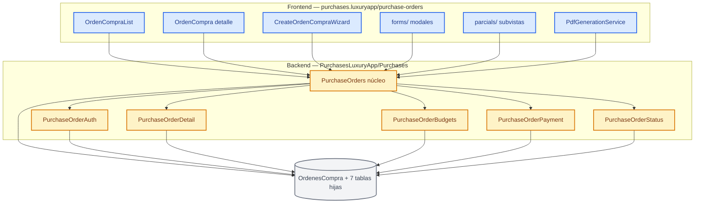
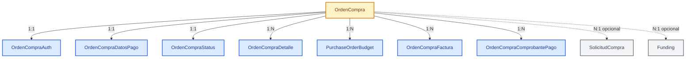

# 🎯 Análisis: Mapa de Componentes de Órdenes de Compra

### 🔀 1 módulo padre + 5 submodulos de backend y un feature Angular acoplado — qué existe exactamente hoy

> **Tipo de documento:** Análisis de Coherencia (no plan, no auditoría formal).
> Aplica REGLA 1 (inventario) y REGLA 6 (riesgos 🔴) obligatorias; REGLAS 2-5 recomendadas.
> Complementa — no reemplaza — `20260730-auditoria-purchases-ordenes-compra.md` y `20260907-analisis-purchases-ordenes-mapa.md`.

---

## 📋 Metadata

| Campo | Valor |
|---|---|
| Módulo backend | `api/LuxuryApp.Application/Modules/PurchasesLuxuryApp/Purchases/` |
| Módulo frontend | `appsweb/angular/src/app/modules/purchases.luxuryapp/purchase-orders/` |
| Submodulos backend | `PurchaseOrders` (núcleo), `PurchaseOrderDetail`, `PurchaseOrderAuth`, `PurchaseBudgets`, `PurchaseOrderPayment`, `PurchaseOrderStatus` |
| Entidades | `api/LuxuryApp.Application/Infrastructure/Data/Entities/PurchasesLuxuryApp/Purchases/PurchaseOrders/` (8 clases) |
| Tipo | Análisis de Coherencia (`analisis`) |
| Origen | Solicitud directa del usuario (mapa detallado de componentes) |
| Datos reales | N/A — documento de inventario, sin migración |
| Documento previo | `docs/PurchasesLuxuryApp/PurchaseOrders/20260907-analisis-purchases-ordenes-mapa.md` |
| Fecha | 2026-09-30 |

> ⚠️ El doc previo `20260907` referencia la ruta legacy `SupplierLuxuryApp/Purchases/`. El módulo hoy vive en `PurchasesLuxuryApp/Purchases/` — ese mapeo quedó parcialmente desactualizado (§2 CONVENTIONS).

---

## 🗺️ Panorama en un vistazo

> 🔵 **Azul = frontend** (feature Angular) · 🟠 **Naranja = backend** (servicios por submodulo) · ⚪ **Gris = persistencia** (agregado `OrdenCompra`).

---

## 📌 Resumen Ejecutivo

**Problem Statement:**

Actualmente el módulo de Órdenes de Compra existe y funciona de punta a punta (cotización → orden → autorización → fondeo → pago), pero está **altamente concentrado**: el núcleo backend vive en un único `OrdenCompraAppService` de ~1847 líneas y el feature frontend mezcla 42 archivos bajo una estructura `forms/` + `parcials/` genérica, lo que resulta en **lógica contable duplicada y una regla de bloqueo copiada 5 veces**, cuando el negocio necesita evolucionar el flujo (fondeo, gastos fijos, fuera de fondeo) sin romper contratos.

**KPIs (de este análisis — no de cambio)**

| Métrica | Baseline | Target de documentación | Verificación |
|---|---|---|---|
| Submodulos backend inventariados | 6 | 6 documentados | Este doc §6 |
| Entidades mapeadas a tabla real | 8 | 8 | This doc §6.1 |
| Servicios con regla `GetFundingConfirmedErrorAsync` duplicada | 5 | 5 identificados | `grep` §6.7, hallazgo H-02 |
| Fórmulas de total distintas en código | 3 | 3 identificadas | Hallazgo H-01 |
| Componentes Angular inventariados | ~22 | ~22 | §6.6 |

**Objetivo del análisis:**

1. Inventariar cada componente backend (servicio, endpoint, DTO, entidad) y su ubicación exacta.
2. Inventariar cada componente frontend (ruta, componente, formulario, parcial, servicio).
3. Trazar el flujo end-to-end del negocio.
4. Registrar hallazgos de coherencia con línea de código.

---

## 🗺️ Alcance

**Dentro de alcance:**
- Inventario de `api/.../PurchasesLuxuryApp/Purchases/**` (servicios, endpoints, DTOs, mapping, helpers).
- Inventario de entidades en `Infrastructure/Data/Entities/PurchasesLuxuryApp/Purchases/PurchaseOrders/`.
- Inventario de `appsweb/angular/.../purchases.luxuryapp/purchase-orders/**`.
- Contratos API en `appsweb/angular/.../core/constants/endpoints/supplier.endpoints.ts`.
- Rutas en `appsweb/angular/.../routing/compras.routing.ts` + `route-paths.ts`.

**Fuera de alcance (confirmado):**
- Documentación Nivel 1/2 del módulo (§4.7, 6 docs obligatorios) — tarea separada.
- Mover archivos o aplicar remediaciones — este doc no ejecuta cambios.
- Re-auditoría formal con matriz RN 4 niveles — ya existe `20260730-auditoria-...`.

**Inventario de esfuerzo del documento**

| Componente | Cambio | Esfuerzo | Status |
|---|---|---|---|
| Backend: 6 submodulos | Inventariar servicios/endpoints/DTOs | M | ✅ |
| Backend: 8 entidades | Mapear clase→tabla | S | ✅ |
| Frontend: `purchase-order/` | Inventariar 42 archivos | M | ✅ |
| Contratos: endpoints + rutas | Citar `file:line` | S | ✅ |
| Hallazgos de coherencia | 12 hallazgos con severidad | M | ✅ |

**Leyenda (S/M/L):** S = Small (1-2h), M = Medium (2-8h), L = Large (>8h).

---

## 🏛️ Arquitectura & Diseño Técnico

### 6.1 Entidades (clase → tabla real)

Todas bajo `api/LuxuryApp.Application/Infrastructure/Data/Entities/PurchasesLuxuryApp/Purchases/PurchaseOrders/`.

| Clase | Tabla (`[Table]`) | Rol | FK / campos clave |
|---|---|---|---|
| `OrdenCompra` | `OrdenesCompra` | Raíz del agregado (`GuidIdEntity`, `ITenantEntity`) | `CustomerId`, `SolicitudCompraId?`, `FundingId?` (col `FundingGuidId`), `Folio`, `Indice` (col `FundingId`), `SortOrder`, `IsFueraFondeo`, `IsDevolucion` |
| `OrdenCompraDetalle` | `PurchaseOrderItems` | Partida de producto/servicio | `OrdenCompraId`, `ProductoId?`, `Cantidad`, `Precio`, `Descuento`(%), `IvaAplicado`, `RetencionIVAPorcentaje`, `RetencionISRPorcentaje` |
| `OrdenCompraAuth` | `PurchaseOrderApprovals` | Autorización | `OrdenCompraId`, `StatusOrdenCompra`, `RevisadoPorResidente`, `ApplicationUserId` |
| `OrdenCompraDatosPago` | `ProviderBankingInfo` | Datos de pago/fiscales | `ProviderId`, `UsoCFDIId`, `FormaDePagoId`, `MetodoDePagoId`, `TipoGasto`, `SendToFunding`, `FundingPeriod?`, `FundingYear?` |
| `OrdenCompraStatus` | `PurchaseOrderHistory` | Seguimiento operativo | `SePago`, `SeRecibio`, `RecibidoPor`, `TramitarPago`, `PagoReferencia` |
| `PurchaseOrderBudget` | `PurchaseOrderBudgets` | Partida presupuestal | `FiscalYear`, `AccountNumber`, `AccountName`, `Amount` |
| `OrdenCompraFactura` | `PurchaseOrderInvoices` | Factura SAT | `Factura`, `FolioFiscal`(UUID), `Monto`, `RfcEmisor/Receptor`, `TipoComprobante`, `MetodoPago`, `FormaPago` |
| `OrdenCompraComprobantePago` | `PurchaseOrderPayments` | Comprobante de pago subido | `FilePath`, `FileName`, `UploadedByUserId`, `UploadDay?` |

> Las propiedades `SubTotal`, `Iva`, `RetencionIVACalculada`, `RetencionISRCalculada`, `Total` de `OrdenCompraDetalle` son `[NotMapped]` (cálculo en memoria).

### 6.2 Glosario bilingüe (ES ↔ código)

| En español | Clase / Ruta | Qué es en negocio |
|---|---|---|
| 🧾 Orden de Compra (OC) | `OrdenCompra` | El documento que autoriza un gasto a un proveedor |
| 📦 Partida / Detalle | `OrdenCompraDetalle` | Cada producto o servicio dentro de la OC |
| ✅ Autorización | `OrdenCompraAuth` | Estado y firmas de aprobación de la OC |
| 💳 Datos de Pago | `OrdenCompraDatosPago` | Banco, CLABE, CFDI y periodo de fondeo |
| 📊 Presupuesto | `PurchaseOrderBudget` | Cuenta contable y monto imputado |
| 🧾 Factura | `OrdenCompraFactura` | XML/PDF del SAT asociado |
| 🏦 Fondeo | `Funding` (módulo Fondeo) | Quincena que agrupa OC a pagar |
| 📈 Estatus | `OrdenCompraStatus` | Pagado / recibido / trámite de pago |
| 🧩 Fuera de Fondeo | `OrdenCompra.IsFueraFondeo` | OC de urgencia ajena al ciclo de fondeo |

### 6.3 Diagrama de relaciones

> 🟠 **Naranja = raíz del agregado** · 🔵 **Azul = hijos 1:1 / 1:N** · ⚪ **Gris = entidades externas** (solicitud de compra y fondeo).

### 6.4 Decisiones de Diseño (ADR — por qué, reconstruido)

| Decisión | Alternativa rechazada | Razón observada en código |
|---|---|---|
| 6 submodulos separados por concepto bajo `Purchases/` | Un solo módulo monolítico | Separación ya existente; cada uno con `Interfaces/Services/EndPoints/README` |
| Regla "fondeo confirmado bloquea" replicada en cada service | Un filtro/atributo global | Cada service necesita el candado localmente (`grep` → 5 copias, H-02) |
| Facturas como entidad separada `OrdenCompraFactura` | Campos en `OrdenCompraStatus` | Soporta N facturas por OC (campos viejos quedaron comentados en la entidad) |
| Nombre de archivo de factura = UUID SAT | Serie+Folio | Serie+Folio colisiona entre proveedores (comentario explícito en `OrdenCompraStatusAppService`) |
| Presupuesto escalado ×1.16 en gastos fijos | Monto directo | `Amount * 1.16M` hardcodeado en `GenerarOrdenCompraFijosAsync:1522` |

### 6.5 Componentes backend — núcleo `PurchaseOrders`

Raíz: `api/LuxuryApp.Application/Modules/PurchasesLuxuryApp/Purchases/PurchaseOrders/`

| Archivo | Líneas | Rol |
|---|---|---|
| `Interfaces/IOrdenCompraAppService.cs` | 59 | Contrato de 20 métodos |
| `Services/OrdenCompraAppService.cs` | **1847** | God service: CRUD, PDFs, fondeo, gastos fijos, fuera de fondeo, vínculos, parseo SAT |
| `EndPoints/OrdenCompraEndPoints.cs` | 121 | Grupo `api/orden-compra` (`RequireAuthorization` + `LogUserActivityEndPointsFilter`) |
| `Helpers/CustomOrdenesCompra.cs` | 38 | `InporteTotal`, `IvaTotal` (fórmula propia) |
| `Services/OrdenCompraExtensions.cs` | 21 | `CalcularTotalDetalles` (fórmula propia) |
| `Mapping/PurchaseOrderBudgetMapping.cs` | — | Mapeo presupuesto |
| `DTOs/` | ~45 archivos | DTOs de OC y de los 5 hermanos mezclados |

### 6.6 Componentes backend — submodulos hermanos

| Submodulo | Service (líneas) | Endpoints | Lógica principal |
|---|---|---|---|
| `PurchaseOrderDetail` | `OrdenCompraDetalleAppService.cs` (190) | `api/orden-compra-detalle` | CRUD partidas, candado fondeo, `GetListProductoToOrder` (productos no agregados, paginado) |
| `PurchaseOrderDetail` | `TotalesOrdenCompraDetallleService.cs` (26) | — | Sumas de impuestos/retenciones |
| `PurchaseOrderAuth` | `OrdenCompraAuthAppService.cs` (146) | `api/orden-compra-auth` | Autorizar/Desautorizar/NoAutorizada; sincroniza `SolicitudCompra.Estatus` |
| `PurchaseOrderBudgets` | `OrdenCompraPresupuestoAppService.cs` (128) | `api/orden-compra-presupuesto` | CRUD partida presupuestal, candado, totales |
| `PurchaseOrderPayment` | `OrdenCompraDatosPagoAppService.cs` (143) | `api/orden-compra-datos-pago` | Get/Update datos de pago; mueve archivos si cambia periodo |
| `PurchaseOrderPayment` | `OrdenCompraComprobantePagoAppService.cs` (63) | `api/orden-compra-comprobante-pago` | Subir/borrar comprobante de pago |
| `PurchaseOrderStatus` | `OrdenCompraStatusAppService.cs` (289) | `api/orden-compra-status` | Status, CRUD facturas, parseo XML SAT, update tipo comprobante |
| `DTOs/PendingMoveDTOs` | — | — | 7 DTOs de PDF solicitud de pago |
| `Mapping/SolicitudPagoMapper.cs` | — | — | Mapeo solicitud de pago |

### 6.7 Componentes frontend

Raíz: `appsweb/angular/src/app/modules/purchases.luxuryapp/purchase-orders/`

| Componente | Líneas | Rol |
|---|---|---|
| `purchase-order/orden-compra-list.ts` | 285 | Listado; filtros TipoGasto (9) + estatus; export PDF |
| `purchase-order/orden-compra.ts` | 423 | Detalle OC; signals `isAuthorized/isLocked/totals` |
| `purchase-order/create-orden-compra.ts` | 138 | Alta desde solicitud/cotización |
| `purchase-order/orden-compra-modal.ts` | 119 | Editar metadatos de OC |
| `purchase-order/orden-compra-edit-detalle.ts` | 104 | Editar línea de producto |
| `purchase-order/orden-compra-edit-presupusto-utilizado.ts` | 76 | Editar monto presupuesto usado |
| `create-purchase-order-wizard/create-orden-compra-wizard.ts` | 693 | Wizard 5 pasos (Info → Productos → Presupuesto → Facturas → Resumen) |
| `forms/orden-compra-datos-pago.ts` | 222 | Datos de pago; `sendToFunding` = periodo+year != null |
| `forms/orden-compra-status.ts` | 172 | Status pago/recepción + facturas |
| `forms/orden-compra-denegada.ts` | 69 | Denegar con observaciones |
| `forms/orden-compra-detalle-add-producto.ts` | 278 | Agregar producto (paginado lazy) |
| `forms/orden-compra-factura-form.ts` | 191 | Administrar facturas |
| `parcials/orden-compra-datos-auth-parcial.ts` | 85 | Bloque autorización |
| `parcials/orden-compra-datos-cotizacion.ts` | 24 | Bloque cotización origen |
| `parcials/orden-compra-datos-pago-parcial.ts` | 23 | Bloque datos de pago |
| `parcials/orden-compra-facturas-parcial.ts` | 91 | Bloque facturas |
| `parcials/orden-compra-status-parcial.ts` | 25 | Bloque estatus |
| `purchase-order-budget/orden-compra-presupuesto.ts` | 237 | Selector partida presupuestal |
| `purchase-order-detail-form/orden-compra-detalle-form.ts` | 109 | Form de línea |
| `payment-voucher-modal/payment-voucher-modal.ts` | 92 | Comprobante de pago |
| `payment-request-pdf/solicitud-pago-pdf.ts` | 268 | PDF solicitud de pago |
| `purchase-order-pdf/orden-compra-pdf.ts` | 227 | Datos PDF de OC |
| `services/orden-compra.service.ts` | 97 | Estado compartido por signals |
| `generator-pdf/pdf-generation.service.ts` | 492 | HTML→PDF (OC, solicitud pago, ZIP) |
| `purchase-link-manager/purchase-link-manager.ts` | — | Gestor de vínculos OC↔solicitud |

**Contratos API** (`core/constants/endpoints/supplier.endpoints.ts:76-165`): `PurchaseOrders`, `OrdenCompraStatus`, `PurchaseOrderBudgets`, `PurchaseOrderDetails`, `PurchaseOrderPaymentData`, `PurchaseOrderPaymentVouchers`.

**Rutas** (`routing/compras.routing.ts`): `/purchases/purchase-orders` (list), `/purchases/orden-compra/:id` (detalle), `/purchases/orden-compra-pdf/:id`, solicitud-pago.

### 6.8 Matriz de Reglas de Negocio (observadas en código)

**Nivel 1 — Invariantes de Dominio**

| RN | Regla |
|---|---|
| RN-OC-001 | Toda OC pertenece a un único `CustomerId` (tenant) |
| RN-OC-002 | Una OC tiene exactamente 1 `Auth`, 1 `DatosPago`, 1 `Status` |
| RN-OC-003 | El total neto = SubTotal + IVA − RetenciónIVA − RetenciónISR |

**Nivel 2 — Flujo y Estados**

| RN | Regla |
|---|---|
| RN-OC-010 | `StatusOrdenCompra`: `Pendiente → Autorizado` / `Denegado` |
| RN-OC-011 | Autorizar/desautorizar/denegar sincroniza `SolicitudCompra.Estatus` |
| RN-OC-012 | OC de gastos fijos nace `Autorizado`; OC progresiva/fuera de fondeo nace `Autorizado` automático |
| RN-OC-013 | No se elimina OC si `SePago = true` |

**Nivel 3 — Seguridad / Autorización**

| RN | Regla | Roles |
|---|---|---|
| RN-OC-020 | Grupo `api/orden-compra` requiere autenticación | `RequireAuthorization()` |
| RN-OC-021 | Crear/quitar fuera de fondeo | `SuperUsuario,Direccion,Administrador[,GerenteOperaciones,Asistente]` |

**Nivel 4 — Validación**

| RN | Regla |
|---|---|
| RN-OC-030 | `Fondeo confirmado` bloquea edición de OC/detalle/presupuesto/datos-pago |
| RN-OC-031 | `GenerarOrdenCompraFijos` rechaza si el fondeo destino ya fue verificado |
| RN-OC-032 | `Indice` (ej. `1.1`) se reindexa ante colisión |

---

## 🛤️ Acciones Correctivas (roadmap sugerido)

### Fase 1 — 🧹 Convergencia de totales

| Atributo | Valor |
|---|---|
| Owner | Backend Lead |
| Esfuerzo estimado | 1-2 días |
| Dependencias previas | Ninguna |
| Criterio de éxito | 1 sola fórmula, tests pasan |

Unificar `OrdenCompraDetalle.Total`, `CustomOrdenesCompra.InporteTotal` y `OrdenCompraExtensions.CalcularTotalDetalles` (H-01).

**Checklist:**
- [ ] Definir fuente única de cálculo de total
- [ ] Reemplazar usos dispersos
- [ ] Tests de totales en verde

### Fase 2 — 🧹 Extracción de candado de fondeo

| Atributo | Valor |
|---|---|
| Owner | Backend Lead |
| Esfuerzo estimado | 1 día |
| Dependencias previas | Fase 1 |
| Criterio de éxito | 1 helper, 0 copias |

Extraer `GetFundingConfirmedErrorAsync` a helper compartido (H-02).

**Checklist:**
- [ ] Crear helper/interface único
- [ ] Reemplazar 5 copias
- [ ] Build sin warnings nuevos

---

## 🚦 Criterios de Paso

**Happy path:** Crear OC desde cotización → autorizar → marcar fondeo → periodo verificado → el sistema bloquea edición.
**PASS si:** la OC queda marcada para fondeo y no permite modificación tras validar el fondeo.
**Automatización:** Manual — requiere datos de fondeo verificados. Candidato a Unit test en xUnit (`GetFundingConfirmedErrorAsync_WhenFundingConfirmed_ReturnsError`).

**Sad path:** Intentar editar una OC de un fondeo ya confirmado.
**PASS si:** el backend responde `ErrorResult` con mensaje de fondeo confirmado y no persiste cambios.
**Automatización:** Unit test en xUnit por cada service afectado.

**Edge path:** `GenerarOrdenCompraFijosAsync` con índice `Indice` ya usado.
**PASS si:** reindexa automáticamente a `{major}.{maxMinor+1}` y crea la OC sin error.
**Automatización:** Unit test en xUnit (`GenerarFijos_DuplicateIndice_Reindexes`).

---

## ⚠️ Riesgos y Mitigaciones

| Supuesto fallido | Impacto | Probabilidad | Mitigación | Owner |
|---|---|---|---|---|
| 🔴 Las 3 fórmulas de total divergen y producen importes distintos entre OC, carátula de fondeo y PDF | Cobro/pago incorrecto al proveedor | Media | Fase 1: fuente única + tests de paridad | Backend |
| `OrdenesCompraGastosFijosAsync` borra OC con hijos nulos al listar | Pérdida de datos | Baja | Revisar antes de operar; el borrado es silencioso (`:843-866`) | Backend |
| GUIDs de catálogos hardcodeados en progresiva/fuera de fondeo | Datos fiscales inválidos si cambian catálogos | Media | Migrar a `CustomersIdLuxury.*` o resolución por código | Backend |
| `GetSolicitudPagoPdf` retorna `null` en vez de `ApiResponseDTO` | Consumidor Angular sin error controlado | Baja | Normalizar contrato | Backend |
| Documento legacy `20260907` cita ruta `SupplierLuxuryApp/` ya inexistente | Confusión de agentes/auditores | Media | Este doc corrige la ruta; marcar el previo como histórico (§2 CONVENTIONS) | Tech Lead |

---

## 🔗 Dependencias e Impactos

| Sistema | Relación | Versión mínima | Impacto en este análisis |
|---|---|---|---|
| `SolicitudCompra` | **Depende de** | Actual | Alto — OC nace de SC y sincroniza su estatus (`OrdenCompraAuthAppService:58`) |
| `Funding` (Fondeo) | **Depende de** | Actual | Alto — candado de fondeo y `FundingPeriod/Year` |
| `Aspel` (`IAspelQuotationService`) | **Depende de** | Actual | Medio — refresco de presupuesto en `GetByIdAsync:190` |
| `BudgetToPurchaseOrderDTO` | **Impacta** | Actual | Medio — DTO de OC referenciado desde `SolicitudCompra/Presupuesto` |
| Providers / PaymentForms / TaxUsages / UnitsOfMeasure | **Depende de** | Actual | Medio — catálogos usados al crear OC |
| Frontend `supplier.endpoints.ts` | **Impacta** | Actual | Medio — contratos de rutas |
| Otros módulos | **No impacta** | N/A | Cero — alcance contenido a Purchases |

---

## 🏁 Cierre Esperado

El módulo de Órdenes de Compra queda inventariado de punta a punta: **6 submodulos backend**, **8 entidades** clase→tabla, **~22 componentes Angular**, **6 grupos de contratos API** y el flujo cotización→orden→autorización→fondeo→pago trazado. Quedan registrados **12 hallazgos de coherencia** con línea de código, de los cuales el más crítico (divergencia de fórmulas de total) cierra la deuda que ya venía señalada en `20260730-auditoria-purchases-ordenes-compra.md` — exactamente la consolidación pendiente sobre este módulo.

---

## 📎 Hallazgos de coherencia

| ID | Hallazgo | Ubicación | Severidad |
|---|---|---|---|
| H-01 | 3 fórmulas de total distintas | `OrdenCompraDetalle.cs:130`, `CustomOrdenesCompra.cs:5`, `OrdenCompraExtensions.cs:7` | 🔴 Crítica |
| H-02 | `GetFundingConfirmedErrorAsync` duplicada 5× | Auth/Detail/Budgets/DatosPago/OrdenCompraAppService | 🟠 Alta |
| H-03 | `Indice` mapea columna `FundingId`; `FundingId` mapea `FundingGuidId` | `OrdenCompra.cs:36,42` | 🟡 Media |
| H-04 | God service de 1847 líneas (CRUD+PDF+fondeo+SAT+vínculos) | `OrdenCompraAppService.cs` | 🟠 Alta |
| H-05 | `GetSolicitudPagoPdf` retorna `null` | `OrdenCompraAppService.cs:657-660` | 🟡 Media |
| H-06 | GUIDs de catálogos hardcodeados | `OrdenCompraAppService.cs:1612-1614,1703-1705` | 🟠 Alta |
| H-07 | Cálculo de totales duplicado backend+frontend | `pdf-generation.service.ts:330` vs `OrdenCompraAppService` | 🟡 Media |
| H-08 | `GetForEdit` devuelve `object`, `CotizacionesRelacionadas` `List<object>` | `OrdenCompraAppService.cs:590,903` | 🟡 Media |
| H-09 | `Auth/Budget/Detail/Status` usan la entidad directa como DTO | Services respectivos | 🟡 Media |
| H-10 | Frontend usa `any` y string mágico `"Autorizado"` | `orden-compra.ts:119` | 🟡 Media |
| H-11 | `ITotalesOrdenCompraDetallleService` sin registro DI confirmado | `PurchaseOrderDetail` | 🟡 Media |
| H-12 | Borrado silencioso de OC con hijos nulos al listar gastos fijos | `OrdenCompraAppService.cs:843-866` | 🟠 Alta |

> H-01, H-04, H-07, H-08 y H-09 solapan con `20260730-auditoria-purchases-ordenes-compra.md`; se listan para trazabilidad, no como hallazgos nuevos.
