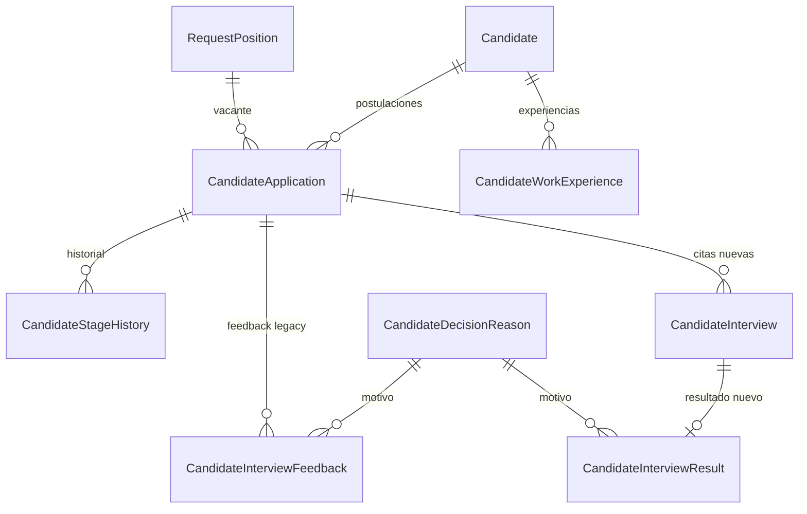

# Estructura de Tablas Actual - Candidates

Fecha: 2026-08-11
Fuente analizada:
- `D:\repos\luxuryapp-api\api\LuxuryApp.Infrastructure.Data\Data\Entities\Tenant\Recruitment\ReclutamientoyAltasBajas\*.cs`
- `D:\repos\luxuryapp-api\api\LuxuryApp.Infrastructure.Data\Data\ApplicationDbContext.cs`

## Objetivo

Documentar la estructura real actual del dominio `Candidates` para identificar:
- que datos si pertenecen a cada tabla;
- que datos estan duplicados;
- que datos hoy viven en una tabla incorrecta;
- que relaciones ya existen y cuales estan a medio migrar.

## Hallazgos ejecutivos

1. `RequestPosition` mezcla datos de vacante con datos de resultado del proceso (`SelectionDate`, `EntryDate`, `Fuente`).
2. `CandidateApplication` sigue cargando datos legacy de entrevista (`RecruitmentInterviewAt`, `OperationsInterviewAt`, `OperationsInterviewAssignedToUserId`) aunque ya existe `CandidateInterview`.
3. `CandidateApplication` sigue guardando `CvFileName`, lo cual duplica la responsabilidad de `Candidate.CvFileName`.
4. Existen dos modelos de resultado de entrevista al mismo tiempo:
   - `CandidateInterviewFeedback`
   - `CandidateInterviewResult`
5. La fuente de verdad de entrevistas nuevas parece ser `CandidateInterview`, pero el modelo legacy todavia sigue vivo en la postulación y en feedback.

## Relacion actual simplificada

## Nota sobre auditoria

Todas las tablas auditables repiten estos campos:
- `CreatedAt (creado el)`
- `CreatedBy (creado por)`
- `UpdatedAt (modificado el)`
- `UpdatedBy (modificado por)`

Para no ensuciar las tablas descriptivas, en este documento se listan primero los campos funcionales y se asume que los campos de auditoria existen cuando la entidad implementa `IAuditable`.

---

## 1. RequestPosition

Archivo:
- `D:\repos\luxuryapp-api\api\LuxuryApp.Infrastructure.Data\Data\Entities\Tenant\Recruitment\ReclutamientoyAltasBajas\RequestPosition.cs`

Tabla:
- `JobVacancyRequests`

### Proposito actual

Representa la solicitud de cobertura de una vacante.

### Campos actuales

| Propiedad | Espanol | Tipo | Comentario |
|---|---|---:|---|
| `Id` | identificador | `Guid` | PK |
| `WorkPositionId` | puesto de trabajo | `Guid` | FK a puesto |
| `ApplicationUserId` | usuario solicitante | `string` | quien solicita la vacante |
| `Folio` | folio | `int` | consecutivo visible |
| `Observations` | observaciones | `string` | notas generales |
| `RequestDate` | fecha de solicitud | `DateOnly` | dato propio de la vacante |
| `SelectionDate` | fecha de seleccion | `DateOnly?` | hoy mezclado con proceso del candidato |
| `EntryDate` | fecha de ingreso | `DateOnly?` | hoy mezclado con contratacion/alta |
| `Status` | estatus | `Status` | estado de la vacante |
| `ConfirmationFinish` | confirmacion de termino | `bool` | bandera operativa |
| `Fuente` | fuente de reclutamiento | `FuenteReclutamiento?` | hoy mezclada en vacante |

### Diagnostico

`RequestDate`, `Status`, `Observations`, `WorkPositionId`, `ApplicationUserId`, `Folio` si encajan bien en vacante.

En cambio:
- `SelectionDate` no pertenece a la vacante como objeto; pertenece al momento en que un candidato es seleccionado para esa vacante.
- `EntryDate` tampoco pertenece a la vacante abierta; pertenece al alta real del candidato seleccionado.
- `Fuente` es ambigua:
  - si significa "canal por el que llego una persona", es de candidato o de postulacion;
  - si significa "canal por el que se cubrira esta vacante", es una necesidad de negocio distinta y hoy no esta claramente definida.

---

## 2. Candidate

Archivo:
- `D:\repos\luxuryapp-api\api\LuxuryApp.Infrastructure.Data\Data\Entities\Tenant\Recruitment\ReclutamientoyAltasBajas\Candidate.cs`

Tabla:
- `RecruitmentCandidates`

### Proposito actual

Ficha maestra reutilizable de una persona candidata.

### Campos actuales

| Propiedad | Espanol | Tipo | Comentario |
|---|---|---:|---|
| `Id` | identificador | `Guid` | PK |
| `FirstName` | nombre(s) | `string` | dato maestro |
| `LastName` | apellidos | `string` | dato maestro |
| `PhoneNumber` | telefono | `string` | dato maestro |
| `Email` | correo | `string` | dato maestro |
| `Age` | edad | `int?` | dato maestro |
| `CurrentAddress` | direccion actual | `string` | dato maestro |
| `Availability` | disponibilidad | `string` | dato maestro |
| `SalaryExpectation` | expectativa salarial | `decimal?` | dato maestro |
| `ExperienceSummary` | resumen de experiencia | `string` | resumen libre |
| `RecruitmentSource` | fuente de reclutamiento | `FuenteReclutamiento?` | hoy vive aqui |
| `GeneralComments` | comentarios generales | `string` | dato maestro |
| `CvFileName` | nombre archivo CV | `string` | dato maestro del candidato |
| `Status` | estado ficha | `CandidateStatus` | activo / archivado |
| `IsInTalentPool` | en banco de talento | `bool` | bandera maestra |
| `TalentPoolNotes` | notas banco talento | `string` | notas de bolsa interna |

### Relaciones actuales

| Relacion | Tipo |
|---|---|
| `Applications` | 1 candidato -> N postulaciones |
| `WorkExperiences` | 1 candidato -> N experiencias |

### Diagnostico

Esta tabla si se siente como ficha maestra. Los campos mas sanos del dominio hoy viven aqui.

Puntos a revisar:
- `RecruitmentSource` solo tiene sentido si negocio quiere guardar "de donde llego la persona" a nivel maestro.
- `ExperienceSummary` ya empieza a quedar redundante contra `CandidateWorkExperience`; puede quedar como resumen libre o eliminarse a futuro.

---

## 3. CandidateWorkExperience

Archivo:
- `D:\repos\luxuryapp-api\api\LuxuryApp.Infrastructure.Data\Data\Entities\Tenant\Recruitment\ReclutamientoyAltasBajas\CandidateWorkExperience.cs`

Tabla:
- `RecruitmentCandidateWorkExperiences`

### Proposito actual

Historial laboral estructurado del candidato.

### Campos actuales

| Propiedad | Espanol | Tipo | Comentario |
|---|---|---:|---|
| `Id` | identificador | `Guid` | PK |
| `CandidateId` | candidato | `Guid` | FK a candidato |
| `CompanyName` | empresa | `string` | laboral |
| `JobPosition` | puesto | `string` | laboral |
| `StartDate` | fecha inicio | `DateOnly` | laboral |
| `EndDate` | fecha termino | `DateOnly?` | laboral |
| `MonthlyNetSalary` | salario neto mensual | `decimal?` | laboral |
| `DepartureReason` | motivo salida | `string` | laboral |

### Diagnostico

Esta tabla esta bien ubicada. Es una extension correcta de `Candidate`.

---

## 4. CandidateApplication

Archivo:
- `D:\repos\luxuryapp-api\api\LuxuryApp.Infrastructure.Data\Data\Entities\Tenant\Recruitment\ReclutamientoyAltasBajas\CandidateApplication.cs`

Tabla:
- `RecruitmentCandidateApplications`

### Proposito actual

Representa la postulacion de un candidato a una vacante concreta.

### Campos actuales

| Propiedad | Espanol | Tipo | Comentario |
|---|---|---:|---|
| `Id` | identificador | `Guid` | PK |
| `CandidateId` | candidato | `Guid` | FK |
| `RequestPositionId` | vacante | `Guid` | FK |
| `CvFileName` | nombre archivo CV | `string` | duplicado respecto a `Candidate` |
| `CurrentStage` | etapa actual | `CandidateApplicationStage` | pipeline |
| `ApplicationDate` | fecha de postulacion | `DateOnly` | dato del vinculo candidato-vacante |
| `LivesNearWorkplace` | le queda cerca la vacante | `bool?` | dato contextual, bien ubicado |
| `RecruitmentInterviewAt` | fecha entrevista reclutamiento | `DateTime?` | legacy, hoy duplicado contra `CandidateInterview` |
| `OperationsInterviewAt` | fecha entrevista operaciones | `DateTime?` | legacy, hoy duplicado contra `CandidateInterview` |
| `OperationsInterviewAssignedToUserId` | entrevistador operaciones | `string` | legacy, hoy duplicado contra `CandidateInterview` |
| `LastDecision` | ultima decision | `CandidateDecision?` | snapshot |
| `LastDecisionReasonId` | motivo ultima decision | `Guid?` | snapshot |
| `LastDecisionComment` | comentario ultima decision | `string` | snapshot |
| `SelectedForHiring` | seleccionado para alta | `bool` | bandera de cierre |
| `HiringRequestedAt` | alta solicitada el | `DateTime?` | dato de transicion a alta |
| `ClosedAt` | cerrada el | `DateTime?` | cierre de postulacion |

### Relaciones actuales

| Relacion | Tipo |
|---|---|
| `Candidate` | N postulaciones -> 1 candidato |
| `RequestPosition` | N postulaciones -> 1 vacante |
| `LastDecisionReason` | N snapshots -> 1 motivo |
| `InterviewFeedbacks` | 1 postulacion -> N feedbacks legacy |
| `StageHistory` | 1 postulacion -> N cambios etapa |

### Diagnostico

Esta tabla es la mas cargada y la que hoy mezcla mas responsabilidades:

Responsabilidades correctas:
- vinculo candidato-vacante;
- `ApplicationDate`;
- `CurrentStage`;
- `LivesNearWorkplace`;
- `ClosedAt`.

Responsabilidades duplicadas o dudosas:
- `CvFileName`: ya no deberia vivir aqui si el CV es del candidato maestro.
- `RecruitmentInterviewAt`, `OperationsInterviewAt`, `OperationsInterviewAssignedToUserId`: estas tres ya fueron absorbidas por `CandidateInterview`.
- `LastDecision*`: funcionan como snapshot, pero duplican parcialmente lo que ya existe en `CandidateInterviewResult`.
- `SelectedForHiring` y `HiringRequestedAt`: son mas cercanas a cierre/alta que a postulacion base.

---

## 5. CandidateInterview

Archivo:
- `D:\repos\luxuryapp-api\api\LuxuryApp.Infrastructure.Data\Data\Entities\Tenant\Recruitment\ReclutamientoyAltasBajas\CandidateInterview.cs`

Tabla:
- `RecruitmentCandidateInterviews`

### Proposito actual

Nueva fuente de verdad para agendar, reagendar, confirmar y cerrar entrevistas.

### Campos actuales

| Propiedad | Espanol | Tipo | Comentario |
|---|---|---:|---|
| `Id` | identificador | `Guid` | PK |
| `CandidateApplicationId` | postulacion | `Guid` | FK |
| `InterviewType` | tipo entrevista | `CandidateInterviewType` | reclutamiento / operaciones |
| `InterviewerUserId` | entrevistador | `string` | usuario asignado |
| `InterviewerRole` | rol entrevistador | `ApplicationRoleEnum` | rol del entrevistador |
| `ScheduledAt` | fecha programada | `DateTime` | cita |
| `Status` | estado de vida | `CandidateInterviewStatus` | pendiente, confirmada, realizada, cancelada, no asistio |
| `ScheduleStatus` | estado agenda | `CandidateInterviewScheduleStatus` | pendiente, propuesta, confirmada, cancelada |
| `ProposedRescheduleAt` | fecha propuesta reagenda | `DateTime?` | reagenda |
| `RescheduleComment` | comentario reagenda | `string` | reagenda |
| `ConfirmedAt` | confirmada el | `DateTime?` | confirmacion de cita |
| `ClosedAt` | cerrada el | `DateTime?` | cierre de cita |
| `Notes` | notas | `string` | comentario general |

### Diagnostico

Esta tabla es correcta como centro del agendamiento.

Pero hay un punto de semantica importante:
- `CandidateInterviewStatus.Confirmada` significa "la cita fue confirmada", no "el candidato fue seleccionado".

Por eso, si negocio quiere una "fecha de seleccion", no deberia mapearse automaticamente a `ConfirmedAt` salvo que redefinan el significado del enum. Hoy, tecnicamente, `ConfirmedAt` es fecha de confirmacion de la cita, no fecha de seleccion del candidato.

---

## 6. CandidateInterviewResult

Archivo:
- `D:\repos\luxuryapp-api\api\LuxuryApp.Infrastructure.Data\Data\Entities\Tenant\Recruitment\ReclutamientoyAltasBajas\CandidateInterviewResult.cs`

Tabla:
- `RecruitmentCandidateInterviewResults`

### Proposito actual

Nueva fuente de verdad del resultado evaluativo de una entrevista.

### Campos actuales

| Propiedad | Espanol | Tipo | Comentario |
|---|---|---:|---|
| `Id` | identificador | `Guid` | PK |
| `InterviewId` | entrevista | `Guid` | FK unico 1:1 |
| `Decision` | decision | `CandidateDecision` | aprobado, rechazado, en espera, no se presento |
| `DecisionReasonId` | motivo | `Guid` | FK catalogo |
| `AdditionalComment` | comentario adicional | `string` | detalle |
| `EvaluatedAt` | evaluada el | `DateTime` | momento del resultado |
| `EvaluatedByUserId` | evaluada por | `string` | autor del resultado |

### Diagnostico

Esta tabla si encaja bien como resultado formal de una entrevista.

Es, en principio, mejor candidata para ser la fuente unica de decision que `CandidateInterviewFeedback`.

---

## 7. CandidateInterviewFeedback

Archivo:
- `D:\repos\luxuryapp-api\api\LuxuryApp.Infrastructure.Data\Data\Entities\Tenant\Recruitment\ReclutamientoyAltasBajas\CandidateInterviewFeedback.cs`

Tabla:
- `RecruitmentCandidateInterviewFeedback`

### Proposito actual

Modelo legacy de retroalimentacion del entrevistador sobre una postulacion.

### Campos actuales

| Propiedad | Espanol | Tipo | Comentario |
|---|---|---:|---|
| `Id` | identificador | `Guid` | PK |
| `CandidateApplicationId` | postulacion | `Guid` | FK |
| `InterviewerUserId` | entrevistador | `string` | usuario |
| `InterviewerRole` | rol entrevistador | `ApplicationRoleEnum` | rol |
| `ReceptionConfirmedAt` | recepcion confirmada el | `DateTime?` | confirmacion de recepcion |
| `InterviewAt` | fecha entrevista | `DateTime?` | fecha ejecutada |
| `Decision` | decision | `CandidateDecision` | decision |
| `DecisionReasonId` | motivo | `Guid` | FK catalogo |
| `AdditionalComment` | comentario adicional | `string` | detalle |
| `SentAt` | enviado el | `DateTime` | momento de envio |

### Diagnostico

Esta tabla esta conceptualmente duplicada por `CandidateInterviewResult`.

Diferencias clave:
- `CandidateInterviewFeedback` cuelga de `CandidateApplication`.
- `CandidateInterviewResult` cuelga de `CandidateInterview`.

Si ya existe agenda formal de entrevistas, el resultado correcto deberia colgar de la entrevista, no directamente de la postulacion.

---

## 8. CandidateStageHistory

Archivo:
- `D:\repos\luxuryapp-api\api\LuxuryApp.Infrastructure.Data\Data\Entities\Tenant\Recruitment\ReclutamientoyAltasBajas\CandidateStageHistory.cs`

Tabla:
- `RecruitmentCandidateStageHistory`

### Proposito actual

Bitacora de cambios de etapa de la postulacion.

### Campos actuales

| Propiedad | Espanol | Tipo | Comentario |
|---|---|---:|---|
| `Id` | identificador | `Guid` | PK |
| `CandidateApplicationId` | postulacion | `Guid` | FK |
| `FromStage` | etapa origen | `CandidateApplicationStage?` | origen |
| `ToStage` | etapa destino | `CandidateApplicationStage` | destino |
| `Comment` | comentario | `string` | detalle |
| `ChangedByUserId` | cambiado por | `string` | autor |
| `ChangedAt` | cambiado el | `DateTime` | momento |

### Diagnostico

Esta tabla es valiosa y bien ubicada.

Ademas abre una posibilidad importante:
- la "fecha de seleccion" puede derivarse del primer `ChangedAt` donde `ToStage = Seleccionado`, en vez de persistirla en otra tabla.

---

## 9. CandidateDecisionReason

Archivo:
- `D:\repos\luxuryapp-api\api\LuxuryApp.Infrastructure.Data\Data\Entities\Tenant\Recruitment\ReclutamientoyAltasBajas\CandidateDecisionReason.cs`

Tabla:
- `RecruitmentCandidateDecisionReasons`

### Proposito actual

Catalogo administrable de motivos de decision.

### Campos actuales

| Propiedad | Espanol | Tipo | Comentario |
|---|---|---:|---|
| `Id` | identificador | `Guid` | PK |
| `Code` | codigo | `string` | clave interna |
| `Name` | nombre | `string` | etiqueta visible |
| `AppliesToDecision` | aplica a decision | `CandidateDecision` | control del catalogo |
| `IsActive` | activo | `bool` | vigencia |
| `DisplayOrder` | orden visual | `int` | orden |

### Diagnostico

Es una tabla sana. Debe sobrevivir tanto si se queda feedback legacy como si se migra totalmente a interview result.

---

## 10. InterviewerMatrix

Archivo:
- `D:\repos\luxuryapp-api\api\LuxuryApp.Infrastructure.Data\Data\Entities\Tenant\Recruitment\ReclutamientoyAltasBajas\InterviewerMatrix.cs`

Tabla:
- `RecruitmentInterviewerMatrix`

### Proposito actual

Matriz de asignacion de entrevistadores por cliente y rol de puesto.

### Campos actuales

| Propiedad | Espanol | Tipo | Comentario |
|---|---|---:|---|
| `Id` | identificador | `Guid` | PK |
| `CustomerId` | cliente | `Guid` | a que customer aplica |
| `WorkPositionRole` | rol del puesto | `ApplicationRoleEnum` | rol del puesto a entrevistar |
| `InterviewerRole` | rol del entrevistador | `ApplicationRoleEnum` | rol que debe entrevistar |
| `IsActive` | activa | `bool` | vigencia |

### Diagnostico

La idea es correcta, aunque su granularidad hoy es por:
- cliente;
- rol de puesto;
- rol de entrevistador.

No llega al nivel de usuario especifico; solo define la regla de asignacion por rol.

---

## Resumen de duplicidades actuales

| Concepto | Tabla 1 | Tabla 2 | Problema |
|---|---|---|---|
| CV del candidato | `Candidate.CvFileName` | `CandidateApplication.CvFileName` | duplicidad |
| Fecha de entrevista | `CandidateApplication.RecruitmentInterviewAt` / `OperationsInterviewAt` | `CandidateInterview.ScheduledAt` | duplicidad |
| Entrevistador operaciones | `CandidateApplication.OperationsInterviewAssignedToUserId` | `CandidateInterview.InterviewerUserId` | duplicidad |
| Resultado de entrevista | `CandidateInterviewFeedback` | `CandidateInterviewResult` | doble modelo |
| Fecha de seleccion | `RequestPosition.SelectionDate` | puede derivarse de `StageHistory` o `InterviewResult` | persistencia dudosa |
| Fecha de ingreso | `RequestPosition.EntryDate` | deberia vivir cerca de alta/contratacion | ubicacion dudosa |

## Resumen de problemas estructurales

1. La vacante (`RequestPosition`) no esta limpia; carga datos del resultado humano del proceso.
2. La postulacion (`CandidateApplication`) no esta limpia; carga restos de entrevista y restos de cierre.
3. El modulo ya empezo una migracion sana hacia `CandidateInterview` + `CandidateInterviewResult`, pero todavia no se completa el retiro de estructuras legacy.
4. La mejor tabla maestra del dominio hoy es `Candidate`.

