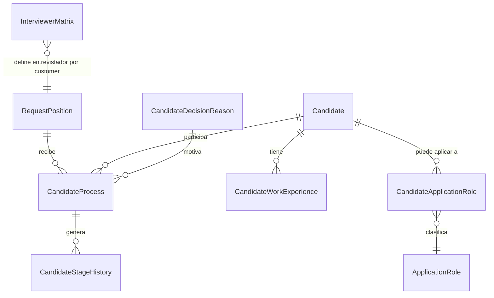

# Estructura de Tablas Propuesta - Candidates

Fecha: 2026-08-11
Base del analisis:
- estado real actual del dominio;
- requerimientos expresados en la conversacion;
- decision de simplificar el modelo operativo;
- decision de fusionar `CandidateApplication` con `CandidateInterview`.

## Objetivo

Definir una estructura objetivo mas simple para el modulo `Candidates`, evitando tablas duplicadas para el mismo flujo operativo.

La idea central de esta version es:
- la vacante sigue existiendo como demanda;
- el candidato sigue existiendo como ficha maestra;
- la experiencia laboral sigue existiendo como historial del candidato;
- la relacion candidato-vacante y la cita enviada al edificio se resuelven en una sola entidad operativa;
- el historial de etapas sigue existiendo;
- la matriz de entrevistadores sigue existiendo.

---

## Decision central de esta propuesta

En esta version se fusionan:
- `CandidateApplication`
- `CandidateInterview`

en una sola entidad operativa.

La justificacion, segun tu criterio actual de negocio, es valida:
- hoy la entrevista de Reclutamiento no se registra en la app;
- lo que realmente se registra en sistema es el envio del candidato a entrevista para edificios;
- por tanto no hay suficiente valor en separar "postulacion" y "entrevista" como dos tablas distintas si el evento operativo real es uno solo.

---

## Principios rectores

1. El CV vive solo en `Candidate`.
2. `RequestPosition` conserva solo datos de vacante.
3. La fecha de conclusion de vacante se guarda solo como `DateFinish`.
4. No se guarda `RecruitmentSource`.
5. No se duplican entrevista, postulacion y decision en tres tablas distintas.
6. La nueva entidad fusionada representa el proceso real de "candidato enviado para esa vacante".
7. El historial sigue viviendo en `CandidateStageHistory`.

---

## Modelo objetivo simplificado

---

## 1. RequestPosition (vacante)

### Debe representar

La necesidad de cubrir un puesto.

### Debe conservar

| Propiedad | Espanol | Motivo |
|---|---|---|
| `Id` | identificador | PK |
| `WorkPositionId` | puesto de trabajo | la vacante se abre para un puesto |
| `ApplicationUserId` | solicitante | quien pide la cobertura |
| `Folio` | folio | identificacion operativa |
| `Observations` | observaciones | notas de vacante |
| `RequestDate` | fecha de solicitud | apertura funcional |
| `Status` | estatus | estado de la vacante |
| `DateFinish` | fecha de conclusion | cuando la vacante quedo concluida |

### Debe salir de aqui

| Propiedad actual | Destino propuesto | Motivo |
|---|---|---|
| `SelectionDate` | dato derivado del proceso del candidato | no es dato propio de vacante |
| `EntryDate` | alta o contratacion | no es dato propio de vacante |
| `ConfirmationFinish` | eliminar | queda resuelto por `DateFinish` |
| `Fuente` | eliminar | no se requiere en este momento |

### Reglas operativas

| Regla | Comportamiento |
|---|---|
| vacante concluida | `DateFinish` se llena automaticamente |
| vacante reabierta | `DateFinish` se limpia o se recalcula segun regla aprobada |

---

## 2. Candidate (ficha maestra del candidato)

### Debe representar

A la persona candidata, independientemente de una vacante especifica.

### Debe conservar

| Propiedad | Espanol | Motivo |
|---|---|---|
| `FirstName` | nombre(s) | maestro |
| `LastName` | apellidos | maestro |
| `PhoneNumber` | telefono | maestro |
| `Email` | correo | maestro |
| `Age` | edad | maestro |
| `CurrentAddress` | direccion actual | maestro |
| `Availability` | disponibilidad | maestro |
| `SalaryExpectation` | expectativa salarial | maestro |
| `ExperienceSummary` | resumen de experiencia | opcional |
| `GeneralComments` | comentarios generales | maestro |
| `CvFileName` | archivo CV | unica fuente de verdad del CV |
| `Status` | estado ficha | maestro |
| `IsInTalentPool` | banco de talento | bandera maestra |
| `TalentPoolNotes` | notas banco talento | seguimiento |

### Debe salir de aqui

| Propiedad | Motivo |
|---|---|
| `RecruitmentSource` | hoy no se necesita en el flujo y solo mete ruido |

---

## 3. CandidateApplicationRole (tabla puente candidato-perfil)

### Debe representar

Los puestos o perfiles para los que un candidato es apto.

### Razon

Aqui coincido contigo en el fondo, pero no como relacion 1:1.

Debe ser N:M porque:
- un candidato puede servir para varios puestos;
- `ApplicationRole` en el sistema se interpreta como perfil o puesto operativo;
- esto fortalece el banco de talento.

### Campos sugeridos

| Propiedad | Espanol | Motivo |
|---|---|---|
| `Id` | identificador | PK |
| `CandidateId` | candidato | FK |
| `ApplicationRoleId` | puesto o perfil | FK |
| `IsPrimary` | perfil principal | opcional |
| `Comments` | comentarios | opcional |

---

## 4. CandidateWorkExperience (experiencia laboral)

### Estado propuesto

Se queda como extension de `Candidate`.

### Razon

Es informacion propia de la persona y no depende de una vacante puntual.

---

## 5. CandidateProcess (fusion de CandidateApplication + CandidateInterview)

### Debe representar

La relacion operativa completa entre:
- un candidato;
- una vacante;
- y la entrevista enviada al edificio.

Esta entidad sustituye:
- `CandidateApplication`
- `CandidateInterview`

### Por que aqui si tiene sentido fusionar

Porque bajo el flujo que hoy describiste:
- no se registra entrevista de reclutamiento dentro de la app;
- el punto operativo real es cuando un candidato queda ligado a una vacante y se agenda o envia su entrevista para edificio;
- entonces separar postulacion y entrevista deja de aportar valor real y solo duplica datos.

### Debe conservar

| Propiedad | Espanol | Motivo |
|---|---|---|
| `Id` | identificador | PK |
| `CandidateId` | candidato | FK |
| `RequestPositionId` | vacante | FK |
| `CurrentStage` | etapa actual | pipeline |
| `RegisterDate` | fecha de registro | alta del proceso candidato-vacante |
| `ScheduledAt` | fecha y hora de entrevista | agenda con edificio |
| `InterviewerUserId` | entrevistador asignado | usuario responsable |
| `Status` | estado operativo | control del proceso |
| `RescheduledAt` | fecha de reagenda | si aplica |
| `RescheduleComment` | comentario de reagenda | si aplica |
| `ConfirmedAt` | confirmada el | confirmacion de la cita |
| `ClosedAt` | cerrada el | cierre del proceso |
| `Decision` | decision final | aprobado, rechazado, etc. |
| `DecisionReasonId` | motivo decision | catalogo |
| `DecisionComment` | comentario de decision | detalle |
| `DecisionSentAt` | decision enviada el | fecha formal del resultado |
| `DecisionByUserId` | decision enviada por | trazabilidad |
| `InitialNotes` | notas iniciales de reclutamiento | contexto de envio |

### Debe salir de esta entidad

| Propiedad | Motivo |
|---|---|
| `CvFileName` | el CV vive solo en `Candidate` |
| `InterviewType` | hoy no aplica si solo se registra entrevista a edificio |
| `InterviewerRole` | se puede resolver desde `InterviewerUserId` y la matriz |
| `LivesNearWorkplace` | no conviene como columna fija aqui; es evaluacion contextual |
| `RecruitmentInterviewAt` | queda absorbido por `ScheduledAt` |
| `OperationsInterviewAt` | queda absorbido por `ScheduledAt` |
| `OperationsInterviewAssignedToUserId` | queda absorbido por `InterviewerUserId` |
| `SelectedForHiring` | se deriva por decision o etapa |
| `HiringRequestedAt` | mover a alta o contratacion |

### Nota importante

Como quitamos `InterviewType`, esta entidad asume que la entrevista registrada en sistema es la del edificio o la entrevista operativa final.

Si despues negocio quiere volver a registrar tambien entrevista interna de Reclutamiento, entonces esta fusion ya no seria suficiente y habria que separar de nuevo.

Esa es la principal condicion de esta propuesta.

---

## 6. CandidateStageHistory (historial de etapas)

### Estado propuesto

Se queda.

### Debe colgar de

La nueva entidad fusionada `CandidateProcess`.

### Razon

Es la bitacora funcional que permite saber:
- cuando se envio;
- cuando se reagendo;
- cuando fue confirmado;
- cuando fue rechazado;
- cuando fue seleccionado;
- cuando paso a alta.

### Uso recomendado

Fechas derivadas desde aqui:
- fecha de seleccion;
- fecha de rechazo;
- fecha de alta en proceso.

---

## 7. CandidateDecisionReason (catalogo de motivos)

### Estado propuesto

Se queda.

### Razon

Todavia aporta valor si quieren:
- motivos estandarizados;
- reportes por causa;
- menos texto libre basura.

---

## 8. InterviewerMatrix

### Estado propuesto

Se queda.

### Razon

Resuelve una necesidad real:
- por customer;
- por puesto o perfil;
- que usuario puede entrevistar.

### Ajuste importante

La matriz debe resolver al usuario entrevistador.

No hace falta persistir `InterviewerRole` dentro del proceso si el rol se puede obtener desde el usuario.

### Ajuste de estructura acordado

`InterviewerMatrix` queda tambien fuera de:
- `IAuditable`
- `IsActive`

La lectura funcional de este ajuste es:
- la matriz queda como regla simple de configuracion;
- sin sobrecargarla con auditoria comun si negocio no la necesita;
- y sin bandera `IsActive` si la vigencia se controla de otra forma o la regla se elimina directamente.

---

## 9. Alta o contratacion

### Problema

`EntryDate` sigue siendo un dato real, pero no pertenece ni a vacante ni al candidato maestro ni al proceso de entrevista.

### Recomendacion

Debe vivir en una pieza separada de alta o contratacion.

No debe volver a colocarse en:
- `RequestPosition`
- `Candidate`
- ni en la entidad fusionada

---

## Matriz campo -> ubicacion correcta

| Campo | Ubicacion actual | Ubicacion propuesta | Accion |
|---|---|---|---|
| `ConfirmationFinish` | `RequestPosition` | eliminar | sustituir por `DateFinish` |
| `DateFinish` | no claro o nuevo | `RequestPosition` | dejar solo este |
| `SelectionDate` | `RequestPosition` | derivado del historial o decision | retirar |
| `EntryDate` | `RequestPosition` | alta/contratacion | mover |
| `Fuente` | `RequestPosition` | eliminar | retirar |
| `RecruitmentSource` | `Candidate` | eliminar | retirar |
| `CvFileName` | `Candidate` y `CandidateApplication` | solo `Candidate` | eliminar duplicado |
| `InterviewType` | `CandidateInterview` | eliminar | no aplica hoy |
| `InterviewerRole` | `CandidateInterview` | eliminar | se deduce por usuario |
| `InterviewerUserId` | `CandidateInterview` | `CandidateProcess` | conservar |
| `ScheduledAt` | `CandidateInterview` | `CandidateProcess` | conservar |
| `Decision` | duplicado entre varias piezas | `CandidateProcess` | converger |
| `DecisionReasonId` | duplicado entre varias piezas | `CandidateProcess` | converger |
| `DecisionSentAt` | `CandidateInterviewResult` | `CandidateProcess` | converger |

---

## Tablas nucleo sano con esta propuesta

1. `RequestPosition`
2. `Candidate`
3. `CandidateApplicationRole`
4. `CandidateWorkExperience`
5. `CandidateProcess`  (fusion de `CandidateApplication` + `CandidateInterview`)
6. `CandidateStageHistory`
7. `CandidateDecisionReason`
8. `InterviewerMatrix`

---

## Tablas o piezas que salen del modelo operativo

1. `CandidateApplication`
2. `CandidateInterview`
3. `CandidateInterviewFeedback`
4. `CandidateInterviewResult` como tabla separada
5. `RequestPosition.ConfirmationFinish`
6. `RequestPosition.SelectionDate`
7. `RequestPosition.EntryDate`
8. `RequestPosition.Fuente`
9. `Candidate.RecruitmentSource`

---

## Mi opinion final sobre esta fusion

Con los criterios que acabas de fijar, la fusion ya si tiene coherencia.

Antes yo la debatiria mas porque el modelo venia pensado para varias entrevistas y varios momentos del proceso.

Pero bajo tu aclaracion actual:
- la entrevista de Reclutamiento no vive en app;
- lo que la app registra es el envio del candidato a entrevista para edificio;

entonces si se puede simplificar el modelo a una sola entidad operativa sin perder claridad.

La condicion de validez de esta propuesta es muy importante:

si en el futuro quieren volver a registrar:
- entrevista interna de Reclutamiento;
- prefiltro formal;
- varias entrevistas distintas por la misma vacante;

entonces habra que volver a separar proceso y entrevista.
