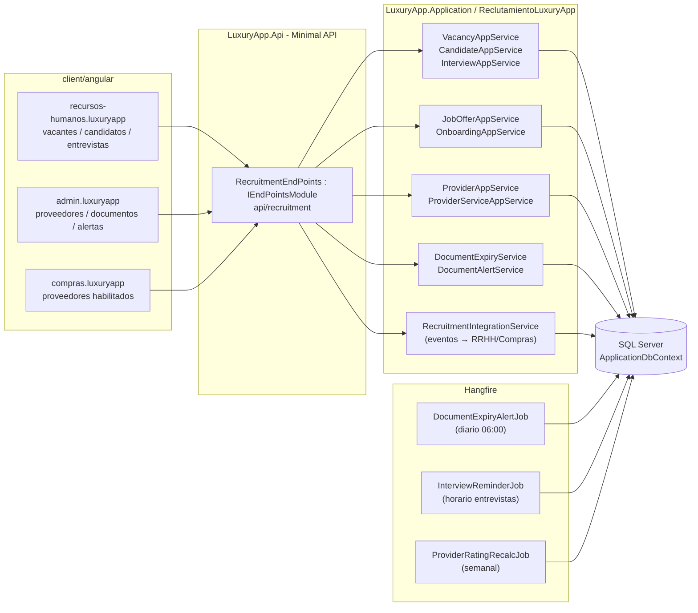
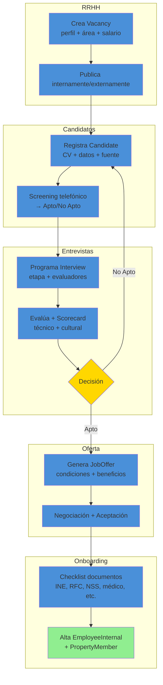
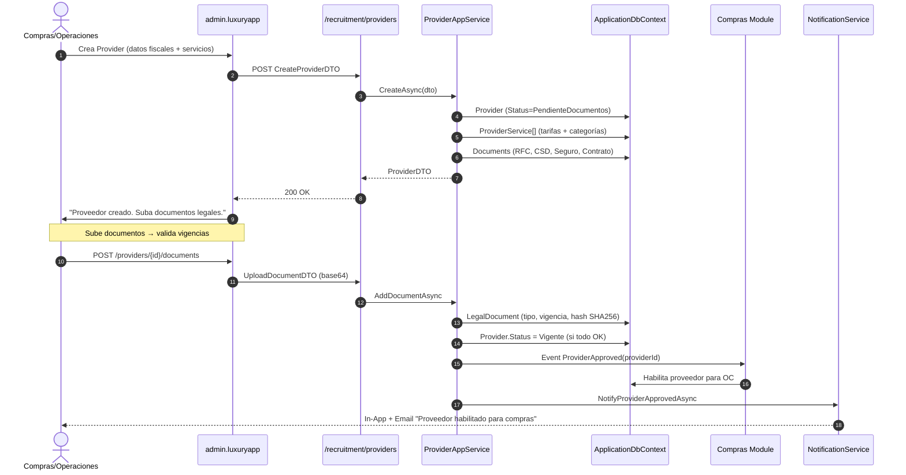
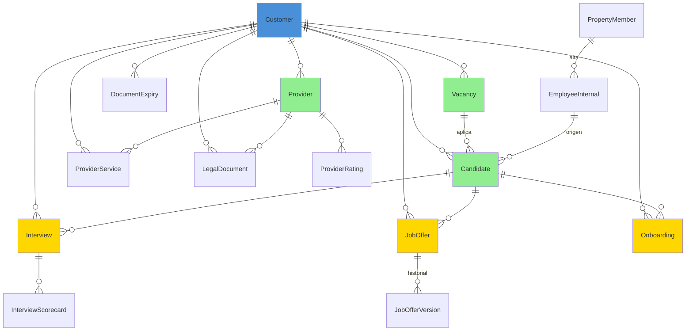

# Reclutamiento (Personal y Proveedores) — Documentación Técnica

> **Ruta**: 📂 Documentación > 💼 Capital Humano > 🤝 Reclutamiento
> **📅 Última Revisión**: 13-jul-26
> **🛡️ Estado**: ✅ Vigente
> **👤 Responsable**: @equipo-reclutamiento

---

## 📑 Tabla de Contenidos

1. [Resumen Ejecutivo](#-resumen-ejecutivo)
2. [Visión Funcional](#-visión-funcional)
3. [Arquitectura Técnica](#-arquitectura-técnica)
4. [API Endpoints](#-api-endpoints)
5. [Flujo del Sistema](#-flujo-del-sistema)
6. [Componentes Frontend](#-componentes-frontend)
7. [Reglas de Negocio](#-reglas-de-negocio)
8. [Matriz de Permisos](#-matriz-de-permisos)
9. [Catálogo de Roles del Sistema](#-catálogo-de-roles-del-sistema)
10. [Base de Datos](#-base-de-datos)
11. [Performance](#-performance)
12. [Glosario de Términos](#-glosario-de-términos)
13. [Checklist de Validación](#-checklist-de-validación)
14. [Historial de Cambios](#-historial-de-cambios)

---

## 🎯 Resumen Ejecutivo

**Propósito**: Módulo de gestión integral de reclutamiento y contratación de personal interno, así como administración de proveedores de servicios externos, con control documental, vigencias y flujos de aprobación.

**Actores Involucrados** (`ApplicationRoleEnum`): `Administrador`, `GerenteOperaciones`, `GerenteAtencion`, `Asistente`, `RecursosHumanos`, `Reclutamiento`, `SuperUsuario`, `Proveedor`, `Jardineria`, `Limpieza`, `Seguridad`.

**Dependencias**: `Customer` (tenant), `Property` (unidad/área asignación), `ApplicationUser` (identidad), `Charge` (costos reclutamiento/capacitación), `FileStorage` (documentos), Hangfire (alertas vencimiento), OneSignal (notificaciones).

**Alcance**:

- ✅ Incluye: Personal interno (CRUD + expediente + documentos + vigencias), Proveedores de servicios (CRUD + servicios + rating + documentos legales), Flujos de aprobación (entrevista → oferta → contrato → alta), Alertas vencimiento documentación, Integración RRHH (alta empleado interno) y Compras (OC proveedores).
- ❌ No incluye: ATS avanzado (bolsa trabajo, matching IA), nómina (módulo RRHH), evaluación desempeño (módulo RRHH), firma digital contratos.

---

## 🔍 Visión Funcional

**HU-01 — Proceso de reclutamiento interno**

> Como **RRHH/Reclutamiento** quiero gestionar vacantes, candidatos, entrevistas y ofertas hasta la contratación.
> **Criterios**: `Vacancy` (perfil + área + salario + urgencia) → `Candidate` (CV + datos + fuente) → `Interview` (etapas + evaluadores + scorecard) → `JobOffer` (condiciones + aceptación) → `Onboarding` (documentos + alta `EmployeeInternal` + `PropertyMember`).

**HU-02 — Administración de proveedores de servicios**

> Como **Compras/Operaciones** quiero dar de alta proveedores con servicios, tarifas, documentos legales y rating para generar OC.
> **Criterios**: `Provider` + `ProviderService` (categoría + tarifa + unidad); documentos: RFC, CSD, seguro responsabilidad civil, contrato, acta constitutiva; vigencias con alertas 30/15/5 días; rating 1-5 por servicio completado.

**HU-03 — Control documental y vigencias**

> Como **compliance** quiero alertas automáticas de documentos por vencer (INE, RFC, seguro, contrato, capacitación, examen médico).
> **Criterios**: Job Hangfire diario → revisa `DocumentExpiry` (personal + proveedores) → notifica In-App + Email a responsable + `ReclutamientoRoles`; `Status` calculado: `Vigente` / `PorVencer` (≤30d) / `Vencido` / `NoRequerido`.

**HU-04 — Integración con módulos destino**

> Como **sistema** quiero que al aprobar contratación personal → cree `EmployeeInternal` + `PropertyMember` en RRHH; al aprobar proveedor → habilite en Compras para OC.
> **Criterios**: Evento `HiringApproved` → `EmployeeInternalAppService.CreateFromHiringAsync` + `PropertyMemberAppService.CreateAsync`; Evento `ProviderApproved` → `ProviderAppService.ActivateForPurchasingAsync`; todo en misma transacción o saga compensable.

---

## 🏗️ Arquitectura Técnica

| Capa        | Tecnología                                                                                     |
| ----------- | ---------------------------------------------------------------------------------------------- | -------------- |
| Backend     | .NET 10, Minimal APIs (`IEndpointModule`), EF Core 10                                          |
| Documentos  | `IFileWritePathService` + `IFileReadPathService` (carpeta `recruitment/{customerId}/{vacancyId | providerId}/`) |
| Alertas     | Hangfire (`RecurringJob`) + `NotificationService` (In-App, Email)                              |
| Integración | Eventos de dominio (`HiringApproved`, `ProviderApproved`) → handlers RRHH/Compras              |
| Respuestas  | `ApiResponseDTO<T>` (nunca `ProblemDetails`)                                                   |
| Mapeo       | Explícito `ToDTO()` (AutoMapper prohibido)                                                     |
| Frontend    | Angular 22 (standalone, signals, OnPush), Bootstrap 5, catálogo `@ui/*`                            |

---

## 📱 Mobile Responsive (§15 CONVENTIONS.md)

| Vista                                                               | Patrón (§15.2)         | Implementación                                                           |
| ------------------------------------------------------------------- | ---------------------- | ------------------------------------------------------------------------ |
| `VacancyList` / `VacancyForm` / `CandidateList` / `CandidateDetail` | **A — CSS Responsive** | PrimeFlex grid (`p-col-*`), `p-table` responsive, `p-dialog` formularios |
| `ProviderList` / `ProviderForm` / `ProviderDocuments`               | **A — CSS Responsive** | PrimeFlex, `p-table` scroll horizontal móvil, `p-fileUpload` responsive  |
| `DocumentAlerts` / `ExpiryDashboard`                                | **A — CSS Responsive** | Cards KPI adaptativas (`p-col-12 p-md-6 p-lg-3`), tabla responsive       |

**Reglas aplicadas:**

- Breakpoint único: 768px (`PlatformService.isMobile()`)
- Touch targets ≥ 44×44px en todos los botones/iconos
- Safe areas: `p-dialog` / `p-sidenav` manejan notch
- File upload: `p-fileUpload` web / `ion-input type="file"` + `Capacitor Filesystem` móvil
- Modales: `p-dialog` (web), `DynamicDialog` — **no** `ion-modal` (módulo admin/RRHH, no operativo móvil)

---

## 🌐 API Endpoints

Base por dominio (kebab-case, plural, minúsculas, prefijo `api/`):

| Dominio     | Base Path                    | Descripción                              |
| ----------- | ---------------------------- | ---------------------------------------- |
| Vacantes    | `api/recruitment/vacancies`  | CRUD + publicación + cierre              |
| Candidatos  | `api/recruitment/candidates` | CRUD + documentos + matching             |
| Entrevistas | `api/recruitment/interviews` | Programación + evaluación + scorecard    |
| Ofertas     | `api/recruitment/job-offers` | Generación + negociación + aceptación    |
| Onboarding  | `api/recruitment/onboarding` | Checklist documentos + alta empleado     |
| Proveedores | `api/recruitment/providers`  | CRUD + servicios + rating + documentos   |
| Alertas     | `api/recruitment/alerts`     | Configuración + historial notificaciones |
| Dashboard   | `api/recruitment/dashboard`  | KPIs + funnel + métricas tiempo          |

### Tabla General (muestra representativa)

| Método | Path                        | Roles                               | Request DTO                     | Response DTO                   | Códigos HTTP          |
| ------ | --------------------------- | ----------------------------------- | ------------------------------- | ------------------------------ | --------------------- |
| POST   | `/vacancies`                | RRHH, Reclutamiento                 | `CreateVacancyDTO`              | `VacancyDTO`                   | 200 · 400 · 403 · 409 |
| GET    | `/vacancies`                | RRHH, Reclutamiento, Admin          | `PaginationCommonDTO` + filtros | `PagedResultDTO<VacancyDTO>`   | 200 · 400             |
| POST   | `/candidates`               | RRHH, Reclutamiento                 | `CreateCandidateDTO`            | `CandidateDTO`                 | 200 · 400 · 409       |
| POST   | `/interviews`               | RRHH, Reclutamiento, Entrevistador  | `ScheduleInterviewDTO`          | `InterviewDTO`                 | 200 · 400 · 404 · 409 |
| POST   | `/job-offers`               | RRHH, Reclutamiento                 | `CreateJobOfferDTO`             | `JobOfferDTO`                  | 200 · 400 · 404       |
| PUT    | `/job-offers/{id}/accept`   | Candidato                           | `AcceptJobOfferDTO`             | `bool`                         | 200 · 400 · 404 · 409 |
| POST   | `/onboarding/{candidateId}` | RRHH, Reclutamiento                 | `OnboardingChecklistDTO`        | `OnboardingResultDTO`          | 200 · 400 · 404       |
| POST   | `/providers`                | Admin, Compras, Operaciones         | `CreateProviderDTO`             | `ProviderDTO`                  | 200 · 400 · 409       |
| GET    | `/providers`                | Admin, Compras, Operaciones         | `PaginationCommonDTO`           | `PagedResultDTO<ProviderDTO>`  | 200 · 400             |
| POST   | `/providers/{id}/services`  | Admin, Compras                      | `CreateProviderServiceDTO`      | `ProviderServiceDTO`           | 200 · 400 · 404       |
| GET    | `/alerts/expiring`          | RRHH, Reclutamiento, Compras, Legal | `days` (query, default 30)      | `List<DocumentExpiryAlertDTO>` | 200 · 400             |

> [!NOTE]
> El campo `responseCode` viaja **dentro** de `ApiResponseDTO`; el status HTTP siempre es `200 OK` para respuestas de negocio (incluidos errores 4xx de dominio). `500` solo para excepciones no controladas.

---

## 🔄 Flujo del Sistema

### Proceso de contratación (funnel completo)

### Alta proveedor + integración Compras

---

## 🖥️ Componentes Frontend

Workspace: **`client/angular`** (standalone, signals, OnPush, catálogo `@ui/*`, `ApiResponseService`, `Endpoints`).

### Routing

| App (§14)                    | Ruta                                | Componente                | Lazy loading | Guard       | Menú |
| ---------------------------- | ----------------------------------- | ------------------------- | :----------: | ----------- | :--: |
| `recursos-humanos.luxuryapp` | `rrhh/reclutamiento/vacantes`       | `VacancyList`             |      ✅      | `authGuard` |  ✅  |
| `recursos-humanos.luxuryapp` | `rrhh/reclutamiento/vacantes/nueva` | `VacancyForm`             |      ✅      | `authGuard` |  ❌  |
| `recursos-humanos.luxuryapp` | `rrhh/reclutamiento/candidatos`     | `CandidateList`           |      ✅      | `authGuard` |  ✅  |
| `recursos-humanos.luxuryapp` | `rrhh/reclutamiento/entrevistas`    | `InterviewList`           |      ✅      | `authGuard` |  ✅  |
| `recursos-humanos.luxuryapp` | `rrhh/reclutamiento/ofertas`        | `JobOfferList`            |      ✅      | `authGuard` |  ✅  |
| `recursos-humanos.luxuryapp` | `rrhh/reclutamiento/onboarding`     | `OnboardingList`          |      ✅      | `authGuard` |  ✅  |
| `admin.luxuryapp`            | `admin/proveedores`                 | `ProviderList`            |      ✅      | `authGuard` |  ✅  |
| `admin.luxuryapp`            | `admin/proveedores/nuevo`           | `ProviderForm`            |      ✅      | `authGuard` |  ❌  |
| `admin.luxuryapp`            | `admin/proveedores/:id/documentos`  | `ProviderDocuments`       |      ✅      | `authGuard` |  ❌  |
| `admin.luxuryapp`            | `admin/reclutamiento/alertas`       | `DocumentExpiryDashboard` |      ✅      | `authGuard` |  ✅  |
| `compras.luxuryapp`          | `compras/proveedores`               | `ProviderList`            |      ✅      | `authGuard` |  ✅  |

### Catálogo de Componentes (representativo)

| Componente                | Selector                        | Tipo | Signals clave                                             | Servicios                          | Comportamiento                                                                              |
| ------------------------- | ------------------------------- | ---- | --------------------------------------------------------- | ---------------------------------- | ------------------------------------------------------------------------------------------- |
| `VacancyList`             | `app-vacancy-list`              | web  | `dataSignal`, `filters`, `statsSignal`                    | `ApiResponseService`               | `p-table` virtual scroll, funnel visual (publicados/en proceso/cerrados), exportar          |
| `VacancyForm`             | `app-vacancy-form`              | web  | `submitting`, `form`, `stepsSignal`                       | `ApiResponseService`, `FormHelper` | `FormHelper.submitCrud()`, stepper: datos vacante → publicación → preguntas filtro          |
| `CandidateList`           | `app-candidate-list`            | web  | `dataSignal`, `kanbanSignal`                              | `ApiResponseService`               | Vista kanban (Nuevo → Screening → Entrevista → Oferta → Contratado), drag&drop etapas       |
| `InterviewSchedule`       | `app-interview-schedule`        | web  | `slotsSignal`, `interviewersSignal`                       | `ApiResponseService`               | Calendario Flatpickr + slots disponibles por entrevistador, conflictos visuales             |
| `JobOfferForm`            | `app-job-offer-form`            | web  | `submitting`, `form`, `versionSignal`                     | `ApiResponseService`, `FormHelper` | Versionado ofertas, comparación lado a lado, `FormHelper.submitCrud()`                      |
| `OnboardingChecklist`     | `app-onboarding-checklist`      | web  | `itemsSignal`, `progressSignal`                           | `ApiResponseService`               | Checklist dinámico (tipo documento: obligatorio/opcional), valida vigencias, `p-fileUpload` |
| `ProviderList`            | `app-provider-list`             | web  | `dataSignal`, `ratingSignal`                              | `ApiResponseService`               | `p-table` paginado, badges rating/estatus documentos, `il-button-*` editar/servicios/docs   |
| `ProviderForm`            | `app-provider-form`             | web  | `submitting`, `form`, `servicesSignal`, `documentsSignal` | `ApiResponseService`, `FormHelper` | Tabs: datos fiscales / servicios / documentos / rating; `FormHelper.submitCrud()`           |
| `DocumentExpiryDashboard` | `app-document-expiry-dashboard` | web  | `alertsSignal`, `statsSignal`                             | `ApiResponseService`               | KPIs: total/vencidos/por vencer 30d, tabla alertas (personal + proveedores), exportar       |

**Estilos**: Bootstrap 5 (`card`, `grid`, `text-*`); botones/inputs catálogo `@ui/*` (`il-button`, `il-button-save`, `custom-input-*-signal`). **Testing**: `.spec.ts` por componente (Vitest) — cobertura básica inicialización.

**Interfaces** (`core/interfaces/recruitment.dto.ts`): `vacancy`, `candidate`, `interview`, `job-offer`, `onboarding`, `provider`, `provider-service`, `legal-document`, `document-expiry-alert`, `paged-result`.

---

## 📜 Reglas de Negocio

| ID     | SI (condición)                                   | ENTONCES (acción)                                                                                                                                                                                         |
| ------ | ------------------------------------------------ | --------------------------------------------------------------------------------------------------------------------------------------------------------------------------------------------------------- |
| RN-001 | Cualquier operación del módulo                   | Se filtra por `currentUser.CustomerId`; ningún acceso cruza tenants                                                                                                                                       |
| RN-002 | Se crea `Vacancy`                                | `Status=Abierta`; `ApplicationCount=0`; `Urgency` calcula fecha límite publicación                                                                                                                        |
| RN-003 | Candidato avanza a `Entrevista`                  | Se programa `Interview` con `InterviewerUserId` (debe tener rol `Entrevistador`); notifica In-App + Email + Push                                                                                          |
| RN-004 | `Interview` completada                           | Requiere `Scorecard` (criterios 1-5 + comentarios); `OverallScore` ≥ 3.0 → `Apto`; < 3.0 → `No Apto`; notifica a RRHH                                                                                     |
| RN-005 | `JobOffer` generada                              | `Version=1`; `Status=Enviada`; `ExpiresAt = Now + 7 días`; candidato acepta → `Status=Aceptada` + dispara `Onboarding`; rechaza → `Status=Rechazada` + `RejectionReason`                                  |
| RN-006 | `Onboarding` completado (100% docs obligatorios) | Dispara evento `HiringApproved` → `EmployeeInternalAppService.CreateFromHiringAsync` + `PropertyMemberAppService.CreateAsync`; `Candidate.Status=Contratado`                                              |
| RN-007 | `Provider` documentos legales                    | Valida: RFC (13 chars), CSD (vigente + coincide RFC), Seguro RC (vigencia ≥ 1 año), Contrato (firmado + vigencia); `Status` calculado: `Vigente` / `PorVencer` (≤30d) / `Vencido` / `PendienteDocumentos` |
| RN-008 | `ProviderService` rating                         | Actualiza tras cada OC completada: `Rating = (RatingAnterior * N + NuevoScore) / (N+1)`; si `Rating < 3.0` 3 veces consecutivas → `Provider.Status=EnRevision` + alerta Compras                           |
| RN-009 | Vencimiento documentos (personal + proveedores)  | Job diario 06:00 → `DocumentExpiryAlertJob` consulta `DocumentExpiry` (tipo, vigencia, responsable) → `NotificationService` In-App + Email a responsable + `RecruitmentRoles` (30/15/5 días)              |
| RN-010 | Multi-tenant                                     | Todas las queries filtran `CustomerId` del usuario autenticado; ningún acceso cross-tenant                                                                                                                |

---

## 🔐 Matriz de Permisos

Roles de `ApplicationRoleEnum`. Agrupados por `RoleType`.

| Acción                        | RRHH/Reclutamiento (Corporate) | Admin/Compras/Operaciones (Staff) | Proveedor (Contractor) | Sistema |
| ----------------------------- | :----------------------------: | :-------------------------------: | :--------------------: | :-----: |
| Vacantes CRUD                 |               ✅               |           ✅ (lectura)            |           ❌           |   ✅    |
| Candidatos CRUD               |               ✅               |                ❌                 |           ❌           |   ✅    |
| Entrevistas programar/evaluar |               ✅               |        ✅ (Entrevistador)         |           ❌           |   ✅    |
| Ofertas generar/negociar      |               ✅               |                ❌                 |           ❌           |   ✅    |
| Onboarding gestionar          |               ✅               |                ❌                 |           ❌           |   ✅    |
| Proveedores CRUD              |          ✅ (lectura)          |                ✅                 |           ❌           |   ✅    |
| Proveedores servicios/tarifas |               ✅               |                ✅                 |           ❌           |   ✅    |
| Proveedores documentos/rating |               ✅               |                ✅                 |      ✅ (propios)      |   ✅    |
| Alertas vencimiento ver       |               ✅               |                ✅                 |           ❌           |   ✅    |
| Dashboard KPIs                |               ✅               |                ✅                 |           ❌           |   ✅    |

**Detalle por RoleType**:

- **Corporate**: `RecursosHumanos`, `Reclutamiento`, `AdministracionGeneral`, `Legal`, `Contador`
- **Staff**: `Administrador`, `GerenteOperaciones`, `GerenteAtencion`, `Asistente`, `Compras`, `Operaciones`, `SupervisionOperativa`
- **Contractor**: `Proveedor`, `Jardineria`, `Limpieza`, `Seguridad` (solo ven/actualizan sus documentos y rating)
- **System**: `SuperUsuario`

---

## 🗄️ Catálogo de Roles del Sistema

El módulo **no introduce roles nuevos**: reutiliza `ApplicationRoleEnum` mediante grupos en `RecruitmentRoles` (`HiringRoles`, `ProviderRoles`, `InterviewerRoles`, `AlertRoles`). La autorización es **por rol** (`AuthorizeAttribute { Roles = ... }`), no por claims.

---

## 🗄️ Base de Datos

`ApplicationDbContext` (SQL Server). Filtrado por `CustomerId` manual (vía `Vacancy/Candidate/Provider`). FKs con `OnDelete(Restrict)`.

| Tabla             | Columnas clave                                                                                                                                                        | Índices                                                                     |
| ----------------- | --------------------------------------------------------------------------------------------------------------------------------------------------------------------- | --------------------------------------------------------------------------- | ---------------------------------------------- | ------------------------------------------------------------------------------------------- | ----------------------------------------------------------------- | ------------------------------------------------------- | ------------------------------------------------------------------------------ | ------------ | -------------- | ------------------------------------------------------------------------------------------------------------------- | ----------------------------------------------------------------------------------------------- | ----------- | --------- | -------------------------------------------------------- | --------------------------------------------------------------------------------------------------------------- |
| `Vacancy`         | `Id`, `CustomerId`, `Title`, `AreaId`, `SalaryMin`, `SalaryMax`, `Urgency`, `Status` (`Abierta`                                                                       | `EnProceso`                                                                 | `Cerrada`                                      | `Cancelada`), `PublishedAt`, `ClosedAt`, `CreatedBy`                                        | `IX (CustomerId, Status, PublishedAt)`, `IX (CustomerId, AreaId)` |
| `Candidate`       | `Id`, `CustomerId`, `VacancyId`, `FullName`, `Email`, `Phone`, `CVPath`, `Source` (`Interna`                                                                          | `Externa`                                                                   | `Referido`                                     | `Bolsa`), `Status` (`Nuevo`                                                                 | `Screening`                                                       | `Entrevista`                                            | `Oferta`                                                                       | `Contratado` | `Rechazado`    | `Retirado`), `CurrentStage`, `CreatedAt`                                                                            | `IX (CustomerId, VacancyId, Status)`, `IX (CustomerId, Email)`, `IX (CustomerId, CurrentStage)` |
| `Interview`       | `Id`, `CustomerId`, `CandidateId`, `Stage` (`Telefonica`                                                                                                              | `Tecnica`                                                                   | `Cultural`                                     | `Directivo`), `InterviewerUserId`, `ScheduledAt`, `DurationMinutes`, `Status` (`Programada` | `Realizada`                                                       | `Cancelada`                                             | `Reprogramada`), `ScorecardJson`, `OverallScore`, `Decision` (`Apto`           | `NoApto`     | `Pendiente`)   | `IX (CustomerId, CandidateId, Stage)`, `IX (CustomerId, InterviewerUserId, ScheduledAt)`, `IX (CustomerId, Status)` |
| `JobOffer`        | `Id`, `CustomerId`, `CandidateId`, `Version`, `BaseSalary`, `BenefitsJson`, `StartDate`, `Status` (`Borrador`                                                         | `Enviada`                                                                   | `Aceptada`                                     | `Rechazada`                                                                                 | `Expirada`                                                        | `Retirada`), `ExpiresAt`, `AcceptedAt`, `CreatedBy`     | `IX (CustomerId, CandidateId, Status)`, `IX (CustomerId, Status, ExpiresAt)`   |
| `Onboarding`      | `Id`, `CustomerId`, `CandidateId`, `ChecklistJson` (documentos obligatorios/opcionales), `ProgressPct`, `Status` (`Pendiente`                                         | `EnProceso`                                                                 | `Completo`                                     | `Expirado`), `CompletedAt`                                                                  | `IX (CustomerId, CandidateId)`, `IX (CustomerId, Status)`         |
| `Provider`        | `Id`, `CustomerId`, `Name`, `TaxId`, `ContactName`, `Email`, `Phone`, `Address`, `Status` (`PendienteDocumentos`                                                      | `Vigente`                                                                   | `PorVencer`                                    | `Vencido`                                                                                   | `EnRevision`                                                      | `Inactivo`), `Rating` (1-5), `RatingCount`, `CreatedAt` | `IX (CustomerId, Status)`, `UX (CustomerId, TaxId)`, `IX (CustomerId, Rating)` |
| `ProviderService` | `Id`, `ProviderId`, `Name`, `Description`, `Category`, `UnitPrice`, `Unit`, `IsActive`                                                                                | `IX (ProviderId, Category, IsActive)`, `UX (ProviderId, Name)`              |
| `LegalDocument`   | `Id`, `CustomerId`, `EntityType` (`Candidate`                                                                                                                         | `Provider`                                                                  | `Employee`), `EntityId`, `DocumentType` (`INE` | `RFC`                                                                                       | `CSD`                                                             | `SeguroRC`                                              | `Contrato`                                                                     | `Acta`       | `ExamenMedico` | `Capacitacion`                                                                                                      | `Otro`), `FilePath`, `FileName`, `ExpiryDate`, `Status` (`Vigente`                              | `PorVencer` | `Vencido` | `NoRequerido`), `Sha256Hash`, `UploadedBy`, `UploadedAt` | `IX (CustomerId, EntityType, EntityId)`, `IX (CustomerId, ExpiryDate, Status)`, `IX (CustomerId, DocumentType)` |
| `DocumentExpiry`  | `Id`, `CustomerId`, `EntityType`, `EntityId`, `DocumentType`, `ExpiryDate`, `DaysToExpiry`, `ResponsibleUserId`, `AlertSent30`, `AlertSent15`, `AlertSent5`, `Status` | `IX (CustomerId, ExpiryDate, Status)`, `IX (CustomerId, ResponsibleUserId)` |

**Enums** (`LuxuryApp.Shared.Enums`): `EVacancyStatus`, `ECandidateStatus`, `EInterviewStage`, `EInterviewStatus`, `EJobOfferStatus`, `EOnboardingStatus`, `EProviderStatus`, `EProviderServiceCategory`, `ELegalDocumentType`, `ELegalDocumentStatus`, `EDocumentExpiryStatus`.

---

## ⚡ Performance

- **Lazy loading**: componentes Angular vía `loadComponent` (una carga por ruta).
- **N+1**: consultas con `join`/proyección `.Select()` (sin cargas perezosas por fila); listados paginados server-side (`PaginationCommonDTO`, tope 200).
- **Kanban candidatos**: `CandidateAppService.GetKanbanAsync` → proyección directa a DTO agrupado por etapa (1 query).
- **Documentos**: `IFileReadPathService` genera URLs firmadas (expiración 1h); no se sirven binarios desde API.
- **Alertas vencimiento**: job Hangfire 06:00 diario; consulta `DocumentExpiry` con `AsNoTracking()` + proyección a `DocumentExpiryAlertDTO`; índice `(CustomerId, ExpiryDate, Status)`.
- **Rating proveedores**: recálculo semanal (job `ProviderRatingRecalcJob`); batch por `CustomerId`; actualiza `Provider.Rating` + `RatingCount`.
- **Export**: tope 10 000 filas por archivo (EPPlus streaming).
- **Frontend**: `p-table [virtualScroll]="true"` + `[lazy]="true"`; `@defer (on viewport)` para gráficos dashboard.

---

## 📖 Glosario de Términos

| Término             | Definición                                                                       |
| ------------------- | -------------------------------------------------------------------------------- |
| **Vacancy**         | Vacante de empleo con perfil, área, rango salarial y urgencia                    |
| **Candidate**       | Persona que aplica a una vacante (datos + CV + etapa actual)                     |
| **Interview**       | Entrevista programada con etapa, entrevistador, scorecard y decisión             |
| **Scorecard**       | Evaluación estructurada (criterios 1-5 + comentarios + score global)             |
| **JobOffer**        | Oferta laboral formal con versión, condiciones, expiración y aceptación          |
| **Onboarding**      | Proceso de integración: checklist documentos + alta empleado + membresía         |
| **Provider**        | Proveedor de servicios externo (fiscales + servicios + rating + documentos)      |
| **ProviderService** | Servicio específico que ofrece un proveedor (categoría + tarifa + unidad)        |
| **LegalDocument**   | Documento legal con tipo, vigencia, hash SHA256 y estado calculado               |
| **DocumentExpiry**  | Alerta calculada de documento por vencer (días + responsable + alertas enviadas) |
| **HiringApproved**  | Evento de dominio que dispara alta empleado interno + membresía propiedad        |

---

## ✅ Checklist de Validación ([CONVENTIONS.md §11](../../../../../../CONVENTIONS.md#11-estándares-de-documentación))

> [!NOTE]
> El link a `CONVENTIONS.md` asume que el documento vive en la raíz del propio módulo. Ajusta la profundidad relativa (`../../../../../../`) según la ubicación final.

- [x] CERO mojibake (UTF-8 sin BOM)
- [x] CERO `any` en TypeScript
- [x] Fechas en formato `dd-MMM-yy`
- [x] Endpoints front/back coinciden carácter a carácter
- [x] Diagramas Mermaid válidos (flowchart swimlanes + sequence con `autonumber`)
- [x] Colores Mermaid según §11 (verde `#90EE90` éxito, amarillo `#FFD700` decisión, azul `#4A90D9` proceso, rojo `#FF6B6B` error)
- [x] Reglas de negocio en formato `SI/ENTONCES` (`RN-xxx`)
- [x] Roles usan nombres exactos de `ApplicationRoleEnum`
- [x] Mobile responsive: §15 aplicado según tipo de vista
- [x] Sin PII en logs
- [x] Emojis consistentes · Todo en español

---

## 📝 Historial de Cambios

| Fecha     | Versión | Autor                 | Cambios                                                                                                                                                                                                                                                                                                                                                                                                                                                                                                                                      |
| --------- | ------- | --------------------- | -------------------------------------------------------------------------------------------------------------------------------------------------------------------------------------------------------------------------------------------------------------------------------------------------------------------------------------------------------------------------------------------------------------------------------------------------------------------------------------------------------------------------------------------- |
| 10-jun-26 | 1.0     | @equipo-reclutamiento | Documentación inicial del módulo (template mínimo)                                                                                                                                                                                                                                                                                                                                                                                                                                                                                           |
| 13-jul-26 | 2.0     | @kilo                 | Actualización a template §11 CONVENTIONS.md: Mobile responsive §15, checklist §11, Mermaid colores, sin PII, sin `any`, rutas api kebab-case, TOC completo, arquitectura, flujos, componentes, matriz permisos, ER diagram, performance, glosario, historial                                                                                                                                                                                                                                                                                 |
| 15-ago-26 | 2.1     | @kilo                 | Eliminación permanente en cascada de vacantes (`RequestPosition`): endpoints `GET {id}/delete-impact` y `DELETE {id}/cascade` (política `SoloSuperUsuario`), `RequestPositionDeleteImpactDTO`, `DeleteCascadeAsync` manual hijo→padre, botón de eliminación definitiva en `vacantes-list` visible solo para SuperUsuario                                                                                                                                                                                                                     |
| 15-ago-26 | 2.2     | @kilo                 | Cancelación de entrevista desde la agenda (`recruitment-agenda-list`): botón "Cancelar" con `canCancelInterview` (requiere `scheduledInterviewAt`) → `POST recruitment-candidate-processes/{id}/cancel-schedule` con `{ comment, cancelInterview: true }` + recarga; fix 404 en vistas de pipeline/interviews pendientes: `CandidateProcesses.listByStage` (ruta inexistente `recruitment-candidate-processes/by-stage/{stage}`) reemplazado por `CandidateApplications.listByStage` (`recruitment-candidate-applications/by-stage/{stage}`) |
