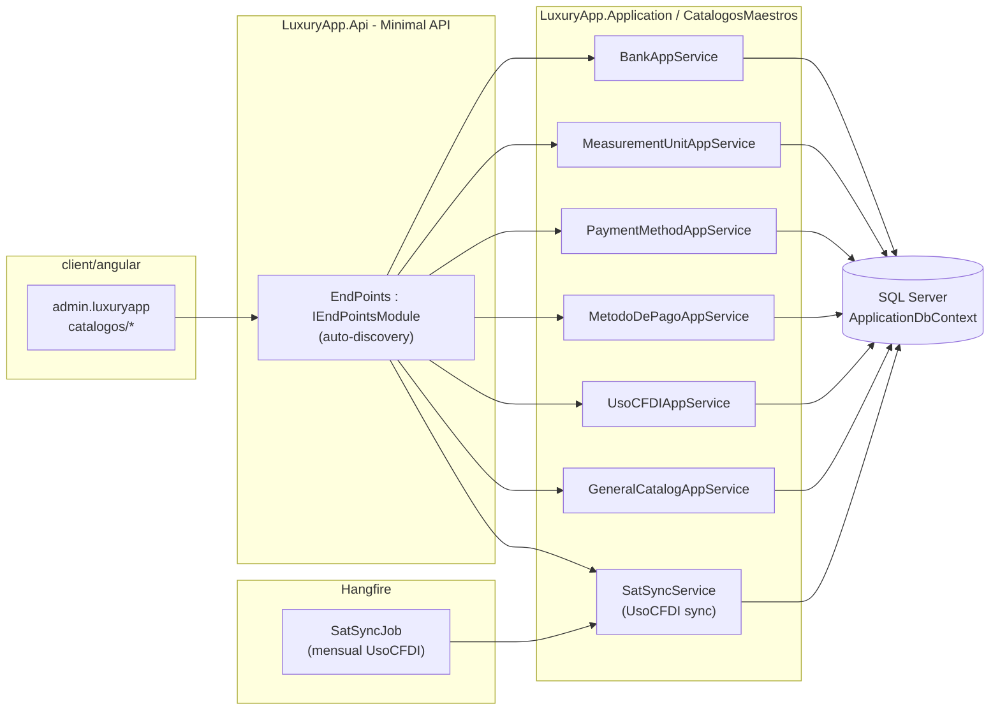
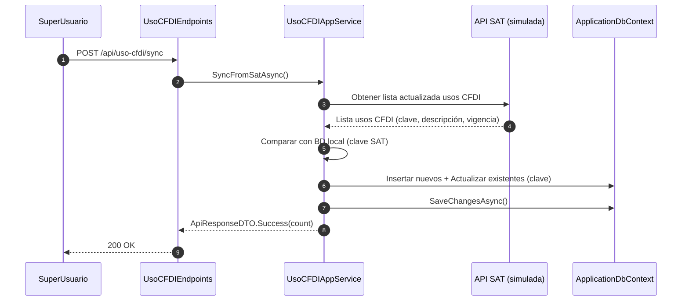
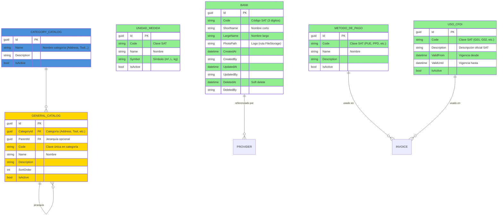

# Catálogos Maestros (CatalogosMaestros) — Documentación Técnica

> **Ruta**: 📂 Documentación > 💼 Configuración > 📚 Catálogos Maestros
> **📅 Última Revisión**: 13-jul-26
> **🛡️ Estado**: ✅ Vigente
> **👤 Responsable**: @equipo-arquitectura

---

## 📑 Tabla de Contenidos

1. [Resumen Ejecutivo](#-resumen-ejecutivo)
2. [Visión Funcional](#-visión-funcional)
3. [Arquitectura Técnica](#-arquitectura-técnica)
4. [API Endpoints](#-api-endpoints)
5. [Flujo del Sistema](#-flujo-del-sistema)
6. [Componentes Frontend](#-componentes-frontend)
7. [Reglas de Negocio](#-reglas-de-negocio)
8. [Matriz de Permisos](#-matriz-de-permisos)
9. [Catálogo de Roles del Sistema](#-catálogo-de-roles-del-sistema)
10. [Base de Datos](#-base-de-datos)
11. [Performance](#-performance)
12. [Glosario de Términos](#-glosario-de-términos)
13. [Checklist de Validación](#-checklist-de-validación)
14. [Historial de Cambios](#-historial-de-cambios)

---

## 🎯 Resumen Ejecutivo

**Propósito**: Módulo de configuración que centraliza todos los catálogos globales del sistema compartidos entre todos los tenants (clientes/condominios). Proporciona la base de datos maestra transversal para operaciones de todos los módulos (bancos, unidades de medida, métodos de pago, usos CFDI, catálogos genéricos).

**Actores Involucrados** (`ApplicationRoleEnum`): `SuperUsuario`, `Administrador`, `GerenteOperaciones`, `Contador`, `Cobranza`, `Compras`, `Legal`, `SistemasGeneral`, `AdministracionGeneral`.

**Dependencias**: `Customer` (tenant — solo para aislamiento en consultas, catálogos son globales), `Provider` (referencia `Bank`), `Invoice` (referencia `MetodoPago`, `UsoCFDI`), `Charge` (referencia `PaymentMethod`), `FileStorage` (logos bancos), Hangfire (sync SAT), EPPlus (exportación).

**Alcance**:

- ✅ Incluye: Bancos (código SAT + logo), Unidades de medida, Métodos de pago, Usos CFDI (SAT), Catálogos genéricos (Category, Address, Tool, Medidor, etc.), Sincronización SAT programada, Exportación Excel, Soft delete con validación FK.
- ❌ No incluye: Catálogos por tenant (cada módulo gestiona sus propios catálogos locales), Configuración SAT avanzada (certificados, PAC), Versionado histórico de catálogos SAT.

---

## 🔍 Visión Funcional

**HU-01 — Gestión CRUD de catálogos globales**

> Como **SuperUsuario** quiero crear/editar/eliminar (soft) registros en catálogos maestros con validación de unicidad y referencias.
> **Criterios**: Unicidad `Name`/`Code` por catálogo; soft delete bloqueado si hay FKs activas (ej. `Bank` → `Provider`); `SuperUsuario`/`AdminCatalogos` escritura; tenants solo lectura.

**HU-02 — Sincronización catálogos SAT (Usos CFDI)**

> Como **Contador/SuperUsuario** quiero sincronizar catálogo `UsoCFDI` contra API SAT oficial para mantener vigencia fiscal.
> **Criterios**: Endpoint `POST /api/uso-cfdi/sync` → llama API SAT (simulada) → compara con BD local → inserta nuevos + actualiza existentes (clave SAT) → retorna conteo; job Hangfire opcional mensual.

**HU-03 — Catálogos genéricos reutilizables**

> Como **desarrollador/admin** quiero catálogos genéricos (Category, Address, Tool, Medidor) con estructura estándar para evitar tablas ad-hoc.
> **Criterios**: Entidad base `GeneralCatalog` (`CategoryId`, `Name`, `Code`, `Description`, `ParentId` opcional jerarquía, `IsActive`, `SortOrder`); endpoints CRUD unificados `/api/general-catalogs/{categoryId}`; usado por módulos via `GeneralCatalogAppService.GetByCategoryAsync(category)`.

**HU-04 — Exportación y auditoría**

> Como **admin** quiero exportar catálogos a Excel y ver auditoría de cambios.
> **Criterios**: `GET /{catalog}/export` → Excel (EPPlus) con columnas: Id, Code, Name, Description, IsActive, CreatedAt, CreatedBy, UpdatedAt, UpdatedBy; `FinancialAuditLog` registra cambios (Create/Update/Delete) con `EntityType`, `EntityId`, `ActorUserId`, `MetadataJson`.

---

## 🏗️ Arquitectura Técnica



| Capa        | Tecnología                                                          |
| ----------- | ------------------------------------------------------------------- |
| Backend     | .NET 10, Minimal APIs (`IEndpointModule`), EF Core 10               |
| SAT Sync    | `HttpClient` + `SatSyncService` (simulado/producción)               |
| Jobs        | Hangfire (`RecurringJob` mensual UsoCFDI)                           |
| Exportación | EPPlus (`GetAsByteArray`)                                           |
| Respuestas  | `ApiResponseDTO<T>` (nunca `ProblemDetails`)                        |
| Mapeo       | Explícito `ToDTO()` (AutoMapper prohibido)                          |
| Frontend    | Angular 22 (standalone, signals, OnPush), Bootstrap 5, catálogo `@ui/*` |

---

## 📱 Mobile Responsive (§15 CONVENTIONS.md)

| Vista                             | Patrón (§15.2)         | Implementación                                                                 |
| --------------------------------- | ---------------------- | ------------------------------------------------------------------------------ |
| Todos los listados/CRUD catálogos | **A — CSS Responsive** | PrimeFlex grid (`p-col-*`), `p-table` responsive, modal `p-dialog` formularios |

**Reglas aplicadas:**

- Breakpoint único: 768px (`PlatformService.isMobile()`)
- Touch targets ≥ 44×44px en botones/iconos
- Safe areas: `p-dialog` maneja notch
- Modales: `p-dialog` (no móvil nativo, módulo admin)
- Pull-to-refresh + infinite scroll en listados si > 1000 registros

---

## 🌐 API Endpoints

Base por catálogo (kebab-case, plural, minúsculas, prefijo `api/`):

| Catálogo            | Base Path                           | Entidad          |
| ------------------- | ----------------------------------- | ---------------- |
| Bancos              | `api/banks`                         | `Bank`           |
| Unidades de medida  | `api/measurement-units`             | `UnidadMedida`   |
| Métodos de pago     | `api/payment-methods`               | `MetodoDePago`   |
| Usos CFDI           | `api/uso-cfdi`                      | `UsoCFDI`        |
| Catálogos genéricos | `api/general-catalogs/{categoryId}` | `GeneralCatalog` |

### Tabla CRUD Común (patrón para todos)

| Método | Path              | Roles                        | Request DTO                     | Response DTO        | Códigos HTTP          |
| ------ | ----------------- | ---------------------------- | ------------------------------- | ------------------- | --------------------- |
| GET    | `/{catalog}`      | Todos (lectura)              | `PaginationCommonDTO` + filtros | `PagedResultDTO<T>` | 200 · 400             |
| GET    | `/{catalog}/{id}` | Todos (lectura)              | —                               | `T`                 | 200 · 404             |
| POST   | `/{catalog}`      | SuperUsuario, AdminCatalogos | `CreateDTO`                     | `bool`              | 200 · 400 · 409       |
| PUT    | `/{catalog}/{id}` | SuperUsuario, AdminCatalogos | `UpdateDTO`                     | `bool`              | 200 · 400 · 404 · 409 |
| DELETE | `/{catalog}/{id}` | SuperUsuario, AdminCatalogos | —                               | `bool`              | 200 · 404 · 409       |

> [!NOTE]
> El campo `responseCode` viaja **dentro** de `ApiResponseDTO`; el status HTTP siempre es `200 OK` para respuestas de negocio (incluidos errores 4xx de dominio). `500` solo para excepciones no controladas.

### Endpoints Especiales

| Método | Path                 | Roles                        | Descripción                                  |
| ------ | -------------------- | ---------------------------- | -------------------------------------------- |
| POST   | `/api/uso-cfdi/sync` | SuperUsuario, AdminCatalogos | Sincroniza catálogo Usos CFDI contra API SAT |
| GET    | `/{catalog}/export`  | Todos (lectura)              | Exporta catálogo a Excel (EPPlus)            |

---

## 🔄 Flujo del Sistema

### Sincronización Usos CFDI (SAT)



### Soft Delete con Validación FK

```mermaid
flowchart TD
  subgraph Usuario
    A1[Solicita DELETE /banks/{id}]
  end
  subgraph Sistema
    B1[Valida rol SuperUsuario/AdminCatalogos]
    B2{¿Existen FKs activas<br/>(Provider.BankId, etc.)?}
    B2 -- sí --> B3[409: No se puede eliminar,<br/>referenciado por Proveedores]
    B2 -- no --> B4[Soft Delete: DeletedAt/DeletedBy]
    B4 --> B5[Commit]
  end
  A1 --> B1
  B1 --> B2
  B3 --> C1[Error 409 mensaje español]
  B5 --> C2[Éxito: eliminado lógicamente]
  style A1 fill:#4A90D9
  style B1 fill:#4A90D9
  style B2 fill:#FFD700
  style B3 fill:#FF6B6B
  style B4 fill:#4A90D9
  style B5 fill:#90EE90
  style C1 fill:#FF6B6B
  style C2 fill:#90EE90
```

---

## 🖥️ Componentes Frontend

Workspace: **`client/angular`** (standalone, signals, OnPush, catálogo `@ui/*`, `ApiResponseService`, `Endpoints`).

### Routing (`admin.luxuryapp`)

| App (§14)         | Ruta                        | Componente            | Lazy loading | Guard       | Menú |
| ----------------- | --------------------------- | --------------------- | :----------: | ----------- | :--: |
| `admin.luxuryapp` | `catalogos/bancos`          | `BankList`            |      ✅      | `authGuard` |  ✅  |
| `admin.luxuryapp` | `catalogos/unidades-medida` | `MeasurementUnitList` |      ✅      | `authGuard` |  ✅  |
| `admin.luxuryapp` | `catalogos/metodos-pago`    | `PaymentMethodList`   |      ✅      | `authGuard` |  ✅  |
| `admin.luxuryapp` | `catalogos/usos-cfdi`       | `UsoCfdiList`         |      ✅      | `authGuard` |  ✅  |
| `admin.luxuryapp` | `catalogos/generales`       | `GeneralCatalogList`  |      ✅      | `authGuard` |  ✅  |

### Catálogo de Componentes (representativo — patrón común)

| Componente           | Selector                   | Tipo | Signals clave                             | Servicios                          | Comportamiento                                                                                 |
| -------------------- | -------------------------- | ---- | ----------------------------------------- | ---------------------------------- | ---------------------------------------------------------------------------------------------- |
| `BankList`           | `app-bank-list`            | web  | `dataSignal`, `loading`, `filters`        | `ApiResponseService`               | `p-table` virtual scroll, filtros code/name/activo, exportar, `il-button-*` CRUD               |
| `BankForm`           | `app-bank-form`            | web  | `submitting`, `form`, `logoSignal`        | `ApiResponseService`, `FormHelper` | `FormHelper.submitCrud()`, `p-fileUpload` logo, validación código SAT único                    |
| `UsoCfdiList`        | `app-uso-cfdi-list`        | web  | `dataSignal`, `loading`, `syncing`        | `ApiResponseService`               | `p-table`, botón **Sincronizar SAT** (`syncing` signal), badges vigencia                       |
| `GeneralCatalogList` | `app-general-catalog-list` | web  | `dataSignal`, `categorySignal`, `loading` | `ApiResponseService`               | Selector categoría (tabs), `p-table` por categoría, jerarquía `ParentId` (tree-table opcional) |

**Estilos**: Bootstrap 5 (`card`, `grid`, `text-*`); botones/inputs catálogo `@ui/*` (`il-button`, `il-button-save`, `custom-input-*-signal`). **Testing**: `.spec.ts` por componente (Vitest) — cobertura básica inicialización.

**Interfaces** (`core/interfaces/catalogs.dto.ts`): `bank`, `measurement-unit`, `payment-method`, `metodo-pago`, `uso-cfdi`, `general-catalog`, `paged-result`.

---

## 📜 Reglas de Negocio

| ID     | SI (condición)                          | ENTONCES (acción)                                                                                                                                                          |
| ------ | --------------------------------------- | -------------------------------------------------------------------------------------------------------------------------------------------------------------------------- | -------- | -------------------------------------------------------------------- |
| RN-001 | Cualquier operación escritura catálogos | Requiere rol `SuperUsuario` o `AdminCatalogos`; tenants solo lectura (403 si intentan POST/PUT/DELETE)                                                                     |
| RN-002 | Se crea/actualiza registro catálogo     | Valida unicidad `Name` (y `Code` si aplica) dentro del catálogo; 409 "Ya existe un registro con el nombre '{Name}'"                                                        |
| RN-003 | Se solicita soft delete                 | Verifica FKs activas: `Bank` → `Provider`, `MetodoDePago` → `Invoice`/`Charge`, `UsoCFDI` → `Invoice`; si existen → 409 "No se puede eliminar, referenciado por {Entidad}" |
| RN-004 | Sincronización `UsoCFDI`                | Compara por `ClaveSAT`; inserta nuevos (`IsActive=true`); actualiza existentes (`Description`, `VigenciaDesde/Hasta`); no elimina (soft delete manual si SAT retira)       |
| RN-005 | Catálogos genéricos `GeneralCatalog`    | `CategoryId` obligatorio; `ParentId` opcional (jerarquía 1 nivel); `SortOrder` para orden visual; `IsActive` filtra en selects                                             |
| RN-006 | Exportación `GET /{catalog}/export`     | Genera Excel con columnas: Id, Code, Name, Description, IsActive, CreatedAt, CreatedBy, UpdatedAt, UpdatedBy; tope 10 000 filas                                            |
| RN-007 | Auditoría cambios                       | `FinancialAuditLog` registra: `EntityType` (`Bank`, `UsoCFDI`, etc.), `EntityId`, `EventType` (`Create`                                                                    | `Update` | `Delete`), `ActorUserId`, `MetadataJson` (diff old/new), `CreatedAt` |
| RN-008 | Multi-tenant consultas                  | Catálogos son **globales** (sin `CustomerId`); queries no filtran por tenant; `CustomerId` nulo en entidades maestras                                                      |

---

## 🔐 Matriz de Permisos

Roles de `ApplicationRoleEnum`.

| Acción                | SuperUsuario | AdminCatalogos | Admin/Staff (lectura) | Tenant (Cliente) | Sistema |
| --------------------- | :----------: | :------------: | :-------------------: | :--------------: | :-----: |
| Leer catálogos        |      ✅      |       ✅       |          ✅           |        ✅        |   ✅    |
| Crear/Editar/Eliminar |      ✅      |       ✅       |          ❌           |        ❌        |   ✅    |
| Sincronizar SAT       |      ✅      |       ✅       |          ❌           |        ❌        |   ✅    |
| Exportar Excel        |      ✅      |       ✅       |          ✅           |        ❌        |   ✅    |
| Ver auditoría         |      ✅      |       ✅       |          ❌           |        ❌        |   ✅    |

**Detalle por RoleType**:

- **System**: `SuperUsuario`
- **Corporate**: `AdminCatalogos`, `AdministracionGeneral`, `SistemasGeneral`, `Legal`, `Contador`, `Cobranza`, `Compras`
- **Staff**: `Administrador`, `GerenteOperaciones`, `GerenteAtencion`, `Asistente` (solo lectura)

---

## 🗄️ Catálogo de Roles del Sistema

El módulo **no introduce roles nuevos**: reutiliza `ApplicationRoleEnum`. La autorización es **por rol** (`AuthorizeAttribute { Roles = "SuperUsuario,AdminCatalogos" }`), no por claims. `AdminCatalogos` es rol corporativo para gestores de catálogos sin ser `SuperUsuario`.

---

## 🗄️ Base de Datos

`ApplicationDbContext` (SQL Server). Entidades maestras **sin `CustomerId`** (globales). FKs con `OnDelete(Restrict)`.



| Tabla              | Columnas clave                                                                               | Índices                                                                                      |
| ------------------ | -------------------------------------------------------------------------------------------- | -------------------------------------------------------------------------------------------- |
| `Banks`            | `Id`, `Code` (3 dígitos SAT), `ShortName`, `LargeName`, `PhotoPath`, `IsActive`, `DeletedAt` | `UX (Code)`, `UX (ShortName)`, `IX (IsActive, DeletedAt)`                                    |
| `UnidadMedida`     | `Id`, `Code` (clave SAT), `Name`, `Symbol`, `IsActive`                                       | `UX (Code)`, `UX (Name)`, `IX (IsActive)`                                                    |
| `MetodoDePago`     | `Id`, `Code` (clave SAT: PUE/PPD/...), `Name`, `Description`, `IsActive`                     | `UX (Code)`, `UX (Name)`, `IX (IsActive)`                                                    |
| `UsoCFDI`          | `Id`, `Code` (clave SAT: G01/G02/...), `Description`, `ValidFrom`, `ValidUntil`, `IsActive`  | `UX (Code)`, `IX (ValidFrom, ValidUntil)`, `IX (IsActive)`                                   |
| `GeneralCatalogs`  | `Id`, `CategoryId`, `ParentId`, `Code`, `Name`, `Description`, `SortOrder`, `IsActive`       | `UX (CategoryId, Code)`, `IX (CategoryId, ParentId, SortOrder)`, `IX (CategoryId, IsActive)` |
| `CategoryCatalogs` | `Id`, `Name`, `Description`, `IsActive`                                                      | `UX (Name)`, `IX (IsActive)`                                                                 |

**Enums** (`LuxuryApp.Shared.Enums`): `ECatalogType` (`Bank`, `MeasurementUnit`, `PaymentMethod`, `UsoCFDI`, `GeneralCatalog`), `EGeneralCatalogCategory` (`Address`, `Tool`, `Medidor`, `EquipmentType`, `IncidentType`, `MaintenanceType`).

---

## ⚡ Performance

- **Lazy loading**: componentes Angular vía `loadComponent` (una carga por ruta).
- **N+1**: consultas con `join`/proyección `.Select()` (sin cargas perezosas por fila); listados paginados server-side (`PaginationCommonDTO`, tope 200).
- **Selects/Combos**: `GeneralCatalogAppService.GetByCategoryAsync(category)` → proyección directa a `SelectItemDTO` (Id, Label) — 1 query, sin materializar entidad completa.
- **SAT Sync**: job mensual 03:00; `HttpClient` con timeout 30s; batch insert/update (EF Core `BulkExtensions` opcional); `AsNoTracking()` en comparación.
- **Soft delete**: query filter global `ISoftDeletable.DeletedAt IS NULL` + índice `(IsActive, DeletedAt)`.
- **Export**: tope 10 000 filas (EPPlus streaming).
- **Frontend**: `p-table [virtualScroll]="true"` + `[lazy]="true"`; `@defer` para preview logos en `BankList`.

---

## 📖 Glosario de Términos

| Término                | Definición                                                                                          |
| ---------------------- | --------------------------------------------------------------------------------------------------- |
| **Catálogo maestro**   | Entidad global compartida por todos los tenants (sin `CustomerId`)                                  |
| **Código SAT**         | Clave oficial del SAT (ej. banco 3 dígitos, uso CFDI G01, método pago PUE)                          |
| **Uso CFDI**           | Catálogo SAT de destinos del comprobante fiscal (G01=Adquisición mercancías, etc.)                  |
| **Método de pago**     | Forma de pago SAT (PUE=Pago en una exhibición, PPD=Parcialidades/diferido)                          |
| **Catálogo genérico**  | Estructura reutilizable `Category` + `GeneralCatalog` (jerarquía 1 nivel) para evitar tablas ad-hoc |
| **Sincronización SAT** | Proceso programado que actualiza catálogos fiscales contra fuente oficial                           |
| **Soft delete global** | Marcado `DeletedAt` + `DeletedBy`; query filter global excluye eliminados                           |
| **AdminCatalogos**     | Rol corporativo para gestores de catálogos sin ser `SuperUsuario`                                   |

---

## ✅ Checklist de Validación ([CONVENTIONS.md §11](../../../../../../CONVENTIONS.md#11-estándares-de-documentación))

> [!NOTE]
> El link a `CONVENTIONS.md` asume que el documento vive en la raíz del propio módulo. Ajusta la profundidad relativa (`../../../../../../`) según la ubicación final.

- [x] CERO mojibake (UTF-8 sin BOM)
- [x] CERO `any` en TypeScript
- [x] Fechas en formato `dd-MMM-yy`
- [x] Endpoints front/back coinciden carácter a carácter
- [x] Diagramas Mermaid válidos (flowchart swimlanes + sequence con `autonumber`)
- [x] Colores Mermaid según §11 (verde `#90EE90` éxito, amarillo `#FFD700` decisión, azul `#4A90D9` proceso, rojo `#FF6B6B` error)
- [x] Reglas de negocio en formato `SI/ENTONCES` (`RN-xxx`)
- [x] Roles usan nombres exactos de `ApplicationRoleEnum`
- [x] Mobile responsive: §15 aplicado según tipo de vista
- [x] Sin PII en logs
- [x] Emojis consistentes · Todo en español

---

## 📝 Historial de Cambios

| Fecha     | Versión | Autor                | Cambios                                                                                                                                                                                                                                                      |
| --------- | ------- | -------------------- | ------------------------------------------------------------------------------------------------------------------------------------------------------------------------------------------------------------------------------------------------------------ |
| 10-jun-26 | 1.0     | @equipo-arquitectura | Documentación inicial del módulo (template intermedio)                                                                                                                                                                                                       |
| 13-jul-26 | 2.0     | @kilo                | Actualización a template §11 CONVENTIONS.md: Mobile responsive §15, checklist §11, Mermaid colores, sin PII, sin `any`, rutas api kebab-case, TOC completo, arquitectura, flujos, componentes, matriz permisos, ER diagram, performance, glosario, historial |
