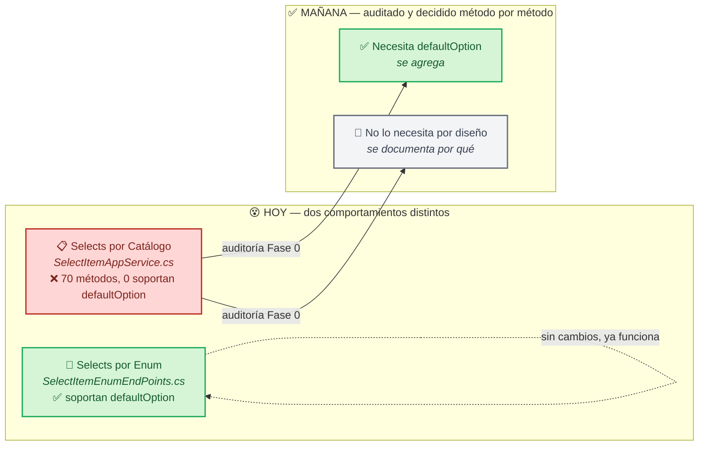

# 🔽 Plan: `defaultOption` en los 70 selects de `SelectItemAppService`
### 🕳️ Cerrar la brecha entre selects por enum (con opción por defecto) y selects por catálogo (sin ella)

## 1. 📋 Metadata

| Campo | Valor |
|---|---|
| Módulo | `SharedLuxuryApp/SelectItem` (backend) — transversal, consumido por decenas de formularios en toda la app |
| Tipo | C — Auditoría de módulo existente, seguida de remediación por fases |
| Origen | Hallazgo del usuario (2026-09-30) al revisar un bug de asteriscos duplicados en `inspecciones-form`, que llevó a revisar si los selects tenían `defaultOption` |
| Hallazgo inicial | `SelectItemEnumEndPoints.cs` soporta `bool? defaultOption` (vía `BuildEnumSelectList<TEnum>`); `SelectItemAppService.cs` (70 métodos) tiene **0 ocurrencias** |
| Alcance confirmado | 70 métodos públicos que retornan `Task<ApiResponseDTO<List<SelectItemDTO<T>>>>` en `LuxuryApp.Application/Modules/SharedLuxuryApp/SelectItem/Services/SelectItemAppService.cs` |

---

## 🗺️ Panorama en un vistazo

> No todo select necesita `defaultOption` — un select con 2 valores fijos (ej. Activo/Inactivo) no necesita placeholder en blanco. La auditoría existe justo para no aplicar el cambio a ciegas en los 70.

---

## 2. 📌 Resumen Ejecutivo

**Problem Statement:**

Actualmente, el usuario final sufre de selects de catálogo que **siempre llegan con un valor preseleccionado** (el primero de la lista) cuando intenta crear un registro nuevo, lo que resulta en que puede enviar accidentalmente un formulario sin haber elegido realmente una opción — porque el select nunca estuvo "vacío" para forzar una elección consciente. Esto afecta a cualquier formulario que use uno de los 70 métodos de `SelectItemAppService` para poblar un `<select>`.

**KPIs:**

| Métrica | Baseline | Target | Timeline | Verificación |
|---|---|---|---|---|
| Métodos de `SelectItemAppService` auditados y clasificados | 0/70 | 70/70 | Fin de Fase 0 | Tabla de clasificación en este documento |
| Métodos que necesitan `defaultOption` y ya lo tienen | 0 | 100% de los clasificados como "necesita" | Fin de Fase 1 | `grep` de `defaultOption` en el archivo + prueba manual por muestreo |
| Formularios verificados con placeholder en blanco tras el cambio | 0 | Los que consuman métodos "necesita", por muestreo | Fin de Fase 2 | Prueba manual de 5 formularios representativos |

## 3. 🎯 Objetivo

Auditar los 70 métodos de `SelectItemAppService.cs`, clasificar cuáles necesitan `bool? defaultOption` (siguiendo el patrón ya probado en `SelectItemEnumEndPoints.cs`/`EnumExtensions.GetSelectListForEnum<TEnum>`) y cuáles no por diseño, y agregar el parámetro solo donde corresponda — sin tocar los que no lo necesitan.

## 4. 🗺️ Alcance

**Dentro de alcance:**
- Los 70 métodos de `SelectItemAppService.cs` y sus endpoints correspondientes (`SelectItemEndPoints.cs` y cualquier otro archivo de endpoints que los expusiera).
- Actualizar el contrato de cada endpoint que lo requiera para aceptar `bool? defaultOption` (ruta o query param, siguiendo la convención ya usada en `SelectItemEnumEndPoints.cs`: `{route}/{defaultOption?}`).
- Frontend: solo los formularios que se toquen como parte de la muestra de verificación (Fase 2) — no un rediseño masivo de 70 pantallas.

**Fuera de alcance (por ahora):**
- Rediseño visual de los selects (esto es solo sobre la opción "en blanco" inicial, no sobre estilo).
- El bug de asteriscos duplicados en labels — **ya resuelto por separado**, fuera de este plan (7 ocurrencias en 4 archivos, corregidas 2026-09-30).

## 5. 🚧 Restricciones

- **Regla crítica del repo: NUNCA modificar un `SelectItem`/`SelectItemEnum` existente de forma que rompa a sus consumidores actuales** (memoria: `critical-rule-selectitem-never-modify.md`). Agregar `bool? defaultOption` como parámetro **opcional con default `null`/`false`** es seguro (no rompe firmas existentes); cualquier cambio que sí rompa compatibilidad debe crear un método nuevo, no modificar el existente.
- `#nullable disable`, prohibido `?` en propiedades `string` (no aplica aquí, son parámetros de método, no propiedades).
- Reutilizar el patrón ya probado (`GetSelectListForEnum<TEnum>` / `BuildEnumSelectList`) en vez de inventar uno nuevo.

## 6. 🏛️ Arquitectura & Diseño Técnico

### 🗂️ Glosario

| En español | Código | Qué es |
|---|---|---|
| 🔽 Opción por defecto | `bool? defaultOption` | Si es `true`, el select antepone una opción vacía/placeholder (ej. "-- Selecciona --") para forzar elección consciente |
| 🔢 Select por Enum | `SelectItemEnumEndPoints.cs` | Genérico, ya soporta `defaultOption` vía `BuildEnumSelectList<TEnum>` |
| 📋 Select por Catálogo | `SelectItemAppService.cs` | 70 métodos específicos (clientes, empleados, proveedores, maquinaria, etc.), consultan BD real, no un enum |

### 📐 Matriz de Reglas de Negocio

**Nivel 1 — Invariantes de Dominio**

| RN | Regla |
|---|---|
| RN-SEL-001 | Ningún método existente de `SelectItemAppService` cambia su firma de forma que rompa llamadas actuales — `defaultOption` se agrega como parámetro opcional |
| RN-SEL-002 | Un select clasificado "no necesita `defaultOption`" debe tener una justificación de negocio explícita documentada (no "porque no", sino por qué una preselección es correcta ahí) |

**Nivel 4 — Validación de Datos**

| RN | Regla |
|---|---|
| RN-SEL-010 | Cuando `defaultOption = true`, la opción en blanco va primero en la lista, con `Value` vacío/nulo según el tipo genérico del método |

## 7. 🛤️ Fases

### Fase 0 — 🔍 Auditoría de los 70 métodos
- Leer los 70 métodos de `SelectItemAppService.cs` (líneas listadas en el hallazgo inicial) y sus endpoints consumidores.
- Para cada uno, clasificar: **A) Necesita `defaultOption`** (selects abiertos: clientes, empleados, proveedores, equipos, etc. — el usuario elige entre muchas opciones reales) vs **B) No lo necesita por diseño** (ej. listas de 2-3 valores fijos donde una preselección es intencional, o selects que ya filtran a "el único válido").
- Producir una tabla de clasificación (método → A/B → justificación) dentro de este documento, en la sección de Reportes.
- No modificar código todavía.

**Checklist:**
- [x] 68/68 métodos reales clasificados con justificación; discrepancia 70/70 documentada en el reporte
- [x] Consumidores frontend buscados método por método; ausencias explícitamente marcadas

### Fase 1 — 🔧 Implementación en los métodos clasificados "A"
- Agregar `bool? defaultOption = null` a cada método clasificado "A", reutilizando el patrón de `BuildEnumSelectList` (anteponer opción vacía cuando es `true`).
- Actualizar los endpoints correspondientes para aceptar el parámetro (ruta opcional, igual que `SelectItemEnumEndPoints.cs`).

**Checklist:**
- [x] Build sin errores
- [x] Ningún método cambia su comportamiento cuando `defaultOption` no se envía (compatibilidad con consumidores actuales)

### Fase 2 — ✅ Verificación por muestreo en frontend
- Elegir 5 formularios representativos que consuman métodos clasificados "A" y verificar manualmente que ahora pueden mostrar placeholder en blanco cuando el frontend pase `defaultOption=true`.
- No es necesario tocar los 70 formularios — solo confirmar que el mecanismo funciona end-to-end en una muestra.

**Checklist:**
- [ ] 5 formularios probados manualmente, comportamiento correcto

## 8. 🚦 Criterios de Paso

**Happy path:** Un método clasificado "A" recibe `defaultOption=true` → la lista devuelta antepone una opción vacía → el frontend la muestra como placeholder → el usuario debe elegir activamente.
**PASS si:** la opción vacía aparece primero y el resto de las opciones no cambia.

**Sad path:** Un consumidor actual llama al método sin enviar `defaultOption` (código viejo, sin cambios).
**PASS si:** el comportamiento es idéntico al de antes de este plan — sin opción en blanco, sin romper nada.

## 9. ⚠️ Riesgos y Mitigaciones (Pre-Mortem)

| Supuesto fallido | Impacto | Probabilidad | Mitigación | Owner |
|---|---|---|---|---|
| Se clasifica un método como "no necesita" por pereza, sin revisar su consumidor real | Un formulario real queda con el bug sin resolver | Media | Checklist de Fase 0 exige revisar el frontend consumidor, no solo el nombre del método | Backend |
| Se agrega `defaultOption` a un método y se rompe algún consumidor que dependía de la preselección | Formularios existentes cambian de comportamiento sin que nadie lo pidiera | Baja (parámetro opcional, default `null`) | Fase 1 exige que el comportamiento sin el parámetro sea idéntico al actual | Backend |

## 10. 🔗 Dependencias e Impactos

- Depende de: patrón ya probado en `SelectItemEnumEndPoints.cs`/`EnumExtensions.GetSelectListForEnum`.
- Impacta potencialmente: cualquiera de los ~70 formularios que consumen estos métodos (solo los clasificados "A", y solo si el frontend decide pasar `defaultOption=true`).
- No impacta: `SelectItemEnumEndPoints.cs` (ya correcto, no se toca).

## 11. 🏁 Cierre Esperado

Los 70 métodos de `SelectItemAppService` quedan clasificados con justificación explícita; los que necesitan opción por defecto la tienen, sin romper ningún consumidor existente; verificado en una muestra real de formularios.

---

## 12. 📒 Registro de Ejecución

> Mismo formato que el plan de Inspections: cada agente agrega su reporte al final de "📤 Reportes de agentes externos"; Claude valida antes de dar el siguiente prompt.

| Fase | Estado | Validación |
|---|---|---|
| 0 — 🔍 Auditoría de los 70 métodos | ✅ Completada (68 métodos reales; 70 filas documentadas) | ✅ Aprobada |
| 1 — 🔧 Implementación en clasificados "A" | ✅ Completada | Build + prueba enfocada + suite `dotnet test` |
| 2 — ✅ Verificación por muestreo | ⏳ Pendiente | — |

### 📤 Reportes de agentes externos

#### Reporte Fase 0 — Auditoría de métodos `SelectItemAppService`

Auditoría realizada sobre `SelectItemAppService.cs`, `SelectItemEndPoints.cs` y búsquedas de consumidores en `appsweb/angular/src`. El archivo contiene **68 métodos** con la firma exacta solicitada (`Task<ApiResponseDTO<List<SelectItemDTO<T>>>>`), no 70. Las dos últimas filas registran la discrepancia del plan y no representan métodos inventados.

Clasificación: **A** = elección consciente entre opciones de catálogo. **B** = preselección intencional por lista fija, valor único o dato derivado automáticamente. No se encontró ningún método real de esta firma que pueda justificarse como B; los consumidores ausentes se indican explícitamente.

| Método | Endpoint | Consumidor(es) encontrados | Clasificación (A/B) | Justificación |
|---|---|---|:---:|---|
| `GetRolesForAnnouncementsAsync()` | `GET /api/select-items/roles-for-announcements` | `announcement-admin-form.ts` (`Endpoints.SelectItems.rolesForAnnouncements`) | A | El usuario define roles destinatarios del anuncio. |
| `SelectItemApplicationRolesAsync()` | `GET /api/select-items/application-roles` | `evaluation-authorization-matrix.ts`; `task-template-form.ts` | A | Asignación explícita de roles. |
| `SelectItemRolesAsync()` | `GET /api/select-items/roles` | No detectable en frontend. | A | Catálogo de roles; ausencia de consumidor no demuestra selección única. |
| `SelectItemCustomersActiveAsync()` | `GET /api/select-items/customers-active` | `user-account-form.ts`; `aspel-customer-empresa-form.ts` | A | El usuario selecciona cliente. |
| `SelectItemCustomersInactiveAsync()` | `GET /api/select-items/customers-inactive` | No detectable en frontend. | A | Catálogo de clientes inactivos; requiere elección si se usa. |
| `SelectItemCustomersAllAsync()` | `GET /api/select-items/customers-all` | No detectable en frontend. | A | Catálogo de clientes; no hay base para preseleccionar uno. |
| `SelectItemNombreCortoAsync()` | `GET /api/select-items/nombre-corto` | `agenda-supervision.ts`; `minutas-resumen.ts` | A | Selección de cliente para operar o filtrar. |
| `SelectItemCustomersAccesoAsync(string)` | `GET /api/select-items/customers-access/{applicationUserId}` | No detectable en frontend. | A | Devuelve clientes accesibles; pueden existir varios. |
| `SelectItemProfessionsAsync()` | `GET /api/select-items/professions` | No detectable en frontend. | A | Lista seleccionable derivada de roles/profesiones. |
| `SelectItemProvidersAsync(Guid)` | `GET /api/select-items/providers/{customerId}` | `catalogo-gasto-fijo-form.ts`; `proveedor-form.ts` | A | Selección de proveedor. |
| `SelectItemCategoriesAsync()` | `GET /api/select-items/categories` | `customer-provider-form.ts`; `tool-form.ts` | A | Selección de categoría. |
| `SelectItemPropertyAccountsAsync(Guid,int)` | `GET /api/select-items/property-accounts/{customerId}/{year}` | No detectable en frontend. | A | Devuelve varias cuentas contables posibles. |
| `SelectItemMachineriesGetAllAsync(Guid)` | `GET /api/select-items/machineries-all/{customerId}` | `mantenimiento-preventivo-form.ts` | A | Selección de maquinaria. |
| `SelectItemMachineriesActiveAsync(Guid)` | `GET /api/select-items/machineries-active/{customerId}` | No detectable en frontend. | A | Catálogo de maquinaria activa potencialmente múltiple. |
| `SelectItemPropertyAsync(Guid)` | `GET /api/select-items/properties/{customerId}` | `payment-form.ts`; `owner-form.ts` | A | Selección de propiedad. |
| `SelectItemEmployeeAsync(Guid)` | `GET /api/select-items/employees/{customerId}` | `work-position-form.ts`; `employee-beneficiary-form.ts` | A | Selección de empleado. |
| `SelectItemPersonEmployeeAsync(Guid)` | `GET /api/select-items/people-employees/{customerId}` | No detectable en frontend. | A | Catálogo de personas empleadas, no valor fijo. |
| `SelectItemEmployeeActiveAsync(Guid)` | **No existe endpoint correspondiente** | No detectable en frontend. | A | Lista de empleados activos; método sin ruta expuesta. |
| `SelectItemEmployeeByUserIdAsync(Guid)` | `GET /api/select-items/employees-by-user-id/{customerId}` | `solicitudes-historial.ts` (`employeesByUserId`) | A | El usuario selecciona empleado; el valor sea `UserId` no elimina la elección. |
| `SelectItemOwnerAsync(Guid)` | `GET /api/select-items/owners/{customerId}`; alias `property-members/{customerId}` | No detectable en frontend. | A | Selección de propietario/miembro. |
| `SelectItemBankAsync()` | `GET /api/select-items/banks` | `sat-funding-invoice-edit-form.ts`; `proveedor-form.ts` | A | Selección de banco. |
| `SelectItemProductsAsync()` | `GET /api/select-items/products` | No detectable en frontend. | A | Catálogo de productos con múltiples opciones. |
| `SelectRichItemProductsAsync(string)` | `GET /api/select-items/rich-products?term={term}` | No detectable en frontend. | A | Búsqueda y elección de producto. |
| `SelectItemMeasurementUnitsAsync()` | `GET /api/select-items/measurement-units` | `gasto-fijo-servicios.ts`; `warehouse-stock-add.ts` | A | Selección de unidad de medida. |
| `SelectItemUseCFDIAsync()` | `GET /api/select-items/cfdi-uses` | `catalogo-gasto-fijo-form.ts` | A | Elección fiscal del uso de CFDI. |
| `SelectItemWayToPayAsync()` | `GET /api/select-items/payment-ways` | `catalogo-gasto-fijo-form.ts` | A | Elección de forma de pago. |
| `SelectItemToolAsync(Guid)` | `GET /api/select-items/tools/{customerId}` | `prestamo-herramienta-form-control.ts` | A | Selección de herramienta. |
| `SelectItemPaymentMethodAsync()` | `GET /api/select-items/payment-methods` | `catalogo-gasto-fijo-form.ts` | A | Elección de método de pago. |
| `SelectItemAddCuentaCedulaPresupuestalAsync(Guid)` | `GET /api/select-items/accounting-catalogs/{customerId}` | `projected-expenses-form.ts` | A | Selección de cuenta contable. |
| `SelectItemInstalacionesAsync(Guid)` | `GET /api/select-items/listado-instalaciones/{customerId}` | `bitacora-mantenimiento-form.ts` | A | Selección de instalación/equipo. |
| `SelectItemMedidorCategoriaAsync()` | `GET /api/select-items/medidor-categoria` | No detectable en frontend. | A | Catálogo de categorías de medidor. |
| `SelectItemAccountForCustomerAsync(Guid)` | `GET /api/select-items/accounts-for-customer/{customerId}` | No detectable en frontend. | A | Catálogo de empleados/cuentas asociados al cliente; sin valor único garantizado. |
| `SelectItemAnioOrdenServiceAsync(Guid)` | `GET /api/select-items/service-year/{customerId}` | No detectable en frontend. | A | El usuario puede elegir entre años con órdenes existentes. |
| `SelectItemComiteMinutaAsync(Guid,Guid)` | `GET /api/select-items/committee-minutes/{customerId}/{meetingId}` | `comite-form.ts` | A | Selección consciente de participantes. |
| `SelectItemAdministracionMinutaAsync(Guid,Guid)` | `GET /api/select-items/administration-minutes/{customerId}/{meetingId}` | `administration-form-list.ts` | A | Selección consciente de participantes. |
| `SelectItemResponsableSistemasAsync()` | `GET /api/select-items/responsable-sistemas` | No detectable en frontend. | A | Puede haber varios responsables elegibles; no es un valor fijo. |
| `SelectItemEmployeesActiveAsync()` | `GET /api/select-items/employees-active` | No detectable en frontend. | A | Catálogo global de empleados activos. |
| `SelectItemEmployeesActiveAsync(Guid)` | `GET /api/select-items/employees-active/{customerId}` | No consumidor confirmado. | A | Catálogo por cliente de empleados activos. |
| `SelectItemEquipoCalendarioMaestroAsync()` | `GET /api/select-items/equipo-calendario-maestro` | `calendario-maestro-form.ts` | A | Selección de equipo para calendario. |
| `SelectItemApplicationUserProviderAsync()` | `GET /api/select-items/application-user-providers` | `provider-support-form.ts` | A | Selección de usuario proveedor. |
| `SelectItemPersonAsync(Guid)` | `GET /api/select-items/people/{customerId}` | No detectable en frontend. | A | Selección de persona del cliente. |
| `SelectItemApplicationUserAsync()` | `GET /api/select-items/application-users` | `customer-data-company-form.ts` | A | Selección de usuario de aplicación. |
| `ApplicationUserForCustomerIdAsync(Guid)` | `GET /api/select-items/application-users/{customerId}` | No consumidor confirmado. | A | Selección entre usuarios activos del cliente. |
| `SelectItemInspectionReviewsCatalogAsync()` | `GET /api/select-items/inspection-review-catalogs` | No detectable en frontend. | A | Catálogo de criterios de inspección. |
| `SelectItemModuleAppAsync()` | `GET /api/select-items/module-apps` | No detectable en frontend. | A | El método ya agrega placeholder; el módulo sigue siendo elección del usuario. |
| `SelectItemTaskGroupCategoryAsync(Guid,Guid?)` | `GET /api/select-items/task-group-category/{customerId}?workGroupId={workGroupId}` | No detectable en frontend. | A | Selección de categoría de grupo de tareas. |
| `SelectItemTicketGroupListAsync(Guid)` | `GET /api/select-items/task-group-list/{customerId}` | No detectable en frontend. | A | Selección de grupo de tickets. |
| `SelectItemCustomerInspectionsAsync(Guid)` | `GET /api/select-items/customer-inspections/{customerId}` | No detectable en frontend. | A | Selección de inspección del cliente. |
| `SelectItemRolForDocumentAsync()` | `GET /api/select-items/roles-for-document` | No detectable en frontend. | A | Selección de rol de documento; la lista es múltiple. |
| `SelectItemLegalMatterCategoryAsync()` | `GET /api/select-items/legal-matter-categories` | No detectable en frontend. | A | Selección de categoría legal. |
| `SelectItemSelectForAddTicketAsync()` | `GET /api/select-items/select-for-add-ticket` | No detectable en frontend. | A | Devuelve asuntos legales; el usuario debe elegir asunto. |
| `SelectItemLegalMatterAsync()` | `GET /api/select-items/legal-matters` | No detectable en frontend. | A | Selección de asunto legal. |
| `FundingPeriodAsync(Guid)` | `GET /api/select-items/funding-period/{customerId}` | No consumidor confirmado. | A | El usuario elige periodo disponible de fondeo. |
| `SelectItemEvaluationTemplateAsync(Guid)` | `GET /api/select-items/evaluation-templates/{customerId}` | No detectable en frontend. | A | Selección de plantilla de evaluación. |
| `SelectItemAlmacenesAsync(Guid)` | `GET /api/select-items/almacenes/{customerId}` | `warehouse-stock-edit.ts` | A | Selección de almacén. |
| `SelectItemEquipoClasificacionAsync()` | `GET /api/select-items/equipment-classifications` | `activos-form.ts`; `inventario-llave-form.ts` | A | Selección de clasificación de equipo. |
| `SelectItemDashboardKpiRolesAsync()` | `GET /api/select-items/dashboard-kpi-roles` | `kpi-catalog.ts` | A | Selección de roles para configuración KPI. |
| `SelectItemRolesByRoleTypeAsync(RoleType)` | `GET /api/select-items/roles-by-role-type/{roleType}` | No detectable en frontend. | A | Catálogo filtrado de roles asignables. |
| `SelectItemCustomersActiveNameShortAsync()` | `GET /api/select-items/customers-active-short-name` | `announcement-admin-form.ts`; `manuals-and-processes-form.ts` | A | Selección de cliente. |
| `SelectItemRequestPositionsPendingAsync()` | `GET /api/select-items/request-positions-pending` | No detectable en frontend. | A | Selección de solicitud de puesto pendiente. |
| `SelectItemRecruitmentSourcesAsync()` | `GET /api/select-items/recruitment-sources` | No detectable en frontend. | A | Selección de fuente de reclutamiento. |
| `SelectItemVacantesAsync(Guid)` | `GET /api/select-items/vacantes/{customerId}` | No detectable en frontend. | A | Selección de vacante. |
| `SelectItemOnboardingChecklistOptionsAsync()` | `GET /api/select-items/onboarding-checklist-options` | No detectable en frontend. | A | Selección de opción de checklist. |
| `SelectItemOperationsInterviewersByCustomerAsync(Guid)` | `GET /api/select-items/operations-interviewers/{customerId}` | No consumidor confirmado. | A | Selección de entrevistador elegible. |
| `SelectItemOperationsInterviewersByRequestPositionAsync(Guid)` | `GET /api/select-items/operations-interviewers/by-request-position/{requestPositionId}` | No consumidor confirmado. | A | Selección de entrevistador elegible para vacante. |
| `SelectItemApplicationRolesToAdministratorAsync()` | `GET /api/select-items/application-roles-to-administrator` | `work-position-form.ts`; `provider-support-form.ts` | A | Asignación consciente de rol administrativo. |
| `SelectItemApplicationRolesToProviderAsync()` | `GET /api/select-items/application-roles-to-provider` | `employee-external-form.ts` | A | Asignación consciente de rol de proveedor. |
| `SelectItemAspelCustomerEmpresaAsync()` | `GET /api/select-items/aspel-customer-empresa` | No consumidor confirmado. | A | Selección de relación cliente/empresa Aspel; puede haber varias. |
| **Discrepancia del plan: método 69** | **No aplica** | **No existe un método 69 con la firma exacta en el archivo.** | — | `grep` devuelve 68 coincidencias exactas; no se inventa método ni endpoint. |
| **Discrepancia del plan: método 70** | **No aplica** | **No existe un método 70 con la firma exacta en el archivo.** | — | La cifra 70 del plan no coincide con el estado actual del código. |

**✅ Validación (Claude, 2026-09-30):** Verificado independientemente, no solo aceptado por reporte:
- `grep -c` propio confirma **68** coincidencias exactas — el conteo del agente es correcto, la discrepancia de mi plan (70) queda reconciliada igual que pasó con el "18 vs 20" del plan de Inspections.
- `SelectItemEmployeeActiveAsync(Guid)`: confirmado que no existe ningún endpoint que lo exponga en `SelectItemEndPoints.cs` ni en `SelectItemEnumEndPoints.cs`.
- Spot-check de 2 consumidores citados: `proveedor-form.ts` sí consume `banks` (línea 184-197) y `employee-beneficiary-form.ts` sí consume `employees/` — ambos reales, no inventados.
- **"68 A, 0 B" es un resultado legítimo, no un audit superficial.** Cada fila tiene justificación específica distinta (no una plantilla repetida), y tiene sentido de dominio: los selects verdaderamente fijos de este repo (Activo/Inactivo, etc.) viven como arrays hardcodeados en el frontend, no pasan por `SelectItemAppService` — por eso todo lo que sí pasa por aquí es, por definición, un catálogo abierto.

#### Reporte Fase 1 — Implementación de `defaultOption`

- Agregado `bool? defaultOption = null` como último parámetro en los 68 métodos reales clasificados A de `SelectItemAppService.cs` y en `ISelectItemAppService.cs`.
- Agregado helper central `ApplyDefaultOption<T>`: solo con `defaultOption == true` antepone `--Seleccione una opción--`; usa `default(T)` como valor vacío (`null` para referencias, `Guid.Empty`/`0` para valores).
- Catálogos con caché usan `GetOrSetSelectItemsAsync`; el catálogo base permanece cacheado sin placeholder y cada respuesta aplica la opción solicitada, evitando contaminación de caché.
- Actualizados endpoints de `api/select-items` y del duplicado `api/operation/recruitment/select-items`; rutas conservan llamadas existentes y aceptan `/{defaultOption?}`. `rich-products` y `task-group-category` usan query param porque ya reciben parámetros por query.
- `SelectItemEmployeeActiveAsync(Guid)` recibió el parámetro en servicio/interfaz, pero permanece sin endpoint porque Fase 0 confirmó que no existía ruta ni consumidor.
- `SelectItemModuleAppAsync` conserva placeholder existente cuando no se envía parámetro; con `true` lo coloca primero sin duplicarlo.
- Compatibilidad verificada en tres métodos: `SelectItemMachineriesGetAllAsync`, `SelectItemMachineriesActiveAsync` y `SelectItemInstalacionesAsync`, cada uno probado con `defaultOption` omitido y con `true`. Sin parámetro se conserva la lista y orden originales; con `true` se agrega una sola fila al inicio.
- `dotnet build api/LuxuryApp.sln --no-restore`: primera ejecución correcta, 0 errores; warnings preexistentes. Reintento final quedó bloqueado al copiar el DLL porque `LuxuryApp.Api (68628)` seguía ejecutándose; `dotnet build api/LuxuryApp.Application/LuxuryApp.Application.csproj --no-restore` posterior confirmó el código final con 0 advertencias y 0 errores.
- `dotnet test api/LuxuryApp.Tests/LuxuryApp.Tests.csproj --no-restore --filter "FullyQualifiedName~SelectItemDefaultOptionTests"`: correcto, 1/1.
- `dotnet test api/LuxuryApp.sln --no-restore`: 693 aprobadas, 16 fallidas y 2 omitidas de 711; fallos preexistentes/no relacionados en CFDI, medición, pagos, cobranza, configuración y reclutamiento. La prueba nueva de SelectItem permanece aprobada.
- No se modificaron consumidores Angular; continúan llamando rutas anteriores sin parámetro.

**🎉 Fase 0 — CERRADA.**

**Resultado Fase 0:** 68/68 métodos reales auditados; 68 clasificados A; 0 clasificados B; 1 método sin endpoint (`SelectItemEmployeeActiveAsync(Guid)`); consumidores frontend no detectables quedan marcados fila por fila. No se modificó código de aplicación.
