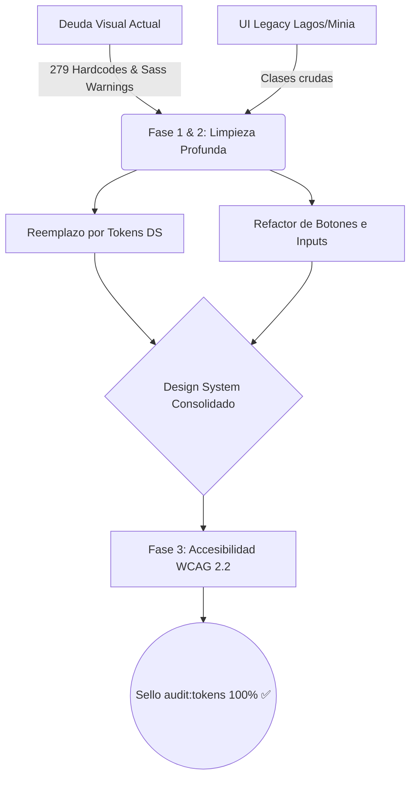

# 🎯 Plan de Remediación: Consolidación Visual Lagos/Minia y Design System
> Hacia una UI limpia, 100% tokenizada y accesible.

## 2. 📋 Metadata

| Atributo | Valor |
|---|---|
| **Módulo** | `SharedLuxuryApp / UI` |
| **Tipo de Documento** | Plan de Remediación (Derivado de Auditoría Fase 1) |
| **Origen** | Reporte de Diseño (2026-09-30) y adopción visual Lagos/Minia |
| **Estado** | **Vigente - Listo para ejecución** |
| **Referencia** | `20260930-analisis-designer-fase1.md`, `20260930-plan-shared-ui-catalogo-lagos.md` |

## 3. 🗺️ Panorama en un vistazo

## 4. 📌 Resumen Ejecutivo

Actualmente, el sistema frontend sufre de **279 colores hardcodeados** distribuidos en los módulos de negocio y arrastra advertencias obsoletas de Sass (`red()`, `green()`). Además, han quedado rastros de clases utilitarias de Lagos/Minia que no apuntan a la única fuente de verdad (nuestros tokens CSS). 
**Objetivo:** Limpiar todos los valores literales, alinear las tarjetas, botones y formularios a la estética de Lagos usando *únicamente* `var(--ds-*)` y Bootstrap 5, y garantizar los contrastes mínimos y *touch-targets* exigidos por WCAG 2.2.

## 5. 🗺️ Alcance

- **Dentro del alcance (In-Scope):**
  - Archivos `.scss` globales y de tema (`_variables.scss`, `_colors.scss`).
  - Capa de presentación (HTML/SCSS) de los módulos en `src/app/modules/**`.
  - Componentes compartidos (`src/app/shared/ui/web` y `adaptive`).
- **Fuera del alcance (Out-of-Scope):**
  - Lógica de negocio (TypeScript/Signals) o llamadas HTTP.
  - Modificación de componentes Ionic nativos (`src/app/shared/ui/mobile`), excepto para inyección de tokens.

## 6. 🏛️ Arquitectura & Diseño Técnico

1. **Purificación de Capas:** El diseño se ejecutará estrictamente sobre el flujo `@layer tokens, bootstrap, base, components, utilities`.
2. **Grid nativo Bootstrap 5:** Todo el layout de los formularios de Minia y los dashboards de Lagos se adaptará usando el Grid nativo de Bootstrap 5 y flexbox.
3. **Escala Fluida:** Se inyectará `clamp()` en `_typography.scss` para lograr *Fluid Typography*, descartando los tamaños en píxeles fijos de las plantillas originales.

## 7. 🛤️ Fases y Checklist

### Fase 1: Estabilización del Core SASS y Contraste
- [ ] Actualizar `_variables.scss` para usar `color.channel($color, "red", $space: rgb)` eliminando los warnings globales.
- [ ] Ajustar la rampa de color semántico `--ds-danger` (`#e44141` de Lagos) para asegurar que el contraste sobre blanco llegue a **4.5:1 (AA)**.
- [ ] Implementar la abstracción de fuentes en `_typography.scss` integrando `clamp()` para respuestas móviles nativas.

### Fase 2: Erradicación de Deuda Hardcodeada (El gran reemplazo)
- [ ] Ejecutar rastreo sobre los **279 casos** identificados por `audit:tokens`.
- [ ] Reemplazar instancias de `#ffffff` o `#fff` por `var(--ds-bg-surface)` o `var(--ds-neutral-0)`.
- [ ] Reemplazar colores manuales en tablas financieras y dashboards por tokens semánticos (ej. `--ds-cat-1`).
- [ ] Eliminar restos de clases estáticas heredadas de plantillas (`.p-10`, `.f-14`) por utilidades Bootstrap (`.p-2`, `.text-sm`).

### Fase 3: Touch-Targets y Accesibilidad WCAG 2.2
- [ ] Aplicar `min-height: 44px` (o equivalente en `rem`) a todos los inputs y botones interactivos web (`iw-*`, `il-*`) para cumplir con la norma WCAG 2.5.8 (Target Size).
- [ ] Configurar el script de accesibilidad (`audit:a11y`) con un `--seed` de sesión válido para atravesar el login y escanear el dashboard ya refactorizado.

## 8. 🚦 Criterios de Paso

- ✅ `npm run audit:scss-build` finaliza con **0 warnings** de deprecación de Sass.
- ✅ `npm run audit:tokens` aprueba con **0 colores hardcodeados** en el proyecto.
- ✅ La vista de catálogo muestra los botones y tarjetas con el espaciado correcto.
- ✅ `npm run audit:contrast` no reporta fallos contra el nivel AA.

## 9. ⚠️ Riesgos y Mitigaciones

| Riesgo | Probabilidad | Mitigación (Pre-mortem) |
|---|---|---|
| Reemplazar un color hardcodeado destruye un fondo con texto claro por falta de contexto. | Alta | No usar "Reemplazar Todo" ciego. Evaluar por módulo. Si el fondo se hace `--ds-bg-surface`, el texto debe ser `--ds-text-primary`. |
| Cambiar el rojo de Lagos/Minia altera el branding visual. | Media | Usar un tono ligeramente más oscuro (shade 700) solo para los textos, manteniendo el rojo base de la marca para los fondos. |

## 10. 🔗 Dependencias e Impactos

- **Impacto Transversal:** La Fase 2 tocará archivos en todos los catálogos e interfaces de `admin.luxuryapp`, `maintenance.luxuryapp` y `accounting.luxuryapp`. Se debe trabajar en un commit atómico para la sustitución CSS.

## 11. 🏁 Cierre Esperado

Se espera obtener una capa UI **totalmente madura**, alineada perfectamente al patrón Lagos/Minia, pero operando al 100% sobre nuestro motor de *Design Tokens*. Esto acelerará la velocidad de creación de nuevas pantallas a 0 deuda técnica.