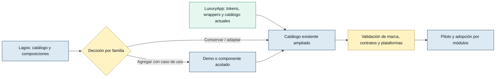

# 🎯 Reporte y plan: catálogo UI inspirado en Lagos

> Ampliar la experiencia visual sin perder la identidad ni los contratos de LuxuryApp.

## 2. 📋 Metadata y alcance de la investigación

| Campo | Valor |
|---|---|
| Fecha de corte | 2026-09-30 |
| Módulo | `SharedLuxuryApp/UI`; catálogo frontend en `admin.luxuryapp/infrastructure/catalog-component-ui` |
| Tipo | Reporte comparativo y propuesta de migración incremental |
| Estado | **Propuesta para revisión. Ningún reemplazo o alta de esta matriz está aprobado por este documento.** |
| Origen | Solicitud de analizar Lagos, estilos actuales y shared UI; conservar los colores de marca y permitir decidir qué reemplazar y qué agregar |
| Referencia pública | <https://admin.pixelstrap.net/lagos/template/calendar-basic.html> |
| Referencia local | `templates_admin/lagos/` |
| Código actual | `appsweb/angular/src/styles/`, `appsweb/angular/src/app/shared/ui/`, catálogo y servicios relacionados |
| Datos reales | Los componentes tienen consumidores de negocio; no se consultaron bases de datos. Las demos revisadas contienen datos de ejemplo. No se propone migración de datos. |
| Responsables propuestos | Dueño de producto: decisiones visuales y prioridades; Tech Lead: contratos/shared; frontend: implementación; QA: regresión |
| Documentos previos | [Plan de migración existente](../../migration-template/02-plan-migracion.md), [comparación anterior](../../migration-template/reporte-catalogo-vs-templates-admin.md), [arquitectura shared UI](../../../appsweb/angular/src/app/shared/ui/arquitectura-shared-ui.md), [plan móvil](20260924-plan-refactor-mobile-ui.md), [arquitectura móvil](20260924-arquitectura-base-mobile.md) |
| Relación con el plan previo | Este documento es el reporte y anexo de decisiones solicitado para el **catálogo Lagos**. La limpieza legacy de Fase 9 sigue perteneciendo al plan previo; las tareas coincidentes se enlazan y ejecutan una sola vez. |
| Autoridad | [CONVENTIONS.md](../../../conventions/CONVENTIONS.md), reglas UI/styles y protocolo de planes. Las propuestas de este reporte no crean convenciones nuevas. |

### Método y límites de evidencia

- Se revisaron fuentes Angular/SCSS, configuración de compilación, dependencias declaradas, rutas del catálogo, implementaciones representativas y documentación previa. Las evidencias E01–E24 están al final.
- La URL pública se consultó por HTTP: confirmó navegación, familias del catálogo y contenido estático de calendario con **Draggable Events** y **remove after drop**. Esa extracción no ejecuta las interacciones del calendario.
- El navegador automatizado no respondió; su diagnóstico también agotó el tiempo. **No hubo comparación de capturas, medición de estilos computados, contraste en DOM ni prueba interactiva de Lagos o LuxuryApp.** Esas pruebas son una puerta de implementación, no un resultado ya obtenido.
- Las versiones son rangos de `package.json`, no una certificación de versiones instaladas ni de compatibilidad de todos los paquetes. No se ejecutaron builds ni suites de la aplicación para este cambio documental.
- Una carpeta vacía no demuestra un componente disponible. Se comprobaron, por ejemplo, `web/gallery/`, `web/color-picker/` y `web/otp-input/`: sin implementación TypeScript encontrada. No se usan los totales de carpetas como conteo de componentes.
- Las ausencias se expresan como **no localizado en el alcance revisado**. El inventario compara familias y piezas verificadas; no pretende certificar cada estado de cada componente ni toda la aplicación en producción.

## 3. 🗺️ Panorama en un vistazo



**Verde:** base que se conserva. **Azul:** referencia o ampliación propuesta. **Ámbar:** decisión y verificación.

LuxuryApp ya dispone de catálogo y de una arquitectura web/móvil propia. Lagos aporta principalmente organización de ejemplos, variantes y composiciones; importar su tema completo tendría impacto transversal.

## 4. 📌 Resumen ejecutivo y Fase 0

### 4.1 Diagnóstico: ¿cómo estamos?

**Hay una base sólida de infraestructura, pero el catálogo y la documentación no describen de forma uniforme el estado real.** No es necesario comenzar desde cero.

1. **Stack actual más reciente:** LuxuryApp declara Angular `^22.1.6`, Bootstrap `5.3.8` e Ionic `9.0.3`; Lagos local declara Angular `^21.1.0` y Bootstrap `^5.3.3` [E01]. Copiar componentes y dependencias literalmente no es una migración compatible demostrada.
2. **Identidad ya centralizada:** ancla de marca `#003152`, escala azul, tokens semánticos, modo oscuro, Figtree y capas de estilos [E03–E06]. Hay valores visuales literales todavía pendientes de normalización.
3. **Catálogo existente:** `/admin/ui-catalog`, menú del Design System y **11 familias de rutas parametrizadas**: tokens, web, mobile, core, charts, patterns, layouts, docs, audit, guide y extras [E07–E08]. `WEB_ITEM_LABELS` declara **30 entradas web**; eso no significa 30 demos completas ni cobertura del 100% de shared [E09].
4. **Adopción Lagos ya parcial:** editor `ngx-editor`, rating `ngx-bar-rating`, carrusel Owl y preview `ng-gallery` ya están implementados. Volver a planearlos como sustituciones pendientes duplicaría trabajo [E12–E15].
5. **Brechas prioritarias:** coherencia del tema, exactitud de ejemplos/menús, ficha de uso por componente, comparación de variantes y separación entre calendario de eventos y selector de fecha.
6. **Diferencia visual explícita:** Lagos usa tarjeta de radio `17px`; el DS actual define radios generales de `3px`. Conservar colores no equivale a aprobar cambios de radio, densidad, sombra o tipografía [E05, E21].

**Recomendación:** conservar tokens, contratos y motores actuales; evolucionar el catálogo existente con composiciones Lagos adaptadas a LuxuryApp. Cambiar motores únicamente cuando una brecha funcional comprobada lo requiera y tenga aprobación individual.

### 4.2 Problema y objetivo

Actualmente, quienes diseñan e implementan pantallas deben contrastar código, demos y documentos que contienen diferencias entre sí cuando eligen un componente. Esto puede llevar a repetir una migración ya hecha o copiar una clase de Lagos que no existe en LuxuryApp.

**Objetivo:** disponer dentro de la aplicación Angular de un catálogo navegable comparable en claridad y variedad a Lagos, construido con componentes LuxuryApp y colores actuales, donde cada familia indique: qué existe, qué se conserva, qué se adapta, qué se incorpora y qué queda rechazado o pendiente.

### 4.3 KPIs propuestos

| Métrica | Baseline verificado | Target | Momento | Verificación |
|---|---|---|---|---|
| Familias de rutas parametrizadas | 11 [E07] | Conservar enlaces existentes; ampliaciones sólo aprobadas | Fase 2 | Recorrido automatizado de rutas y redirects |
| Entradas declaradas del catálogo web | 30 [E09] | Cada entrada publicada tiene demo válida o estado explícito; no inferir disponibilidad del nombre | Fase 2 | Contraste de registro, menú y renderizado |
| Toggle local fuera de `ThemeService` | 1 en `CatalogLayout` [E08] | 0 en el catálogo | Fase 1 | Unit + prueba light/dark en canvas y CSS |
| Textos legacy comprobados en demo calendario | 3 referencias: título `p-tag`, recomendación `p-tag`, recomendación `p-table` [E10] | 0 recomendaciones de APIs retiradas en familias intervenidas | Fase 2 | Revisión de ejemplos y código copiable |
| Familias con decisión explícita | Matriz nueva de 32 filas; todas pendientes | 100% de filas seleccionadas resueltas antes de implementar | Fase 0 | Registro de decisión, responsable y fecha |
| Cobertura de estados/contraste/rendimiento | No medida en runtime en esta investigación | Baseline medido antes de cambios; sin regresión en pilotos | Fases 0 y 6 | E2E, capturas, axe y reporte de build |

### 4.4 Reglas de aceptación trazables

Estas reglas resumen la solicitud y las convenciones existentes para este plan; no sustituyen el sistema rector.

| ID | Nivel | Regla / origen | Aplicación |
|---|---|---|---|
| RN-UI-LAG-001 | 1. Invariante | Conservar colores de marca actuales y su comportamiento claro/oscuro. Solicitud del usuario. | Tokens, Bootstrap, Ionic, canvas; Fases 1–6 |
| RN-UI-LAG-002 | 1. Invariante | Conservar contratos compartidos y fronteras web/móvil/adaptive. `CONVENTIONS.md` §3. | `shared/ui`, CVA, inputs/outputs; Fases 3–6 |
| RN-UI-LAG-003 | 2. Flujo | Cada ítem pasa por propuesta → decisión → demo → pruebas → piloto → adopción. | Matriz §5.5 y fases |
| RN-UI-LAG-004 | 2. Flujo | Un calendario de eventos y un datepicker son capacidades diferentes. | Fase 4; no sustituir uno por otro |
| RN-UI-LAG-005 | 3. Acceso | Preservar guardias existentes; acordar visibilidad del catálogo y usar datos ficticios en demos. | Ruta `ui-catalog` y demos; no inventar nuevos roles |
| RN-UI-LAG-006 | 4. Validación | Conservar validaciones de formularios, fechas y archivos; comprobar estados y teclado antes de promover. | Fases 3–6; servicios oficiales |
| RN-UI-LAG-007 | 4. Validación | Los colores resueltos en JS deben responder a `ThemeService.themeMode`. `CONVENTIONS.md` §5.6.1. | Charts y posibles adaptadores de calendario |

**Pre-mortem:** la migración falla si un CSS de Lagos sobreescribe `.btn/.card`, una demo recomienda contratos retirados, el tema cambia sólo en el DOM o se reemplaza una tabla/calendario sin preservar comportamiento. Mitigación: adaptación selectiva, catálogo verificable, servicio de tema único y pilotos reversibles. Los caminos normal, error y borde se concretan en §8.

## 5. 🗺️ Alcance, inventario y decisiones

### 5.1 Alcance del trabajo propuesto

**Incluye:** catálogo existente, documentación de clases, composiciones de referencia, adaptaciones visuales aprobadas, control de tema, demos de calendario y pilotos de consumo. Impacta shared únicamente después del análisis y aprobación correspondientes.

**No incluye en esta propuesta base:** rediseñar todos los módulos, cambiar identidad de marca, sustituir Ionic, migrar backend/BD, cambiar autenticación, integrar negocios ficticios de la plantilla o instalar todas las librerías de Lagos. Cada nueva función de negocio requiere su propio alcance.

### 5.2 Inventario actual: estilos y clases

| Capa actual | Qué existe y evidencia | Relación con Lagos | Tratamiento propuesto |
|---|---|---|---|
| Carga global | `angular.json:84–94`: CSS de proveedores, `ds-entry.scss`, `styles.scss`, animate.css; sin scripts globales [E02] | Lagos dispone de su propio bundle de tema | Conservar entrada y orden; no sumar `lagos/style.scss` |
| Fuente de color | `core/_colors.scss`: escala 50–950, marca navy, semánticos, oro documental y violeta IA [E03] | Lagos usa violeta/rosa como principal/secundario [E21] | Conservar paleta LuxuryApp; mapear por significado |
| Tokens | `theme/_variables.scss`: `--ds-*`, aliases de escalas/superficies, estados y dark [E04] | Lagos combina variables Sass y `--theme-*` | Usar DS existente; alta de token sólo si falta y se aprueba |
| Bootstrap | `web/_bootstrap-entry.scss`: bundle completo dentro de `@layer bootstrap`; DS relevante sin capa [E06] | Ambos usan Bootstrap 5.3 | Reutilizar grid/utilidades válidas; no duplicar Bootstrap ni resets |
| Botones | `_buttons.scss`: `.btn`, variantes semánticas, loading, disabled, focus; API `il-*`/`iw-*` [E11] | Lagos ofrece default/flat/edge/raised/groups | Catalogar variantes existentes; adaptar presentación mediante wrappers |
| Tarjetas | `_cards.scss`: `.card`, `.card--flat`, `--elevated`, `--bordered`, `--interactive`, acentos y `.card-grid`; `app-card` usa `.app-card*` [E11] | Basic/Creative Cards, radios y sombras propios | Alinear ambas implementaciones mediante tokens, no reemplazar todas las tarjetas |
| Formularios | `_inputs.scss`, `_forms.scss`, `_ng-select-overrides.scss`, `_flatpickr.scss`; familia `custom-input-*-signal` | Base inputs, select, mask, switch, datepicker | Mantener contratos, agregar ejemplos de composición |
| Tablas | `_tables.scss`, `_table-overrides.scss`, `_custom-table.scss`, `_financial-tables.scss`; `AppTable` [E16] | Tablas Bootstrap y demo Angular con servicio propio [E22] | Mantener motor y contratos; adoptar distribución y presentación aprobadas |
| Plataforma/overlays | `mobile/*`, `shared/_cdk-overrides.scss`, `_toast.scss`, `_sidebar.scss`, `_auth.scss` | Shell desktop y customizer Lagos | Mantener separación de plataformas y servicios actuales |
| Utilidades propias | `_utilities.scss`: `tracking-*`, `w/h-*rem`, `w-full`, `rounded-*`, `object-*`, `cursor-pointer` [E06] | Helpers `.p-10`, `.m-10`, `.f-14`, `.txt-primary` [E23] | Crear catálogo de equivalencias; no copiar nomenclatura Lagos |
| Accesibilidad/movimiento | `styles.scss`: foco global y `prefers-reduced-motion` [E06] | Demos decorativas y animaciones de la plantilla | Mantener política actual; validar interacción por componente |

**Precaución sobre utilidades:** `.p-3` de Bootstrap y `.p-10` de Lagos no comparten escala por el número. Ni los nombres `rounded-lg` implican el mismo radio. La traducción se decide por intención y por token, no por reemplazo textual.

### 5.3 Inventario actual: shared UI y catálogo

| Área | Estado comprobado | Implicación |
|---|---|---|
| `base/`, `web/`, `mobile/`, `adaptive/`, `shared/` | Arquitectura formal de lógica, implementaciones de plataforma y delegadores [E17] | Lagos no sustituye esta arquitectura |
| Botones e inputs | Bibliotecas específicas; inputs con bridges y CVA documentados; múltiples implementaciones web presentes | Preservar imports/selectores históricos necesarios; no tratar un rename como simple cambio visual |
| Componentes base del catálogo | Imports reales de accordion, badge, breadcrumbs, botones, checkbox, tablas, tabs, tag, toolbar, popover, estados e inputs [E09] | Prioridad: calidad y variantes de demos, no volver a crear primitives |
| Datos/feedback adicional | `CatalogCoreItem` implementa demos de `datagrid`, `emptystate`, `fileupload`, `funnelchart` [E18] | Son cuatro casos reales, no todos los nombres históricos de menú |
| Calendario | FullCalendar en demo, calendario de vacaciones/permisos y Google Calendar de Operations [E10, E19] | Existe motor de eventos y consumidores; no agregar `angular-calendar` por defecto |
| Charts | `ChartWrapper` usa Chart.js/ng2-charts y adaptadores de tema [E12] | No describir el estado actual como ECharts ni importar Apex por imitación |
| Editor/rating/carrusel/imagen | `ngx-editor`, `ngx-bar-rating`, Owl, `ng-gallery` dentro de wrappers propios [E13–E15] | Adopción parcial ya realizada; validar y mostrar antes de reemplazar |
| Tour | `shared/ui/shared/tour/tour.ts` y entrada en diccionario [E24] | Revisar capacidad y accesibilidad antes de proponer otro motor |
| Catálogo y menú | Ruta lazy protegida por `authGuard`, menú en sidebar; preview móvil y toggle de tema [E07–E08] | Ampliar navegación existente, sin crear un catálogo paralelo |
| Diccionario | `shared/ui-dictionary.ts` declara selector/clase/categoría/path y se identifica como generado [E18] | Validar archivos y generador; no asumir que toda entrada está vigente |
| Storybook y auditorías | Scripts de Storybook, Vitest, Playwright y audits declarados [E01–E02] | Infraestructura aprovechable; disponibilidad/configuración no equivalen a pruebas aprobadas |

### 5.4 Qué aporta Lagos y qué no es equivalente

**Página pública:** agrupa UI Kits, Bonus UI, botones, formularios, tablas, gráficas, iconos, layouts y aplicaciones de ejemplo. Su fortaleza como referencia es poder descubrir variantes dentro de una navegación reconocible.

**Paquete Angular local:** contiene familias `ui-kits`, `bonus-ui`, `buttons`, `forms`, `table`, `charts`, `calendar`, widgets y páginas. Los componentes están conectados a las librerías listadas en su `package.json`.

**No son inventarios idénticos.** El menú público incluye, por ejemplo, Draggable Card, Tour y varios motores de charts; el listado local de `bonus-ui` inspeccionado tiene 13 carpetas de demos y no todas las páginas del menú HTML. Una opción visible en la web no garantiza una implementación Angular lista para copiar.

| Característica | Lagos | LuxuryApp | Lectura para la migración |
|---|---|---|---|
| Colores | Principal `#6f5a99`, secundario `#e24175` | Marca `#003152` y tokens propios | Sustituir la paleta de referencia por roles DS, no por colores nuevos |
| Tarjetas | Radio `17px`, padding Sass `16px 24px`, sombra suave [E21] | Radio DS general `3px`; implementaciones `.card` y `.app-card` | Decisión visual independiente; conservar radio actual hasta aprobar |
| Tipografía | Variables Jost/Merriweather en plantilla [E21] | Figtree cargada localmente [E06] | Conservar Figtree; usar jerarquías/ejemplos, no importar fuentes |
| Calendario local | `angular-calendar`, mes/semana/día, eventos demo editables, colores hex y fechas con `new Date()` [E20] | FullCalendar y datepickers separados | Reutilizar FullCalendar; portar composición y estados necesarios |
| Calendario público | Panel de eventos arrastrables y opción de eliminar tras soltar | Esa interacción no queda demostrada por la demo actual | Propuesta opcional; validar plugin y reglas antes de agregar |
| Tablas locales | `BasicdatatableService`, directiva de sort, datos demo y Ngb [E22] | `AppTable`, directivas/contratos y consumidores ERP [E16] | No equivalen a un reemplazo de motor ERP |
| Iconos | Varias familias, Feather/FontAwesome y otras demos | `AppIcon`/Iconify y wrappers por plataforma | Presentar un catálogo de iconos oficial, no todas las fuentes de Lagos |
| Tema | SCSS global, variantes de color y customizer | Tokens DS, `ThemeService`, puente Bootstrap/Ionic | Adoptar demostración de variantes sin abrir un segundo sistema de tema |

### 5.5 Matriz de decisiones: conservar, reemplazar o agregar

**Leyenda:** C = conservar; V = adaptar visual/composición; A = agregar; R = reemplazar; D = diferir/no incorporar por ahora. **S/M/L:** pequeño (hasta 1 día), mediano (2–3 días), grande (4 o más días), estimación relativa por familia incluyendo revisión; no sumable automáticamente por dependencias compartidas.

**Todas las decisiones finales están pendientes.** La recomendación no preselecciona una aprobación. Puede aprobarse una demo sin aprobar cambios en los módulos de negocio.

| ID | Componente / actual | Referencia Lagos | Cambio recomendado y motivo | Esfuerzo S/M/L | Decisión final |
|---|---|---|---|---|---|
| D01 | Tokens de color y marca | Paleta violeta/rosa | **C** identidad y roles actuales. No reemplazar por paleta Lagos. | S | ✅ Aprobado C · 2026-09-30 |
| D02 | Figtree y escala tipográfica | Typography | **C + V** mostrar jerarquías, texto largo, enlaces y estados con Figtree. | S | ✅ Aprobado C+V · 2026-09-30 |
| D03 | Radios/sombras/espaciado DS | Cards redondeadas y elevación | **C** por defecto; **V** sólo con comparación aprobada. No cambiar 3px a 17px globalmente. | M | ✅ Aprobado C · 2026-09-30 |
| D04 | Grid Bootstrap y utilidades propias | Grid / Helper Classes | **A** página de clases admitidas y equivalencias. Reemplazar ejemplos de helpers incompatibles, no el framework. | M | ✅ Aprobado A · 2026-09-30 |
| D05 | Botones `il-*`, `iw-*`, variantes DS | Default, flat, edge, raised, group | **C** sin cambios: botones ya adaptados del template Minia; no tocar por esta iniciativa. | S | ⏸️ Conservar sin cambios · 2026-09-30 (base Minia) |
| D06 | `.card` y `app-card` | Basic/Creative Cards | **V** unificar decisiones visuales mediante tokens; **A** composiciones de resumen/acciones/imagen. Preservar proyección de contenido. | M | ✅ Aprobado V · 2026-09-30 |
| D07 | Badges/tags/avatares/progress | Tag & pills, avatars, progress | **C + V** tamaños, semántica y combinaciones; no introducir colores decorativos con significado de estado. | S | ✅ Aprobado C+V · 2026-09-30 |
| D08 | `custom-input-*-signal`, formularios tipados | Base Inputs, validation, mask, input groups | **C + V** ejemplos de formulario alineado, ayuda y error. No copiar inputs raw como API de features. | M | ✅ Aprobado C+V · 2026-09-30 |
| D09 | Select/multiselect y `ng-select` declarado | Select Two / typeahead | **C** contratos y opciones; **V** demo de búsqueda, vacío, carga y deshabilitado. | M | ✅ Aprobado C+V · 2026-09-30 |
| D10 | Flatpickr y wrappers de fechas/rangos | Datepicker, selector en calendar | **C** motor y servicios de fecha. **V** ejemplos de rango/fecha-hora y límites. | M | ✅ Aprobado C+V · 2026-09-30 |
| D11 | FullCalendar y demo Google | Calendar web/local | **C + V** agenda, barra y leyenda; **A** demo genérica de eventos. **D** cambio a `angular-calendar`. | L | ✅ Aprobado C+V · 2026-09-30 |
| D12 | Sin prueba actual de eventos externos arrastrables | Draggable Events de página pública | **A opcional** si se aprueba uso real, plugin compatible y reversión de errores; no asumir que `daygrid/timegrid` bastan. | L | ✅ Aprobado A opcional condicionado · 2026-09-30 |
| D13 | `AppTable` / DataGrid / variantes financieras | Basic Table / Data Tables | **C + V** densidad, filtros, paginación y estados. **D** reemplazo por servicio demo Lagos o DataTables de página HTML. | L | ✅ Aprobado C+V · 2026-09-30 |
| D14 | Dialog/handler y adaptación móvil | Modal / SweetAlert | **C + V** contratos y composición; **R** implementación interna sólo si falla criterio concreto de foco/overlay, con prueba de contratos. | L | ✅ Aprobado C+V · 2026-09-30 |
| D15 | Toasts/messages/empty/loading | Alert / Toasts | **C + V** galería de estados con servicios actuales; no crear notificador paralelo. | M | ✅ Aprobado C+V · 2026-09-30 |
| D16 | Accordion/tabs/menús/breadcrumbs | UI Kits / Breadcrumb | **C + V** jerarquía y ejemplos; validar teclado, item activo y textos extensos. | M | ✅ Aprobado C+V · 2026-09-30 |
| D17 | Upload propio y procesamiento de imágenes | Dropzone | **C + V** área de carga, progreso y errores. **D** sustituir por `ngx-dropzone` sin brecha funcional. | M | ✅ Aprobado C+V · 2026-09-30 |
| D18 | `app-image` con `ng-gallery`; preview de un elemento | Gallery / Lightbox | **C** implementación actual; **A opcional** galería multiimagen si hay consumidor, conservando preview individual. No confundir librería instalada con API de galería terminada. | M | ✅ Aprobado C + opcional · 2026-09-30 |
| D19 | Owl Carousel ya adoptado | Owl Carousel | **C + V** demos de uno/varios ítems y responsive; actualizar comentario que todavía dice NgbCarousel. | M | ✅ Aprobado C+V · 2026-09-30 |
| D20 | `ngx-bar-rating` ya adoptado | Rating: variantes | **C + V** variantes útiles y contrato disabled/readonly/cancel. No ejecutar otra sustitución. | S | ✅ Aprobado C+V · 2026-09-30 |
| D21 | `ngx-editor` en `app-editor` | Ngx Editor / otros editores demo | **C + V** ejemplos y compatibilidad HTML; **D** sumar otro editor por variedad visual. | M | ✅ Aprobado C+V · 2026-09-30 |
| D22 | Chart.js/ng2-charts y adaptadores | Charts / chart widgets | **C + V** composiciones y leyendas con tokens categóricos; **D** Apex/Chartist extra salvo tipo de gráfico necesario. | L | ✅ Aprobado C+V · 2026-09-30 |
| D23 | No se localizó pieza ribbon dedicada | Ribbons | **A opcional** primero como composición de card+badge; componente nuevo sólo si se reutiliza y requiere API. | S | ✅ Aprobado composición primero · 2026-09-30 |
| D24 | No se localizó cropper en app | Image Cropper local | **A opcional** únicamente con caso de uso; comprobar Angular 22, salida Blob/archivo y flujo de subida. | L | ✅ Aprobado A opcional condicionado · 2026-09-30 |
| D25 | `app-tour` existente | Tour anunciado en web | **C** evaluar actual; **V/A** demo y accesibilidad, sin instalar otra librería automáticamente. | M | ✅ Aprobado C + validar · 2026-09-30 |
| D26 | Iconify/AppIcon oficial | Catálogos de iconos | **C + A** explorador oficial de iconos/uso; **D** importar fuentes paralelas. | M | ✅ Aprobado C + explorador · 2026-09-30 |
| D27 | Shell y menú DS existentes | Sidebar/header/breadcrumb del template | **C + V** mejorar organización del catálogo. **D** reemplazar shell de toda la aplicación en este alcance. | M | ✅ Aprobado C+V · 2026-09-30 |
| D28 | `patterns`, `layouts`, dashboards demo | Widgets / aplicaciones Lagos | **A** recetas con componentes propios: encabezado+filtros+tabla, KPIs+chart, detalle+timeline. Cada receta debe tener utilidad real. | L | ✅ Aprobado A recetas · 2026-09-30 |
| D29 | Ionic y wrappers adaptativos | Responsive del template desktop | **C** UX móvil propia. **V** demos lado a lado; no portar el sidebar/tablas desktop sin adaptación. | M | ✅ Aprobado C · 2026-09-30 |
| D30 | Autenticación, tienda, chat, facturas, mapas de negocio | Páginas de aplicación Lagos | **D** copiar módulos completos. Sólo referencias compositivas aprobadas; funcionalidad exige plan propio. | L | ⛔ Diferido · 2026-09-30 |
| D31 | Animate.css y reduced-motion existentes | Animated/tilt/scroll effects | **C** infraestructura; **D** nuevos motores decorativos. Animaciones funcionales con preferencia reducida. | S | ✅ Aprobado C · 2026-09-30 |
| D32 | Demos, menú y diccionario con divergencias | Catálogo navegable Lagos | **R/V** reemplazar ejemplos obsoletos y entradas inconsistentes por fichas verificadas; mantener URL públicas y aliases necesarios. | L | ✅ Aprobado R/V · 2026-09-30 |

**Cómo decidir:** para cada ID registrar `Conservar / Adaptar / Agregar / Reemplazar / Rechazar / Diferir`, alcance (`sólo catálogo` o `también consumidores`), responsable, fecha y criterio. Para un reemplazo indicar explícitamente la implementación que sale, la que entra y contratos preservados. Marcar una familia como “Lagos” no define por sí solo qué se reemplaza.

### 5.5.1 Registro de decisiones (Olas 1–5 — matriz completa)

Aprobadas el 2026-09-30 por la sesión de revisión. El alcance por defecto es **catálogo/documentación**; ningún cambio llega a consumidores de negocio sin criterio de paso cumplido. Las filas aún “Pendiente” permanecen sin autorización.

**Nota de contexto (D05):** los botones web ya fueron adaptados del template **Minia**; la revisión actual no los modifica. Lagos no es la referencia de botones.

| ID | Decisión final | Alcance aprobado | Fecha | Evidencia de cierre |
|---|---|---|---|---|
| D01 | Conservar | Tokens de color y marca sin cambio de paleta | 2026-09-30 | Pendiente: confirmar par claro/oscuro en fundamentos |
| D02 | Conservar + adaptar | Página demo de tipografía con Figtree | 2026-09-30 | Pendiente: Fase 1 |
| D03 | Conservar | Radios/sombras/espaciado 3px; cambio visible fuera de alcance | 2026-09-30 | Pendiente: confirmar ausencia de cambio visual |
| D04 | Agregar | Página de utilidades/equivalencias admitidas | 2026-09-30 | Pendiente: Fase 2 |
| D05 | Conservar sin cambios | Botones intactos (base Minia) | 2026-09-30 | N/A: excluido de implementación |
| D06 | Adaptar | Unificar `.card`/`app-card` con tokens; composiciones | 2026-09-30 | Pendiente: Fase 3 |
| D07 | Conservar + adaptar | Catálogo de badges/tags/avatares/progress | 2026-09-30 | Pendiente: Fase 3 |
| D08 | Conservar + adaptar | Ejemplos de formularios oficiales | 2026-09-30 | Pendiente: Fase 3 |
| D09 | Conservar + adaptar | Estados de select/multiselect | 2026-09-30 | Pendiente: Fase 3 |
| D10 | Conservar + adaptar | Ejemplos de fecha/rango | 2026-09-30 | Pendiente: Fase 3 |
| D11 | Conservar + adaptar | Demo genérica de calendario sobre FullCalendar | 2026-09-30 | Pendiente: Fase 4 |
| D13 | Conservar + adaptar | Densidad/filtros/estados de tabla; motor intacto | 2026-09-30 | Pendiente: Fase 3 |
| D14 | Conservar + adaptar | Dialog/overlays; reemplazo interno condicionado a fallo | 2026-09-30 | Pendiente: Fase 3 |
| D15 | Conservar + adaptar | Galería de estados con servicios actuales | 2026-09-30 | Pendiente: Fase 3 |
| D16 | Conservar + adaptar | Accordion/tabs/menús/breadcrumbs + a11y | 2026-09-30 | Pendiente: Fase 3 |
| D17 | Conservar + adaptar | Upload/imágenes; sin `ngx-dropzone` por ahora | 2026-09-30 | Pendiente: Fase 3 |
| D18 | Conservar + opcional | Preview actual; multigalería solo con consumidor | 2026-09-30 | Pendiente: Fase 5 si se aprueba |
| D19 | Conservar + adaptar | Demos Owl; corregir comentario NgbCarousel | 2026-09-30 | Pendiente: Fase 3 |
| D20 | Conservar + adaptar | Variantes y contrato de rating | 2026-09-30 | Pendiente: Fase 3 |
| D21 | Conservar + adaptar | Ejemplos de editor; sin otro editor | 2026-09-30 | Pendiente: Fase 3 |
| D22 | Conservar + adaptar | Composiciones de charts; sin Apex extra | 2026-09-30 | Pendiente: Fase 3 |
| D28 | Agregar | Recetas con piezas propias (Fases 5) | 2026-09-30 | Pendiente: Fase 5 |
| D26 | Conservar + agregar | Explorador de iconos con AppIcon | 2026-09-30 | Pendiente: Fase 5 |
| D25 | Conservar + validar | Tour existente + a11y, sin nueva librería | 2026-09-30 | Pendiente: Fase 5 |
| D23 | Adoptar composición | Ribbon como card+badge; componente solo si se reutiliza | 2026-09-30 | Pendiente: Fase 5 |
| D12 | Agregar condicionado | Arrastre de eventos solo con caso real y plugin compatible | 2026-09-30 | Pendiente: Fase 4 (subtarea opcional) |
| D24 | Agregar condicionado | Cropper solo con caso de uso y compatibilidad Angular 22 | 2026-09-30 | Pendiente: Fase 5 (subtarea opcional) |
| D31 | Conservar | Animaciones actuales + reduced-motion | 2026-09-30 | Pendiente: sin implementación
| D30 | Diferido | No copiar módulos completos de Lagos | 2026-09-30 | Cerrado: fuera de alcance |
| D27 | Conservar + adaptar | Organización del catálogo; shell de la app intacto | 2026-09-30 | Pendiente: Fase 2 |
| D29 | Conservar | UX móvil propia; alinear con plan móvil 2026-09-24 | 2026-09-30 | Pendiente: Fase 2/6 |
| D32 | Reemplazar/adaptar | Corregir demos, menú y diccionario; conservar URLs/aliases | 2026-09-30 | Pendiente: Fase 2 |

**Consecuencia operativa:** las 32 decisiones están resueltas: 30 habilitan trabajo por fases, D30 queda cerrado por diferimiento y 3 altas (D12, D23, D24) requieren caso de uso antes de implementarse. Ninguna autoriza por sí sola tocar consumidores de negocio sin criterio de paso. Siguiente paso: **Fase 0** (baseline y ejecución).

### 5.6 Hallazgos verificables y prioridad

| Hallazgo | Severidad | Evidencia | Consecuencia y propuesta |
|---|---|---|---|
| H01. Tema del catálogo desacoplado del servicio | 🔴 Alta | `catalog-layout.ts:28–43` modifica clases/atributos; `chart-adapters.ts:28–33` depende de `ThemeService.themeMode` [E08, E12] | La ruta del toggle no actualiza la señal/persistencia del servicio; existe riesgo de CSS y canvas con temas distintos. Centralizar y demostrar repintado en runtime. |
| H02. Ejemplos recomiendan API anterior | Alta | `catalog-web-item.ts:1102–1108,1147` muestra `p-tag/p-table` pero renderiza `app-tag/app-table` [E10] | Se enseña un contrato distinto del componente real. Corregir textos y snippets en el mismo lote. |
| H03. Redirect de core sin caso implementado | Media | `admin.routes.ts:567` → `core/actionmenu`; `catalog-core-item.ts:9–14,39–40` sólo define cuatro casos [E07, E18] | El código conduce al fallback “Demo no disponible”. Elegir destino implementado y recorrer enlaces del menú. |
| H04. Dos tratamientos de tarjeta | Media | `_cards.scss:84–103` frente a `card.ts:54–85` [E11] | Padding, header, borde y elevación tienen reglas distintas. Aprobar referencia y alinear tokens sin romper slots. |
| H05. Tokens no cubren todos los valores usados | Alta para cambios nuevos | `_buttons.scss:45–51`, `_cards.scss:88–103`, `dialog.ts:15`, `editor.ts:34–40` [E11, E13, E16] | Hay dimensiones/espaciados literales y editor con `::ng-deep`/encapsulación global. Remediar por componente aprobado, coordinando Fase 9; no afirmar DS 100% tokenizado. |
| H06. Historial y comentarios desactualizados | Media | Comparación previa indica Quill/ECharts/NgbCarousel; código actual usa ngx-editor/Chart.js/Owl [E12–E15] | Revalidar antes de reabrir decisiones. También hay comentarios de Ngb en carrusel (resueltos). |
| H07. Catálogo mutable más grande que su registro de demos | Media | Diccionario generado, menú manual y switch de demos separados [E08–E09, E18] | Inventario, navegación y ejemplos pueden divergir. Añadir comprobación automática contra archivos/rutas/casos. |
| H08. Lagos no es un donante directo compatible | 🔴 Alta si se copia globalmente | Angular 21 vs 22; globals `.card/.btn`, paleta y radios distintos [E01, E21] | Copia masiva puede alterar toda la app y móvil. Adaptar de forma selectiva dentro de arquitectura actual. |

Los hallazgos son evidencia de código. No se declara una regresión visual reproducida donde aún falta inspección del DOM.

## 6. 🏛️ Arquitectura y diseño técnico propuestos

### 6.1 Organización del catálogo

Conservar `appsweb/angular/src/app/modules/admin.luxuryapp/infrastructure/catalog-component-ui/` y sus rutas. Proponer estas secciones de navegación, mapeadas a las familias existentes:

1. **Fundamentos:** marca, colores por rol/tema, tipografía, radios, espaciado, elevación, grid e iconos.
2. **Acciones y navegación:** botones, menús, tabs, breadcrumb, acordeón y tooltips.
3. **Formularios:** inputs oficiales, select/autocomplete, máscaras, fechas, errores y layouts completos.
4. **Datos:** tablas, cards, avatares, badges, filtros, paginación y estados de carga/vacío/error.
5. **Feedback y overlays:** mensajes, toast, confirmaciones, diálogo y file upload.
6. **Calendario y visualización:** agenda FullCalendar, charts, leyendas, timeline y composiciones de indicadores.
7. **Patrones y layouts:** recetas reproducibles con piezas actuales; referencias Lagos identificadas.
8. **Móvil/adaptativo:** equivalentes y diferencias intencionales con Ionic.
9. **Uso y calidad:** imports/selectores oficiales, accesibilidad, snippets, restricciones y estado de adopción.

Estas son categorías propuestas, no nuevas rutas aprobadas. Preferir reorganizar enlaces conservando URLs. Separar un demo pesado en lazy loading propio sólo cuando el baseline de bundle lo justifique.

**Coordinación móvil:** los documentos del 24 de septiembre ya proponen separar vistas desktop/mobile, mantener lógica común y retirar progresivamente `app-data-view-mobile`. Este anexo no reinicia ese trabajo ni congela wrappers en retirada. Las demos móviles deberán seguir las decisiones vigentes de ese plan, preservar permisos y formularios en `IonicDialogModal`, y resolver cualquier diferencia documental mediante la precedencia de `CONVENTIONS.md` antes de publicar una receta como oficial.

### 6.2 Ficha mínima por elemento

| Campo | Contenido requerido |
|---|---|
| Identidad | Nombre funcional, ID de matriz, familia, selector e import reales |
| Estado | Existente / adaptado / propuesto / deprecado; estabilidad; web/móvil/adaptativo |
| Referencia | Página Lagos y archivo local cuando exista; indicar si la referencia es sólo visual |
| Demo | Preview funcional que instancia shared UI, no una copia visual desconectada |
| Variantes | Tamaño/densidad, estados, datos vacíos/largos, loading, disabled, validación, readonly según aplique |
| Contrato | Inputs/outputs/CVA/templates utilizados, valores válidos y compatibilidad |
| Código copiable | Ejemplo ejecutable con alias `@ui`, servicios y tokens oficiales |
| Estilos/clases | Tokens consumidos, clases públicas permitidas, clases internas que no debe usar una feature |
| Accesibilidad | Teclado, nombre accesible, foco, contraste y comportamiento con movimiento reducido |
| Consumo | Cuándo usar, cuándo no, consumidor piloto y alternativas ya existentes |
| Evidencia | Pruebas/capturas light/dark, fecha, responsable y limitaciones conocidas |

Usar el diccionario actual como insumo, no como certificado. Antes de regenerarlo se debe localizar su generador real, revisar entradas duplicadas/obsoletas y enlazarlo con las demos verificadas. Evitar otra lista maestra manual sin sincronización.

### 6.3 Preservación de marca y traducción de estilos

| Referencia Lagos | Destino LuxuryApp | Regla de aplicación |
|---|---|---|
| `--theme-default`, `$primary-color` | `--ds-primary` y par `--ds-on-primary`/token de texto del componente | Respetar tema: claro deriva de primary-700; oscuro de primary-200 [E04] |
| Rosa secundario | `--ds-secondary` o rol semántico correspondiente | No mapear a peligro sólo por semejanza de color |
| Fondos tintados principales | `--ds-primary-container` + `--ds-on-primary-container` | Contrastar el par real, no sustituir sólo el fondo |
| Blanco/gris/fondo oscuro literal | `--ds-bg-surface`, `--ds-background`, `--ds-text-primary`, `--ds-border` según intención | No fijar blanco para todos los temas |
| Estado success/warning/danger/info | Roles `--ds-success`, `--ds-warning`, `--ds-danger`, `--ds-info` y sus pares | Estados además con texto/icono, no sólo color |
| Series de charts y categorías de eventos | `--ds-cat-*` / roles semánticos existentes | Resolver tokens cuando motor requiera valores concretos; repintar con el servicio de tema |
| Espaciado y helper numérico | Tokens `--ds-space-*` o utilidades Bootstrap admitidas | Comparar valor/función; no introducir una escala Lagos paralela |
| Radios y sombras | `--ds-radius-*`, `--ds-shadow-*` existentes | Mantener valores por defecto; cualquier cambio visible requiere decisión D03 |
| Fuentes e iconos | Figtree y `AppIcon` | No copiar archivos de fuentes de la plantilla por cada demo |

**Punto crítico:** mantener `#003152` como ancla no significa forzar ese hex sobre fondos oscuros. El sistema actual cambia roles semánticos en dark. Tampoco debe eliminarse el violeta propio de IA ni el oro documental por aparecer colores parecidos en Lagos: cumplen funciones diferentes.

**Clases:** documentar `.row/.col-*`, `d-flex`, alineación y gaps cuando sean utilidades ya disponibles; consumir botones/inputs a través de wrappers. Las clases Lagos `.txt-primary`, `.bg-light-primary`, `.p-10`, `.f-14` no se publican automáticamente como API LuxuryApp. Una composición que necesita CSS propio debe usar alcance del catálogo/componente y tokens existentes.

### 6.4 Calendario: propuesta específica

Separar tres contratos:

- **Selector de fecha/rango:** wrappers Flatpickr y servicios oficiales; mantiene formularios y serialización.
- **Visualización de eventos:** FullCalendar ya presente; demos genéricas de mes/semana/día, lista complementaria, leyenda, filtros y eventos ficticios.
- **Integración de negocio:** permisos, vacaciones o sincronización Google; permanecen en sus módulos. La demo no debe depender de tokens Google ni consultar datos reales.

Secuencia recomendada:

1. Inventariar opciones/plugins utilizados en `catalog-web-item`, calendario de vacaciones/permisos y `operations.luxuryapp/google-calendar`.
2. Comparar barra de herramientas, densidad, superficie de eventos y leyenda con la referencia. Reproducir sólo composición aprobada mediante DS.
3. Mantener locale español y adaptadores de fecha del proyecto. No copiar `new Date()` ni colores del arreglo demo Lagos como patrón de negocio.
4. Si D12 se aprueba, evaluar paquete/plugin de interacción compatible con FullCalendar 6.1; no está declarado en la lista revisada de dependencias. Definir comportamiento de arrastre, persistencia, fallo y duplicados antes de instalarlo.
5. Probar eventos all-day, varios días, fin exclusivo, cambio de zona horaria, cambio de mes, datos vacíos y sólo lectura.
6. Extraer una abstracción shared sólo si el análisis de los consumidores demuestra contrato común; no trasladar lógica Google o RRHH a shared.

### 6.5 Decisiones de Diseño (ADR propuestas)

| Decisión propuesta | Alternativa rechazada en la recomendación | Razón |
|---|---|---|
| Evolucionar el catálogo existente | Crear una aplicación Lagos dentro del repositorio Angular | Ya hay rutas, menú, tokens y demos aprovechables |
| Adaptar composición con DS | Importar `style.scss`/globals Lagos | Colisiones de clases, cascada, marca e Ionic |
| Mantener motores adoptados | Volver a migrar editor/rating/carrusel/imagen | El código ya incorpora librerías equivalentes |
| Mantener FullCalendar | Instalar `angular-calendar` sólo por demo local | Consumidores y stack actual ya usan FullCalendar |
| Conservar contratos ERP de tabla | Reemplazar por `BasicdatatableService` de Lagos | Servicio demo no demuestra paridad con contratos existentes |
| Unificar el tema con `ThemeService` | Toggle local del catálogo | CSS, canvas y persistencia deben observar la misma señal |
| Aprobar radio/densidad por separado | Interpretar “como Lagos” como autorización global | Son cambios perceptibles independientes de la marca |

## 7. 🛤️ Fases detalladas y checklist

Estimación orientativa: **15–25 días-persona** para la base (Fases 0–4 y 6), antes del despliegue amplio por módulos. La Fase 5 suma **4–10 días-persona** según altas aprobadas. Reestimar después del baseline; no incluye sustituir motores ni rediseñar todos los consumidores. Los roles de owner son propuestos, no asignaciones confirmadas.

### Fase 0 — Confirmación y baseline

| Owner | Esfuerzo | Dependencias | Criterio de éxito |
|---|---|---|---|
| Producto + Tech Lead + QA | 1–2 días-persona | Matriz §5.5 y plan previo | Alcance seleccionado, decisiones registradas y baseline reproducible |

- [ ] Resolver D01–D32: conservar/adaptar/agregar/reemplazar/rechazar/diferir; registrar aprobador y alcance.
- [ ] Confirmar si el objetivo visual incluye radio/sombra/densidad, además de la amplitud del catálogo.
- [ ] Reconciliar decisiones anteriores, Fase 9 y plan móvil del 24 de septiembre; evitar reabrir adopciones ya implementadas o duplicar limpieza/refactorización.
- [ ] Congelar referencias de código y lockfile; separar cambios previos del usuario al preparar implementación.
- [ ] Inventariar selectores/componentes con archivos reales, consumidores e imports; identificar carpetas vacías y entradas stale sin borrarlas por nombre.
- [ ] Recorrer las rutas actuales; registrar fallos y capturas con navegador disponible, light/dark y viewports representativos.
- [ ] Medir bundle, contraste, estado de build/tests/auditorías; registrar deuda preexistente sin ampliar baselines para ocultarla.

**Salida:** lista cerrada de familias y pilotos. Si se rechaza una fila, no se implementa por depender visualmente de otra.

### Fase 1 — Coherencia de tema y fundamentos

| Owner | Esfuerzo | Dependencias | Criterio de éxito |
|---|---|---|---|
| Frontend DS + QA | 2–3 días-persona | Fase 0; D01–D04 | Tema único; marca y cascada verificadas |

- [ ] Usar `ThemeService` desde `CatalogLayout`; eliminar estado de tema divergente sin cambiar su contrato público innecesariamente.
- [ ] Probar ida/vuelta claro↔oscuro, persistencia y chart ya montado; revisar contraste con tokens computados.
- [ ] Documentar paleta actual, roles, Figtree, radios y espacios con ejemplos reproducibles.
- [ ] Preparar mapa de clases Lagos → utilidades/tokens actuales; señalar clases internas y no soportadas.
- [ ] Coordinar normalización de literales y comentarios con Fase 9; limitar cambios a familias aprobadas.
- [ ] Mantener orden `angular.json`/capas y evitar CSS global Lagos.

**Rollback:** revertir lote de tema/fundamentos y recuperar capturas baseline; no cambiar datos ni dependencias para esta fase.

### Fase 2 — Catálogo verificable y navegación

| Owner | Esfuerzo | Dependencias | Criterio de éxito |
|---|---|---|---|
| Frontend catálogo | 3–5 días-persona | Fase 1; D32 | Menú, rutas, registro y demos seleccionadas coinciden |

- [ ] Corregir destino `core/actionmenu` o implementar caso aprobado; revisar otros enlaces con el mismo criterio.
- [ ] Reemplazar instrucciones `p-tag/p-table` y comentarios que describen motores ya retirados.
- [ ] Completar ficha §6.2 para cada familia seleccionada; exponer import, uso, estado y limitaciones.
- [ ] Sincronizar menú/sidebar, metadata y diccionario; localizar y revisar generador antes de regenerar.
- [ ] Añadir búsqueda/filtros de catálogo si se aprueban, reutilizando infraestructura existente donde cubra el caso.
- [ ] Conservar URLs existentes; usar redirects explícitos si se aprueba reorganización.
- [ ] Revisar alcance de `ViewEncapsulation.None` para que CSS de demos no afecte otras pantallas.
- [ ] Añadir verificación de enlaces/casos; distinguir “no implementado” de demo rota.

**Rollback:** volver al lote anterior de menú/demos; conservar URLs para no romper enlaces guardados.

### Fase 3 — Componentes base y composiciones

| Owner | Esfuerzo | Dependencias | Criterio de éxito |
|---|---|---|---|
| Frontend shared + QA | 4–6 días-persona | Fase 2; D05–D10, D13–D22 seleccionadas | Variantes aprobadas demostradas sin cambios de contratos |

- [ ] Pilotar card + botones + formulario: comparar diseño actual y propuesta Lagos con colores LuxuryApp.
- [ ] Alinear tokens de `.card`/`.app-card` según D06; comprobar slots, footers y contenidos extensos.
- [ ] Publicar ejemplos de validación de formularios, select vacío/carga y fechas mediante wrappers actuales.
- [ ] Validar tabla: selección, orden, lazy/paginación, plantillas, expansión/agrupación/reordenamiento donde los consumidores los requieran.
- [ ] Validar modales: foco inicial, trap/retorno de foco, Escape, backdrop, overlay anidado y scroll.
- [ ] Mostrar editor, rating, carrusel y lightbox ya adoptados; registrar límites reales en vez de migrarlos nuevamente.
- [ ] Conservar contenido HTML del editor y errores/validaciones de upload; no transformar datos existentes por un cambio visual.
- [ ] Mantener piezas mobile/adaptive independientes y verificar sus formularios representativos.

**Rollback:** lotes pequeños por familia; revertir implementación y CSS juntos manteniendo API anterior. No retirar aliases hasta demostrar ausencia de consumidores y aprobar retiro.

### Fase 4 — Calendario como piloto de referencia

| Owner | Esfuerzo | Dependencias | Criterio de éxito |
|---|---|---|---|
| Frontend + owner de calendario + QA | 2–4 días-persona | Fases 1–3; D11 y decisión D12 | Demo independiente y consumidor piloto sin regresión |

- [ ] Ejecutar comparación de los tres consumidores indicada en §6.4.
- [ ] Presentar mes/semana/día, barra, leyenda, filtros y lista de eventos con DS y español.
- [ ] Separar estados visuales genéricos de sincronización Google y de reglas RRHH.
- [ ] Si se aprueba D12, tratar interacción externa como sublote con dependencias y esfuerzo reestimados.
- [ ] Probar borde temporal/all-day y navegación por teclado; disponer de acción alternativa al arrastre.
- [ ] Aprobar comparación visual antes de tocar consumidor de negocio; después comprobar al menos un consumidor real elegido por su owner.

**Rollback:** conservar opciones y adaptadores anteriores por lote; revertir integración piloto sin alterar eventos persistidos.

### Fase 5 — Altas opcionales de catálogo

| Owner | Esfuerzo | Dependencias | Criterio de éxito |
|---|---|---|---|
| Frontend + Producto | 4–10 días-persona, opcional | D18, D23–D26, D28 aprobadas | Cada alta tiene caso de uso, demo, contrato y dependencia justificada |

- [ ] Priorizar recetas de cards/KPIs/layouts con piezas existentes.
- [ ] Aprobar individualmente galería multiimagen, ribbon o cropper; dejar ítems diferidos fuera de instalación/build.
- [ ] Comprobar APIs/peer dependencies/licencia de los paquetes seleccionados antes de incorporarlos; no copiar versiones Angular 21 por defecto.
- [ ] Mantener paquetes pesados fuera del bundle inicial cuando corresponda y medir diferencia.
- [ ] Para tour, evaluar primero `app-tour`; para iconos, usar catálogo tipado existente.
- [ ] Registrar cada alta y su consumidor; evitar publicar componentes que sólo duplican otro wrapper.

**Rollback:** retirar ruta/demo opcional y dependencia exclusivamente nueva en un lote coherente; no retirar paquetes compartidos por otra funcionalidad.

### Fase 6 — Pilotos, adopción y cierre

| Owner | Esfuerzo | Dependencias | Criterio de éxito |
|---|---|---|---|
| QA + Frontend + owners de pilotos | 3–5 días-persona | Fases base completas y altas seleccionadas | Gates §8 aprobados y aceptación de producto |

- [ ] Piloto 1: catálogo completo seleccionado, light/dark y navegación directa.
- [ ] Piloto 2: pantalla de negocio con formulario y tabla elegida por owner; conservar validación y datos.
- [ ] Piloto 3: calendario elegido en Fase 4; comprobar responsive y modo sólo lectura.
- [ ] Piloto 4: recorrido móvil/adaptativo equivalente; no exigir réplica visual desktop.
- [ ] Aprobar despliegue por lotes de módulos con lista de consumidores; no ejecutar un reemplazo global por expresión regular.
- [ ] Ejecutar checks apropiados, registrar capturas y resultados; corregir regresiones sin esconder deuda en baselines.
- [ ] Sincronizar documentación de uso, decisiones, plan previo y viewer si cambian reglas aprobadas.
- [ ] Cerrar cada ID con evidencia o dejarlo explícitamente diferido/rechazado.

**Rollback:** revertir último lote fallido conservando los ya aceptados; restablecer CSS y componentes juntos. Un fallo transversal de tema/cascada detiene nuevos lotes hasta recuperar baseline.

## 8. 🚦 Criterios de paso y automatización

| Escenario | Criterio de aceptación | Automatización / evidencia |
|---|---|---|
| Normal: descubrir y copiar | Ruta directa, menú y búsqueda llevan a demo real; snippet compila con API actual | E2E de rutas + build de ejemplos |
| Normal: cambiar tema | DOM, overlays y charts abiertos cambian juntos; preferencia consistente al navegar/recargar | Unit `ThemeService`/catálogo + E2E con estilos computados |
| Normal: marca | No cambian valores base de paleta; pares fondo/texto correctos en ambos temas | Diff de tokens + `audit:contrast` + DOM/capturas |
| Normal: formularios | Mismos valores/CVA, required, disabled, errores y envío que antes | Unit contractual + E2E de formulario piloto |
| Normal: tabla | Eventos de lazy/orden/página/selección conservados; totales correctos | Unit contractual + E2E con fixture significativo |
| Error: carga/API | Demo y piloto muestran error/reintento sin quedarse en loading | E2E con error de red simulado |
| Error: upload | Archivo inválido/grande y error de subida mantienen mensajes/estado y recuperación | Unit + E2E |
| Error: arrastre calendario | Si se habilita persistencia, fallo revierte UI y no duplica eventos | E2E del sublote D12; no exigible si se rechaza |
| Borde: calendarios | Mes/año, zona horaria, all-day y fin exclusivo sin corrimientos | Unit de adaptadores + E2E de vistas |
| Borde: accesibilidad | Teclado, foco visible, cierre y retorno de foco, etiquetas y lectura de estados | axe + revisión manual; contraste AA: 4.5:1 texto normal, 3:1 texto grande/UI donde corresponda |
| Borde: espacio | Sin pérdida funcional a 360/768/1280/1440 px, zoom 200%, textos extensos; scroll deliberado en tablas | E2E de viewport + revisión manual; anchos son casos de prueba, no breakpoints nuevos |
| Borde: movimiento | Animaciones respetan `prefers-reduced-motion` | E2E con preferencia emulada |
| Compatibilidad | Sin imports Ionic en web ni cruces prohibidos; no regresión de estilos financieros/impresión afectados | `audit:ui` + pruebas dirigidas + impresión manual si el lote toca esas capas |
| Rendimiento | No elevar presupuestos para hacer pasar un bundle nuevo; carga lazy de demos pesadas cuando haga falta | Build stats frente a baseline; budgets actuales 4.2/4.5 MB initial y 19/20 KB de component style [E02] |

Comandos **existentes** para usar durante implementación, desde `appsweb/angular`:

```powershell
npm run build
npm run audit:ui
npm run audit:ds
npm run audit:a11y
npm run audit:encoding
```

`npm run test -- run <specs-del-lote>` y `npm run test:e2e -- <spec-piloto>` se ejecutarán sobre archivos concretos existentes o creados para probar comportamiento significativo. Las rutas de esos specs se fijan en el baseline, no se inventan en este reporte. `npm run lint` sirve como cierre transversal; Storybook se valida si se modifican stories o su configuración.

**Regla de paso:** ningún resultado está verde por estar configurado. Se adjunta salida real; un fallo preexistente se registra y distingue de una regresión. No se regenera un baseline creciente para aprobar el cambio.

## 9. ⚠️ Riesgos y mitigaciones

| Riesgo | Impacto | Probabilidad | Mitigación |
|---|---|---|---|
| 🔴 Importar globals Lagos rompe cascada Bootstrap/DS/Ionic | Alta | Alta si se copia el bundle | No importar tema completo; comparar computed styles y consumidores |
| 🔴 Cambiar color/radio de toda la app sin decisión separada | Alta | Media | D01/D03; piloto visual y aprobación explícita |
| 🔴 Sustituir tabla, diálogo o calendario por demo pierde contratos | Alta | Media | Inventario de consumidores, unit contractual, E2E y rollback por familia |
| 🔴 Canvas conserva colores anteriores al toggle | Alta | Alta con toggle actual desacoplado | `ThemeService` único y prueba con chart montado |
| 🔴 Paquete Angular 21 incompatible con Angular 22 | Alta | Media | Verificar peer dependencies de cada incorporación; no trasladar package.json |
| Demos/metadata enseñan APIs obsoletas | Media | Alta según evidencia actual | Validación de snippets/rutas/diccionario y actualización coordinada |
| CSS con encapsulación global se filtra al negocio | Alta | Media | Selectores con alcance, cambios mínimos, prueba fuera del catálogo |
| Catálogo se convierte en colección de funciones sin consumidores | Media | Media | Alta opcional por ID y caso de uso; recetas antes que componentes nuevos |
| Comparación visual incompleta por navegador no disponible | Media | Confirmada en esta investigación | Capturas/DOM obligatorios en Fase 0 antes de aprobar fidelidad |
| Documento previo y este anexo generan dos ejecuciones de limpieza | Media | Media | Una tarea propietaria en Fase 9; aquí se referencia y verifica su efecto |

## 10. 🔗 Dependencias, impactos y evidencias

### 10.1 Matriz de dependencias

Versiones declaradas, no verificadas mediante instalación en esta sesión.

| Sistema | Relación | Versión | Impacto |
|---|---|---|---|
| Angular LuxuryApp / Lagos | Host / donante de referencia | `^22.1.6` / `^21.1.0` | Adaptar APIs y revisar peer dependencies, no downgrade |
| TypeScript LuxuryApp / Lagos | Compilación | `~6.0.3` / `~5.9.2` | Código importado debe compilar con configuración host |
| Bootstrap LuxuryApp / Lagos | Grid/componentes CSS | `5.3.8` / `^5.3.3` | Una carga; conservar puente DS y capas |
| Ionic | Móvil LuxuryApp | `9.0.3` | No reemplazar por responsive desktop |
| ng-bootstrap LuxuryApp / Lagos | Comportamientos web | `21.0.0` / `^20.0.0` | Reutilizar servicios aprobados, verificar comportamiento de overlays |
| ng-select LuxuryApp / Lagos | Selección | `23.2.0` / `^21.1.2` | Preservar wrappers/CVA y verificar variantes |
| FullCalendar | Motor de eventos LuxuryApp | Angular/core/daygrid/timegrid `^6.1.21` | Base propuesta de D11; interacción adicional es decisión D12 |
| angular-calendar | Demo Lagos local | `^0.31.1` | No incorporar por defecto |
| angularx-flatpickr / flatpickr | Selector de fechas LuxuryApp | `^8.1.0` / `^4.6.13` | Diferente del motor de agenda; preservar fechas y locale |
| Chart.js / ng2-charts | Charts LuxuryApp | `^4.5.1` / `^8.0.0` | Mantener adaptadores y tema reactivo |
| ApexCharts / ng-apexcharts | Demos Lagos | `^5.3.4` / `^2.0.4` | Adición opcional justificada, no requisito para parecerse a Lagos |
| ngx-editor | Editor presente en ambos | `^18.0.0` | Validar HTML y formularios, no repetir sustitución |
| ngx-bar-rating | Rating presente en ambos | `^8.0.1` | Validar estados y contrato propio |
| ngx-owl-carousel-o LuxuryApp / Lagos | Carrusel | `^22.0.0` / `^21.0.0` | Mantener versión host y API wrapper |
| ng-gallery | Preview LuxuryApp y demos Lagos | `^12.0.0` | Preview individual actual; multigalería requiere contrato |
| ngx-image-cropper | Demo Lagos | `^7.2.1` | D24 opcional; compatibilidad Angular 22 no certificada |
| Storybook / Vitest / Playwright | Verificación disponible | `^10.6.0` / `5.0.0` / `^1.63.0` | Reutilizar infraestructura; ejecución pendiente por lote |

### 10.2 Impacto por ubicación

| Ubicación | Impacto previsto |
|---|---|
| `src/styles/core`, `theme` | Identidad se conserva; cualquier alta/cambio transversal requiere aprobación |
| `src/styles/web`, `custom`, `shared`, `mobile` | Sólo ajustes de familias aprobadas y compatibilidad; coordinar Fase 9 |
| `src/app/shared/ui` | Cambios internos con contratos preservados; altas sólo por decisión de matriz |
| `src/app/modules/admin.luxuryapp/infrastructure/catalog-component-ui` | Principal superficie de demos, documentación y navegación |
| `src/app/modules/admin.luxuryapp/admin.routes.ts` | Reparación de destinos y posible ampliación manteniendo rutas |
| `src/app/core/layout/employee-view/desktop/sidebar/sidebar.ts` | Menú DS sincronizado, sin sustituir menú de negocio |
| `src/app/core/services/theme.service.ts` | Servicio existente a consumir; modificarlo sólo si se demuestra necesidad |
| Módulos Operations y Human Resources | Pilotos de calendario sujetos a owner y pruebas funcionales |
| `templates_admin/lagos` | Referencia; no runtime de LuxuryApp |
| Convenciones y planes previos | Sincronizar únicamente cambios de reglas aprobados; preservar decisiones e historial |

### 10.3 Evidencias de código

Rutas relativas a la raíz del repositorio. Los enlaces abren las fuentes; los rangos corresponden a la lectura de esta investigación y pueden desplazarse con cambios posteriores.

| ID | Fuente y líneas relevantes | Evidencia |
|---|---|---|
| E01 | [LuxuryApp package.json](../../../appsweb/angular/package.json):4–41,44–154; [Lagos package.json](../../../templates_admin/lagos/package.json):15–90 | Stack, librerías y scripts declarados |
| E02 | [angular.json](../../../appsweb/angular/angular.json):84–113,163–177 | Entradas CSS, budgets y Storybook |
| E03 | [core/_colors.scss](../../../appsweb/angular/src/styles/core/_colors.scss):23–48,76–139 | Ancla de marca y paletas especiales |
| E04 | [theme/_variables.scss](../../../appsweb/angular/src/styles/theme/_variables.scss):135–142,307–392,706–763 | Tokens, estados, pares claro/oscuro |
| E05 | [core/_borders.scss](../../../appsweb/angular/src/styles/core/_borders.scss):13–41 | Radio general 3px; comentarios de 8px no coinciden con valores |
| E06 | [ds-entry.scss](../../../appsweb/angular/src/styles/ds-entry.scss):15–39; [styles.scss](../../../appsweb/angular/src/styles/styles.scss):15–21,49–81,103–113,157–180; [_bootstrap-entry.scss](../../../appsweb/angular/src/styles/web/_bootstrap-entry.scss):17–35; [_utilities.scss](../../../appsweb/angular/src/styles/custom/_utilities.scss):5–57 | Cascada, Ionic, fuentes, accesibilidad y helpers |
| E07 | [admin.routes.ts](../../../appsweb/angular/src/app/modules/admin.luxuryapp/admin.routes.ts):550–654 | Ruta, guard, 11 familias parametrizadas y redirects |
| E08 | [catalog-layout.ts](../../../appsweb/angular/src/app/modules/admin.luxuryapp/infrastructure/catalog-component-ui/catalog-layout/catalog-layout.ts):14–43; [catalog-layout.html](../../../appsweb/angular/src/app/modules/admin.luxuryapp/infrastructure/catalog-component-ui/catalog-layout/catalog-layout.html):14–44; [sidebar.ts](../../../appsweb/angular/src/app/core/layout/employee-view/desktop/sidebar/sidebar.ts):67–222 | Tema local, preview, outlet y navegación existente |
| E09 | [catalog-web-item.ts](../../../appsweb/angular/src/app/modules/admin.luxuryapp/infrastructure/catalog-component-ui/catalog-web-item/catalog-web-item.ts):88–184 | Mapeo móvil, 30 labels y componentes reales importados |
| E10 | [catalog-web-item.ts](../../../appsweb/angular/src/app/modules/admin.luxuryapp/infrastructure/catalog-component-ui/catalog-web-item/catalog-web-item.ts):1071–1154 | FullCalendar y recomendaciones legacy |
| E11 | [_buttons.scss](../../../appsweb/angular/src/styles/web/_buttons.scss):31–115; [_cards.scss](../../../appsweb/angular/src/styles/web/_cards.scss):9–103; [card.ts](../../../appsweb/angular/src/app/shared/ui/web/card/card.ts):14–85 | Clases, tokens, literales y dos tratamientos de card |
| E12 | [chart-wrapper.ts](../../../appsweb/angular/src/app/shared/ui/web/charts/chart-wrapper.ts):8–44,67–100; [chart-adapters.ts](../../../appsweb/angular/src/app/shared/ui/web/charts/chart-adapters.ts):19–33,62–80 | Chart.js, opciones reactivas y dependencia del tema |
| E13 | [editor.ts](../../../appsweb/angular/src/app/shared/ui/web/editor/editor.ts):10–59; [rating.ts](../../../appsweb/angular/src/app/shared/ui/web/rating/rating.ts):6–42 | Motores actuales y comentarios legacy |
| E14 | [carousel.ts](../../../appsweb/angular/src/app/shared/ui/web/carousel/carousel.ts):10–38 | Owl activo frente a comentario antiguo NgbCarousel |
| E15 | [image.ts](../../../appsweb/angular/src/app/shared/ui/web/image/image.ts):8–10,71–87 | ng-gallery/lightbox; carga de un elemento |
| E16 | [table.ts](../../../appsweb/angular/src/app/shared/ui/web/table/table.ts):22–85; [dialog.ts](../../../appsweb/angular/src/app/shared/ui/web/dialog/dialog.ts):4–41; [file-upload.ts](../../../appsweb/angular/src/app/shared/ui/web/file-upload/file-upload.ts):12–62 | Contratos/directivas propios, diálogo y upload |
| E17 | [arquitectura-shared-ui.md](../../../appsweb/angular/src/app/shared/ui/arquitectura-shared-ui.md):15–47,67–108,129–145 | Capas, selectores y contratos adaptativos; estado histórico a verificar contra código |
| E18 | [catalog-core-item.ts](../../../appsweb/angular/src/app/modules/admin.luxuryapp/infrastructure/catalog-component-ui/catalog-core-item/catalog-core-item.ts):3–40; [ui-dictionary.ts](../../../appsweb/angular/src/app/modules/admin.luxuryapp/infrastructure/catalog-component-ui/shared/ui-dictionary.ts):1–20 | Cuatro demos core y metadata generada |
| E19 | [calendario-vacaciones-permisos.ts](../../../appsweb/angular/src/app/modules/human-resources.luxuryapp/time-off/leave-calendar/calendario-vacaciones-permisos.ts):9–18; [google-calendar.ts](../../../appsweb/angular/src/app/modules/operations.luxuryapp/google-calendar/google-calendar/google-calendar.ts):25–29 | Imports FullCalendar y plugins en consumidores de negocio |
| E20 | [Lagos calendar.ts](../../../templates_admin/lagos/src/app/component/calendar/calendar.ts):5–44,62–105,149–181; [calendar.html](../../../templates_admin/lagos/src/app/component/calendar/calendar.html):1–37,57–98 | angular-calendar, colores/fechas demo y composición editable |
| E21 | [Lagos style.scss](../../../templates_admin/lagos/public/assets/scss/style.scss):119–153; [utils/_variables.scss](../../../templates_admin/lagos/public/assets/scss/utils/_variables.scss):8–15,83–105,202–207; [components/_card.scss](../../../templates_admin/lagos/public/assets/scss/components/_card.scss):5–25,100–102 | Paleta, variables, radios y reglas globales Lagos |
| E22 | [Lagos data-tables.ts](../../../templates_admin/lagos/src/app/component/table/data-tables/data-tables.ts):8–32,43–50 | Tabla Angular propia de demo, no evidencia de equivalencia ERP |
| E23 | [Lagos helper-classes.html](../../../templates_admin/lagos/src/app/component/ui-kits/helper-classes/helper-classes.html):1–40; [helper-class.ts](../../../templates_admin/lagos/src/app/shared/data/data/ui-kits/helper-class.ts):186–187,688,1000,1030–1031 | Catálogo y nombres de helpers Lagos |
| E24 | [tour.ts](../../../appsweb/angular/src/app/shared/ui/shared/tour/tour.ts):13–24,26–75; [theme.service.ts](../../../appsweb/angular/src/app/core/services/theme.service.ts):5–59; [Lagos image-cropper.ts](../../../templates_admin/lagos/src/app/component/bonus-ui/image-cropper/image-cropper.ts):4–32 | Tour existente, servicio oficial de tema y cropper local de referencia |

## 11. 🏁 Cierre esperado y decisiones inmediatas

La migración se considera terminada cuando **las familias aprobadas** están navegables, documentadas, verificadas en ambos temas y probadas en consumidores piloto, conservando colores, contratos y UX móvil. No se exige replicar cada página comercial de Lagos para declarar éxito.

### Orden recomendado para aprobar

1. **Base:** D01–D04, D27, D29 y D32: marca, fundamentos, navegación, exactitud y límites de plataforma.
2. **Piloto visual:** D05–D11: botones, cards, formulario y calendario.
3. **Componentes sensibles:** D13–D22: verificar contratos y mostrar lo que ya está implementado.
4. **Opcionales:** D12, D18 ampliada, D23–D26 y D28, según caso de uso.
5. **Diferidos por defecto:** módulos completos y motores decorativos D30–D31; cualquier excepción necesita decisión individual.

### Checklist de aceptación final

- [ ] Cada fila seleccionada tiene decisión final, owner y evidencia.
- [ ] La paleta LuxuryApp y los roles dark permanecen; radios/densidad sólo cambian si fueron aprobados.
- [ ] El catálogo enseña selectores/imports actuales y no contiene destinos seleccionados sin demo.
- [ ] Tema, CSS, canvas y overlays responden de forma coherente.
- [ ] Pruebas contractuales y E2E de pilotos aprobadas; ningún fallo se oculta ampliando baselines.
- [ ] Altas opcionales justificadas; librerías existentes reutilizadas; ninguna sustitución duplicada.
- [ ] Documentación, plan previo y convenciones afectadas sincronizados según aprobación.
- [ ] Lotes reversibles y registro de ítems rechazados/diferidos conservados.

**Conclusión:** LuxuryApp necesita principalmente consolidar y hacer visible lo que ya tiene, corregir desalineaciones del catálogo y adoptar selectivamente composiciones Lagos. El reemplazo completo del sistema de estilos o de shared UI no está justificado por la evidencia revisada.
