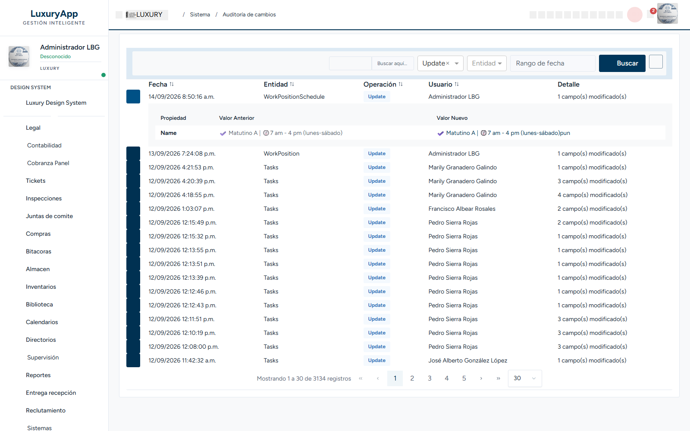

# Verificación Fase 6 — Piloto 2b: tabla anidada de auditoría

Fecha: 2026-09-15

Ruta probada: `/admin/audit-entries`

## Resultado

Se seleccionó `Update` en el filtro **Operación** y se pulsó **Buscar**. La pantalla devolvió **17 filas Update** en la primera página, con el botón de expansión habilitado.

La primera fila se expandió correctamente y mostró una segunda instancia de `app-table` con las columnas:

- `Propiedad`
- `Valor Anterior`
- `Valor Nuevo`

La fila mostró datos reales de `WorkPositionSchedule`, por ejemplo la propiedad `Name` y sus valores anterior/nuevo.

## Pruebas de ciclo de vida

| Prueba | Resultado |
|---|---|
| Expandir primera fila | Correcto; apareció la tabla anidada con datos reales. |
| Colapsar primera fila | Correcto; desapareció la tabla anidada (`0` encabezados `Propiedad`). |
| Expandir una segunda fila distinta | Correcto; apareció una nueva tabla anidada sin contenido cruzado. |
| Mantener dos filas expandidas | Correcto; se observaron `2` instancias independientes de la tabla anidada. |

## Captura

Archivo: `docs/migration-template/fase6-piloto-2b-audit-entries-nested.png` — 213,195 bytes. La fila `WorkPositionSchedule` está expandida y muestra `Propiedad / Valor Anterior / Valor Nuevo` con datos reales.

## Conclusión

La proyección de templates y la creación/destrucción dinámica mediante `@if` funcionan correctamente para tablas anidadas. No se observó contenido pegado ni colisión entre instancias. `app-table` supera esta prueba del piloto 2b para el caso anidado.

No se modificó ningún archivo de código en este paso.
