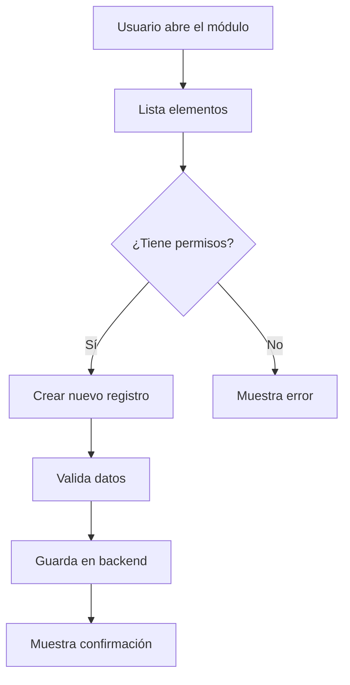
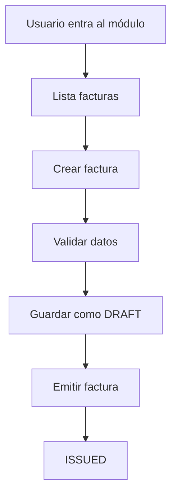

Sí, **se puede hacer**, pero hoy la forma más fiable no suele ser “un MCP mágico” que haga todo solo, sino combinar:

1. **Un agente con acceso al código** — por ejemplo OpenCode, Claude Code, Cursor, etc.
2. **Herramientas/MCPs para entender el módulo** — código, rutas, componentes, servicios, tests, base de datos, UI.
3. **Una skill/plantilla de documentación** que obligue al agente a producir una guía útil para usuarios, no solo documentación técnica.

La respuesta corta es:

> **Sí, existe el concepto y hay herramientas que ayudan, pero para generar una buena guía de usuario de un módulo concreto normalmente necesitas un agente/skill personalizado que analice el flujo del módulo y genere documentación estructurada.**

---

## 1. Lo más recomendado: OpenCode como agente de documentación

Si ya estás usando **OpenCode**, puedes usarlo directamente para esto porque tiene herramientas built-in muy útiles:

- `read`: leer archivos.
- `grep`: buscar patrones.
- `glob`: encontrar archivos por ruta.
- `edit` / `write`: crear o modificar documentación.
- `bash`: ejecutar comandos, tests, builds, etc.
- `lsp`: experimental, pero muy útil para entender llamadas, definiciones, referencias, jerarquía de llamadas, etc.
- `question`: para pedirte aclaraciones si no entiende una parte del módulo.
- `skill`: puedes cargar una skill en formato Markdown con instrucciones específicas para generar documentación.

Con eso, puedes crear una skill llamada algo así como:

```text
module-user-docs
```

Y que esa skill haga algo como:

```text
Analiza el módulo indicado.
Identifica sus flujos principales.
Detecta rutas, pantallas, endpoints, servicios, modelos, validaciones y permisos.
Entiende qué problema resuelve para el usuario.
Genera una guía de usuario en Markdown.
Incluye casos de uso, pasos, ejemplos, errores comunes y diagramas.
No inventes funcionalidades.
Marca como PENDIENTE lo que no puedas verificar.
```

---

## 2. MCPs/herramientas que ayudan a analizar el módulo

No hay un único MCP oficial que haga exactamente “analizar módulo → generar guía de usuario”, pero sí puedes combinar varios.

### A. Para analizar código local

Si usas OpenCode, muchas veces no necesitas un MCP externo porque ya trae:

```text
read
grep
glob
lsp
bash
write
```

Pero si estás usando otro cliente MCP, puedes usar:

| Necesidad                                | MCP/herramienta útil                        |
| ---------------------------------------- | ------------------------------------------- |
| Leer archivos locales                    | Filesystem MCP                              |
| Buscar código                            | grep/ripgrep, Git, Sourcegraph              |
| Entender símbolos, referencias, llamadas | LSP MCP o herramientas de code intelligence |
| Analizar repo completo                   | GitHub MCP, Sourcegraph MCP, Greptile       |
| Convertir repo a texto para LLM          | Repomix, gitingest, code2prompt             |

---

### B. Para analizar repositorios remotos

Si el módulo está en GitHub/GitLab:

#### GitHub MCP Server

El MCP oficial de GitHub puede servir para:

- Leer archivos del repo.
- Buscar código.
- Ver issues.
- Ver pull requests.
- Revisar ramas.
- Entender cambios recientes.

Es útil si quieres que la documentación también considere:

- Issues relacionados.
- Bugs conocidos.
- Features recientes.
- Comentarios de PRs.
- Cambios históricos del módulo.

---

### C. Para entender el flujo real de usuario

Si el módulo tiene interfaz gráfica, solo leer código no basta. Para generar una guía de usuario real conviene analizar la UI.

Ahí ayudan MCPs o herramientas de automatización de navegador:

| Necesidad                            | Herramienta/MCP           |
| ------------------------------------ | ------------------------- |
| Abrir la app web                     | Playwright MCP            |
| Navegar pantallas                    | Browser MCP / Playwright  |
| Hacer screenshots                    | Playwright                |
| Detectar botones, formularios, rutas | Playwright + análisis DOM |
| Simular flujos de usuario            | Playwright tests          |

Por ejemplo, si tu módulo es una pantalla de facturación, el agente puede:

1. Abrir la ruta `/invoices`.
2. Detectar botones principales.
3. Identificar campos de formulario.
4. Simular creación de una factura.
5. Capturar screenshots.
6. Generar una guía paso a paso.

Esto es mucho más potente que solo leer código.

---

### D. Para entender bases de datos

Si el módulo depende mucho de datos, puedes conectar MCPs de base de datos:

- PostgreSQL MCP.
- MySQL MCP.
- Supabase MCP.
- Neon MCP.
- SQLite MCP.

Esto sirve para documentar:

- Entidades.
- Relaciones.
- Estados.
- Campos obligatorios.
- Restricciones.
- Datos de ejemplo.
- Flujos de creación/edición/borrado.

---

### E. Para generar diagramas

No necesitas necesariamente un MCP para esto. El agente puede generar diagramas directamente en Markdown usando **Mermaid**.

Ejemplo:



Luego puedes renderizar esos diagramas en:

- GitHub.
- GitLab.
- Docusaurus.
- Mintlify.
- Obsidian.
- VS Code.
- MkDocs con plugin Mermaid.

---

## 3. Herramientas especializadas que ya hacen algo parecido

Existen herramientas que generan documentación a partir de repositorios, pero con matices.

### DeepWiki / herramientas tipo wiki automática

Hay herramientas orientadas a generar una especie de wiki a partir de un repositorio. Sirven mucho para entender proyectos, pero normalmente están más orientadas a:

- Arquitectura.
- Componentes.
- Relaciones entre archivos.
- Explicación técnica.

No siempre producen una buena **guía de usuario final**.

---

### Swimm

Swimm está pensado para documentación acoplada al código.

Es bueno para:

- Documentación técnica.
- Mantener docs actualizadas.
- Vincular documentación con archivos específicos.
- Onboarding de desarrolladores.

Pero no necesariamente genera una guía de usuario final lista para negocio.

---

### Mintlify

Mintlify es más una plataforma para documentación bonita y mantenible.

Sirve mucho para:

- Docs de producto.
- Docs de API.
- Guías públicas.
- Documentación de SDKs.

Pero normalmente necesitas que alguien escriba o genere el contenido inicial. Puede combinarse con IA.

---

### Doxygen / JSDoc / TypeDoc / Sphinx / pydoc

Son excelentes para documentación técnica automática:

- Funciones.
- Clases.
- Métodos.
- Parámetros.
- Tipos.
- APIs.

Pero no están pensados para entender el flujo de usuario de un módulo y generar una guía funcional para usuarios.

Ejemplo:

```ts
/**
 * Crea una factura.
 */
export function createInvoice(data: InvoiceInput) {
  // ...
}
```

Eso genera documentación técnica, pero no necesariamente:

- Para qué sirve el módulo.
- Qué problema resuelve.
- Cómo lo usa un usuario.
- Qué pasos sigue.
- Qué errores puede encontrar.

---

### Sourcegraph Cody / Greptile / herramientas de comprensión de código

Este tipo de herramientas sirven para responder preguntas sobre el código:

- ¿Dónde está la lógica de X?
- ¿Qué archivos intervienen en este flujo?
- ¿Qué cambia cuando hago esta acción?
- ¿Qué servicios usa este módulo?
- ¿Quién llama a esta función?

Pueden ser muy útiles como base para luego generar documentación, pero normalmente no producen por sí solas una guía de usuario completa y curada.

---

## 4. La mejor solución práctica: crear una skill personalizada

Para tu caso, yo te recomendaría crear una **skill o prompt maestro** que convierta a OpenCode/Claude Code/Cursor en un “documentador de módulos”.

La idea es que le digas:

```text
Analiza el módulo X y genera una guía de usuario.
```

Y el agente haga un proceso estructurado.

---

## 5. Ejemplo de skill para generar documentación de módulo

Puedes crear algo como:

```md
# Skill: module-user-docs

## Objetivo

Analizar un módulo de la aplicación y generar documentación clara para usuarios del módulo.

## Entrada

- Ruta del módulo: MODULE_PATH
- Nombre del módulo: MODULE_NAME
- Archivo de salida: OUTPUT_FILE

## Proceso

1. Identificar el propósito del módulo.
2. Detectar archivos principales:
   - rutas
   - controladores
   - componentes
   - servicios
   - modelos
   - validaciones
   - tests
   - migraciones
   - permisos
3. Analizar el flujo principal del usuario.
4. Identificar acciones disponibles:
   - crear
   - leer
   - actualizar
   - eliminar
   - aprobar
   - exportar
   - importar
   - buscar
   - filtrar
   - configurar
5. Identificar roles o permisos necesarios.
6. Identificar estados del módulo.
7. Identificar errores comunes.
8. Generar un diagrama de flujo en Mermaid.
9. Generar documentación en Markdown.
10. No inventar comportamiento.
11. Si algo no está claro, marcarlo como:
    `PENDIENTE: confirmar con el equipo`

## Formato de salida

La documentación debe contener:

1. Nombre del módulo
2. Resumen ejecutivo
3. Para qué sirve
4. Usuarios objetivo
5. Conceptos clave
6. Flujo principal
7. Diagrama de flujo
8. Casos de uso
9. Paso a paso para usuario
10. Permisos necesarios
11. Estados posibles
12. Errores comunes
13. Preguntas frecuentes
14. Limitaciones conocidas
15. Futuras mejoras detectadas
16. Archivos relevantes para desarrolladores
```

---

## 6. Prompt listo para usar en OpenCode

Si no quieres armar una skill todavía, puedes usar un prompt como este:

```text
Actúa como un analista funcional y technical writer.

Analiza el módulo ubicado en:

src/modules/invoices

Tu objetivo es generar documentación para usuarios de ese módulo.

No escribas solo documentación técnica. Quiero una guía funcional que explique:

- Qué hace el módulo.
- Para qué sirve.
- Quiénes lo usan.
- Qué acciones puede hacer un usuario.
- Cuál es el flujo principal.
- Qué datos maneja.
- Qué validaciones tiene.
- Qué estados existen.
- Qué errores pueden ocurrir.
- Qué pasos debe seguir un usuario para usarlo correctamente.

Haz lo siguiente:

1. Lee los archivos relevantes del módulo.
2. Busca rutas, componentes, controladores, servicios, hooks, stores, modelos, tests y validaciones.
3. Identifica endpoints o llamadas a backend.
4. Identifica acciones visibles para el usuario.
5. Identifica permisos o roles si existen.
6. Genera un diagrama Mermaid del flujo principal.
7. Genera una guía en Markdown para usuarios.
8. Si algo no está claro, no lo inventes. Márcalo como "PENDIENTE".
9. Guarda la documentación en:

docs/modules/invoices.md

Usa un tono claro, práctico y orientado a usuarios.
```

---

## 7. Versión más avanzada con análisis de UI

Si el módulo tiene interfaz web, puedes mejorar mucho el resultado con algo así:

```text
Analiza el módulo ubicado en src/modules/invoices.

Además del código, usa Playwright para explorar la aplicación en local.

1. Abre la ruta principal del módulo.
2. Detecta botones, formularios, tablas y acciones visibles.
3. Toma screenshots de las pantallas principales.
4. Identifica el flujo de creación, edición y eliminación si existe.
5. Usa esa información para generar una guía de usuario.
6. Incluye referencias a los screenshots en la documentación.
7. No expongas datos reales ni credenciales.
8. Si no puedes ejecutar la app, genera la documentación solo desde código y marca lo pendiente.
```

Esto ya te permite generar documentación más parecida a:

```md
## Cómo crear una factura

1. Entra al módulo de Facturas.
2. Haz clic en "Nueva factura".
3. Completa cliente, fecha y monto.
4. Revisa los impuestos.
5. Haz clic en "Guardar".
6. El sistema mostrará una confirmación.
```

En vez de solo:

```md
El módulo invoices contiene InvoiceService, InvoiceController y InvoiceRepository.
```

---

## 8. Ejemplo de documentación que debería generar

Una buena guía de módulo debería verse así:

````md
# Módulo de Facturas

## Resumen

El módulo de facturas permite crear, consultar, editar y cancelar facturas asociadas a clientes.

## ¿Para qué sirve?

Sirve para que el equipo de administración registre facturas, controle pagos y consulte el historial fiscal.

## Usuarios principales

- Administradores
- Contabilidad
- Soporte

## Flujo principal

1. El usuario entra a /invoices.
2. El sistema muestra la lista de facturas.
3. El usuario puede crear una nueva factura.
4. El sistema valida cliente, monto e impuestos.
5. La factura se guarda con estado DRAFT.
6. Al publicarse, pasa a estado ISSUED.
7. Puede ser pagada o cancelada.

## Estados

| Estado   | Significado         |
| -------- | ------------------- |
| DRAFT    | Factura en borrador |
| ISSUED   | Factura emitida     |
| PAID     | Factura pagada      |
| CANCELED | Factura anulada     |

## Diagrama


````

````

---

## 9. MCPs recomendados según tu objetivo

### Si quieres documentación técnica automática

Usa:

- Doxygen.
- JSDoc.
- TypeDoc.
- Sphinx.
- pydoc.
- Godoc.
- Rustdoc.

Ideal para:

- APIs internas.
- Librerías.
- SDKs.
- Funciones.
- Clases.
- Métodos.

---

### Si quieres documentación de repo completa

Usa:

- OpenCode + skill personalizada.
- DeepWiki o similar.
- Sourcegraph/Cody.
- Greptile.
- Repo-to-text / Repomix / gitingest.

Ideal para:

- Onboarding técnico.
- Entender arquitectura.
- Generar wiki interna.

---

### Si quieres guía para usuarios de un módulo

Usa:

- OpenCode/Claude Code/Cursor.
- Filesystem/code tools.
- GitHub MCP.
- LSP.
- Playwright MCP si hay UI.
- Database MCP si hay datos importantes.
- Plantilla de documentación funcional.

Ideal para:

- Manuales de módulo.
- Guías de uso.
- Documentación funcional.
- Documentación para soporte.
- Documentación para negocio.

---

## 10. Mi recomendación concreta

Si lo que quieres es:

> “analizar el flujo de un módulo, entender cómo funciona y generar una guía para usuarios”

La mejor opción es:

```text
OpenCode + skill personalizada + herramientas de código + opcionalmente Playwright MCP
````

No depender solo de un generador automático de docs técnicas.

---

## 11. Arquitectura sugerida

```text
Usuario pide:
"Documenta el módulo de pagos"

Agente:
1. Lee src/modules/payments
2. Busca rutas, componentes, servicios, modelos
3. Analiza llamadas entre archivos
4. Revisa tests
5. Revisa endpoints
6. Si hay UI, navega con Playwright
7. Genera diagrama Mermaid
8. Genera guía funcional
9. Guarda docs/modules/payments.md
10. Marca incertidumbres como PENDIENTE
```

---

## 12. Ejemplo de flujo para OpenCode

```text
Analiza el módulo `src/modules/payments`.

Quiero generar una guía para usuarios, no documentación técnica profunda.

Pasos:

1. Identifica el propósito del módulo.
2. Detecta archivos principales.
3. Identifica rutas y pantallas.
4. Identifica endpoints y servicios.
5. Identifica acciones que puede hacer un usuario.
6. Identifica validaciones, estados y errores.
7. Identifica roles/permisos.
8. Genera un diagrama Mermaid.
9. Escribe una guía clara en Markdown.
10. Guarda el resultado en `docs/modules/payments.md`.

No inventes comportamiento. Si algo no está claro, escribe:

PENDIENTE: confirmar comportamiento con el equipo.
```

---

## 13. Respuesta final

Sí, **se puede construir**, pero no hay una única herramienta perfecta que haga todo automáticamente con calidad de producto final.

Lo más efectivo es:

```text
OpenCode o agente similar
+
acceso al código
+
LSP / búsqueda / GitHub MCP
+
opcionalmente Playwright MCP para UI
+
una skill/plantilla de documentación funcional
```

Con eso puedes pedirle:

```text
Genera la guía de usuario del módulo X
```

Y obtener algo como:

```text
docs/modules/X.md
```

Con:

- Qué hace el módulo.
- Para qué sirve.
- Quién lo usa.
- Flujo principal.
- Casos de uso.
- Paso a paso.
- Estados.
- Errores.
- Diagrama.
- Pendientes por confirmar.

Si me dices tu stack —por ejemplo Next.js, Laravel, Django, Spring, React Native, etc.— y la ruta del módulo que quieres documentar, te puedo armar una skill o prompt exacto para ese caso.
