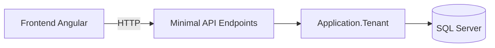
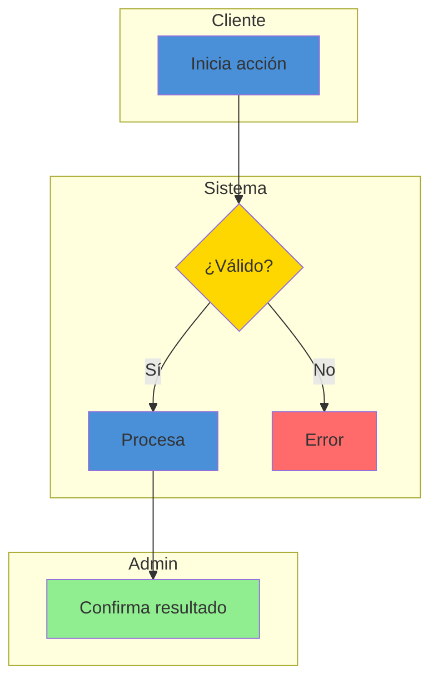
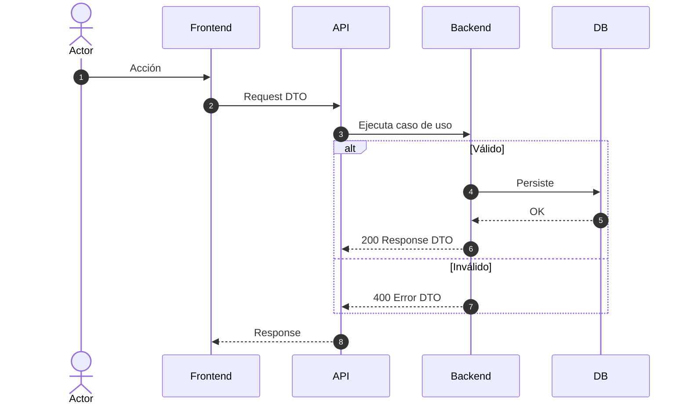

# [NOMBRE DEL MÓDULO] — Documentación Técnica

> **Ruta**: 📂 Documentación > 💼 [Dominio]
> **📅 Última Revisión**: [seguir CONVENTIONS.md §11 para formato]
> **🛡️ Estado**: ✅ Vigente / En actualización / ⚠️ Obsoleto
> **👤 Responsable**: @nombre-responsable

---

## 📑 Tabla de Contenidos

1. [Resumen Ejecutivo](#-resumen-ejecutivo)
2. [Visión Funcional](#-visión-funcional)
3. [Arquitectura Técnica](#-arquitectura-técnica)
4. [API Endpoints](#-api-endpoints)
5. [Flujo del Sistema](#-flujo-del-sistema)
6. [Componentes Frontend](#-componentes-frontend)
7. [Reglas de Negocio](#-reglas-de-negocio)
8. [Matriz de Permisos](#-matriz-de-permisos)
9. [Catálogo de Roles del Sistema](#-catálogo-de-roles-del-sistema)
10. [Base de Datos](#-base-de-datos)
11. [Performance](#-performance)
12. [Glosario de Términos](#-glosario-de-términos)
13. [Checklist de Validación](#-checklist-de-validación)
14. [Historial de Cambios](#-historial-de-cambios)

> [!NOTE]
> Los anclas (`#-visión-funcional`) usan el slug que genera el renderizador a partir del título. Con acentos el slug varía entre GitHub, VS Code y otros; verifica que cada enlace del TOC apunte al título real tras generar el documento.

---

## 🎯 Resumen Ejecutivo

**Propósito**: [Descripción en 2-3 líneas]
**Actores Involucrados**: [Roles de ApplicationRoleEnum]
**Dependencias**: [Módulos relacionados]
**Alcance**: ✅ Incluye / ❌ No incluye

## 🔍 Visión Funcional

Historias de usuario con criterios de aceptación.

## 🏗️ Arquitectura Técnica

Diagrama de componentes + tabla de tecnologías.

## 🌐 API Endpoints

### Tabla General

| Método | Path | Roles | Request DTO | Response DTO | Códigos HTTP |
|--------|------|-------|-------------|--------------|--------------|

### Detalle por Endpoint

Por cada endpoint documentar:
- Método y path completo
- Roles permitidos (nombres exactos de `ApplicationRoleEnum`)
- Request: DTO, headers, query params, ejemplo JSON
- Response: DTO por cada código HTTP (200, 201, 400, 404, 500), ejemplo JSON
- Validaciones: reglas de negocio por campo (`[Required]`, `[MaxLength]`, rangos)
- Códigos de error personalizados

## 🔄 Flujo del Sistema

Flowchart con swimlanes por actor/rol + diagrama de secuencia + escenarios. Colores obligatorios (§11): verde `#90EE90` éxito, amarillo `#FFD700` decisión, azul `#4A90D9` proceso, rojo `#FF6B6B` error.

## 🖥️ Componentes Frontend

### Routing

| App (§14) | Ruta | Componente | Lazy loading | Guard | Menú |
|-----------|------|------------|--------------|-------|------|

### Catálogo de Componentes

Por cada componente: selector, ruta relativa, tipo (web/mobile/adaptive/shared), inputs, outputs, signals, servicios, estilos, testing, comportamiento.

## 📜 Reglas de Negocio

Catálogo RN-XXX con condición y acción en formato SI/ENTONCES.

> [!IMPORTANT]
> Toda regla se documenta como `SI [condición] ENTONCES [acción]` (§11). Ejemplo: `RN-001 — SI el usuario no pertenece al Tenant ENTONCES la consulta no devuelve el registro`.

## 🔐 Matriz de Permisos

Roles vs acciones, usando nombres de `ApplicationRoleEnum`. Agrupados por RoleType. Solo roles relevantes al módulo.

## 🗄️ Catálogo de Roles del Sistema

Si el módulo introduce nuevos roles o permisos, documentar aquí.

## 🗄️ Base de Datos

Diagrama ER + tablas con columnas principales e índices.

## ⚡ Performance

Lazy loading, caché, N+1 queries, bundle size, infinite scroll.

## 📖 Glosario de Términos

Términos de negocio específicos del módulo.

## ✅ Checklist de Validación ([CONVENTIONS.md §11](../../CONVENTIONS.md#11-estándares-de-documentación))

> [!NOTE]
> El link a `CONVENTIONS.md` asume que el documento vive en `docs/<modulo>/`. Si la doc va en la raíz del propio módulo (§11), ajusta la profundidad relativa (`../../../…`) o usa la ruta desde la raíz del repo.

- [ ] CERO mojibake (UTF-8 sin BOM)
- [ ] CERO `any` en TypeScript
- [ ] Fechas en formato `dd-MMM-yy`
- [ ] Endpoints front/back coinciden carácter a carácter
- [ ] Diagramas Mermaid válidos (flowchart swimlanes + sequence con `autonumber`)
- [ ] Colores Mermaid según §11 (verde/amarillo/azul/rojo)
- [ ] Reglas de negocio en formato `SI/ENTONCES` (`RN-xxx`)
- [ ] Roles usan nombres exactos de `ApplicationRoleEnum`
- [ ] Mobile responsive: §15 aplicado según tipo de vista
- [ ] Sin PII en logs
- [ ] Emojis consistentes · Todo en español

## 📝 Historial de Cambios

| Fecha | Versión | Autor | Cambios |
|-------|---------|-------|---------|
| [seguir CONVENTIONS.md §11] | 1.0 | @nombre | Documentación inicial |
