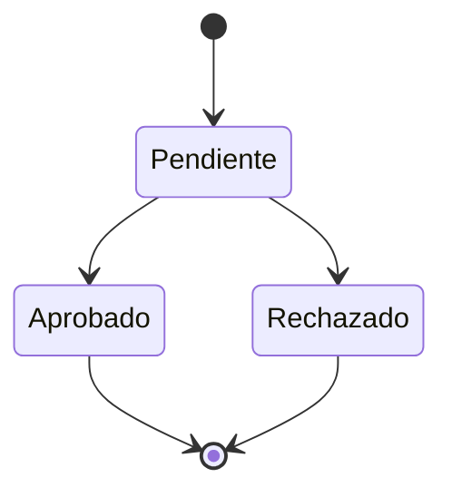
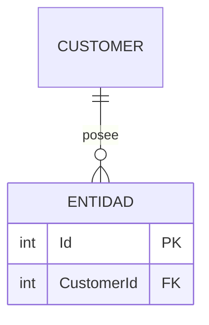
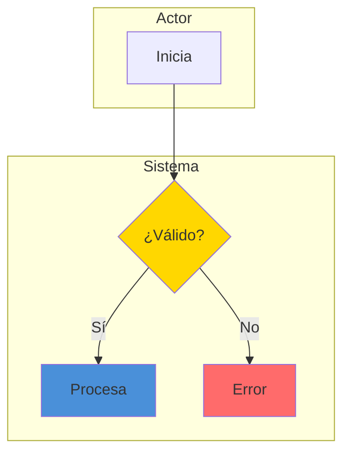
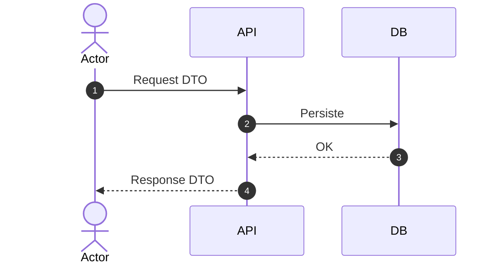

# [Módulo] — Plan de Implementación

> **Ruta**: 📂 Documentación > 📋 Planes > [Módulo]
> **📅 Última Revisión**: [seguir CONVENTIONS.md §11]
> **🛡️ Estado**: ✅ Activo / ⏸️ En pausa / ❌ Cancelado
> **👤 Responsable**: @nombre

---

## 🎯 Resumen Ejecutivo

**Propósito:** [2-3 líneas]
**Contexto:** [Relación con Tenant/Customer]
**Valor de negocio:** [Problema que resuelve]
**Origen:** [Link al audit que lo origina, si aplica]

### Trazabilidad Audit ↔ Plan

Si el plan proviene de un audit, cruza cada hallazgo con la tarea que lo resuelve.

| Hallazgo | Tarea | Fase |
|----------|-------|------|
| H-001 | T-001 | Fase 1 |

---

## 📐 Análisis de Contexto y Reutilización

### Modelos existentes que se reutilizan

| Modelo actual | Uso en el módulo |
|---------------|------------------|
| `Customer` | Tenant dueño de los datos |
| `Property` | [Uso específico] |
| [Otros] | [Uso específico] |

### Decisiones de reutilización

- NO duplicar catálogos existentes
- Ubicar en `Tenant/Operations/[Modulo]/`
- No salir del contexto Tenant

### Ubicación en el repo

```text
api/LuxuryApp.Infrastructure.Data/Data/Entities/Tenant/Operations/[Modulo]/
api/LuxuryApp.Application.Tenant/Tenant/Operations/[Modulo]/
```

---

## 🎯 Alcance del MVP

### ✅ Sí entra | ### ❌ No entra

---

## 🗺️ Diseño del Dominio

### Nuevas entidades (campos, tipos, reglas)

### Enums

### Máquina de estados (`stateDiagram-v2` Mermaid)



---

## 🔐 Reglas Tenant Obligatorias

> [!WARNING]
> Aislamiento multi-tenant: ningún dato puede cruzar tenants. Un fallo aquí es un hallazgo 🔴 Crítico de seguridad.

1. Todo registro lleva `CustomerId`
2. Toda consulta filtra por `currentUser.CustomerId`
3. Ningún dato cruza tenants
4. [Reglas específicas del módulo]

---

## 📊 Diagramas Mermaid

ER de entidades + flowchart con swimlanes + sequence diagram. Colores §11: verde `#90EE90`, amarillo `#FFD700`, azul `#4A90D9`, rojo `#FF6B6B`.







---

## 🔄 Flujos Implementables

### Flujo A — [Nombre]: pasos numerados

---

## 📦 Contratos DTO

### Requests | ### Responses

---

## 🧩 Servicios

Interfaz, métodos, responsabilidades.

---

## 🌐 Endpoints

Path, método, permisos por rol (`ApplicationRoleEnum`).

---

## 🖥️ Frontend por App (CONVENTIONS.md §14)

| App | Pantallas |
|-----|-----------|
| `resident.luxuryapp/` | ... |
| `security.luxuryapp/` | ... |
| `admin.luxuryapp/` | ... |
| `shared/ui` | Componentes compartidos |

---

## Background Jobs

| Job | Schedule | Acción |
|-----|----------|--------|

---

## ⚠️ Riesgos y Dependencias

| Riesgo | Probabilidad | Impacto | Mitigación |
|--------|-------------|---------|------------|

---

## 🗺️ Fases de Implementación

Cada tarea lleva ID `T-XXX` (para trazar con hallazgos `H-XXX`) y checkbox `- [ ]`. Marcar `- [x]` al completar.

### Fase N: [Nombre]

**Estado:** ✅ / 🔄 / ⏳ / ⬜
**Dependencia:** [Fase anterior]

- [ ] **T-001** Tarea 1
- [x] **T-002** Tarea 2 (completada)
- [ ] **T-003** Build y tests pasan

---

## 📈 Progreso General

| Fase | Checkboxes | Estado | % |
|------|-----------|--------|---|
| Fase 1 | N/M ✅ | ✅ | 100% |
| **Total** | **N/M ✅** | — | **N%** |

---

## ✅ Checklist de Validación ([CONVENTIONS.md §11](../../CONVENTIONS.md#11-estándares-de-documentación))

- [ ] Fechas en `dd-MMM-yy`
- [ ] Filename `YYYYMMDD-descripcion-plan.md`
- [ ] Diagramas Mermaid (ER + flowchart + sequence + state)
- [ ] Fases con checkboxes `- [ ]`/`- [x]`
- [ ] Tareas con ID `T-XXX`; si viene de audit, mapeadas `H-XXX ↔ T-XXX`
- [ ] Colores Mermaid según §11 (verde/amarillo/azul/rojo)
- [ ] Entidades con campos y reglas
- [ ] Frontend mapeado por app
- [ ] Riesgos identificados
- [ ] Roles usan nombres de `ApplicationRoleEnum`
- [ ] Mobile responsive: §15 aplicado (patrón correcto según tipo de vista, mobile UX, performance)
- [ ] CERO mojibake
- [ ] Todo en español

---

## 📝 Historial de Cambios

| Fecha | Versión | Autor | Cambios |
|-------|---------|-------|---------|
| [seguir CONVENTIONS.md §11] | 1.0 | @nombre | Plan inicial |
