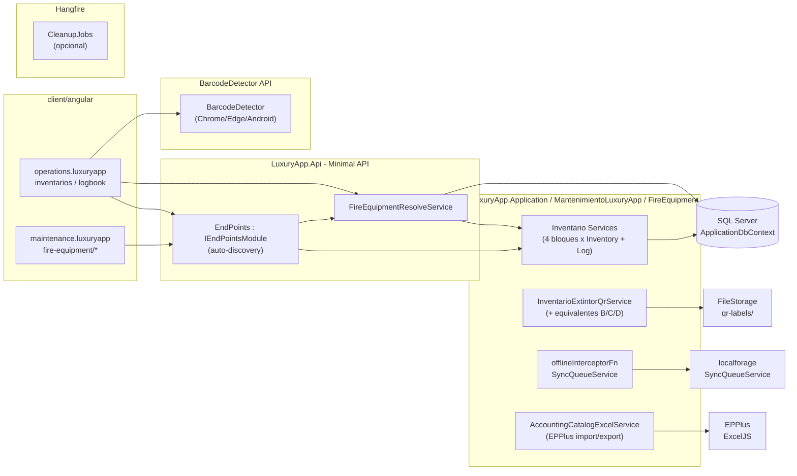
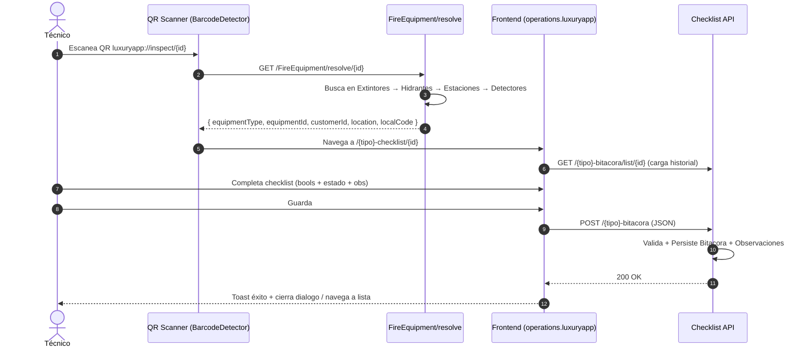
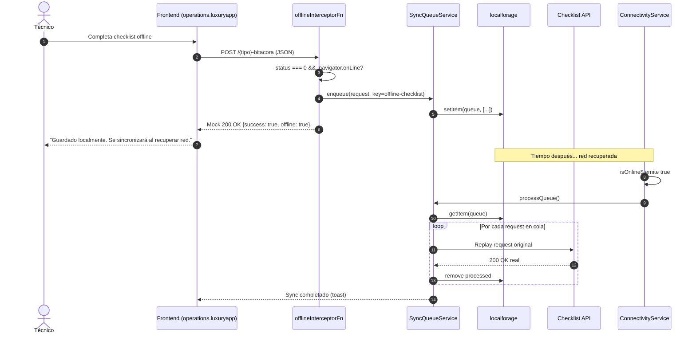

# Fire Equipment Inspection (Equipos Contra Incendio) — Documentación Técnica

> **Ruta**: 📂 Documentación > 💼 Mantenimiento > 🔥 Equipos Contra Incendio
> **📅 Última Revisión**: 13-jul-26
> **🛡️ Estado**: ✅ Vigente
> **👤 Responsable**: @equipo-mantenimiento

---

## 📑 Tabla de Contenidos

1. [Resumen Ejecutivo](#-resumen-ejecutivo)
2. [Visión Funcional](#-visión-funcional)
3. [Arquitectura Técnica](#-arquitectura-técnica)
4. [API Endpoints](#-api-endpoints)
5. [Flujo del Sistema](#-flujo-del-sistema)
6. [Componentes Frontend](#-componentes-frontend)
7. [Reglas de Negocio](#-reglas-de-negocio)
8. [Matriz de Permisos](#-matriz-de-permisos)
9. [Catálogo de Roles del Sistema](#-catálogo-de-roles-del-sistema)
10. [Base de Datos](#-base-de-datos)
11. [Performance](#-performance)
12. [Glosario de Términos](#-glosario-de-términos)
13. [Checklist de Validación](#-checklist-de-validación)
14. [Historial de Cambios](#-historial-de-cambios)

---

## 🎯 Resumen Ejecutivo

**Propósito**: Sistema de inspección de equipos contra incendio que registra inventario físico e historial de inspecciones de todos los equipos instalados en un condominio. El flujo principal: el técnico escanea el código QR pegado en el equipo → el sistema identifica el tipo → abre el formulario de checklist pre-cargado con datos del equipo → el técnico lo completa → queda registrada la inspección.

**Actores Involucrados** (`ApplicationRoleEnum`): `Administrador`, `GerenteOperaciones`, `GerenteAtencion`, `Asistente`, `JefeMantenimiento`, `TecnicoMantenimiento`, `SupervisionOperativa`, `SuperUsuario`, `Comite`, `Condomino` (lectura reportes).

**Dependencias**: `Customer` (tenant), `Property` (ubicación), `ApplicationUser` (técnico/inspector), `FileStorage` (fotos equipos), `QRCode` (etiquetas), `BarcodeDetector` API nativa, Hangfire (jobs opcionales), EPPlus (importación/exportación), AutoMapper (legacy, deuda técnica).

**Alcance**:

- ✅ Incluye: 4 bloques independientes (Extintores, Hidrantes, Estaciones Manuales, Detectores Humo) con arquitectura TPC; inventario CRUD + foto + importación Excel; bitácoras con checklists NFPA; resolución QR → checklist; scanner QR nativo + fallback manual; modo offline inspecciones; importación Excel con plantilla; etiquetas QR imprimibles.
- ❌ No incluye: Integración IoT/sensores, firma digital inspector, portal proveedores mantenimiento, certificación oficial NFPA, gestión recargas/hidrostaticas (extintores).

---

## 🔍 Visión Funcional

**HU-01 — Inventario multi-tipo con herencia TPC**

> Como **jefe mantenimiento** quiero dar de alta equipos de 4 tipos (Extintor, Hidrante, Estación Manual, Detector Humo) con campos comunes + específicos por tipo, foto y código QR para identificación rápida.
> **Criterios**: Arquitectura TPC (Table-Per-Concrete-Type) → cada tipo tabla propia (`FireExtinguishers`, `Hydrants`, `ManualCallPoints`, `SmokeDetectors`); base abstracta `EquipoContraIncendioBase` (`CustomerId`, `Location`, `LocalCode`, `Photo`, `ApplicationUserId`); campos específicos por tipo (`HydrantType`, `CabinetNumber`, `StationType`, `DetectorType`); `POST` multipart/form-data con foto; `LocalCode` nomenclatura física opcional.

**HU-02 — Inspección vía QR (flujo técnico móvil)**

> Como **técnico mantenimiento** quiero escanear QR del equipo → abrir checklist específico (7-11 ítems booleanos + estado + observaciones) → completar → guardar → volver a historial.
> **Criterios**: QR `luxuryapp://inspect/{equipmentId}` → `FireEquipmentResolveController` resuelve tipo + datos básicos → navega a checklist correspondiente (`/hydrant-checklist/{id}`, `/manual-call-point-checklist/{id}`, etc.); checklist dual: modo diálogo (desde lista) / modo ruta (desde QR); modo offline: `offlineInterceptorFn` encola JSON en `localforage` + `SyncQueueService` → reintenta al recuperar red; `FormData` (fotos) no offline (solo escritorio).

**HU-03 — Importación masiva Excel + plantilla**

> Como **admin** quiero importar equipos en lote desde Excel con plantilla predefinida (valores enum válidos) y validar duplicados.
> **Criterios**: `POST /import/{customerId}` EPPlus 8.5.1; columnas: `Ubicacion` (req), `Codigo` (opt), `Tipo` (req, enum case-insensitive), campos extra por tipo; fila con `Ubicacion` vacía → ignora; tipo inválido → default (`IndoorCabinet`, `Conventional`, `Photoelectric`); `ApplicationUserId` del claim JWT; genera plantilla `.xlsx` con fila ejemplo + valores enum válidos.

**HU-04 — Etiquetas QR imprimibles**

> Como **técnico** quiero descargar e imprimir etiqueta QR 63.5x38mm por equipo para pegar en campo.
> **Criterios**: Botón "Descargar QR" por fila → `InventarioExtintorQrService` genera QR `qrcode` lib → HTML etiqueta 63.5x38mm → `window.print()`; replicable para otros tipos.

**HU-05 — Inspección offline (crítico móvil)**

> Como **técnico en campo sin red** quiero completar checklist → se guarda local → sincroniza al recuperar red sin perder datos.
> **Criterios**: `offlineInterceptorFn` captura `status===0` + `!navigator.onLine` → encola en `localforage` vía `SyncQueueService` → responde mock 200 → UI no falla; al recuperar red `ConnectivityService.isOnline$` → reintenta cola; `FormData` (fotos) excluido (solo escritorio).

---

## 🏗️ Arquitectura Técnica



| Capa          | Tecnología                                                                                                          |
| ------------- | ------------------------------------------------------------------------------------------------------------------- |
| Backend       | .NET 10, Minimal APIs (`IEndpointModule`), EF Core 10                                                               |
| Herencia      | TPC (Table-Per-Concrete-Type) — 4 tablas inventario + 4 tablas bitácora, bases abstractas sin tabla                 |
| QR Resolver   | `FireEquipmentResolveController` → busca en 4 tablas orden Extintor→Hidrante→Estación→Detector                      |
| QR Etiquetas  | `InventarioExtintorQrService` + `qrcode` lib → HTML 63.5x38mm → `window.print()`                                    |
| Scanner QR    | `BarcodeDetector` API nativa (Chrome/Edge/Android) + fallback input manual (iOS Safari/Firefox)                     |
| Offline       | `offlineInterceptorFn` + `SyncQueueService` + `localforage` + `ConnectivityService` (solo JSON, no `FormData`)      |
| Import/Export | EPPlus 8.5.1 (backend) + ExcelJS + file-saver (frontend plantillas)                                                 |
| AutoMapper    | Legacy en `Mapping/` (deuda técnica) — bitácoras usan `.Select()` manual por `GetDisplayName()` no traducible a SQL |
| Respuestas    | `ApiResponseDTO<T>` (nunca `ProblemDetails`)                                                                        |
| Mapeo         | Explícito `ToDTO()` (nuevo código) / AutoMapper (legacy)                                                            |

---

## 📱 Mobile Responsive (§15 CONVENTIONS.md)

| Vista                                                                        | Patrón (§15.2)           | Implementación                                                                                                    |
| ---------------------------------------------------------------------------- | ------------------------ | ----------------------------------------------------------------------------------------------------------------- |
| `InventarioHidrante` / `InventarioEstacionManual` / `InventarioDetectorHumo` | **A — CSS Responsive**   | `p-table` responsive, `p-dialog` formularios, `p-fileUpload` drag&drop                                            |
| `HidranteChecklist` / `EstacionManualChecklist` / `DetectorHumoChecklist`    | **C — Adaptive Wrapper** | Web: `p-dialog` + `p-fluid`; Móvil: `ion-modal` full-screen vía `IonicDialogModal`                                |
| `QrScanner`                                                                  | **C — Adaptive Wrapper** | Web: `BarcodeDetector` + `video` preview; Móvil: `BarcodeDetector` nativo + `ion-content` + fallback input manual |
| `InventarioList` (B/C/D)                                                     | **A — CSS Responsive**   | `p-table` responsive + botones Plantilla/Importar, `p-fileUpload`                                                 |

**Reglas aplicadas:**

- Breakpoint único: 768px (`PlatformService.isMobile()`)
- Touch targets ≥ 44×44px
- Safe areas: `ion-content` / `ion-modal` manejan notch
- Scanner: `BarcodeDetector` nativo (Chrome/Edge/Android) + fallback input manual (iOS Safari/Firefox)
- Modales móvil: `ion-modal` vía `IonicDialogModal` (nunca `DynamicDialog`)
- Offline: solo JSON (`[FromBody]`), no `FormData` (fotos solo escritorio)

---

## 🌐 API Endpoints

Base por bloque (kebab-case, plural, minúsculas, prefijo `api/`):

| Bloque                  | Inventario Base                    | Bitácora Base                  | Resolución QR                    |
| ----------------------- | ---------------------------------- | ------------------------------ | -------------------------------- |
| Extintores (A)          | `api/extintores`                   | `api/extintor-bitacora`        | `api/FireEquipment/resolve/{id}` |
| Hidrantes (B)           | `api/hidrantes`                    | `api/hidrante-bitacora`        | `api/FireEquipment/resolve/{id}` |
| Estaciones Manuales (C) | `api/estaciones-manuales`          | `api/estacion-manual-bitacora` | `api/FireEquipment/resolve/{id}` |
| Detectores Humo (D)     | `api/detectores-humo`              | `api/detector-humo-bitacora`   | `api/FireEquipment/resolve/{id}` |
| QR Etiquetas            | `api/qr-labels/extintores`         | —                              | —                                |
| Importación             | `api/{bloque}/import/{customerId}` | —                              | —                                |
| Enums Select            | `api/select-item-enum/{enumName}`  | —                              | —                                |

### Tabla General (patrón común por bloque)

| Método | Path                                 | Roles                  | Request                               | Response                        | Códigos HTTP          |
| ------ | ------------------------------------ | ---------------------- | ------------------------------------- | ------------------------------- | --------------------- |
| GET    | `/{bloque}/list/{customerId}`        | Mantenimiento, Admin   | `PaginationCommonDTO`                 | `PagedResultDTO<T>`             | 200 · 400             |
| GET    | `/{bloque}/{id}`                     | Mantenimiento, Admin   | —                                     | `T`                             | 200 · 404             |
| POST   | `/{bloque}`                          | Mantenimiento, Admin   | `[FromForm] CreateDTO` + `IFormFile?` | `T`                             | 200 · 400 · 409       |
| PUT    | `/{bloque}/{id}`                     | Mantenimiento, Admin   | `[FromForm] UpdateDTO` + `IFormFile?` | `T`                             | 200 · 400 · 404 · 409 |
| DELETE | `/{bloque}/{id}`                     | Mantenimiento, Admin   | —                                     | `bool`                          | 200 · 404             |
| POST   | `/{bloque}/import/{customerId}`      | Mantenimiento, Admin   | `[FromForm] IFormFile (.xlsx)`        | `ImportResultDTO`               | 200 · 400             |
| GET    | `/{bloque}-bitacora/list/{equipoId}` | Mantenimiento, Admin   | `PaginationCommonDTO`                 | `PagedResultDTO<LogDTO>`        | 200 · 400             |
| POST   | `/{bloque}-bitacora`                 | Técnico, Mantenimiento | `CreateLogDTO` (JSON)                 | `LogDTO`                        | 200 · 400 · 404       |
| DELETE | `/{bloque}-bitacora/{id}`            | Mantenimiento, Admin   | —                                     | `bool`                          | 200 · 404             |
| GET    | `/FireEquipment/resolve/{id}`        | Todos (lectura)        | —                                     | `FireEquipmentResolveDTO`       | 200 · 404             |
| POST   | `/qr-labels/extintores/{id}`         | Mantenimiento          | —                                     | `FileStreamResult` (HTML print) | 200 · 404             |
| GET    | `/select-item-enum/{enumName}`       | Todos                  | —                                     | `List<SelectItemDTO>`           | 200 · 400             |

> [!NOTE]
> El campo `responseCode` viaja **dentro** de `ApiResponseDTO`; el status HTTP siempre es `200 OK` para respuestas de negocio (incluidos errores 4xx de dominio). `500` solo para excepciones no controladas.

### Detalle por Bloque (ejemplos clave)

#### 🔴 Bloque A: Extintores (existente antes del sprint)

| Entidad              | Tabla                  | Enum clave                                                                              |
| -------------------- | ---------------------- | --------------------------------------------------------------------------------------- |
| `InventarioExtintor` | `FireExtinguishers`    | `EExtinguisherType` (`ABC`, `CO2`, `Water`, `Foam`, `Powder`)                           |
| `BitacoraExtintor`   | `FireExtinguisherLogs` | 10 booleanos + `EExtinguisherStatus` (`Charged`, `NeedsRecharge`, `Expired`, `Damaged`) |

#### 🔵 Bloque B: Hidrantes

| Entidad              | Tabla         | Enums                                                                                                                                                     |
| -------------------- | ------------- | --------------------------------------------------------------------------------------------------------------------------------------------------------- |
| `InventarioHidrante` | `Hydrants`    | `EHydrantType` (`IndoorCabinet`, `OutdoorHydrant`, `SiameseConnection`), `ECabinetState` (`Optimal`, `Acceptable`, `RequiresMaintenance`, `OutOfService`) |
| `BitacoraHidrante`   | `HydrantLogs` | 8 booleanos NFPA + `ECabinetState`                                                                                                                        |

**Checklist Hidrante (7 booleanos + estado gabinete + observaciones)**:
`LabelPresent`, `GlassIntact`, `WrenchPresent`, `HoseOk`, `NozzlePresent`, `ValveOperational`, `LockOk`, `CabinetState` (`ECabinetState`), `Observations`.

#### 🟡 Bloque C: Estaciones Manuales

| Entidad                    | Tabla                 | Enum                                                                     |
| -------------------------- | --------------------- | ------------------------------------------------------------------------ |
| `InventarioEstacionManual` | `ManualCallPoints`    | `EManualStationType` (`Conventional`, `AnalogAddressable`, `GlassBreak`) |
| `BitacoraEstacionManual`   | `ManualCallPointLogs` | 6 booleanos NFPA 72                                                      |

**Checklist Estación Manual (6 booleanos + observaciones)**:
`AccessibleAndVisible`, `HousingOk`, `LeverOk`, `GlassIntact`, `MountingSecure`, `SignageOk`, `Observations`.

#### 🟢 Bloque D: Detectores de Humo

| Entidad                  | Tabla               | Enum                                                                                           |
| ------------------------ | ------------------- | ---------------------------------------------------------------------------------------------- |
| `InventarioDetectorHumo` | `SmokeDetectors`    | `ESmokeDetectorType` (`Ionization`, `Photoelectric`, `Thermal`, `DualIonizationPhotoelectric`) |
| `BitacoraDetectorHumo`   | `SmokeDetectorLogs` | 5 booleanos NFPA 72                                                                            |

**Checklist Detector Humo (5 booleanos + observaciones)**:
`NoObstructions` (≤50cm), `NoContamination`, `NoPhysicalDamage`, `LedStatusOk`, `MountingSecure`, `Observations`.

---

## 🔄 Flujo del Sistema

### Resolución QR → Checklist



### Importación Excel Masiva

```mermaid
flowchart TD
  subgraph Frontend
    A1[Descarga plantilla .xlsx] --> A2[Llena datos\n(valida enum manual)]
    A2 --> A3[Sube archivo .xlsx]
  end
  subgraph Backend
    B1[POST /{bloque}/import/{customerId}] --> B2[EPPlus lee filas]
    B2 --> B3{Valida fila}
    B3 -- Ubicación vacía --> B4[Ignora fila]
    B3 -- Tipo inválido --> B5[Asigna default enum]
    B3 -- OK --> B6[Crea entidad + persiste]
    B6 --> B7[Cuenta creados/omitidos/errores]
  end
  A3 --> B1
  B7 --> C1[Devuelve ImportResultDTO\n(creados, omitidos, errores)]
  C1 --> A4[Frontend recarga lista + toast resumen]
  style A1 fill:#4A90D9
  style A2 fill:#4A90D9
  style A3 fill:#4A90D9
  style B1 fill:#4A90D9
  style B2 fill:#4A90D9
  style B3 fill:#FFD700
  style B4 fill:#FF6B6B
  style B5 fill:#FFD700
  style B6 fill:#4A90D9
  style B7 fill:#4A90D9
  style C1 fill:#90EE90
```

### Offline Inspección (crítico móvil)



---

## 🖥️ Componentes Frontend

Workspace: **`client/angular`** (standalone, signals, OnPush, catálogo `@ui/*`, `ApiResponseService`, `Endpoints`).

### Routing

| App (§14)               | Path                                       | Componente                   | Lazy loading | Guard       | Menú |
| ----------------------- | ------------------------------------------ | ---------------------------- | :----------: | ----------- | :--: |
| `inventories.luxuryapp` | `inventories/hydrants`                     | `InventarioHidrante`         |      ✅      | `authGuard` |  ✅  |
| `inventories.luxuryapp` | `inventories/manual-call-points`           | `InventarioEstacionManual`   |      ✅      | `authGuard` |  ✅  |
| `inventories.luxuryapp` | `inventories/smoke-detectors`              | `InventarioDetectorHumo`     |      ✅      | `authGuard` |  ✅  |
| `logbook.luxuryapp`     | `logbook/hydrant-log/:hydrantId`           | `HidranteBitacoraList`       |      ✅      | `authGuard` |  ✅  |
| `logbook.luxuryapp`     | `logbook/hydrant-checklist/:id`            | `HidranteChecklist`          |      ✅      | `authGuard` |  ❌  |
| `logbook.luxuryapp`     | `logbook/manual-call-point-log/:stationId` | `EstacionManualBitacoraList` |      ✅      | `authGuard` |  ✅  |
| `logbook.luxuryapp`     | `logbook/manual-call-point-checklist/:id`  | `EstacionManualChecklist`    |      ✅      | `authGuard` |  ❌  |
| `logbook.luxuryapp`     | `logbook/smoke-detector-log/:detectorId`   | `DetectorHumoBitacoraList`   |      ✅      | `authGuard` |  ✅  |
| `logbook.luxuryapp`     | `logbook/smoke-detector-checklist/:id`     | `DetectorHumoChecklist`      |      ✅      | `authGuard` |  ❌  |
| `operations.luxuryapp`  | `operations/qr-scanner`                    | `QrScanner`                  |      ✅      | —           |  ✅  |

### Catálogo de Componentes (representativo)

| Componente                    | Selector                       | Tipo       | Signals clave                         | Servicios                                             | Comportamiento                                                                                                                                                                  |
| ----------------------------- | ------------------------------ | ---------- | ------------------------------------- | ----------------------------------------------------- | ------------------------------------------------------------------------------------------------------------------------------------------------------------------------------- |
| `InventarioHidrante`          | `app-inventario-hidrante`      | web        | `dataSignal`, `loading`, `importing`  | `ApiResponseService`, `AccountingCatalogExcelService` | `p-table` virtual scroll, botones **Plantilla** (descarga .xlsx) / **Importar** (input file oculto + `FormData`), `il-button-*` CRUD                                            |
| `InventarioHidranteForm`      | `app-inventario-hidrante-form` | web        | `submitting`, `form`, `photoSignal`   | `ApiResponseService`, `FormHelper`                    | `FormHelper.submitCrud()`, `p-fileUpload` foto, `p-dropdown` enum `EHydrantType`/`ECabinetState`, `FormHelper.submitCrud()`                                                     |
| `HidranteBitacoraList`        | `app-hidrante-bitacora-list`   | web        | `dataSignal`, `loading`               | `ApiResponseService`                                  | `p-table` historial, botón **Checklist** abre `HidranteChecklist` dialog                                                                                                        |
| `HidranteChecklist`           | `app-hidrante-checklist`       | web/mobile | `submitting`, `form`, `hydrantSignal` | `ApiResponseService`, `DynamicDialogRef`              | 7 bools + `p-dropdown` `ECabinetState` + `textarea` obs; dual mode: dialogo (desde lista) / ruta (desde QR); `FormHelper.submitCrud()`                                          |
| `QrScanner`                   | `app-qr-scanner`               | web/mobile | `scanning`, `result`, `manualInput`   | `BarcodeDetector` API, `ApiResponseService`           | Web: `video` + `BarcodeDetector`; Móvil: `BarcodeDetector` nativo + fallback `ion-input` manual; navega a checklist según `FireEquipment/resolve`                               |
| `InventarioHidrante` (import) | —                              | web        | `importing`, `templateUrl`            | `ApiResponseService`, `AccountingCatalogExcelService` | Botón **Plantilla** → `AccountingCatalogExcelService.generateTemplate()` + `file-saver`; Botón **Importar** → `input type=file` oculto → `FormData` POST `/import/{customerId}` |


**Interfaces** (`core/interfaces/fire-equipment.dto.ts`): `inventario-hidrante`, `bitacora-hidrante`, `inventario-estacion-manual`, `bitacora-estacion-manual`, `inventario-detector-humo`, `bitacora-detector-humo`, `fire-equipment-resolve`, `qr-label`, `paged-result`.

---

## 📜 Reglas de Negocio

| ID     | SI (condición)                             | ENTONCES (acción)                                                                                                                                                                                                                                                                    |
| ------ | ------------------------------------------ | ------------------------------------------------------------------------------------------------------------------------------------------------------------------------------------------------------------------------------------------------------------------------------------ |
| RN-001 | Cualquier operación del módulo             | Se filtra por `currentUser.CustomerId`; ningún acceso cruza tenants                                                                                                                                                                                                                  |
| RN-002 | `POST /{bloque}` (inventario)              | Valida `CustomerId` token = request; `Location` obligatorio; `LocalCode` único por tenant si se envía; `Tipo` enum válido (case-insensitive) → default si inválido; foto `image/*` ≤ 10MB                                                                                            |
| RN-003 | Foto inventario                            | `ImageStorageService.Save` → carpeta `{modulo}/{customerId}/` nombre GUID; entidad guarda solo nombre archivo; DTO respuesta incluye URL firmada 1h (`IFileReadPathService`)                                                                                                         |
| RN-004 | `PUT` inventario con foto                  | Borra archivo anterior (`ImageStorageService.DeleteAsync`) → guarda nuevo → actualiza nombre en entidad                                                                                                                                                                              |
| RN-005 | `DELETE` inventario                        | Soft delete (`DeletedAt`/`DeletedBy`); foto física **NO** se borra (auditoría)                                                                                                                                                                                                       |
| RN-006 | `POST /{bloque}-bitacora` (inspección)     | Valida `equipoId` existe y pertenece al tenant; crea bitácora con `Date` (DateOnly) + `Hour` (TimeSpan) + booleanos checklist + `Observations`; `ApplicationUserId` del token                                                                                                        |
| RN-007 | Resolución QR `FireEquipment/resolve/{id}` | Busca en orden: `FireExtinguishers` → `Hydrants` → `ManualCallPoints` → `SmokeDetectors`; usa `.FirstOrDefaultAsync()` + `.GetDisplayName()` en C# (no en LINQ a SQL); devuelve `{ equipmentType, equipmentId, customerId, location, localCode }`                                    |
| RN-008 | Scanner QR                                 | `BarcodeDetector` API nativa (Chrome/Edge/Android); si no soportado → muestra `ion-input` manual para ingresar ID desde etiqueta impresa; QR codifica `luxuryapp://inspect/{equipmentId}`                                                                                            |
| RN-009 | Checklist dual mode                        | Inyecta `DynamicDialogConfig`/`DynamicDialogRef` con `{ optional: true }`; si `null` → modo ruta (QR) → al guardar navega a historial; si no `null` → modo diálogo → cierra diálogo                                                                                                  |
| RN-010 | Offline inspección                         | `offlineInterceptorFn` captura `status===0` + `!navigator.onLine` → encola en `localforage` vía `SyncQueueService` → responde mock 200; al recuperar red `ConnectivityService.isOnline$` → reintenta cola; **solo JSON** (`[FromBody]`), `FormData` excluido (fotos solo escritorio) |
| RN-011 | Importación Excel                          | `POST /import/{customerId}` EPPlus; valida `Ubicacion` no vacía; `Tipo` case-insensitive vs enum → default si inválido (`IndoorCabinet`, `Conventional`, `Photoelectric`); `ApplicationUserId` del claim JWT; genera plantilla `.xlsx` con fila ejemplo + valores enum válidos       |
| RN-012 | Etiquetas QR                               | `InventarioExtintorQrService` → `qrcode` lib genera `luxuryapp://inspect/{id}` → HTML 63.5x38mm → `window.print()`; replicable para B/C/D                                                                                                                                            |
| RN-013 | AutoMapper legacy                          | `Mapping/` perfiles por bloque; resolvers foto `UrlPathResolver`; bitácoras usan `.Select()` manual (evita `GetDisplayName()` en LINQ a SQL)                                                                                                                                         |
| RN-014 | Multi-tenant                               | Todas las queries filtran `CustomerId` del usuario autenticado; ningún acceso cross-tenant                                                                                                                                                                                           |

---

## 🔐 Matriz de Permisos

Roles de `ApplicationRoleEnum`.

| Acción                    | Mantenimiento (Staff) | Admin | Comité/Residente | Sistema |
| ------------------------- | :-------------------: | :---: | :--------------: | :-----: |
| Inventario CRUD           |          ✅           |  ✅   |        ❌        |   ✅    |
| Inventario importar Excel |          ✅           |  ✅   |        ❌        |   ✅    |
| Inventario foto           |          ✅           |  ✅   |        ❌        |   ✅    |
| Bitácora registrar        |     ✅ (Técnico)      |  ✅   |        ❌        |   ✅    |
| Bitácora ver historial    |          ✅           |  ✅   |   ✅ (lectura)   |   ✅    |
| Checklist QR (escanear)   |          ✅           |  ✅   |        ❌        |   ✅    |
| Checklist completar       |     ✅ (Técnico)      |  ✅   |        ❌        |   ✅    |
| QR etiquetas descargar    |          ✅           |  ✅   |        ❌        |   ✅    |
| Importar Excel            |          ✅           |  ✅   |        ❌        |   ✅    |
| Ver reportes/exportar     |          ✅           |  ✅   |        ✅        |   ✅    |
| Configurar enums          |          ✅           |  ✅   |        ❌        |   ✅    |

**Detalle por RoleType**:

- **Staff**: `Administrador`, `GerenteOperaciones`, `GerenteAtencion`, `Asistente`, `JefeMantenimiento`, `TecnicoMantenimiento`, `SupervisionOperativa`
- **Client**: `Comite`, `Condomino` (solo lectura listados/historial/reportes)
- **System**: `SuperUsuario`

---

## 🗄️ Catálogo de Roles del Sistema

El módulo **no introduce roles nuevos**: reutiliza `ApplicationRoleEnum` mediante grupos en `FireEquipmentRoles` (`InventoryRoles`, `LogRoles`, `TechnicianRoles`, `ViewerRoles`). La autorización es **por rol** (`AuthorizeAttribute { Roles = ... }`), no por claims.

---

## 🗄️ Base de Datos

`ApplicationDbContext` (SQL Server). Estrategia **TPC (Table-Per-Concrete-Type)**. FKs con `OnDelete(Restrict)`. Query filter global soft-delete (`ISoftDeletable.DeletedAt IS NULL`).

```mermaid
erDiagram
  Customer ||--o{ FireExtinguishers : ""
  Customer ||--o{ Hydrants : ""
  Customer ||--o{ ManualCallPoints : ""
  Customer ||--o{ SmokeDetectors : ""
  Customer ||--o{ FireExtinguisherLogs : ""
  Customer ||--o{ HydrantLogs : ""
  Customer ||--o{ ManualCallPointLogs : ""
  Customer ||--o{ SmokeDetectorLogs : ""

  FireExtinguishers {
    guid Id PK
    guid CustomerId FK
    string Location
    string LocalCode
    string Photo
    string ApplicationUserId
    string ExtinguisherType "EExtinguisherType"
    string SerialNumber
    date LastRechargeDate
    date ExpiryDate
    datetime DeletedAt
  }

  Hydrants {
    guid Id PK
    guid CustomerId FK
    string Location
    string LocalCode
    string Photo
    string ApplicationUserId
    string HydrantType "EHydrantType"
    string CabinetNumber
    datetime DeletedAt
  }

  HydrantLogs {
    guid Id PK
    guid HydrantId FK
    date Date
    time Hour
    bool LabelPresent
    bool GlassIntact
    bool WrenchPresent
    bool HoseOk
    bool NozzlePresent
    bool ValveOperational
    bool LockOk
    string CabinetState "ECabinetState"
    string Observations
    guid ApplicationUserId FK
    date Date
    time Hour
  }

  ManualCallPoints {
    guid Id PK
    guid CustomerId FK
    string Location
    string LocalCode
    string Photo
    string ApplicationUserId
    string StationType "EManualStationType"
    datetime DeletedAt
  }

  ManualCallPointLogs {
    guid Id PK
    guid StationId FK
    bool AccessibleAndVisible
    bool HousingOk
    bool LeverOk
    bool GlassIntact
    bool MountingSecure
    bool SignageOk
    string Observations
    guid ApplicationUserId FK
    date Date
    time Hour
  }

  SmokeDetectors {
    guid Id PK
    guid CustomerId FK
    string Location
    string LocalCode
    string Photo
    string ApplicationUserId
    string DetectorType "ESmokeDetectorType"
    datetime DeletedAt
  }

  SmokeDetectorLogs {
    guid Id PK
    guid DetectorId FK
    bool NoObstructions
    bool NoContamination
    bool NoPhysicalDamage
    bool LedStatusOk
    bool MountingSecure
    string Observations
    guid ApplicationUserId FK
    date Date
    time Hour
  }

  style Customer fill:#4A90D9
  style FireExtinguishers fill:#90EE90
  style Hydrants fill:#90EE90
  style ManualCallPoints fill:#90EE90
  style SmokeDetectors fill:#90EE90
  style FireExtinguisherLogs fill:#FFD700
  style HydrantLogs fill:#FFD700
  style ManualCallPointLogs fill:#FFD700
  style SmokeDetectorLogs fill:#FFD700
```



| Tabla                 | Columnas clave                                                                                                    | Índices                                                                                      |
| --------------------- | ----------------------------------------------------------------------------------------------------------------- | -------------------------------------------------------------------------------------------- |
| `FireExtinguishers`   | `Id`, `CustomerId`, `Location`, `ExtinguisherType`, `SerialNumber`, `LastRechargeDate`, `ExpiryDate`, `DeletedAt` | `IX (CustomerId, ExpiryDate)`, `UX (CustomerId, SerialNumber)`, `IX (CustomerId, DeletedAt)` |
| `Hydrants`            | `Id`, `CustomerId`, `Location`, `HydrantType`, `CabinetNumber`, `DeletedAt`                                       | `IX (CustomerId, HydrantType)`, `IX (CustomerId, DeletedAt)`                                 |
| `HydrantLogs`         | `Id`, `HydrantId`, `Date`, `Hour`, `CabinetState`, `ApplicationUserId`                                            | `IX (HydrantId, Date)`, `IX (CustomerId, Date)` (vía join)                                   |
| `ManualCallPoints`    | `Id`, `CustomerId`, `Location`, `StationType`, `DeletedAt`                                                        | `IX (CustomerId, StationType)`, `IX (CustomerId, DeletedAt)`                                 |
| `ManualCallPointLogs` | `Id`, `StationId`, `Date`, `Hour`, `ApplicationUserId`                                                            | `IX (StationId, Date)`, `IX (CustomerId, Date)`                                              |
| `SmokeDetectors`      | `Id`, `CustomerId`, `Location`, `DetectorType`, `DeletedAt`                                                       | `IX (CustomerId, DetectorType)`, `IX (CustomerId, DeletedAt)`                                |
| `SmokeDetectorLogs`   | `Id`, `DetectorId`, `Date`, `Hour`, `ApplicationUserId`                                                           | `IX (DetectorId, Date)`, `IX (CustomerId, Date)`                                             |

**Enums** (`LuxuryApp.Shared.Enums`): `EExtinguisherType`, `EExtinguisherStatus`, `EHydrantType`, `ECabinetState`, `EManualStationType`, `ESmokeDetectorType`.

---

## ⚡ Performance

- **Lazy loading**: componentes Angular vía `loadComponent` (una carga por ruta).
- **N+1**: consultas con `join`/proyección `.Select()` (sin cargas perezosas por fila); listados paginados server-side (`PaginationCommonDTO`, tope 200).
- **QR Resolver**: 4 queries secuenciales (`FirstOrDefaultAsync` cada tabla) — aceptable por baja cardinalidad; cache opcional `IMemoryCache` key `fire-equipment-resolve:{id}` TTL 5 min.
- **Scanner QR**: `BarcodeDetector` nativo no bloquea UI (Promise + `finally` limpia loading).
- **Offline**: `localforage` (IndexedDB) cola ≤ 50 requests; reintento exponencial (1s, 2s, 4s, 8s, max 30s).
- **Import Excel**: batch insert EF Core `AddRange` + `SaveChangesAsync` único; `AsNoTracking()` en lectura plantilla.
- **Etiquetas QR**: `qrcode` lib genera SVG → HTML print → no persiste imagen.
- **Frontend**: `p-table [virtualScroll]="true"` + `[lazy]="true"`; `@defer (on viewport)` para gráficos Chart.js en análisis (si se añade).
- **Índices**: compuestos por `CustomerId` + campos filtro frecuente (`Date`, `EquipmentId`, `HydrantType`, `StationType`, `DetectorType`).

---

## 📖 Glosario de Términos

| Término                           | Definición                                                                                                       |
| --------------------------------- | ---------------------------------------------------------------------------------------------------------------- |
| **TPC (Table-Per-Concrete-Type)** | Estrategia herencia EF Core: cada tipo concreto tabla propia con todas las columnas; bases abstractas sin tabla  |
| **Extintor**                      | Equipo portátil de extinción (tipos: ABC, CO2, Agua, Espuma, Polvo)                                              |
| **Hidrante**                      | Punto de suministro agua para bomberos (tipos: Gabinete Interior/BIE, Hidrante Exterior, Toma Siamesa)           |
| **Gabinete**                      | Caja que aloja manguera/accesorios hidrante (estados: Optimo/Aceptable/Requiere Mantenimiento/Fuera de Servicio) |
| **Estación Manual**               | Pulsador manual de alarma (Convencional, Analógica Direccionable, Ruptura Cristal)                               |
| **Detector Humo**                 | Sensor detección incendio (Ionización, Óptico/Fotoeléctrico, Térmico, Dual)                                      |
| **Bitácora / Log**                | Registro de inspección individual (fecha, hora, técnico, checklist booleano, observaciones)                      |
| **Checklist**                     | Formulario booleanos NFPA específico por tipo equipo + observaciones                                             |
| **QR Resolver**                   | Endpoint que recibe ID equipo → busca en 4 tablas → devuelve tipo + datos básicos para navegación                |
| **QR Etiqueta**                   | Código QR 63.5x38mm con deep link `luxuryapp://inspect/{id}` para pegar en equipo                                |
| **Scanner QR**                    | Componente usa `BarcodeDetector` API nativa + fallback input manual                                              |
| **Modo Offline**                  | Interceptor captura requests fallidos sin red → encola en `localforage` → reintenta al recuperar red             |
| **TPC (Table-Per-Concrete-Type)** | Estrategia herencia EF Core: cada tipo concreto tabla propia con todas las columnas; bases abstractas sin tabla  |

---

## ✅ Checklist de Validación ([CONVENTIONS.md §11](../../../../../../CONVENTIONS.md#11-estándares-de-documentación))

> [!NOTE]
> El link a `CONVENTIONS.md` asume que el documento vive en la raíz del propio módulo. Ajusta la profundidad relativa (`../../../../../../`) según la ubicación final.

- [x] CERO mojibake (UTF-8 sin BOM)
- [x] CERO `any` en TypeScript
- [x] Fechas en formato `dd-MMM-yy`
- [x] Endpoints front/back coinciden carácter a carácter
- [x] Diagramas Mermaid válidos (flowchart swimlanes + sequence con `autonumber`)
- [x] Colores Mermaid según §11 (verde `#90EE90` éxito, amarillo `#FFD700` decisión, azul `#4A90D9` proceso, rojo `#FF6B6B` error)
- [x] Reglas de negocio en formato `SI/ENTONCES` (`RN-xxx`)
- [x] Roles usan nombres exactos de `ApplicationRoleEnum`
- [x] Mobile responsive: §15 aplicado según tipo de vista
- [x] Sin PII en logs
- [x] Emojis consistentes · Todo en español

---

## 📝 Historial de Cambios

| Fecha     | Versión | Autor                 | Cambios                                                                                                                                                                                                                                                      |
| --------- | ------- | --------------------- | ------------------------------------------------------------------------------------------------------------------------------------------------------------------------------------------------------------------------------------------------------------ |
| 13-may-26 | 1.0     | @equipo-mantenimiento | Documentación inicial del módulo (bloques B/C/D + QR + offline + import)                                                                                                                                                                                     |
| 13-jul-26 | 2.0     | @kilo                 | Actualización a template §11 CONVENTIONS.md: Mobile responsive §15, checklist §11, Mermaid colores, sin PII, sin `any`, rutas api kebab-case, TOC completo, arquitectura, flujos, componentes, matriz permisos, ER diagram, performance, glosario, historial |
